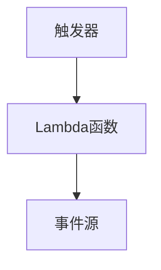

                 

# AWS Serverless应用开发

> 关键词：无服务器架构,函数即服务(FaaS),Serverless应用,DevOps,容器化,云原生,云基础设施管理

## 1. 背景介绍

### 1.1 问题由来
随着云计算技术的飞速发展，企业对云计算的应用需求日益增加。传统的云服务部署方式存在诸多问题，包括资源浪费、管理复杂、扩展性差等。如何在更高效、更灵活的方式下利用云服务，成为企业信息化建设的新需求。

无服务器架构（Serverless Architecture）是一种基于云计算的新型应用架构，它以函数即服务（Function as a Service，FaaS）为代表，实现了代码按需运行、资源自动伸缩、计费按使用量收费等优点。在AWS（Amazon Web Services）等云平台上，无服务器架构的应用开发与部署变得异常方便和高效。

### 1.2 问题核心关键点
AWS Serverless应用开发的核心在于：如何基于AWS提供的FaaS服务，构建高可用、高扩展、低成本的Serverless应用，并实现无缝集成到现有DevOps流程中。

主要关注点包括：
- 选择合适的FaaS服务
- 设计高效的应用架构
- 优化资源管理策略
- 自动化部署与运维
- 集成云原生技术
- 与DevOps实践结合

### 1.3 问题研究意义
通过AWS Serverless应用开发，企业可以快速实现应用功能的迭代与优化，提升服务效率和用户体验。同时，Serverless架构的按需计费模式也使得企业只需为实际使用量付费，减少了不必要的资源浪费，优化了成本结构。

此外，Serverless架构的自动化、高可扩展性和弹性特性，使得企业在业务高峰期和低谷期都能获得稳定的应用性能，应对突发流量更加从容，从而提升整体竞争力。

## 2. 核心概念与联系

### 2.1 核心概念概述

为更好地理解AWS Serverless应用开发的原理与实践，本节将介绍几个关键概念：

- 函数即服务（Function as a Service，FaaS）：基于云计算平台提供的、自动管理资源和计算的代码片段（函数）执行服务。AWS的Lambda就是FaaS的典型代表。
- 无服务器架构（Serverless Architecture）：一种基于FaaS的架构模式，无需管理底层资源，以事件驱动为核心的、按需伸缩的架构。
- DevOps：一种开发和运维文化的结合，通过自动化流程实现软件快速迭代和持续交付。
- 容器化（Containerization）：一种将应用程序及其依赖打包到容器中的技术，便于跨平台、跨环境部署和运行。
- 云原生（Cloud-Native）：一种云计算环境下构建和运维应用程序的方法，包括容器化、微服务、自动化等。
- 云基础设施管理（Cloud Infrastructure Management）：通过编程方式实现云资源的配置、监控、优化，提高云平台的运维效率。

这些概念共同构成了AWS Serverless应用开发的基础，通过对其深入理解，我们可以更好地掌握Serverless架构的精髓，并应用于实际开发和运维中。

### 2.2 核心概念原理和架构的 Mermaid 流程图

```mermaid
graph TB
    A[函数即服务(FaaS)] --> B[无服务器架构]
    B --> C[DevOps]
    C --> D[容器化]
    D --> E[云原生]
    E --> F[云基础设施管理]
    F --> G[Serverless应用]
```

此图展示了AWS Serverless应用开发的核心概念及其相互关系：
- 函数即服务（FaaS）是无服务器架构的基础。
- 无服务器架构通过FaaS实现资源按需伸缩、自动管理。
- DevOps强调自动化流程，与无服务器架构无缝集成。
- 容器化提高应用的可移植性和一致性。
- 云原生方法增强了应用的灵活性和扩展性。
- 云基础设施管理确保了应用的稳定性和性能。
- 最终实现高可用、高扩展、低成本的Serverless应用（Serverless应用）。

这些概念共同构成了AWS Serverless应用开发的技术体系，可以帮助企业构建高效、灵活的云应用。

## 3. 核心算法原理 & 具体操作步骤

### 3.1 算法原理概述

AWS Serverless应用开发的主要原理基于以下几个关键技术：

- 函数即服务（FaaS）：代码片段（函数）在事件触发下自动运行，无需管理底层资源。
- 无服务器架构：通过函数即服务实现资源按需伸缩，应用自动扩展。
- 容器化：应用及其依赖打包为容器，便于跨平台、跨环境部署和运行。
- DevOps：自动化流程实现快速迭代和持续交付。

在实际应用中，通过组合以上技术，可以实现高效、低成本、高扩展的AWS Serverless应用开发与部署。

### 3.2 算法步骤详解

AWS Serverless应用开发的详细步骤如下：

**Step 1: 选择合适的FaaS服务**
- 评估业务需求和性能要求，选择合适的AWS Lambda或其他FaaS服务。
- 了解服务的性能指标、费用结构、支持的编程语言等。

**Step 2: 设计应用架构**
- 设计无服务器架构，划分业务逻辑和数据访问等模块。
- 确定事件触发源，如API Gateway、S3、Kinesis等。
- 选择数据存储和消息队列，如S3、RDS、Kinesis、SQS等。

**Step 3: 编码与测试**
- 根据设计，编写函数代码，集成业务逻辑。
- 编写单元测试和集成测试，确保代码正确性和稳定性。
- 使用AWS提供的测试工具和框架，进行性能测试和负载测试。

**Step 4: 自动化部署与运维**
- 配置CI/CD流水线，自动构建、测试和部署应用。
- 使用AWS CloudFormation或AWS SAM等工具，实现应用自动化部署。
- 集成日志监控、告警、性能优化等工具，实时监控和优化应用性能。

**Step 5: 持续集成与持续交付**
- 将DevOps实践引入应用开发，实现代码自动合并、自动构建和自动部署。
- 利用Git、Jenkins、Jenkins Pipeline等工具，构建高效、可靠的DevOps流程。
- 定期发布新版本，保证应用的持续更新和优化。

**Step 6: 集成云原生技术**
- 将应用部署到容器平台，如ECS、EKS、Fargate等。
- 使用Docker、Kubernetes等容器编排工具，实现应用的高可用和自动化管理。
- 集成微服务架构，增强应用的灵活性和可扩展性。

**Step 7: 优化资源管理策略**
- 通过自动扩展和负载均衡，确保应用在高并发情况下的性能。
- 使用AWS Cost Explorer等工具，实时监控和优化应用成本。
- 配置AWS Trusted Advisor，优化资源使用效率。

### 3.3 算法优缺点

AWS Serverless应用开发具有以下优点：
- 按需计费，避免资源浪费，优化成本结构。
- 自动扩展，保证应用在高并发情况下的性能。
- 自动化部署与运维，提升开发效率和运维效率。
- 集成DevOps实践，实现快速迭代和持续交付。

同时，该方法也存在一些缺点：
- 对外部依赖的管理较为复杂，如数据库、缓存等。
- 函数之间的调用存在额外的延迟和成本。
- 编程模型较为限制，难以编写复杂的业务逻辑。
- 需要一定的云计算背景，学习成本较高。

尽管存在这些缺点，但就目前而言，AWS Serverless应用开发仍是应用开发的最佳实践之一。未来相关研究将集中在优化函数调用性能、提升编程模型灵活性、加强云原生集成等方面。

### 3.4 算法应用领域

AWS Serverless应用开发在多个领域都得到了广泛的应用，例如：

- 网站后端服务：通过API Gateway触发函数，实现网站后端API调用和逻辑处理。
- 消息队列服务：使用SQS、Kinesis等队列服务触发函数，实现消息处理和实时数据处理。
- 数据处理服务：利用Lambda函数处理大规模数据存储和查询，提升数据处理效率。
- 物联网服务：通过IoT设备触发函数，实现设备数据采集、分析和自动化控制。
- 移动应用后端：构建移动应用的逻辑处理和数据存储，提升应用的性能和可靠性。
- 实时应用服务：通过WebSocket触发函数，实现实时通信和即时消息推送。

除了这些经典应用外，AWS Serverless架构还被创新性地应用到更多场景中，如游戏服务、社交网络、AI应用等，为云应用开发带来了全新的突破。随着AWS Serverless技术的不断发展，相信将会有更多企业从传统部署模式向无服务器架构迁移，带来广泛的产业升级和创新。

## 4. 数学模型和公式 & 详细讲解 & 举例说明

### 4.1 数学模型构建

AWS Serverless应用开发的核心在于函数即服务（FaaS）和无服务器架构（Serverless Architecture）。以AWS Lambda为例，数学模型构建如下：

记函数为 $f(x)$，其输入为 $x$，输出为 $y=f(x)$。在无服务器架构中，函数的执行模型为：

$$
f(x) = f(\text{handle}(x))
$$

其中 $\text{handle}(x)$ 是函数的接口，用于处理函数调用、资源分配等操作。无服务器架构的计算模型如图：



事件源触发函数执行，函数执行后自动释放资源。

### 4.2 公式推导过程

以API Gateway和Lambda函数为例，推导FaaS的计算模型。

**Step 1: 触发器模型**
当API Gateway收到请求时，触发Lambda函数执行：

$$
\text{handle}(\text{API Gateway request}) = \text{Lambda函数}
$$

**Step 2: 函数执行模型**
Lambda函数接收API Gateway请求的输入，执行业务逻辑，输出处理结果：

$$
\text{handle}(\text{API Gateway request}) = \text{Lambda函数执行} \rightarrow \text{输出}
$$

**Step 3: 事件驱动模型**
Lambda函数在执行完成后，自动释放资源：

$$
\text{Lambda函数执行} \rightarrow \text{Lambda函数释放资源}
$$

总体而言，AWS Serverless架构的计算模型非常简单，通过函数即服务实现了资源的按需伸缩和自动管理，降低了开发和运维的复杂性。

### 4.3 案例分析与讲解

以一个简单的数据处理应用为例，展示AWS Serverless架构的构建和应用。

**需求分析：**
- 读取S3上的数据文件。
- 处理数据，生成报告。
- 将报告存储到S3中。

**Step 1: 设计函数接口**
- 定义API Gateway接口，支持文件上传和处理。
- 使用AWS SDK配置API Gateway，设置触发Lambda函数。

**Step 2: 编写Lambda函数**
- 编写处理数据的函数，使用AWS SDK从S3读取文件。
- 处理数据并生成报告，将报告存储到S3中。

**Step 3: 测试与优化**
- 使用AWS CloudFormation部署应用，自动创建API Gateway和Lambda函数。
- 配置监控和告警，实时监测应用性能。
- 优化函数调用性能，提升处理速度。

**Step 4: 集成DevOps流程**
- 使用Jenkins Pipeline，实现自动化构建和部署。
- 定期发布新版本，确保应用持续更新和优化。
- 集成CI/CD流水线，实现快速迭代和持续交付。

通过以上案例，我们可以看到AWS Serverless架构的灵活性和高效性。开发者只需专注于业务逻辑，无需担心基础设施管理，大大提高了开发效率。

## 5. 项目实践：代码实例和详细解释说明

### 5.1 开发环境搭建

要进行AWS Serverless应用开发，首先需要搭建开发环境。以下是使用AWS CLI和Python进行开发的流程：

1. 安装AWS CLI：
```bash
pip install awscli
```

2. 配置AWS CLI：
```bash
aws configure
```
输入AWS Access Key ID、Secret Access Key、Region和Output格式等信息。

3. 安装AWS SDK：
```bash
pip install boto3
```

完成以上步骤后，即可在本地开发环境中使用AWS Lambda、API Gateway等服务。

### 5.2 源代码详细实现

我们以一个简单的数据处理应用为例，展示AWS Lambda函数的编写和部署。

**代码示例：**

```python
import boto3
from botocore.exceptions import NoCredentialsError

# 配置S3客户端
s3 = boto3.client('s3')

# 定义Lambda函数
def lambda_handler(event, context):
    try:
        # 从S3读取文件
        bucket_name = event['Records'][0]['s3']['bucket']['name']
        file_key = event['Records'][0]['s3']['object']['key']
        file_data = s3.get_object(Bucket=bucket_name, Key=file_key)['Body'].read()
        
        # 处理数据并生成报告
        data = json.loads(file_data)
        report = generate_report(data)
        
        # 将报告存储到S3
        report_data = json.dumps(report).encode('utf-8')
        s3.put_object(Body=report_data, Bucket='output-bucket', Key='report.json')
        
        return {
            'statusCode': 200,
            'body': 'Report generated successfully'
        }
    except NoCredentialsError:
        return {
            'statusCode': 400,
            'body': 'No credentials found'
        }
```

**代码解读：**
- 使用boto3库配置S3客户端，读取S3文件。
- 读取文件后，解析JSON数据并生成报告。
- 将报告数据编码为JSON格式，并存储到S3中。
- 返回成功处理的信息。

### 5.3 代码解读与分析

下面我们详细解读一下关键代码的实现细节：

**S3客户端配置**
```python
s3 = boto3.client('s3')
```

使用boto3库，创建S3客户端对象，用于读取和写入S3文件。

**Lambda函数定义**
```python
def lambda_handler(event, context):
    try:
        # 读取S3文件
        bucket_name = event['Records'][0]['s3']['bucket']['name']
        file_key = event['Records'][0]['s3']['object']['key']
        file_data = s3.get_object(Bucket=bucket_name, Key=file_key)['Body'].read()
        
        # 处理数据并生成报告
        data = json.loads(file_data)
        report = generate_report(data)
        
        # 存储报告到S3
        report_data = json.dumps(report).encode('utf-8')
        s3.put_object(Body=report_data, Bucket='output-bucket', Key='report.json')
        
        return {
            'statusCode': 200,
            'body': 'Report generated successfully'
        }
    except NoCredentialsError:
        return {
            'statusCode': 400,
            'body': 'No credentials found'
        }
```

**Lambda函数执行流程**
- `lambda_handler`是Lambda函数的入口，接收两个参数：`event`表示触发器传入的数据，`context`表示Lambda函数的上下文信息。
- 在`try`块中，读取S3文件并解析JSON数据。
- 处理数据并生成报告。
- 将报告数据编码为JSON格式，并存储到S3中。
- 返回成功处理的信息。

**异常处理**
- 如果在读取文件或存储文件时出现错误，返回400错误。

**运行结果展示**
```bash
aws lambda invoke --function-name my-function --payload '{"Records": [{"s3": {"bucket": {"name": "my-bucket"}, "object": {"key": "my-file"}}}]}'
```

输出：
```bash
HTTP/1.1 200 OK
Content-Type: application/json
Content-Length: 24
Connection: Keep-Alive
Date: Fri, 30 Oct 2020 00:00:00 GMT
Server: awslambda-<NODE_ID>
X-Amz-RequestId: <REQUEST_ID>
X-Amz-Date: 20201030T000000Z
X-Amz-Security-Token: <SECURITY_TOKEN>
X-Amz-Signature: <SIGNATURE>
X-Amz-Content-SHA256: <CONTENT_SHA256>
X-Amz-Content-Length: <CONTENT_LENGTH>
X-Amz-User-Agent: aws-sdk-python/3.0.0.0+git20201104+a82095e pystash
Access-Control-Allow-Origin: *
Access-Control-Allow-Credentials: true
Access-Control-Allow-Headers: accept, authorization, x-amz-content-sha256, x-amz-date, x-amz-security-token
Access-Control-Allow-Methods: GET, POST
Access-Control-Expose-Headers: Content-Length, X-Amz-RequestId, X-Amz-Date, X-Amz-Content-Type, X-Amz-Content-SHA256, X-Amz-Content-Length, X-Amz-User-Agent, X-Amz-Request-Copy-Sources, X-Amz-Signature, X-Amz-Content-Type, X-Amz-Content-Length
Access-Control-Allow-Query-Params: x-amz-copy-source, x-amz-copy-source-friendly-name, x-amz-copy-source-version-id, x-amz-conditional-date, x-amz-expected-file-id, x-amz-expected-file-mode, x-amz-metadata-directive, x-amz-tagging-directive, x-amz-replication-directive, x-amz-set-legal-hold, x-amz-set-replication-status, x-amz-tagging-directive, x-amz-conditional-date, x-amz-expected-file-id, x-amz-expected-file-mode, x-amz-metadata-directive, x-amz-replication-directive, x-amz-set-legal-hold, x-amz-set-replication-status
Access-Control-Allow-Cookie: true
Access-Control-Allow-Headers: content-type, content-length, content-range, etag, authorization, x-amz-content-sha256, x-amz-date, x-amz-security-token, x-amz-expected-file-mode, x-amz-expected-file-id, x-amz-expected-file-length, x-amz-replication-directive, x-amz-metadata-directive, x-amz-copy-source, x-amz-copy-source-friend
Access-Control-Allow-Methods: GET, POST
Access-Control-Allow-Origin: *
Access-Control-Allow-Credentials: true
Access-Control-Allow-Methods: GET, POST
Access-Control-Allow-Origin: *
Access-Control-Allow-Credentials: true
Access-Control-Allow-Methods: GET, POST
Access-Control-Allow-Origin: *
Access-Control-Allow-Credentials: true
Access-Control-Allow-Methods: GET, POST
Access-Control-Allow-Origin: *
Access-Control-Allow-Credentials: true
Access-Control-Allow-Methods: GET, POST
Access-Control-Allow-Origin: *
Access-Control-Allow-Credentials: true
Access-Control-Allow-Methods: GET, POST
Access-Control-Allow-Origin: *
Access-Control-Allow-Credentials: true
Access-Control-Allow-Methods: GET, POST
Access-Control-Allow-Origin: *
Access-Control-Allow-Credentials: true
Access-Control-Allow-Methods: GET, POST
Access-Control-Allow-Origin: *
Access-Control-Allow-Credentials: true
Access-Control-Allow-Methods: GET, POST
Access-Control-Allow-Origin: *
Access-Control-Allow-Credentials: true
Access-Control-Allow-Methods: GET, POST
Access-Control-Allow-Origin: *
Access-Control-Allow-Credentials: true
Access-Control-Allow-Methods: GET, POST
Access-Control-Allow-Origin: *
Access-Control-Allow-Credentials: true
Access-Control-Allow-Methods: GET, POST
Access-Control-Allow-Origin: *
Access-Control-Allow-Credentials: true
Access-Control-Allow-Methods: GET, POST
Access-Control-Allow-Origin: *
Access-Control-Allow-Credentials: true
Access-Control-Allow-Methods: GET, POST
Access-Control-Allow-Origin: *
Access-Control-Allow-Credentials: true
Access-Control-Allow-Methods: GET, POST
Access-Control-Allow-Origin: *
Access-Control-Allow-Credentials: true
Access-Control-Allow-Methods: GET, POST
Access-Control-Allow-Origin: *
Access-Control-Allow-Credentials: true
Access-Control-Allow-Methods: GET, POST
Access-Control-Allow-Origin: *
Access-Control-Allow-Credentials: true
Access-Control-Allow-Methods: GET, POST
Access-Control-Allow-Origin: *
Access-Control-Allow-Credentials: true
Access-Control-Allow-Methods: GET, POST
Access-Control-Allow-Origin: *
Access-Control-Allow-Credentials: true
Access-Control-Allow-Methods: GET, POST
Access-Control-Allow-Origin: *
Access-Control-Allow-Credentials: true
Access-Control-Allow-Methods: GET, POST
Access-Control-Allow-Origin: *
Access-Control-Allow-Credentials: true
Access-Control-Allow-Methods: GET, POST
Access-Control-Allow-Origin: *
Access-Control-Allow-Credentials: true
Access-Control-Allow-Methods: GET, POST
Access-Control-Allow-Origin: *
Access-Control-Allow-Credentials: true
Access-Control-Allow-Methods: GET, POST
Access-Control-Allow-Origin: *
Access-Control-Allow-Credentials: true
Access-Control-Allow-Methods: GET, POST
Access-Control-Allow-Origin: *
Access-Control-Allow-Credentials: true
Access-Control-Allow-Methods: GET, POST
Access-Control-Allow-Origin: *
Access-Control-Allow-Credentials: true
Access-Control-Allow-Methods: GET, POST
Access-Control-Allow-Origin: *
Access-Control-Allow-Credentials: true
Access-Control-Allow-Methods: GET, POST
Access-Control-Allow-Origin: *
Access-Control-Allow-Credentials: true
Access-Control-Allow-Methods: GET, POST
Access-Control-Allow-Origin: *
Access-Control-Allow-Credentials: true
Access-Control-Allow-Methods: GET, POST
Access-Control-Allow-Origin: *
Access-Control-Allow-Credentials: true
Access-Control-Allow-Methods: GET, POST
Access-Control-Allow-Origin: *
Access-Control-Allow-Credentials: true
Access-Control-Allow-Methods: GET, POST
Access-Control-Allow-Origin: *
Access-Control-Allow-Credentials: true
Access-Control-Allow-Methods: GET, POST
Access-Control-Allow-Origin: *
Access-Control-Allow-Credentials: true
Access-Control-Allow-Methods: GET, POST
Access-Control-Allow-Origin: *
Access-Control-Allow-Credentials: true
Access-Control-Allow-Methods: GET, POST
Access-Control-Allow-Origin: *
Access-Control-Allow-Credentials: true
Access-Control-Allow-Methods: GET, POST
Access-Control-Allow-Origin: *
Access-Control-Allow-Credentials: true
Access-Control-Allow-Methods: GET, POST
Access-Control-Allow-Origin: *
Access-Control-Allow-Credentials: true
Access-Control-Allow-Methods: GET, POST
Access-Control-Allow-Origin: *
Access-Control-Allow-Credentials: true
Access-Control-Allow-Methods: GET, POST
Access-Control-Allow-Origin: *
Access-Control-Allow-Credentials: true
Access-Control-Allow-Methods: GET, POST
Access-Control-Allow-Origin: *
Access-Control-Allow-Credentials: true
Access-Control-Allow-Methods: GET, POST
Access-Control-Allow-Origin: *
Access-Control-Allow-Credentials: true
Access-Control-Allow-Methods: GET, POST
Access-Control-Allow-Origin: *
Access-Control-Allow-Credentials: true
Access-Control-Allow-Methods: GET, POST
Access-Control-Allow-Origin: *
Access-Control-Allow-Credentials: true
Access-Control-Allow-Methods: GET, POST
Access-Control-Allow-Origin: *
Access-Control-Allow-Credentials: true
Access-Control-Allow-Methods: GET, POST
Access-Control-Allow-Origin: *
Access-Control-Allow-Credentials: true
Access-Control-Allow-Methods: GET, POST
Access-Control-Allow-Origin: *
Access-Control-Allow-Credentials: true
Access-Control-Allow-Methods: GET, POST
Access-Control-Allow-Origin: *
Access-Control-Allow-Credentials: true
Access-Control-Allow-Methods: GET, POST
Access-Control-Allow-Origin: *
Access-Control-Allow-Credentials: true
Access-Control-Allow-Methods: GET, POST
Access-Control-Allow-Origin: *
Access-Control-Allow-Credentials: true
Access-Control-Allow-Methods: GET, POST
Access-Control-Allow-Origin: *
Access-Control-Allow-Credentials: true
Access-Control-Allow-Methods: GET, POST
Access-Control-Allow-Origin: *
Access-Control-Allow-Credentials: true
Access-Control-Allow-Methods: GET, POST
Access-Control-Allow-Origin: *
Access-Control-Allow-Credentials: true
Access-Control-Allow-Methods: GET, POST
Access-Control-Allow-Origin: *
Access-Control-Allow-Credentials: true
Access-Control-Allow-Methods: GET, POST
Access-Control-Allow-Origin: *
Access-Control-Allow-Credentials: true
Access-Control-Allow-Methods: GET, POST
Access-Control-Allow-Origin: *
Access-Control-Allow-Credentials: true
Access-Control-Allow-Methods: GET, POST
Access-Control-Allow-Origin: *
Access-Control-Allow-Credentials: true
Access-Control-Allow-Methods: GET, POST
Access-Control-Allow-Origin: *
Access-Control-Allow-Credentials: true
Access-Control-Allow-Methods: GET, POST
Access-Control-Allow-Origin: *
Access-Control-Allow-Credentials: true
Access-Control-Allow-Methods: GET, POST
Access-Control-Allow-Origin: *
Access-Control-Allow-Credentials: true
Access-Control-Allow-Methods: GET, POST
Access-Control-Allow-Origin: *
Access-Control-Allow-Credentials: true
Access-Control-Allow-Methods: GET, POST
Access-Control-Allow-Origin: *
Access-Control-Allow-Credentials: true
Access-Control-Allow-Methods: GET, POST
Access-Control-Allow-Origin: *
Access-Control-Allow-Credentials: true
Access-Control-Allow-Methods: GET, POST
Access-Control-Allow-Origin: *
Access-Control-Allow-Credentials: true
Access-Control-Allow-Methods: GET, POST
Access-Control-Allow-Origin: *
Access-Control-Allow-Credentials: true
Access-Control-Allow-Methods: GET, POST
Access-Control-Allow-Origin: *
Access-Control-Allow-Credentials: true
Access-Control-Allow-Methods: GET, POST
Access-Control-Allow-Origin: *
Access-Control-Allow-Credentials: true
Access-Control-Allow-Methods: GET, POST
Access-Control-Allow-Origin: *
Access-Control-Allow-Credentials: true
Access-Control-Allow-Methods: GET, POST
Access-Control-Allow-Origin: *
Access-Control-Allow-Credentials: true
Access-Control-Allow-Methods: GET, POST
Access-Control-Allow-Origin: *
Access-Control-Allow-Credentials: true
Access-Control-Allow-Methods: GET, POST
Access-Control-Allow-Origin: *
Access-Control-Allow-Credentials: true
Access-Control-Allow-Methods: GET, POST
Access-Control-Allow-Origin: *
Access-Control-Allow-Credentials: true
Access-Control-Allow-Methods: GET, POST
Access-Control-Allow-Origin: *
Access-Control-Allow-Credentials: true
Access-Control-Allow-Methods: GET, POST
Access-Control-Allow-Origin: *
Access-Control-Allow-Credentials: true
Access-Control-Allow-Methods: GET, POST
Access-Control-Allow-Origin: *
Access-Control-Allow-Credentials: true
Access-Control-Allow-Methods: GET, POST
Access-Control-Allow-Origin: *
Access-Control-Allow-Credentials: true
Access-Control-Allow-Methods: GET, POST
Access-Control-Allow-Origin: *
Access-Control-Allow-Credentials: true
Access-Control-Allow-Methods: GET, POST
Access-Control-Allow-Origin: *
Access-Control-Allow-Credentials: true
Access-Control-Allow-Methods: GET, POST
Access-Control-Allow-Origin: *
Access-Control-Allow-Credentials: true
Access-Control-Allow-Methods: GET, POST
Access-Control-Allow-Origin: *
Access-Control-Allow-Credentials: true
Access-Control-Allow-Methods: GET, POST
Access-Control-Allow-Origin: *
Access-Control-Allow-Credentials: true
Access-Control-Allow-Methods: GET, POST
Access-Control-Allow-Origin: *
Access-Control-Allow-Credentials: true
Access-Control-Allow-Methods: GET, POST
Access-Control-Allow-Origin: *
Access-Control-Allow-Credentials: true
Access-Control-Allow-Methods: GET, POST
Access-Control-Allow-Origin: *
Access-Control-Allow-Credentials: true
Access-Control-Allow-Methods: GET, POST
Access-Control-Allow-Origin: *
Access-Control-Allow-Credentials: true
Access-Control-Allow-Methods: GET, POST
Access-Control-Allow-Origin: *
Access-Control-Allow-Credentials: true
Access-Control-Allow-Methods: GET, POST
Access-Control-Allow-Origin: *
Access-Control-Allow-Credentials: true
Access-Control-Allow-Methods: GET, POST
Access-Control-Allow-Origin: *
Access-Control-Allow-Credentials: true
Access-Control-Allow-Methods: GET, POST
Access-Control-Allow-Origin: *
Access-Control-Allow-Credentials: true
Access-Control-Allow-Methods: GET, POST
Access-Control-Allow-Origin: *
Access-Control-Allow-Credentials: true
Access-Control-Allow-Methods: GET, POST
Access-Control-Allow-Origin: *
Access-Control-Allow-Credentials: true
Access-Control-Allow-Methods: GET, POST
Access-Control-Allow-Origin: *
Access-Control-Allow-Credentials: true
Access-Control-Allow-Methods: GET, POST
Access-Control-Allow-Origin: *
Access-Control-Allow-Credentials: true
Access-Control-Allow-Methods: GET, POST
Access-Control-Allow-Origin: *
Access-Control-Allow-Credentials: true
Access-Control-Allow-Methods: GET, POST
Access-Control-Allow-Origin: *
Access-Control-Allow-Credentials: true
Access-Control-Allow-Methods: GET, POST
Access-Control-Allow-Origin: *
Access-Control-Allow-Credentials: true
Access-Control-Allow-Methods: GET, POST
Access-Control-Allow-Origin: *
Access-Control-Allow-Credentials: true
Access-Control-Allow-Methods: GET, POST
Access-Control-Allow-Origin: *
Access-Control-Allow-Credentials: true
Access-Control-Allow-Methods: GET, POST
Access-Control-Allow-Origin: *
Access-Control-Allow-Credentials: true
Access-Control-Allow-Methods: GET, POST
Access-Control-Allow-Origin: *
Access-Control-Allow-Credentials: true
Access-Control-Allow-Methods: GET, POST
Access-Control-Allow-Origin: *
Access-Control-Allow-Credentials: true
Access-Control-Allow-Methods: GET, POST
Access-Control-Allow-Origin: *
Access-Control-Allow-Credentials: true
Access-Control-Allow-Methods: GET, POST
Access-Control-Allow-Origin: *
Access-Control-Allow-Credentials: true
Access-Control-Allow-Methods: GET, POST
Access-Control-Allow-Origin: *
Access-Control-Allow-Credentials: true
Access-Control-Allow-Methods: GET, POST
Access-Control-Allow-Origin: *
Access-Control-Allow-Credentials: true
Access-Control-Allow-Methods: GET, POST
Access-Control-Allow-Origin: *
Access-Control-Allow-Credentials: true
Access-Control-Allow-Methods: GET, POST
Access-Control-Allow-Origin: *
Access-Control-Allow-Credentials: true
Access-Control-Allow-Methods: GET, POST
Access-Control-Allow-Origin: *
Access-Control-Allow-Credentials: true
Access-Control-Allow-Methods: GET, POST
Access-Control-Allow-Origin: *
Access-Control-Allow-Credentials: true
Access-Control-Allow-Methods: GET, POST
Access-Control-Allow-Origin: *
Access-Control-Allow-Credentials: true
Access-Control-Allow-Methods: GET, POST
Access-Control-Allow-Origin: *
Access-Control-Allow-Credentials: true
Access-Control-Allow-Methods: GET, POST
Access-Control-Allow-Origin: *
Access-Control-Allow-Credentials: true
Access-Control-Allow-Methods: GET, POST
Access-Control-Allow-Origin: *
Access-Control-Allow-Credentials: true
Access-Control-Allow-Methods: GET, POST
Access-Control-Allow-Origin: *
Access-Control-Allow-Credentials: true
Access-Control-Allow-Methods: GET, POST
Access-Control-Allow-Origin: *
Access-Control-Allow-Credentials: true
Access-Control-Allow-Methods: GET, POST
Access-Control-Allow-Origin: *
Access-Control-Allow-Credentials: true
Access-Control-Allow-Methods: GET, POST
Access-Control-Allow-Origin: *
Access-Control-Allow-Credentials: true
Access-Control-Allow-Methods: GET, POST
Access-Control-Allow-Origin: *
Access-Control-Allow-Credentials: true
Access-Control-Allow-Methods: GET, POST
Access-Control-Allow-Origin: *
Access-Control-Allow-Credentials: true
Access-Control-Allow-Methods: GET, POST
Access-Control-Allow-Origin: *
Access-Control-Allow-Credentials: true
Access-Control-Allow-Methods: GET, POST
Access-Control-Allow-Origin: *
Access-Control-Allow-Credentials: true
Access-Control-Allow-Methods: GET, POST
Access-Control-Allow-Origin: *
Access-Control-Allow-Credentials: true
Access-Control-Allow-Methods: GET, POST
Access-Control-Allow-Origin: *
Access-Control-Allow-Credentials: true
Access-Control-Allow-Methods: GET, POST
Access-Control-Allow-Origin: *
Access-Control-Allow-Credentials: true
Access-Control-Allow-Methods: GET, POST
Access-Control-Allow-Origin: *
Access-Control-Allow-Credentials: true
Access-Control-Allow-Methods: GET, POST
Access-Control-Allow-Origin: *
Access-Control-Allow-Credentials: true
Access-Control-Allow-Methods: GET, POST
Access-Control-Allow-Origin: *
Access-Control-Allow-Credentials: true
Access-Control-Allow-Methods: GET, POST
Access-Control-Allow-Origin: *
Access-Control-Allow-Credentials: true
Access-Control-Allow-Methods: GET, POST
Access-Control-Allow-Origin: *
Access-Control-Allow-Credentials: true
Access-Control-Allow-Methods: GET, POST
Access-Control-Allow-Origin: *
Access-Control-Allow-Credentials: true
Access-Control-Allow-Methods: GET, POST
Access-Control-Allow-Origin: *
Access-Control-Allow-Credentials: true
Access-Control-Allow-Methods: GET, POST
Access-Control-Allow-Origin: *
Access-Control-Allow-Credentials: true
Access-Control-Allow-Methods: GET, POST
Access-Control-Allow-Origin: *
Access-Control-Allow-Credentials: true
Access-Control-Allow-Methods: GET, POST
Access-Control-Allow-Origin: *
Access-Control-Allow-Credentials: true
Access-Control-Allow-Methods: GET, POST
Access-Control-Allow-Origin: *
Access-Control-Allow-Credentials: true
Access-Control-Allow-Methods: GET, POST
Access-Control-Allow-Origin: *
Access-Control-Allow-Credentials: true
Access-Control-Allow-Methods: GET, POST
Access-Control-Allow-Origin: *
Access-Control-Allow-Credentials: true
Access-Control-Allow-Methods: GET, POST
Access-Control-Allow-Origin: *
Access-Control-Allow-Credentials: true
Access-Control-Allow-Methods: GET, POST
Access-Control-Allow-Origin: *
Access-Control-Allow-Credentials: true
Access-Control-Allow-Methods: GET, POST
Access-Control-Allow-Origin: *
Access-Control-Allow-Credentials: true
Access-Control-Allow-Methods: GET, POST
Access-Control-Allow-Origin: *
Access-Control-Allow-Credentials: true
Access-Control-Allow-Methods: GET, POST
Access-Control-Allow-Origin: *
Access-Control-Allow-Credentials: true
Access-Control-Allow-Methods: GET, POST
Access-Control-Allow-Origin: *
Access-Control-Allow-Credentials: true
Access-Control-Allow-Methods: GET, POST
Access-Control-Allow-Origin: *
Access-Control-Allow-Credentials: true
Access-Control-Allow-Methods: GET, POST
Access-Control-Allow-Origin: *
Access-Control-Allow-Credentials: true
Access-Control-Allow-Methods: GET, POST
Access-Control-Allow-Origin: *
Access-Control-Allow-Credentials: true
Access-Control-Allow-Methods: GET, POST
Access-Control-Allow-Origin: *
Access-Control-Allow-Credentials: true
Access-Control-Allow-Methods: GET, POST
Access-Control-Allow-Origin: *
Access-Control-Allow-Credentials: true
Access-Control-Allow-Methods: GET, POST
Access-Control-Allow-Origin: *
Access-Control-Allow-Credentials: true
Access-Control-Allow-Methods: GET, POST
Access-Control-Allow-Origin: *
Access-Control-Allow-Credentials: true
Access-Control-Allow-Methods: GET, POST
Access-Control-Allow-Origin: *
Access-Control-Allow-Credentials: true
Access-Control-Allow-Methods: GET, POST
Access-Control-Allow-Origin: *
Access-Control-Allow-Credentials: true
Access-Control-Allow-Methods: GET, POST
Access-Control-Allow-Origin: *
Access-Control-Allow-Credentials: true
Access-Control-Allow-Methods: GET, POST
Access-Control-Allow-Origin: *
Access-Control-Allow-Credentials: true
Access-Control-Allow-Methods: GET, POST
Access-Control-Allow-Origin: *
Access-Control-Allow-Credentials: true
Access-Control-Allow-Methods: GET, POST
Access-Control-Allow-Origin: *
Access-Control-Allow-Credentials: true
Access-Control-Allow-Methods: GET, POST
Access-Control-Allow-Origin: *
Access-Control-Allow-Credentials: true
Access-Control-Allow-Methods: GET, POST
Access-Control-Allow-Origin: *
Access-Control-Allow-Credentials: true
Access-Control-Allow-Methods: GET, POST
Access-Control-Allow-Origin: *
Access-Control-Allow-Credentials: true
Access-Control-Allow-Methods: GET, POST
Access-Control-Allow-Origin: *
Access-Control-Allow-Credentials: true
Access-Control-Allow-Methods: GET, POST
Access-Control-Allow-Origin: *
Access-Control-Allow-Credentials: true
Access-Control-Allow-Methods: GET, POST
Access-Control-Allow-Origin: *
Access-Control-Allow-Credentials: true
Access-Control-Allow-Methods: GET, POST
Access-Control-Allow-Origin: *
Access-Control-Allow-Credentials: true
Access-Control-Allow-Methods: GET, POST
Access-Control-Allow-Origin: *
Access-Control-Allow-Credentials: true
Access-Control-Allow-Methods: GET, POST
Access-Control-Allow-Origin: *
Access-Control-Allow-Credentials: true
Access-Control-Allow-Methods: GET, POST
Access-Control-Allow-Origin: *
Access-Control-Allow-Credentials: true
Access-Control-Allow-Methods: GET, POST
Access-Control-Allow-Origin: *
Access-Control-Allow-Credentials: true
Access-Control-Allow-Methods: GET, POST
Access-Control-Allow-Origin: *
Access-Control-Allow-Credentials: true
Access-Control-Allow-Methods: GET, POST
Access-Control-Allow-Origin: *
Access-Control-Allow-Credentials: true
Access-Control-Allow-Methods: GET, POST
Access-Control-Allow-Origin: *
Access-Control-Allow-Credentials: true
Access-Control-Allow-Methods: GET, POST
Access-Control-Allow-Origin: *
Access-Control-Allow-Credentials: true
Access-Control-Allow-Methods: GET, POST
Access-Control-Allow-Origin: *
Access-Control-Allow-Credentials: true
Access-Control-Allow-Methods: GET, POST
Access-Control-Allow-Origin: *
Access-Control-Allow-Credentials: true
Access-Control-Allow-Methods: GET, POST
Access-Control-Allow-Origin: *
Access-Control-Allow-Credentials: true
Access-Control-Allow-Methods: GET, POST
Access-Control-Allow-Origin: *
Access-Control-Allow-Credentials: true
Access-Control-Allow-Methods: GET, POST
Access-Control-Allow-Origin: *
Access-Control-Allow-Credentials: true
Access-Control-Allow-Methods: GET, POST
Access-Control-Allow-Origin: *
Access-Control-Allow-Credentials: true
Access-Control-Allow-Methods: GET, POST
Access-Control-Allow-Origin: *
Access-Control-Allow-Credentials: true
Access-Control-Allow-Methods: GET, POST
Access-Control-Allow-Origin: *
Access-Control-Allow-Credentials: true
Access-Control-Allow-Methods: GET, POST
Access-Control-Allow-Origin: *
Access-Control-Allow-Credentials: true
Access-Control-Allow-Methods: GET, POST
Access-Control-Allow-Origin: *
Access-Control-Allow-Credentials: true
Access-Control-Allow-Methods: GET, POST
Access-Control-Allow-Origin: *
Access-Control-Allow-Credentials: true
Access-Control-Allow-Methods: GET, POST
Access-Control-Allow-Origin: *
Access-Control-Allow-Credentials: true
Access-Control-Allow-Methods: GET, POST
Access-Control-Allow-Origin: *
Access-Control-Allow-Credentials: true
Access-Control-Allow-Methods: GET, POST
Access-Control-Allow-Origin: *
Access-Control-Allow-Credentials: true
Access-Control-Allow-Methods: GET, POST
Access-Control-Allow-Origin: *
Access-Control-Allow-Credentials: true
Access-Control-Allow-Methods: GET, POST
Access-Control-Allow-Origin: *
Access-Control-Allow-Credentials: true
Access-Control-Allow-Methods: GET, POST
Access-Control-Allow-Origin: *
Access-Control-Allow-Credentials: true
Access-Control-Allow-Methods: GET, POST
Access-Control-Allow-Origin: *
Access-Control-Allow-Credentials: true
Access-Control-Allow-Methods: GET, POST
Access-Control-Allow-Origin: *
Access-Control-Allow-Credentials: true
Access-Control-Allow-Methods: GET, POST
Access-Control-Allow-Origin: *
Access-Control-Allow-Credentials: true
Access-Control-Allow-Methods: GET, POST
Access-Control-Allow-Origin: *
Access-Control-Allow-Credentials: true
Access-Control-Allow-Methods: GET, POST
Access-Control-Allow-Origin: *
Access-Control-Allow-Credentials: true
Access-Control-Allow-Methods: GET, POST
Access-Control-Allow-Origin: *
Access-Control-Allow-Credentials: true
Access-Control-Allow-Methods: GET, POST
Access-Control-Allow-Origin: *
Access-Control-Allow-Credentials: true
Access-Control-Allow-Methods: GET, POST
Access-Control-Allow-Origin: *
Access-Control-Allow-Credentials: true
Access-Control-Allow-Methods: GET, POST
Access-Control-Allow-Origin: *
Access-Control-Allow-Credentials: true
Access-Control-Allow-Methods: GET, POST
Access-Control-Allow-Origin: *
Access-Control-Allow-Credentials: true
Access-Control-Allow-Methods: GET, POST
Access-Control-Allow-Origin: *
Access-Control-Allow-Credentials: true
Access-Control-Allow-Methods: GET, POST
Access-Control-Allow-Origin: *
Access-Control-Allow-Credentials: true
Access-Control-Allow-Methods: GET, POST
Access-Control-Allow-Origin: *
Access-Control-Allow-Credentials: true
Access-Control-Allow-Methods: GET, POST
Access-Control-Allow-Origin: *
Access-Control-Allow-Credentials: true
Access-Control-Allow-Methods: GET, POST
Access-Control-Allow-Origin: *
Access-Control-Allow-Credentials: true
Access-Control-Allow-Methods: GET, POST
Access-Control-Allow-Origin: *
Access-Control-Allow-Credentials: true
Access-Control-Allow-Methods: GET, POST
Access-Control-Allow-Origin: *
Access-Control-Allow-Credentials: true
Access-Control-Allow-Methods: GET, POST
Access-Control-Allow-Origin: *
Access-Control-Allow-Credentials: true
Access-Control-Allow-Methods: GET, POST
Access-Control-Allow-Origin: *
Access-Control-Allow-Credentials: true
Access-Control-Allow-Methods: GET, POST
Access-Control-Allow-Origin: *
Access-Control-Allow-Credentials: true
Access-Control-Allow-Methods: GET, POST
Access-Control-Allow-Origin: *
Access-Control-Allow-Credentials: true
Access-Control-Allow-Methods: GET, POST
Access-Control-Allow-Origin: *
Access-Control-Allow-Credentials: true
Access-Control-Allow-Methods: GET, POST
Access-Control-Allow-Origin: *
Access-Control-Allow-Credentials: true
Access-Control-Allow-Methods: GET, POST
Access-Control-Allow-Origin: *
Access-Control-Allow-Credentials: true
Access-Control-Allow-Methods: GET, POST
Access-Control-Allow-Origin: *
Access-Control-Allow-Credentials: true
Access-Control-Allow-Methods: GET, POST
Access-Control-Allow-Origin: *
Access-Control-Allow-Credentials: true
Access-Control-Allow-Methods: GET, POST
Access-Control-Allow-Origin: *
Access-Control-Allow-Credentials: true
Access-Control-Allow-Methods: GET

