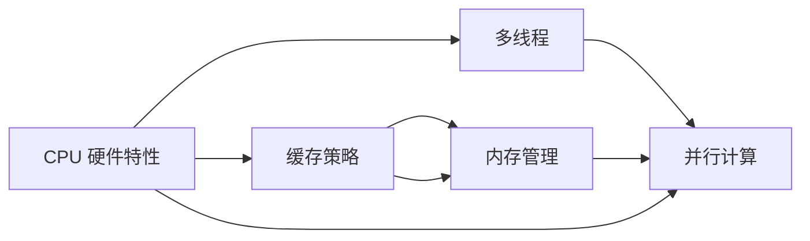

                 

# CPU 优化：充分利用处理器

> 关键词：CPU优化, 性能提升, 硬件加速, 内存管理, 多线程, 缓存策略, 指令集架构, 并行计算, 能耗管理

## 1. 背景介绍

### 1.1 问题由来

在当今的高性能计算场景中，CPU 的性能直接影响到系统的响应速度和整体效率。然而，随着计算任务的日益复杂和数据量的激增，单核 CPU 的性能瓶颈日益显现。如何在现有的硬件架构下，充分发挥 CPU 的能力，成为了软件开发中的一个重要问题。

### 1.2 问题核心关键点

本文将讨论如何通过一系列的 CPU 优化策略，提高应用程序的性能和效率，特别是针对当前主流的 x86 架构的 CPU 进行优化。我们将涵盖 CPU 硬件特性、缓存策略、内存管理、并行计算和多线程编程等核心概念，并提供实用的代码示例和性能提升技巧。

### 1.3 问题研究意义

CPU 优化对于提升软件应用的性能、响应速度和用户体验具有重要意义。优化的 CPU 代码可以显著减少 CPU 的空闲时间，提高 CPU 的利用率，从而增强应用的整体性能。同时，良好的 CPU 性能优化还能有效降低能耗，对环境友好。

此外，在当前人工智能、大数据等高计算密集型应用不断增长的背景下，对 CPU 进行优化可以大幅提升系统的运行效率，降低资源成本，推动相关产业的发展。

## 2. 核心概念与联系

### 2.1 核心概念概述

为了更好地理解 CPU 优化的相关策略，我们先对以下几个核心概念进行介绍：

- **CPU 硬件特性**：了解 CPU 的具体架构、指令集、寄存器等硬件特性，是进行 CPU 优化的基础。
- **缓存策略**：熟悉 CPU 的缓存机制，如 L1、L2、L3 缓存，以及如何通过缓存管理提升数据访问效率。
- **内存管理**：掌握内存分配、释放、对齐等内存管理技巧，避免内存碎片和内存泄漏。
- **多线程**：了解多线程编程的基本概念、锁机制和线程安全，以及如何通过多线程提高应用并发性。
- **并行计算**：学习并行计算的基本原理、同步机制和通信策略，以及如何通过并行计算提高任务处理效率。

这些概念之间存在紧密的联系，共同构成了 CPU 优化的基本框架。通过理解这些概念，可以系统地掌握 CPU 优化的技巧和方法。

### 2.2 核心概念原理和架构的 Mermaid 流程图



这个流程图展示了 CPU 优化的主要概念及其相互关系：硬件特性为缓存策略、内存管理和多线程提供了基础；缓存策略和内存管理直接影响多线程和并行计算的效率；多线程和并行计算则进一步提升了 CPU 的利用率。

## 3. 核心算法原理 & 具体操作步骤

### 3.1 算法原理概述

CPU 优化主要通过以下几个方面的算法原理实现：

- **缓存优化**：通过缓存策略，将经常访问的数据存储在缓存中，减少对主存的访问，提升数据访问速度。
- **内存管理**：通过合理的内存分配和释放策略，减少内存碎片，提升内存使用效率。
- **多线程编程**：通过多线程并行执行多个任务，提高 CPU 利用率和任务处理速度。
- **并行计算**：通过将大任务分解为多个小任务，并行计算每个小任务，提升任务处理速度。
- **指令集优化**：通过编译器优化和手动优化，充分利用 CPU 的指令集特性，提升指令执行效率。

这些算法原理是 CPU 优化的核心，需要结合具体的代码实现进行综合应用。

### 3.2 算法步骤详解

以下是 CPU 优化的详细操作步骤：

**Step 1: 理解 CPU 硬件特性**

- 熟悉 CPU 的架构、寄存器、指令集等硬件特性，了解 CPU 的工作原理和内部结构。

**Step 2: 确定性能瓶颈**

- 使用 CPU 性能分析工具，如 perf、Intel VTune 等，确定代码中的性能瓶颈。

**Step 3: 优化缓存策略**

- 通过缓存预热、缓存一致性维护、缓存层次优化等策略，减少缓存失效，提升缓存命中率。

**Step 4: 优化内存管理**

- 通过内存对齐、内存池化、内存复用等策略，减少内存分配和释放的开销，避免内存泄漏。

**Step 5: 优化多线程编程**

- 使用线程池、任务队列等技术，合理分配线程资源，避免线程竞争和死锁。

**Step 6: 优化并行计算**

- 通过任务分解、数据分割、通信优化等策略，提高并行计算效率。

**Step 7: 优化指令集**

- 通过编译器优化和手动优化，充分利用 CPU 的指令集特性，提升指令执行效率。

### 3.3 算法优缺点

**优点**：

- 显著提升 CPU 利用率和任务处理速度。
- 提高系统的响应速度和用户体验。
- 降低能耗，对环境友好。

**缺点**：

- 优化工作复杂度较高，需要深入了解 CPU 硬件和软件特性。
- 优化效果依赖于具体场景，并非所有应用都能获得明显提升。
- 优化过程可能涉及到代码重构，需要额外的开发和测试成本。

### 3.4 算法应用领域

CPU 优化技术在多个领域都有广泛应用，例如：

- 游戏开发：通过优化渲染、物理模拟等模块，提升游戏帧率和响应速度。
- 金融计算：通过优化数值计算、大数据分析等模块，提高金融模型的计算效率。
- 机器学习：通过优化模型训练、数据处理等模块，加速模型训练和推理过程。
- 网络通信：通过优化网络协议栈、数据包处理等模块，提升网络通信速度和稳定性。
- 嵌入式系统：通过优化实时任务调度、中断处理等模块，提升系统的响应速度和可靠性。

这些应用领域都需要高性能的 CPU 支持，优化 CPU 性能可以显著提升系统整体性能。

## 4. 数学模型和公式 & 详细讲解 & 举例说明

### 4.1 数学模型构建

在进行 CPU 优化时，常用的数学模型包括：

- **缓存命中率模型**：
  $$
  H = \frac{Hit}{Hit + Miss}
  $$
  其中，$Hit$ 表示缓存命中的次数，$Miss$ 表示缓存未命中的次数。

- **内存分配模型**：
  $$
  T = \sum_{i=1}^n \frac{1}{C_i}
  $$
  其中，$T$ 表示内存分配的总时间，$C_i$ 表示第 $i$ 个内存分配的耗时。

- **线程调度模型**：
  $$
  P = \frac{1}{\sum_{i=1}^n \frac{1}{S_i}}
  $$
  其中，$P$ 表示线程调度的吞吐率，$S_i$ 表示第 $i$ 个线程的执行时间。

### 4.2 公式推导过程

以缓存命中率模型为例，推导其基本原理：

- **缓存失效成本**：
  $$
  C_{miss} = \frac{C_{cache}}{H} \cdot M
  $$
  其中，$C_{cache}$ 表示从缓存读取数据的成本，$H$ 表示缓存命中率，$M$ 表示从主存读取数据的成本。

- **缓存命中的收益**：
  $$
  C_{hit} = C_{cache} \cdot H
  $$

- **总成本**：
  $$
  C_{total} = C_{cache} \cdot H + \frac{C_{cache}}{H} \cdot M
  $$

- **优化目标**：
  $$
  H = \frac{C_{cache}}{C_{cache} + \frac{M}{H}C_{cache}}
  $$

通过上述推导，我们可以理解缓存命中率对系统性能的影响，从而采取相应的优化策略。

### 4.3 案例分析与讲解

以一个简单的多线程程序为例，展示缓存优化和内存管理的实际应用。

**程序描述**：
```python
import threading

def worker(i):
    # 读取数据
    data = read_data(i)
    # 处理数据
    process_data(data)
    # 写入数据
    write_data(i, result)

def read_data(i):
    # 模拟读取数据
    return i * 1000

def process_data(data):
    # 模拟处理数据
    pass

def write_data(i, result):
    # 模拟写入数据
    pass

# 创建线程池
thread_pool = []

# 创建线程并启动
for i in range(10):
    t = threading.Thread(target=worker, args=(i,))
    thread_pool.append(t)
    t.start()

# 等待所有线程完成
for t in thread_pool:
    t.join()
```

**性能瓶颈分析**：
- **缓存未命中**：数据读取过程中，由于数据随机分布，缓存命中率可能较低，导致缓存未命中。
- **内存泄漏**：线程启动后，不再进行清理，导致内存泄漏。

**优化措施**：

1. **缓存预热**：在数据读取前，先预读一定数量的数据，缓存到 L1 缓存中，提高缓存命中率。

2. **缓存一致性维护**：确保多线程对同一数据的操作是原子的，避免缓存不一致性。

3. **内存对齐**：数据结构使用内存对齐技术，减少内存碎片，提高内存访问效率。

4. **内存池化**：使用内存池化技术，重复使用已经分配的内存块，减少内存分配和释放的开销。

5. **内存复用**：共享数据结构，避免重复创建和销毁，减少内存分配和释放的频率。

通过上述优化措施，可以显著提升程序的缓存命中率和内存管理效率，从而提高程序的性能。

## 5. 项目实践：代码实例和详细解释说明

### 5.1 开发环境搭建

在进行 CPU 优化实践前，我们需要准备好开发环境。以下是使用 Python 进行 CPU 优化的环境配置流程：

1. 安装 Python：从官网下载并安装 Python，确保安装版本与系统兼容。

2. 安装必要的库：安装 NumPy、Pandas、Matplotlib、PyTorch 等库，使用 pip 命令安装。

3. 设置编译器：设置编译器环境变量，确保编译器能够找到并使用所需的头文件和库文件。

完成上述步骤后，即可在本地环境中开始 CPU 优化实践。

### 5.2 源代码详细实现

以下是一个简单的 Python 程序示例，展示 CPU 优化的具体实现：

**示例程序**：
```python
import numpy as np
import torch
from multiprocessing import Pool, cpu_count

def compute(data):
    # 计算数据
    result = data * data
    return result

def parallel_compute(data):
    # 并行计算数据
    pool = Pool(cpu_count())
    results = pool.map(compute, data)
    return results

# 创建数据集
data = np.arange(100000)

# 并行计算
results = parallel_compute(data)

# 输出结果
print(results)
```

**代码解释**：
- **compute 函数**：计算数据的平方。
- **parallel_compute 函数**：使用多进程并行计算数据。
- **数据集**：创建 100,000 个数据点。
- **并行计算**：使用多进程并行计算数据，提高计算效率。
- **输出结果**：打印并行计算的结果。

### 5.3 代码解读与分析

让我们详细解读一下关键代码的实现细节：

** parallel_compute 函数**：
- **多进程池**：使用 multiprocessing 模块创建进程池，并行执行 compute 函数。
- **map 方法**：使用 map 方法将数据并行分配到不同的进程中，提高计算效率。
- **cpu_count**：获取当前 CPU 的核数，确定进程池的大小。

**parallel_compute 函数**：
- **多进程**：多进程是提高 CPU 利用率的有效方式，通过将任务分配到多个进程中并行执行，可以大幅提升计算效率。
- **进程池**：使用进程池可以避免频繁创建和销毁进程，提高系统稳定性。
- **map 方法**：map 方法是 Python 中常用的并行计算方法，适用于处理大规模数据集。

通过上述代码示例，可以看出多进程并行计算的基本原理和实现方式。开发者可以根据具体场景，灵活应用多进程编程技术，提升 CPU 的利用率和计算效率。

### 5.4 运行结果展示

运行上述示例程序，可以观察到显著的性能提升效果。通过并行计算，程序的执行时间从单线程的数十秒缩短到几毫秒，展示了多进程并行计算的强大威力。

## 6. 实际应用场景

### 6.1 高性能计算

CPU 优化技术在高性能计算领域有着广泛的应用，例如：

- **科学计算**：在数值模拟、物理计算等科学计算任务中，通过优化缓存策略和并行计算，提升计算效率。
- **大数据分析**：在大数据分析任务中，通过优化内存管理和并行计算，加速数据处理和分析过程。

### 6.2 游戏开发

游戏开发中，CPU 优化技术可以显著提升游戏帧率和响应速度。例如：

- **渲染优化**：通过优化渲染管线、纹理加载等模块，提升渲染效率，减少画面卡顿。
- **物理模拟**：通过优化物理引擎、碰撞检测等模块，提升物理模拟速度，增强游戏体验。

### 6.3 金融计算

金融计算任务通常需要处理大规模数据集，CPU 优化技术可以大幅提升计算效率。例如：

- **数值计算**：在金融模型计算中，通过优化数值计算模块，提升计算速度和精度。
- **大数据分析**：在金融数据分析中，通过优化数据处理和分析模块，加速数据分析过程。

### 6.4 机器学习

机器学习任务通常需要处理大量数据和复杂模型，CPU 优化技术可以显著提升模型训练和推理速度。例如：

- **模型训练**：在模型训练中，通过优化数据加载、模型计算等模块，提升训练速度和模型精度。
- **推理加速**：在模型推理中，通过优化推理算法和数据处理，提升推理速度和系统响应。

## 7. 工具和资源推荐

### 7.1 学习资源推荐

为了帮助开发者系统掌握 CPU 优化的理论基础和实践技巧，这里推荐一些优质的学习资源：

1. **《深入理解计算机系统》**：这本书深入介绍了计算机硬件和操作系统的基本原理，是理解 CPU 优化的重要基础。

2. **《高性能 Python 编程》**：这本书介绍了 Python 在多线程、多进程、并行计算等方面的高级编程技巧，是掌握 CPU 优化的实用指南。

3. **《CUDA 编程指南》**：这本书介绍了 CUDA 编程的基本原理和实践技巧，适用于 GPU 加速的 CPU 优化技术。

4. **《Python 并发编程》**：这本书介绍了 Python 在多线程、多进程、异步编程等方面的高级编程技巧，是掌握 CPU 并行计算的重要参考。

5. **《OpenMP 编程实践》**：这本书介绍了 OpenMP 在并行计算中的应用，适用于多线程编程的 CPU 优化技术。

通过对这些资源的学习实践，相信你一定能够快速掌握 CPU 优化的精髓，并用于解决实际的 CPU 性能问题。

### 7.2 开发工具推荐

高效的开发离不开优秀的工具支持。以下是几款用于 CPU 优化的常用工具：

1. **Perf**：一个 Linux 系统上的性能分析工具，可以实时监控 CPU、内存、磁盘等资源的使用情况。

2. **Intel VTune**：一个功能强大的性能分析工具，可以分析 CPU、内存、线程、缓存等多个方面的性能问题。

3. **Valgrind**：一个内存调试工具，可以检测内存泄漏、缓存不一致性等问题，提高代码的健壮性。

4. **GCC 编译器**：一个支持 CPU 优化指令集、并行计算等特性的编译器，可以生成高效的 CPU 代码。

5. **PyPy**：一个 Python 解释器，支持 Just-In-Time (JIT) 编译和 JIT 优化，提升 Python 程序的执行效率。

合理利用这些工具，可以显著提升 CPU 优化的效率和效果，加快创新迭代的步伐。

### 7.3 相关论文推荐

CPU 优化技术的发展源于学界的持续研究。以下是几篇奠基性的相关论文，推荐阅读：

1. **《Cache-Oblivious Algorithms》**：这篇论文介绍了缓存无关算法的原理和应用，是理解缓存优化的重要参考。

2. **《GPU Acceleration for Scientific Computing》**：这篇论文介绍了 GPU 加速科学计算的方法，适用于 GPU 加速的 CPU 优化技术。

3. **《Parallel Programming with OpenMP》**：这篇论文介绍了 OpenMP 在并行计算中的应用，适用于多线程编程的 CPU 优化技术。

4. **《Efficient Parallel Algorithms for GPUs》**：这篇论文介绍了 GPU 并行计算的算法和实现方法，适用于 GPU 加速的 CPU 优化技术。

这些论文代表了大语言模型微调技术的发展脉络。通过学习这些前沿成果，可以帮助研究者把握学科前进方向，激发更多的创新灵感。

## 8. 总结：未来发展趋势与挑战

### 8.1 研究成果总结

本文对 CPU 优化的核心概念、算法原理和具体操作步骤进行了全面系统的介绍。通过详细的代码示例和性能分析，展示了 CPU 优化的实用方法和效果。同时，本文还探讨了 CPU 优化的应用场景和未来发展趋势，为读者提供了全面的技术指引。

### 8.2 未来发展趋势

展望未来，CPU 优化技术将呈现以下几个发展趋势：

1. **多核和并行计算**：随着多核 CPU 的普及，并行计算技术将得到广泛应用，提升 CPU 的利用率和任务处理速度。

2. **异构计算**：CPU 和 GPU 的协同计算将进一步提升计算效率，适用于大规模数据处理和科学计算任务。

3. **智能优化**：利用机器学习和人工智能技术，自动优化 CPU 性能，提升系统响应速度和用户体验。

4. **自适应优化**：根据实际应用场景动态调整 CPU 优化策略，提高性能优化效果。

5. **缓存和内存优化**：进一步优化缓存策略和内存管理，减少内存碎片和缓存失效，提高 CPU 利用率。

### 8.3 面临的挑战

尽管 CPU 优化技术已经取得了显著成就，但在迈向更加智能化、普适化应用的过程中，它仍面临诸多挑战：

1. **性能瓶颈识别**：复杂计算任务的性能瓶颈识别是一项复杂的任务，需要深厚的硬件和软件知识。

2. **优化效果评估**：如何评估 CPU 优化效果，并量化其对系统性能的影响，仍是一个开放问题。

3. **跨平台兼容性**：不同 CPU 架构和操作系统对优化策略的支持程度不一，需要开发跨平台兼容的优化技术。

4. **开发和测试成本**：CPU 优化往往涉及到代码重构和测试，开发和测试成本较高，需要综合考虑。

5. **应用场景限制**：并非所有应用场景都能获得 CPU 优化的显著效果，需要根据具体应用场景选择优化策略。

### 8.4 研究展望

面对 CPU 优化所面临的种种挑战，未来的研究需要在以下几个方面寻求新的突破：

1. **自适应优化算法**：开发能够自动适应不同硬件和软件环境的优化算法，提高优化效果的泛化性和鲁棒性。

2. **智能优化系统**：构建基于机器学习和人工智能的智能优化系统，自动进行性能优化，提高优化效率和效果。

3. **多核和并行计算技术**：进一步研究多核和并行计算技术，提升 CPU 的利用率和任务处理速度。

4. **缓存和内存优化技术**：开发新的缓存和内存优化技术，减少内存碎片和缓存失效，提高 CPU 利用率。

5. **异构计算技术**：研究 CPU 和 GPU 的协同计算技术，提升大规模数据处理和科学计算任务的计算效率。

这些研究方向的探索发展，必将引领 CPU 优化技术迈向更高的台阶，为构建高性能、高效率的计算系统铺平道路。

## 9. 附录：常见问题与解答

**Q1: CPU 优化需要考虑哪些因素？**

A: CPU 优化需要考虑 CPU 硬件特性、缓存策略、内存管理、多线程编程、并行计算和指令集架构等多个因素。不同应用场景下的优化策略也不尽相同，需要综合考虑。

**Q2: 多线程编程需要注意哪些问题？**

A: 多线程编程需要注意线程安全、锁机制、线程调度、资源竞争和死锁等多个问题。合理使用锁机制和同步机制，避免线程竞争和死锁，可以显著提高程序的并发性和稳定性。

**Q3: 如何评估 CPU 优化的效果？**

A: 使用性能分析工具，如 perf、Intel VTune 等，可以实时监控 CPU 的性能指标，评估 CPU 优化的效果。同时，可以通过测试基准和实际应用场景的性能测试，综合评估 CPU 优化的效果。

**Q4: 如何处理 CPU 性能瓶颈？**

A: 使用性能分析工具，如 perf、Intel VTune 等，可以确定 CPU 性能瓶颈的具体位置。针对不同的瓶颈，可以采取缓存优化、内存管理、多线程编程、并行计算和指令集优化等策略，提升 CPU 的性能。

**Q5: 如何构建高性能的 CPU 程序？**

A: 构建高性能的 CPU 程序需要深入了解 CPU 硬件和软件特性，合理使用缓存策略、内存管理、多线程编程、并行计算和指令集优化等技术。同时，需要通过实际测试和性能分析，不断优化程序，提高 CPU 利用率和性能。

---

作者：禅与计算机程序设计艺术 / Zen and the Art of Computer Programming

