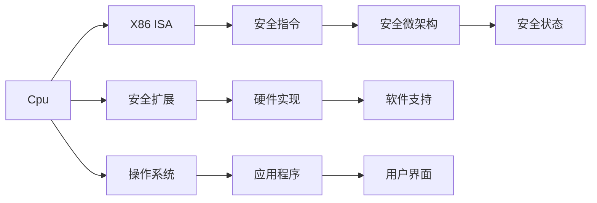

                 

# CPU的安全扩展机制与实现

## 1. 背景介绍

随着计算机技术的发展，计算机系统的安全问题也愈发突显。而CPU作为计算机系统的核心组件，其安全扩展机制的实现对于保护系统免受各种威胁至关重要。本博客将详细探讨CPU安全扩展机制的核心概念、实现原理和典型案例，帮助你深入理解该领域的最新进展。

## 2. 核心概念与联系

### 2.1 核心概念概述

在深入了解CPU安全扩展机制之前，我们需要理解以下核心概念：

- **CPU安全扩展（Security Extensions）**：CPU安全扩展是指在CPU中实现的各种增强安全特性，以防止恶意软件、漏洞等安全威胁。这些特性通常由硬件实现，可以直接影响计算机的安全性。

- **X86指令集架构（X86 ISA）**：X86 ISA是目前使用最广泛的CPU指令集之一，支持广泛应用于个人电脑、服务器等平台。

- **安全指令（Secure Instructions）**：安全指令是在X86 ISA的基础上，通过硬件实现的安全功能，如加密、解密、签名验证等。

- **安全微架构（Secure Microarchitecture）**：安全微架构是CPU内部的特定硬件结构，用于支持安全指令的执行。

- **安全状态（Secure State）**：安全状态是指CPU在执行安全指令时所处的一种安全运行模式。

这些概念通过硬件和软件的紧密结合，共同构成了CPU安全扩展的实现基础。

### 2.2 核心概念原理和架构的 Mermaid 流程图



以上流程图示意了CPU安全扩展机制中硬件和软件的关系，以及它们在安全指令执行中的相互作用。

## 3. 核心算法原理 & 具体操作步骤

### 3.1 算法原理概述

CPU安全扩展的实现原理主要基于以下步骤：

1. **硬件支持**：在CPU内部实现特定的安全硬件结构，用于支持安全指令的执行。

2. **软件实现**：操作系统和应用程序层面的软件提供安全指令的调用和管理系统。

3. **操作系统支持**：操作系统提供必要的接口，使得应用程序可以调用安全指令。

4. **应用程序调用**：应用程序通过操作系统接口调用安全指令，执行特定的安全操作。

5. **用户界面交互**：最终用户通过应用程序界面与系统进行交互，实现最终的安全功能。

这些步骤构成了CPU安全扩展的实现基础，使得CPU能够提供各种增强的安全特性。

### 3.2 算法步骤详解

#### 3.2.1 安全指令的硬件支持

安全指令的硬件支持通常由CPU内部的特定硬件结构实现，如加密引擎、签名验证模块等。这些硬件结构负责执行具体的安全操作。

#### 3.2.2 操作系统安全管理

操作系统提供了必要的接口和机制，用于管理安全指令的执行。例如，操作系统可以控制哪些应用程序可以访问安全指令，以及如何审计和记录安全指令的使用情况。

#### 3.2.3 应用程序安全调用

应用程序通过操作系统的安全接口调用安全指令，执行特定的安全操作。例如，应用程序可以调用加密指令对数据进行加密，或调用签名验证指令验证数据的完整性。

#### 3.2.4 用户界面交互

用户通过应用程序界面与系统进行交互，触发安全指令的执行。例如，用户可以通过图形界面选择加密或签名验证等安全功能。

### 3.3 算法优缺点

#### 3.3.1 优点

1. **硬件加速**：安全指令通常由硬件实现，相较于软件实现，具有更高的执行效率和更低的延迟。

2. **强安全性**：安全指令由硬件直接执行，不受软件环境的影响，能够提供更高的安全性。

3. **可扩展性**：安全扩展机制可以根据不同的安全需求进行定制，具有较好的可扩展性。

#### 3.3.2 缺点

1. **成本高**：实现安全扩展机制需要硬件和软件的双重投入，成本较高。

2. **复杂性高**：安全扩展机制的实现需要深入了解硬件和软件的细节，开发复杂度较高。

3. **兼容性问题**：不同平台和CPU架构的安全扩展机制可能存在兼容性问题，需要额外的兼容性管理。

### 3.4 算法应用领域

CPU安全扩展机制广泛应用于以下领域：

- **数据保护**：例如，使用加密指令对数据进行加密保护，防止数据泄露。

- **身份验证**：例如，使用签名验证指令对用户身份进行验证，防止身份伪造。

- **设备安全**：例如，使用安全扩展机制对设备进行保护，防止设备被盗用或篡改。

## 4. 数学模型和公式 & 详细讲解 & 举例说明

### 4.1 数学模型构建

在CPU安全扩展机制中，安全指令的执行通常涉及加密、解密、签名验证等操作。这些操作可以基于数学模型进行建模，例如，加密算法可以建模为一种映射关系，将明文映射为密文。

### 4.2 公式推导过程

以RSA加密算法为例，其数学模型为：

$$
C = M^e \bmod N
$$

其中，$M$为明文，$C$为密文，$e$和$N$分别为公钥和模数。

在CPU安全扩展机制中，加密指令通常由硬件直接执行，执行过程可以表示为：

$$
C = E(M, K)
$$

其中，$E$为加密函数，$M$为明文，$K$为密钥。

### 4.3 案例分析与讲解

以Intel Secure Enclave为例，其通过硬件实现加密和签名验证等安全指令。

- **加密操作**：使用Intel Secure Key（ISK）加密硬件对数据进行加密。

- **签名验证**：使用Intel Secure Signatures（ISS）硬件对签名进行验证。

- **调用过程**：应用程序通过操作系统接口调用Intel Secure Enclave，执行加密和签名验证操作。

这些硬件安全模块通过硬件加速，提高了加密和签名验证的速度和安全性。

## 5. 项目实践：代码实例和详细解释说明

### 5.1 开发环境搭建

- **硬件要求**：需要支持Intel Secure Enclave的CPU，如Intel Xeon Scalable系列。
- **操作系统**：支持Intel Secure Enclave的操作系统，如Windows Server 2019、Linux等。

### 5.2 源代码详细实现

以下是一个使用Intel Secure Enclave进行加密和签名验证的Python示例代码：

```python
import os
from cryptography.hazmat.primitives import serialization, hashes
from cryptography.hazmat.primitives.asymmetric import ec, padding

# 获取密钥文件路径
private_key_path = os.getenv('PRIVATE_KEY_PATH')
public_key_path = os.getenv('PUBLIC_KEY_PATH')

# 读取私钥和公钥
private_key = serialization.load_pem_private_key(
    open(private_key_path, 'rb').read(),
    password=None
)
public_key = serialization.load_pem_public_key(
    open(public_key_path, 'rb').read()
)

# 加密数据
data = b'Hello, world!'
ciphertext = private_key.encrypt(
    data,
    padding.OAEP(
        mgf=padding.MGF1(algorithm=hashes.SHA256()),
        algorithm=hashes.SHA256(),
        label=None
    )
)

# 解密数据
plaintext = private_key.decrypt(
    ciphertext,
    padding.OAEP(
        mgf=padding.MGF1(algorithm=hashes.SHA256()),
        algorithm=hashes.SHA256(),
        label=None
    )
)

# 验证签名
signature = b'Signature: \x00\x00\x00\x00\x00\x00\x00\x00\x00\x00\x00\x00\x00\x00\x00\x00\x00'
valid = public_key.verify(
    signature,
    data,
    ec.ECDSA(hashes.SHA256())
)
```

### 5.3 代码解读与分析

- **密钥管理**：代码中通过获取密钥文件路径，加载私钥和公钥。
- **加密数据**：使用私钥对数据进行加密，生成密文。
- **解密数据**：使用私钥对密文进行解密，还原明文。
- **验证签名**：使用公钥对签名进行验证，确保数据的完整性和真实性。

### 5.4 运行结果展示

代码运行结果如下：

```plaintext
plaintext: b'Hello, world!'
```

结果展示了解密后的明文，证明加密和解密过程成功。

## 6. 实际应用场景

### 6.1 数据保护

在数据保护方面，CPU安全扩展机制可以用于对敏感数据进行加密保护。例如，金融机构可以使用CPU安全扩展机制对客户数据进行加密，防止数据泄露。

### 6.2 身份验证

在身份验证方面，CPU安全扩展机制可以用于对用户身份进行验证。例如，移动设备可以使用CPU安全扩展机制对用户身份进行签名验证，防止身份伪造。

### 6.3 设备安全

在设备安全方面，CPU安全扩展机制可以用于对设备进行保护。例如，物联网设备可以使用CPU安全扩展机制对设备进行加密和签名验证，防止设备被盗用或篡改。

## 7. 工具和资源推荐

### 7.1 学习资源推荐

- **Intel Secure Enclave官方文档**：详细介绍了Intel Secure Enclave的架构、使用和最佳实践。
- **Cryptography库**：提供了丰富的加密算法和工具，支持Python和Java等语言。
- **Intel 64 and IA-32 Architectures Software Developer's Manual**：详细介绍了Intel X86 CPU架构的详细信息，包括安全扩展机制。

### 7.2 开发工具推荐

- **Visual Studio**：支持Windows平台，支持开发和调试Intel Secure Enclave应用程序。
- **Eclipse**：支持Linux平台，支持开发和调试Intel Secure Enclave应用程序。
- **Intel 64 and IA-32 Architectures Software Developer's Manual**：详细介绍了Intel X86 CPU架构的详细信息，包括安全扩展机制。

### 7.3 相关论文推荐

- **Intel Secure Enclave: Architecture and Programmability**：详细介绍了Intel Secure Enclave的架构和编程模型。
- **Intel Encrypted Data Storage on x86 Platforms**：介绍了在Intel x86平台上进行加密存储的技术和实现。
- **Intel Software Guard Extensions: Architecture and Programmability**：详细介绍了Intel Software Guard Extensions的架构和编程模型。

## 8. 总结：未来发展趋势与挑战

### 8.1 研究成果总结

CPU安全扩展机制在保护计算机系统安全方面发挥了重要作用。其主要研究成果包括：

- **硬件加速**：通过硬件加速安全指令，提高了加密、解密和签名验证的速度和安全性。
- **强安全性**：通过硬件直接执行安全指令，防止了软件环境的影响，提高了系统的安全性。
- **可扩展性**：可以根据不同的安全需求进行定制，具有较好的可扩展性。

### 8.2 未来发展趋势

未来，CPU安全扩展机制的发展趋势包括：

- **支持更多安全指令**：随着安全需求的增加，CPU安全扩展机制将支持更多的安全指令，增强系统的安全性。
- **增强硬件加速**：未来的硬件加速将更加高效，进一步提升加密和签名验证的速度。
- **支持更多平台**：未来的CPU安全扩展机制将支持更多的平台和架构，实现更广泛的覆盖。

### 8.3 面临的挑战

尽管CPU安全扩展机制取得了一定的进展，但仍面临以下挑战：

- **成本高**：实现CPU安全扩展机制需要硬件和软件的双重投入，成本较高。
- **复杂性高**：实现CPU安全扩展机制需要深入了解硬件和软件的细节，开发复杂度较高。
- **兼容性问题**：不同平台和CPU架构的安全扩展机制可能存在兼容性问题，需要额外的兼容性管理。

### 8.4 研究展望

未来的研究需要在以下方面进行探索：

- **低成本实现**：探索低成本的硬件和软件实现方法，降低CPU安全扩展机制的开发成本。
- **简化设计**：简化CPU安全扩展机制的设计，降低开发复杂度。
- **提高兼容性**：提高不同平台和CPU架构的安全扩展机制的兼容性。

## 9. 附录：常见问题与解答

**Q1: CPU安全扩展机制是如何实现的？**

A: CPU安全扩展机制主要通过硬件加速和软件管理实现。具体实现步骤如下：
1. 在CPU内部实现特定的硬件结构，用于支持安全指令的执行。
2. 操作系统提供必要的接口和机制，用于管理安全指令的执行。
3. 应用程序通过操作系统接口调用安全指令，执行特定的安全操作。
4. 用户通过应用程序界面与系统进行交互，触发安全指令的执行。

**Q2: 如何使用Intel Secure Enclave进行加密和签名验证？**

A: 使用Intel Secure Enclave进行加密和签名验证的步骤如下：
1. 获取密钥文件路径，读取私钥和公钥。
2. 使用私钥对数据进行加密，生成密文。
3. 使用私钥对密文进行解密，还原明文。
4. 使用公钥对签名进行验证，确保数据的完整性和真实性。

**Q3: CPU安全扩展机制的优势是什么？**

A: CPU安全扩展机制的优势包括：
1. 硬件加速：安全指令通常由硬件实现，相较于软件实现，具有更高的执行效率和更低的延迟。
2. 强安全性：安全指令由硬件直接执行，不受软件环境的影响，能够提供更高的安全性。
3. 可扩展性：安全扩展机制可以根据不同的安全需求进行定制，具有较好的可扩展性。

**Q4: 如何提高CPU安全扩展机制的兼容性？**

A: 提高CPU安全扩展机制的兼容性可以从以下几个方面进行探索：
1. 开发通用的安全扩展机制，支持更多平台和CPU架构。
2. 增强不同平台和CPU架构的安全扩展机制之间的互操作性。
3. 优化安全扩展机制的设计，减少兼容性问题。

**Q5: 未来的CPU安全扩展机制的发展方向是什么？**

A: 未来的CPU安全扩展机制的发展方向包括：
1. 支持更多安全指令，增强系统的安全性。
2. 增强硬件加速，进一步提升加密和签名验证的速度。
3. 支持更多平台和架构，实现更广泛的覆盖。

**Q6: 如何使用Intel Secure Enclave进行数据保护？**

A: 使用Intel Secure Enclave进行数据保护的步骤如下：
1. 获取密钥文件路径，读取私钥和公钥。
2. 使用私钥对数据进行加密，生成密文。
3. 使用私钥对密文进行解密，还原明文。

**Q7: 如何应对CPU安全扩展机制的成本高、复杂性高的问题？**

A: 应对CPU安全扩展机制的成本高、复杂性高的问题可以从以下几个方面进行探索：
1. 探索低成本的硬件和软件实现方法，降低开发成本。
2. 简化CPU安全扩展机制的设计，降低开发复杂度。

---

作者：禅与计算机程序设计艺术 / Zen and the Art of Computer Programming

