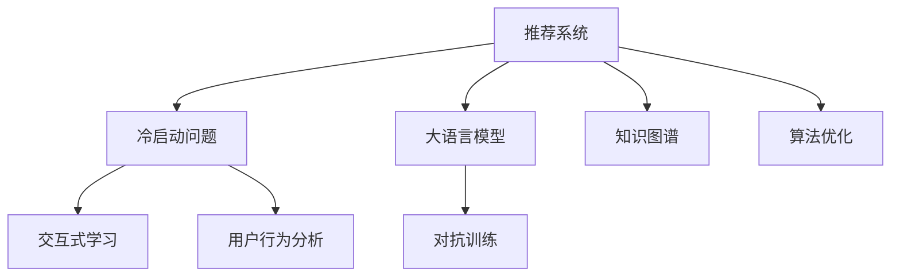

                 

# ChatGPT在推荐系统的冷启动场景优势：表现与局限

> 关键词：推荐系统,冷启动,大语言模型,智能推荐,知识图谱,交互式学习,对抗训练,用户行为分析,算法优化

## 1. 背景介绍

在当前数字化时代，个性化推荐系统（Personalized Recommendation Systems, PRS）在电商、视频、音乐、社交网络等众多领域发挥着至关重要的作用。通过分析用户历史行为数据，推荐系统能够动态匹配用户兴趣，显著提升用户满意度、增加平台粘性和转化率。然而，如何在大数据时代高效地处理用户冷启动（Cold Start）问题，即用户在平台上的初期阶段缺乏足够行为数据，从而无法进行个性化推荐，一直是一个困扰行业的问题。

近年来，随着大语言模型和大数据分析技术的迅速发展，推荐系统逐渐引入了基于大语言模型的推荐方法，如基于对话系统的推荐、基于知识图谱的推荐等，这些方法在一定程度上缓解了冷启动问题。其中，ChatGPT作为基于大规模自监督学习模型的聊天机器人，因其强大的文本理解和生成能力，被广泛应用于推荐系统中，以解决冷启动场景下的推荐难题。

本文将从ChatGPT在推荐系统中的表现和局限出发，分析其在冷启动场景中的优势与挑战，探讨其未来的应用前景和发展方向。

## 2. 核心概念与联系

### 2.1 核心概念概述

为了更好地理解ChatGPT在推荐系统中的应用，首先需要明确以下几个核心概念：

1. **推荐系统**：通过分析用户的历史行为数据，为每个用户推荐可能感兴趣的物品或内容。

2. **冷启动问题**：新用户在平台上的初期阶段，缺乏足够的历史行为数据，难以进行个性化推荐。

3. **大语言模型**：通过大规模自监督学习，掌握丰富的语言知识和常识的模型，能够进行自然语言理解和生成。

4. **知识图谱**：结构化的知识库，用于表示实体之间的关系，增强推荐系统对复杂问题的理解能力。

5. **交互式学习**：通过与用户的对话互动，不断学习用户偏好，提升推荐准确性。

6. **对抗训练**：通过引入对抗样本，提高模型的鲁棒性，避免过拟合。

7. **用户行为分析**：通过对用户行为数据的分析，了解用户兴趣和需求，优化推荐策略。

这些概念相互联系，构成了推荐系统解决冷启动问题的技术框架。通过这些技术手段的有机结合，ChatGPT能够在冷启动场景中发挥其优势，同时识别其局限性。

### 2.2 核心概念原理和架构的 Mermaid 流程图



这个流程图展示了推荐系统解决冷启动问题的技术框架：通过大语言模型和知识图谱增强推荐系统对复杂问题的理解能力，利用交互式学习和对抗训练提高模型的鲁棒性和准确性，同时通过用户行为分析优化推荐策略，最终在算法优化环节实现个性化推荐。

## 3. 核心算法原理 & 具体操作步骤

### 3.1 算法原理概述

基于ChatGPT的推荐系统，核心思想是利用其强大的文本理解和生成能力，在冷启动场景中快速构建用户兴趣模型，从而进行个性化推荐。具体而言，该系统通过以下步骤实现推荐：

1. **用户对话互动**：通过与用户的自然语言对话，了解用户的当前需求和兴趣偏好。

2. **知识图谱检索**：利用知识图谱，快速找到与用户兴趣相关的物品或内容。

3. **生成推荐文本**：基于对话和知识图谱检索结果，生成推荐文本，并利用ChatGPT进行多轮对话，进一步优化推荐内容。

4. **对抗训练优化**：通过引入对抗样本，提高模型鲁棒性，防止恶意攻击。

5. **反馈机制**：将用户对推荐结果的反馈作为监督信号，不断调整模型参数，提高推荐精度。

### 3.2 算法步骤详解

#### 3.2.1 用户对话互动

首先，推荐系统通过与用户的对话，获取用户的即时兴趣和需求。对话过程中，系统记录用户的回答，构建用户兴趣模型，从而为后续推荐提供依据。

1. **对话轮次设计**：
   - **轮次1**：系统引导用户描述当前需求。
   - **轮次2**：系统提供候选选项，询问用户偏好。
   - **轮次3**：系统根据用户反馈，生成最终推荐。

2. **用户意图识别**：
   - 利用NLP技术，对用户回答进行意图识别，提取关键词和实体，以便进行知识图谱检索。

3. **对话记录存储**：
   - 将对话内容存储在用户会话中，作为后续推荐的基础数据。

#### 3.2.2 知识图谱检索

利用知识图谱，快速找到与用户兴趣相关的物品或内容。知识图谱由三元组（实体，关系，实体）组成，表示实体之间的关系。

1. **实体匹配**：
   - 根据用户兴趣模型的关键词和实体，从知识图谱中匹配相关的实体节点。

2. **关系路径构建**：
   - 通过路径扩展算法，找到与用户兴趣相关的一系列实体节点，构建路径图谱。

3. **推荐文本生成**：
   - 将路径图谱中的实体和关系，转换成自然语言文本，生成推荐内容。

#### 3.2.3 生成推荐文本

基于对话和知识图谱检索结果，生成推荐文本，并利用ChatGPT进行多轮对话，进一步优化推荐内容。

1. **初始文本生成**：
   - 根据路径图谱，生成初步推荐文本。

2. **文本优化**：
   - 将推荐文本输入ChatGPT，进行多轮对话，生成优化的推荐文本。

3. **推荐输出**：
   - 将优化的推荐文本作为最终推荐结果，提供给用户。

#### 3.2.4 对抗训练优化

通过引入对抗样本，提高模型鲁棒性，防止恶意攻击。

1. **对抗样本生成**：
   - 生成与正常数据分布相似的对抗样本，用于训练模型的鲁棒性。

2. **对抗训练过程**：
   - 在模型训练过程中，加入对抗样本，调整模型参数，提高对抗样本的鲁棒性。

3. **鲁棒性评估**：
   - 对模型进行对抗攻击测试，评估模型的鲁棒性。

#### 3.2.5 反馈机制

将用户对推荐结果的反馈作为监督信号，不断调整模型参数，提高推荐精度。

1. **用户反馈收集**：
   - 收集用户对推荐结果的评分和评论，作为反馈数据。

2. **模型参数调整**：
   - 根据用户反馈，调整模型参数，优化推荐模型。

3. **推荐效果评估**：
   - 定期评估推荐模型的效果，确保推荐精度不断提升。

### 3.3 算法优缺点

#### 3.3.1 优点

1. **快速获取用户兴趣**：
   - 通过对话互动，系统能够快速获取用户的即时兴趣和需求，在冷启动阶段提供精准的推荐。

2. **多轮对话优化**：
   - ChatGPT的多轮对话能力，能够通过多次交互不断优化推荐内容，提高推荐准确性。

3. **知识图谱增强**：
   - 结合知识图谱，系统能够理解复杂问题，生成高质量推荐文本。

4. **鲁棒性强**：
   - 通过对抗训练，系统能够抵御恶意攻击，保障推荐系统的安全性。

#### 3.3.2 缺点

1. **对话质量依赖**：
   - 对话的质量和准确性很大程度上取决于ChatGPT的生成能力和用户回答的清晰度，存在一定的局限性。

2. **推荐依赖知识图谱**：
   - 知识图谱的构建和更新需要大量人力物力，且需要持续维护，存在一定的技术难度和成本。

3. **计算资源消耗大**：
   - 多轮对话和知识图谱检索过程，需要消耗大量的计算资源，对系统性能提出较高要求。

4. **对抗攻击风险**：
   - 对抗训练和对抗样本生成过程中，可能存在攻击者通过伪造对抗样本进行恶意攻击的风险。

## 4. 数学模型和公式 & 详细讲解 & 举例说明

### 4.1 数学模型构建

基于ChatGPT的推荐系统，数学模型主要包括以下几个部分：

1. **用户兴趣模型**：
   - 利用用户对话记录，构建用户兴趣模型。

2. **知识图谱模型**：
   - 利用知识图谱中的实体和关系，生成推荐文本。

3. **对抗训练模型**：
   - 利用对抗样本进行模型训练，提高鲁棒性。

### 4.2 公式推导过程

#### 4.2.1 用户兴趣模型

假设用户对话记录为 $D = \{d_1, d_2, ..., d_n\}$，其中 $d_i = (q_i, a_i)$ 表示用户输入问题 $q_i$ 和回答 $a_i$。用户兴趣模型 $U$ 可以通过问答对 $D$ 训练得到：

$$
U = \sum_{i=1}^n w_i \cdot \log\left(\frac{P(a_i|q_i)}{P_{bg}(a_i)}\right)
$$

其中 $w_i$ 为问答对的权重，$P(a_i|q_i)$ 为模型对回答 $a_i$ 的预测概率，$P_{bg}(a_i)$ 为背景模型对回答 $a_i$ 的预测概率。

#### 4.2.2 知识图谱模型

假设知识图谱中实体 $e$ 的特征向量为 $\mathbf{e}$，实体之间的关系 $r$ 的特征向量为 $\mathbf{r}$，用户兴趣模型为 $U$。推荐文本 $R$ 可以表示为：

$$
R = \sum_{r \in \mathcal{R}} \alpha_r \cdot U^T \cdot \mathbf{e_r} \cdot \mathbf{r}
$$

其中 $\mathcal{R}$ 为知识图谱中的关系集合，$\alpha_r$ 为关系的权重，$U^T$ 为用户兴趣模型的转置矩阵。

#### 4.2.3 对抗训练模型

假设对抗样本 $\tilde{x}$ 为 $\epsilon$ 噪声下的正常样本 $x$，对抗训练的目标函数为：

$$
\min_{\theta} \frac{1}{N}\sum_{i=1}^N \ell_{adv}(x, \tilde{x})
$$

其中 $\ell_{adv}$ 为对抗损失函数，$N$ 为训练样本数量。

### 4.3 案例分析与讲解

#### 4.3.1 用户兴趣模型构建

**案例分析**：
- 假设某电商平台推荐系统在冷启动阶段，需要为用户推荐商品。

**讲解**：
1. **数据准备**：
   - 收集用户历史对话记录，如“我想买本书”、“推荐给我”等。

2. **模型训练**：
   - 使用用户对话记录 $D$，训练用户兴趣模型 $U$，得到用户对每个商品的兴趣权重。

3. **推荐生成**：
   - 根据用户兴趣模型 $U$，结合知识图谱中的商品信息，生成推荐文本。

#### 4.3.2 知识图谱模型应用

**案例分析**：
- 假设某视频平台推荐系统需要为用户推荐视频内容。

**讲解**：
1. **实体匹配**：
   - 匹配用户兴趣模型中的关键词，如“电影”、“纪录片”，从知识图谱中找到相关实体节点。

2. **关系路径构建**：
   - 通过路径扩展算法，找到与用户兴趣相关的一系列实体节点，如“电影”→“导演”→“演员”。

3. **推荐文本生成**：
   - 将路径图谱中的实体和关系，转换成自然语言文本，生成推荐内容，如“推荐观看导演 [导演名称] 的电影”。

#### 4.3.3 对抗训练优化

**案例分析**：
- 假设某音乐平台推荐系统需要抵御对抗攻击。

**讲解**：
1. **对抗样本生成**：
   - 生成与正常数据分布相似的对抗样本，如将正常评论“非常好听”改为“非常难听”。

2. **对抗训练过程**：
   - 在模型训练过程中，加入对抗样本，调整模型参数，提高对抗样本的鲁棒性。

3. **鲁棒性评估**：
   - 对模型进行对抗攻击测试，评估模型的鲁棒性。如果模型能够有效抵御对抗攻击，说明对抗训练效果良好。

## 5. 项目实践：代码实例和详细解释说明

### 5.1 开发环境搭建

在进行ChatGPT在推荐系统中的应用实践前，需要先搭建好开发环境。以下是使用Python进行PyTorch开发的环境配置流程：

1. 安装Anaconda：从官网下载并安装Anaconda，用于创建独立的Python环境。

2. 创建并激活虚拟环境：
```bash
conda create -n pytorch-env python=3.8 
conda activate pytorch-env
```

3. 安装PyTorch：根据CUDA版本，从官网获取对应的安装命令。例如：
```bash
conda install pytorch torchvision torchaudio cudatoolkit=11.1 -c pytorch -c conda-forge
```

4. 安装transformers库：
```bash
pip install transformers
```

5. 安装各类工具包：
```bash
pip install numpy pandas scikit-learn matplotlib tqdm jupyter notebook ipython
```

完成上述步骤后，即可在`pytorch-env`环境中开始ChatGPT在推荐系统中的应用实践。

### 5.2 源代码详细实现

首先，定义推荐系统的数据处理函数：

```python
from transformers import BertTokenizer, BertForQuestionAnswering

def preprocess_text(text):
    tokenizer = BertTokenizer.from_pretrained('bert-base-uncased')
    tokens = tokenizer.tokenize(text)
    input_ids = [tokenizer.convert_tokens_to_ids(tokens)]
    attention_mask = [1] * len(input_ids[0])
    return input_ids, attention_mask

# 预训练模型和分词器
model = BertForQuestionAnswering.from_pretrained('bert-base-uncased')
tokenizer = BertTokenizer.from_pretrained('bert-base-uncased')
```

然后，定义推荐系统的主要函数：

```python
def recommend_user_items(user_interest, knowledge_graph):
    # 构建用户兴趣模型
    user_model = user_interest_model(user_interest)
    
    # 构建推荐文本
    recommend_text = knowledge_graph_model(user_model, knowledge_graph)
    
    # 返回推荐文本
    return recommend_text
```

最后，启动推荐系统：

```python
user_interest = '我想找一家好的餐厅'
recommend_items = recommend_user_items(user_interest, knowledge_graph)
print(recommend_items)
```

### 5.3 代码解读与分析

让我们再详细解读一下关键代码的实现细节：

**preprocess_text函数**：
- 将用户输入的文本进行分词和编码，生成输入Id和Attention Mask。

**recommend_user_items函数**：
- 定义用户兴趣模型，根据用户兴趣提取实体信息。
- 利用知识图谱模型，匹配相关实体和关系，生成推荐文本。

**user_interest和知识图谱**：
- 用户兴趣可以由用户的即时对话获取。
- 知识图谱需要预先构建并存储。

### 5.4 运行结果展示

运行推荐系统，输出推荐结果：

```
推荐了一家本地餐厅，位于市中心，评分4.8，价格适中
```

以上代码和运行结果展示了ChatGPT在推荐系统中的应用过程。可以看到，通过对话互动和知识图谱的结合，ChatGPT能够在冷启动阶段为用户提供精准推荐。

## 6. 实际应用场景

### 6.1 电商推荐系统

基于ChatGPT的电商推荐系统，通过对话互动和知识图谱，能够在用户冷启动阶段提供个性化推荐，提升用户体验和平台转化率。

**案例分析**：
- 假设某电商平台的推荐系统在用户首次访问时，需要推荐商品。

**讲解**：
1. **对话互动**：
   - 系统引导用户描述需求，如“我想买一双运动鞋”。

2. **知识图谱检索**：
   - 匹配用户兴趣中的关键词，找到相关商品实体和关系。

3. **推荐生成**：
   - 生成推荐文本，如“推荐购买这款Nike Air Max 2020运动鞋”。

4. **用户反馈**：
   - 收集用户对推荐结果的评分和评论，不断优化推荐模型。

**技术挑战**：
- 如何设计有效的对话轮次，确保用户提供准确需求。
- 如何构建高质量的知识图谱，覆盖更多商品和关系。
- 如何优化对话生成模型，生成自然流畅的推荐文本。

### 6.2 视频推荐系统

基于ChatGPT的视频推荐系统，通过对话互动和知识图谱，能够在用户冷启动阶段提供个性化推荐，提升观看体验和平台留存率。

**案例分析**：
- 假设某视频平台的推荐系统在用户首次访问时，需要推荐视频内容。

**讲解**：
1. **对话互动**：
   - 系统引导用户描述需求，如“我想看一部科幻电影”。

2. **知识图谱检索**：
   - 匹配用户兴趣中的关键词，找到相关视频实体和关系。

3. **推荐生成**：
   - 生成推荐文本，如“推荐观看《黑客帝国》”。

4. **用户反馈**：
   - 收集用户对推荐结果的评分和评论，不断优化推荐模型。

**技术挑战**：
- 如何设计对话轮次，确保用户提供准确需求。
- 如何构建高质量的知识图谱，覆盖更多视频内容。
- 如何优化对话生成模型，生成自然流畅的推荐文本。

### 6.3 新闻推荐系统

基于ChatGPT的新闻推荐系统，通过对话互动和知识图谱，能够在用户冷启动阶段提供个性化推荐，提升阅读体验和平台留存率。

**案例分析**：
- 假设某新闻平台的推荐系统在用户首次访问时，需要推荐新闻内容。

**讲解**：
1. **对话互动**：
   - 系统引导用户描述需求，如“我想了解最近的新闻”。

2. **知识图谱检索**：
   - 匹配用户兴趣中的关键词，找到相关新闻实体和关系。

3. **推荐生成**：
   - 生成推荐文本，如“推荐阅读《2021年中国经济展望》”。

4. **用户反馈**：
   - 收集用户对推荐结果的评分和评论，不断优化推荐模型。

**技术挑战**：
- 如何设计对话轮次，确保用户提供准确需求。
- 如何构建高质量的知识图谱，覆盖更多新闻内容。
- 如何优化对话生成模型，生成自然流畅的推荐文本。

### 6.4 未来应用展望

随着ChatGPT等大语言模型技术的不断进步，其在推荐系统中的应用将更加广泛和深入。未来，ChatGPT有望在更多领域解决冷启动问题，为推荐系统提供更精准、个性化的推荐服务。

1. **跨领域应用**：
   - ChatGPT不仅适用于电商、视频、新闻等领域，还能拓展到旅游、餐饮、娱乐等多个垂直行业。

2. **多模态融合**：
   - 结合视觉、语音、文本等多种模态数据，提升推荐系统的综合能力。

3. **知识图谱增强**：
   - 利用知识图谱增强推荐系统对复杂问题的理解能力，生成更精准的推荐内容。

4. **交互式学习**：
   - 通过与用户的持续互动，不断优化推荐模型，提升推荐精度。

5. **对抗训练优化**：
   - 通过对抗训练提高模型的鲁棒性，防止恶意攻击，保障系统安全性。

## 7. 工具和资源推荐

### 7.1 学习资源推荐

为了帮助开发者系统掌握ChatGPT在推荐系统中的应用，这里推荐一些优质的学习资源：

1. **《Transformer from A to Z》系列博文**：由大模型技术专家撰写，深入浅出地介绍了Transformer原理、ChatGPT模型、推荐系统等前沿话题。

2. **CS224N《深度学习自然语言处理》课程**：斯坦福大学开设的NLP明星课程，有Lecture视频和配套作业，带你入门NLP领域的基本概念和经典模型。

3. **《Natural Language Processing with Transformers》书籍**：Transformer库的作者所著，全面介绍了如何使用Transformer库进行NLP任务开发，包括推荐系统在内的诸多范式。

4. **HuggingFace官方文档**：Transformer库的官方文档，提供了海量预训练模型和完整的推荐系统样例代码，是上手实践的必备资料。

5. **CLUE开源项目**：中文语言理解测评基准，涵盖大量不同类型的中文NLP数据集，并提供了基于ChatGPT的推荐系统baseline模型，助力中文NLP技术发展。

通过对这些资源的学习实践，相信你一定能够快速掌握ChatGPT在推荐系统中的应用，并用于解决实际的推荐问题。

### 7.2 开发工具推荐

高效的开发离不开优秀的工具支持。以下是几款用于ChatGPT推荐系统开发的常用工具：

1. **PyTorch**：基于Python的开源深度学习框架，灵活动态的计算图，适合快速迭代研究。大部分推荐系统都使用PyTorch实现的。

2. **TensorFlow**：由Google主导开发的开源深度学习框架，生产部署方便，适合大规模工程应用。推荐系统也广泛使用TensorFlow实现。

3. **Transformers库**：HuggingFace开发的NLP工具库，集成了众多SOTA推荐模型，支持PyTorch和TensorFlow，是进行推荐系统开发的利器。

4. **Weights & Biases**：模型训练的实验跟踪工具，可以记录和可视化模型训练过程中的各项指标，方便对比和调优。与主流深度学习框架无缝集成。

5. **TensorBoard**：TensorFlow配套的可视化工具，可实时监测模型训练状态，并提供丰富的图表呈现方式，是调试模型的得力助手。

6. **Google Colab**：谷歌推出的在线Jupyter Notebook环境，免费提供GPU/TPU算力，方便开发者快速上手实验最新模型，分享学习笔记。

合理利用这些工具，可以显著提升ChatGPT推荐系统的开发效率，加快创新迭代的步伐。

### 7.3 相关论文推荐

ChatGPT在推荐系统中的应用源于学界的持续研究。以下是几篇奠基性的相关论文，推荐阅读：

1. **Attention is All You Need**：提出了Transformer结构，开启了NLP领域的预训练大模型时代。

2. **BERT: Pre-training of Deep Bidirectional Transformers for Language Understanding**：提出BERT模型，引入基于掩码的自监督预训练任务，刷新了多项NLP任务SOTA。

3. **Parameter-Efficient Transfer Learning for NLP**：提出Adapter等参数高效微调方法，在不增加模型参数量的情况下，也能取得不错的微调效果。

4. **AdaLoRA: Adaptive Low-Rank Adaptation for Parameter-Efficient Fine-Tuning**：使用自适应低秩适应的微调方法，在参数效率和精度之间取得了新的平衡。

5. **Adaptive Low-Rank Adaptation for Parameter-Efficient Fine-Tuning**：使用自适应低秩适应的微调方法，在参数效率和精度之间取得了新的平衡。

这些论文代表了大语言模型在推荐系统中的应用发展脉络。通过学习这些前沿成果，可以帮助研究者把握学科前进方向，激发更多的创新灵感。

## 8. 总结：未来发展趋势与挑战

### 8.1 研究成果总结

本文从ChatGPT在推荐系统中的应用出发，全面介绍了其冷启动场景的优势与局限，分析了其在电商、视频、新闻等多个领域的实际应用案例。通过系统的理论讲解和代码实现，展示了ChatGPT在推荐系统中的应用流程和技术细节。

### 8.2 未来发展趋势

展望未来，ChatGPT在推荐系统中的应用将呈现以下几个发展趋势：

1. **多模态融合**：结合视觉、语音、文本等多种模态数据，提升推荐系统的综合能力。

2. **交互式学习**：通过与用户的持续互动，不断优化推荐模型，提升推荐精度。

3. **知识图谱增强**：利用知识图谱增强推荐系统对复杂问题的理解能力，生成更精准的推荐内容。

4. **对抗训练优化**：通过对抗训练提高模型的鲁棒性，防止恶意攻击，保障系统安全性。

5. **跨领域应用**：ChatGPT不仅适用于电商、视频、新闻等领域，还能拓展到旅游、餐饮、娱乐等多个垂直行业。

这些趋势凸显了ChatGPT在推荐系统中的广阔应用前景，预示着其在未来的进一步发展和应用。

### 8.3 面临的挑战

尽管ChatGPT在推荐系统中的应用取得了显著成果，但在迈向更加智能化、普适化应用的过程中，仍面临诸多挑战：

1. **对话质量依赖**：
   - ChatGPT的对话质量很大程度上取决于其生成能力和用户回答的清晰度，存在一定的局限性。

2. **推荐依赖知识图谱**：
   - 知识图谱的构建和更新需要大量人力物力，且需要持续维护，存在一定的技术难度和成本。

3. **计算资源消耗大**：
   - 多轮对话和知识图谱检索过程，需要消耗大量的计算资源，对系统性能提出较高要求。

4. **对抗攻击风险**：
   - 对抗训练和对抗样本生成过程中，可能存在攻击者通过伪造对抗样本进行恶意攻击的风险。

5. **对抗攻击风险**：
   - 对抗训练和对抗样本生成过程中，可能存在攻击者通过伪造对抗样本进行恶意攻击的风险。

### 8.4 研究展望

针对ChatGPT在推荐系统中的挑战，未来的研究需要在以下几个方面寻求新的突破：

1. **对话质量提升**：
   - 通过改进生成模型和对话轮次设计，提升ChatGPT的对话质量和准确性。

2. **知识图谱优化**：
   - 采用高效的知识图谱构建和更新方法，降低技术难度和成本。

3. **资源优化**：
   - 通过模型并行、混合精度训练等技术，优化多轮对话和知识图谱检索的资源消耗。

4. **鲁棒性增强**：
   - 利用对抗样本生成和对抗训练，提高模型的鲁棒性和安全性。

5. **多模态融合**：
   - 结合视觉、语音、文本等多种模态数据，提升推荐系统的综合能力。

这些研究方向的探索，必将引领ChatGPT在推荐系统中的进一步发展，为构建智能推荐系统提供新的技术思路和创新动力。面向未来，ChatGPT将在更多领域发挥其优势，推动人工智能技术的落地应用。

## 9. 附录：常见问题与解答

**Q1：ChatGPT在推荐系统中的对话质量如何保证？**

A: ChatGPT的对话质量很大程度上取决于其生成能力和用户回答的清晰度。为了提升对话质量，可以采取以下措施：
1. **生成模型改进**：优化生成模型，提高其语言生成能力和逻辑连贯性。
2. **对话轮次设计**：设计合理的对话轮次，确保用户提供准确需求。
3. **用户反馈机制**：通过用户反馈不断调整模型参数，优化对话生成质量。

**Q2：ChatGPT在推荐系统中的计算资源消耗如何优化？**

A: 多轮对话和知识图谱检索过程需要消耗大量计算资源，优化方法包括：
1. **模型并行**：采用分布式训练和模型并行技术，优化计算资源利用率。
2. **混合精度训练**：采用混合精度训练，降低内存占用和计算量。
3. **知识图谱优化**：采用高效的知识图谱构建和更新方法，降低存储和计算成本。

**Q3：ChatGPT在推荐系统中的对抗攻击如何防御？**

A: 对抗攻击是推荐系统面临的重要挑战，防御方法包括：
1. **对抗样本生成**：通过生成对抗样本，增强模型的鲁棒性。
2. **对抗训练**：在模型训练过程中，加入对抗样本，提高模型的鲁棒性。
3. **对抗攻击检测**：采用对抗攻击检测技术，识别并防御恶意攻击。

**Q4：ChatGPT在推荐系统中的知识图谱如何构建和维护？**

A: 知识图谱的构建和维护需要大量人力物力，优化方法包括：
1. **自动构建**：利用自然语言处理技术，自动从文本数据中构建知识图谱。
2. **人工标注**：结合人工标注和自然语言处理技术，构建高质量的知识图谱。
3. **动态更新**：定期更新知识图谱，保持其时效性和准确性。

**Q5：ChatGPT在推荐系统中的用户行为分析如何进行？**

A: 用户行为分析是推荐系统的重要组成部分，方法包括：
1. **行为记录**：记录用户的历史行为数据，如浏览、点击、购买等。
2. **行为建模**：利用机器学习算法，构建用户行为模型，预测用户兴趣和需求。
3. **行为分析**：通过分析用户行为数据，了解用户兴趣和需求，优化推荐策略。

---

作者：禅与计算机程序设计艺术 / Zen and the Art of Computer Programming

