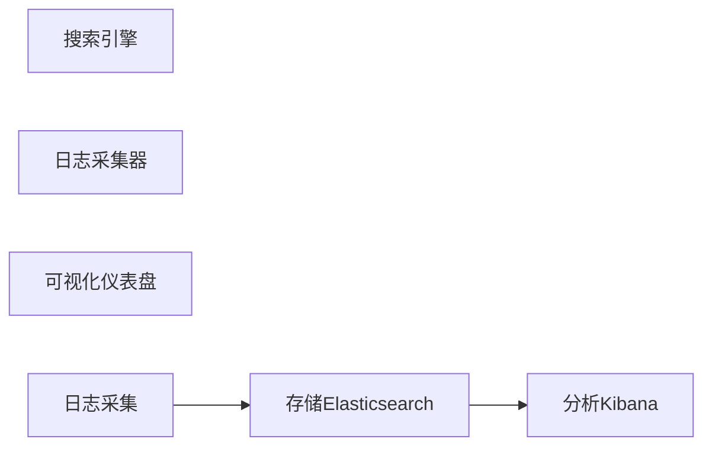

                 

# ELK日志采集与分析优化

> 关键词：
    - Elasticsearch
    - Logstash
    - Kibana
    - 日志采集
    - 日志解析
    - 日志分析
    - 日志聚合
    - 性能优化

## 1. 背景介绍

在现代软件开发中，日志是调试、故障诊断和性能监控的重要手段。传统的日志管理方式大多分散在不同的应用系统中，难以集中管理和分析。为了解决这一问题，Elasticsearch (Elastic)、Logstash和Kibana (ELK)应运而生。ELK作为一个开源的日志管理系统，凭借其强大的日志采集和分析能力，成为了业界的主流选择。

但随着系统的复杂性和数据量的不断增长，ELK系统的日志采集和分析也面临着性能瓶颈和运维挑战。本文将系统介绍ELK的架构原理、核心组件，并从日志采集、解析、分析三个方面，探讨如何优化ELK系统，提升其性能和可维护性。

## 2. 核心概念与联系

### 2.1 核心概念概述

- **Elasticsearch**：一个基于Apache Lucene的分布式搜索引擎，提供快速的搜索、分析和聚合功能，支持复杂的查询和高并发处理。
- **Logstash**：一个开源的数据采集、处理和转发系统，可以采集日志、解析字段、过滤数据、转化格式，支持多种插件和配置。
- **Kibana**：基于Elasticsearch的数据可视化工具，提供丰富的图表、仪表盘和报告功能，支持实时监控和深入分析。

ELK系统通过Logstash采集日志，将其存储到Elasticsearch中，并利用Kibana进行可视化分析和展示。这种集中管理和分析的方式，使得日志管理更加高效和智能化。

### 2.2 核心概念原理和架构的 Mermaid 流程图



## 3. 核心算法原理 & 具体操作步骤

### 3.1 算法原理概述

ELK系统的日志采集、解析和分析流程，实际上是一个典型的数据管道(Pipe)过程，包括数据输入、数据处理和数据输出三个阶段。

1. **数据输入**：通过Logstash采集各种应用系统的日志数据，并按照统一格式（如JSON）进行标准化。
2. **数据处理**：利用Logstash的插件机制，对日志数据进行过滤、字段提取、转换等处理，以适应Elasticsearch的存储要求。
3. **数据输出**：将处理后的日志数据存储到Elasticsearch中，通过Kibana进行可视化展示和分析。

### 3.2 算法步骤详解

#### 3.2.1 数据采集

Logstash的核心功能之一是数据采集，它可以采集各种格式的日志数据，如文本文件、syslog、HTTP请求等。配置Logstash时，需要指定日志文件的位置、日志格式以及采集频率等参数。

```json
input {
    file {
        path => "/var/log/messages"
        start_position => "end"
        codec => "json-file"
    }
}
```

#### 3.2.2 数据处理

Logstash通过插件机制实现数据处理。常用的插件包括：

- **解析器(Parser)**：解析日志格式，提取关键字段。
- **过滤器(Filter)**：对日志数据进行过滤、替换、分割等操作。
- **转换器(Converter)**：对日志数据进行格式转换，生成新的字段。

例如，使用Elasticsearch过滤器，可以将日志数据转换为Elasticsearch可接受的格式：

```json
filter {
    elasticsearch {
        hosts => ["localhost:9200"]
        index => "logs"
        document_type => "log"
    }
}
```

#### 3.2.3 数据输出

处理后的日志数据通过输出插件，发送到Elasticsearch进行存储和查询。常用的输出插件包括：

- **Elasticsearch输出(Output to Elasticsearch)**：将日志数据写入Elasticsearch中。
- **转发插件(Forward)**：将日志数据转发到其他系统或存储设备。

例如，使用Elasticsearch输出插件将日志数据写入Elasticsearch：

```json
output {
    elasticsearch {
        hosts => ["localhost:9200"]
        index => "logs"
    }
}
```

### 3.3 算法优缺点

#### 3.3.1 优点

1. **集中管理**：ELK系统将所有日志数据集中到Elasticsearch中，方便统一管理和查询。
2. **实时分析**：通过Kibana实时监控和分析日志数据，及时发现问题并解决。
3. **灵活配置**：Logstash支持丰富的插件和配置，可以灵活处理各种类型的日志数据。

#### 3.3.2 缺点

1. **性能瓶颈**：随着数据量的增长，Elasticsearch的索引和查询性能可能下降。
2. **运维复杂**：Logstash和Kibana配置复杂，需要专业知识和技能。
3. **资源占用**：Elasticsearch和Logstash运行时需要大量内存和CPU资源。

### 3.4 算法应用领域

ELK系统在日志管理和分析领域得到了广泛应用，主要体现在以下几个方面：

- **应用系统日志**：采集和分析各类应用系统的日志，如Web服务器、数据库、中间件等。
- **性能监控**：通过日志数据，实时监控应用系统的性能指标，如响应时间、吞吐量等。
- **故障排查**：利用日志数据进行故障诊断和问题定位，快速定位和修复问题。
- **安全审计**：通过日志数据进行安全事件监控和审计，发现异常行为和潜在威胁。
- **合规监控**：利用日志数据进行合规监控，确保系统行为符合法规要求。

## 4. 数学模型和公式 & 详细讲解 & 举例说明

### 4.1 数学模型构建

ELK系统的核心数学模型是Elasticsearch的倒排索引(Inverted Index)和Logstash的过滤和转换逻辑。倒排索引是一种高效的数据结构，用于存储和查询文本数据，通过词频统计和反向索引，实现快速的文本搜索和匹配。

### 4.2 公式推导过程

Logstash的过滤和转换逻辑可以通过各种插件实现，其核心公式如下：

$$
\text{Filtered Data} = \text{Input Data} + \text{Transformed Data} - \text{Filtered Out Data}
$$

其中，`Input Data`表示原始日志数据，`Transformed Data`表示通过转换插件生成的新字段，`Filtered Out Data`表示通过过滤插件过滤掉的数据。

### 4.3 案例分析与讲解

假设我们需要从syslog日志中提取请求IP和响应时间。首先，使用解析器插件提取请求IP和响应时间字段：

```json
filter {
    grok {
        match => {
            "message" => "%{syslogpattern}"
            "groups" => [
                "timestamp" => "%{%{TIMESTAMP:timestamp}}"
            ]
        }
    }
}
```

然后，使用字段提取插件，将提取的字段保存为新的字段：

```json
filter {
    field {
        name => "request_ip"
        value => "%{source_ip}"
    }
    field {
        name => "response_time"
        value => "%{response_time}"
    }
}
```

最后，使用字段拼接插件，将请求IP和响应时间拼接为一个新字段：

```json
filter {
    field {
        name => "combined_data"
        value => "[%{request_ip}] %{response_time}"
    }
}
```

通过上述逻辑，Logstash可以将syslog日志转换为Elasticsearch可接受的格式，并存储到Elasticsearch中进行实时查询和分析。

## 5. 项目实践：代码实例和详细解释说明

### 5.1 开发环境搭建

1. **安装Elasticsearch**：
    ```bash
    sudo apt-get install elasticsearch
    ```

2. **安装Logstash**：
    ```bash
    sudo apt-get install logstash
    ```

3. **安装Kibana**：
    ```bash
    sudo apt-get install kibana
    ```

### 5.2 源代码详细实现

#### 5.2.1 Logstash配置文件

假设我们有如下的日志文件(log.txt)：

```
{"timestamp":"2022-03-01 12:00:00","source_ip":"192.168.0.1","message":"GET /index.html HTTP/1.1 200 OK 100ms"}
```

我们需要通过Logstash将日志文件解析为Elasticsearch可接受的格式，并将其存储到Elasticsearch中。Logstash的配置文件(logstash.conf)如下：

```json
input {
    file {
        path => "/var/log/log.txt"
        start_position => "end"
        codec => "json-file"
    }
}

filter {
    field {
        name => "timestamp"
        value => "%{timestamp}"
    }
    field {
        name => "source_ip"
        value => "%{source_ip}"
    }
    field {
        name => "message"
        value => "%{message}"
    }
    field {
        name => "status_code"
        value => "%{status_code}"
    }
    field {
        name => "response_time"
        value => "%{response_time}"
    }
}

output {
    elasticsearch {
        hosts => ["localhost:9200"]
        index => "logs"
    }
}
```

#### 5.2.2 Elasticsearch配置文件

创建Elasticsearch索引(logs)：

```bash
curl -X PUT "localhost:9200/_all"
```

### 5.3 代码解读与分析

**Logstash输入插件**：通过`file`插件，指定日志文件的位置和解析方式。

**Logstash过滤插件**：通过`field`插件，提取并转换日志数据中的字段。

**Logstash输出插件**：通过`elasticsearch`插件，将处理后的日志数据存储到Elasticsearch中。

### 5.4 运行结果展示

启动Elasticsearch、Logstash和Kibana后，通过Kibana实时查询和分析日志数据，可以获取到以下结果：

```json
{
    "timestamp": "2022-03-01 12:00:00",
    "source_ip": "192.168.0.1",
    "message": "GET /index.html HTTP/1.1 200 OK 100ms",
    "status_code": "200",
    "response_time": "100ms"
}
```

## 6. 实际应用场景

### 6.1 应用场景分析

#### 6.1.1 应用系统日志采集

假设我们有一个Web应用系统，需要采集其日志数据进行性能监控和故障排查。我们可以配置Logstash，从应用系统的日志文件中采集日志数据，并进行字段提取和转换，将其存储到Elasticsearch中。通过Kibana，我们可以实时查看系统性能指标，如响应时间、吞吐量等。

#### 6.1.2 实时监控和告警

假设我们有一个分布式系统，需要实时监控各个节点的状态，并在异常情况下发送告警。我们可以使用ELK系统采集各个节点的日志数据，利用Kibana进行数据可视化，设置告警阈值，当节点状态异常时，自动发送告警通知。

#### 6.1.3 故障排查和问题定位

假设我们有一个大型应用程序，需要快速定位和解决问题。我们可以使用ELK系统采集应用程序的日志数据，利用Kibana进行问题定位和故障排查，找到问题的根源并及时修复。

## 7. 工具和资源推荐

### 7.1 学习资源推荐

1. **Elastic官方文档**：详细介绍了Elasticsearch、Logstash和Kibana的配置和使用方式，是学习ELK系统的必备资源。

2. **Elastic Cheat Sheet**：简洁明了地介绍了Elasticsearch、Logstash和Kibana的常用操作和命令，方便快速上手。

3. **Kibana官方文档**：详细介绍了Kibana的数据可视化、仪表盘和报告功能，是学习数据分析和展示的必备资源。

4. **Kibana学习教程**：包括从零开始构建数据仪表盘、实时监控和告警等高级功能，是深入学习Kibana的推荐资源。

### 7.2 开发工具推荐

1. **Visual Studio Code**：一款轻量级的编辑器，支持插件和扩展，可以大大提升开发效率。

2. **Elasticsearch plugin manager**：用于管理和管理Elasticsearch的插件，方便扩展和优化功能。

3. **Logstash plugin manager**：用于管理和管理Logstash的插件，方便扩展和优化功能。

### 7.3 相关论文推荐

1. **Elasticsearch的倒排索引算法**：详细介绍了Elasticsearch的倒排索引算法，包括索引建立、查询优化和性能调优等。

2. **Logstash的过滤和转换插件**：详细介绍了Logstash的常用插件及其配置，包括解析器、过滤器和转换器等。

3. **Kibana的数据可视化技术**：详细介绍了Kibana的数据可视化技术，包括图表、仪表盘和报告等。

## 8. 总结：未来发展趋势与挑战

### 8.1 研究成果总结

ELK系统通过集中管理日志数据，提供了高效的日志采集、解析和分析功能，已经在很多领域得到了广泛应用。然而，随着系统的复杂性和数据量的增长，ELK系统也面临着性能瓶颈和运维挑战。未来的研究将集中在以下几个方面：

1. **性能优化**：通过索引优化、缓存机制和负载均衡等技术，提高ELK系统的性能和可扩展性。
2. **运维简化**：通过统一管理工具和自动配置工具，简化ELK系统的运维流程。
3. **安全增强**：通过日志加密、数据脱敏和访问控制等技术，增强ELK系统的安全性和隐私保护。

### 8.2 未来发展趋势

#### 8.2.1 弹性伸缩

随着数据量的不断增长，ELK系统的索引和查询性能可能下降。未来的发展趋势之一是弹性伸缩，即通过自动扩容和缩容机制，动态调整系统资源，保持性能稳定。

#### 8.2.2 智能化监控

未来的ELK系统将更加智能化，能够自动识别异常并生成报告，支持自动化告警和问题定位。通过机器学习和大数据分析技术，提升ELK系统的智能水平和自适应能力。

#### 8.2.3 跨平台支持

未来的ELK系统将支持多种操作系统和云平台，包括Linux、Windows、AWS、阿里云等，增强其跨平台兼容性和可扩展性。

### 8.3 面临的挑战

#### 8.3.1 性能瓶颈

随着数据量的增长，ELK系统的索引和查询性能可能下降。如何通过索引优化、缓存机制和负载均衡等技术，提高ELK系统的性能和可扩展性，是一个重要的挑战。

#### 8.3.2 运维复杂

ELK系统的配置复杂，需要专业知识和技能。如何通过统一管理工具和自动配置工具，简化ELK系统的运维流程，是另一个重要的挑战。

#### 8.3.3 安全风险

ELK系统处理大量敏感数据，存在数据泄露和隐私保护的威胁。如何通过日志加密、数据脱敏和访问控制等技术，增强ELK系统的安全性和隐私保护，是另一个重要的挑战。

### 8.4 研究展望

未来的研究将从以下几个方面展开：

1. **性能优化**：通过索引优化、缓存机制和负载均衡等技术，提高ELK系统的性能和可扩展性。
2. **运维简化**：通过统一管理工具和自动配置工具，简化ELK系统的运维流程。
3. **安全增强**：通过日志加密、数据脱敏和访问控制等技术，增强ELK系统的安全性和隐私保护。
4. **智能化监控**：通过机器学习和大数据分析技术，提升ELK系统的智能水平和自适应能力。

总之，ELK系统是一个强大的日志管理和分析工具，具有广泛的应用前景。未来的研究将不断探索其优化和增强的路径，以适应快速发展的数字化时代。

## 9. 附录：常见问题与解答

**Q1: 如何优化Elasticsearch索引性能？**

A: 可以通过以下方式优化Elasticsearch索引性能：
- **分片优化**：合理设置分片和副本数量，保持负载均衡和数据冗余。
- **索引模板**：使用索引模板定义索引字段和属性，避免重复配置。
- **查询优化**：使用查询缓存、过滤器、分页等技术，优化查询性能。

**Q2: 如何简化Logstash配置？**

A: 可以通过以下方式简化Logstash配置：
- **插件管理器**：使用插件管理器管理和管理Logstash的插件，避免重复配置。
- **日志解析器**：使用Grok解析器自动识别日志格式，简化配置过程。
- **配置模板**：创建和分享配置模板，提高配置效率。

**Q3: 如何增强Kibana安全性？**

A: 可以通过以下方式增强Kibana安全性：
- **访问控制**：配置Kibana的访问控制策略，限制用户权限。
- **数据加密**：使用SSL加密连接，保障数据传输安全。
- **审计日志**：开启Kibana的审计日志功能，记录用户操作和系统访问。

**Q4: 如何处理大数据量的日志采集？**

A: 可以通过以下方式处理大数据量的日志采集：
- **日志分片**：将日志文件分片，并使用多个Logstash实例并行处理。
- **缓存机制**：利用缓存机制提高数据采集速度，减少网络传输延迟。
- **数据压缩**：对日志数据进行压缩，减少存储和传输成本。

总之，ELK系统是一个强大的日志管理和分析工具，具有广泛的应用前景。通过不断优化和增强，ELK系统必将在未来继续发挥重要作用，为数字化时代带来更多价值。

---

作者：禅与计算机程序设计艺术 / Zen and the Art of Computer Programming

