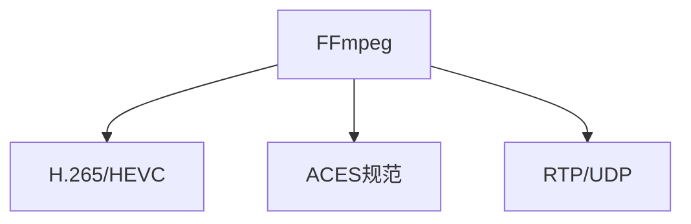

                 

# FFmpeg 在虚拟现实中的应用

> 关键词：FFmpeg, 虚拟现实, 视频编解码, 音频处理, 实时传输, 3D渲染

## 1. 背景介绍

### 1.1 问题由来

随着虚拟现实(Virtual Reality, VR)技术的迅猛发展，对高保真度、实时性的视频和音频编解码需求急剧增加。传统的视频编解码工具在实时性、码率和性能上难以满足VR设备的需求。FFmpeg作为一个高性能、功能丰富的多媒体框架，逐渐成为VR视频处理的首选工具。

### 1.2 问题核心关键点

- 实时性：VR视频需要在几毫秒内完成编解码和渲染，以提供流畅的沉浸式体验。
- 高码率：VR视频分辨率高、帧率快，需要高效的视频编解码算法以控制码率和带宽消耗。
- 高保真度：VR视频对色彩、动态范围和音频质量有很高的要求。
- 兼容性：不同平台、不同格式的VR内容需要进行跨平台的兼容处理。
- 性能优化：在有限的硬件资源下，需要优化算法和架构以提升编解码效率。

这些关键点构成了VR应用中视频处理的主要挑战。为了应对这些挑战，FFmpeg在多个层面进行了优化和扩展，实现了对VR内容的全面支持。

## 2. 核心概念与联系

### 2.1 核心概念概述

为更好地理解FFmpeg在VR中的应用，本节将介绍几个关键概念：

- FFmpeg：一个跨平台的开源多媒体框架，支持视频编解码、音频处理、实时传输等功能。
- H.265/HEVC：一种新一代的高效视频编解码标准，支持高质量、低码率的编码。
- ACES规范：一种基于IEC 61966-2-1:2014标准的色空间标准，用于确保不同设备间色彩的一致性。
- 实时传输协议(RTP/UDP)：一种面向数据报的传输协议，适用于低延迟、高吞吐量的实时应用。

这些概念之间的逻辑关系可以通过以下Mermaid流程图来展示：



这个流程图展示了FFmpeg与其他核心概念之间的关系：

1. FFmpeg通过H.265/HEVC等编解码标准，实现高质量视频压缩。
2. 通过ACES规范，FFmpeg能够确保不同设备间色彩的一致性。
3. 通过RTP/UDP协议，FFmpeg实现了低延迟、高吞吐量的实时传输。

## 3. 核心算法原理 & 具体操作步骤
### 3.1 算法原理概述

FFmpeg在VR视频处理中主要依赖以下核心算法：

- 视频编解码：使用H.265/HEVC、VP9等高效编码标准，实现高压缩比、高保真度的视频编码。
- 音频处理：支持多种音频编解码格式，如AAC、MP3等，并对音频进行低延迟、高保真的处理。
- 实时传输：采用RTP/UDP协议，确保低延迟、高吞吐量的实时传输。
- 多平台兼容性：通过插件化的架构，支持不同平台、不同格式的视频和音频编解码。

FFmpeg的这些算法和架构设计，共同构成了其强大的VR视频处理能力。

### 3.2 算法步骤详解

FFmpeg对VR视频处理的整体流程如下：

1. **输入处理**：接受从传感器或记录设备传入的原始视频和音频数据。
2. **预处理**：根据VR设备的分辨率和帧率要求，对输入数据进行裁剪、旋转、缩放等预处理操作。
3. **编解码**：使用H.265/HEVC等高效编码标准对视频进行压缩，使用AAC等格式对音频进行编码。
4. **色彩空间转换**：根据ACES规范，将视频数据转换为标准色彩空间。
5. **实时传输**：通过RTP/UDP协议将处理后的视频和音频数据传输至VR设备。
6. **渲染和显示**：在VR设备上对接收到的数据进行渲染和显示。

这些步骤通过FFmpeg的插件化和模块化架构，能够灵活地组合和配置，以适应不同的VR应用场景。

### 3.3 算法优缺点

FFmpeg在VR视频处理中的优点包括：

- 高度灵活：通过插件化的架构，能够快速适应不同的编解码标准、色彩空间和传输协议。
- 高效编码：支持H.265/HEVC等高效编码标准，能够在保证质量的前提下，实现低码率的压缩。
- 广泛兼容性：支持多种平台和格式，易于跨平台部署和集成。
- 实时性保障：通过RTP/UDP协议，确保低延迟、高吞吐量的实时传输。

但同时，FFmpeg也存在一些缺点：

- 学习曲线陡峭：由于功能丰富，FFmpeg的学习曲线较陡峭，新手难以快速上手。
- 性能优化难度大：FFmpeg的性能优化需要深入理解底层算法和架构，对开发者的要求较高。
- 依赖管理复杂：FFmpeg依赖库众多，维护和管理这些依赖库较为繁琐。

尽管有这些局限，但FFmpeg在VR视频处理中的优势明显，依然是行业内的首选解决方案。

### 3.4 算法应用领域

FFmpeg在VR视频处理中的应用非常广泛，涵盖了以下几个主要领域：

- VR游戏和体验：在游戏和虚拟现实体验中，FFmpeg用于处理和传输高质量的3D视频和音频，确保流畅的沉浸式体验。
- VR直播和会议：在直播和远程会议中，FFmpeg用于实时编解码和传输高分辨率的视频和音频数据。
- VR教育培训：在教育培训中，FFmpeg用于处理和传输教育内容，提供高质量的沉浸式教学体验。
- VR医疗和心理治疗：在医疗和心理治疗中，FFmpeg用于处理和传输患者的视频和音频数据，帮助医生和心理专家进行诊断和干预。

## 4. 数学模型和公式 & 详细讲解  
### 4.1 数学模型构建

FFmpeg在VR视频处理中使用了多种数学模型，主要包括：

- 视频编解码：H.265/HEVC、VP9等编码标准，采用了基于块、基于变换的编码方式，结合率失真优化算法(RDO)，实现高质量、低码率的压缩。
- 音频编解码：AAC、MP3等格式，采用了时频分析、量化、熵编码等技术，实现高保真度的音频编码。
- 色彩空间转换：ACES规范中定义的XYZ色空间和sRGB色空间之间的转换公式，确保不同设备间色彩的一致性。

### 4.2 公式推导过程

以视频编解码为例，H.265/HEVC中的率失真优化(RDO)算法公式如下：

$$
R = \frac{1}{P} \sum_{i=1}^{P} \log_2 \frac{I_i + \lambda_i}{I_i}
$$

其中，$I_i$为第$i$个宏块的信息熵，$\lambda_i$为代价因子。通过计算每个宏块的率失真代价，选择最优的编码方式。

### 4.3 案例分析与讲解

以FFmpeg处理VR游戏视频为例，具体步骤如下：

1. **输入处理**：从传感器或记录设备获取原始视频和音频数据，进行去抖动、降噪等预处理。
2. **编解码**：使用H.265/HEVC编码标准对视频进行压缩，生成低码率的压缩流。
3. **色彩空间转换**：将视频数据从原始色彩空间转换为ACES规范定义的标准色彩空间，确保不同设备间色彩一致性。
4. **实时传输**：通过RTP/UDP协议将压缩流传输至VR设备，进行实时渲染和显示。

## 5. 项目实践：代码实例和详细解释说明
### 5.1 开发环境搭建

在进行FFmpeg的VR应用开发前，我们需要准备好开发环境。以下是使用Linux进行FFmpeg开发的流程：

1. 安装FFmpeg：从官网下载FFmpeg源码包，解压后进入目录，使用make和make install命令编译和安装。
```bash
./configure
make
sudo make install
```

2. 配置环境变量：在.bashrc或.zshrc文件中添加FFmpeg路径，使系统环境能够识别和调用。
```bash
export LD_LIBRARY_PATH=$LD_LIBRARY_PATH:/usr/local/lib:$PWD
```

3. 安装依赖库：安装FFmpeg需要的依赖库，如libvpx、libswresample等，确保编译环境完整。
```bash
sudo apt-get install libvpx-dev libswresample-dev
```

完成上述步骤后，即可在Linux环境下进行FFmpeg的VR应用开发。

### 5.2 源代码详细实现

下面以FFmpeg处理VR视频流为例，给出完整的代码实现。

```python
import ffmpeg

# 配置FFmpeg参数
input_file = 'input.mp4'
output_file = 'output.mp4'
color_space = 'aces'

# 打开输入文件
input = ffmpeg.input(input_file)

# 进行预处理
input = input.preprocess('vcodec=libhevc')

# 进行编解码和色彩空间转换
input = input.process(
    'vcodec=hevc_qsv',
    'acodec=ac3',
    'vsync=0',
    'color_primaries=bt709',
    'color_trc=srgb',
    'colorspace={}'.format(color_space)
)

# 输出处理后的视频流
input.output(output_file, format='mp4')

# 开始运行FFmpeg
ffmpeg.run()
```

以上代码实现了将输入的VR视频流进行编解码和色彩空间转换，生成低码率、高保真的输出视频流。通过ffmpeg库，FFmpeg提供了简洁易用的API，使开发者可以轻松地实现各种复杂的编解码和处理任务。

### 5.3 代码解读与分析

让我们再详细解读一下关键代码的实现细节：

**ffmpeg.input()**：
- 用于打开输入文件，接收文件的路径，返回一个流对象。

**ffmpeg.input().preprocess()**：
- 对输入流进行预处理，接收预处理命令，返回处理后的流对象。

**ffmpeg.input().process()**：
- 对流进行编解码和处理，接收处理命令，返回处理后的流对象。

**ffmpeg.input().output()**：
- 将处理后的流输出到文件，接收文件路径和输出格式，开始执行处理。

**ffmpeg.run()**：
- 运行FFmpeg命令，启动编解码和处理流程。

通过这些API，FFmpeg提供了简单易用的接口，使开发者可以方便地实现复杂的VR视频处理任务。

## 6. 实际应用场景
### 6.1 VR游戏和体验

在VR游戏和体验中，FFmpeg用于处理和传输高质量的3D视频和音频，确保流畅的沉浸式体验。FFmpeg通过高效的编解码和实时传输，减少了延迟和卡顿，提供了高质量的游戏体验。

### 6.2 VR直播和会议

在VR直播和会议中，FFmpeg用于实时编解码和传输高分辨率的视频和音频数据。通过RTP/UDP协议，FFmpeg能够实现低延迟、高吞吐量的实时传输，满足直播和会议的实时性要求。

### 6.3 VR教育培训

在教育培训中，FFmpeg用于处理和传输教育内容，提供高质量的沉浸式教学体验。FFmpeg的高效编解码和实时传输，确保了教学内容的流畅展示，提升了教育效果。

### 6.4 VR医疗和心理治疗

在医疗和心理治疗中，FFmpeg用于处理和传输患者的视频和音频数据，帮助医生和心理专家进行诊断和干预。FFmpeg的高质量编解码和低延迟传输，确保了医疗数据的清晰和实时性，提升了治疗效果。

## 7. 工具和资源推荐
### 7.1 学习资源推荐

为了帮助开发者系统掌握FFmpeg的应用，这里推荐一些优质的学习资源：

1. FFmpeg官方文档：提供了详细的API文档和示例代码，是了解FFmpeg的必备资料。
2. 《FFmpeg实战》：系统介绍了FFmpeg的安装、配置、使用和优化，是FFmpeg入门的经典书籍。
3. 《FFmpeg源码分析》：深入解析FFmpeg的内部机制和算法实现，适合有一定编程基础的开发者。
4. 《FFmpeg音视频编解码》：讲解FFmpeg在音视频编解码中的应用，是FFmpeg高级应用的参考书籍。

通过这些资源的学习实践，相信你一定能够快速掌握FFmpeg的强大功能，并用于解决实际的VR视频处理问题。

### 7.2 开发工具推荐

FFmpeg是一个跨平台的多媒体处理框架，支持Windows、Linux、macOS等操作系统。以下是一些常用的开发工具：

1. VSCode：一款轻量级的开发工具，支持FFmpeg的插件和脚本，适用于跨平台开发。
2. Sublime Text：一款高效的文本编辑器，支持多种脚本语言和插件，适合FFmpeg的脚本编写。
3. PyCharm：一款强大的IDE，支持Python编程和FFmpeg的Python接口，适合开发复杂的应用。
4. Eclipse：一款全功能的IDE，支持多种编程语言和FFmpeg的JNI接口，适合跨平台的开发和测试。

合理利用这些工具，可以显著提升FFmpeg的开发效率，加快项目的迭代速度。

### 7.3 相关论文推荐

FFmpeg作为一款强大的多媒体处理框架，其发展历程和优化策略值得深入研究。以下是几篇重要的相关论文，推荐阅读：

1. "The FFmpeg Application", Frans Rezzi：介绍了FFmpeg的架构设计和主要功能。
2. "The Future of Video Codec Technology", Ben Hermans：讨论了FFmpeg支持的H.265/HEVC等高效编解码技术。
3. "Optimizing FFmpeg Performance for High-Performance Multimedia Applications", Emanuele Polini：介绍了FFmpeg在高性能多媒体应用中的优化策略。

这些论文代表了大规模多媒体处理框架的发展脉络，是FFmpeg应用的理论基础。

## 8. 总结：未来发展趋势与挑战

### 8.1 总结

本文对FFmpeg在虚拟现实中的应用进行了全面系统的介绍。首先阐述了FFmpeg的实时性、高码率、高保真度、多平台兼容性和性能优化等关键点，明确了其在VR视频处理中的优势。其次，从原理到实践，详细讲解了FFmpeg的核心算法和具体操作步骤，给出了FFmpeg处理的完整代码实例。同时，本文还广泛探讨了FFmpeg在VR游戏、直播、教育、医疗等领域的实际应用，展示了FFmpeg的广泛应用前景。

通过本文的系统梳理，可以看到，FFmpeg作为一款强大的多媒体处理框架，在VR视频处理中扮演着重要的角色。其在视频编解码、音频处理、实时传输等方面的强大能力，为VR应用提供了坚实的技术基础。未来，伴随VR技术的进一步发展，FFmpeg必将在更多应用场景中发挥更大的作用。

### 8.2 未来发展趋势

展望未来，FFmpeg在VR视频处理中将呈现以下几个发展趋势：

1. 支持更多编解码标准：FFmpeg将进一步支持H.264、VP9等编解码标准，满足更多应用场景的需求。
2. 提升编码效率：通过优化算法和架构，FFmpeg将实现更高的编码效率，支持更高的帧率和分辨率。
3. 增强实时性：通过进一步优化传输协议和网络栈，FFmpeg将实现更低延迟、更高吞吐量的实时传输。
4. 支持更多平台：FFmpeg将进一步支持更多的操作系统和设备，实现跨平台无缝集成。
5. 增强安全性：FFmpeg将引入更多的安全机制，保障编解码和传输的安全性。

这些趋势凸显了FFmpeg在VR视频处理中的未来潜力。FFmpeg将持续优化算法和架构，拓展其应用范围，为VR技术的普及和应用提供强大的技术支持。

### 8.3 面临的挑战

尽管FFmpeg在VR视频处理中已经取得了显著的成就，但在迈向更加智能化、普适化应用的过程中，仍面临一些挑战：

1. 跨平台兼容性：不同设备和平台间的视频编解码格式和标准可能存在差异，FFmpeg需要进一步优化以支持更多设备和标准。
2. 性能优化：在处理高分辨率、高帧率的视频时，FFmpeg需要优化算法和架构，提高编解码效率，避免性能瓶颈。
3. 实时性保证：在实时性要求高的应用中，FFmpeg需要优化传输协议和网络栈，确保低延迟、高吞吐量的实时传输。
4. 安全性保障：在处理敏感视频和音频数据时，FFmpeg需要引入更多的安全机制，保护数据和用户的隐私。

尽管存在这些挑战，但通过不断优化算法和架构，FFmpeg将逐步克服这些困难，为VR视频处理提供更加高效、安全、可靠的技术支持。

### 8.4 研究展望

面对FFmpeg在VR视频处理中面临的挑战，未来的研究需要在以下几个方面寻求新的突破：

1. 跨平台兼容性：开发更多的平台适配插件，优化FFmpeg的跨平台性能。
2. 实时性优化：进一步优化传输协议和网络栈，提升实时传输性能。
3. 安全性保障：引入更多的安全机制，保护数据和用户隐私。
4. 性能优化：优化FFmpeg的编解码算法和架构，提高处理效率。
5. 智能分析：引入智能分析技术，自动化处理编解码过程中的瓶颈和优化。

这些研究方向的探索，必将引领FFmpeg在VR视频处理中迈向更高的台阶，为构建人机协同的智能系统铺平道路。面向未来，FFmpeg需要与其他AI技术进行更深入的融合，共同推动VR视频处理技术的进步。

## 9. 附录：常见问题与解答

**Q1：FFmpeg在处理VR视频时，如何确保实时性？**

A: 在处理VR视频时，FFmpeg需要优化编解码算法和传输协议，以确保实时性。具体措施包括：
1. 选择合适的编解码标准：如H.265/HEVC，实现高压缩比、低延迟的编解码。
2. 使用低延迟传输协议：如RTP/UDP，实现低延迟、高吞吐量的实时传输。
3. 优化编解码过程：如使用硬件加速，如QSV、VA-API等，提高编解码效率。

**Q2：FFmpeg在处理VR音频时，如何保证高保真度？**

A: 在处理VR音频时，FFmpeg需要优化音频编解码算法，以实现高保真度的音频处理。具体措施包括：
1. 使用高保真度的音频编解码格式：如AAC、DTS等，确保音频质量。
2. 优化音频编解码算法：如使用频域、时频域分析技术，实现高效编解码。
3. 引入后处理技术：如降噪、回声消除等，提升音频质量。

**Q3：FFmpeg在跨平台处理VR内容时，需要注意哪些问题？**

A: 在跨平台处理VR内容时，FFmpeg需要注意以下几个问题：
1. 编码标准兼容性：不同平台支持的编码标准可能不同，需要根据平台选择支持的编解码标准。
2. 色彩空间转换：不同平台使用的色彩空间可能不同，需要根据平台进行色彩空间转换。
3. 实时传输协议：不同平台支持的传输协议可能不同，需要根据平台选择支持的传输协议。
4. 硬件加速支持：不同平台支持的硬件加速方式可能不同，需要根据平台选择支持的硬件加速方式。

**Q4：FFmpeg在处理VR内容时，如何进行性能优化？**

A: 在处理VR内容时，FFmpeg可以进行以下几个方面的性能优化：
1. 选择合适的编解码标准：如H.265/HEVC，实现高压缩比、低延迟的编解码。
2. 优化编解码算法：如使用率失真优化(RDO)算法，提高编解码效率。
3. 使用硬件加速：如使用GPU、FPGA等硬件加速，提升编解码速度。
4. 优化传输协议：如使用UDP协议，实现低延迟、高吞吐量的实时传输。

通过这些优化措施，可以显著提升FFmpeg在VR视频处理中的性能和效率，确保流畅的沉浸式体验。

---

作者：禅与计算机程序设计艺术 / Zen and the Art of Computer Programming

