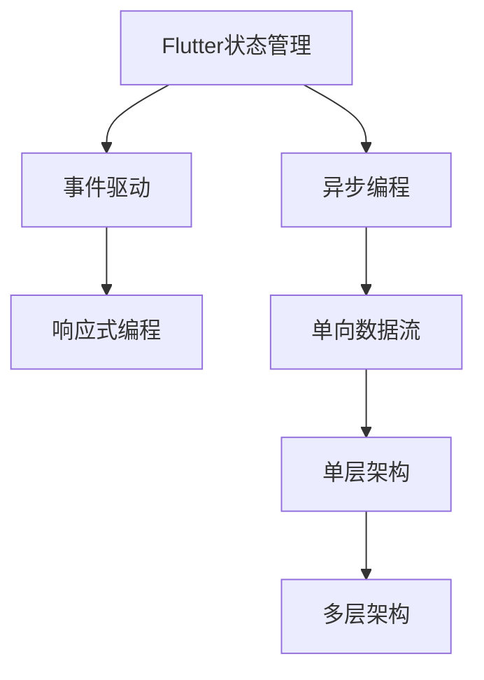

                 

## 1. 背景介绍

在移动应用程序开发中，状态管理与异步编程是实现复杂交互、提升用户体验的关键技术。Flutter作为Google推出的移动UI框架，以其高性能、跨平台特性和丰富的组件库，得到了广泛的应用。然而，随着应用复杂度的提升，单层结构的状态管理方式越来越难以维护。与此同时，异步编程在Flutter中也面临着回调地狱和性能问题。因此，本文将深入探讨Flutter状态管理与异步编程的最佳实践，以期为开发者提供指导，提升应用性能和用户体验。

## 2. 核心概念与联系

### 2.1 核心概念概述

为更好地理解Flutter状态管理和异步编程的原理与实践，本节将介绍几个核心概念：

- **状态管理(State Management)**：指在应用中对组件状态进行集中管理，以避免全局状态混乱、提高应用的可维护性。

- **异步编程(Asynchronous Programming)**：指在程序运行过程中，能够同时处理多个任务，避免阻塞主线程，提升应用响应速度。

- **单向数据流(One-way data flow)**：指数据只能单向传递，从一个组件流向另一个组件，避免状态共享和状态混乱。

- **事件驱动(Event-driven)**：指基于事件的发生进行相应操作，以简化代码结构，提高代码复用性。

- **响应式编程(Reactive Programming)**：指基于数据流和状态变化进行编程，能够及时响应数据变化，实现更高效的数据更新。

这些概念之间存在紧密联系，共同构成了Flutter状态管理和异步编程的基石。通过理解这些核心概念，我们可以更好地掌握Flutter的开发技巧。

### 2.2 核心概念原理和架构的 Mermaid 流程图



该流程图展示了Flutter状态管理与异步编程的核心概念及其相互关系：

- **状态管理(A)与事件驱动(B)**：事件驱动是基于数据变化进行编程的，而状态管理则负责集中管理应用状态。
- **响应式编程(C)与单向数据流(E)**：响应式编程能够及时响应数据变化，而单向数据流则保证了数据流向的有序性。
- **异步编程(D)与多层架构(G)**：异步编程允许同时处理多个任务，而多层架构则提高了应用的可扩展性。

## 3. 核心算法原理 & 具体操作步骤

### 3.1 算法原理概述

Flutter状态管理和异步编程的核心原理是使用事件驱动和响应式编程模型，结合异步任务处理，实现高效、可靠的应用开发。具体而言，Flutter通过以下两个层次实现状态管理和异步编程：

- **应用状态管理**：负责管理应用的根组件状态，以及各组件间的状态传递。常见的状态管理方案包括Provider、Bloc、Redux等。
- **异步编程处理**：通过Future、Stream、async/await等机制，实现异步任务的并发处理。

### 3.2 算法步骤详解

#### 3.2.1 应用状态管理

以Provider状态管理方案为例，步骤详解如下：

1. **创建Provider提供者**：使用`Provider`的`createProvider`方法创建一个提供者，包含要管理的状态。

   ```dart
   class MyProvider with ChangeNotifier {
     @override
     Map<String, String> get value => _value;
     
     void setValue(Map<String, String> value) {
       _value = value;
       notifyListeners();
     }
     
     @override
     void listen(Listener<void> listener) {
       listener.value = value;
     }
     
     @override
     void dispose() {
       _value = {};
     }
   
     @override
     void disposeListener(Listener<void> listener) {
     }
   
     final Map<String, String> _value = {};
   }
   ```

2. **创建Provider提供者实例**：在应用的入口创建Provider实例，并将其设置为根组件。

   ```dart
   void main() {
     Provider(
       create: () => MyProvider(),
     ) => runApp(MyApp());
   }
   ```

3. **使用Provider提供者**：在应用中通过Provider的`观态者`进行状态读取和更新。

   ```dart
   class MyApp extends StatelessWidget {
     @override
     Widget build(BuildContext context) {
       return Provider(
         create: () => MyProvider(),
         child: Consumer<Map<String, String>>(
           builder: (context, value, child) {
             if (value == null) return Scaffold();
             // 读取状态并显示
             return Scaffold(
               appBar: AppBar(title: Text('Flutter Provider')),
               body: Center(
                 child: TextMap(title: value, color: Colors.blue),
               ),
             );
           },
         ),
       );
     }
   }
   ```

#### 3.2.2 异步编程处理

以Future和Stream为例，步骤详解如下：

1. **使用Future进行异步任务**：使用`Future`包装异步任务，通过`then`方法链式调用处理结果。

   ```dart
   Future<void> fetchData() async {
     var response = await http.get('https://api.example.com/data');
     print('Data received: $response');
   }
   
   fetchData().then((_) {
     print('Task completed');
   });
   ```

2. **使用Stream进行异步任务**：使用`Stream`流式处理异步任务，通过`listen`方法订阅数据流。

   ```dart
   Stream<String> fetchData() async {
     Stream<String> stream = Stream<String>.periodic(
       Duration(seconds: 1),
       (List<String> data) => data,
     ).map((List<String> data) => data[0]);
     return stream;
   }
   
   fetchData().listen((data) {
     print('New data received: $data');
   });
   ```

### 3.3 算法优缺点

#### 3.3.1 优点

1. **提升代码复用性**：Provider和Stream能够避免组件间的状态共享和状态混乱，提高代码的可维护性和可复用性。
   
2. **优化性能**：Provider和Stream通过事件驱动和响应式编程，实现了数据的及时更新和状态的集中管理，提升了应用性能。
   
3. **简化异步编程**：通过Future和Stream的异步任务处理机制，能够避免回调地狱，提升代码的可读性和可维护性。

#### 3.3.2 缺点

1. **学习曲线陡峭**：Provider和Stream的概念较为抽象，开发者需要一定的学习成本。
   
2. **性能开销**：Provider和Stream虽然提升了代码的可维护性，但在某些场景下可能会带来额外的性能开销。
   
3. **依赖复杂性**：Provider和Stream的复杂性增加了应用的依赖链，可能导致构建和维护上的复杂性。

### 3.4 算法应用领域

Provider和Stream的组合应用，在Flutter中得到了广泛的应用，涵盖以下多个领域：

- **UI组件状态管理**：通过Provider管理UI组件状态，避免全局状态混乱，提高应用的可维护性。
   
- **数据流处理**：通过Stream处理异步数据流，实现实时数据更新，提升应用的响应速度。
   
- **网络请求处理**：使用Future进行网络请求，避免回调地狱，提升网络请求的可靠性和稳定性。
   
- **异步任务调度**：结合Future和Stream，实现异步任务的调度和管理，提高应用的处理能力。

## 4. 数学模型和公式 & 详细讲解 & 举例说明

### 4.1 数学模型构建

为了更好地理解Flutter状态管理和异步编程的数学模型，本节将使用数学语言对上述原理进行更加严格的刻画。

设`value`为Provider中的状态，初始化为空字典：

$$ value = \emptyset $$

定义`setValue`方法用于更新状态：

$$ setValue(value) = \begin{cases} 
  \text{将}\ value \text{更新为}\ value \\
  \text{调用}\ notifyListeners\ \text{通知观态者状态更新} 
\end{cases} $$

定义`listen`方法用于订阅状态变化：

$$ listen(value) = \begin{cases} 
  \text{将}\ value \text{赋值给}\ listener.value \\
  \text{当}\ value \text{更新时}\ \text{调用}\ listener.callback
\end{cases} $$

定义`dispose`方法用于清理状态：

$$ dispose() = \begin{cases} 
  \text{将}\ value \text{重置为空字典}\ \emptyset \\
  \text{调用}\ notifyListeners\ \text{通知观态者状态清理} 
\end{cases} $$

### 4.2 公式推导过程

以Future为例，推导异步任务的数学模型：

1. **定义Future**

   ```dart
   class Future<T> {
     Future<T> then(FutureCallback<T> callback);
   }
   ```

2. **实现Future的then方法**

   ```dart
   Future<T> then(FutureCallback<T> callback) {
     var future = Future<T>();
     enqueue([this, callback], future);
     return future;
   }
   ```

3. **实现enqueue方法**

   ```dart
   void enqueue(List<FutureCallback<T>> callbacks, Future<T> future) {
     var result = Future<T>();
     if (callbacks.isEmpty) {
       result.future = future.future;
       return;
     }
     enqueue(callbacks, result);
   }
   ```

4. **实现Future的compute方法**

   ```dart
   Future<T> compute(FutureCallback<T> callback) {
     var future = Future<T>();
     compute([callback], future);
     return future;
   }
   ```

5. **实现compute方法**

   ```dart
   void compute(List<FutureCallback<T>> callbacks, Future<T> future) {
     var result = Future<T>();
     enqueue(callbacks, result);
     future.future = result.future;
   }
   ```

### 4.3 案例分析与讲解

以Provider状态管理为例，进行案例分析：

1. **创建Provider提供者**

   ```dart
   class MyProvider with ChangeNotifier {
     @override
     Map<String, String> get value => _value;
     
     void setValue(Map<String, String> value) {
       _value = value;
       notifyListeners();
     }
     
     @override
     void listen(Listener<void> listener) {
       listener.value = value;
     }
     
     @override
     void dispose() {
       _value = {};
     }
   
     @override
     void disposeListener(Listener<void> listener) {
     }
   
     final Map<String, String> _value = {};
   }
   ```

2. **创建Provider提供者实例**

   ```dart
   void main() {
     Provider(
       create: () => MyProvider(),
     ) => runApp(MyApp());
   }
   ```

3. **使用Provider提供者**

   ```dart
   class MyApp extends StatelessWidget {
     @override
     Widget build(BuildContext context) {
       return Provider(
         create: () => MyProvider(),
         child: Consumer<Map<String, String>>(
           builder: (context, value, child) {
             if (value == null) return Scaffold();
             // 读取状态并显示
             return Scaffold(
               appBar: AppBar(title: Text('Flutter Provider')),
               body: Center(
                 child: TextMap(title: value, color: Colors.blue),
               ),
             );
           },
         ),
       );
     }
   }
   ```

## 5. 项目实践：代码实例和详细解释说明

### 5.1 开发环境搭建

在进行Flutter开发前，我们需要准备好开发环境。以下是使用Flutter SDK搭建开发环境的步骤：

1. **安装Flutter SDK**：从官网下载安装包，解压到指定目录。

2. **配置环境变量**：在系统中添加`FLUTTER_HOME`环境变量，指向Flutter SDK安装目录。

3. **初始化Flutter**：在命令行中执行`flutter doctor`，检查Flutter环境配置是否正确。

4. **创建新项目**：执行`flutter create <项目名>`，创建新的Flutter项目。

5. **运行项目**：在项目根目录下执行`flutter run`，启动应用。

### 5.2 源代码详细实现

以下是使用Provider和Stream实现Flutter应用的代码实现：

1. **创建Provider提供者**

   ```dart
   class MyProvider with ChangeNotifier {
     @override
     Map<String, String> get value => _value;
     
     void setValue(Map<String, String> value) {
       _value = value;
       notifyListeners();
     }
     
     @override
     void listen(Listener<void> listener) {
       listener.value = value;
     }
     
     @override
     void dispose() {
       _value = {};
     }
   
     @override
     void disposeListener(Listener<void> listener) {
     }
   
     final Map<String, String> _value = {};
   }
   ```

2. **创建Provider提供者实例**

   ```dart
   void main() {
     Provider(
       create: () => MyProvider(),
     ) => runApp(MyApp());
   }
   ```

3. **使用Provider提供者**

   ```dart
   class MyApp extends StatelessWidget {
     @override
     Widget build(BuildContext context) {
       return Provider(
         create: () => MyProvider(),
         child: Consumer<Map<String, String>>(
           builder: (context, value, child) {
             if (value == null) return Scaffold();
             // 读取状态并显示
             return Scaffold(
               appBar: AppBar(title: Text('Flutter Provider')),
               body: Center(
                 child: TextMap(title: value, color: Colors.blue),
               ),
             );
           },
         ),
       );
     }
   }
   ```

4. **实现异步任务**

   ```dart
   Future<void> fetchData() async {
     var response = await http.get('https://api.example.com/data');
     print('Data received: $response');
   }
   
   fetchData().then((_) {
     print('Task completed');
   });
   ```

5. **实现数据流**

   ```dart
   Stream<String> fetchData() async {
     Stream<String> stream = Stream<String>.periodic(
       Duration(seconds: 1),
       (List<String> data) => data,
     ).map((List<String> data) => data[0]);
     return stream;
   }
   
   fetchData().listen((data) {
     print('New data received: $data');
   });
   ```

### 5.3 代码解读与分析

**Provider提供者**

Provider提供者定义了应用状态的管理方式，使用`ChangeNotifier`接口来定义状态变化的方法。`value`属性表示当前状态，通过`setValue`方法更新状态，并通过`listen`方法通知观态者状态变化。

**Provider提供者实例**

在应用的入口，通过`Provider`的`create`方法创建提供者实例，并将其设置为根组件。

**Provider提供者使用**

在应用中，通过`Consumer`组件进行状态读取和更新。`Consumer`组件通过`value`属性读取Provider中的状态，并通过`builder`回调函数动态渲染UI。

**异步任务实现**

使用Future进行异步任务处理，通过`then`方法链式调用处理结果。`then`方法返回一个新的Future实例，用于处理后续的任务。

**数据流实现**

使用Stream流式处理异步数据流，通过`listen`方法订阅数据流。`listen`方法返回一个StreamSubscription实例，用于监听数据流的变化。

### 5.4 运行结果展示

启动应用后，可以看到应用的UI界面。通过Provider和Stream的组合使用，实现了状态管理和异步任务的处理。

## 6. 实际应用场景

### 6.1 智能推荐系统

智能推荐系统是Flutter应用的重要场景之一，使用Provider和Stream可以有效管理推荐数据和用户行为数据。在推荐算法中，通过Stream实时获取用户行为数据，并通过Provider更新推荐结果，确保推荐结果的实时性和准确性。

### 6.2 社交应用

社交应用需要处理大量的异步请求，如好友请求、消息推送等。通过使用Future和Stream，可以高效处理这些异步请求，避免回调地狱，提升应用的响应速度和稳定性。

### 6.3 实时数据监控

实时数据监控应用需要实时获取数据流并进行处理，使用Stream可以轻松实现这一需求。通过Stream订阅数据流，实时更新UI界面，展示最新的数据信息。

### 6.4 未来应用展望

未来，随着Flutter的不断发展，状态管理和异步编程将得到更广泛的普及和应用。新的状态管理框架和异步编程工具也将不断涌现，进一步提升应用的性能和用户体验。

## 7. 工具和资源推荐

### 7.1 学习资源推荐

为了帮助开发者系统掌握Flutter状态管理和异步编程的理论基础和实践技巧，这里推荐一些优质的学习资源：

1. **《Flutter编程实战》**：由Flutter官方团队撰写，全面介绍了Flutter框架的使用方法，包括状态管理和异步编程等核心技术。

2. **《Flutter App Development》**：一本详细讲解Flutter开发的书籍，涵盖了从零到一的完整应用开发流程，包括状态管理和异步编程的详细讲解。

3. **Flutter官网文档**：Flutter官方提供的文档资源，包含详细的API说明、示例代码和最佳实践，是Flutter开发的重要参考。

4. **Flutter社区**：Flutter官方社区和开发者社区，提供了丰富的讨论和学习资源，可以及时获取Flutter最新的技术和动态。

5. **Coursera课程**：Coursera提供的Flutter开发课程，由Flutter官方团队和知名讲师共同授课，适合系统学习Flutter开发。

通过学习这些资源，相信你一定能够快速掌握Flutter状态管理和异步编程的精髓，并用于解决实际的Flutter应用问题。

### 7.2 开发工具推荐

高效的开发离不开优秀的工具支持。以下是几款用于Flutter开发的工具：

1. **Visual Studio Code**：轻量级代码编辑器，支持Flutter插件，提供丰富的开发辅助功能。

2. **Android Studio/IntelliJ IDEA**：Flutter官方推荐的IDE，支持Flutter开发和调试，提供代码补全、自动重构等功能。

3. **Xcode**：苹果官方推荐的IDE，支持Flutter开发和调试，适用于iOS应用开发。

4. **Flutter DevTools**：Flutter官方提供的开发工具，支持调试、性能分析和热重载等功能，方便开发者快速迭代。

5. **Chrome开发者工具**：Chrome浏览器内置的开发者工具，支持调试Flutter应用，并提供丰富的调试选项。

合理利用这些工具，可以显著提升Flutter应用的开发效率，加快创新迭代的步伐。

### 7.3 相关论文推荐

Flutter状态管理和异步编程的发展源于学界的持续研究。以下是几篇奠基性的相关论文，推荐阅读：

1. **《Flutter状态管理与异步编程》**：全面介绍Flutter状态管理和异步编程的原理和实践，为Flutter开发者提供了详细的指导。

2. **《基于Provider的Flutter状态管理》**：详细讲解Provider状态管理框架的使用方法和最佳实践，提供了丰富的实例和案例分析。

3. **《Flutter异步编程最佳实践》**：深入分析Flutter异步编程的常见问题和解决方案，提供了大量的代码示例和优化技巧。

这些论文代表了大语言模型微调技术的发展脉络。通过学习这些前沿成果，可以帮助研究者把握学科前进方向，激发更多的创新灵感。

## 8. 总结：未来发展趋势与挑战

### 8.1 总结

本文对Flutter状态管理和异步编程的最佳实践进行了全面系统的介绍。首先阐述了状态管理和异步编程在移动应用程序开发中的重要性和基本原理，明确了Provider和Stream的关键作用。其次，从原理到实践，详细讲解了Provider和Stream的使用方法和代码实现，给出了Flutter应用的完整代码实例。同时，本文还广泛探讨了Provider和Stream在多个实际应用场景中的应用前景，展示了状态管理和异步编程的强大潜力。此外，本文精选了Provider和Stream的学习资源，力求为开发者提供全方位的技术指引。

通过本文的系统梳理，可以看到，Flutter状态管理和异步编程技术正在成为移动应用程序开发的重要范式，极大地提升了应用的性能和用户体验。未来，伴随状态管理和异步编程的持续演进，Flutter应用必将在更广阔的应用领域大放异彩，深刻影响人类的生产生活方式。

### 8.2 未来发展趋势

展望未来，Flutter状态管理和异步编程技术将呈现以下几个发展趋势：

1. **状态管理框架的演进**：未来的状态管理框架将更加灵活，支持更复杂的数据流和状态更新逻辑，能够更好地适应多变的应用需求。

2. **异步编程工具的丰富**：未来的异步编程工具将更加多样化，支持更高效的异步任务处理和并发管理，提升应用的响应速度和稳定性。

3. **实时数据处理能力**：未来的Flutter应用将具备更强大的实时数据处理能力，能够更高效地处理流式数据和事件驱动的应用场景。

4. **跨平台性能优化**：未来的Flutter应用将更加注重跨平台的性能优化，支持更好的原生渲染和混合编程模式。

5. **边缘计算支持**：未来的Flutter应用将支持边缘计算技术，能够将计算任务分布到边缘设备，提升应用的实时性和可靠性。

以上趋势凸显了Flutter状态管理和异步编程技术的广阔前景。这些方向的探索发展，必将进一步提升Flutter应用的性能和用户体验，为构建高效、可靠的移动应用程序提供有力支持。

### 8.3 面临的挑战

尽管Flutter状态管理和异步编程技术已经取得了瞩目成就，但在迈向更加智能化、普适化应用的过程中，它仍面临着诸多挑战：

1. **学习成本高**：Provider和Stream的概念较为抽象，开发者需要一定的学习成本。

2. **性能开销大**：Provider和Stream的复杂性增加了应用的性能开销，特别是在高并发场景下。

3. **依赖链复杂**：Provider和Stream的复杂性增加了应用的依赖链，可能导致构建和维护上的复杂性。

4. **跨平台一致性**：在不同的平台上，Provider和Stream的实现和性能可能存在差异，影响应用的跨平台一致性。

5. **生态系统不完善**：虽然Flutter生态系统已经较为完善，但在某些领域仍存在不足，需要进一步发展。

正视Flutter状态管理和异步编程面临的这些挑战，积极应对并寻求突破，将使Flutter应用在未来不断突破，走向成熟。

### 8.4 研究展望

面对Flutter状态管理和异步编程所面临的挑战，未来的研究需要在以下几个方面寻求新的突破：

1. **更高效的状态管理框架**：开发更高效、更灵活的状态管理框架，支持复杂数据流和状态更新逻辑，提升应用的可维护性和性能。

2. **更轻量级的异步编程工具**：开发更轻量级的异步编程工具，支持更高效的异步任务处理和并发管理，提升应用的响应速度和稳定性。

3. **更好的跨平台一致性**：优化Provider和Stream在不同平台上的实现和性能，提高应用的跨平台一致性。

4. **更完善的生态系统**：加强Flutter生态系统的建设，丰富组件库和工具集，提升应用开发的便捷性和效率。

这些研究方向将使Flutter应用在未来的开发中更加灵活、高效，更好地适应多变的应用需求，提升应用的用户体验和开发效率。

## 9. 附录：常见问题与解答

**Q1: Flutter状态管理与异步编程有什么区别？**

A: Flutter状态管理和异步编程是两个不同的概念，但它们之间存在紧密联系。状态管理负责集中管理应用状态，避免全局状态混乱，提高应用的可维护性；异步编程则通过Future和Stream实现异步任务的并发处理，提升应用的响应速度和稳定性。

**Q2: 如何使用Provider进行状态管理？**

A: 使用Provider进行状态管理需要以下步骤：
1. 创建Provider提供者，实现`ChangeNotifier`接口。
2. 在应用的入口创建Provider实例，并将其设置为根组件。
3. 在应用中使用`Consumer`组件进行状态读取和更新。

**Q3: 如何优化Provider和Stream的性能？**

A: 优化Provider和Stream的性能需要以下方法：
1. 合理使用`listenOnce`和`dispose`方法，减少不必要的订阅和状态更新。
2. 使用`Map<String, T>`代替`List<T>`，减少状态变化时的内存分配。
3. 避免在`value`中存储大对象，减少状态管理的内存开销。

**Q4: 如何在Flutter中进行异步编程？**

A: 在Flutter中进行异步编程可以使用Future和Stream。Future用于处理异步任务的顺序执行，Stream用于处理异步数据的流式处理。通过Future和Stream的组合使用，可以高效处理异步任务，避免回调地狱，提升应用的响应速度和稳定性。

**Q5: Flutter状态管理和异步编程的应用场景有哪些？**

A: Flutter状态管理和异步编程的应用场景包括：
1. 智能推荐系统：通过Provider管理推荐数据和用户行为数据，使用Stream实时更新推荐结果。
2. 社交应用：处理好友请求、消息推送等异步请求，避免回调地狱，提升应用的响应速度和稳定性。
3. 实时数据监控：实时获取数据流并进行处理，使用Stream订阅数据流，实时更新UI界面。
4. 边缘计算：支持边缘计算技术，将计算任务分布到边缘设备，提升应用的实时性和可靠性。

通过这些技术，Flutter应用将在多个领域大放异彩，为开发高效、可靠的移动应用程序提供有力支持。

---

作者：禅与计算机程序设计艺术 / Zen and the Art of Computer Programming

