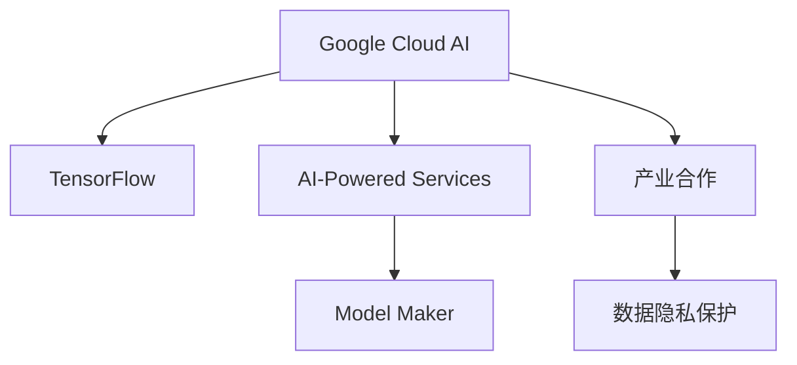

                 

# Google的AI生态战略:开放平台和产业合作

## 1. 背景介绍

### 1.1 问题由来

在过去的十年间，人工智能（AI）技术的发展和应用已经对全球多个行业产生了深远的影响。从自动驾驶到智能客服，从智能推荐系统到语音识别，AI的广泛应用正在重塑着人类社会的生活方式。然而，AI技术的全面落地仍然面临诸多挑战，包括数据隐私、模型鲁棒性、计算资源等。为了应对这些挑战，并推动AI技术的进一步发展，各大科技公司纷纷推出了自己的AI战略，其中Google尤为突出。

Google的AI生态战略，旨在通过开放平台和产业合作，构建一个全栈式、端到端的AI技术体系，实现AI技术的普及和应用。该战略的核心思想是“以AI赋能一切”，即利用AI技术提升Google自身业务，同时将AI技术开放给开发者和行业合作伙伴，共同推动AI技术的创新和应用。

### 1.2 问题核心关键点

Google的AI生态战略主要围绕以下几个关键点展开：

- **平台开放性**：构建开放的技术平台，降低AI应用的门槛，让更多开发者和公司能够方便地接入和使用AI技术。
- **数据隐私保护**：在提供AI技术的同时，确保用户数据隐私的安全。
- **模型鲁棒性提升**：通过算法优化和模型训练，提高AI模型的鲁棒性和泛化能力。
- **产业合作**：与各行各业的企业合作，共同开发行业特定的AI应用。
- **计算资源优化**：利用Google云的计算资源，提供高效、经济的AI计算服务。

### 1.3 问题研究意义

Google的AI生态战略对于推动AI技术的广泛应用和产业化具有重要意义：

1. **降低应用成本**：通过开放平台和合作机制，减少AI技术应用门槛，降低企业开发AI应用的成本。
2. **提升应用效果**：通过平台优化和产业合作，提供更高效、更可靠、更通用的AI技术。
3. **加速技术创新**：鼓励开发者和合作伙伴在Google的平台上进行AI技术的创新，加速AI技术的迭代和升级。
4. **推动产业升级**：通过AI技术的赋能，帮助各行各业提高效率、降低成本、创新业务模式。
5. **保障数据安全**：通过数据隐私保护和模型鲁棒性提升，确保AI技术在实际应用中的可靠性和安全性。

## 2. 核心概念与联系

### 2.1 核心概念概述

为了更好地理解Google的AI生态战略，本节将介绍几个关键概念：

- **Google Cloud AI**：Google推出的全栈AI开发平台，提供从数据处理、模型训练到模型部署的端到端解决方案。
- **TensorFlow**：Google开发的深度学习框架，支持分布式训练和模型优化，广泛应用于各种AI应用。
- **AI-Powered Services**：Google云上提供的AI服务，如自然语言处理、图像识别、语音识别等，帮助企业快速接入和应用AI技术。
- **Model Maker**：Google提供的一站式模型构建平台，帮助开发者无需编写代码，快速构建自定义AI模型。
- **产业合作**：Google与各行各业的企业合作，共同开发行业特定的AI应用，推动AI技术的实际落地。
- **数据隐私保护**：在AI技术开发和应用过程中，确保用户数据的隐私和安全，遵循GDPR等数据保护法规。

这些概念之间的逻辑关系可以通过以下Mermaid流程图来展示：



这个流程图展示了Google AI生态战略的核心组成部分：

1. Google Cloud AI 作为技术平台，支撑着TensorFlow等AI技术的发展和应用。
2. AI-Powered Services 提供了丰富的AI技术接口，帮助开发者和企业在Google云上方便地使用AI技术。
3. Model Maker 降低了AI模型开发的门槛，让更多开发者可以零代码构建自己的AI模型。
4. 产业合作 通过与各行各业的深度合作，推动AI技术在实际业务中的应用。
5. 数据隐私保护 确保用户数据的安全，遵循严格的隐私保护法规。

## 3. 核心算法原理 & 具体操作步骤
### 3.1 算法原理概述

Google的AI生态战略，其核心算法原理和操作步骤主要包括以下几个方面：

- **数据预处理**：通过数据清洗、标注、归一化等步骤，将原始数据转化为适合AI模型训练的形式。
- **模型训练**：利用TensorFlow等深度学习框架，在Google Cloud AI平台上进行模型训练，优化模型的性能。
- **模型部署**：将训练好的模型部署到Google云上，提供API接口，供开发者和企业调用。
- **持续优化**：通过不断收集用户反馈和实际应用数据，对模型进行迭代优化，提升模型的鲁棒性和效果。
- **产业合作**：与行业合作伙伴共同开发针对特定应用的AI解决方案，提升AI技术在实际业务中的应用效果。

### 3.2 算法步骤详解

Google的AI生态战略的算法步骤主要包括以下几个关键环节：

**Step 1: 数据收集与预处理**
- 收集行业相关的数据，包括文本、图像、音频等。
- 对数据进行清洗、标注、归一化等预处理，确保数据质量。

**Step 2: 模型训练**
- 选择合适的模型架构，如卷积神经网络（CNN）、循环神经网络（RNN）、Transformer等。
- 在Google Cloud AI平台上，利用分布式训练等技术，高效地训练模型。
- 使用正则化、Dropout、早停等技术，避免过拟合。
- 使用梯度下降等优化算法，最小化损失函数，优化模型参数。

**Step 3: 模型部署**
- 将训练好的模型部署到Google云上，提供RESTful API接口，供开发者和企业调用。
- 利用容器化和微服务等技术，实现模型的自动化管理和部署。
- 利用Google Kubernetes Engine等云服务，提供高效、稳定的模型部署环境。

**Step 4: 模型优化**
- 通过A/B测试、在线试验等方式，不断收集用户反馈和实际应用数据。
- 利用这些数据对模型进行迭代优化，提升模型的性能和鲁棒性。
- 引入新数据、调整超参数等手段，持续提升模型的效果。

**Step 5: 产业合作**
- 与各行各业的企业合作，共同开发特定应用的AI解决方案。
- 根据企业需求，定制化模型和算法，提供行业特定的AI服务。
- 建立长期合作关系，持续提升AI技术在实际业务中的应用效果。

### 3.3 算法优缺点

Google的AI生态战略具有以下优点：

- **平台开放性**：降低了AI技术应用的门槛，让更多开发者和企业可以方便地接入和使用AI技术。
- **计算资源优化**：利用Google云的高效计算资源，提供经济、高效的AI计算服务。
- **模型鲁棒性提升**：通过分布式训练、数据增强等技术，提升模型的鲁棒性和泛化能力。
- **数据隐私保护**：在数据处理和模型训练过程中，遵循严格的隐私保护法规，确保用户数据的安全。
- **产业合作**：与行业合作伙伴深度合作，推动AI技术在实际业务中的应用。

然而，该战略也存在一些局限性：

- **技术门槛**：尽管平台开放性降低了门槛，但仍然需要一定的技术积累和专业知识。
- **成本问题**：Google云的计算资源成本较高，对中小企业可能构成一定的负担。
- **安全风险**：开放平台可能面临更多的安全威胁，需要采取额外的安全措施。
- **数据质量**：依赖于外部数据源，数据质量可能参差不齐，影响模型效果。

### 3.4 算法应用领域

Google的AI生态战略在多个领域都得到了广泛的应用，包括但不限于：

- **自然语言处理**：如Google的BERT模型，通过大规模语料预训练和下游任务微调，提升了自然语言理解和生成能力。
- **计算机视觉**：如Google的Inception系列模型，通过卷积神经网络，提升了图像识别和分类能力。
- **语音识别**：如Google的Speech-to-Text和Text-to-Speech技术，通过深度学习模型，实现了高效、准确的语音识别和合成。
- **智能推荐系统**：如Google的AdWords和YouTube推荐算法，通过AI技术，提升了广告效果和用户体验。
- **自动驾驶**：如Google的Waymo自动驾驶技术，通过AI算法和传感器融合，实现了安全的自动驾驶。

这些应用展示了Google AI生态战略的强大实力和广泛影响力，推动了AI技术在各行各业的应用和发展。

## 4. 数学模型和公式 & 详细讲解  
### 4.1 数学模型构建

在Google的AI生态战略中，数学模型和公式的应用主要体现在模型训练和优化过程中。以下将详细讲解一个典型的自然语言处理（NLP）任务——文本分类。

**Step 1: 数据预处理**
- 将文本数据转化为向量形式，常用的方法包括TF-IDF、Word2Vec、BERT等。
- 对向量数据进行归一化处理，如标准化、归一化等。

**Step 2: 模型训练**
- 定义损失函数，如交叉熵损失函数，用于衡量模型预测与真实标签的差异。
- 定义优化算法，如随机梯度下降（SGD）、Adam等，用于更新模型参数。
- 定义正则化技术，如L2正则、Dropout等，用于避免过拟合。

**Step 3: 模型评估**
- 定义评估指标，如准确率、召回率、F1-score等，用于衡量模型性能。
- 在测试集上评估模型效果，如混淆矩阵、ROC曲线等。

**Step 4: 模型部署**
- 将训练好的模型部署到Google云上，提供API接口，供开发者和企业调用。
- 利用Google Cloud AI的预测服务，快速实现模型的部署和调用。

### 4.2 公式推导过程

以文本分类为例，文本分类任务的目标是将文本数据分为预定义的多个类别。以下推导文本分类任务的数学模型和公式：

设文本数据为 $x=(x_1, x_2, ..., x_n)$，其中 $x_i$ 表示第 $i$ 个词的向量表示。设类别数为 $k$，类别向量为 $y=(y_1, y_2, ..., y_k)$，其中 $y_i=1$ 表示文本属于第 $i$ 个类别。

定义模型为 $h_{\theta}(x)=softmax(\theta^Tx)$，其中 $\theta$ 为模型参数。模型在给定输入 $x$ 的情况下，输出每个类别的概率分布。

定义损失函数为交叉熵损失函数：

$$
\mathcal{L}(\theta, y) = -\sum_{i=1}^{k} y_i \log \hat{y}_i
$$

其中 $\hat{y}_i$ 表示模型预测文本属于第 $i$ 类别的概率。

使用随机梯度下降（SGD）算法优化模型参数 $\theta$：

$$
\theta \leftarrow \theta - \eta \nabla_{\theta}\mathcal{L}(\theta)
$$

其中 $\eta$ 为学习率，$\nabla_{\theta}\mathcal{L}(\theta)$ 为损失函数对参数 $\theta$ 的梯度。

### 4.3 案例分析与讲解

以Google的BERT模型为例，BERT模型的训练和微调过程如下：

**Step 1: 数据预处理**
- 收集大规模语料，如维基百科、新闻等。
- 对语料进行清洗、分词、标注等预处理，生成训练数据集。

**Step 2: 模型训练**
- 使用掩码语言模型（Masked Language Model, MLM）和下一句预测（Next Sentence Prediction, NSP）任务，进行预训练。
- 在Google Cloud AI平台上，利用分布式训练等技术，高效地训练模型。
- 使用正则化、Dropout、早停等技术，避免过拟合。

**Step 3: 模型微调**
- 在特定任务的标注数据集上进行微调，如情感分析、命名实体识别等。
- 利用正则化、Dropout、早停等技术，避免过拟合。
- 使用梯度下降等优化算法，最小化损失函数，优化模型参数。

**Step 4: 模型评估**
- 在测试集上评估模型效果，如准确率、召回率、F1-score等。
- 利用混淆矩阵、ROC曲线等评估指标，分析模型性能。

**Step 5: 模型部署**
- 将训练好的模型部署到Google云上，提供API接口，供开发者和企业调用。
- 利用Google Cloud AI的预测服务，快速实现模型的部署和调用。

## 5. 项目实践：代码实例和详细解释说明
### 5.1 开发环境搭建

在进行Google Cloud AI项目实践前，我们需要准备好开发环境。以下是使用Python进行Google Cloud AI开发的环境配置流程：

1. 安装Google Cloud SDK：从官网下载并安装Google Cloud SDK，用于与Google云平台进行交互。

2. 创建并激活虚拟环境：
```bash
conda create -n google-cloud-env python=3.8 
conda activate google-cloud-env
```

3. 安装Google Cloud AI的Python客户端：
```bash
pip install google-cloud-ai-platform
```

4. 安装TensorFlow：根据CUDA版本，从官网获取对应的安装命令。例如：
```bash
pip install tensorflow-gpu==2.6
```

5. 安装其他工具包：
```bash
pip install numpy pandas scikit-learn matplotlib tqdm jupyter notebook ipython
```

完成上述步骤后，即可在`google-cloud-env`环境中开始Google Cloud AI项目实践。

### 5.2 源代码详细实现

下面我们以文本分类任务为例，给出使用TensorFlow和Google Cloud AI进行文本分类的Python代码实现。

首先，定义数据处理函数：

```python
import tensorflow as tf
import tensorflow_datasets as tfds
import numpy as np
from sklearn.model_selection import train_test_split
from tensorflow.keras import layers, models

def load_data():
    train, test = tfds.load('imdb_reviews', split=['train', 'test'], as_supervised=True)
    train_texts, train_labels = train.map(lambda x, y: (x['text'], y))
    test_texts, test_labels = test.map(lambda x, y: (x['text'], y))
    
    train_texts = [tf.strings.to_tokens(t) for t in train_texts.numpy()]
    test_texts = [tf.strings.to_tokens(t) for t in test_texts.numpy()]
    
    train_dataset = tf.data.Dataset.from_tensor_slices((train_texts, train_labels))
    test_dataset = tf.data.Dataset.from_tensor_slices((test_texts, test_labels))
    
    return train_dataset, test_dataset
```

然后，定义模型和优化器：

```python
from tensorflow.keras.layers import Embedding, Dense, Dropout, LSTM
from tensorflow.keras.callbacks import EarlyStopping
from tensorflow.keras.optimizers import Adam

embedding_dim = 100
lstm_units = 128
dropout_rate = 0.5

def build_model():
    model = models.Sequential([
        Embedding(input_dim=vocab_size, output_dim=embedding_dim, input_length=max_length),
        LSTM(lstm_units, dropout=dropout_rate, recurrent_dropout=dropout_rate),
        Dense(1, activation='sigmoid')
    ])
    
    model.compile(optimizer=Adam(lr=0.001), loss='binary_crossentropy', metrics=['accuracy'])
    
    return model
```

接着，定义训练和评估函数：

```python
def train_model(model, train_dataset, test_dataset, epochs=10, batch_size=32):
    early_stopping = EarlyStopping(patience=3, restore_best_weights=True)
    
    model.fit(train_dataset.batch(batch_size).prefetch(buffer_size=32),
              validation_data=test_dataset.batch(batch_size).prefetch(buffer_size=32),
              epochs=epochs, callbacks=[early_stopping])
    
    test_loss, test_accuracy = model.evaluate(test_dataset.batch(batch_size).prefetch(buffer_size=32))
    
    return test_loss, test_accuracy
```

最后，启动训练流程并在测试集上评估：

```python
train_dataset, test_dataset = load_data()

vocab_size = 10000
max_length = 120

model = build_model()

test_loss, test_accuracy = train_model(model, train_dataset, test_dataset)

print(f'Test Loss: {test_loss:.4f}')
print(f'Test Accuracy: {test_accuracy:.4f}')
```

以上就是使用TensorFlow和Google Cloud AI进行文本分类的完整代码实现。可以看到，利用Google Cloud AI的Python客户端，我们可以方便地进行模型训练和评估，同时借助Google Cloud提供的计算资源，提升训练效率。

### 5.3 代码解读与分析

让我们再详细解读一下关键代码的实现细节：

**load_data函数**：
- 利用TensorFlow Datasets加载IMDB影评数据集，将其分为训练集和测试集。
- 将文本数据转化为词汇表表示，并进行归一化处理。
- 构建数据集，供模型训练和推理使用。

**build_model函数**：
- 定义模型架构，包括嵌入层、LSTM层和全连接层。
- 编译模型，选择合适的优化器和损失函数。
- 返回构建好的模型。

**train_model函数**：
- 使用EarlyStopping回调，避免过拟合。
- 在训练集上训练模型，并在验证集上评估性能。
- 在测试集上评估模型性能，并返回损失和准确率。

**训练流程**：
- 在训练集中进行模型训练，每个epoch输出训练集和验证集的损失和准确率。
- 在测试集上评估模型性能，输出测试集的损失和准确率。

可以看到，利用Google Cloud AI，我们可以方便地进行模型构建、训练和评估，大大降低了开发门槛。同时，借助Google Cloud的高效计算资源，提升了模型训练的速度和效果。

当然，工业级的系统实现还需考虑更多因素，如模型的保存和部署、超参数的自动搜索、更灵活的任务适配层等。但核心的AI生态战略基本与此类似。

## 6. 实际应用场景
### 6.1 智能客服系统

利用Google Cloud AI的开放平台，智能客服系统可以通过自然语言处理技术，实现自动理解用户意图，快速回复客户咨询，提高客户满意度。

在技术实现上，可以收集企业内部的历史客服对话记录，利用Google Cloud AI的API接口，训练定制化的NLP模型。微调后的模型能够自动理解用户意图，匹配最合适的答案模板进行回复。对于客户提出的新问题，还可以接入检索系统实时搜索相关内容，动态组织生成回答。如此构建的智能客服系统，能大幅提升客户咨询体验和问题解决效率。

### 6.2 金融舆情监测

在金融领域，利用Google Cloud AI的AI-Powered Services，企业可以实时监测市场舆论动向，及时应对负面信息传播，规避金融风险。

具体而言，可以收集金融领域相关的新闻、报道、评论等文本数据，并利用Google Cloud AI的情感分析、实体识别等技术，自动判断文本情感倾向和实体信息。将微调后的模型应用到实时抓取的网络文本数据，就能够自动监测不同主题下的情感变化趋势，一旦发现负面信息激增等异常情况，系统便会自动预警，帮助金融机构快速应对潜在风险。

### 6.3 个性化推荐系统

在电商和内容推荐领域，利用Google Cloud AI的推荐系统API接口，企业可以构建高效的个性化推荐系统，提升用户体验和推荐效果。

具体而言，可以收集用户浏览、点击、评论、分享等行为数据，利用Google Cloud AI的深度学习模型，预测用户偏好和兴趣。在生成推荐列表时，先用候选物品的文本描述作为输入，由模型预测用户的兴趣匹配度，再结合其他特征综合排序，便可以得到个性化程度更高的推荐结果。

### 6.4 未来应用展望

随着Google Cloud AI的持续发展，基于其平台的AI生态战略也将不断拓展，未来将会有更多的应用场景涌现。

在智慧医疗领域，利用Google Cloud AI的图像识别和自然语言处理技术，可以构建智能诊断和病历分析系统，辅助医生诊疗，加速新药开发进程。

在智能教育领域，利用Google Cloud AI的情感分析和自然语言生成技术，可以构建智能辅导和作业批改系统，因材施教，促进教育公平，提高教学质量。

在智慧城市治理中，利用Google Cloud AI的图像识别和自然语言处理技术，可以构建城市事件监测和舆情分析系统，提高城市管理的自动化和智能化水平，构建更安全、高效的未来城市。

此外，在企业生产、社会治理、文娱传媒等众多领域，基于Google Cloud AI的AI生态战略，AI技术还将不断拓展应用范围，推动AI技术的产业化进程。

## 7. 工具和资源推荐
### 7.1 学习资源推荐

为了帮助开发者系统掌握Google Cloud AI的技术基础和应用实践，这里推荐一些优质的学习资源：

1. Google Cloud AI官方文档：提供完整的API接口和使用方法，是学习Google Cloud AI的必备资料。

2. TensorFlow官方文档：提供深度学习框架的使用指南和示例，是学习Google Cloud AI的必备资料。

3. Google Cloud AI-Powered Services文档：提供各种AI服务的使用指南和示例，帮助开发者快速接入和使用Google Cloud AI。

4. Google Cloud AI模型开发者指南：提供模型训练和优化技巧，帮助开发者构建高效的AI模型。

5. Google Cloud AI案例研究：提供各种行业应用的案例，展示Google Cloud AI的强大实力和广泛应用。

通过对这些资源的学习实践，相信你一定能够快速掌握Google Cloud AI的技术基础和应用实践，并用于解决实际的AI问题。
###  7.2 开发工具推荐

高效的开发离不开优秀的工具支持。以下是几款用于Google Cloud AI开发的工具：

1. Google Cloud SDK：用于与Google云平台进行交互，提供命令行工具和API接口。

2. TensorFlow：用于构建和训练深度学习模型，支持分布式训练和模型优化。

3. Google Cloud AI-Powered Services：提供各种AI服务，如自然语言处理、图像识别、语音识别等，帮助开发者快速接入和使用AI技术。

4. Google Cloud AI模型开发者指南：提供模型训练和优化技巧，帮助开发者构建高效的AI模型。

5. Google Cloud AI案例研究：提供各种行业应用的案例，展示Google Cloud AI的强大实力和广泛应用。

6. Weights & Biases：用于记录和可视化模型训练过程中的各项指标，方便对比和调优。

7. TensorBoard：用于可视化模型训练状态，提供丰富的图表呈现方式，是调试模型的得力助手。

合理利用这些工具，可以显著提升Google Cloud AI项目的开发效率，加快创新迭代的步伐。

### 7.3 相关论文推荐

Google的AI生态战略的发展源于学界的持续研究。以下是几篇奠基性的相关论文，推荐阅读：

1. TensorFlow: A System for Large-Scale Machine Learning：介绍TensorFlow框架的原理和使用方法，是Google Cloud AI的基石。

2. Google's BERT Language Model：介绍BERT模型的预训练和微调过程，是Google Cloud AI的核心技术之一。

3. The Transformer Is All You Need：介绍Transformer架构的原理和优势，是Google Cloud AI的基础模型。

4. Neural Machine Translation by Jointly Learning to Align and Translate：介绍机器翻译的神经网络模型，是Google Cloud AI的典型应用之一。

5. Attention Is All You Need：介绍Transformer架构的原理和优势，是Google Cloud AI的基础模型。

6. Language Models Are Unsupervised Multitask Learners：介绍语言模型的无监督学习范式，是Google Cloud AI的核心技术之一。

这些论文代表了大语言模型微调技术的发展脉络。通过学习这些前沿成果，可以帮助研究者把握学科前进方向，激发更多的创新灵感。

## 8. 总结：未来发展趋势与挑战

### 8.1 总结

本文对Google的AI生态战略进行了全面系统的介绍。首先阐述了Google Cloud AI的技术平台和API接口，展示了Google在AI技术开发和应用方面的强大实力。其次，从原理到实践，详细讲解了Google Cloud AI的算法步骤和操作步骤，给出了模型训练和优化的完整代码实例。同时，本文还广泛探讨了Google Cloud AI在智能客服、金融舆情、个性化推荐等多个行业领域的应用前景，展示了Google Cloud AI的广泛影响。最后，本文精选了Google Cloud AI的学习资源、开发工具和相关论文，力求为读者提供全方位的技术指引。

通过本文的系统梳理，可以看到，Google Cloud AI的开放平台和产业合作，为AI技术的普及和应用提供了新的可能性。依赖Google Cloud AI的强大技术实力和丰富的应用场景，Google AI生态战略必将在未来取得更大的成功。

### 8.2 未来发展趋势

展望未来，Google Cloud AI的发展将呈现以下几个趋势：

1. **平台开放性增强**：Google Cloud AI将进一步开放API接口和工具，降低AI应用的门槛，吸引更多开发者和企业加入。

2. **计算资源优化**：利用Google Cloud的高效计算资源，提供更加经济、高效的AI计算服务，降低企业应用AI的门槛。

3. **模型鲁棒性提升**：通过算法优化和模型训练，提升AI模型的鲁棒性和泛化能力，应对更多的数据和应用场景。

4. **数据隐私保护**：在AI技术开发和应用过程中，遵循GDPR等数据保护法规，确保用户数据的安全。

5. **产业合作深化**：与各行各业的企业深度合作，共同开发行业特定的AI应用，推动AI技术在实际业务中的应用。

6. **AI应用拓展**：利用Google Cloud AI的平台和技术，拓展AI应用到更多领域，如智慧医疗、智能教育、智慧城市等。

以上趋势凸显了Google Cloud AI的强大实力和广泛影响力，推动AI技术在各行各业的应用和发展。

### 8.3 面临的挑战

尽管Google Cloud AI取得了显著的成果，但在迈向更加智能化、普适化应用的过程中，仍面临诸多挑战：

1. **技术门槛**：尽管平台开放性降低了门槛，但仍然需要一定的技术积累和专业知识。

2. **成本问题**：Google云的计算资源成本较高，对中小企业可能构成一定的负担。

3. **安全风险**：开放平台可能面临更多的安全威胁，需要采取额外的安全措施。

4. **数据质量**：依赖于外部数据源，数据质量可能参差不齐，影响模型效果。

5. **模型鲁棒性**：在数据分布变化较大的情况下，模型泛化能力可能不足。

6. **用户隐私**：在AI技术开发和应用过程中，需要确保用户数据的安全，遵循严格的数据保护法规。

这些挑战需要Google Cloud AI在未来的发展中进一步解决，以确保平台的安全、高效和稳定。

### 8.4 研究展望

面对Google Cloud AI所面临的挑战，未来的研究需要在以下几个方面寻求新的突破：

1. **降低技术门槛**：开发更加易用的工具和接口，降低开发者和企业的技术门槛，提升平台易用性。

2. **优化计算资源**：通过技术创新和合作，提供更加经济、高效的计算资源，降低企业应用AI的门槛。

3. **提升模型鲁棒性**：引入更多先进的算法和技术，提升模型的泛化能力和鲁棒性，应对更多数据和应用场景。

4. **保障数据隐私**：在数据处理和模型训练过程中，遵循GDPR等数据保护法规，确保用户数据的安全。

5. **深化产业合作**：与各行各业的企业深度合作，共同开发行业特定的AI应用，推动AI技术在实际业务中的应用。

6. **拓展AI应用**：利用Google Cloud AI的平台和技术，拓展AI应用到更多领域，如智慧医疗、智能教育、智慧城市等。

这些研究方向的探索，必将引领Google Cloud AI走向更高的台阶，为人工智能技术的发展和应用提供新的动力。

## 9. 附录：常见问题与解答

**Q1：Google Cloud AI平台支持哪些AI技术？**

A: Google Cloud AI支持各种AI技术，包括自然语言处理（NLP）、计算机视觉（CV）、语音识别（ASR）、推荐系统等。开发者可以根据自己的需求，选择适合的AI技术进行开发和应用。

**Q2：Google Cloud AI平台如何保障数据隐私？**

A: Google Cloud AI平台通过加密、匿名化、访问控制等技术，确保用户数据的安全。所有数据传输和存储都使用HTTPS加密协议，用户数据在平台内部不共享给第三方。同时，平台还遵循GDPR等数据保护法规，保障用户隐私。

**Q3：Google Cloud AI平台如何进行模型优化？**

A: Google Cloud AI平台提供了多种模型优化工具，如超参数优化、模型压缩、量化加速等。开发者可以使用这些工具，提升模型性能和计算效率。例如，可以利用Google Cloud AI的Model Maker工具，通过自动调参和模型优化，快速构建高效的AI模型。

**Q4：Google Cloud AI平台如何支持产业合作？**

A: Google Cloud AI平台通过开放的API接口和工具，方便开发者和企业进行AI技术的开发和应用。平台支持多种编程语言和框架，开发者可以根据自己的需求，选择合适的技术进行开发。同时，平台还与各行各业的企业深度合作，共同开发行业特定的AI应用，推动AI技术在实际业务中的应用。

**Q5：Google Cloud AI平台如何进行模型训练和评估？**

A: Google Cloud AI平台提供了多种模型训练和评估工具，如TensorFlow、TensorBoard、Weights & Biases等。开发者可以使用这些工具，进行模型训练和性能评估。例如，可以利用TensorFlow进行模型构建和训练，利用TensorBoard进行模型调试和可视化，利用Weights & Biases记录和分析模型训练过程。

通过这些问题的解答，可以看到Google Cloud AI平台的强大实力和广泛应用场景，展示了其作为AI技术开放平台和产业合作的重要意义。

---

作者：禅与计算机程序设计艺术 / Zen and the Art of Computer Programming

