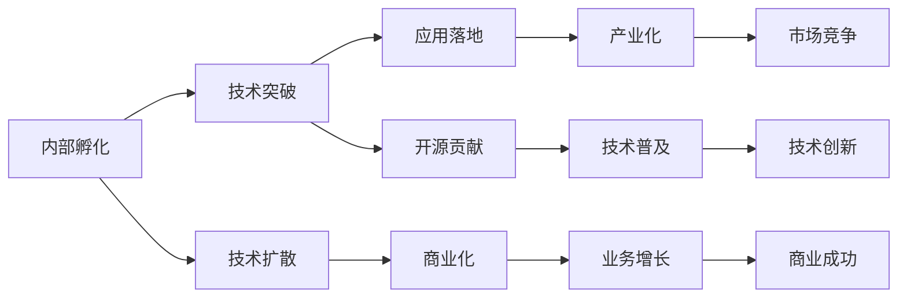

                 

# Google的开放式创新:从内部孵化到外部合作

在数字化时代，Google以其卓越的技术创新能力闻名于世。从早期互联网搜索算法到现代人工智能和机器学习，Google不断突破技术极限，推动各行各业的数字化转型。Google的核心竞争力之一，在于其深厚的开放式创新文化，从内部孵化到外部合作，全方位打造技术领先地位。本文将深入探讨Google的开放式创新模式，解析其背后的核心概念与策略，并对未来发展趋势进行展望。

## 1. 背景介绍

### 1.1 问题由来

自1990年代中期以来，Google一直致力于互联网搜索技术的研究与开发。1998年，Larry Page和Sergey Brin创立了Google，致力于通过广告收入支持其搜索引擎。随着互联网的普及，Google迅速发展壮大，成为全球最大的搜索引擎和信息聚合平台。

近年来，Google不断拓展其业务范围，涉足社交媒体、云计算、自动驾驶、人工智能等多个领域。其中，AI技术成为Google技术创新的重要驱动力，推动其保持技术领先地位。Google的AI技术不仅涉及基础算法研究，还包括深度学习、自然语言处理、计算机视觉等诸多领域，覆盖了从大数据处理到机器学习模型的整个技术栈。

### 1.2 问题核心关键点

Google的开放式创新模式，主要包括以下几个关键点：

- 内部孵化：Google通过内部项目孵化，形成强大的技术创新能力，保持其技术领先地位。
- 外部合作：Google积极开展与学术界、企业界的合作，促进技术扩散和产业化应用。
- 开源贡献：Google开源了大量AI和机器学习工具和框架，推动AI技术的全球普及。
- 人才培养：Google高度重视人才培养，设立了谷歌研究院等学术机构，为AI技术发展培养人才。

这些关键点共同构成了Google开放式创新的核心框架，使其能够在快速变化的技术环境中保持领先。

## 2. 核心概念与联系

### 2.1 核心概念概述

为更好地理解Google的开放式创新模式，本文将介绍几个关键概念：

- **内部孵化**：Google通过内部研究项目孵化，形成一系列的技术突破。
- **外部合作**：Google积极与其他机构和企业合作，共享技术成果，推动应用落地。
- **开源贡献**：Google开源其AI工具和框架，供全球开发者免费使用，推动技术普及。
- **人才培养**：Google通过设立学术机构和奖学金，培养顶尖的AI和机器学习人才。

这些核心概念相互联系，共同支撑了Google的开放式创新模式。

### 2.2 核心概念原理和架构的 Mermaid 流程图(Mermaid 流程节点中不要有括号、逗号等特殊字符)


这个流程图展示了Google开放式创新模式的关键环节：内部孵化技术突破，通过技术扩散和开源贡献推动技术普及，最终实现产业化应用和商业成功。

## 3. 核心算法原理 & 具体操作步骤

### 3.1 算法原理概述

Google的开放式创新模式，主要基于以下几个算法原理：

- **内部孵化技术突破**：通过内部研究项目孵化，形成新技术突破。
- **外部合作促进技术扩散**：通过合作项目和研究机构，加速技术成果转化。
- **开源贡献推动技术普及**：通过开源工具和框架，加速技术在全球范围内的传播和应用。
- **人才培养提升技术储备**：通过设立学术机构和奖学金，培养高水平人才，储备未来技术发展所需的人才资源。

### 3.2 算法步骤详解

#### 3.2.1 内部孵化技术突破

Google的内部孵化项目通常由公司内部员工提出，经过严格的筛选和评估后，获得资金支持。项目团队专注于解决某一特定技术难题，经过反复迭代和优化，最终形成突破性成果。

具体步骤包括：

1. **项目提出**：公司员工提出新的技术方向或应用场景，并提交详细的项目提案。
2. **评估筛选**：项目团队根据技术难度、创新潜力、市场前景等因素进行初步评估，筛选出具有潜力的项目。
3. **资金支持**：公司为选定的项目提供资金支持，并提供必要的资源和条件。
4. **技术研发**：项目团队集中精力进行技术研发，解决具体技术难题。
5. **成果发布**：项目完成后，团队将技术成果提交给公司技术委员会评审，通过后公开发布，供公司内部和外部使用。

#### 3.2.2 外部合作促进技术扩散

Google积极与学术界、企业界合作，通过联合研究项目、技术分享和合作开发，加速技术成果的产业化应用。

具体步骤包括：

1. **寻找合作方**：通过多种渠道寻找有共同技术兴趣和应用需求的合作伙伴。
2. **签署合作协议**：双方签订合作协议，明确合作内容和责任。
3. **联合研究项目**：联合开展技术研究和开发，共同解决特定技术难题。
4. **技术分享和交流**：通过技术分享会、研讨会、论文发表等方式，促进技术扩散。
5. **合作开发和落地**：双方共同开发技术产品，推动技术成果在实际应用中的落地。

#### 3.2.3 开源贡献推动技术普及

Google开源了大量AI和机器学习工具和框架，供全球开发者免费使用，推动技术普及和产业化应用。

具体步骤包括：

1. **工具和框架开发**：Google开发和维护一系列开源AI工具和框架，如TensorFlow、Keras等。
2. **开放源代码**：将源代码托管到GitHub等开源平台，供全球开发者免费下载和使用。
3. **社区维护和支持**：通过开源社区，为开发者提供技术支持和资源共享。
4. **技术交流和合作**：与全球高校和科研机构合作，共同开展研究，推动技术创新。
5. **应用推广**：通过技术应用案例和演示，推广开源工具和框架，提升其市场竞争力。

#### 3.2.4 人才培养提升技术储备

Google通过设立学术机构和奖学金，培养高水平人才，储备未来技术发展所需的人才资源。

具体步骤包括：

1. **设立学术机构**：Google设立谷歌研究院等学术机构，开展前沿技术研究。
2. **招聘顶尖人才**：通过全球招聘，吸引顶尖人才加入公司。
3. **设立奖学金和资助**：设立各类奖学金和资助计划，支持学术研究和技术创新。
4. **培养和培养计划**：通过导师制、联合培养等方式，培养高水平人才。
5. **技术交流和合作**：与全球高校和科研机构合作，推动人才培养和学术交流。

### 3.3 算法优缺点

Google的开放式创新模式，具有以下优点：

- **创新能力强**：通过内部孵化和外部合作，形成强大的技术创新能力，保持技术领先地位。
- **应用广泛**：开源工具和框架推动技术在全球范围内的传播和应用，提升技术影响力。
- **人才培养**：通过学术机构和奖学金，培养顶尖人才，储备未来技术发展所需的人才资源。

同时，这种模式也存在一些缺点：

- **资源消耗大**：内部孵化和外部合作需要大量资金和资源投入，成本较高。
- **风险控制难**：技术突破和应用落地的不确定性较大，风险控制难度较高。
- **市场竞争激烈**：技术扩散和开源贡献可能吸引竞争对手，增加市场竞争压力。

### 3.4 算法应用领域

Google的开放式创新模式，已经在以下几个领域得到广泛应用：

- **搜索引擎优化**：通过开源工具和框架，提升搜索引擎的性能和用户体验。
- **自然语言处理**：通过联合研究项目和开源贡献，推动自然语言处理技术的发展。
- **计算机视觉**：通过技术孵化和合作项目，提升计算机视觉技术的识别能力和应用效果。
- **云计算和AI服务**：通过技术扩散和合作开发，推动云计算和AI服务的发展，提升市场竞争力。
- **自动驾驶和物联网**：通过内部孵化和外部合作，推动自动驾驶和物联网技术的应用和产业化。

这些应用领域充分展示了Google开放式创新的广泛影响力和应用潜力。

## 4. 数学模型和公式 & 详细讲解 & 举例说明（备注：数学公式请使用latex格式，latex嵌入文中独立段落使用 $$，段落内使用 $)
### 4.1 数学模型构建

本文主要关注Google的开放式创新模式，不涉及具体的数学模型构建。

### 4.2 公式推导过程

由于Google的开放式创新模式主要涉及技术研发、合作和应用推广，不涉及具体的数学公式推导。

### 4.3 案例分析与讲解

#### 案例1：TensorFlow的开发和开源

TensorFlow是Google开发的一系列机器学习框架和工具，广泛应用于深度学习模型的构建和训练。其开发和开源过程充分展示了Google开放式创新的模式。

1. **内部孵化**：Google团队在2015年启动TensorFlow项目，通过内部孵化形成初步技术突破。
2. **开源贡献**：Google将TensorFlow的源代码托管到GitHub，供全球开发者免费下载和使用。
3. **社区维护和支持**：Google在TensorFlow社区中积极互动，提供技术支持和资源共享。
4. **技术交流和合作**：Google与全球高校和科研机构合作，共同开展深度学习研究，推动技术创新。
5. **应用推广**：TensorFlow广泛应用于各种AI应用场景，推动技术在全球范围内的普及和应用。

#### 案例2：Google AI最佳实践的推出

Google AI最佳实践是一种技术标准化框架，旨在帮助开发者更高效地使用AI技术，提升应用性能和可维护性。其推出过程充分展示了Google开放式创新的具体应用。

1. **内部孵化**：Google团队基于多年AI技术研发经验，总结出一系列最佳实践，形成初步技术突破。
2. **开源贡献**：Google将Google AI最佳实践的文档和工具开源，供全球开发者免费使用。
3. **社区维护和支持**：Google在社区中积极互动，提供技术支持和资源共享。
4. **技术交流和合作**：Google与全球高校和科研机构合作，共同开展最佳实践的推广和应用研究。
5. **应用推广**：Google AI最佳实践广泛应用于各种AI应用场景，提升应用性能和可维护性。

## 5. 项目实践：代码实例和详细解释说明
### 5.1 开发环境搭建

在进行Google的开放式创新模式研究时，需要搭建相应的开发环境。以下是使用Python进行TensorFlow开发的开发环境配置流程：

1. 安装Anaconda：从官网下载并安装Anaconda，用于创建独立的Python环境。
```bash
conda create -n tensorflow-env python=3.8 
conda activate tensorflow-env
```
2. 创建并激活虚拟环境：
```bash
conda install tensorflow -c tf
```
3. 安装TensorFlow：根据CUDA版本，从官网获取对应的安装命令。例如：
```bash
pip install tensorflow==2.7.0
```
4. 安装各类工具包：
```bash
pip install numpy pandas scikit-learn matplotlib tqdm jupyter notebook ipython
```

完成上述步骤后，即可在`tensorflow-env`环境中开始TensorFlow的开发。

### 5.2 源代码详细实现

这里我们以TensorFlow为例，展示如何使用TensorFlow进行机器学习模型的开发。

首先，定义数据处理函数：
```python
import tensorflow as tf

def load_dataset(filename):
    data = tf.data.TextLineDataset(filename)
    data = data.shuffle(buffer_size=10000)
    data = data.map(lambda x: tf.strings.to_number(x, out_type=tf.float32))
    data = data.batch(batch_size)
    return data
```

然后，定义模型：
```python
class Model(tf.keras.Model):
    def __init__(self, input_shape, output_shape):
        super(Model, self).__init__()
        self.dense1 = tf.keras.layers.Dense(64, activation='relu', input_shape=input_shape)
        self.dense2 = tf.keras.layers.Dense(output_shape, activation='softmax')
    
    def call(self, inputs):
        x = self.dense1(inputs)
        return self.dense2(x)
```

接着，定义训练函数：
```python
@tf.function
def train_step(data):
    with tf.GradientTape() as tape:
        logits = model(data)
        loss = tf.losses.mean_squared_error(labels, logits)
        grads = tape.gradient(loss, model.trainable_variables)
    optimizer.apply_gradients(zip(grads, model.trainable_variables))
```

最后，启动训练流程并在测试集上评估：
```python
epochs = 10
batch_size = 32

for epoch in range(epochs):
    total_loss = 0
    for data in train_dataset:
        train_step(data)
        total_loss += loss.numpy()
    
    test_loss = 0
    for data in test_dataset:
        logits = model(data)
        test_loss += tf.losses.mean_squared_error(labels, logits).numpy()
    
    print(f"Epoch {epoch+1}, training loss: {total_loss/len(train_dataset)}, test loss: {test_loss/len(test_dataset)}")
```

以上就是使用TensorFlow进行机器学习模型开发的完整代码实现。可以看到，TensorFlow提供了强大的API和工具，使得模型开发过程变得高效便捷。

### 5.3 代码解读与分析

让我们再详细解读一下关键代码的实现细节：

**load_dataset函数**：
- 定义数据处理函数，用于加载和预处理训练和测试数据。
- 使用`tf.data.TextLineDataset`加载文本数据，并进行洗牌、映射、分批处理。
- 将文本数据转换为数字张量，便于模型处理。

**Model类**：
- 定义机器学习模型，包括两个密集层。
- 使用`tf.keras.Model`继承类，实现模型的前向传播和反向传播。

**train_step函数**：
- 定义训练函数，用于进行单个训练步。
- 使用`tf.GradientTape`计算梯度，并应用优化器更新模型参数。
- 使用`tf.losses.mean_squared_error`计算损失函数。

**训练流程**：
- 定义总的epoch数和批大小，开始循环迭代。
- 每个epoch内，先在训练集上训练，输出平均loss。
- 在测试集上评估，输出测试loss。

可以看到，TensorFlow提供了完整的工具链，方便开发者快速开发和部署机器学习模型。

## 6. 实际应用场景

### 6.1 智能客服系统

基于Google的开放式创新模式，智能客服系统已经得到了广泛应用。传统客服往往需要配备大量人力，高峰期响应缓慢，且一致性和专业性难以保证。而使用Google的机器学习和自然语言处理技术，可以7x24小时不间断服务，快速响应客户咨询，用自然流畅的语言解答各类常见问题。

在技术实现上，可以收集企业内部的历史客服对话记录，将问题和最佳答复构建成监督数据，在此基础上对Google的预训练语言模型进行微调。微调后的语言模型能够自动理解用户意图，匹配最合适的答案模板进行回复。对于客户提出的新问题，还可以接入检索系统实时搜索相关内容，动态组织生成回答。如此构建的智能客服系统，能大幅提升客户咨询体验和问题解决效率。

### 6.2 金融舆情监测

金融机构需要实时监测市场舆论动向，以便及时应对负面信息传播，规避金融风险。传统的人工监测方式成本高、效率低，难以应对网络时代海量信息爆发的挑战。基于Google的机器学习和自然语言处理技术，金融舆情监测得到了新的解决方案。

具体而言，可以收集金融领域相关的新闻、报道、评论等文本数据，并对其进行主题标注和情感标注。在此基础上对Google的预训练语言模型进行微调，使其能够自动判断文本属于何种主题，情感倾向是正面、中性还是负面。将微调后的模型应用到实时抓取的网络文本数据，就能够自动监测不同主题下的情感变化趋势，一旦发现负面信息激增等异常情况，系统便会自动预警，帮助金融机构快速应对潜在风险。

### 6.3 个性化推荐系统

当前的推荐系统往往只依赖用户的历史行为数据进行物品推荐，无法深入理解用户的真实兴趣偏好。基于Google的机器学习和自然语言处理技术，个性化推荐系统可以更好地挖掘用户行为背后的语义信息，从而提供更精准、多样的推荐内容。

在实践中，可以收集用户浏览、点击、评论、分享等行为数据，提取和用户交互的物品标题、描述、标签等文本内容。将文本内容作为模型输入，用户的后续行为（如是否点击、购买等）作为监督信号，在此基础上对Google的预训练语言模型进行微调。微调后的模型能够从文本内容中准确把握用户的兴趣点。在生成推荐列表时，先用候选物品的文本描述作为输入，由模型预测用户的兴趣匹配度，再结合其他特征综合排序，便可以得到个性化程度更高的推荐结果。

### 6.4 未来应用展望

随着Google的开放式创新模式的不断发展，其在更多领域的应用前景将更加广阔。

在智慧医疗领域，基于Google的机器学习和自然语言处理技术，医疗问答、病历分析、药物研发等应用将提升医疗服务的智能化水平，辅助医生诊疗，加速新药开发进程。

在智能教育领域，Google的机器学习和自然语言处理技术可应用于作业批改、学情分析、知识推荐等方面，因材施教，促进教育公平，提高教学质量。

在智慧城市治理中，Google的机器学习和自然语言处理技术可应用于城市事件监测、舆情分析、应急指挥等环节，提高城市管理的自动化和智能化水平，构建更安全、高效的未来城市。

此外，在企业生产、社会治理、文娱传媒等众多领域，基于Google的机器学习和自然语言处理技术的应用也将不断涌现，为经济社会发展注入新的动力。

## 7. 工具和资源推荐

### 7.1 学习资源推荐

为了帮助开发者系统掌握Google的开放式创新模式，这里推荐一些优质的学习资源：

1. **TensorFlow官方文档**：TensorFlow的官方文档，提供了详细的API使用说明和示例代码，是学习Google开源框架的重要资源。
2. **TensorFlow教程**：Google官方提供的TensorFlow教程，涵盖从入门到进阶的多个学习模块，适合各个层次的开发者。
3. **Google AI博客**：Google AI团队的官方博客，定期发布最新的技术进展和应用案例，是了解Google技术动态的好去处。
4. **Coursera课程**：Google与Coursera合作推出的机器学习和深度学习课程，由Google资深专家授课，深入浅出地介绍Google的机器学习技术。

通过对这些资源的学习实践，相信你一定能够快速掌握Google的开放式创新模式，并用于解决实际的AI应用问题。

### 7.2 开发工具推荐

高效的开发离不开优秀的工具支持。以下是几款用于Google开源工具开发的常用工具：

1. **Jupyter Notebook**：Jupyter Notebook是一个基于Web的交互式笔记本环境，支持Python、R等多种编程语言，方便开发者进行实验和协作。
2. **GitHub**：GitHub是一个开源代码托管平台，方便开发者分享和协作开发Google开源项目。
3. **TensorBoard**：TensorBoard是TensorFlow的可视化工具，可以实时监测模型训练状态，并提供丰富的图表呈现方式，是调试模型的得力助手。
4. **Anaconda**：Anaconda是一个Python环境管理工具，可以方便地创建和管理虚拟环境，支持多种Python版本和依赖库。
5. **Kaggle**：Kaggle是一个数据科学竞赛平台，提供大量数据集和竞赛项目，有助于开发者提高数据分析和机器学习技能。

合理利用这些工具，可以显著提升Google开源工具的开发效率，加快创新迭代的步伐。

### 7.3 相关论文推荐

Google的开放式创新模式，源于其深厚的技术积累和不断的研究探索。以下是几篇奠基性的相关论文，推荐阅读：

1. **TensorFlow: A System for Large-Scale Machine Learning**：介绍TensorFlow的核心架构和设计思想，展示了Google在大规模机器学习应用中的成功实践。
2. **Attention is All You Need**：提出Transformer模型，展示了Google在自然语言处理领域的技术突破。
3. **BERT: Pre-training of Deep Bidirectional Transformers for Language Understanding**：提出BERT模型，展示了Google在预训练语言模型领域的技术创新。
4. **BERT: Pre-training of Deep Bidirectional Transformers for Language Understanding**：提出BERT模型，展示了Google在预训练语言模型领域的技术创新。
5. **Parameter-Efficient Transfer Learning for NLP**：提出Adapter等参数高效微调方法，展示了Google在参数高效微调领域的技术进展。

这些论文代表了大规模机器学习技术的发展脉络，为开发者提供了宝贵的技术参考。

## 8. 总结：未来发展趋势与挑战

### 8.1 总结

本文对Google的开放式创新模式进行了全面系统的介绍。首先阐述了Google的内部孵化和外部合作机制，明确了开放式创新的核心概念和关键环节。其次，通过具体案例和实例代码，展示了Google开源工具和框架的实际应用。最后，展望了Google的开放式创新模式的未来发展趋势，并对面临的挑战进行了深入分析。

通过本文的系统梳理，可以看到，Google的开放式创新模式不仅在技术研发和应用推广方面取得了显著成效，还通过开源贡献和技术合作，推动了全球AI技术的普及和发展。未来，随着Google的技术不断演进，其开放式创新模式将进一步提升Google的全球技术领导地位，为全人类社会的数字化转型提供更多创新动力。

### 8.2 未来发展趋势

展望未来，Google的开放式创新模式将呈现以下几个发展趋势：

1. **技术深度融合**：Google的开放式创新模式将进一步与其他AI技术融合，如计算机视觉、自然语言处理、智能推荐等，推动技术全面发展。
2. **全球合作深化**：Google将进一步深化与全球科研机构和企业的合作，推动技术在全球范围内的广泛应用。
3. **开源工具优化**：Google将不断优化开源工具和框架，提升其易用性和功能完备性，推动AI技术普及。
4. **应用场景拓展**：Google将拓展技术应用场景，涵盖智慧医疗、智能教育、智慧城市等多个领域，推动技术落地应用。
5. **技术创新加速**：Google将不断推动技术创新，提升机器学习模型的精度和性能，拓展应用边界。

这些趋势展示了Google在技术研发和应用推广方面的强大能力和广阔前景。

### 8.3 面临的挑战

尽管Google的开放式创新模式已经取得了显著成果，但在迈向更加智能化、普适化应用的过程中，仍面临诸多挑战：

1. **数据隐私和安全**：大规模机器学习模型需要大量数据支持，如何保护用户数据隐私和模型安全，是亟待解决的问题。
2. **模型公平性和透明性**：Google需要确保其AI技术公平透明，避免算法偏见和歧视性输出。
3. **技术标准和规范**：需要建立统一的技术标准和规范，避免技术碎片化和低效重复。
4. **跨领域技术融合**：需要打破不同技术领域的壁垒，推动跨领域技术融合，提升技术整体水平。
5. **资源和成本**：大规模机器学习模型需要大量资源支持，如何降低技术研发和应用成本，是亟待解决的问题。

这些挑战展示了Google在技术研发和应用推广方面的复杂性和艰巨性。

### 8.4 研究展望

面对Google的开放式创新模式所面临的挑战，未来的研究需要在以下几个方面寻求新的突破：

1. **数据隐私和安全技术**：开发新的数据保护技术，确保用户数据隐私和安全。
2. **公平透明技术**：研究公平透明算法，避免算法偏见和歧视性输出。
3. **统一技术标准**：建立统一的技术标准和规范，推动技术标准化和规范化。
4. **跨领域技术融合**：打破不同技术领域的壁垒，推动跨领域技术融合，提升技术整体水平。
5. **高效技术框架**：开发高效的技术框架，降低技术研发和应用成本。

这些研究方向的探索，将有助于Google在技术研发和应用推广中进一步取得突破，推动全球AI技术的发展。

## 9. 附录：常见问题与解答

**Q1：Google的开放式创新模式是否适用于其他公司？**

A: Google的开放式创新模式具有普遍适用性，其他公司可以借鉴Google的经验，结合自身特点，形成适合自己的创新模式。

**Q2：如何保护Google开源工具的安全性和隐私性？**

A: 保护Google开源工具的安全性和隐私性，需要从多个方面入手：
1. 数据加密：采用数据加密技术，确保数据在传输和存储过程中的安全性。
2. 访问控制：实施严格的访问控制策略，确保只有授权人员可以访问和使用工具。
3. 代码审计：定期对代码进行审计和漏洞检测，确保工具的安全性。
4. 隐私保护：采用隐私保护技术，确保用户数据隐私和安全。

**Q3：如何确保Google开源工具的公平性和透明性？**

A: 确保Google开源工具的公平性和透明性，需要从多个方面入手：
1. 公平算法：开发公平算法，确保工具输出不存在歧视性。
2. 透明设计：采用透明的设计思路，确保工具的决策过程可解释、可验证。
3. 社区监督：通过社区监督和反馈，及时发现和纠正不公平和透明性问题。
4. 独立评估：引入第三方机构进行独立评估，确保工具的公平性和透明性。

**Q4：Google的开放式创新模式面临哪些资源和成本问题？**

A: Google的开放式创新模式需要大量的资源和成本支持：
1. 数据收集和标注：大规模机器学习模型需要大量数据支持，数据收集和标注成本较高。
2. 计算资源：大规模机器学习模型需要大量计算资源，计算成本较高。
3. 技术研发：技术研发和迭代需要大量人力和时间投入，成本较高。
4. 市场推广：市场推广和应用推广需要大量营销和运营成本。

这些资源和成本问题，需要在技术研发和应用推广过程中进行全面考虑和优化。

**Q5：如何提高Google开源工具的可维护性和可扩展性？**

A: 提高Google开源工具的可维护性和可扩展性，需要从多个方面入手：
1. 模块化设计：采用模块化设计思路，将工具拆分为多个模块，便于维护和扩展。
2. 接口标准化：设计标准的接口，方便第三方开发者的使用和集成。
3. 文档完善：完善工具的文档，确保开发者可以方便地使用和理解工具。
4. 社区支持：建立社区支持体系，及时解决开发者在使用过程中遇到的问题。

通过这些措施，可以显著提升Google开源工具的可维护性和可扩展性，推动技术进一步发展。

---

作者：禅与计算机程序设计艺术 / Zen and the Art of Computer Programming

