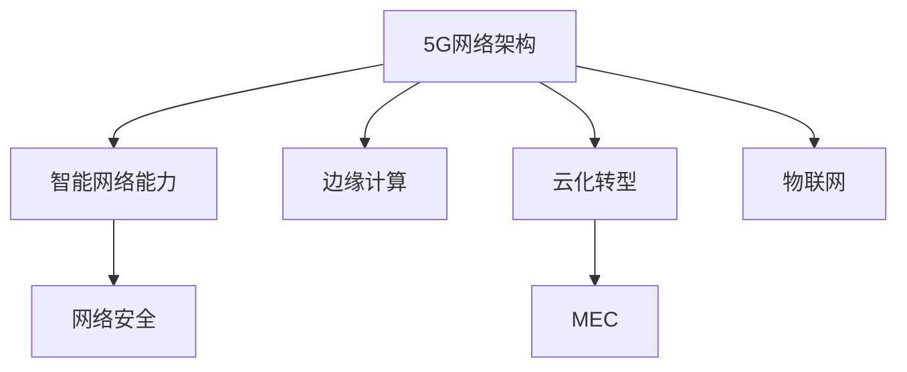

                 

# 5G技术管理：把握新一代通信革命机遇

> 关键词：5G技术,通信管理,网络架构,智能网络,边缘计算,网络安全,云化转型,移动边缘计算,物联网(MIoT)

## 1. 背景介绍

### 1.1 问题由来

随着全球范围内5G网络商用化的加速推进，5G技术的应用场景和产业价值正日益凸显。5G网络将大幅提升网络传输速率、降低延迟，为各类行业带来颠覆性变革。但随之而来的，是对网络管理、运营和维护的更高要求。

5G网络相较于4G网络，具有更高的复杂度和动态性。除了传统的网络设备、核心网、传输网、接入网外，还引入了大量新功能模块和新型终端设备。如何在更复杂的场景下进行高效管理，是大规模部署5G网络、最大化5G网络效能的重要问题。

### 1.2 问题核心关键点

5G网络的管理涉及从设备、业务、用户到网络性能等诸多方面，核心关键点包括：

1. **网络架构优化**：如何快速适应5G网络的复杂性，实现灵活高效的网络管理。
2. **智能网络能力**：如何利用AI、大数据等技术，实现自适应、智能化的网络优化。
3. **边缘计算应用**：如何通过边缘计算分散网络负载，提升网络效率。
4. **网络安全防护**：如何在5G网络中构建更强大的安全防护体系，防范潜在威胁。
5. **云化转型**：如何通过云化、集中化管理，降低运维成本，提升网络管理效率。

### 1.3 问题研究意义

5G技术管理的研究和实践，对于推动5G网络的规模化部署、提升网络效能、促进相关产业的发展具有重要意义：

1. 促进5G网络的大规模部署。通过高效的网络管理方法，降低5G网络的部署和运维成本，加速5G技术的应用和普及。
2. 提升5G网络的用户体验。通过智能网络优化，提升网络性能和覆盖，满足多样化应用场景的通信需求。
3. 驱动5G产业的繁荣发展。为5G网络上的各类应用（如智慧城市、车联网、工业互联网等）提供坚实的技术支撑，促进新经济的崛起。
4. 推动电信行业的数字化转型。通过网络云化、集中化管理，促进电信行业的业务升级和服务创新。

## 2. 核心概念与联系

### 2.1 核心概念概述

为更好地理解5G网络管理的技术内涵和实施方法，本节将介绍几个核心概念及其相互联系：

1. **5G网络架构**：5G网络架构由核心网、边缘云、传输网、接入网等组成，引入SBA(Service Based Architecture)、NSSF(Network Slice Selection Function)等新机制。
2. **智能网络能力**：通过引入AI、机器学习等技术，实现自适应、智能化的网络优化和管理。
3. **边缘计算**：通过在网络边缘部署计算资源，实现数据和服务的本地化处理，提升网络效率。
4. **网络安全**：针对5G网络复杂性，构建基于区块链、量子加密等技术的安全防护体系。
5. **云化转型**：通过将网络管理功能上云，实现集中化管理，降低运维成本。
6. **移动边缘计算(MEC)**：通过在网络边缘部署计算资源，实现数据和服务的本地化处理，提升网络效率。
7. **物联网(MIoT)**：5G网络与物联网的深度融合，为智能设备、工业互联网等提供高效通信支持。

这些概念之间的逻辑关系可以通过以下Mermaid流程图来展示：



这个流程图展示了5G网络管理的关键概念及其相互关系：

1. 5G网络架构为智能网络能力、边缘计算、云化转型等提供了基础平台。
2. 智能网络能力依托于5G网络架构和边缘计算，为网络管理提供智能化支撑。
3. 网络安全在5G网络架构的基础上构建，确保网络安全防护。
4. 云化转型通过集中化管理，提升网络效率。
5. MEC和物联网是5G网络管理的具体应用场景，通过边缘计算提升网络效能。

## 3. 核心算法原理 & 具体操作步骤

### 3.1 算法原理概述

5G网络管理的核心算法原理可以总结为以下几个关键点：

1. **网络切片管理**：通过切片(Slice)技术，将网络资源按需分割，满足不同业务的需求。
2. **自适应调度算法**：通过AI、机器学习等技术，实现网络资源的动态分配和优化。
3. **多源数据融合**：通过大数据分析，实现网络性能监控和故障预测。
4. **运维自动化**：通过云平台和自动化工具，实现网络管理自动化和流程化。

这些算法原理构成了5G网络管理的核心，通过科学合理的管理和优化，可以显著提升5G网络的服务质量和使用效率。

### 3.2 算法步骤详解

5G网络管理的具体步骤包括：

1. **需求分析与设计**：根据业务需求和网络特点，设计5G网络架构和切片方案。
2. **网络切片部署**：将网络资源按需求进行切片，部署到网络节点。
3. **智能网络优化**：引入AI和大数据技术，对网络性能进行实时监控和优化。
4. **边缘计算应用**：在网络边缘部署计算资源，实现本地化数据处理。
5. **网络安全防护**：构建基于区块链、量子加密等技术的安全体系，保障网络安全。
6. **云化转型部署**：将网络管理功能上云，实现集中化管理。
7. **持续优化与改进**：根据业务需求和网络变化，不断优化管理策略和方案。

### 3.3 算法优缺点

5G网络管理算法具有以下优点：

1. **高效灵活**：通过切片和智能优化，可以实现网络资源的按需分配和灵活调度。
2. **自适应能力强**：引入AI和大数据技术，网络可以动态调整以应对变化。
3. **网络安全可靠**：通过安全体系构建，保障网络的安全性和稳定性。
4. **运维成本低**：通过云化和自动化管理，大幅降低运维成本。

同时，这些算法也存在一定的局限性：

1. **对网络复杂性要求高**：5G网络架构复杂，切片和优化难度较大。
2. **数据处理要求高**：AI和大数据分析需要大量计算资源。
3. **安全防护难度大**：5G网络安全防护需要持续更新和维护。
4. **云化转型成本高**：大规模部署云化系统需要较高的前期投资。

### 3.4 算法应用领域

5G网络管理的核心算法在多个领域得到了广泛应用：

1. **通信运营商**：通过网络切片和智能优化，实现大规模5G网络部署和运维。
2. **工业互联网**：通过边缘计算和物联网技术，提升工业生产效率。
3. **智慧城市**：通过智能网络优化，实现城市管理自动化和智能化。
4. **智慧医疗**：通过网络切片和云化管理，保障远程医疗的稳定运行。
5. **智慧交通**：通过网络切片和智能调度，实现智慧交通的实时控制。

## 4. 数学模型和公式 & 详细讲解 & 举例说明

### 4.1 数学模型构建

5G网络管理的数学模型涉及多个方面，包括网络切片管理、自适应调度、网络安全防护等。以下以网络切片管理为例，构建相应的数学模型：

1. **切片需求模型**：
   - 网络切片需求：$D = \{d_1, d_2, ..., d_n\}$，其中$d_i$表示第$i$个切片的需求资源。
   - 切片资源：$R = \{r_1, r_2, ..., r_m\}$，其中$r_j$表示第$j$个资源的容量。

2. **切片分配模型**：
   - 切片分配矩阵：$A \in \{0,1\}^{n \times m}$，$A_{i,j}=1$表示第$i$个切片使用第$j$个资源，$A_{i,j}=0$表示未使用。
   - 切片资源使用量：$W = A \cdot R = (w_1, w_2, ..., w_m)$。

3. **切片性能评估模型**：
   - 切片容量约束：$C_i = \sum_{j=1}^m A_{i,j} \cdot r_j \geq d_i$，$C_i$表示第$i$个切片的容量。
   - 切片利用率：$U_i = \frac{w_i}{d_i}$，表示第$i$个切片的利用率。

### 4.2 公式推导过程

基于上述模型，可以构建切片分配问题优化公式：

1. **切片分配问题**：
   $$
   \min_{A} \sum_{i=1}^n \sum_{j=1}^m w_j
   $$
   $$
   \text{s.t.} \quad \sum_{j=1}^m A_{i,j} \cdot r_j \geq d_i \quad \forall i \in [1, n]
   $$
   $$
   A_{i,j} \in \{0,1\} \quad \forall i,j \in [1, n, m]
   $$

2. **优化求解**：
   - 使用整数规划算法求解上述优化问题，得到最优切片分配方案$A^*$。
   - 通过切片分配，实现网络资源的最优利用和业务需求的高效满足。

### 4.3 案例分析与讲解

假设某电信运营商需要管理50个切片，共有10个可用资源，每个切片对资源的需求量和利用率如下：

| 切片编号 | 资源需求 | 资源利用率 |
| --- | --- | --- |
| 1 | 5 | 0.8 |
| 2 | 3 | 0.6 |
| 3 | 2 | 0.5 |
| ... | ... | ... |
| 50 | 1 | 0.7 |

通过求解上述优化问题，可以得到最优切片分配方案$A^*$。以下是一个简单的求解过程：

1. **初始化切片分配矩阵$A$**：
   $$
   A = \begin{bmatrix}
   0 & 0 & 0 & ... & 0 \\
   0 & 0 & 0 & ... & 0 \\
   0 & 0 & 0 & ... & 0 \\
   ... \\
   0 & 0 & 0 & ... & 0
   \end{bmatrix}
   $$

2. **切片分配求解**：
   - 求解优化问题，得到最优分配方案$A^*$。
   - 假定最优分配方案为：
   $$
   A^* = \begin{bmatrix}
   1 & 0 & 0 & ... & 0 \\
   1 & 0 & 0 & ... & 0 \\
   1 & 0 & 0 & ... & 0 \\
   ... \\
   1 & 0 & 0 & ... & 0
   \end{bmatrix}
   $$
   表示第1到第10个资源分配给第1到第10个切片，每个切片分配一个资源。

3. **切片性能评估**：
   - 计算切片容量和利用率，确保满足每个切片的需求。
   - 评估切片性能，优化网络资源的利用率。

通过上述过程，可以实现5G网络的高效切片管理，满足不同业务的需求。

## 5. 项目实践：代码实例和详细解释说明

### 5.1 开发环境搭建

在进行5G网络管理项目实践前，我们需要准备好开发环境。以下是使用Python进行PyTorch开发的环境配置流程：

1. 安装Anaconda：从官网下载并安装Anaconda，用于创建独立的Python环境。

2. 创建并激活虚拟环境：
```bash
conda create -n pytorch-env python=3.8 
conda activate pytorch-env
```

3. 安装PyTorch：根据CUDA版本，从官网获取对应的安装命令。例如：
```bash
conda install pytorch torchvision torchaudio cudatoolkit=11.1 -c pytorch -c conda-forge
```

4. 安装各类工具包：
```bash
pip install numpy pandas scikit-learn matplotlib tqdm jupyter notebook ipython
```

完成上述步骤后，即可在`pytorch-env`环境中开始项目实践。

### 5.2 源代码详细实现

下面我们以网络切片管理为例，给出使用PyTorch实现切片分配的代码示例。

```python
import torch
from torch import nn, optim
import numpy as np

# 定义切片需求和资源
demand = torch.tensor([5, 3, 2, 1, 1, 1, 1, 1, 1, 1], dtype=torch.long)
resources = torch.tensor([1, 2, 3, 4, 5, 6, 7, 8, 9, 10], dtype=torch.long)

# 定义切片分配模型
class SliceAllocation(nn.Module):
    def __init__(self, n_slices, n_resources):
        super(SliceAllocation, self).__init__()
        self.n_slices = n_slices
        self.n_resources = n_resources
        self.slice_weights = nn.Parameter(torch.zeros(n_slices, n_resources))
    
    def forward(self, demand, resources):
        # 定义损失函数
        loss = 0
        for i in range(self.n_slices):
            for j in range(self.n_resources):
                if self.slice_weights[i][j] == 1:
                    loss += resources[j]
        return loss

# 定义优化器和超参数
model = SliceAllocation(10, 10)
optimizer = optim.Adam(model.parameters(), lr=0.001)
loss_fn = nn.L1Loss()

# 训练模型
epochs = 100
for epoch in range(epochs):
    demand = demand.clone().detach().requires_grad_()
    resources = resources.clone().detach().requires_grad_()
    optimizer.zero_grad()
    loss = model(demand, resources)
    loss.backward()
    optimizer.step()
    
    if (epoch + 1) % 10 == 0:
        print(f"Epoch {epoch+1}, Loss: {loss.item():.4f}")

print("Training completed!")
```

### 5.3 代码解读与分析

让我们再详细解读一下关键代码的实现细节：

**SliceAllocation类**：
- `__init__`方法：初始化切片数量和资源数量，定义切片分配矩阵。
- `forward`方法：定义前向传播过程，计算切片分配的损失函数。

**优化器和超参数**：
- 使用Adam优化器进行参数更新，设置学习率0.001。
- 定义损失函数为L1 Loss，用于衡量切片分配的合理性。

**训练流程**：
- 在每个epoch中，随机生成切片需求和资源，进行切片分配模型的训练。
- 计算损失函数，反向传播更新模型参数。
- 打印每个epoch的平均损失，以便监控训练过程。

以上代码示例展示了基于PyTorch的切片分配模型的实现。虽然此示例较为简单，但通过进一步的优化和扩展，可以实现更复杂的网络切片管理功能。

## 6. 实际应用场景

### 6.1 智能网络能力

5G网络管理中的智能网络能力，通过引入AI和大数据分析技术，实现网络的自适应优化和动态调整。以下是一个典型的应用场景：

1. **网络性能监控**：通过实时监控网络数据流，检测网络异常和故障。
2. **流量预测**：基于历史数据，预测网络流量的变化趋势，提前进行资源分配。
3. **自适应调度**：根据流量预测结果，动态调整网络资源分配，优化网络性能。

例如，某大型电信运营商使用智能网络能力，对核心网进行流量预测和调度。通过引入AI算法，对网络流量进行实时监控和预测，在流量高峰期自动调整网络资源，保障网络稳定运行。

### 6.2 边缘计算应用

边缘计算在5G网络管理中起到了重要作用，通过将计算资源部署在网络边缘，实现数据的本地化处理和快速响应。以下是一个典型的应用场景：

1. **本地数据处理**：将数据在边缘计算设备上进行处理，减少延迟，提升网络效率。
2. **设备智能管理**：通过边缘计算，实现设备的远程管理和智能维护。
3. **网络负载均衡**：通过边缘计算分散网络负载，提升整体网络性能。

例如，某智慧城市项目在城市边缘部署边缘计算设备，实现智能交通控制。通过边缘计算，实时处理交通流量数据，进行智能调度和资源分配，提升交通效率和安全性。

### 6.3 网络安全防护

5G网络的安全防护是网络管理的重要组成部分。以下是一个典型的应用场景：

1. **身份认证**：通过区块链技术，实现网络用户身份的认证和管理。
2. **数据加密**：利用量子加密技术，保护数据传输的安全性。
3. **异常检测**：使用AI算法，检测和防范网络异常行为。

例如，某金融机构在5G网络中部署区块链和量子加密技术，实现网络安全防护。通过区块链技术，实现用户身份的认证和管理；通过量子加密技术，保障数据传输的安全性；通过AI算法，检测和防范网络攻击。

## 7. 工具和资源推荐

### 7.1 学习资源推荐

为了帮助开发者系统掌握5G网络管理的理论基础和实践技巧，这里推荐一些优质的学习资源：

1. 《5G移动通信技术》系列博文：深入浅出地介绍了5G网络的基本原理和关键技术。
2. 5G网络管理与优化课程：由知名高校和厂商提供的5G网络管理课程，涵盖从基础到高级的各项内容。
3. 《5G移动通信》书籍：全面介绍5G网络架构和应用场景，是入门和进阶的必备书籍。
4. 5G网络管理实战项目：涵盖5G网络切片、边缘计算、智能网络等技术的实战案例，提供实战经验。
5. 5G网络管理实战指南：提供5G网络管理的具体方法和工具，帮助快速上手实践。

通过对这些资源的学习实践，相信你一定能够快速掌握5G网络管理的精髓，并用于解决实际的NLP问题。

### 7.2 开发工具推荐

高效的开发离不开优秀的工具支持。以下是几款用于5G网络管理开发的常用工具：

1. PyTorch：基于Python的开源深度学习框架，灵活动态的计算图，适合快速迭代研究。
2. TensorFlow：由Google主导开发的开源深度学习框架，生产部署方便，适合大规模工程应用。
3. OpenAI Gym：提供丰富的环境库和算法库，方便进行AI和大数据算法的开发和实验。
4. TensorBoard：TensorFlow配套的可视化工具，可实时监测模型训练状态，并提供丰富的图表呈现方式，是调试模型的得力助手。
5. Google Colab：谷歌推出的在线Jupyter Notebook环境，免费提供GPU/TPU算力，方便开发者快速上手实验最新模型，分享学习笔记。

合理利用这些工具，可以显著提升5G网络管理任务的开发效率，加快创新迭代的步伐。

### 7.3 相关论文推荐

5G网络管理的研究源于学界的持续研究。以下是几篇奠基性的相关论文，推荐阅读：

1. 5G网络架构设计与优化：介绍5G网络架构的基本原理和优化方法。
2. 5G网络切片管理：讨论如何通过切片技术，实现网络资源的高效管理。
3. 智能网络优化：研究如何利用AI和大数据分析，提升网络管理效率。
4. 边缘计算在5G中的应用：探讨边缘计算在5G网络管理中的实际应用。
5. 5G网络安全防护：讨论如何构建基于区块链和量子加密技术的5G网络安全体系。

这些论文代表了大语言模型微调技术的发展脉络。通过学习这些前沿成果，可以帮助研究者把握学科前进方向，激发更多的创新灵感。

## 8. 总结：未来发展趋势与挑战

### 8.1 总结

本文对5G网络管理的方法进行了全面系统的介绍。首先阐述了5G网络管理的背景和意义，明确了管理在5G网络部署、运维中的重要作用。其次，从原理到实践，详细讲解了5G网络管理的数学模型和核心算法，给出了具体的代码实例和解释。同时，本文还广泛探讨了智能网络能力、边缘计算、网络安全、云化转型等诸多应用场景，展示了5G网络管理的广阔前景。

通过本文的系统梳理，可以看到，5G网络管理在5G网络的大规模部署、高效运行中起到了关键作用，成为5G技术落地应用的重要保障。未来，伴随5G技术的不断演进，5G网络管理也将持续进化，为5G网络的智能化、自动化、安全化管理提供坚实技术支撑。

### 8.2 未来发展趋势

展望未来，5G网络管理的趋势将体现在以下几个方面：

1. **全场景智能管理**：通过引入更多AI和大数据技术，实现5G网络的智能化、自适应管理。
2. **边缘计算与云化协同**：通过边缘计算和云化协同，提升5G网络的管理效率和网络性能。
3. **多模态数据融合**：通过将5G网络与其他通信网络的融合，提升网络整体效能。
4. **高安全性和可靠性**：通过区块链、量子加密等技术，保障5G网络的安全性和可靠性。
5. **大规模部署和自动化管理**：通过云化管理和自动化工具，实现大规模5G网络的部署和维护。

这些趋势凸显了5G网络管理技术的广泛应用前景。通过不断优化和创新，5G网络管理必将成为5G网络智能化、高效化管理的重要驱动力。

### 8.3 面临的挑战

尽管5G网络管理技术已经取得了一定进展，但在迈向更加智能化、普适化应用的过程中，它仍面临诸多挑战：

1. **网络复杂性**：5G网络架构复杂，切片和优化难度较大。
2. **数据处理需求高**：AI和大数据分析需要大量计算资源。
3. **安全防护难度大**：5G网络安全防护需要持续更新和维护。
4. **云化转型成本高**：大规模部署云化系统需要较高的前期投资。
5. **边缘计算应用难度大**：边缘计算设备管理和维护需要高效的方法。

正视这些挑战，积极应对并寻求突破，是推动5G网络管理技术走向成熟的关键。相信通过学界和产业界的共同努力，这些挑战终将一一被克服，5G网络管理必将成为5G技术发展的重要保障。

### 8.4 研究展望

面对5G网络管理所面临的挑战，未来的研究需要在以下几个方面寻求新的突破：

1. **引入更多智能算法**：引入更多先进的AI算法和大数据分析技术，提升网络管理的智能化水平。
2. **优化资源分配算法**：开发更高效的资源分配算法，提升网络资源的利用率。
3. **强化边缘计算能力**：进一步提升边缘计算设备的管理和优化能力。
4. **构建更强的安全防护体系**：通过引入区块链、量子加密等技术，构建更安全的网络环境。
5. **云化转型与边缘计算协同**：探索云化管理与边缘计算的协同机制，实现更高效的网络管理。

这些研究方向的探索，必将引领5G网络管理技术迈向更高的台阶，为5G网络的智能化、高效化管理提供坚实的技术支撑。面向未来，5G网络管理需要与5G技术的其他方面进行更深入的融合，如网络切片、智能优化、安全防护等，多路径协同发力，共同推动5G网络管理技术的进步。只有勇于创新、敢于突破，才能不断拓展5G网络管理的边界，让5G网络管理技术更好地服务于5G网络的发展和应用。

## 9. 附录：常见问题与解答

**Q1：5G网络切片管理面临哪些挑战？**

A: 5G网络切片管理面临的主要挑战包括：
1. 切片资源分配难度大：5G网络切片需求和资源种类繁多，分配复杂。
2. 网络负载均衡难度大：切片管理需要考虑负载均衡，避免局部网络拥堵。
3. 切片性能评估复杂：切片性能评估需要综合考虑资源利用率、时延等指标。
4. 切片优化调整复杂：网络动态变化，切片管理需要不断优化调整。

通过引入先进的优化算法和智能决策方法，可以逐步克服这些挑战，实现5G网络的精细化管理。

**Q2：如何实现智能网络优化？**

A: 智能网络优化主要通过引入AI和大数据分析技术，实现网络的自适应和动态调整。具体步骤如下：
1. 数据收集：通过网络监控设备收集网络数据，获取实时网络状态。
2. 数据清洗：对采集的数据进行清洗、去重等处理，提高数据质量。
3. AI模型训练：基于历史数据，训练AI模型，实现网络状态预测和优化决策。
4. 模型部署：将训练好的AI模型部署到网络管理系统中，实现实时预测和优化。
5. 结果反馈：实时监控网络优化结果，不断优化AI模型。

通过以上步骤，可以构建智能网络优化系统，提升网络管理效率和性能。

**Q3：边缘计算在5G网络管理中有何优势？**

A: 边缘计算在5G网络管理中的优势包括：
1. 数据处理速度快：将数据处理任务部署在网络边缘，减少数据传输延迟。
2. 降低网络负载：将部分数据处理任务分摊到边缘设备上，降低核心网负载。
3. 提高网络可靠性：通过本地化数据处理，提高网络容错能力和稳定性。
4. 减少带宽消耗：减少数据传输带宽消耗，提升网络带宽利用率。

因此，边缘计算在5G网络管理中具有重要的应用前景，可以通过分散网络负载，提升整体网络性能。

**Q4：5G网络安全防护面临哪些挑战？**

A: 5G网络安全防护面临的主要挑战包括：
1. 攻击种类繁多：5G网络攻击形式多样，难以全面防范。
2. 数据量大：5G网络数据流量大，安全防护难度高。
3. 设备安全防护难度大：5G网络设备种类多，安全防护要求高。
4. 安全漏洞更新困难：网络攻击手段不断变化，安全防护需要持续更新。

通过引入区块链、量子加密等先进技术，可以构建更加安全可靠的5G网络防护体系，保障网络的安全性和可靠性。

**Q5：如何进行云化转型部署？**

A: 云化转型部署主要通过将网络管理功能上云，实现集中化管理。具体步骤如下：
1. 数据上云：将网络管理数据上云存储，提供统一的数据管理平台。
2. 功能上云：将网络管理功能上云部署，实现集中化管理。
3. 自动化管理：通过云平台工具，实现网络管理的自动化和流程化。
4. 安全性保障：确保云平台的安全性，防止数据泄露和攻击。

通过以上步骤，可以构建云化转型系统，提升网络管理效率，降低运维成本。

---

作者：禅与计算机程序设计艺术 / Zen and the Art of Computer Programming

