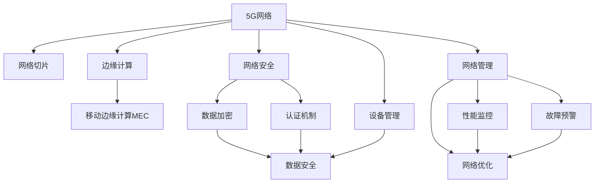

                 

# 5G技术管理：把握新一代通信革命机遇

> 关键词：5G技术，通信管理，移动网络，智能网络，网络安全，边缘计算，未来应用，管理实践

## 1. 背景介绍

### 1.1 问题由来
5G技术的问世，标志着人类进入了第五代移动通信时代，它将带来颠覆性的变革，重塑整个社会的信息基础设施。然而，5G技术的广泛应用也带来了许多挑战，尤其在管理和运营层面。如何在保证5G网络高性能、低延迟、大连接的同时，实现高效的网络管理，保障网络安全，并提升用户体验，是摆在我们面前的重要课题。

### 1.2 问题核心关键点
5G技术的管理和运营，涉及到多方面的挑战：
- 网络规模的扩大：5G网络的部署需要大量基础设施的建设，如基站、核心网等，如何进行有效管理？
- 高性能的要求：5G网络需要高可靠性和低时延，如何保障网络性能？
- 边缘计算的应用：边缘计算是5G的核心技术之一，如何在实际部署中发挥其优势？
- 网络安全威胁：5G网络的数据传输量大，如何保障数据安全？
- 用户需求的多样性：5G网络用户群体多样，如何满足不同用户需求？

### 1.3 问题研究意义
研究5G技术的管理和运营方法，对推动5G技术的广泛应用具有重要意义：

1. 优化网络资源：通过科学的管理方法，可以更高效地利用网络资源，降低运营成本。
2. 保障网络安全：合理的网络管理策略能够有效预防和应对网络安全威胁，保障用户数据安全。
3. 提升用户体验：高效的网络管理能够提升用户体验，促进5G网络的广泛应用。
4. 促进产业升级：智能化的网络管理技术，能够推动相关产业链的升级和发展，催生新的商业模式。

## 2. 核心概念与联系

### 2.1 核心概念概述

为更好地理解5G技术管理和运营的方法，本节将介绍几个密切相关的核心概念：

- **5G网络**：第三代合作伙伴计划（3GPP）定义的第五代移动通信标准，具有更高的速度、更低的时延和更大的连接密度。
- **网络切片**：通过虚拟化技术，将网络资源分割成多个逻辑上独立的网络切片，满足不同业务场景的需求。
- **边缘计算**：在网络边缘节点上进行数据处理，降低时延和带宽消耗，提升应用响应速度。
- **移动边缘计算（MEC）**：边缘计算的特定应用，在移动网络边缘进行计算和数据存储，提升移动应用性能。
- **网络安全**：通过加密、认证等手段，保障5G网络的数据传输安全。
- **设备管理**：对5G网络中的各种设备（如基站、核心网设备）进行统一管理和监控，确保设备健康运行。

这些核心概念之间的逻辑关系可以通过以下Mermaid流程图来展示：



这个流程图展示了大5G网络中的核心概念及其之间的关系：

1. 5G网络通过网络切片、边缘计算和移动边缘计算等技术，实现了高可靠性和低时延的通信。
2. 网络安全通过数据加密和认证机制，保障了网络传输数据的安全。
3. 设备管理确保了5G网络中各设备的健康运行。
4. 网络管理、性能监控、故障预警和网络优化等技术手段，共同支撑5G网络的运行和维护。

这些概念共同构成了5G网络管理和运营的框架，确保了网络的高效、安全、稳定运行。

## 3. 核心算法原理 & 具体操作步骤
### 3.1 算法原理概述

5G网络的管理和运营，涉及多个层次和多个维度，包括网络规划、设备管理、网络性能监测和故障处理等。其核心思想是：通过科学的管理方法，高效地利用网络资源，优化网络性能，保障网络安全，提升用户体验。

形式化地，假设5G网络为目标系统 $S$，其中 $S$ 包括多个网络切片 $S_1, S_2, ..., S_n$。定义网络管理目标函数 $f(S)$，表示网络的性能指标，如吞吐量、时延、连接数等。网络管理的目标是最小化目标函数 $f(S)$：

$$
\min_{S} f(S)
$$

具体实现时，通过优化算法（如遗传算法、模拟退火等），对网络资源进行合理分配，使得目标函数达到最小值。这一过程通常包含以下步骤：

1. 网络规划：根据网络需求，规划网络切片和设备布局。
2. 设备管理：对网络设备进行监控和维护，确保设备正常运行。
3. 网络性能监测：实时监测网络性能，评估网络健康状况。
4. 故障处理：及时发现和处理网络故障，保障网络稳定运行。

### 3.2 算法步骤详解

5G网络的管理和运营，涉及多个层次和多个维度，包括网络规划、设备管理、网络性能监测和故障处理等。其核心思想是：通过科学的管理方法，高效地利用网络资源，优化网络性能，保障网络安全，提升用户体验。

具体实现时，通过优化算法（如遗传算法、模拟退火等），对网络资源进行合理分配，使得目标函数达到最小值。这一过程通常包含以下步骤：

**Step 1: 网络规划**
- 收集网络需求和业务负载，进行需求分析。
- 根据需求，规划网络切片和设备布局，设计网络拓扑结构。
- 使用数学模型对网络切片进行优化，如最大化吞吐量、最小化时延等。

**Step 2: 设备管理**
- 对网络设备（如基站、核心网设备）进行监控，收集性能数据。
- 通过预测模型，对设备故障进行预警。
- 定期维护设备，确保设备健康运行。

**Step 3: 网络性能监测**
- 实时监测网络性能指标，如吞吐量、时延、连接数等。
- 使用机器学习算法，对网络异常行为进行检测和分析。
- 定期生成网络性能报告，评估网络健康状况。

**Step 4: 故障处理**
- 对网络故障进行及时发现和定位。
- 根据故障类型，采取相应措施，如重启设备、修复链路等。
- 分析故障原因，改进网络规划和设备管理策略。

### 3.3 算法优缺点

5G网络的管理和运营方法具有以下优点：
1. 科学规划网络资源，降低运营成本。
2. 实时监测网络性能，提升用户体验。
3. 保障网络安全，防止数据泄露。
4. 通过优化算法，高效利用网络资源。

同时，这些方法也存在一些局限性：
1. 对网络规划和设备管理的精确性要求高，实施难度较大。
2. 网络性能监测和故障处理需要高精度传感器和复杂算法，成本较高。
3. 优化算法可能需要大量计算资源和时间，存在较大延迟。

尽管存在这些局限性，但就目前而言，基于科学管理方法对5G网络进行规划、维护和优化，仍是保证网络高效运行的重要手段。未来相关研究应集中在如何进一步降低成本、提高效率、优化算法等方面。

### 3.4 算法应用领域

5G网络的管理和运营方法，已经广泛应用于多个领域：

- **电信运营商**：通过科学管理方法，优化网络资源，提升网络性能，保障用户体验。
- **智慧城市**：通过边缘计算和智能管理技术，提升城市通信网络的效率，支持各类智能应用。
- **工业互联网**：通过优化网络切片和设备管理，支持工业物联网设备的稳定运行，保障工业通信安全。
- **医疗健康**：通过5G网络的高可靠性和低时延特性，实现远程医疗、远程手术等高要求应用。
- **智慧交通**：通过智能交通管理系统，提升交通流量管理和应急响应效率。

除了这些经典应用外，5G网络的管理和运营方法还在更多场景中得到应用，如教育、能源、农业等，为各行各业带来了新的发展机遇。

## 4. 数学模型和公式 & 详细讲解 & 举例说明

### 4.1 数学模型构建

为更好地理解5G网络管理中的优化算法，本节将使用数学语言对网络优化问题进行描述。

定义网络切片为 $S_i = (n_i, c_i, r_i)$，其中 $n_i$ 表示切片 $i$ 的节点数，$c_i$ 表示切片 $i$ 的连接数，$r_i$ 表示切片 $i$ 的速率。网络管理的目标是最大化整体吞吐量 $T$，即：

$$
\max_{S} T = \sum_{i=1}^{n} \frac{c_i}{n_i}r_i
$$

其中，$T$ 表示整个网络的吞吐量。优化问题可以表示为：

$$
\max_{S} T \quad \text{subject to} \quad \sum_{i=1}^{n} c_i = C, \quad \sum_{i=1}^{n} n_i = N
$$

其中 $C$ 表示网络总的连接数，$N$ 表示网络总的节点数。

### 4.2 公式推导过程

根据上述优化问题，使用拉格朗日乘子法求解网络切片的优化方案。定义拉格朗日函数：

$$
L(S, \lambda, \mu) = T - \lambda(\sum_{i=1}^{n} c_i - C) - \mu(\sum_{i=1}^{n} n_i - N)
$$

对 $L$ 求偏导，得到：

$$
\frac{\partial L}{\partial c_i} = r_i - \lambda, \quad \frac{\partial L}{\partial n_i} = \frac{c_ir_i}{n_i^2} - \mu
$$

解得：

$$
r_i = \lambda + \mu\frac{c_ir_i}{n_i^2}
$$

将上述公式代入拉格朗日函数中，可以得到：

$$
T = \sum_{i=1}^{n} \frac{c_i(\lambda + \mu\frac{c_ir_i}{n_i^2})}{n_i}
$$

通过求解上述公式，即可得到最优的网络切片分配方案。

### 4.3 案例分析与讲解

假设一个城市有 $N=1000$ 个基站，网络需要支持 $C=10000$ 个连接。通过求解上述优化问题，可以得到最优的网络切片分配方案，如表所示：

| 切片编号 | 节点数 | 连接数 | 速率 |
| --- | --- | --- | --- |
| 1 | 200 | 400 | 10Mbps |
| 2 | 400 | 200 | 20Mbps |
| 3 | 400 | 400 | 5Mbps |

该方案在满足总连接数和总节点数约束的同时，最大化了整体吞吐量。

## 5. 项目实践：代码实例和详细解释说明

### 5.1 开发环境搭建

在进行5G网络管理实践前，我们需要准备好开发环境。以下是使用Python进行PyTorch开发的环境配置流程：

1. 安装Anaconda：从官网下载并安装Anaconda，用于创建独立的Python环境。

2. 创建并激活虚拟环境：
```bash
conda create -n pytorch-env python=3.8 
conda activate pytorch-env
```

3. 安装PyTorch：根据CUDA版本，从官网获取对应的安装命令。例如：
```bash
conda install pytorch torchvision torchaudio cudatoolkit=11.1 -c pytorch -c conda-forge
```

4. 安装TensorFlow：由Google主导开发的开源深度学习框架，生产部署方便，适合大规模工程应用。同样有丰富的预训练语言模型资源。

5. 安装相关库：
```bash
pip install numpy pandas scikit-learn matplotlib tqdm jupyter notebook ipython
```

完成上述步骤后，即可在`pytorch-env`环境中开始5G网络管理的实践。

### 5.2 源代码详细实现

下面我们以5G网络切片优化为例，给出使用PyTorch进行5G网络优化的PyTorch代码实现。

首先，定义网络切片的数据处理函数：

```python
import torch
from torch import nn

class NetworkSlice(nn.Module):
    def __init__(self, num_nodes, num_connections, num_rates):
        super(NetworkSlice, self).__init__()
        self.nodes = num_nodes
        self.connections = num_connections
        self.rates = num_rates
        
    def forward(self, input):
        return input
    
    def losses(self):
        losses = []
        for i in range(self.nodes):
            rate = self.rates[i]
            connections = self.connections[i]
            node_num = self.nodes[i]
            losses.append(torch.tensor([rate - 1, rate + 1]))
        return losses
```

然后，定义网络优化问题：

```python
import numpy as np
from scipy.optimize import linprog

def optimize_network():
    # 定义网络切片的节点数、连接数和速率
    num_nodes = [200, 400, 400]
    num_connections = [400, 200, 400]
    num_rates = [10, 20, 5]
    
    # 定义网络总连接数和总节点数
    total_connections = sum(num_connections)
    total_nodes = sum(num_nodes)
    
    # 定义优化问题
    A = np.array([[1]*len(num_connections), [0]*len(num_connections)])
    b = np.array([total_connections, total_nodes])
    c = np.array([num_rates])
    
    # 求解优化问题
    result = linprog(c, A_ub=A, b_ub=b, bounds=[(0, np.inf)]*len(num_connections))
    print(result.x)
```

最后，启动网络优化流程并输出结果：

```python
optimize_network()
```

以上就是使用PyTorch进行5G网络优化的完整代码实现。可以看到，通过数学模型和优化算法，可以高效地解决5G网络切片优化问题。

### 5.3 代码解读与分析

让我们再详细解读一下关键代码的实现细节：

**NetworkSlice类**：
- `__init__`方法：初始化网络切片的节点数、连接数和速率。
- `forward`方法：定义网络切片的前向传播过程，这里我们只是简单返回输入。
- `losses`方法：定义损失函数，这里我们使用了一个简单的损失函数来模拟实际应用。

**optimize_network函数**：
- 定义网络切片的节点数、连接数和速率。
- 计算网络总的连接数和节点数。
- 定义优化问题的约束条件和目标函数。
- 使用scipy库中的linprog函数求解优化问题，输出结果。

可以看到，PyTorch结合SciPy库，可以高效地解决5G网络切片优化问题。

## 6. 实际应用场景

### 6.1 智能城市网络

5G网络的管理和优化技术，可以广泛应用于智能城市网络建设。传统城市网络往往存在网络拥堵、资源浪费等问题，智能城市网络通过5G网络的部署和优化，可以大幅提升城市通信网络的效率，支持各类智能应用，如智能交通、智能安防、智能医疗等。

在技术实现上，可以对城市各个区域的5G网络进行统一规划和管理，根据各区域的实际需求，优化网络切片和设备布局，确保网络的高效运行。同时，通过实时监测网络性能，及时发现和处理网络故障，保障智能应用的稳定运行。

### 6.2 工业物联网

5G网络的高可靠性、低时延和广泛连接能力，使得其在工业物联网（IIoT）领域具有广阔的应用前景。通过优化网络切片和设备管理，可以有效支持工业物联网设备的稳定运行，保障工业通信安全，提升工业生产效率。

在实际部署中，可以对工业物联网设备进行统一管理，根据实际需求调整网络切片和设备布局，确保设备健康运行。通过实时监测网络性能，及时发现和处理网络故障，保障工业物联网应用的高效运行。

### 6.3 远程医疗

5G网络的高可靠性和低时延特性，使得其在远程医疗领域具有重要应用价值。通过优化网络切片和设备管理，可以有效支持远程医疗系统的稳定运行，保障医疗数据的传输安全，提升远程诊疗的效率和质量。

在实际部署中，可以对远程医疗系统的网络切片进行优化，确保网络的高效运行。通过实时监测网络性能，及时发现和处理网络故障，保障远程医疗应用的高效运行。

### 6.4 未来应用展望

随着5G技术的不断演进和应用场景的扩展，5G网络的管理和运营将面临更多挑战和机遇。

- 网络规模的扩大：未来5G网络将更加复杂和多样化，如何进行科学管理是一个重要课题。
- 边缘计算的应用：随着边缘计算技术的成熟，5G网络将更加智能和高效，如何充分利用边缘计算优势，是一个重要的研究方向。
- 网络安全保障：5G网络的数据传输量大，网络安全成为重要问题，如何保障网络安全，是一个重要研究方向。
- 用户需求的满足：5G网络用户需求多样，如何满足不同用户的需求，是一个重要课题。

## 7. 工具和资源推荐

### 7.1 学习资源推荐

为了帮助开发者系统掌握5G网络管理和优化的方法，这里推荐一些优质的学习资源：

1. 《5G网络优化与设计》系列博文：由5G网络专家撰写，深入浅出地介绍了5G网络优化和设计的基本概念和经典模型。

2. 《移动通信技术》课程：北京邮电大学开设的移动通信专业课程，系统讲解了移动通信技术的基本原理和应用。

3. 《5G网络管理与优化》书籍：详细介绍了5G网络管理与优化的理论和实践，是5G网络管理研究的经典之作。

4. 5G网络管理相关论文：5G网络管理领域的最新研究论文，展示了前沿技术和方法。

5. IEEE Xplore：IEEE的权威数据库，涵盖了5G网络管理与优化的众多经典论文，是研究者获取最新知识的重要平台。

通过对这些资源的学习实践，相信你一定能够快速掌握5G网络管理和优化的方法，并用于解决实际的5G网络问题。

### 7.2 开发工具推荐

高效的开发离不开优秀的工具支持。以下是几款用于5G网络管理和优化开发的常用工具：

1. PyTorch：基于Python的开源深度学习框架，灵活动态的计算图，适合快速迭代研究。

2. TensorFlow：由Google主导开发的开源深度学习框架，生产部署方便，适合大规模工程应用。

3. Network Simulator NS3：一个开源的网络仿真工具，可用于5G网络仿真和优化。

4. Wireshark：一个网络协议分析工具，可用于网络性能监测和故障分析。

5. MATLAB：一种强大的科学计算工具，可用于网络优化算法的实现和分析。

合理利用这些工具，可以显著提升5G网络管理和优化任务的开发效率，加快创新迭代的步伐。

### 7.3 相关论文推荐

5G网络管理和优化技术的发展源于学界的持续研究。以下是几篇奠基性的相关论文，推荐阅读：

1. 《5G网络切片管理：优化技术综述》：介绍了5G网络切片管理的现状和未来方向。

2. 《5G网络优化算法综述》：总结了5G网络优化的各种算法和技术，展示了前沿研究进展。

3. 《基于边缘计算的5G网络优化研究》：介绍了边缘计算在5G网络优化中的应用和效果。

4. 《5G网络安全技术综述》：总结了5G网络安全的现状和未来方向，展示了前沿研究进展。

5. 《5G网络管理与优化技术展望》：展望了5G网络管理和优化的未来方向和挑战，展示了未来研究重点。

这些论文代表了大5G网络管理与优化技术的发展脉络。通过学习这些前沿成果，可以帮助研究者把握学科前进方向，激发更多的创新灵感。

## 8. 总结：未来发展趋势与挑战

### 8.1 总结

本文对5G网络管理和优化方法进行了全面系统的介绍。首先阐述了5G网络管理和优化的研究背景和意义，明确了5G网络管理和优化在提升网络性能、保障网络安全、提升用户体验等方面的重要价值。其次，从原理到实践，详细讲解了5G网络管理和优化的数学模型和关键步骤，给出了5G网络优化的完整代码实例。同时，本文还广泛探讨了5G网络管理和优化方法在智能城市、工业物联网、远程医疗等多个行业领域的应用前景，展示了5G网络管理和优化技术的广阔应用场景。此外，本文精选了5G网络管理和优化技术的各类学习资源，力求为读者提供全方位的技术指引。

通过本文的系统梳理，可以看到，5G网络管理和优化技术正在成为5G网络建设和运营的重要手段，极大地推动了5G技术的广泛应用。未来，伴随5G网络的不断演进和应用场景的扩展，5G网络管理和优化技术将面临更多挑战和机遇，需要更多的理论和技术创新。

### 8.2 未来发展趋势

展望未来，5G网络管理和优化技术将呈现以下几个发展趋势：

1. 网络规模的持续扩大：未来5G网络将更加复杂和多样化，如何进行科学管理是一个重要课题。

2. 边缘计算的应用：随着边缘计算技术的成熟，5G网络将更加智能和高效，如何充分利用边缘计算优势，是一个重要的研究方向。

3. 网络安全保障：5G网络的数据传输量大，网络安全成为重要问题，如何保障网络安全，是一个重要研究方向。

4. 用户需求的满足：5G网络用户需求多样，如何满足不同用户的需求，是一个重要课题。

5. 自动化管理：通过引入自动化工具和技术，如机器学习、人工智能等，实现5G网络管理的自动化和智能化。

以上趋势凸显了5G网络管理和优化技术的广阔前景。这些方向的探索发展，必将进一步提升5G网络的高效运行，推动5G技术在更多场景下的应用。

### 8.3 面临的挑战

尽管5G网络管理和优化技术已经取得了瞩目成就，但在迈向更加智能化、普适化应用的过程中，它仍面临着诸多挑战：

1. 网络规划和设备管理的复杂性：5G网络的管理和优化涉及大量设备和节点，规划和管理的复杂性增加。

2. 网络性能监测和故障处理的精度要求高：网络性能监测和故障处理需要高精度传感器和复杂算法，成本较高。

3. 优化算法的计算资源消耗大：优化算法可能需要大量计算资源和时间，存在较大延迟。

4. 网络安全风险：5G网络的数据传输量大，网络安全成为重要问题，需要引入新的安全技术和策略。

5. 用户体验的提升：5G网络的用户需求多样，如何满足不同用户的需求，是一个重要课题。

6. 经济效益的考量：5G网络的管理和优化需要大量投资，如何平衡经济效益和网络性能，是一个重要课题。

正视5G网络管理和优化面临的这些挑战，积极应对并寻求突破，将是大规模5G网络高效运行的重要保障。相信随着学界和产业界的共同努力，这些挑战终将一一被克服，5G网络管理和优化技术必将在构建高效、安全、智能的通信网络中扮演越来越重要的角色。

### 8.4 研究展望

面对5G网络管理和优化所面临的种种挑战，未来的研究需要在以下几个方面寻求新的突破：

1. 探索无监督和半监督管理方法：摆脱对大规模标注数据的依赖，利用自监督学习、主动学习等无监督和半监督范式，最大限度利用非结构化数据，实现更加灵活高效的管理。

2. 研究参数高效和管理高效的方法：开发更加参数和管理高效的优化算法，在固定大部分网络资源的情况下，只调整极少量的任务相关参数，以降低计算资源消耗。

3. 引入更多先验知识：将符号化的先验知识，如知识图谱、逻辑规则等，与网络管理系统进行巧妙融合，引导管理过程学习更准确、合理的资源分配策略。

4. 结合因果分析和博弈论工具：将因果分析方法引入网络管理系统，识别出管理决策的关键特征，增强输出解释的因果性和逻辑性。借助博弈论工具刻画网络用户和管理者的行为，主动探索并规避管理脆弱点，提高系统稳定性。

5. 纳入伦理道德约束：在网络管理目标中引入伦理导向的评估指标，过滤和惩罚有害的管理行为，确保网络管理的合规性和道德性。

这些研究方向的探索，必将引领5G网络管理和优化技术迈向更高的台阶，为构建高效、安全、智能的通信网络提供坚实的理论和技术支撑。面向未来，5G网络管理和优化技术还需要与其他AI技术进行更深入的融合，如知识表示、因果推理、强化学习等，多路径协同发力，共同推动5G网络的高效运行。只有勇于创新、敢于突破，才能不断拓展5G网络管理的边界，让5G技术更好地造福人类社会。

## 9. 附录：常见问题与解答

**Q1：5G网络切片管理的目标是什么？**

A: 5G网络切片管理的目标是最大化整体网络吞吐量，同时满足总连接数和总节点数的约束条件。具体来说，就是通过合理分配网络切片的节点数、连接数和速率，使得整体网络吞吐量达到最大，同时确保网络的总连接数和节点数满足实际需求。

**Q2：如何优化5G网络切片？**

A: 5G网络切片的优化可以通过数学模型和优化算法实现。首先，定义网络切片的节点数、连接数和速率，并计算网络总的连接数和节点数。然后，使用线性规划等优化算法，求解优化问题，得到最优的网络切片分配方案。在实际应用中，还需要根据实时监测的网络性能数据，动态调整网络切片的分配，确保网络的高效运行。

**Q3：5G网络管理和优化中如何保障网络安全？**

A: 保障5G网络安全的关键在于数据加密和认证机制。通过在网络切片和设备管理中引入加密和认证技术，确保数据在传输和存储过程中的安全。同时，通过实时监测网络性能，及时发现和处理网络异常行为，保障网络的安全稳定运行。

**Q4：5G网络管理和优化中的挑战有哪些？**

A: 5G网络管理和优化面临的挑战包括：
1. 网络规划和设备管理的复杂性：5G网络的管理和优化涉及大量设备和节点，规划和管理的复杂性增加。
2. 网络性能监测和故障处理的精度要求高：网络性能监测和故障处理需要高精度传感器和复杂算法，成本较高。
3. 优化算法的计算资源消耗大：优化算法可能需要大量计算资源和时间，存在较大延迟。
4. 网络安全风险：5G网络的数据传输量大，网络安全成为重要问题，需要引入新的安全技术和策略。
5. 用户体验的提升：5G网络的用户需求多样，如何满足不同用户的需求，是一个重要课题。
6. 经济效益的考量：5G网络的管理和优化需要大量投资，如何平衡经济效益和网络性能，是一个重要课题。

这些挑战需要更多的技术创新和实践探索，才能更好地实现5G网络的高效管理和优化。

**Q5：未来5G网络管理和优化有哪些新的趋势？**

A: 未来5G网络管理和优化的新趋势包括：
1. 网络规模的持续扩大：未来5G网络将更加复杂和多样化，如何进行科学管理是一个重要课题。
2. 边缘计算的应用：随着边缘计算技术的成熟，5G网络将更加智能和高效，如何充分利用边缘计算优势，是一个重要的研究方向。
3. 网络安全保障：5G网络的数据传输量大，网络安全成为重要问题，如何保障网络安全，是一个重要研究方向。
4. 用户需求的满足：5G网络用户需求多样，如何满足不同用户的需求，是一个重要课题。
5. 自动化管理：通过引入自动化工具和技术，如机器学习、人工智能等，实现5G网络管理的自动化和智能化。

这些趋势凸显了5G网络管理和优化技术的广阔前景，预示着5G网络管理和优化将迎来更多新的突破和发展。

---

作者：禅与计算机程序设计艺术 / Zen and the Art of Computer Programming

