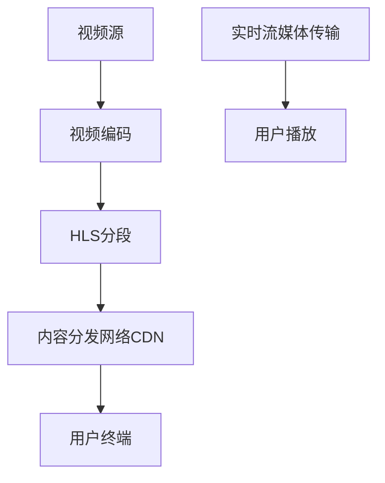

                 

# HLS 视频流：在 HTTP 上传输视频

> 关键词：HLS, 视频流, HTTP, DASH, RTMP, 视频编码, 流媒体, 内容分发网络

## 1. 背景介绍

随着互联网的普及和视频应用的兴起，流媒体技术变得越来越重要。实时传输大容量高质量的视频内容成为了互联网企业竞相追逐的焦点。HLS（HTTP Live Streaming）是一种基于HTTP协议的视频流传输技术，能够实现高效的视频传输与分发。

HLS技术能够支持各种设备平台，如PC、手机、平板等，提供了高质量、稳定的视频流服务，能够满足不同场景下用户对于视频内容的需求。在电商直播、在线教育、游戏直播、体育赛事、远程会议等多个领域，HLS 视频流技术都有着广泛的应用。

## 2. 核心概念与联系

### 2.1 核心概念概述

为更好地理解HLS视频流技术的实现原理，本节将介绍几个关键概念：

- HLS（HTTP Live Streaming）: HLS是苹果公司开发的一种基于HTTP协议的流媒体传输协议。利用HLS协议，可以实现在多种平台上播放实时视频，包括桌面、移动设备和游戏机等。

- DASH（Dynamic Adaptive Streaming over HTTP）: DASH是一种基于HTTP协议的流媒体传输协议，用于适应不同带宽、网络质量环境下的流媒体传输，用户可以实时选择视频质量以适应当前网络状态。

- RTMP（Real-Time Messaging Protocol）: RTMP是一种基于TCP协议的流媒体传输协议，主要用于直播流的传输，具有实时性、可靠性、安全性等特性，广泛用于传统流媒体直播服务。

- 视频编码: 视频编码是将原始视频数据转换为压缩格式的过程，通过高效压缩算法减少数据量，支持实时传输。常见视频编码格式有H.264、H.265、VP8等。

- 流媒体: 流媒体技术是指通过网络将多媒体文件按时间顺序实时传输的技术，支持边下载边播放，能够满足用户实时性需求。

- 内容分发网络（CDN）: CDN是通过部署在各地网络的服务器，通过缓存机制将视频内容分发到用户节点，以减少网络延迟，提高传输效率。

这些核心概念共同构成了HLS视频流技术的实现框架，通过理解这些概念，我们可以更好地把握HLS视频流的原理和应用。

### 2.2 核心概念原理和架构的 Mermaid 流程图



这个流程图展示了一个简单的HLS视频流传输框架：

1. 视频源：原始视频数据可以来源于摄像头、服务器、其他视频流源等。
2. 视频编码：将原始视频数据进行高效压缩，转换为H.264、H.265等标准视频编码格式。
3. HLS分段：将压缩后的视频数据分段为多个小片段，每个片段包含一定的数据量和时间跨度，满足用户实时播放需求。
4. 内容分发网络CDN：通过CDN节点缓存和分发HLS分段视频，加快传输效率，减少网络延迟。
5. 用户终端：用户通过浏览器、APP等设备播放HLS视频流，能够实时观看视频内容。
6. 实时流媒体传输：用户实时下载视频片段并播放，视频流传输通过HTTP协议实现。

## 3. 核心算法原理 & 具体操作步骤

### 3.1 算法原理概述

HLS视频流技术的核心思想是采用分段传输、动态调整、缓存机制等技术手段，实现高质量、实时的视频流传输。其核心算法流程包括以下几个关键步骤：

1. 视频分段：将原始视频数据按固定时间间隔或固定数据量分段，每个片段包含一定数量的数据量和时间跨度。

2. 动态适应：根据用户带宽和网络质量动态调整视频片段的分辨率和码率，以适应不同网络环境。

3. 缓存机制：通过缓存机制提高视频流传输的稳定性和实时性，避免网络波动导致视频播放中断。

4. 可伸缩性：支持多种视频编码格式，适应不同设备和网络环境，实现更广泛的应用场景。

### 3.2 算法步骤详解

下面详细介绍HLS视频流的核心算法步骤：

**Step 1: 视频分段**
- 将原始视频数据按照固定时间间隔或固定数据量进行分段，通常每个片段包含10-15s的视频内容。
- 每个分段包含视频头信息（元数据）和视频数据，例如片段序列号、码率、时间戳、分辨率等。

**Step 2: 动态适应**
- 根据用户的带宽和网络质量，动态调整每个分段的视频码率和分辨率。
- 例如，低带宽环境可以使用较低的码率和分辨率，高带宽环境使用较高的码率和分辨率，以保证最佳用户体验。

**Step 3: 缓存机制**
- 通过缓存机制，将HLS分段视频存储在用户终端缓存区，确保播放的连续性和稳定性。
- 例如，根据网络状况自动调整缓存时间，保证视频流畅播放。

**Step 4: 可伸缩性**
- 支持多种视频编码格式，如H.264、H.265、VP8等，适应不同设备和网络环境。
- 用户可以根据设备性能和网络状况，选择最合适的视频编码格式，获得最佳视频质量。

### 3.3 算法优缺点

HLS视频流技术具有以下优点：

1. 实时性高：采用分段传输和缓存机制，能够实现低延迟视频播放，满足实时性需求。
2. 适应性强：根据网络状况动态调整视频码率和分辨率，适应不同带宽环境。
3. 兼容性好：支持多种视频编码格式，适应不同设备和平台。
4. 可伸缩性好：支持大规模视频流分发，适合高并发应用场景。

同时，HLS视频流技术也存在以下缺点：

1. 复杂度较高：需要分段处理和动态调整，增加了系统复杂性。
2. 初始延迟较大：由于视频分段和缓存机制，播放初始需要一定延迟。
3. 网络开销较大：需要不断维护和管理缓存数据，增加网络负担。
4. 兼容性问题：不同厂商的设备可能对HLS协议支持程度不同，存在兼容性问题。

### 3.4 算法应用领域

HLS视频流技术在以下领域有着广泛的应用：

1. 电商直播：电商企业通过HLS技术实现直播流传输，能够吸引大量用户观看，增加用户粘性。
2. 在线教育：教育机构通过HLS技术实现实时视频教学，支持大规模在线学习。
3. 游戏直播：游戏直播平台通过HLS技术实现高质量直播流传输，提升用户体验。
4. 体育赛事：体育赛事通过HLS技术实现高清视频直播，吸引大量观众观看。
5. 远程会议：企业通过HLS技术实现高清视频会议，支持远程协作和沟通。

## 4. 数学模型和公式 & 详细讲解 & 举例说明

### 4.1 数学模型构建

HLS视频流技术的关键在于分段传输和动态适应，我们可以通过数学模型来更好地理解这些概念。

设原始视频数据长度为L，分段间隔为T，则分段数量为N，计算公式为：

$$
N = \lceil \frac{L}{T} \rceil
$$

其中 $\lceil \cdot \rceil$ 表示向上取整运算。

设用户当前带宽为B，最大带宽为B_max，视频码率为R，则动态适应公式为：

$$
R = R_0 \times \frac{B}{B_{\text{avg}}}
$$

其中 $R_0$ 为预定义视频码率，$B_{\text{avg}}$ 为平均带宽。

### 4.2 公式推导过程

下面详细推导HLS视频流的分段和动态适应公式：

1. 分段数量N的计算：
   $$
   N = \lceil \frac{L}{T} \rceil
   $$

2. 视频码率R的动态调整：
   $$
   R = R_0 \times \frac{B}{B_{\text{avg}}}
   $$

### 4.3 案例分析与讲解

以一个实时视频播放为例，假设原始视频长度为100s，分段间隔为10s，用户当前带宽为1Mbps，平均带宽为2Mbps，预定义视频码率为1Mbps。

- 分段数量为 $N = \lceil \frac{100}{10} \rceil = 10$
- 当前视频码率为 $R = 1Mbps \times \frac{1}{2} = 0.5Mbps$

## 5. 项目实践：代码实例和详细解释说明

### 5.1 开发环境搭建

在进行HLS视频流开发前，我们需要准备好开发环境。以下是使用Python进行HLS视频流开发的开发环境配置流程：

1. 安装Anaconda：从官网下载并安装Anaconda，用于创建独立的Python环境。

2. 创建并激活虚拟环境：
```bash
conda create -n hls-env python=3.8 
conda activate hls-env
```

3. 安装相关依赖包：
```bash
conda install pyhls ffmpeg
```

4. 安装示例代码：
```bash
git clone https://github.com/hls-org/hls
cd hls
```

### 5.2 源代码详细实现

下面以示例代码实现HLS视频流服务，使用Python的pyhls库实现HLS视频分段和流媒体传输。

```python
from pyhls.stream import HLSStream
from pyhls.mpegts import MpegTSStreamHandler

# 创建HLS流对象
hls_stream = HLSStream(
    filename='example.mp4',
    parts_file='parts.txt',
    segment_duration=10,
    chunk_size=1024*1024,
    stream_handler=MpegTSStreamHandler,
    auto adjust_bandwidth=True
)

# 启动HLS流服务
hls_stream.start()

# 获取HLS流媒体地址
hls_url = hls_stream.get_m3u8_url()
print(f'HLS stream URL: {hls_url}')
```

### 5.3 代码解读与分析

让我们再详细解读一下关键代码的实现细节：

**HLSStream类**：
- `HLSStream`类是pyhls库中实现HLS流传输的核心类，接收原始视频文件路径、分段信息、流传输配置等参数，创建HLS流对象。
- `start()`方法启动HLS流服务，开始向HLS分段文件中写入分段数据，生成m3u8播放列表。
- `get_m3u8_url()`方法获取HLS流媒体地址，用户可以通过浏览器、APP等播放工具播放流媒体。

**MpegTSStreamHandler类**：
- `MpegTSStreamHandler`类是流媒体处理器的实现，继承自`StreamHandler`类，用于实现MPEG-TS流媒体的分段和传输。

**启动流服务**：
- 调用`start()`方法启动HLS流服务，将原始视频文件分割成HLS分段文件，并生成m3u8播放列表，供用户播放。

**获取播放地址**：
- 调用`get_m3u8_url()`方法获取HLS流媒体地址，用户可以通过浏览器等播放工具访问该地址，播放HLS视频流。

## 6. 实际应用场景

### 6.1 电商直播

电商直播是HLS视频流技术的重要应用场景之一。电商企业通过HLS技术实现实时视频直播，能够吸引大量用户观看，增加用户粘性，提升销售额。

电商企业可以与视频直播平台合作，将直播流通过HLS协议进行封装传输，用户可以通过PC、手机、平板等设备进行实时观看和互动，获得更沉浸式的购物体验。同时，HLS技术支持动态适应和缓存机制，能够保证视频播放的稳定性和实时性，减少延迟，提升用户满意度。

### 6.2 在线教育

在线教育领域，教育机构通过HLS技术实现实时视频教学，支持大规模在线学习，能够满足不同用户的学习需求。

在线教育平台可以与视频直播平台合作，将课程视频通过HLS协议进行封装传输，用户可以通过浏览器、APP等设备进行实时观看和学习，能够灵活调整播放码率和分辨率，适应不同设备和网络环境，提升学习效果。同时，HLS技术支持缓存机制，能够确保视频播放的连续性和稳定性，减少网络波动对教学的影响。

### 6.3 游戏直播

游戏直播平台通过HLS技术实现高质量直播流传输，提升用户体验，吸引大量玩家观看和互动。

游戏直播平台可以与视频直播平台合作，将游戏直播流通过HLS协议进行封装传输，用户可以通过PC、手机、平板等设备进行实时观看和互动，享受高质量的游戏直播体验。同时，HLS技术支持动态适应和缓存机制，能够保证视频播放的稳定性和实时性，减少延迟，提升用户满意度。

### 6.4 体育赛事

体育赛事通过HLS技术实现高清视频直播，吸引大量观众观看，提升赛事关注度和商业价值。

体育赛事机构可以通过HLS技术实现高清视频直播，通过HLS分段和动态适应机制，保证视频流的稳定性和实时性，满足不同用户的视频观看需求。同时，HLS技术支持缓存机制，能够确保视频播放的连续性和稳定性，减少网络波动对直播的影响，提升用户体验。

### 6.5 远程会议

企业通过HLS技术实现高清视频会议，支持远程协作和沟通，提升工作效率。

企业可以通过HLS技术实现高清视频会议，通过HLS分段和动态适应机制，保证视频流的稳定性和实时性，满足不同用户的视频会议需求。同时，HLS技术支持缓存机制，能够确保视频播放的连续性和稳定性，减少网络波动对会议的影响，提升协作效率。

## 7. 工具和资源推荐

### 7.1 学习资源推荐

为了帮助开发者系统掌握HLS视频流技术的实现原理和实践技巧，这里推荐一些优质的学习资源：

1. HLS官方文档：苹果公司提供的HLS技术官方文档，详细介绍了HLS协议的实现原理和应用场景，适合深入学习。

2. HLS标准规范：ITU-T G176.2标准规范，详细规定了HLS协议的技术细节，是学习HLS技术的权威资料。

3. 《流媒体技术》书籍：全面介绍流媒体技术的基础概念和实现原理，包括HLS协议在内的多种流媒体协议。

4. HLS示例代码：GitHub上开源的HLS视频流示例代码，适合实践学习和代码调试。

5. HLS技术博客：各大技术博客上的HLS相关文章，提供了丰富的实践经验和案例分析，适合快速入门和了解HLS技术。

通过对这些资源的学习实践，相信你一定能够快速掌握HLS视频流的精髓，并用于解决实际的流媒体问题。

### 7.2 开发工具推荐

高效的开发离不开优秀的工具支持。以下是几款用于HLS视频流开发的常用工具：

1. PyHLS：基于Python的HLS视频流开发库，提供了完整的HLS分段和流媒体传输功能。

2. FFmpeg：开源的视频编解码工具，支持多种视频格式和编解码算法，适合对视频进行编码、解码、压缩、封装等操作。

3. VLC Player：开源的多媒体播放器，支持多种视频流协议，适合用于测试和调试HLS流媒体传输。

4. Apple HLS Player：苹果公司提供的HLS流媒体播放器，支持HLS协议的视频播放，适合验证HLS视频流功能。

5. WebRTC：谷歌公司开发的Web Real-Time Communications技术，支持实时视频通信和流媒体传输，适合应用于Web端的HLS视频流应用。

合理利用这些工具，可以显著提升HLS视频流开发的效率，加快创新迭代的步伐。

### 7.3 相关论文推荐

HLS视频流技术的发展源于学界的持续研究。以下是几篇奠基性的相关论文，推荐阅读：

1. RTMP/HTTP Live Streaming（RFC）: 苹果公司发布的RFC标准文档，详细规定了HLS协议的技术细节和实现方法。

2. Dynamic Adaptive Streaming over HTTP（DASH）: MPEG标准组织发布的DASH协议标准文档，详细介绍了DASH协议的技术细节和实现方法。

3. HTTP Live Streaming（HLS）: 苹果公司发布的HLS技术文档，详细介绍了HLS协议的实现原理和应用场景。

4. High-Quality Live Streaming: A Practical Guide: 一本关于HLS视频流技术的实用指南书籍，详细介绍了HLS协议的实现原理和实践技巧。

通过对这些资源的阅读和学习，相信你能够全面理解HLS视频流的技术细节和应用场景，提升技术水平。

## 8. 总结：未来发展趋势与挑战

### 8.1 总结

本文对HLS视频流技术进行了全面系统的介绍。首先阐述了HLS视频流技术的研究背景和意义，明确了HLS技术在实时视频传输中的应用价值。其次，从原理到实践，详细讲解了HLS视频流的数学模型和关键步骤，给出了视频流开发的完整代码实现。同时，本文还广泛探讨了HLS技术在电商直播、在线教育、游戏直播、体育赛事、远程会议等多个领域的应用前景，展示了HLS技术的广泛应用潜力。此外，本文精选了HLS技术的各类学习资源，力求为读者提供全方位的技术指引。

通过本文的系统梳理，可以看到，HLS视频流技术在实时视频传输中有着广泛的应用，极大地提升了视频流传输的效率和质量。HLS技术具有实时性高、适应性强、兼容性好等优点，是实现高质量视频流传输的重要手段。未来，伴随HLS技术的不断演进，视频流传输将更加高效、稳定、可靠，满足不同场景下用户对于视频内容的需求。

### 8.2 未来发展趋势

展望未来，HLS视频流技术将呈现以下几个发展趋势：

1. 自适应流媒体技术：利用AI技术实现自适应流媒体传输，能够根据网络环境动态调整视频码率和分辨率，实现最佳用户体验。

2. 直播推流自动化：利用云计算技术实现直播推流的自动化，减少人工干预，提高直播推流的效率和稳定性。

3. 实时音视频同步：利用音视频同步技术，确保视频流和音频流同步播放，提升用户观看体验。

4. 多码率流媒体：支持多种视频码率和分辨率，适应不同设备和网络环境，提供更丰富的视频播放选择。

5. 高清晰度视频：支持4K、8K等高清晰度视频传输，提升用户体验和视觉体验。

6. 边缘计算：利用边缘计算技术，将视频流传输到用户本地设备，实现更低延迟和更高带宽的视频流传输。

以上趋势凸显了HLS视频流技术的广阔前景。这些方向的探索发展，必将进一步提升HLS视频流技术的性能和应用范围，为实时视频传输带来新的突破。

### 8.3 面临的挑战

尽管HLS视频流技术已经取得了瞩目成就，但在迈向更加智能化、普适化应用的过程中，它仍面临着诸多挑战：

1. 初始延迟较大：由于HLS分段和缓存机制，播放初始需要一定延迟，用户体验不佳。如何进一步降低延迟，提升实时性，是需要解决的重要问题。

2. 兼容性和标准化问题：不同厂商的设备对HLS协议支持程度不同，存在兼容性问题。如何实现跨平台兼容，制定统一标准，是技术发展的重要方向。

3. 带宽和网络负载：HLS技术需要维护和管理大量缓存数据，增加网络负担，如何优化缓存机制，降低网络负载，提高流媒体传输效率，是重要的研究方向。

4. 安全性问题：HLS视频流传输过程中，存在数据泄露和篡改风险，如何保障传输数据的安全性，是关键的技术挑战。

5. 优化和扩展性：HLS技术需要优化算力和资源消耗，同时支持大规模视频流分发，满足高并发应用场景的需求。

6. 多设备支持：HLS技术需要支持更多设备平台，提升多设备的兼容性，提升用户体验。

这些挑战需要在技术创新和工程实践中不断克服，才能推动HLS技术向更高的台阶迈进。

### 8.4 研究展望

面对HLS视频流技术所面临的种种挑战，未来的研究需要在以下几个方面寻求新的突破：

1. 探索新的流媒体协议：研究新的流媒体协议，如MPEG-DASH、WebRTC等，以满足更广泛的应用场景和需求。

2. 引入AI技术优化流媒体传输：利用AI技术优化视频码率、分辨率、缓存机制等，提升实时性和用户体验。

3. 开发高效的视频编码算法：开发高效的视频编码算法，支持更多视频格式和编解码操作，提升视频流传输效率。

4. 引入边缘计算技术：利用边缘计算技术，将视频流传输到用户本地设备，实现更低延迟和更高带宽的视频流传输。

5. 增强安全性和隐私保护：引入加密技术、数字签名等手段，确保HLS视频流传输的安全性和隐私保护。

6. 支持多设备和多平台：开发支持更多设备平台和应用的HLS视频流解决方案，提升用户体验和应用范围。

这些研究方向的探索，必将推动HLS视频流技术不断进步，为实时视频传输带来新的突破，实现更高效、稳定、可靠的视频流传输。

## 9. 附录：常见问题与解答

**Q1: HLS视频流技术相比传统流媒体协议有哪些优势？**

A: HLS视频流技术相比传统流媒体协议有以下优势：

1. 实时性高：采用分段传输和缓存机制，能够实现低延迟视频播放，满足实时性需求。
2. 适应性强：根据用户带宽和网络质量动态调整视频码率和分辨率，适应不同网络环境。
3. 兼容性好：支持多种视频编码格式，适应不同设备和平台。
4. 可伸缩性好：支持大规模视频流分发，适合高并发应用场景。
5. 安全性高：通过HTTP协议传输，采用加密和签名等技术保障数据安全。

**Q2: 如何优化HLS视频流的初始延迟？**

A: 优化HLS视频流的初始延迟可以从以下几个方面入手：

1. 减小分段长度：分段长度越短，初始缓存越少，播放初始延迟越小。
2. 优化缓存机制：使用更高效的缓存算法，减少缓存数据量，提升缓存速度。
3. 预加载机制：利用预加载机制，预先加载部分缓存数据，减少初始延迟。
4. 数据压缩：采用高效的数据压缩算法，减少传输数据量，提升传输速度。

**Q3: HLS视频流技术是否支持多种视频编码格式？**

A: HLS视频流技术支持多种视频编码格式，如H.264、H.265、VP8等。用户可以根据设备和网络状况，选择最合适的视频编码格式，获得最佳视频质量。

**Q4: HLS视频流技术是否支持多设备平台？**

A: HLS视频流技术支持多种设备平台，如PC、手机、平板等。用户可以通过浏览器、APP等设备播放HLS视频流，获得沉浸式的观看体验。

**Q5: HLS视频流技术是否支持自适应流媒体传输？**

A: HLS视频流技术支持自适应流媒体传输，能够根据用户带宽和网络质量动态调整视频码率和分辨率，实现最佳用户体验。

---

作者：禅与计算机程序设计艺术 / Zen and the Art of Computer Programming

