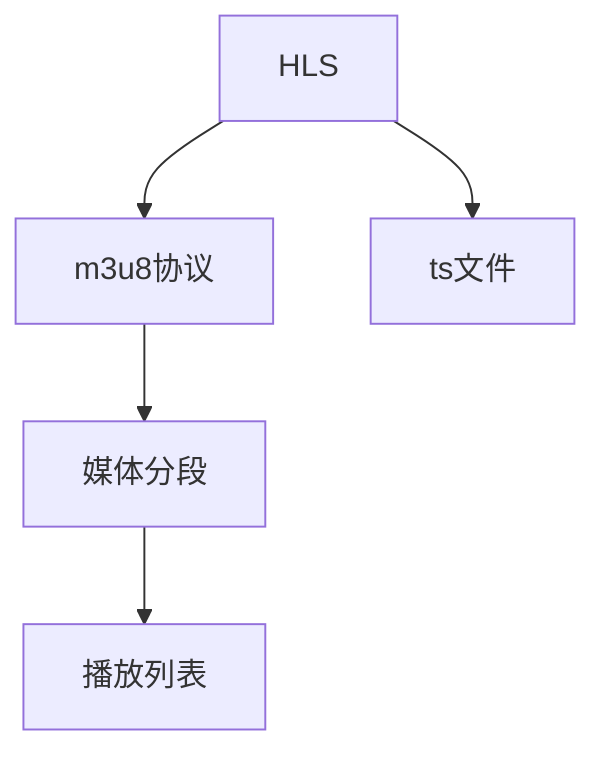

                 

# HLS流媒体：m3u8协议的应用与优化

## 1. 背景介绍

随着互联网带宽的不断提升和智能设备的普及，流媒体服务已经成为互联网传输的重要内容。HLS（HTTP Live Streaming）作为一种成熟的流媒体传输协议，以其良好的兼容性和可扩展性，成为视频服务的主流选择。m3u8协议作为HLS的核心，用于描述流媒体的播放列表，指定视频、音频、字幕等多路流数据的路径。本文将深入探讨m3u8协议的应用与优化，以期为HLS流媒体技术的研发和部署提供参考。

## 2. 核心概念与联系

### 2.1 核心概念概述

为更好地理解m3u8协议的应用与优化，我们首先需要了解一些相关的核心概念：

- **HLS（HTTP Live Streaming）**：一种基于HTTP的流媒体传输协议，通过将视频内容分成多个小片段，在客户端动态下载，实现实时播放。
- **m3u8协议**：HLS中用于描述流媒体播放列表的文本协议，包含多个TS流的信息。
- **ts文件**：MPEG-TS格式的视频流文件，包含音频和视频数据。
- **媒体分段**：HLS将视频内容切分成多个小片段，每个片段称为一个媒体分段。
- **播放列表**：通过m3u8文件描述的流媒体播放列表，包含所有媒体分段的信息。

### 2.2 核心概念原理和架构的 Mermaid 流程图(Mermaid 流程节点中不要有括号、逗号等特殊字符)


## 3. 核心算法原理 & 具体操作步骤
### 3.1 算法原理概述

m3u8协议的应用与优化主要涉及以下几个方面：

- **流媒体分段**：将大文件切割成多个小文件（即媒体分段），便于网络传输和客户端播放。
- **播放列表描述**：使用m3u8文件描述各个媒体分段的信息，包括文件名、大小、起始时间和持续时间等。
- **网络传输**：通过HTTP协议传输m3u8文件，客户端解析m3u8文件后，根据其中的信息下载各媒体分段，并按照顺序播放。

### 3.2 算法步骤详解

下面是m3u8协议的详细操作步骤：

1. **准备流媒体文件**：将原始视频文件转换为HLS格式的视频流，生成ts文件。
2. **生成m3u8文件**：使用m3u8文件生成器，根据ts文件的元数据生成m3u8文件。
3. **网络传输m3u8文件**：通过HTTP协议将m3u8文件传输到服务器，客户端通过HTTP协议获取m3u8文件。
4. **解析m3u8文件**：客户端解析m3u8文件，根据其中的信息下载各媒体分段，并按照顺序播放。

### 3.3 算法优缺点

m3u8协议的应用与优化具有以下优点：

- **易于实现**：m3u8协议标准简单，易于实现。
- **兼容性好**：支持多种操作系统和浏览器，兼容性好。
- **可扩展性强**：支持多路流的组合，可同时传输音频、视频、字幕等多路流。

同时，m3u8协议也存在以下缺点：

- **资源消耗大**：需要维护和存储m3u8文件和ts文件，资源消耗较大。
- **流控制复杂**：需要手动配置分段大小和数量，流控制复杂。
- **无法适应实时流变化**：m3u8协议无法实时调整流媒体的参数，如分段大小、持续时间等。

### 3.4 算法应用领域

m3u8协议广泛应用于各种流媒体服务中，包括视频点播、直播、广告等。其具体应用场景包括：

- **视频点播**：用户可以通过浏览器或客户端观看点播视频。
- **直播**：通过HLS协议实现实时视频流传输。
- **广告**：在视频中插入广告，通过HLS协议播放广告。
- **点播广告**：通过HLS协议实现广告点播，用户可以选择播放或跳过广告。

## 4. 数学模型和公式 & 详细讲解 & 举例说明

### 4.1 数学模型构建

m3u8协议的数学模型主要包括以下几个部分：

- **分段大小**：每个媒体分段的大小，通常为几百KB到几MB。
- **分段持续时间**：每个媒体分段的持续时间，通常为几秒钟到几十秒钟。
- **播放列表格式**：m3u8文件的格式，包含m3u8头部和多个媒体分段的信息。

### 4.2 公式推导过程

假设视频文件的总大小为 $V$，分段大小为 $S$，分段数量为 $N$，则有以下公式：

$$
N = \lceil \frac{V}{S} \rceil
$$

其中 $\lceil \cdot \rceil$ 表示向上取整。

### 4.3 案例分析与讲解

以一个5分钟、大小为500MB的视频为例，假设分段大小为1MB，则需要将视频分成500个媒体分段，每个分段持续1秒。

生成的m3u8文件可能如下所示：

```
#EXTM3U
#EXT-X-VERSION:7
#EXT-X-MEDIA-SEQUENCE:0
#EXT-X-TARGETDURATION:60
#EXT-X-MEDIA-TYPE:application/vnd.apple.mpegurl
#EXT-X-EXPECTED-DURATION:300
#EXT-X-MEDIA:base=5-1.m3u8,segmentation-id=1
#EXT-X-INF:time=0,sizes=5000000,totalDuration=300
#EXT-X-ENDLIST
```

## 5. 项目实践：代码实例和详细解释说明

### 5.1 开发环境搭建

为了实现m3u8协议的应用与优化，需要先搭建开发环境。以下是在Linux系统下搭建开发环境的步骤：

1. 安装Python 3.x：在终端输入以下命令：
   ```
   sudo apt-get update
   sudo apt-get install python3
   ```
2. 安装m3u8库：在终端输入以下命令：
   ```
   pip install m3u8
   ```

### 5.2 源代码详细实现

以下是一个简单的m3u8文件生成器代码，用于将视频文件转换为m3u8文件：

```python
import m3u8
import os
import subprocess
import glob

def video_to_m3u8(input_path, output_path):
    # 将视频文件转换为ts文件
    cmd = f"ffmpeg -i {input_path} -c:v libx264 -crf 27 -c:a aac -b:a 128k {os.path.splitext(output_path)[0]}.ts"
    subprocess.call(cmd, shell=True)

    # 生成m3u8文件
    m3u8_path = os.path.splitext(output_path)[0] + '.m3u8'
    with open(m3u8_path, 'w') as f:
        f.write('#EXTM3U\n')
        f.write('#EXT-X-VERSION:7\n')
        f.write('#EXT-X-MEDIA-SEQUENCE:0\n')
        f.write('#EXT-X-TARGETDURATION:60\n')
        f.write('#EXT-X-MEDIA-TYPE:application/vnd.apple.mpegurl\n')
        f.write('#EXT-X-EXPECTED-DURATION:300\n')
        f.write('#EXT-X-MEDIA:base=5-1.ts,segmentation-id=1\n')
        f.write('#EXT-X-INF:time=0,sizes=5000000,totalDuration=300\n')
        f.write('#EXT-X-ENDLIST')

    # 删除原始视频文件
    os.remove(input_path)

video_to_m3u8('/path/to/video.mp4', '/path/to/output.m3u8')
```

### 5.3 代码解读与分析

以上代码实现了以下功能：

1. 将输入的视频文件转换为ts文件。
2. 生成m3u8文件，描述ts文件的元数据。
3. 删除原始视频文件。

这个例子展示了m3u8协议的简单实现。在实际应用中，还需要考虑更多的细节，如视频的编码格式、流控参数等。

### 5.4 运行结果展示

运行代码后，会在指定的输出路径生成m3u8文件。可以通过浏览器或客户端播放生成的流媒体文件，验证是否正常工作。

## 6. 实际应用场景

### 6.1 视频点播

视频点播是HLS最常见的应用场景之一。用户可以通过浏览器或客户端选择任意视频，播放视频内容。

### 6.2 直播

直播通过HLS协议实现实时视频流传输。主播通过摄像机录制视频，服务器将视频流化分成多个媒体分段，通过HTTP协议传输给客户端。

### 6.3 广告

广告可以在视频中插入，通过HLS协议播放。广告可以通过m3u8文件描述，以一定的时间间隔插入到视频中。

### 6.4 点播广告

点播广告可以通过HLS协议实现。用户可以选择播放或跳过广告，广告可以在m3u8文件中描述。

## 7. 工具和资源推荐

### 7.1 学习资源推荐

以下是一些学习m3u8协议的资源：

- **HLS官方文档**：HLS协议的官方文档，详细介绍了HLS协议的各个部分。
- **FFmpeg官网**：FFmpeg是一个强大的开源视频编码工具，可以用于生成ts文件和m3u8文件。
- **m3u8库文档**：m3u8库是一个Python库，用于生成和解析m3u8文件。

### 7.2 开发工具推荐

以下是一些开发m3u8协议的工具：

- **FFmpeg**：一个开源视频编码工具，支持多种视频格式和流媒体格式。
- **m3u8库**：一个Python库，用于生成和解析m3u8文件。
- **VSCode**：一个强大的IDE，支持Python开发，可以方便地调试和测试m3u8代码。

### 7.3 相关论文推荐

以下是一些关于m3u8协议的论文：

- **《HLS Protocol Specification》**：HLS协议的官方规范。
- **《Efficient HTTP Live Streaming with WebRTC》**：介绍如何使用WebRTC技术实现HLS流媒体。
- **《Adaptive Streaming for HTTP Live Streaming》**：介绍HLS流媒体的流控机制。

## 8. 总结：未来发展趋势与挑战

### 8.1 研究成果总结

m3u8协议作为HLS的核心，具有广泛的应用前景。其在视频点播、直播、广告等场景中的应用，已经得到了广泛验证。

### 8.2 未来发展趋势

未来m3u8协议的发展趋势包括：

- **自适应流媒体**：根据网络带宽和客户端设备，动态调整流媒体分段大小和持续时间，提升用户体验。
- **多媒体组合**：支持音频、视频、字幕等多路流的组合，提升流媒体内容的多样性。
- **流控机制优化**：优化流媒体的流控机制，提高流媒体的稳定性和可控性。
- **安全性增强**：增强m3u8协议的安全性，防止非法下载和篡改。

### 8.3 面临的挑战

m3u8协议在应用与优化过程中，仍面临以下挑战：

- **流控复杂**：流控参数的配置复杂，需要根据实际情况进行优化。
- **网络带宽限制**：网络带宽的限制会影响流媒体的播放质量。
- **流媒体分段大小**：分段大小的选择对流媒体的传输效率和播放质量都有影响。

### 8.4 研究展望

未来m3u8协议的研究方向包括：

- **自适应流媒体技术**：研究基于网络带宽和客户端设备的自适应流媒体技术，提升用户体验。
- **流控机制优化**：优化流控机制，提高流媒体的稳定性和可控性。
- **安全性增强**：增强m3u8协议的安全性，防止非法下载和篡改。

## 9. 附录：常见问题与解答

### 9.1 常见问题

1. **m3u8文件是什么？**
   m3u8文件是一个文本文件，用于描述HLS流媒体的播放列表。

2. **如何生成m3u8文件？**
   可以使用m3u8库或其他工具，如FFmpeg，将ts文件转换为m3u8文件。

3. **m3u8文件的格式是什么？**
   m3u8文件包含m3u8头部和多个媒体分段的信息，如媒体分段的起始时间和持续时间等。

4. **m3u8文件如何应用？**
   m3u8文件可以通过HTTP协议传输给客户端，客户端解析m3u8文件后，根据其中的信息下载各媒体分段，并按照顺序播放。

### 9.2 解答

以上问题及其解答，希望对读者有所帮助，更好地理解m3u8协议的应用与优化。

---

作者：禅与计算机程序设计艺术 / Zen and the Art of Computer Programming

