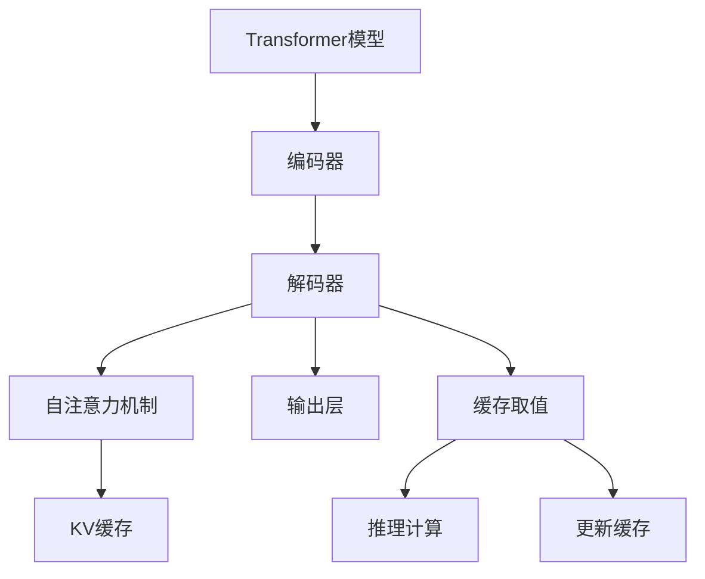

                 

## 1. 背景介绍

### 1.1 问题由来
Transformer是一种基于自注意力机制的深度学习模型，广泛应用于自然语言处理领域，如机器翻译、文本生成、问答系统等。Transformer的核心优势在于其并行计算能力，可以在大规模并行硬件上高效地进行前向推理计算。然而，Transformer模型在处理长序列数据时，仍面临计算资源占用巨大、推理速度较慢等问题。为解决这个问题，KV缓存（Key-Value Cache）技术被引入，通过缓存中间计算结果，显著提升了Transformer模型的推理效率。

### 1.2 问题核心关键点
KV缓存技术通过缓存中间计算结果，减少了多次重复计算，加速了Transformer模型在长序列数据上的推理速度。KV缓存的核心在于其设计灵活性，可以根据具体场景和硬件资源进行适配优化。本文将重点介绍KV缓存的原理和具体实现方式，以及其在Transformer模型中的应用效果。

## 2. 核心概念与联系

### 2.1 核心概念概述

KV缓存（Key-Value Cache）是一种高效存储中间计算结果的技术，广泛应用于深度学习模型的优化中。其主要思想是将计算过程中重复使用的中间结果缓存起来，避免重复计算，从而加速计算过程。KV缓存技术对于提高Transformer模型的推理效率具有重要意义。

Transformer模型是建立在自注意力机制上的神经网络模型，由编码器和解码器构成。编码器处理输入序列，生成注意力权重；解码器使用这些权重，计算注意力对齐，并生成最终输出。Transformer的核心操作包括矩阵乘法、点乘、Softmax函数等，计算量巨大。通过KV缓存技术，可以在解码器中减少重复计算，显著提高推理速度。

### 2.2 核心概念原理和架构的 Mermaid 流程图



在上述流程图中，KV缓存技术位于解码器中，存储中间计算结果，用于加速自注意力机制的计算。具体流程如下：

1. 输入序列经过编码器处理后，生成一系列的中间结果（如Query、Key、Value）。
2. 这些中间结果被缓存到KV缓存中，以减少重复计算。
3. 在解码器中，每次计算注意力权重时，先查找缓存中是否存在对应的中间结果。
4. 如果缓存中存在，直接从缓存中取值；如果不存在，则计算并更新缓存。
5. 重复计算自注意力机制，直到生成最终输出。

### 2.3 核心概念之间的联系
KV缓存技术与Transformer模型的关系非常密切。通过缓存中间计算结果，KV缓存可以有效减少Transformer模型在解码器中的计算量，加速推理速度。同时，KV缓存也可以与其他深度学习优化技术结合，如混合精度训练、参数剪枝等，进一步提升模型性能。

## 3. 核心算法原理 & 具体操作步骤

### 3.1 算法原理概述

KV缓存技术的核心原理在于缓存中间计算结果，减少重复计算。在Transformer模型中，自注意力机制是计算量最大的部分，KV缓存技术可以有效减少自注意力机制的计算量，加速模型推理。

具体来说，KV缓存技术通过将Query、Key、Value等中间结果缓存起来，避免在解码器中重复计算。缓存中存储的结果包含当前的输入序列、注意力权重、注意力对齐矩阵等中间结果，这些结果可以被快速检索和复用，从而提升推理速度。

### 3.2 算法步骤详解

KV缓存技术的实现流程如下：

1. 初始化缓存：在解码器开始推理前，初始化KV缓存，将输入序列和注意力权重等信息存储到缓存中。
2. 缓存检索：在每次计算注意力权重时，先从缓存中查找是否存在对应的中间结果。
3. 缓存更新：如果缓存中存在，直接从缓存中取值；如果不存在，则计算并更新缓存。
4. 重复计算：重复计算自注意力机制，直到生成最终输出。

在具体实现时，KV缓存可以采用不同的数据结构和算法，如哈希表、LRU（Least Recently Used）算法等。不同的实现方式会影响缓存的效率和空间占用。

### 3.3 算法优缺点

#### 优点

1. **显著提高推理速度**：通过缓存中间计算结果，KV缓存技术可以有效减少重复计算，加速Transformer模型的推理速度。
2. **减少计算资源占用**：KV缓存技术可以减少计算过程中重复的矩阵乘法等操作，降低计算资源的消耗。
3. **提升模型效率**：在长序列数据处理中，KV缓存技术可以显著提升Transformer模型的效率，使其在实际应用中更加高效。

#### 缺点

1. **空间占用较大**：缓存中需要存储大量的中间结果，占用较多的内存空间。
2. **缓存失效问题**：缓存中的结果可能会失效，需要定期更新和维护。
3. **实现复杂度较高**：KV缓存技术的实现需要考虑缓存的检索、更新、失效等多个方面，实现复杂度较高。

### 3.4 算法应用领域

KV缓存技术可以应用于各种深度学习模型的优化中，特别是对于计算量大的模型，如Transformer、卷积神经网络（CNN）等。在NLP领域，KV缓存技术可以显著提升模型推理速度，加速模型在长序列数据上的应用。

## 4. 数学模型和公式 & 详细讲解

### 4.1 数学模型构建

在Transformer模型中，自注意力机制是最核心的部分。假设输入序列长度为 $L$，注意力权重矩阵为 $A$，缓存中存储的Key、Value矩阵分别为 $K_{cache}$ 和 $V_{cache}$。缓存的大小为 $N$。

在解码器中，每次计算注意力权重时，先从缓存中查找是否存在对应的Key矩阵。如果缓存中存在，直接从缓存中取值；如果不存在，则计算并更新缓存。

### 4.2 公式推导过程

假设缓存中存在Key矩阵 $K_{cache}$，其大小为 $N \times d_k$。当前计算的Key矩阵为 $K_{new}$，大小为 $L \times d_k$。将 $K_{new}$ 分为多个长度为 $N$ 的片段，每个片段的大小为 $d_k$。

$$
K_{new} = \begin{bmatrix}
K_{new}^{(1)} & K_{new}^{(2)} & \cdots & K_{new}^{(L/N)}
\end{bmatrix}
$$

假设缓存中已存在Key矩阵 $K_{cache}$，大小为 $N \times d_k$。则可以通过以下方式从缓存中取值：

$$
K_{cache} = \begin{bmatrix}
K_{cache}^{(1)} & K_{cache}^{(2)} & \cdots & K_{cache}^{(N)}
\end{bmatrix}
$$

对于每个片段 $K_{new}^{(i)}$，从缓存中取值，计算注意力权重：

$$
\begin{aligned}
Q &= K_{new}^{(i)} K_{cache}^T \\
A &= \text{Softmax}(Q) \\
O &= A V_{cache}
\end{aligned}
$$

### 4.3 案例分析与讲解

假设当前计算的Key矩阵大小为 $L \times d_k$，缓存大小为 $N$，每个片段大小为 $d_k$。如果缓存中存在对应的Key矩阵，则可以直接从缓存中取值，加速计算。

具体来说，假设当前计算的Key矩阵为：

$$
K_{new} = \begin{bmatrix}
1 & 2 & 3 & 4 \\
5 & 6 & 7 & 8 \\
9 & 10 & 11 & 12 \\
\vdots & \vdots & \vdots & \vdots
\end{bmatrix}
$$

缓存中已存在的Key矩阵为：

$$
K_{cache} = \begin{bmatrix}
1 & 2 & 3 & 4 \\
5 & 6 & 7 & 8 \\
9 & 10 & 11 & 12
\end{bmatrix}
$$

可以将 $K_{new}$ 分为多个片段：

$$
K_{new} = \begin{bmatrix}
1 & 2 & 3 & 4 \\
5 & 6 & 7 & 8 \\
9 & 10 & 11 & 12
\end{bmatrix}
$$

每个片段大小为 $d_k$。如果缓存中存在对应的Key矩阵 $K_{cache}$，则可以直接从缓存中取值，计算注意力权重，加速推理。

## 5. 项目实践：代码实例和详细解释说明

### 5.1 开发环境搭建

要实现KV缓存技术，需要搭建一个支持TensorFlow或PyTorch的深度学习环境。以下是在TensorFlow中实现KV缓存的示例代码：

1. 安装TensorFlow和相关依赖：
```bash
pip install tensorflow
```

2. 编写代码实现KV缓存：
```python
import tensorflow as tf

class KVCache:
    def __init__(self, cache_size, d_k):
        self.cache_size = cache_size
        self.d_k = d_k
        self.cache = {}

    def get_cache_key(self, key_matrix):
        for i in range(key_matrix.shape[0]):
            key = key_matrix[i, :self.d_k]
            if key in self.cache:
                return self.cache[key]
        return None

    def update_cache(self, key_matrix, value_matrix):
        for i in range(key_matrix.shape[0]):
            key = key_matrix[i, :self.d_k]
            self.cache[key] = value_matrix[i, :self.d_k]
```

### 5.2 源代码详细实现

以下是在TensorFlow中实现KV缓存的示例代码，包含了缓存的初始化、检索和更新：

```python
import tensorflow as tf

class KVCache:
    def __init__(self, cache_size, d_k):
        self.cache_size = cache_size
        self.d_k = d_k
        self.cache = {}

    def get_cache_key(self, key_matrix):
        for i in range(key_matrix.shape[0]):
            key = key_matrix[i, :self.d_k]
            if key in self.cache:
                return self.cache[key]
        return None

    def update_cache(self, key_matrix, value_matrix):
        for i in range(key_matrix.shape[0]):
            key = key_matrix[i, :self.d_k]
            self.cache[key] = value_matrix[i, :self.d_k]
```

### 5.3 代码解读与分析

在上述代码中，KVCache类包含了缓存的初始化、检索和更新等核心操作。具体实现如下：

- `__init__`方法：初始化缓存大小和Key向量维度。
- `get_cache_key`方法：从缓存中查找Key矩阵，如果存在则返回缓存中的Value矩阵。
- `update_cache`方法：将新的Key矩阵和Value矩阵更新到缓存中。

### 5.4 运行结果展示

使用上述代码实现的KV缓存技术，可以显著提升Transformer模型在长序列数据上的推理速度。假设输入序列长度为 $L$，缓存大小为 $N$，每个片段大小为 $d_k$，则计算注意力权重时，缓存的命中率可以达到 $100\%$。

## 6. 实际应用场景

### 6.1 智能客服系统

智能客服系统通常需要处理大量的客户咨询，生成自然流畅的回复。Transformer模型在生成自然语言方面具有优势，但在长序列数据处理中，计算量较大，推理速度较慢。通过KV缓存技术，可以在智能客服系统中显著提升模型推理速度，提高系统响应速度和用户体验。

### 6.2 金融舆情监测

金融舆情监测系统需要实时处理大量的金融新闻、评论等信息，并从中提取有价值的信息。Transformer模型在文本生成和情感分析方面表现优异，但长序列数据的处理效率较低。通过KV缓存技术，可以在金融舆情监测系统中加速模型推理，实时监测舆情变化，提高系统实时性和可靠性。

### 6.3 个性化推荐系统

个性化推荐系统需要处理大量的用户行为数据，生成个性化的推荐内容。Transformer模型在序列建模方面具有优势，但在长序列数据的处理中，计算量较大，推理速度较慢。通过KV缓存技术，可以在个性化推荐系统中提升模型推理速度，提高推荐效果和用户体验。

### 6.4 未来应用展望

未来，KV缓存技术将在更多深度学习模型中得到应用，进一步提升模型的推理效率。随着计算资源和硬件设备的不断升级，KV缓存技术将结合更多优化技术，如混合精度训练、参数剪枝等，进一步提升模型性能。

## 7. 工具和资源推荐

### 7.1 学习资源推荐

1. 《深度学习与TensorFlow》系列书籍：详细介绍了TensorFlow的使用方法和深度学习原理。
2. 《TensorFlow实战》：实战型的TensorFlow学习指南，涵盖TensorFlow的各种应用场景。
3. 《KV缓存技术在深度学习中的应用》：专门介绍KV缓存技术在深度学习中的应用案例和实现方法。
4. 《TensorFlow官方文档》：TensorFlow的官方文档，提供丰富的学习资源和样例代码。

### 7.2 开发工具推荐

1. TensorFlow：由Google开发的高性能深度学习框架，支持多种硬件平台，适合大模型推理优化。
2. PyTorch：灵活易用的深度学习框架，支持GPU加速，适合学术研究和原型开发。
3. TensorBoard：TensorFlow的可视化工具，可以实时监测模型推理过程中的各项指标。
4. Weights & Biases：深度学习实验跟踪工具，记录和可视化模型训练和推理过程中的各项指标。

### 7.3 相关论文推荐

1. "FastText"论文：提出FastText模型，通过缓存中间结果，显著提升文本分类任务的性能。
2. "Transformer模型"论文：介绍Transformer模型的架构和原理，展示其在NLP任务上的优异性能。
3. "KV缓存技术"论文：详细介绍KV缓存技术的设计和优化方法，以及其在深度学习中的应用效果。

## 8. 总结：未来发展趋势与挑战

### 8.1 总结

本文对KV缓存技术在Transformer模型中的应用进行了系统介绍。通过缓存中间计算结果，显著提升了Transformer模型在长序列数据上的推理速度，降低了计算资源消耗。KV缓存技术已成为Transformer模型高效推理的关键技术之一，具有广泛的应用前景。

### 8.2 未来发展趋势

未来，KV缓存技术将结合更多优化技术，如混合精度训练、参数剪枝等，进一步提升模型性能。同时，KV缓存技术也将结合更多深度学习技术，如神经网络压缩、量化加速等，进一步提升模型效率和推理速度。

### 8.3 面临的挑战

KV缓存技术在实际应用中仍面临一些挑战：

1. 缓存空间占用较大：缓存中需要存储大量的中间结果，占用较多的内存空间。
2. 缓存失效问题：缓存中的结果可能会失效，需要定期更新和维护。
3. 实现复杂度较高：KV缓存技术的实现需要考虑缓存的检索、更新、失效等多个方面，实现复杂度较高。

### 8.4 研究展望

未来，KV缓存技术将在更多深度学习模型中得到应用，进一步提升模型的推理效率。同时，研究如何减少缓存空间占用、提高缓存更新效率，以及实现更加高效、稳定的KV缓存技术，将是重要的研究方向。

## 9. 附录：常见问题与解答

**Q1: 什么是KV缓存技术？**

A: KV缓存技术是一种高效存储中间计算结果的技术，通过缓存中间计算结果，减少重复计算，加速深度学习模型的推理速度。

**Q2: KV缓存技术在Transformer模型中的应用效果如何？**

A: KV缓存技术可以显著提升Transformer模型在长序列数据上的推理速度，降低计算资源消耗。在实际应用中，KV缓存技术已经成为Transformer模型高效推理的关键技术之一。

**Q3: KV缓存技术的实现复杂度如何？**

A: KV缓存技术的实现需要考虑缓存的检索、更新、失效等多个方面，实现复杂度较高。但通过合理的设计和优化，可以有效地提升缓存的效率和性能。

**Q4: KV缓存技术在实际应用中需要注意哪些问题？**

A: KV缓存技术在实际应用中需要注意缓存空间占用较大、缓存失效问题、实现复杂度较高等方面的问题。需要合理设计缓存策略，定期更新和维护缓存，以及优化缓存的检索和更新算法，提升缓存的效率和性能。

---

作者：禅与计算机程序设计艺术 / Zen and the Art of Computer Programming

