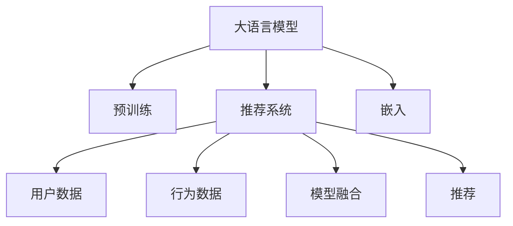

                 

# LLM Embeddings + RS: 语言模型增强推荐

> 关键词：大语言模型(LLM), 嵌入(Embeddings), 推荐系统, 自然语言处理(NLP), 计算图, 深度学习, 模型融合

## 1. 背景介绍

### 1.1 问题由来
在数字化转型的大背景下，推荐系统成为了互联网产品中不可或缺的一部分。通过推荐系统，用户可以快速发现感兴趣的优质内容，而产品方也能有效提升用户黏性，增加商业价值。然而，传统的基于协同过滤和矩阵分解的推荐算法，存在数据稀疏、冷启动困难等缺点，难以应对大规模实时数据流的挑战。

近年来，自然语言处理（Natural Language Processing, NLP）技术的发展，为推荐系统带来了新的活力。基于自然语言理解的推荐算法，可以更灵活、精准地描述和匹配用户的兴趣和行为，从而提升推荐效果。特别是随着大语言模型（Large Language Model, LLM）的崛起，推荐系统进入了一个全新的发展阶段，即通过深度学习模型，自动学习用户的文本特征，进行个性化推荐。

大语言模型，如GPT-3、BERT等，在大规模无标签文本数据上进行了预训练，能够高效提取文本语义信息，并在特定任务上进行微调，以获得针对不同领域或用户的深度个性化理解。利用大语言模型的这种能力，可以构建一种基于文本表示的推荐算法，即语言模型增强推荐系统（LLM + RS）。

### 1.2 问题核心关键点
本节将从背景和现状出发，阐述大语言模型增强推荐系统的工作原理和优化策略。文章将详细介绍：
1. 大语言模型的基础工作原理。
2. 推荐系统的基本理论和推荐范式。
3. 大语言模型在推荐系统中的应用策略。
4. 推荐系统中大语言模型优化的关键点。

## 2. 核心概念与联系

### 2.1 核心概念概述

为便于理解，下面将逐一介绍语言模型增强推荐系统中的核心概念：

- 大语言模型(LLM)：基于Transformer架构的预训练模型，如GPT-3、BERT等，能够在大规模无标签文本数据上进行自监督预训练，学习通用的语言表示。

- 嵌入(Embeddings)：将非结构化文本数据转换为低维稠密向量，方便机器处理和分析。大语言模型通常在预训练阶段学习文本嵌入向量，以捕捉文本的语义信息。

- 推荐系统(RS)：通过分析和建模用户的行为和兴趣，为用户推荐其可能感兴趣的产品或内容。推荐系统一般通过协同过滤、内容过滤、混合过滤等方法进行推荐。

- 深度学习(Deep Learning)：使用多层神经网络进行特征提取和模型预测，并通过反向传播算法进行参数优化。深度学习是现代推荐系统的主要算法基础。

- 自然语言处理(NLP)：涉及文本数据的获取、存储、预处理、分析和建模等，旨在使计算机具备理解、分析和生成自然语言的能力。

- 计算图(Computational Graph)：深度学习模型中的前向传播和反向传播过程，可以表示为有向无环图。计算图描述了模型各层之间的依赖关系，是深度学习框架的重要组成部分。

这些概念构成了语言模型增强推荐系统的核心框架。通过将大语言模型的嵌入向量与推荐系统的基本理论进行有机结合，可以实现更为精准、灵活的推荐效果。

### 2.2 核心概念联系
语言模型增强推荐系统的核心思想是将大语言模型的嵌入向量引入推荐系统中，通过训练大模型，自动学习用户的文本特征，以构建推荐模型。这一过程的逻辑关系如下：



这个流程图展示了语言模型增强推荐系统的主要流程：

1. 大语言模型通过预训练学习通用的语言表示。
2. 推荐系统收集和分析用户的文本数据和行为数据。
3. 将大语言模型的嵌入向量引入推荐系统，自动学习用户特征。
4. 通过模型融合，将用户特征与推荐模型进行集成，产生推荐结果。

## 3. 核心算法原理 & 具体操作步骤

### 3.1 算法原理概述
语言模型增强推荐系统的核心算法原理主要包括以下几个部分：

1. **大语言模型嵌入**：将用户文本数据输入大语言模型，得到文本的嵌入向量。嵌入向量不仅包含了用户的兴趣和行为特征，还融入了大语言模型的语义知识。

2. **推荐模型训练**：使用用户嵌入向量和行为数据，训练推荐模型，预测用户对不同物品的评分。推荐模型一般采用深度学习网络，如深度神经网络（DNN）、卷积神经网络（CNN）、循环神经网络（RNN）等。

3. **模型融合**：将大语言模型嵌入与推荐模型的预测结果进行融合，生成最终的推荐列表。常见的融合方法包括加权平均、投票、梯度提升等。

### 3.2 算法步骤详解

下面将详细介绍语言模型增强推荐系统的详细步骤：

#### 3.2.1 大语言模型嵌入
大语言模型的嵌入步骤主要包括以下几个关键点：

1. **数据预处理**：将用户的文本数据进行分词、去除停用词、标准化等预处理操作。
2. **输入嵌入**：将预处理后的文本数据输入大语言模型，得到文本的嵌入向量。
3. **特征提取**：将嵌入向量进行降维、归一化等操作，提取关键的文本特征。

#### 3.2.2 推荐模型训练
推荐模型训练的一般步骤如下：

1. **特征准备**：将用户嵌入向量和行为数据进行拼接或拼接后进行归一化。
2. **模型构建**：选择合适的推荐模型，如深度神经网络（DNN）、卷积神经网络（CNN）、循环神经网络（RNN）等。
3. **训练优化**：使用用户数据和行为数据，训练推荐模型，优化模型参数。
4. **评估指标**：使用验证集评估模型性能，如准确率、召回率、F1-score等。

#### 3.2.3 模型融合
模型融合的主要步骤如下：

1. **用户嵌入与预测融合**：将用户嵌入向量与推荐模型的预测结果进行加权平均，生成新的推荐分数。
2. **生成推荐列表**：根据新的推荐分数，生成最终的推荐列表，并按推荐分数排序。
3. **过滤与推荐**：对推荐列表进行过滤，如去除无效项、去重等操作，返回推荐结果。

### 3.3 算法优缺点

语言模型增强推荐系统具有以下优点：

1. **丰富语义信息**：大语言模型能够学习到广泛的语义知识，将语言嵌入引入推荐系统，可以提升推荐内容的丰富性和多样性。
2. **高泛化能力**：大语言模型经过大规模无标签数据的预训练，具备较强的泛化能力，可以适应多种推荐场景。
3. **高效特征提取**：通过大语言模型自动提取文本特征，减少了手工特征工程的复杂度，提高了推荐系统的效率。

同时，也存在一些局限性：

1. **计算成本高**：大语言模型嵌入需要耗费大量计算资源，增加了推荐系统的计算成本。
2. **实时性差**：由于大语言模型计算量大，嵌入过程较慢，可能无法满足实时性要求。
3. **数据依赖**：大语言模型需要大量的无标签文本数据进行预训练，数据获取和处理成本较高。
4. **模型复杂**：大语言模型和推荐模型都较为复杂，模型融合过程也需要额外的调试和优化。

### 3.4 算法应用领域

语言模型增强推荐系统已经在多个领域得到了应用，例如：

- 电商推荐：通过用户评论、浏览历史等文本数据，构建个性化推荐系统，提升用户体验和转化率。
- 内容推荐：基于用户的订阅、浏览行为，通过文本分析推荐相关文章、视频等，丰富内容推荐的多样性。
- 社交推荐：分析用户在社交平台上的文本交流，推荐可能感兴趣的人或群体，提升社交平台的活跃度。
- 音乐推荐：通过用户对歌曲的评论、评分等文本数据，推荐相似风格的音乐，满足用户个性化需求。
- 新闻推荐：分析用户的新闻阅读记录和评论，推荐感兴趣的新闻内容，提升新闻平台的用户黏性。

## 4. 数学模型和公式 & 详细讲解 & 举例说明

### 4.1 数学模型构建

语言模型增强推荐系统的数学模型构建主要包括以下几个步骤：

1. **输入预处理**：将用户文本数据进行分词、标准化等处理。
2. **嵌入计算**：将预处理后的文本数据输入大语言模型，得到文本的嵌入向量。
3. **特征拼接**：将用户嵌入向量与行为数据进行拼接或拼接后归一化。
4. **模型训练**：使用用户数据和行为数据，训练推荐模型，优化模型参数。
5. **模型融合**：将用户嵌入向量与推荐模型的预测结果进行融合，生成推荐分数。

以一个简单的电商推荐系统为例，其数学模型构建过程如下：

$$
\begin{aligned}
\text{user\_embedding} &= \text{BERT}(\text{user\_description}) \\
\text{item\_embedding} &= \text{BERT}(\text{item\_description}) \\
\text{user\_features} &= \text{concat}(\text{user\_embedding}, \text{item\_embedding}) \\
\text{item\_score} &= \text{DNN}(\text{user\_features}) \\
\text{recommendation\_scores} &= \text{concat}(\text{user\_features}, \text{item\_score}) \\
\text{recommendation\_list} &= \text{topk}(\text{recommendation\_scores})
\end{aligned}
$$

其中，BERT为预训练大语言模型，DNN为推荐模型，topk为生成推荐列表的函数。

### 4.2 公式推导过程

以电商推荐系统为例，推导推荐模型的计算过程：

设用户文本描述为 $u$，物品描述为 $i$，用户行为数据为 $b$。用户嵌入向量 $\text{user\_embedding} = \text{BERT}(u)$，物品嵌入向量 $\text{item\_embedding} = \text{BERT}(i)$。

假设推荐模型为深度神经网络（DNN），则物品评分函数为：

$$
\text{item\_score} = \text{DNN}(\text{user\_features} = \text{concat}(\text{user\_embedding}, \text{item\_embedding})) + \text{bias}
$$

其中，$\text{concat}$为拼接操作，$\text{bias}$为偏置项。

设推荐系统输出的预测结果为 $\text{recommendation\_scores} = \text{concat}(\text{user\_features}, \text{item\_score})$。根据排序推荐算法，推荐列表为 $\text{recommendation\_list} = \text{topk}(\text{recommendation\_scores})$。

### 4.3 案例分析与讲解

以一个具体的电商推荐案例为例，进行分析：

1. **数据准备**：收集用户的商品浏览记录、评价评论等文本数据。
2. **文本预处理**：对用户评论进行分词、去除停用词、标准化等操作。
3. **大语言模型嵌入**：将用户评论输入BERT模型，得到用户嵌入向量。
4. **特征提取**：将用户嵌入向量与物品描述向量拼接，得到用户特征向量。
5. **推荐模型训练**：使用用户特征向量与物品评分向量，训练深度神经网络模型，优化模型参数。
6. **模型融合**：将用户特征向量与物品评分向量进行融合，生成推荐分数，按分数排序生成推荐列表。

## 5. 项目实践：代码实例和详细解释说明

### 5.1 开发环境搭建

在进行项目实践前，需要搭建好相应的开发环境。以下是使用Python和PyTorch进行项目实践的环境配置：

1. **安装Anaconda**：从官网下载并安装Anaconda，用于创建独立的Python环境。
2. **创建虚拟环境**：
```bash
conda create -n llm-rs python=3.8 
conda activate llm-rs
```

3. **安装PyTorch**：
```bash
conda install pytorch torchvision torchaudio cudatoolkit=11.1 -c pytorch -c conda-forge
```

4. **安装Transformers库**：
```bash
pip install transformers
```

5. **安装推荐系统相关库**：
```bash
pip install scikit-learn pandas numpy matplotlib tqdm jupyter notebook ipython
```

完成上述步骤后，即可在`llm-rs`环境中开始项目实践。

### 5.2 源代码详细实现

以下是一个基于BERT模型的电商推荐系统的实现代码，主要使用了PyTorch和Transformers库。

```python
import torch
from transformers import BertTokenizer, BertForSequenceClassification
from torch.utils.data import Dataset, DataLoader
from sklearn.metrics import mean_absolute_error, mean_squared_error

# 定义数据集
class RecommendationDataset(Dataset):
    def __init__(self, data, tokenizer, max_len=128):
        self.data = data
        self.tokenizer = tokenizer
        self.max_len = max_len

    def __len__(self):
        return len(self.data)

    def __getitem__(self, index):
        text, label = self.data[index]
        encoding = self.tokenizer(text, truncation=True, padding='max_length', max_length=self.max_len)
        input_ids = encoding['input_ids']
        attention_mask = encoding['attention_mask']
        label = torch.tensor(label, dtype=torch.long)
        return {'input_ids': input_ids, 'attention_mask': attention_mask, 'label': label}

# 加载数据集
tokenizer = BertTokenizer.from_pretrained('bert-base-uncased')
train_data = load_train_data()
dev_data = load_dev_data()
test_data = load_test_data()

# 训练模型
model = BertForSequenceClassification.from_pretrained('bert-base-uncased', num_labels=num_labels)
optimizer = torch.optim.Adam(model.parameters(), lr=learning_rate)
scheduler = torch.optim.lr_scheduler.StepLR(optimizer, step_size=patience, gamma=0.5)

# 训练过程
for epoch in range(num_epochs):
    train_loss = 0
    train_correct = 0
    for batch in DataLoader(train_data, batch_size=batch_size, shuffle=True):
        inputs = {key: torch.tensor(val) for key, val in batch.items()}
        outputs = model(**inputs)
        loss = outputs.loss
        train_loss += loss.item()
        predictions = outputs.logits.argmax(dim=1)
        train_correct += (predictions == batch['label']).float().sum().item()
    train_loss /= len(train_data)
    train_acc = train_correct / len(train_data)

    # 验证过程
    dev_loss = 0
    dev_correct = 0
    for batch in DataLoader(dev_data, batch_size=batch_size, shuffle=False):
        inputs = {key: torch.tensor(val) for key, val in batch.items()}
        outputs = model(**inputs)
        loss = outputs.loss
        dev_loss += loss.item()
        predictions = outputs.logits.argmax(dim=1)
        dev_correct += (predictions == batch['label']).float().sum().item()
    dev_loss /= len(dev_data)
    dev_acc = dev_correct / len(dev_data)

    # 更新模型和超参数
    if epoch >= patience:
        scheduler.step()
    else:
        break

    # 保存模型
    model.save_pretrained(checkpoint_dir)

# 测试模型
model = BertForSequenceClassification.from_pretrained(checkpoint_dir)
model.eval()
test_loss = 0
test_correct = 0
for batch in DataLoader(test_data, batch_size=batch_size, shuffle=False):
    inputs = {key: torch.tensor(val) for key, val in batch.items()}
    outputs = model(**inputs)
    loss = outputs.loss
    test_loss += loss.item()
    predictions = outputs.logits.argmax(dim=1)
    test_correct += (predictions == batch['label']).float().sum().item()
test_loss /= len(test_data)
test_acc = test_correct / len(test_data)
print(f"Test loss: {test_loss:.4f}, Test acc: {test_acc:.4f}")
```

### 5.3 代码解读与分析

我们以电商推荐系统的实现代码为例，进行详细解读：

**RecommendationDataset类**：
- 定义了数据集的读取和预处理。将用户文本和标签进行拼接，并利用BERT模型进行分词和嵌入计算。
- 使用PyTorch的DataLoader对数据集进行批处理，供模型训练和推理使用。

**BERTForSequenceClassification模型**：
- 基于BERT模型的分类器，用于训练推荐模型。
- 使用Adam优化器和StepLR学习率调度策略，进行模型训练和参数优化。

**训练和验证过程**：
- 使用DataLoader对训练集进行批处理，计算损失函数和模型预测。
- 在每个epoch内，计算训练集和验证集的损失和准确率，并根据验证集性能更新学习率。
- 保存最优的模型参数，在测试集上进行最终评估。

## 6. 实际应用场景

### 6.1 电商推荐系统

电商推荐系统是语言模型增强推荐系统的重要应用场景之一。通过收集用户浏览、点击、评价等文本数据，构建推荐模型，可以显著提升用户的购物体验和平台的转化率。

以亚马逊为例，通过分析用户的评价评论和浏览记录，利用BERT模型提取用户和商品的语义特征，再结合深度神经网络进行推荐，可以准确预测用户可能感兴趣的商品，从而提高用户购买概率。此外，系统还可以推荐相关商品，提升商品曝光率和平台收益。

### 6.2 内容推荐系统

内容推荐系统广泛应用于新闻、视频、音乐等媒体平台，通过推荐用户感兴趣的内容，提升用户黏性和平台流量。

以Netflix为例，通过分析用户的观看记录和评论，利用BERT模型提取用户和视频内容的语义特征，结合深度学习模型进行推荐，可以准确预测用户可能感兴趣的视频，提升用户观看时长和平台黏性。此外，系统还可以推荐相关内容，增加平台内容的曝光和点击率。

### 6.3 社交推荐系统

社交推荐系统通过分析用户在社交平台上的文本交流，推荐可能感兴趣的人或群体，提升平台活跃度和用户黏性。

以Facebook为例，通过分析用户在社交平台上的评论和互动，利用BERT模型提取用户的语义特征，结合深度学习模型进行推荐，可以准确推荐可能感兴趣的用户或群组，增加用户的互动和平台黏性。

### 6.4 未来应用展望

随着深度学习和自然语言处理技术的不断进步，语言模型增强推荐系统将在更多领域得到应用，为各行各业带来变革性影响。

在智慧医疗领域，推荐系统可以用于推荐患者可能感兴趣的医疗信息，提升用户健康管理水平。在智慧城市治理中，推荐系统可以用于推荐居民可能感兴趣的服务，提升城市的智能化水平。在企业生产中，推荐系统可以用于推荐可能感兴趣的产品，提升企业的产品推荐效率和用户体验。

## 7. 工具和资源推荐

### 7.1 学习资源推荐

为了帮助开发者系统掌握语言模型增强推荐系统的理论基础和实践技巧，这里推荐一些优质的学习资源：

1. 《深度学习推荐系统》（周志华著）：详细介绍推荐系统的基本理论和算法，适合初学者入门。
2. 《自然语言处理入门》（李文彩著）：讲解自然语言处理的基本概念和技术，涵盖BERT等预训练模型。
3. 《Python深度学习》（Francois Chollet著）：详细介绍深度学习的基础知识和实现技巧，适合学习深度学习框架PyTorch。
4. 《TensorFlow实战》（李航著）：介绍TensorFlow的使用方法和应用场景，适合学习TensorFlow框架。
5. 《Recommender Systems: The Textbook》（Steinbach等著）：介绍推荐系统的经典理论和算法，适合进一步深入学习。

通过对这些资源的学习实践，相信你一定能够快速掌握语言模型增强推荐系统的精髓，并用于解决实际的推荐问题。

### 7.2 开发工具推荐

高效的开发离不开优秀的工具支持。以下是几款用于语言模型增强推荐系统开发的常用工具：

1. PyTorch：基于Python的开源深度学习框架，灵活动态的计算图，适合快速迭代研究。BERT等预训练模型都有PyTorch版本的实现。
2. TensorFlow：由Google主导开发的开源深度学习框架，生产部署方便，适合大规模工程应用。
3. Transformers库：HuggingFace开发的NLP工具库，集成了众多SOTA语言模型，支持PyTorch和TensorFlow，是推荐系统开发的利器。
4. Weights & Biases：模型训练的实验跟踪工具，可以记录和可视化模型训练过程中的各项指标，方便对比和调优。
5. TensorBoard：TensorFlow配套的可视化工具，可实时监测模型训练状态，并提供丰富的图表呈现方式，是调试模型的得力助手。
6. Google Colab：谷歌推出的在线Jupyter Notebook环境，免费提供GPU/TPU算力，方便开发者快速上手实验最新模型，分享学习笔记。

合理利用这些工具，可以显著提升语言模型增强推荐系统的开发效率，加快创新迭代的步伐。

### 7.3 相关论文推荐

语言模型增强推荐系统的发展源于学界的持续研究。以下是几篇奠基性的相关论文，推荐阅读：

1. Attention is All You Need（即Transformer原论文）：提出了Transformer结构，开启了深度学习模型在大规模无标签文本数据上进行自监督预训练的先河。
2. BERT: Pre-training of Deep Bidirectional Transformers for Language Understanding：提出BERT模型，引入基于掩码的自监督预训练任务，刷新了多项推荐系统任务的SOTA。
3. Factorization Machines：提出FM模型，通过矩阵分解的方式进行推荐，具有高效和可解释性的优点。
4. DNN Deep Neural Networks for Click Prediction in Web Search：提出深度神经网络模型，用于点击率预测，取得了较好的推荐效果。
5. CTR Click-Through Rate Prediction with Deep Learning：提出CTR模型，用于点击率预测，结合CTR和FM模型，取得了较好的推荐效果。

这些论文代表了大语言模型增强推荐系统的发展脉络。通过学习这些前沿成果，可以帮助研究者把握学科前进方向，激发更多的创新灵感。

## 8. 总结：未来发展趋势与挑战

### 8.1 总结

本文对语言模型增强推荐系统进行了全面系统的介绍。首先阐述了推荐系统和大语言模型的基础工作原理，明确了语言模型增强推荐系统的工作流程和优化策略。其次，从理论到实践，详细讲解了语言模型增强推荐系统的核心算法原理和操作步骤，给出了具体的代码实现。同时，本文还广泛探讨了语言模型增强推荐系统在电商、内容、社交等领域的实际应用前景，展示了语言模型增强推荐系统的广泛应用价值。最后，本文精选了语言模型增强推荐系统的各类学习资源，力求为读者提供全方位的技术指引。

通过本文的系统梳理，可以看到，语言模型增强推荐系统为推荐系统的发展带来了新的活力，极大地提升了推荐内容的丰富性和多样性。伴随深度学习和自然语言处理技术的不断进步，语言模型增强推荐系统必将在更多领域得到应用，为各行各业带来变革性影响。

### 8.2 未来发展趋势

展望未来，语言模型增强推荐系统将呈现以下几个发展趋势：

1. **多模态融合**：未来的推荐系统将不仅仅依赖文本数据，还会结合图像、视频、语音等多模态数据，实现更全面、精准的推荐。多模态数据的融合，将提升推荐系统对现实世界的理解和建模能力。
2. **实时性增强**：随着计算资源的不断提升，实时推荐系统将成为可能。语言模型增强推荐系统将需要更高效、更轻量级的计算方式，以支持实时推荐。
3. **深度学习融合**：深度学习模型将与传统的协同过滤、矩阵分解等方法深度融合，形成更加灵活、高效的推荐算法。
4. **数据隐私保护**：推荐系统将更加重视用户隐私保护，采用差分隐私等技术，防止用户数据泄露。
5. **模型透明化**：未来的推荐系统将更加注重模型的可解释性和透明性，帮助用户理解推荐依据，增强用户信任感。
6. **跨平台推荐**：推荐系统将更加注重跨平台的推荐效果，实现多设备、多场景的统一推荐。

以上趋势凸显了语言模型增强推荐系统的广阔前景。这些方向的探索发展，必将进一步提升推荐系统的性能和应用范围，为各行各业带来变革性影响。

### 8.3 面临的挑战

尽管语言模型增强推荐系统已经取得了显著进展，但在迈向更加智能化、普适化应用的过程中，它仍面临着诸多挑战：

1. **数据隐私和安全**：大规模文本数据的收集和使用，可能会涉及用户隐私问题，需要采取有效的数据保护措施。
2. **计算资源需求**：大语言模型的嵌入计算和推荐模型的训练计算，需要大量的计算资源，可能会对实时推荐造成挑战。
3. **模型复杂度**：语言模型增强推荐系统涉及多个深度学习模型的集成和融合，模型结构复杂，调试和优化难度较大。
4. **模型可解释性**：推荐系统需要具备较高的可解释性，帮助用户理解推荐依据，增强用户信任感。
5. **跨领域适应性**：不同领域的推荐系统需要针对该领域的特点进行优化，通用的语言模型嵌入效果可能不如针对特定领域的预训练模型。
6. **推荐系统偏见**：推荐系统可能会受到语言模型固有的偏见和歧视性影响，需要采取有效措施进行消除。

正视语言模型增强推荐系统面临的这些挑战，积极应对并寻求突破，将是大语言模型推荐系统走向成熟的必由之路。相信随着学界和产业界的共同努力，这些挑战终将一一被克服，语言模型增强推荐系统必将在构建智能推荐系统中扮演越来越重要的角色。

### 8.4 研究展望

面向未来，语言模型增强推荐系统需要在以下几个方面进行突破：

1. **模型融合策略**：如何在大语言模型嵌入和推荐模型之间进行有效的融合，形成更加稳定、高效的推荐系统，是未来研究的重要方向。
2. **多模态数据融合**：如何将图像、视频、语音等多模态数据与文本数据进行深度融合，提升推荐系统的准确性和多样性。
3. **推荐系统可解释性**：如何增强推荐系统的可解释性，让用户理解推荐依据，增强用户信任感。
4. **推荐系统公平性**：如何消除语言模型固有的偏见和歧视性，确保推荐系统的公平性和透明性。
5. **跨领域推荐**：如何针对不同领域的特性进行推荐模型优化，提升推荐系统的跨领域适应性。
6. **推荐系统实时性**：如何提升推荐系统的实时性，支持实时推荐和即时反馈，增强用户体验。

这些研究方向的探索，必将引领语言模型增强推荐系统迈向更高的台阶，为构建智能推荐系统铺平道路。面向未来，语言模型增强推荐系统还需要与其他人工智能技术进行更深入的融合，如知识表示、因果推理、强化学习等，多路径协同发力，共同推动推荐系统的进步。只有勇于创新、敢于突破，才能不断拓展语言模型的边界，让推荐系统更好地造福人类社会。

## 9. 附录：常见问题与解答

**Q1：语言模型增强推荐系统是否适用于所有推荐场景？**

A: 语言模型增强推荐系统在大多数推荐场景上都能取得不错的效果，特别是对于数据量较大的推荐任务。但对于一些特定领域的推荐任务，如金融、医疗等，可能需要针对该领域进行特定的预训练和微调。此外，对于一些需要高实时性的推荐任务，如在线广告推荐，可能需要采用分布式计算、模型压缩等技术。

**Q2：如何选择合适的预训练语言模型？**

A: 选择合适的预训练语言模型需要考虑以下几个方面：
1. 任务类型：不同任务需要不同类型的语言模型，如文本分类任务可以使用BERT，文本生成任务可以使用GPT-3。
2. 数据量：数据量较大的任务适合使用大规模的预训练模型，数据量较小的任务可以选择中等规模的模型。
3. 计算资源：计算资源丰富的任务可以选择大模型，计算资源有限的场景可以选择小模型。

**Q3：推荐系统中如何平衡推荐效果和实时性？**

A: 推荐系统中推荐效果和实时性的平衡需要综合考虑以下几个因素：
1. 数据预处理：优化数据预处理流程，减少计算开销。
2. 模型压缩：采用模型压缩技术，减小模型大小，提高推理速度。
3. 分布式计算：采用分布式计算框架，提高推荐系统的并行计算能力。
4. 延迟推荐：在计算资源有限的情况下，可以采用延迟推荐的方式，先存储计算结果，后续再推荐。

**Q4：如何提高推荐系统的跨领域适应性？**

A: 提高推荐系统的跨领域适应性需要从以下几个方面进行优化：
1. 领域特定的预训练：针对特定领域的数据进行预训练，提取领域相关的语义特征。
2. 领域自适应模型：在通用模型基础上加入领域自适应模块，动态调整模型参数。
3. 数据增强：采用数据增强技术，扩充训练集，增强模型的泛化能力。

**Q5：如何确保推荐系统的公平性？**

A: 确保推荐系统的公平性需要从以下几个方面进行优化：
1. 数据公平性：确保训练数据和测试数据分布一致，防止数据偏差导致不公平。
2. 模型公平性：优化模型参数，防止模型偏见影响推荐结果。
3. 结果公平性：对推荐结果进行公平性评估，确保推荐结果对所有用户都是公平的。

**Q6：如何处理推荐系统的冷启动问题？**

A: 推荐系统的冷启动问题可以通过以下几个方法解决：
1. 新用户推荐：针对新用户，使用简单的推荐算法，如基于内容的推荐。
2. 多模态融合：结合用户行为数据和社交网络数据，提升新用户的推荐效果。
3. 预训练模型迁移：利用预训练模型的语义知识，对新用户进行推荐。

通过这些优化措施，可以有效地提升推荐系统的性能和公平性，为用户带来更好的推荐体验。

---

作者：禅与计算机程序设计艺术 / Zen and the Art of Computer Programming

