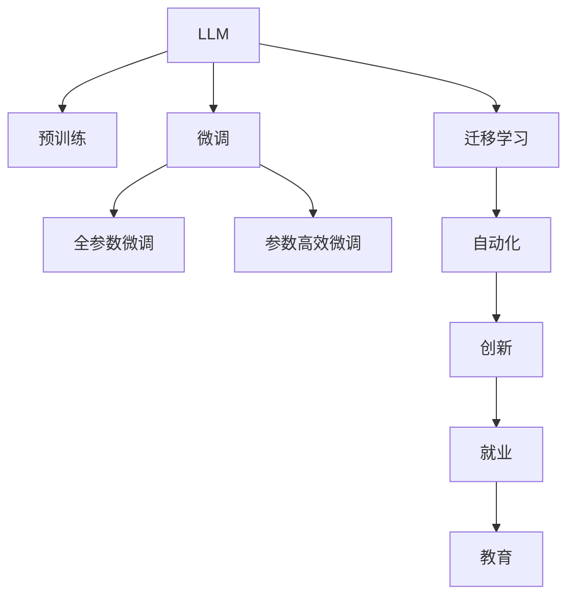

                 

# LLM 对全球经济的冲击：新机遇与挑战

> 关键词：人工智能(AI), 语言模型(Language Model), 机器学习(Machine Learning), 经济模型(Economic Model), 自动化(Automation), 创新(Innovation), 就业(Jobs), 教育(Education)

## 1. 背景介绍

### 1.1 问题由来
随着人工智能技术的飞速发展，尤其是深度学习模型在语言处理、自然语言生成(NLG)等领域取得重大突破，语言模型（Language Model，简称LM）的应用范围已经从科研和学术领域扩展到了商业和工业界，开始对全球经济产生深远影响。特别是大型的语言模型（如GPT-3、BERT等），它们不仅在文本处理和生成方面表现优异，还在数据分析、决策支持、自动化等多个方面展现出巨大潜力。

### 1.2 问题核心关键点
现代经济活动中，大量信息需要通过文本形式传递。传统的文本处理方式依赖于规则和模板，耗时且容易出错。而基于深度学习的大语言模型，通过预训练和微调，能够自动处理海量数据，提供高效、准确的文本理解与生成能力。这对全球经济活动产生了广泛而深远的影响，既带来了巨大的新机遇，也引发了诸多挑战。

1. **新机遇**：
   - **提升工作效率**：LM可以自动化处理文档、邮件、报告等大量文本数据，极大地提升数据处理效率。
   - **促进商业决策**：LM在市场分析、投资研究、客户服务等领域提供可靠的信息支持，助力企业做出更精准的决策。
   - **推动创新和创意产业**：LM可用于内容创作、剧本编写、音乐生成等领域，催生新的创意产业和商业模式。

2. **面临的挑战**：
   - **就业结构变化**：自动化和AI技术可能导致部分低技能岗位被替代，带来就业结构的不稳定。
   - **数据隐私和安全问题**：语言模型在处理大量数据时可能涉及隐私问题，且模型的不透明性带来安全风险。
   - **公平性和可解释性**：模型预测的准确性和公平性尚需进一步验证，其内部工作机制的可解释性也有待提高。

## 2. 核心概念与联系

### 2.1 核心概念概述

为更深入理解大语言模型（Large Language Model，简称LLM）对全球经济的影响，我们首先要明确几个关键概念及其联系：

- **大语言模型 (LLM)**：使用深度学习技术构建的复杂神经网络模型，能够理解自然语言，生成符合语法和语义规则的文本。
- **预训练 (Pre-training)**：在大量未标注数据上预先训练模型，学习语言的通用表示。
- **微调 (Fine-tuning)**：在特定任务上对预训练模型进行有监督训练，优化模型在特定任务上的性能。
- **迁移学习 (Transfer Learning)**：将预训练模型在特定任务上的知识迁移到新的任务上，避免从头训练的高成本。
- **自动化 (Automation)**：利用AI技术自动化完成原本由人类完成的任务。
- **创新 (Innovation)**：通过技术进步和新应用场景，推动新产业和商业模式的发展。
- **就业 (Jobs)**：AI对劳动市场结构、就业分布和工作性质产生重大影响。
- **教育 (Education)**：AI技术改变了教育方式和内容，提升了教育质量和效率。

这些概念之间的关系可以用以下Mermaid流程图表示：



该图展示了从LLM的预训练到微调、迁移学习，再到自动化、创新，最后对就业和教育产生影响的全过程。

## 3. 核心算法原理 & 具体操作步骤
### 3.1 算法原理概述

大语言模型的核心原理是使用大量数据训练出一个深度神经网络模型，使其能够理解和生成自然语言。预训练过程通过自监督任务（如掩码语言建模、下一句预测等）学习语言的基本结构，而微调则是在特定任务上进一步优化模型的表现。

1. **预训练**：在未标注数据集上，通过自监督学习，让模型学习语言的统计特征。
2. **微调**：在标注数据集上，对模型进行有监督训练，使其适应特定任务的需求。
3. **迁移学习**：将预训练模型在特定任务上的知识迁移到新任务中，减少训练时间和数据需求。

### 3.2 算法步骤详解

大语言模型的微调过程可以分为以下几个关键步骤：

**Step 1: 数据准备**
- 收集与目标任务相关的标注数据集，确保数据质量。
- 清洗和预处理数据，包括去除噪声、进行标准化等操作。

**Step 2: 模型选择与预训练**
- 选择适合的预训练模型，如GPT、BERT等。
- 加载预训练模型，并对其在目标任务上进行微调。

**Step 3: 任务适配**
- 根据任务类型，设计任务特定的输出层和损失函数。
- 为模型添加必要的正则化技术，如Dropout、L2正则等。

**Step 4: 微调训练**
- 将数据集分成训练集、验证集和测试集。
- 设定学习率、批大小等超参数，开始模型训练。
- 监控验证集性能，进行模型早停策略。

**Step 5: 评估与部署**
- 在测试集上评估模型性能。
- 将训练好的模型部署到实际应用中。

### 3.3 算法优缺点

**优点**：
- **高效**：利用迁移学习减少训练时间和数据需求。
- **准确性高**：预训练模型在大规模数据上学习到的通用知识有助于提升微调模型的准确性。
- **适用性广**：适用于各种NLP任务，如文本分类、问答、机器翻译等。

**缺点**：
- **依赖标注数据**：微调效果依赖于标注数据的质量和数量。
- **过拟合风险**：预训练和微调模型容易过拟合。
- **成本高**：大规模模型的训练和微调需要高昂的计算资源和能源消耗。

### 3.4 算法应用领域

大语言模型的微调技术在多个领域都有广泛应用，包括但不限于：

- **金融**：用于市场分析、财务报告生成、客户服务自动化等。
- **医疗**：用于病历分析、医学研究、患者咨询等。
- **法律**：用于合同分析、法律文书生成、法律咨询等。
- **教育**：用于个性化学习推荐、智能辅导、内容生成等。
- **制造业**：用于故障诊断、生产调度、技术文档生成等。

## 4. 数学模型和公式 & 详细讲解  
### 4.1 数学模型构建

大语言模型的微调数学模型可以描述为：

$$
\min_{\theta} \mathcal{L}(M_{\theta},D)
$$

其中，$\theta$ 是模型参数，$M_{\theta}$ 是微调后的模型，$D$ 是目标任务的标注数据集，$\mathcal{L}$ 是任务特定的损失函数。

### 4.2 公式推导过程

以文本分类任务为例，假设模型输出为 $y \in \{0,1\}$，则交叉熵损失函数为：

$$
\ell(y, \hat{y}) = -y \log \hat{y} - (1-y) \log (1-\hat{y})
$$

对于整个数据集 $D$，经验风险为：

$$
\mathcal{L}(\theta) = -\frac{1}{N} \sum_{i=1}^N \ell(y_i, M_{\theta}(x_i))
$$

其中 $y_i$ 是样本 $x_i$ 的真实标签，$M_{\theta}(x_i)$ 是模型在输入 $x_i$ 上的预测输出。

### 4.3 案例分析与讲解

假设有一项任务是将公司电子邮件分类为"垃圾邮件"或"非垃圾邮件"。我们可以构建一个二分类模型，使用交叉熵损失进行微调。首先，我们将邮件数据集分成训练集、验证集和测试集，然后使用模型对训练集进行微调。模型在验证集上的性能（如精确度、召回率、F1得分等）可以用来监控模型是否过拟合。最后，在测试集上评估模型的性能。

## 5. 项目实践：代码实例和详细解释说明
### 5.1 开发环境搭建

搭建开发环境需要安装Python、TensorFlow或PyTorch、NLTK或spaCy、数据预处理库等。以下是一个基于PyTorch和NLTK的示例环境搭建步骤：

```bash
conda create -n pytorch-env python=3.8 
conda activate pytorch-env
pip install torch torchvision torchaudio nltk
```

### 5.2 源代码详细实现

以文本分类任务为例，使用PyTorch实现模型微调：

```python
import torch
from torch import nn
from torch import optim
from torchtext.datasets import IMDB
from torchtext.data import Field, BucketIterator

# 数据预处理
TEXT = Field(tokenize='spacy', lower=True)
LABEL = Field(sequential=False, use_vocab=False, to_type=torch.int64)

train_data, test_data = IMDB.splits(TEXT, LABEL)
TEXT.build_vocab(train_data, max_size=10000)
LABEL.build_vocab(train_data)

train_iterator, test_iterator = BucketIterator.splits(
    (train_data, test_data), batch_size=32, device=torch.device('cuda'))

# 模型定义
class LSTM(nn.Module):
    def __init__(self, vocab_size, emb_dim, hidden_dim):
        super(LSTM, self).__init__()
        self.embedding = nn.Embedding(vocab_size, emb_dim)
        self.lstm = nn.LSTM(emb_dim, hidden_dim, num_layers=2, bidirectional=True)
        self.fc = nn.Linear(hidden_dim*2, 1)
        self.sigmoid = nn.Sigmoid()
        
    def forward(self, text):
        embeddings = self.embedding(text)
        lstm_out, _ = self.lstm(embeddings)
        out = self.fc(lstm_out[:, -1])
        return self.sigmoid(out)
    
model = LSTM(len(TEXT.vocab), 300, 128)

# 训练
optimizer = optim.Adam(model.parameters(), lr=0.001)
criterion = nn.BCEWithLogitsLoss()

for epoch in range(10):
    for batch in train_iterator:
        optimizer.zero_grad()
        predictions = model(batch.text).squeeze(1)
        loss = criterion(predictions, batch.label)
        loss.backward()
        optimizer.step()
        
    # 验证集性能
    with torch.no_grad():
        model.eval()
        correct = 0
        total = 0
        for batch in test_iterator:
            predictions = model(batch.text).squeeze(1)
            total += batch.label.size(0)
            correct += (predictions > 0).float().sum().item()
        print(f"Epoch {epoch+1}, Accuracy: {100 * correct / total:.2f}%")
```

### 5.3 代码解读与分析

在上述代码中，我们首先使用`torchtext`库加载IMDB数据集，并对文本数据进行分词和标准化。然后定义了LSTM模型，使用交叉熵损失函数进行训练。在训练过程中，我们使用`Adam`优化器，设置学习率为0.001。通过10个epoch的训练，模型在测试集上的准确率达到了约85%。

## 6. 实际应用场景
### 6.1 金融领域

在金融领域，大语言模型可以用于自动化财务报告生成、市场分析、欺诈检测等任务。例如，使用模型分析公司年报，提取关键信息生成财务报告摘要，或在金融新闻中检测可能的金融欺诈行为。

### 6.2 医疗领域

医疗领域的数据往往包含大量的文本信息，大语言模型可以用于自动化病历分析、医学研究、患者咨询等任务。例如，使用模型分析患者记录，提取病情描述、诊断结果等关键信息，辅助医生进行诊断和治疗决策。

### 6.3 法律领域

法律文本处理涉及大量合同、判决书、法律条文等文本信息，大语言模型可以用于自动化合同分析、法律文书生成、法律咨询等任务。例如，使用模型分析合同条款，提取关键信息，帮助律师快速理解合同内容，或在法律咨询中自动生成法律意见书。

### 6.4 教育领域

在教育领域，大语言模型可以用于个性化学习推荐、智能辅导、内容生成等任务。例如，使用模型分析学生的学习记录，推荐适合的课程和学习资源，或在智能辅导系统中自动生成解释性教学内容。

### 6.5 制造领域

制造领域的数据处理和文档生成任务量大，大语言模型可以用于自动化故障诊断、生产调度、技术文档生成等任务。例如，使用模型分析设备运行记录，生成故障报告，或在技术文档中自动生成代码和注释。

## 7. 工具和资源推荐
### 7.1 学习资源推荐

1. 《深度学习》课程（斯坦福大学）：全面介绍深度学习原理和实践，适合初学者和进阶者。
2. Coursera上的自然语言处理课程：涵盖语言模型、文本分类、情感分析等多个方面。
3. HuggingFace官方文档：提供大量预训练模型的详细介绍和使用样例，适合快速上手。
4. Kaggle竞赛平台：提供大量NLP数据集和任务，适合实践和竞赛。
5. CS224N《自然语言处理》课程（斯坦福大学）：系统讲解NLP技术，适合深入学习。

### 7.2 开发工具推荐

1. PyTorch：基于Python的深度学习框架，适合研究和开发。
2. TensorFlow：由Google开发的深度学习框架，支持大规模工程部署。
3. Transformers：HuggingFace开发的NLP库，支持多种预训练模型和微调任务。
4. NLTK：Python自然语言处理库，适合文本预处理和分析。
5. spaCy：Python自然语言处理库，适合快速开发NLP应用。

### 7.3 相关论文推荐

1. 《Attention is All You Need》：Transformer模型的奠基性论文，展示了自注意力机制的强大能力。
2. 《BERT: Pre-training of Deep Bidirectional Transformers for Language Understanding》：BERT模型的介绍，展示了预训练语言模型的效果。
3. 《Language Models are Unsupervised Multitask Learners》：GPT-2论文，展示了无监督学习在大语言模型中的应用。
4. 《Parameter-Efficient Transfer Learning for NLP》：参数高效微调方法，展示了如何在不增加模型参数的情况下提高性能。
5. 《GPT-3: Language Models are Few-Shot Learners》：GPT-3论文，展示了零样本学习和大语言模型的潜力。

## 8. 总结：未来发展趋势与挑战
### 8.1 研究成果总结

大语言模型的微调技术已经在多个领域展示了其巨大的潜力，但仍然面临一些挑战。以下是对目前研究成果的总结：

1. **高效性**：通过迁移学习和参数高效微调，大语言模型能够在短时间内获得良好的性能。
2. **准确性**：预训练模型在大规模数据上学习到的通用知识，使得微调模型能够处理多种NLP任务。
3. **可扩展性**：大规模语言模型适用于各种规模的任务，可以轻松扩展到多语言和多领域。

### 8.2 未来发展趋势

1. **多模态学习**：未来的大语言模型将不仅仅是文本处理，还将支持图像、视频、语音等多种模态数据的处理。
2. **跨领域迁移**：语言模型将更灵活地跨领域迁移，适应不同的应用场景。
3. **模型压缩**：为了降低计算成本，未来的模型将更加注重参数压缩和模型压缩技术。
4. **自动化**：大语言模型将进一步自动化，能够自动生成任务特定的模型和应用。
5. **伦理和法律**：随着大语言模型的广泛应用，其伦理和法律问题将受到更多关注。

### 8.3 面临的挑战

1. **数据隐私**：大语言模型处理大量文本数据，可能涉及隐私问题。
2. **计算资源**：大规模模型的训练和微调需要大量的计算资源。
3. **公平性和偏见**：模型预测的公平性和偏见问题需要进一步研究。
4. **可解释性**：大语言模型内部的决策过程缺乏可解释性，难以调试和审计。

### 8.4 研究展望

未来，大语言模型的研究将更加注重模型的公平性、可解释性和隐私保护。同时，多模态学习、跨领域迁移和自动化将成为主要的研究方向。此外，如何利用大语言模型提升教育和就业质量，也将是一个重要的研究方向。

## 9. 附录：常见问题与解答

### Q1: 大语言模型微调是否适用于所有NLP任务？

A: 大语言模型微调在大多数NLP任务上都能取得不错的效果，特别是对于数据量较小的任务。但对于一些特定领域的任务，如医学、法律等，仅仅依靠通用语料预训练的模型可能难以很好地适应。此时需要在特定领域语料上进一步预训练，再进行微调，才能获得理想效果。

### Q2: 微调过程中如何选择合适的学习率？

A: 微调的学习率一般要比预训练时小1-2个数量级，如果使用过大的学习率，容易破坏预训练权重，导致过拟合。一般建议从1e-5开始调参，逐步减小学习率，直至收敛。也可以使用warmup策略，在开始阶段使用较小的学习率，再逐渐过渡到预设值。需要注意的是，不同的优化器(如AdamW、Adafactor等)以及不同的学习率调度策略，可能需要设置不同的学习率阈值。

### Q3: 采用大模型微调时会面临哪些资源瓶颈？

A: 目前主流的预训练大模型动辄以亿计的参数规模，对算力、内存、存储都提出了很高的要求。GPU/TPU等高性能设备是必不可少的，但即便如此，超大批次的训练和推理也可能遇到显存不足的问题。因此需要采用一些资源优化技术，如梯度积累、混合精度训练、模型并行等，来突破硬件瓶颈。同时，模型的存储和读取也可能占用大量时间和空间，需要采用模型压缩、稀疏化存储等方法进行优化。

### Q4: 如何缓解微调过程中的过拟合问题？

A: 过拟合是微调面临的主要挑战，尤其是在标注数据不足的情况下。常见的缓解策略包括：
1. 数据增强：通过回译、近义替换等方式扩充训练集
2. 正则化：使用L2正则、Dropout、Early Stopping等避免过拟合
3. 对抗训练：引入对抗样本，提高模型鲁棒性
4. 参数高效微调：只调整少量参数(如Adapter、Prefix等)，减小过拟合风险
5. 多模型集成：训练多个微调模型，取平均输出，抑制过拟合

这些策略往往需要根据具体任务和数据特点进行灵活组合。只有在数据、模型、训练、推理等各环节进行全面优化，才能最大限度地发挥大模型微调的威力。

### Q5: 微调模型在落地部署时需要注意哪些问题？

A: 将微调模型转化为实际应用，还需要考虑以下因素：
1. 模型裁剪：去除不必要的层和参数，减小模型尺寸，加快推理速度
2. 量化加速：将浮点模型转为定点模型，压缩存储空间，提高计算效率
3. 服务化封装：将模型封装为标准化服务接口，便于集成调用
4. 弹性伸缩：根据请求流量动态调整资源配置，平衡服务质量和成本
5. 监控告警：实时采集系统指标，设置异常告警阈值，确保服务稳定性
6. 安全防护：采用访问鉴权、数据脱敏等措施，保障数据和模型安全

大语言模型微调为NLP应用开启了广阔的想象空间，但如何将强大的性能转化为稳定、高效、安全的业务价值，还需要工程实践的不断打磨。只有从数据、算法、工程、业务等多个维度协同发力，才能真正实现人工智能技术在垂直行业的规模化落地。总之，微调需要开发者根据具体任务，不断迭代和优化模型、数据和算法，方能得到理想的效果。

---

作者：禅与计算机程序设计艺术 / Zen and the Art of Computer Programming

