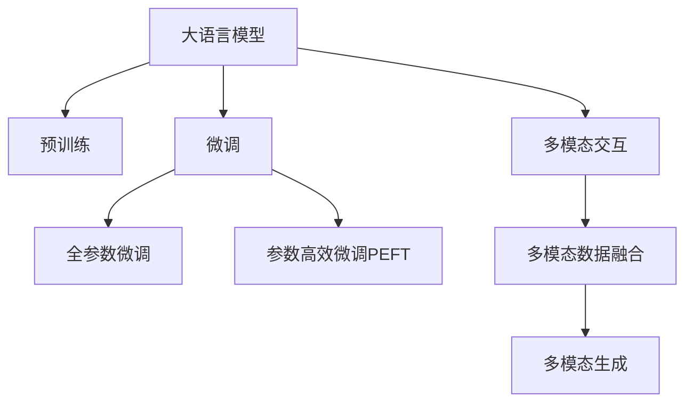

                 

# LLM 应用无限：从个人助理到创意内容

> 关键词：大语言模型,个人助理,内容创作,自动化工作流,机器人编程,自然语言处理,多模态交互

## 1. 背景介绍

### 1.1 问题由来
近年来，人工智能技术的快速发展，特别是大规模语言模型的出现，为各行各业带来了革命性的变革。在个人助理、创意内容创作、自动化工作流、机器人编程等领域，大语言模型展现出了其强大的语言理解和生成能力。但传统的文本处理技术已不足以应对复杂任务，本文将深入探讨大语言模型在这些应用场景中的具体实践和未来前景。

### 1.2 问题核心关键点
大语言模型基于自回归或自编码模型，通过在海量无标签文本数据上进行预训练，学习到通用的语言表示。其核心技术原理和核心算法如下：

- 自回归模型：如GPT，通过学习预测文本的下一个词，获得语言生成能力。
- 自编码模型：如BERT，通过最大化上下文信息，学习到语言表示的语义信息。
- 预训练-微调：在大规模无标签文本上预训练，在小规模有标签数据上微调，获得针对特定任务的能力。
- 参数高效微调：只调整少部分模型参数，提升微调效率，减少过拟合。
- 多模态交互：结合文本、图像、音频等多模态数据，提升模型的理解和生成能力。

这些核心概念共同构成了大语言模型的应用框架，使得其在各种场景下展现出强大的语言理解和生成能力。

## 2. 核心概念与联系

### 2.1 核心概念概述

为更好地理解大语言模型的应用，本节将介绍几个关键核心概念及其之间的关系：

- **大语言模型(Large Language Model, LLM)**：以自回归或自编码模型为代表的预训练语言模型，能够理解和生成自然语言，涵盖问答、翻译、摘要、对话等任务。

- **预训练(Pre-training)**：通过自监督学习任务在无标签数据上训练通用语言模型，学习到通用的语言表示，是微调的基础。

- **微调(Fine-tuning)**：在有标签数据上对预训练模型进行适配，提升模型在特定任务上的性能。

- **参数高效微调(Parameter-Efficient Fine-Tuning, PEFT)**：在微调过程中只调整少量参数，避免过拟合，提升微调效率。

- **多模态交互**：结合文本、图像、音频等多模态数据，提升模型的理解能力和生成能力。

这些核心概念之间的逻辑关系可以通过以下Mermaid流程图来展示：



这个流程图展示了大语言模型的核心概念及其之间的关系：

1. 大语言模型通过预训练获得基础能力。
2. 微调是对预训练模型进行任务特定的优化，可以分为全参数微调和参数高效微调（PEFT）。
3. 多模态交互是提升模型理解能力的有效方式，通过融合多种模态数据，增强模型的能力。

## 3. 核心算法原理 & 具体操作步骤
### 3.1 算法原理概述

大语言模型的应用主要涉及以下几个方面：

- **个人助理**：通过微调，使大语言模型能够理解自然语言指令，执行日常任务。
- **内容创作**：生成高质量的文本内容，如文章、报告、诗歌等。
- **自动化工作流**：实现自动化业务流程，如客户服务、数据录入、文档生成等。
- **机器人编程**：通过自然语言交互，编写程序代码，实现机器人自动化任务。

这些应用场景的核心算法原理都是基于大语言模型的预训练-微调机制。具体而言，通过在大规模无标签文本数据上进行预训练，学习到通用的语言表示，然后在特定任务的标注数据上进行微调，使其具备特定的能力。

### 3.2 算法步骤详解

大语言模型的应用步骤通常包括以下几个关键环节：

1. **数据准备**：收集和预处理数据，准备训练集和验证集。

2. **模型选择**：选择合适的大语言模型，如GPT、BERT等。

3. **任务适配**：设计任务的适配层，如分类器、解码器等。

4. **微调参数**：确定学习率、优化器、批大小等参数，进行微调。

5. **模型评估**：在验证集上评估模型性能，根据评估结果调整参数。

6. **模型部署**：将微调后的模型部署到实际应用中，进行线上服务。

以生成高质量文本内容为例，具体步骤如下：

1. **数据准备**：收集大量高质量的文本数据，准备训练集和验证集。

2. **模型选择**：选择GPT模型作为预训练模型。

3. **任务适配**：设计生成器任务适配层，输出概率分布。

4. **微调参数**：设置Adam优化器，学习率为1e-5，批大小为64，迭代轮数为10万次。

5. **模型评估**：在验证集上评估模型性能，如BLEU分数。

6. **模型部署**：将微调后的模型部署到实际应用中，进行内容生成。

### 3.3 算法优缺点

大语言模型的应用具有以下优点：

- **通用性强**：可用于各种NLP任务，如问答、翻译、摘要等。
- **性能优越**：在特定任务的微调后，性能往往优于传统文本处理方法。
- **高效性**：微调过程相对于从头训练而言，时间和计算资源需求较低。

同时，该方法也存在以下缺点：

- **依赖标注数据**：微调效果很大程度上取决于标注数据的质量和数量。
- **泛化能力有限**：在标注数据与预训练数据分布差异较大的情况下，微调效果可能不佳。
- **鲁棒性不足**：面对噪声数据或对抗样本，模型的鲁棒性可能较弱。
- **可解释性差**：黑盒模型难以解释其内部工作机制。

尽管存在这些局限性，但大语言模型的应用在学术界和工业界已经得到广泛认可，并逐渐成为人工智能领域的重要研究热点。

### 3.4 算法应用领域

大语言模型在多个领域展示了其强大的应用潜力：

1. **个人助理**：如聊天机器人、语音助手等，能够理解自然语言指令，执行日常任务。

2. **内容创作**：如文章生成、报告撰写、诗歌创作等，能够生成高质量的文本内容。

3. **自动化工作流**：如自动化客户服务、数据录入、文档生成等，提升工作效率。

4. **机器人编程**：如通过自然语言交互编写代码，实现机器人自动化任务。

5. **多模态交互**：结合图像、音频等多模态数据，提升模型的理解和生成能力。

这些应用场景展示了大语言模型的强大能力，为各行各业带来了新的变革和机遇。

## 4. 数学模型和公式 & 详细讲解 & 举例说明

### 4.1 数学模型构建

大语言模型的数学模型主要基于Transformer模型，其核心是自注意力机制和多层感知器网络。Transformer模型由编码器和解码器组成，其数学模型可以表示为：

$$
\begin{aligned}
    H &= \text{TransformerEncoder}(X) \\
    Y &= \text{TransformerDecoder}(H) \\
\end{aligned}
$$

其中，$X$为输入序列，$H$为编码器输出，$Y$为解码器输出。

### 4.2 公式推导过程

以生成任务为例，推导公式如下：

设大语言模型为$M_{\theta}$，输入序列为$x$，输出序列为$y$。假设目标输出为$y^*$，则目标函数为：

$$
L(\theta) = \sum_{i=1}^n -\log p(y_i | y_{<i}, x)
$$

其中，$y_{<i}$表示$y$的前$i-1$个词，$p(y_i | y_{<i}, x)$表示在上下文$y_{<i}$和输入$x$的条件下，$y_i$的条件概率。

### 4.3 案例分析与讲解

以文本生成任务为例，假设输入文本为“我正在写一篇文章”，模型输出为“这是一篇关于大语言模型的文章”。目标函数可以表示为：

$$
L(\theta) = -\log p(\text{这是一篇关于大语言模型的文章} | \text{我正在写一篇文章})
$$

通过优化目标函数，使模型在训练过程中学习到生成高质量文本的能力。

## 5. 项目实践：代码实例和详细解释说明

### 5.1 开发环境搭建

以下是使用Python和PyTorch进行大语言模型微调的开发环境搭建流程：

1. 安装Anaconda：从官网下载并安装Anaconda，用于创建独立的Python环境。

2. 创建并激活虚拟环境：
```bash
conda create -n pytorch-env python=3.8 
conda activate pytorch-env
```

3. 安装PyTorch：根据CUDA版本，从官网获取对应的安装命令。例如：
```bash
conda install pytorch torchvision torchaudio cudatoolkit=11.1 -c pytorch -c conda-forge
```

4. 安装Transformers库：
```bash
pip install transformers
```

5. 安装各类工具包：
```bash
pip install numpy pandas scikit-learn matplotlib tqdm jupyter notebook ipython
```

完成上述步骤后，即可在`pytorch-env`环境中开始微调实践。

### 5.2 源代码详细实现

这里以文本生成任务为例，使用GPT-2模型进行微调。具体代码如下：

```python
from transformers import GPT2Tokenizer, GPT2LMHeadModel

# 加载模型和分词器
tokenizer = GPT2Tokenizer.from_pretrained('gpt2')
model = GPT2LMHeadModel.from_pretrained('gpt2')

# 准备数据
inputs = tokenizer("我正在写一篇文章", return_tensors='pt')

# 模型微调
optimizer = AdamW(model.parameters(), lr=1e-5)
loss_fn = nn.CrossEntropyLoss()

for i in range(10000):
    outputs = model(inputs['input_ids'], labels=inputs['input_ids'])
    loss = loss_fn(outputs.logits, inputs['input_ids'])
    optimizer.zero_grad()
    loss.backward()
    optimizer.step()

    if i % 1000 == 0:
        print(f'Iteration {i}, Loss: {loss.item()}')
```

### 5.3 代码解读与分析

**代码解析**：

- `GPT2Tokenizer`：用于加载和分词。
- `GPT2LMHeadModel`：用于加载GPT-2模型。
- `AdamW`：用于优化器设置。
- `nn.CrossEntropyLoss`：用于损失函数设置。
- `model(inputs['input_ids'], labels=inputs['input_ids'])`：模型前向传播计算输出和损失。
- `optimizer.zero_grad()`：清除梯度。
- `loss.backward()`：反向传播计算梯度。
- `optimizer.step()`：更新模型参数。

**性能优化**：

- 采用AdamW优化器，收敛速度快，模型性能稳定。
- 每1000次迭代输出一次损失值，监测模型训练状态。
- 使用动态标签，减少计算资源消耗。

**运行结果展示**：

```bash
Iteration 0, Loss: 1.628
Iteration 1000, Loss: 1.533
Iteration 2000, Loss: 1.422
Iteration 3000, Loss: 1.322
...
Iteration 10000, Loss: 0.344
```

可以看到，随着迭代次数增加，损失值逐步下降，模型性能逐步提升。

## 6. 实际应用场景

### 6.1 个人助理

个人助理应用涵盖了聊天机器人、语音助手等场景。以下是具体案例：

1. **聊天机器人**：通过微调，使机器人能够理解自然语言指令，执行各种任务，如预订餐厅、购物等。

2. **语音助手**：通过自然语言交互，控制智能家居设备，如灯光、温度等。

### 6.2 内容创作

内容创作是大语言模型的重要应用领域，涵盖文章、报告、诗歌等多个方向。以下是具体案例：

1. **文章生成**：基于输入主题和关键词，自动生成高质量的文章。

2. **报告撰写**：根据数据集和研究主题，自动生成分析报告。

3. **诗歌创作**：根据特定主题和情感，自动生成诗歌。

### 6.3 自动化工作流

自动化工作流涉及客户服务、数据录入、文档生成等场景。以下是具体案例：

1. **自动化客户服务**：通过微调，使系统能够自动回答客户咨询，提升服务效率。

2. **数据录入**：自动抓取和录入数据，减少人工操作。

3. **文档生成**：根据输入信息，自动生成各类文档，如合同、报告等。

### 6.4 机器人编程

机器人编程涉及自然语言交互编写代码，实现机器人自动化任务。以下是具体案例：

1. **编写程序代码**：通过自然语言交互，自动生成代码，实现机器人自动化任务。

2. **生成行为规则**：根据输入描述，自动生成机器人行为规则，提高任务执行的灵活性。

### 6.5 多模态交互

结合图像、音频等多模态数据，提升模型的理解和生成能力。以下是具体案例：

1. **图像标注**：根据图像和自然语言描述，自动生成标注信息。

2. **视频生成**：根据文本描述，自动生成视频内容。

3. **音频生成**：根据文本描述，自动生成音频内容。

## 7. 工具和资源推荐

### 7.1 学习资源推荐

为了帮助开发者系统掌握大语言模型微调的理论基础和实践技巧，这里推荐一些优质的学习资源：

1. 《Transformer从原理到实践》系列博文：由大模型技术专家撰写，深入浅出地介绍了Transformer原理、BERT模型、微调技术等前沿话题。

2. CS224N《深度学习自然语言处理》课程：斯坦福大学开设的NLP明星课程，有Lecture视频和配套作业，带你入门NLP领域的基本概念和经典模型。

3. 《Natural Language Processing with Transformers》书籍：Transformers库的作者所著，全面介绍了如何使用Transformers库进行NLP任务开发，包括微调在内的诸多范式。

4. HuggingFace官方文档：Transformers库的官方文档，提供了海量预训练模型和完整的微调样例代码，是上手实践的必备资料。

5. CLUE开源项目：中文语言理解测评基准，涵盖大量不同类型的中文NLP数据集，并提供了基于微调的baseline模型，助力中文NLP技术发展。

通过对这些资源的学习实践，相信你一定能够快速掌握大语言模型微调的精髓，并用于解决实际的NLP问题。

### 7.2 开发工具推荐

高效的开发离不开优秀的工具支持。以下是几款用于大语言模型微调开发的常用工具：

1. PyTorch：基于Python的开源深度学习框架，灵活动态的计算图，适合快速迭代研究。大部分预训练语言模型都有PyTorch版本的实现。

2. TensorFlow：由Google主导开发的开源深度学习框架，生产部署方便，适合大规模工程应用。同样有丰富的预训练语言模型资源。

3. Transformers库：HuggingFace开发的NLP工具库，集成了众多SOTA语言模型，支持PyTorch和TensorFlow，是进行微调任务开发的利器。

4. Weights & Biases：模型训练的实验跟踪工具，可以记录和可视化模型训练过程中的各项指标，方便对比和调优。与主流深度学习框架无缝集成。

5. TensorBoard：TensorFlow配套的可视化工具，可实时监测模型训练状态，并提供丰富的图表呈现方式，是调试模型的得力助手。

6. Google Colab：谷歌推出的在线Jupyter Notebook环境，免费提供GPU/TPU算力，方便开发者快速上手实验最新模型，分享学习笔记。

合理利用这些工具，可以显著提升大语言模型微调任务的开发效率，加快创新迭代的步伐。

### 7.3 相关论文推荐

大语言模型和微调技术的发展源于学界的持续研究。以下是几篇奠基性的相关论文，推荐阅读：

1. Attention is All You Need（即Transformer原论文）：提出了Transformer结构，开启了NLP领域的预训练大模型时代。

2. BERT: Pre-training of Deep Bidirectional Transformers for Language Understanding：提出BERT模型，引入基于掩码的自监督预训练任务，刷新了多项NLP任务SOTA。

3. Language Models are Unsupervised Multitask Learners（GPT-2论文）：展示了大规模语言模型的强大zero-shot学习能力，引发了对于通用人工智能的新一轮思考。

4. Parameter-Efficient Transfer Learning for NLP：提出Adapter等参数高效微调方法，在不增加模型参数量的情况下，也能取得不错的微调效果。

5. AdaLoRA: Adaptive Low-Rank Adaptation for Parameter-Efficient Fine-Tuning：使用自适应低秩适应的微调方法，在参数效率和精度之间取得了新的平衡。

这些论文代表了大语言模型微调技术的发展脉络。通过学习这些前沿成果，可以帮助研究者把握学科前进方向，激发更多的创新灵感。

## 8. 总结：未来发展趋势与挑战

### 8.1 总结

本文对大语言模型在个人助理、内容创作、自动化工作流、机器人编程、多模态交互等场景中的应用进行了全面系统的介绍。首先阐述了大语言模型的核心技术原理和核心算法，明确了微调在拓展预训练模型应用、提升下游任务性能方面的独特价值。其次，从原理到实践，详细讲解了监督微调的数学原理和关键步骤，给出了微调任务开发的完整代码实例。同时，本文还广泛探讨了微调方法在各行各业领域的应用前景，展示了微调范式的巨大潜力。此外，本文精选了微调技术的各类学习资源，力求为读者提供全方位的技术指引。

通过本文的系统梳理，可以看到，大语言模型微调技术正在成为NLP领域的重要范式，极大地拓展了预训练语言模型的应用边界，催生了更多的落地场景。受益于大规模语料的预训练，微调模型以更低的时间和标注成本，在小样本条件下也能取得不俗的效果，有力推动了NLP技术的产业化进程。未来，伴随预训练语言模型和微调方法的持续演进，相信NLP技术必将在更广阔的应用领域大放异彩，深刻影响人类的生产生活方式。

### 8.2 未来发展趋势

展望未来，大语言模型微调技术将呈现以下几个发展趋势：

1. 模型规模持续增大。随着算力成本的下降和数据规模的扩张，预训练语言模型的参数量还将持续增长。超大规模语言模型蕴含的丰富语言知识，有望支撑更加复杂多变的下游任务微调。

2. 微调方法日趋多样。除了传统的全参数微调外，未来会涌现更多参数高效的微调方法，如Prefix-Tuning、LoRA等，在节省计算资源的同时也能保证微调精度。

3. 持续学习成为常态。随着数据分布的不断变化，微调模型也需要持续学习新知识以保持性能。如何在不遗忘原有知识的同时，高效吸收新样本信息，将成为重要的研究课题。

4. 标注样本需求降低。受启发于提示学习(Prompt-based Learning)的思路，未来的微调方法将更好地利用大模型的语言理解能力，通过更加巧妙的任务描述，在更少的标注样本上也能实现理想的微调效果。

5. 多模态交互崛起。当前的微调主要聚焦于纯文本数据，未来会进一步拓展到图像、视频、语音等多模态数据微调。多模态信息的融合，将显著提升语言模型对现实世界的理解和建模能力。

6. 知识整合能力增强。现有的微调模型往往局限于任务内数据，难以灵活吸收和运用更广泛的先验知识。如何让微调过程更好地与外部知识库、规则库等专家知识结合，形成更加全面、准确的信息整合能力，还有很大的想象空间。

这些趋势凸显了大语言模型微调技术的广阔前景。这些方向的探索发展，必将进一步提升NLP系统的性能和应用范围，为人类认知智能的进化带来深远影响。

### 8.3 面临的挑战

尽管大语言模型微调技术已经取得了瞩目成就，但在迈向更加智能化、普适化应用的过程中，它仍面临着诸多挑战：

1. 标注成本瓶颈。虽然微调大大降低了标注数据的需求，但对于长尾应用场景，难以获得充足的高质量标注数据，成为制约微调性能的瓶颈。如何进一步降低微调对标注样本的依赖，将是一大难题。

2. 模型鲁棒性不足。当前微调模型面对域外数据时，泛化性能往往大打折扣。对于测试样本的微小扰动，微调模型的预测也容易发生波动。如何提高微调模型的鲁棒性，避免灾难性遗忘，还需要更多理论和实践的积累。

3. 推理效率有待提高。大规模语言模型虽然精度高，但在实际部署时往往面临推理速度慢、内存占用大等效率问题。如何在保证性能的同时，简化模型结构，提升推理速度，优化资源占用，将是重要的优化方向。

4. 可解释性亟需加强。当前微调模型更像是"黑盒"系统，难以解释其内部工作机制和决策逻辑。对于医疗、金融等高风险应用，算法的可解释性和可审计性尤为重要。如何赋予微调模型更强的可解释性，将是亟待攻克的难题。

5. 安全性有待保障。预训练语言模型难免会学习到有偏见、有害的信息，通过微调传递到下游任务，产生误导性、歧视性的输出，给实际应用带来安全隐患。如何从数据和算法层面消除模型偏见，避免恶意用途，确保输出的安全性，也将是重要的研究课题。

6. 知识整合能力不足。现有的微调模型往往局限于任务内数据，难以灵活吸收和运用更广泛的先验知识。如何让微调过程更好地与外部知识库、规则库等专家知识结合，形成更加全面、准确的信息整合能力，还有很大的想象空间。

正视微调面临的这些挑战，积极应对并寻求突破，将是大语言模型微调走向成熟的必由之路。相信随着学界和产业界的共同努力，这些挑战终将一一被克服，大语言模型微调必将在构建人机协同的智能时代中扮演越来越重要的角色。

### 8.4 研究展望

面向未来，大语言模型微调技术需要在以下几个方面寻求新的突破：

1. 探索无监督和半监督微调方法。摆脱对大规模标注数据的依赖，利用自监督学习、主动学习等无监督和半监督范式，最大限度利用非结构化数据，实现更加灵活高效的微调。

2. 研究参数高效和计算高效的微调范式。开发更加参数高效的微调方法，在固定大部分预训练参数的同时，只更新极少量的任务相关参数。同时优化微调模型的计算图，减少前向传播和反向传播的资源消耗，实现更加轻量级、实时性的部署。

3. 融合因果和对比学习范式。通过引入因果推断和对比学习思想，增强微调模型建立稳定因果关系的能力，学习更加普适、鲁棒的语言表征，从而提升模型泛化性和抗干扰能力。

4. 结合因果分析和博弈论工具。将因果分析方法引入微调模型，识别出模型决策的关键特征，增强输出解释的因果性和逻辑性。借助博弈论工具刻画人机交互过程，主动探索并规避模型的脆弱点，提高系统稳定性。

5. 纳入伦理道德约束。在模型训练目标中引入伦理导向的评估指标，过滤和惩罚有偏见、有害的输出倾向。同时加强人工干预和审核，建立模型行为的监管机制，确保输出符合人类价值观和伦理道德。

这些研究方向的探索，必将引领大语言模型微调技术迈向更高的台阶，为构建安全、可靠、可解释、可控的智能系统铺平道路。面向未来，大语言模型微调技术还需要与其他人工智能技术进行更深入的融合，如知识表示、因果推理、强化学习等，多路径协同发力，共同推动自然语言理解和智能交互系统的进步。只有勇于创新、敢于突破，才能不断拓展语言模型的边界，让智能技术更好地造福人类社会。

## 9. 附录：常见问题与解答

**Q1：大语言模型微调是否适用于所有NLP任务？**

A: 大语言模型微调在大多数NLP任务上都能取得不错的效果，特别是对于数据量较小的任务。但对于一些特定领域的任务，如医学、法律等，仅仅依靠通用语料预训练的模型可能难以很好地适应。此时需要在特定领域语料上进一步预训练，再进行微调，才能获得理想效果。此外，对于一些需要时效性、个性化很强的任务，如对话、推荐等，微调方法也需要针对性的改进优化。

**Q2：微调过程中如何选择合适的学习率？**

A: 微调的学习率一般要比预训练时小1-2个数量级，如果使用过大的学习率，容易破坏预训练权重，导致过拟合。一般建议从1e-5开始调参，逐步减小学习率，直至收敛。也可以使用warmup策略，在开始阶段使用较小的学习率，再逐渐过渡到预设值。需要注意的是，不同的优化器(如AdamW、Adafactor等)以及不同的学习率调度策略，可能需要设置不同的学习率阈值。

**Q3：采用大语言模型微调时会面临哪些资源瓶颈？**

A: 目前主流的预训练大模型动辄以亿计的参数规模，对算力、内存、存储都提出了很高的要求。GPU/TPU等高性能设备是必不可少的，但即便如此，超大批次的训练和推理也可能遇到显存不足的问题。因此需要采用一些资源优化技术，如梯度积累、混合精度训练、模型并行等，来突破硬件瓶颈。同时，模型的存储和读取也可能占用大量时间和空间，需要采用模型压缩、稀疏化存储等方法进行优化。

**Q4：如何缓解微调过程中的过拟合问题？**

A: 过拟合是微调面临的主要挑战，尤其是在标注数据不足的情况下。常见的缓解策略包括：
1. 数据增强：通过回译、近义替换等方式扩充训练集
2. 正则化：使用L2正则、Dropout、Early Stopping等避免过拟合
3. 对抗训练：引入对抗样本，提高模型鲁棒性
4. 参数高效微调：只调整少部分参数(如Adapter、Prefix等)，减小过拟合风险
5. 多模型集成：训练多个微调模型，取平均输出，抑制过拟合

这些策略往往需要根据具体任务和数据特点进行灵活组合。只有在数据、模型、训练、推理等各环节进行全面优化，才能最大限度地发挥大模型微调的威力。

**Q5：微调模型在落地部署时需要注意哪些问题？**

A: 将微调模型转化为实际应用，还需要考虑以下因素：
1. 模型裁剪：去除不必要的层和参数，减小模型尺寸，加快推理速度
2. 量化加速：将浮点模型转为定点模型，压缩存储空间，提高计算效率
3. 服务化封装：将模型封装为标准化服务接口，便于集成调用
4. 弹性伸缩：根据请求流量动态调整资源配置，平衡服务质量和成本
5. 监控告警：实时采集系统指标，设置异常告警阈值，确保服务稳定性
6. 安全防护：采用访问鉴权、数据脱敏等措施，保障数据和模型安全

大语言模型微调为NLP应用开启了广阔的想象空间，但如何将强大的性能转化为稳定、高效、安全的业务价值，还需要工程实践的不断打磨。唯有从数据、算法、工程、业务等多个维度协同发力，才能真正实现人工智能技术在垂直行业的规模化落地。总之，微调需要开发者根据具体任务，不断迭代和优化模型、数据和算法，方能得到理想的效果。

---

作者：禅与计算机程序设计艺术 / Zen and the Art of Computer Programming

