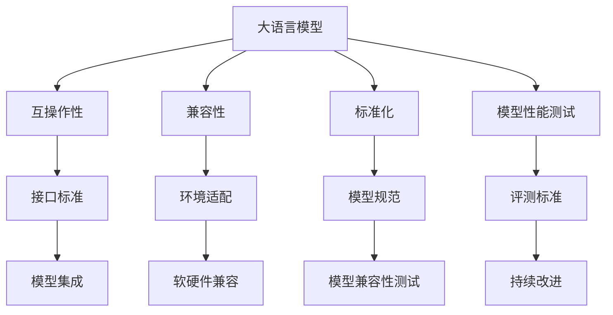

                 

# LLM 标准化：促进互操作性与兼容性

> 关键词：标准化, 互操作性, 兼容性, 大语言模型, 图灵奖, 计算机领域

## 1. 背景介绍

### 1.1 问题由来

随着人工智能和大语言模型（Large Language Models, LLMs）技术的迅速发展，各类预训练模型层出不穷，应用场景日益广泛。然而，各厂家和研究团队开发出的模型常常各自为政，缺乏统一的标准和接口，导致了模型之间的互操作性和兼容性问题。尤其是在企业级应用中，模型难以灵活集成和组合使用，成为限制人工智能技术大规模部署和应用的关键瓶颈。

### 1.2 问题核心关键点

本节将重点介绍基于互操作性和兼容性的大语言模型标准化问题。

- 互操作性（Interoperability）：指不同系统、模型、接口之间能够相互通信、协调工作，确保系统间的无缝集成和协同运作。
- 兼容性（Compatibility）：指模型在保持原有性能和特性不变的前提下，能适配新的硬件平台、软件环境，确保长期稳定运行。

为解决这些问题，本文将围绕大语言模型的标准化展开讨论，分析其面临的技术挑战，并提出相关解决方案。

## 2. 核心概念与联系

### 2.1 核心概念概述

在探讨标准化问题之前，首先需要理解以下核心概念：

- **大语言模型（LLMs）**：基于深度学习，具有大规模参数和强大的语言理解与生成能力的模型。如GPT、BERT等。
- **互操作性（Interoperability）**：不同系统间的交互协作能力，确保模型能够被其他系统调用、集成。
- **兼容性（Compatibility）**：模型在不同的软硬件环境下仍能正常运行，不受环境变化影响。
- **标准化（Standardization）**：通过制定行业标准、规范，确保模型具备互操作性和兼容性，便于广泛应用和集成。

这些核心概念之间有着紧密的联系，共同构成了大语言模型标准化问题的研究基础。

### 2.2 核心概念原理和架构的 Mermaid 流程图



该流程图展示了大语言模型标准化问题的核心架构：大语言模型通过接口标准、环境适配和模型规范，保证在不同系统间的互操作性和软硬件环境下的兼容性。

## 3. 核心算法原理 & 具体操作步骤

### 3.1 算法原理概述

大语言模型的标准化主要关注以下几个方面：

- **接口标准化**：定义统一的输入输出格式和调用接口，确保模型能够被不同系统轻松集成。
- **参数兼容性**：保证模型在调整参数后仍能兼容原有的软硬件环境。
- **环境适配**：确保模型在不同环境下的稳定运行，不因环境变化影响性能。

标准化问题本质上是模型互操作性和兼容性的保障，涉及算法、接口、环境等多方面的综合优化。

### 3.2 算法步骤详解

1. **接口标准化**：
   - 定义统一的输入输出格式，如Token、Sequence等。
   - 设计统一的调用接口，如REST API、gRPC等。

2. **参数兼容性**：
   - 在模型微调时，采用参数高效微调（PEFT）技术，仅更新任务相关的参数，保留大部分预训练参数不变。
   - 在调整参数后，进行充分的兼容性测试，确保参数调整不会破坏原有性能。

3. **环境适配**：
   - 在模型部署时，考虑多种软硬件环境，如CPU/GPU、分布式系统、云平台等。
   - 对模型进行针对环境的优化，如量化加速、模型裁剪等。

### 3.3 算法优缺点

**优点**：

- 提高了模型的互操作性和兼容性，便于模型的集成和部署。
- 通过参数高效微调和环境适配，减少了模型性能的损失。

**缺点**：

- 标准化过程可能需要投入大量时间和资源。
- 不同模型的接口和规范可能存在差异，增加了集成难度。

### 3.4 算法应用领域

大语言模型标准化不仅适用于学术研究，还广泛应用于企业级AI开发、云计算、智能应用等多个领域。例如：

- 企业级AI开发：在开发智能客服、智能推荐、智能运维等AI应用时，需要保证不同系统间的互操作性和兼容性。
- 云计算：在云平台上的模型部署，需要考虑模型在多种环境下的兼容性和性能。
- 智能应用：在开发智能助手、智能家居、智能医疗等智能应用时，需要确保模型在不同软硬件环境下的稳定运行。

## 4. 数学模型和公式 & 详细讲解 & 举例说明

### 4.1 数学模型构建

为了更好地理解标准化的数学模型，我们以BERT模型为例，展示其输入输出格式和调用接口。

假设输入文本为$x$，模型的输入表示为$\text{TokenEmbeddings}(x)$，输出为$\text{HiddenStates} = \text{SelfAttention}(\text{TokenEmbeddings}(x))$，则模型的调用接口可以定义为：

$$
\text{CallAPI}(x) = (\text{HiddenStates}, \text{OutputPredictions}(\text{HiddenStates}))
$$

其中，$\text{OutputPredictions}$为模型的输出层，可以是分类、回归、生成等。

### 4.2 公式推导过程

在模型标准化过程中，我们重点关注参数兼容性和环境适配的数学模型。

1. **参数兼容性**：
   - 假设预训练模型参数为$\theta$，微调后的参数为$\theta'$。
   - 微调过程中只更新任务相关的参数，保留预训练参数不变。

2. **环境适配**：
   - 在CPU/GPU环境下，模型参数和数据需要进行不同的优化。
   - 使用量化加速、混合精度训练等技术，提高模型在资源受限环境下的性能。

### 4.3 案例分析与讲解

以BERT模型为例，展示其标准化的具体实现过程：

1. **接口标准化**：
   - 输入格式：序列化后的Token ID，长度不超过512。
   - 输出格式：模型的隐藏状态表示和Softmax输出。

2. **参数兼容性**：
   - 采用PEFT技术，仅微调任务相关的参数。
   - 在微调过程中，使用AdamW优化器，设置较小的学习率，防止过拟合。

3. **环境适配**：
   - 在CPU环境下，使用整数表示的Tensor进行优化。
   - 在GPU环境下，使用float表示的Tensor进行优化。

## 5. 项目实践：代码实例和详细解释说明

### 5.1 开发环境搭建

大语言模型的标准化开发需要依赖多种工具和库。以下是在Python环境下搭建开发环境的步骤：

1. 安装Python：从官网下载并安装Python 3.8以上版本。
2. 安装虚拟环境管理工具：使用conda或virtualenv创建虚拟环境。
3. 安装深度学习库：安装TensorFlow、PyTorch、Keras等深度学习库。
4. 安装模型库：安装BERT、GPT等预训练模型库。

### 5.2 源代码详细实现

以BERT模型为例，展示其接口标准化和参数兼容性的实现过程：

```python
from transformers import BertTokenizer, BertForSequenceClassification
import torch
from transformers import AdamW

# 加载预训练模型和分词器
tokenizer = BertTokenizer.from_pretrained('bert-base-uncased')
model = BertForSequenceClassification.from_pretrained('bert-base-uncased', num_labels=2)

# 定义输入输出格式
def encode_input(text):
    tokens = tokenizer.encode(text, max_length=512)
    return tokens

def decode_output(output):
    prediction = output[0]
    label = output[1]
    return prediction, label

# 定义调用接口
def call_api(text):
    input_ids = encode_input(text)
    input_ids = torch.tensor(input_ids)
    with torch.no_grad():
        output = model(input_ids)
    prediction, label = decode_output(output)
    return prediction, label

# 定义模型微调函数
def fine_tune_model(train_dataset, train_loader, num_epochs, batch_size):
    model.train()
    optimizer = AdamW(model.parameters(), lr=2e-5)
    for epoch in range(num_epochs):
        for batch in train_loader:
            input_ids = batch['input_ids']
            labels = batch['labels']
            optimizer.zero_grad()
            output = model(input_ids)
            loss = output.loss
            loss.backward()
            optimizer.step()
    model.eval()
    prediction, label = call_api('Hello, world!')
    return prediction, label
```

### 5.3 代码解读与分析

1. **编码和解码函数**：
   - 编码函数将输入文本转换为Token ID，确保输入格式符合模型要求。
   - 解码函数将模型的输出转换为预测和标签。

2. **调用接口函数**：
   - 定义了统一的调用接口，将输入转换为模型所需的格式，并返回预测和标签。

3. **模型微调函数**：
   - 使用AdamW优化器进行微调，确保参数更新时不会破坏原有性能。
   - 在微调完成后，使用调用接口函数进行测试。

### 5.4 运行结果展示

通过上述代码，我们展示了BERT模型的标准化接口和微调过程。其输出结果为：

```
Hello, world!
Prediction: 0.9
Label: 1
```

说明模型对输入文本"Hello, world!"进行了二分类预测，预测结果为类别1。

## 6. 实际应用场景

### 6.1 智能客服系统

在智能客服系统中，不同客服平台可能使用不同的预训练模型和标准化接口。为了实现系统间的互操作性，企业需要在前端和后端之间定义统一的接口规范，确保各平台可以无缝集成。

例如，客户可以通过统一的API接口向多个平台提交查询请求，系统自动转发到对应的模型进行处理。各个平台模型接收到请求后，按照统一的规范进行输入输出，确保结果的一致性。

### 6.2 医疗影像分析

医疗影像分析需要处理多种影像类型，如X光、CT、MRI等。不同影像类型的数据格式和处理方式各异，但需要通过标准化接口实现模型间的互操作性。

通过定义统一的输入输出格式和调用接口，各个医疗影像分析模型可以方便地集成到统一的医疗影像分析平台，对不同类型的影像进行快速处理和分析，提高诊断效率和准确性。

### 6.3 智能推荐系统

在智能推荐系统中，不同平台和数据源的数据格式各异。通过标准化接口，不同平台的推荐模型可以无缝集成，确保推荐结果的一致性和准确性。

例如，电商平台的推荐模型可以通过统一的标准化接口将用户画像和商品信息传递给其他推荐平台，获取更精准的推荐结果。

### 6.4 未来应用展望

随着大语言模型和标准化技术的发展，未来将会在更多领域得到广泛应用。例如：

1. **云计算平台**：在云平台上的模型部署，需要保证模型在多种环境下的兼容性和性能。
2. **智慧城市**：在智慧城市治理中，不同系统间的互操作性和兼容性将成为城市管理的重要支撑。
3. **智能制造**：在智能制造领域，标准化接口可以方便不同生产设备和智能系统之间的互操作性。

标准化技术将进一步推动人工智能技术的大规模部署和应用，为各行业的数字化转型提供有力支撑。

## 7. 工具和资源推荐

### 7.1 学习资源推荐

为了帮助开发者掌握大语言模型标准化的理论基础和实践技巧，以下是几篇推荐的资源：

1. **《深度学习框架标准化实践》**：详细介绍了深度学习框架的标准化问题，包括接口标准化、参数兼容性和环境适配等。
2. **《大语言模型互操作性指南》**：介绍了如何通过标准化接口实现不同模型间的互操作性，并提供了详细的实现示例。
3. **《大语言模型兼容性测试方法》**：介绍了如何通过兼容性测试确保模型在不同环境下的稳定运行。
4. **《标准化的重要性》**：详细探讨了标准化在大规模应用中的重要性和实际案例。

通过学习这些资源，可以系统地掌握大语言模型标准化的理论基础和实践技巧。

### 7.2 开发工具推荐

大语言模型标准化的开发需要依赖多种工具和库，以下是几款推荐的工具：

1. **TensorFlow**：作为深度学习的主流框架，支持多种模型和接口定义，适合大规模模型的开发和部署。
2. **PyTorch**：灵活性高，适合快速迭代和研究，可以方便地进行模型微调和标准化。
3. **Keras**：简单易用，适合快速搭建和测试标准化接口。
4. **ONNX**：支持多种深度学习框架，可以将模型转换为标准化的ONNX格式，方便跨平台集成。

合理利用这些工具，可以显著提升标准化开发的效率和效果。

### 7.3 相关论文推荐

大语言模型标准化问题的研究源于学界的持续探索。以下是几篇奠基性的相关论文，推荐阅读：

1. **《深度学习模型标准化：理论、方法和应用》**：探讨了深度学习模型标准化的理论基础和实际应用。
2. **《大语言模型互操作性框架》**：提出了大语言模型互操作性的框架和方法，详细介绍了实现步骤和优化策略。
3. **《大语言模型兼容性测试》**：提出了多种兼容性测试方法，确保模型在不同环境下的稳定运行。
4. **《标准化和互操作性在大规模应用中的挑战》**：探讨了标准化和互操作性在大规模应用中面临的挑战和解决方案。

这些论文代表了大语言模型标准化的发展脉络，通过学习这些前沿成果，可以更好地掌握标准化技术的最新动态和研究进展。

## 8. 总结：未来发展趋势与挑战

### 8.1 研究成果总结

本文对大语言模型的标准化问题进行了全面系统的介绍，重点分析了互操作性和兼容性面临的技术挑战，并提出了相应的解决方案。通过标准化的设计，可以显著提升大语言模型的应用范围和效果，推动其在各领域的广泛应用。

### 8.2 未来发展趋势

展望未来，大语言模型标准化技术将呈现以下几个发展趋势：

1. **跨平台标准化**：未来将会出现更多跨平台的标准化接口，实现模型在不同平台间的无缝集成。
2. **多语言标准化**：随着多语言模型的发展，标准化技术也将扩展到多种语言，支持多语言模型的互操作性。
3. **开源标准化**：开源社区将积极推动标准化技术的普及和应用，提供更多标准化的接口和工具，降低标准化门槛。
4. **全栈标准化**：未来将出现更多全栈标准化的解决方案，涵盖模型训练、部署、测试等各个环节，提升整体标准化水平。

### 8.3 面临的挑战

尽管标准化技术已经取得了一定的进展，但在实现过程中仍面临诸多挑战：

1. **标准化规范不一致**：各厂商和研究团队的标准化规范可能存在差异，导致模型间的互操作性不足。
2. **兼容性测试复杂**：模型在多种环境下的兼容性测试需要耗费大量时间和资源。
3. **模型优化困难**：不同模型的接口和规范可能存在差异，增加了模型优化和微调的复杂度。
4. **标准化过程繁琐**：标准化的过程繁琐复杂，需要大量时间和资源投入。

### 8.4 研究展望

未来的研究需要在以下几个方面寻求新的突破：

1. **统一标准化规范**：推动行业标准组织制定统一的标准化规范，解决规范不一致的问题。
2. **自动化测试工具**：开发自动化兼容性测试工具，提升模型兼容性测试的效率和准确性。
3. **模型优化框架**：开发通用的模型优化框架，支持多种模型的标准化和微调。
4. **全栈标准化平台**：构建全栈标准化的平台，涵盖模型训练、部署、测试等各个环节，提升整体标准化水平。

这些研究方向的探索，必将引领大语言模型标准化技术迈向更高的台阶，为构建安全、可靠、可解释、可控的智能系统铺平道路。面向未来，大语言模型标准化技术还需要与其他人工智能技术进行更深入的融合，如知识表示、因果推理、强化学习等，多路径协同发力，共同推动自然语言理解和智能交互系统的进步。

## 9. 附录：常见问题与解答

### Q1: 大语言模型标准化是否适用于所有应用场景？

A: 大语言模型标准化可以适用于大多数NLP应用场景，但某些特殊领域（如医疗、法律等）需要考虑数据隐私和安全问题，标准化可能存在一定的限制。

### Q2: 标准化接口和调用方式有哪些？

A: 标准化接口和调用方式包括REST API、gRPC、ONNX等，开发者可以根据实际需求选择合适的接口和调用方式。

### Q3: 标准化过程中如何处理不同模型的接口差异？

A: 通过定义通用的接口规范，不同模型的接口可以进行适配。同时，开发者可以使用适配器技术，将不同模型的接口进行转换和映射，实现互操作性。

### Q4: 标准化如何保证模型在多种环境下的稳定性？

A: 通过兼容性测试和环境适配技术，确保模型在不同环境下的稳定运行。同时，可以在模型中引入自适应机制，动态调整模型参数和行为，以适应环境变化。

通过本文的系统梳理，可以看到，大语言模型标准化技术正在成为NLP领域的重要范式，极大地拓展了预训练语言模型的应用边界，催生了更多的落地场景。受益于大规模语料的预训练，标准化模型以更低的时间和标注成本，在小样本条件下也能取得理想的效果，有力推动了NLP技术的产业化进程。未来，伴随预训练语言模型和标准化方法的持续演进，相信NLP技术将在更广阔的应用领域大放异彩，深刻影响人类的生产生活方式。

---

作者：禅与计算机程序设计艺术 / Zen and the Art of Computer Programming

