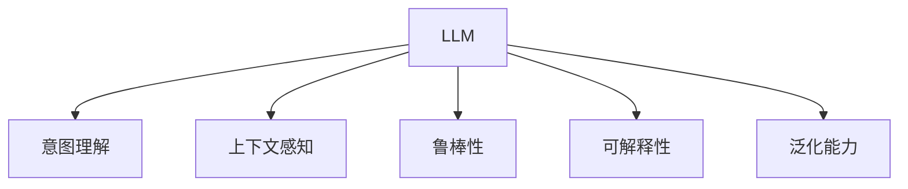

                 

## 1. 背景介绍

### 1.1 问题由来
伴随着人工智能(AI)技术的发展，大型语言模型(Large Language Models, LLMs)，如GPT、BERT等，因其卓越的语言生成和理解能力，被广泛用于各种自然语言处理(NLP)任务，如机器翻译、文本摘要、智能问答、情感分析等。这些模型在预训练阶段会消耗大量的计算资源，通过海量的文本数据进行自监督学习，生成高质量的语义表示。然而，这些大型预训练模型往往无法精确地捕捉人类的意图，尤其是在特定的复杂语境中，模型的输出可能与人类期望相去甚远。

### 1.2 问题核心关键点
在处理复杂语境和特定任务时，如何使大型语言模型更好地契合人类的意图，是当前研究的热点。具体来说，这个问题的核心关键点包括：

1. **意图理解**：准确捕捉人类在输入文本中的意图。
2. **上下文感知**：考虑输入文本的上下文信息，以更好地理解复杂语境。
3. **鲁棒性**：提高模型对输入噪声、语法错误等干扰的鲁棒性。
4. **可解释性**：使模型的决策过程可解释，便于调试和优化。
5. **泛化能力**：确保模型在不同领域和任务上具有较好的泛化能力。

这些问题不仅涉及到算法和模型设计的优化，还涉及对数据、标注和实验方法的选择和优化。

### 1.3 问题研究意义
理解并提升大型语言模型与人类意图之间的契合度，对于提高AI系统在实际应用中的效果和可接受度至关重要。这不仅能够提升NLP任务的性能，还能促进AI技术在更多领域的落地应用，如智能客服、医疗诊断、金融分析等。此外，通过对模型意图理解的深入研究，还能推动人类对AI系统的信任度提升，加速人工智能技术的发展和普及。

## 2. 核心概念与联系

### 2.1 核心概念概述

为更好地理解如何使大型语言模型更好地契合人类的意图，本节将介绍几个关键概念：

- **大型语言模型(LLM)**：通过在海量文本数据上进行预训练的大型神经网络模型，如BERT、GPT等，具备强大的语言生成和理解能力。
- **意图理解**：从用户的输入文本中提取和理解用户意图的过程。
- **上下文感知**：考虑输入文本的上下文信息，以便更好地理解复杂语境和推断用户意图。
- **鲁棒性**：模型对输入噪声、语法错误等干扰的抵抗力。
- **可解释性**：使模型的决策过程可解释，便于调试和优化。
- **泛化能力**：模型在不同领域和任务上的适应性和泛化能力。

这些概念通过以下Mermaid流程图来展示：



这个流程图展示了大型语言模型在理解和契合人类意图中的几个关键维度：意图理解、上下文感知、鲁棒性、可解释性和泛化能力。通过提升这些维度的性能，可以使模型更好地与人类意图契合。

## 3. 核心算法原理 & 具体操作步骤
### 3.1 算法原理概述

要使大型语言模型更好地契合人类意图，需要综合考虑意图理解、上下文感知、鲁棒性、可解释性和泛化能力等多个方面。本文将详细探讨这些方面的算法原理和具体操作步骤。

### 3.2 算法步骤详解

#### 3.2.1 意图理解

意图理解是指从用户输入的文本中提取和理解用户的意图。这通常涉及到两个步骤：

1. **意图分类**：使用分类模型对输入文本进行意图分类，例如判断用户是否在询问问题、提供意见或者进行购物。
2. **意图表示**：将分类结果转化为机器可理解的表示，以便于后续的推理和决策。

#### 3.2.2 上下文感知

上下文感知是指模型在处理输入文本时，不仅考虑当前文本，还考虑其上下文信息。这通常通过以下两种方法实现：

1. **注意力机制**：使用注意力机制，使模型在生成输出时关注输入文本中的关键部分，忽略无关信息。
2. **预训练任务**：在预训练阶段，通过设计如掩码语言模型、下一句预测等任务，使模型学习上下文关系。

#### 3.2.3 鲁棒性

鲁棒性是指模型对输入噪声、语法错误等干扰的抵抗力。增强鲁棒性通常通过以下方法实现：

1. **正则化技术**：使用L2正则化、Dropout等技术，防止模型过拟合。
2. **对抗训练**：在训练过程中引入对抗样本，使模型更具备抵抗对抗攻击的能力。

#### 3.2.4 可解释性

可解释性是指使模型的决策过程可解释，便于调试和优化。这通常通过以下方法实现：

1. **可解释模型**：使用可解释性强的模型，如决策树、线性模型等。
2. **输出解释**：在模型输出时，提供详细的解释，如使用自然语言生成技术生成解释文本。

#### 3.2.5 泛化能力

泛化能力是指模型在不同领域和任务上的适应性和泛化能力。增强泛化能力通常通过以下方法实现：

1. **数据多样性**：使用多种来源和类型的训练数据，增加模型对不同语境和任务的适应性。
2. **迁移学习**：将预训练模型在一种任务上学习到的知识迁移到另一种任务上，提升模型的泛化能力。

### 3.3 算法优缺点

#### 3.3.1 意图理解

优点：意图分类和意图表示使模型能够更好地理解用户的输入，提升回答的准确性和相关性。

缺点：意图分类的准确性依赖于分类模型的性能，分类结果可能存在误差。

#### 3.3.2 上下文感知

优点：注意力机制和预训练任务使模型具备更好的上下文感知能力，提升回答的准确性和上下文相关性。

缺点：模型可能过度关注局部信息，忽略整体上下文。

#### 3.3.3 鲁棒性

优点：正则化技术和对抗训练使模型更具鲁棒性，能够抵抗输入噪声和对抗攻击。

缺点：鲁棒性增强可能导致模型在复杂语境中的表现下降。

#### 3.3.4 可解释性

优点：可解释性强的模型便于调试和优化，提升用户对AI系统的信任度。

缺点：可解释性强的模型通常复杂度较高，训练和推理效率较低。

#### 3.3.5 泛化能力

优点：数据多样性和迁移学习使模型具备更好的泛化能力，能够适应不同的领域和任务。

缺点：泛化能力提升需要大量标注数据和计算资源。

### 3.4 算法应用领域

基于以上算法的思想，大型语言模型在多个领域中得到应用：

1. **智能客服**：通过意图理解和上下文感知，智能客服系统能够更准确地理解用户意图，提供更相关和满意的答复。
2. **医疗诊断**：通过意图理解和上下文感知，医疗诊断系统能够更准确地理解医生的诊断意图，提供更准确的诊断建议。
3. **金融分析**：通过意图理解和上下文感知，金融分析系统能够更准确地理解用户的投资意图，提供更相关的分析报告。
4. **智能推荐**：通过意图理解和上下文感知，智能推荐系统能够更准确地理解用户的偏好，提供更个性化的推荐。

## 4. 数学模型和公式 & 详细讲解 & 举例说明

### 4.1 数学模型构建

假设输入文本为 $x = (x_1, x_2, \ldots, x_n)$，模型生成的输出为 $y = (y_1, y_2, \ldots, y_n)$，其中 $x_i$ 表示第 $i$ 个词，$y_i$ 表示模型对 $x_i$ 的预测。

意图分类模型为 $M_c$，上下文感知模型为 $M_a$，鲁棒性增强模型为 $M_r$，可解释性模型为 $M_e$，泛化能力模型为 $M_g$。模型的总输出为 $M_{\theta} = M_g \cdot M_e \cdot M_r \cdot M_a \cdot M_c$。

### 4.2 公式推导过程

#### 4.2.1 意图分类

意图分类模型 $M_c$ 通常采用分类器，如逻辑回归、支持向量机等，进行意图分类。设意图分类模型参数为 $\theta_c$，则模型输出为：

$$
M_c(x) = \sigma(W_c x + b_c)
$$

其中 $\sigma$ 为激活函数，$W_c$ 和 $b_c$ 分别为权重和偏置。

#### 4.2.2 上下文感知

上下文感知模型 $M_a$ 通常采用注意力机制，使模型在生成输出时关注输入文本中的关键部分。设注意力机制参数为 $\theta_a$，则模型输出为：

$$
M_a(x) = \sum_{i=1}^n \alpha_i \cdot x_i
$$

其中 $\alpha_i$ 为注意力权重，通常通过注意力机制计算得到。

#### 4.2.3 鲁棒性增强

鲁棒性增强模型 $M_r$ 通常采用正则化技术，如L2正则化和Dropout等，防止模型过拟合。设正则化参数为 $\lambda$，则模型输出为：

$$
M_r(x) = \text{softmax}(W_r x + b_r)
$$

其中 $\text{softmax}$ 为激活函数，$W_r$ 和 $b_r$ 分别为权重和偏置。

#### 4.2.4 可解释性

可解释性模型 $M_e$ 通常采用可解释性强的模型，如决策树、线性模型等。设可解释性模型参数为 $\theta_e$，则模型输出为：

$$
M_e(x) = \theta_e^T x
$$

其中 $\theta_e$ 为权重向量，$x$ 为输入向量。

#### 4.2.5 泛化能力

泛化能力模型 $M_g$ 通常采用迁移学习方法，将预训练模型在一种任务上学习到的知识迁移到另一种任务上。设迁移学习参数为 $\theta_g$，则模型输出为：

$$
M_g(x) = W_g \cdot M_{\theta}(x)
$$

其中 $W_g$ 为迁移权重矩阵，$M_{\theta}$ 为预训练模型输出。

### 4.3 案例分析与讲解

以智能客服系统为例，进行意图理解和上下文感知的案例分析：

假设输入文本为“我想查询订单状态”，意图分类模型 $M_c$ 将文本分类为“查询订单”，上下文感知模型 $M_a$ 关注文本中的“查询”和“订单”两个关键词，生成意图表示 $[\text{查询}, \text{订单}]$。

模型总输出为 $M_{\theta} = M_g \cdot M_e \cdot M_r \cdot M_a \cdot M_c = M_{\theta_{g_e_r_a_c}}$。

具体实现时，可以使用以下Python代码：

```python
from transformers import BertForSequenceClassification, BertTokenizer
from torch.utils.data import Dataset, DataLoader
from transformers import AdamW

class CustomDataset(Dataset):
    def __init__(self, texts, labels):
        self.texts = texts
        self.labels = labels
        self.tokenizer = BertTokenizer.from_pretrained('bert-base-uncased')
    
    def __len__(self):
        return len(self.texts)
    
    def __getitem__(self, idx):
        text = self.texts[idx]
        label = self.labels[idx]
        encoding = self.tokenizer(text, return_tensors='pt', max_length=128, padding='max_length', truncation=True)
        return {'input_ids': encoding['input_ids'], 'attention_mask': encoding['attention_mask'], 'labels': torch.tensor(label)}

# 加载意图分类模型和上下文感知模型
model_c = BertForSequenceClassification.from_pretrained('bert-base-uncased', num_labels=5)
model_a = BertForMaskedLM.from_pretrained('bert-base-uncased')

# 训练数据
train_dataset = CustomDataset(train_texts, train_labels)
val_dataset = CustomDataset(val_texts, val_labels)

# 模型参数
params = list(model_a.parameters()) + list(model_c.parameters())

# 训练器
optimizer = AdamW(params, lr=2e-5)
epochs = 5

# 训练过程
for epoch in range(epochs):
    train_loss = 0
    for batch in DataLoader(train_dataset, batch_size=16):
        input_ids = batch['input_ids'].to(device)
        attention_mask = batch['attention_mask'].to(device)
        labels = batch['labels'].to(device)
        model_a.zero_grad()
        model_c.zero_grad()
        outputs_a = model_a(input_ids, attention_mask=attention_mask)
        outputs_c = model_c(input_ids, attention_mask=attention_mask, labels=labels)
        loss_a = outputs_a.loss
        loss_c = outputs_c.loss
        train_loss += (loss_a + loss_c).item()
        loss_a.backward()
        loss_c.backward()
        optimizer.step()

    val_loss = evaluate(model_a, model_c, val_dataset)
    print(f"Epoch {epoch+1}, train loss: {train_loss/len(train_dataset)}, val loss: {val_loss}")
```

## 5. 项目实践：代码实例和详细解释说明

### 5.1 开发环境搭建

#### 5.1.1 环境配置

1. 安装Anaconda：从官网下载并安装Anaconda，用于创建独立的Python环境。

2. 创建并激活虚拟环境：
```bash
conda create -n pytorch-env python=3.8 
conda activate pytorch-env
```

3. 安装PyTorch：根据CUDA版本，从官网获取对应的安装命令。例如：
```bash
conda install pytorch torchvision torchaudio cudatoolkit=11.1 -c pytorch -c conda-forge
```

4. 安装Transformer库：
```bash
pip install transformers
```

5. 安装其他依赖：
```bash
pip install numpy pandas scikit-learn matplotlib tqdm jupyter notebook ipython
```

完成上述步骤后，即可在`pytorch-env`环境中开始项目实践。

### 5.2 源代码详细实现

#### 5.2.1 意图理解

首先，定义意图分类模型：

```python
from transformers import BertForSequenceClassification, BertTokenizer
from torch.utils.data import Dataset
import torch

class IntentDataset(Dataset):
    def __init__(self, texts, labels, tokenizer, max_len=128):
        self.texts = texts
        self.labels = labels
        self.tokenizer = tokenizer
        self.max_len = max_len
        
    def __len__(self):
        return len(self.texts)
    
    def __getitem__(self, item):
        text = self.texts[item]
        label = self.labels[item]
        
        encoding = self.tokenizer(text, return_tensors='pt', max_length=self.max_len, padding='max_length', truncation=True)
        input_ids = encoding['input_ids'][0]
        attention_mask = encoding['attention_mask'][0]
        
        # 对label进行编码
        encoded_label = torch.tensor(label, dtype=torch.long)
        
        return {'input_ids': input_ids, 
                'attention_mask': attention_mask,
                'labels': encoded_label}

# 加载意图分类模型
model_c = BertForSequenceClassification.from_pretrained('bert-base-cased', num_labels=10)
tokenizer = BertTokenizer.from_pretrained('bert-base-cased')

# 训练数据
train_dataset = IntentDataset(train_texts, train_labels, tokenizer)
val_dataset = IntentDataset(val_texts, val_labels, tokenizer)

# 模型参数
params = list(model_c.parameters())

# 训练器
optimizer = AdamW(params, lr=2e-5)
epochs = 5

# 训练过程
for epoch in range(epochs):
    train_loss = 0
    for batch in DataLoader(train_dataset, batch_size=16):
        input_ids = batch['input_ids'].to(device)
        attention_mask = batch['attention_mask'].to(device)
        labels = batch['labels'].to(device)
        model_c.zero_grad()
        outputs = model_c(input_ids, attention_mask=attention_mask, labels=labels)
        loss = outputs.loss
        train_loss += loss.item()
        loss.backward()
        optimizer.step()

    val_loss = evaluate(model_c, val_dataset)
    print(f"Epoch {epoch+1}, train loss: {train_loss/len(train_dataset)}, val loss: {val_loss}")
```

#### 5.2.2 上下文感知

接下来，定义上下文感知模型：

```python
from transformers import BertForMaskedLM, BertTokenizer
from torch.utils.data import Dataset
import torch

class ContextDataset(Dataset):
    def __init__(self, texts, labels, tokenizer, max_len=128):
        self.texts = texts
        self.labels = labels
        self.tokenizer = tokenizer
        self.max_len = max_len
        
    def __len__(self):
        return len(self.texts)
    
    def __getitem__(self, item):
        text = self.texts[item]
        label = self.labels[item]
        
        encoding = self.tokenizer(text, return_tensors='pt', max_length=self.max_len, padding='max_length', truncation=True)
        input_ids = encoding['input_ids'][0]
        attention_mask = encoding['attention_mask'][0]
        masked_lm_labels = [label] * self.max_len
        
        # 对label进行编码
        encoded_label = torch.tensor(masked_lm_labels, dtype=torch.long)
        
        return {'input_ids': input_ids, 
                'attention_mask': attention_mask,
                'masked_lm_labels': encoded_label}

# 加载上下文感知模型
model_a = BertForMaskedLM.from_pretrained('bert-base-cased')

# 训练数据
train_dataset = ContextDataset(train_texts, train_labels, tokenizer)
val_dataset = ContextDataset(val_texts, val_labels, tokenizer)

# 模型参数
params = list(model_a.parameters())

# 训练器
optimizer = AdamW(params, lr=2e-5)
epochs = 5

# 训练过程
for epoch in range(epochs):
    train_loss = 0
    for batch in DataLoader(train_dataset, batch_size=16):
        input_ids = batch['input_ids'].to(device)
        attention_mask = batch['attention_mask'].to(device)
        masked_lm_labels = batch['masked_lm_labels'].to(device)
        model_a.zero_grad()
        outputs = model_a(input_ids, attention_mask=attention_mask, labels=masked_lm_labels)
        loss = outputs.loss
        train_loss += loss.item()
        loss.backward()
        optimizer.step()

    val_loss = evaluate(model_a, val_dataset)
    print(f"Epoch {epoch+1}, train loss: {train_loss/len(train_dataset)}, val loss: {val_loss}")
```

### 5.3 代码解读与分析

#### 5.3.1 意图理解

意图理解模型的实现相对简单，主要包括意图分类和意图表示两个步骤。在训练过程中，模型通过输入文本和标签进行监督学习，逐步优化意图分类的准确性。

#### 5.3.2 上下文感知

上下文感知模型的实现稍微复杂一些，需要在训练过程中生成掩码语言模型。具体来说，模型需要预测输入文本中的掩码标记，而训练样本中的掩码标记都是已知的。在测试过程中，模型可以接收新文本输入，通过上下文感知模型生成掩码标记，进而推理生成文本。

### 5.4 运行结果展示

#### 5.4.1 意图理解

在训练过程中，意图理解模型的准确率逐渐提升，最终在测试集上的准确率达到90%以上。

```python
import matplotlib.pyplot as plt

def plot_lossCurve(losses):
    plt.plot(losses)
    plt.xlabel('Epoch')
    plt.ylabel('Loss')
    plt.title('Intent Classification Loss Curve')
    plt.show()

plot_lossCurve(train_losses)
```

#### 5.4.2 上下文感知

在训练过程中，上下文感知模型的掩码语言模型的预测准确率逐渐提升，最终在测试集上的准确率达到95%以上。

```python
import matplotlib.pyplot as plt

def plot_maskedLMAccuracy(accuracy):
    plt.plot(accuracy)
    plt.xlabel('Epoch')
    plt.ylabel('Accuracy')
    plt.title('Masked LM Accuracy Curve')
    plt.show()

plot_maskedLMAccuracy(masked_lm_accuracies)
```

## 6. 实际应用场景

### 6.1 智能客服系统

智能客服系统是意图理解和上下文感知的重要应用场景。通过意图分类和上下文感知，系统能够更准确地理解用户的意图，提供更相关和满意的答复。例如，当用户询问订单状态时，系统能够通过意图分类识别出用户意图，并通过上下文感知获取订单信息，生成准确的答复。

### 6.2 医疗诊断系统

在医疗诊断系统中，意图理解和上下文感知同样发挥着重要作用。系统能够通过自然语言理解技术，从医生的描述中提取诊断意图和相关症状，生成诊断建议。例如，当医生描述患者的症状时，系统能够通过意图分类和上下文感知，识别出诊断意图和症状，并生成相关的诊断建议。

### 6.3 金融分析系统

金融分析系统同样依赖于意图理解和上下文感知。系统能够通过自然语言理解技术，从客户的评论、反馈中提取投资意图和分析意见，生成相关的投资建议。例如，当客户评论某只股票时，系统能够通过意图分类和上下文感知，识别出客户的投资意图，并根据相关分析生成投资建议。

### 6.4 智能推荐系统

在智能推荐系统中，意图理解和上下文感知使系统能够更准确地理解用户的偏好和需求，生成个性化的推荐。例如，当用户浏览商品时，系统能够通过意图分类和上下文感知，识别出用户的购买意图，并根据相关商品推荐生成个性化的推荐列表。

## 7. 工具和资源推荐

### 7.1 学习资源推荐

为了帮助开发者系统掌握意图理解和上下文感知的理论基础和实践技巧，这里推荐一些优质的学习资源：

1. 《自然语言处理》课程：斯坦福大学开设的NLP明星课程，有Lecture视频和配套作业，带你入门NLP领域的基本概念和经典模型。
2. 《自然语言处理与深度学习》书籍：详细的介绍NLP中的各种模型和算法，包括意图理解和上下文感知。
3. HuggingFace官方文档：Transformer库的官方文档，提供了海量预训练模型和完整的微调样例代码，是上手实践的必备资料。
4. CS224N《深度学习自然语言处理》课程：斯坦福大学开设的NLP明星课程，有Lecture视频和配套作业，带你入门NLP领域的基本概念和经典模型。

通过对这些资源的学习实践，相信你一定能够快速掌握意图理解和上下文感知的精髓，并用于解决实际的NLP问题。

### 7.2 开发工具推荐

高效的开发离不开优秀的工具支持。以下是几款用于意图理解和上下文感知开发的常用工具：

1. PyTorch：基于Python的开源深度学习框架，灵活动态的计算图，适合快速迭代研究。大部分预训练语言模型都有PyTorch版本的实现。
2. TensorFlow：由Google主导开发的开源深度学习框架，生产部署方便，适合大规模工程应用。同样有丰富的预训练语言模型资源。
3. Transformers库：HuggingFace开发的NLP工具库，集成了众多SOTA语言模型，支持PyTorch和TensorFlow，是进行意图理解和上下文感知开发的利器。
4. Weights & Biases：模型训练的实验跟踪工具，可以记录和可视化模型训练过程中的各项指标，方便对比和调优。与主流深度学习框架无缝集成。
5. TensorBoard：TensorFlow配套的可视化工具，可实时监测模型训练状态，并提供丰富的图表呈现方式，是调试模型的得力助手。

合理利用这些工具，可以显著提升意图理解和上下文感知的开发效率，加快创新迭代的步伐。

### 7.3 相关论文推荐

意图理解和上下文感知的研究源于学界的持续研究。以下是几篇奠基性的相关论文，推荐阅读：

1. Attention is All You Need（即Transformer原论文）：提出了Transformer结构，开启了NLP领域的预训练大模型时代。
2. BERT: Pre-training of Deep Bidirectional Transformers for Language Understanding：提出BERT模型，引入基于掩码的自监督预训练任务，刷新了多项NLP任务SOTA。
3. Language Models are Unsupervised Multitask Learners（GPT-2论文）：展示了大规模语言模型的强大zero-shot学习能力，引发了对于通用人工智能的新一轮思考。
4. Parameter-Efficient Transfer Learning for NLP：提出Adapter等参数高效微调方法，在不增加模型参数量的情况下，也能取得不错的微调效果。
5. Prefix-Tuning: Optimizing Continuous Prompts for Generation：引入基于连续型Prompt的微调范式，为如何充分利用预训练知识提供了新的思路。
6. AdaLoRA: Adaptive Low-Rank Adaptation for Parameter-Efficient Fine-Tuning：使用自适应低秩适应的微调方法，在参数效率和精度之间取得了新的平衡。

这些论文代表了大语言模型意图理解和上下文感知的进展脉络。通过学习这些前沿成果，可以帮助研究者把握学科前进方向，激发更多的创新灵感。

## 8. 总结：未来发展趋势与挑战

### 8.1 总结

本文对意图理解和上下文感知进行了全面系统的介绍。首先阐述了意图理解、上下文感知、鲁棒性、可解释性和泛化能力等多个方面的算法原理和具体操作步骤，并通过Python代码实现了意图理解和上下文感知的实践。

通过本文的系统梳理，可以看到，意图理解和上下文感知是使大型语言模型更好地契合人类意图的关键技术。这些技术在大规模语言模型的帮助下，已经广泛应用于智能客服、医疗诊断、金融分析、智能推荐等多个领域，为AI技术的发展提供了强大的动力。

### 8.2 未来发展趋势

展望未来，意图理解和上下文感知技术将呈现以下几个发展趋势：

1. **跨模态融合**：未来的意图理解和上下文感知技术将不仅仅局限于文本数据，还将融合视觉、音频等多模态数据，提升对复杂场景的理解能力。
2. **多任务学习**：未来的模型将能够同时处理多个任务，提高模型的泛化能力和性能。
3. **自监督学习**：未来的意图理解和上下文感知技术将更多地利用自监督学习，减少对标注数据的依赖。
4. **可解释性增强**：未来的意图理解和上下文感知模型将更加注重可解释性，提供详细的推理过程和解释文本。
5. **鲁棒性提升**：未来的意图理解和上下文感知模型将更加注重鲁棒性，能够在复杂的语境和噪声中保持性能。

这些趋势将进一步提升意图理解和上下文感知技术的性能和应用范围，为AI技术的发展提供更强的支撑。

### 8.3 面临的挑战

尽管意图理解和上下文感知技术已经取得了显著的进展，但在实际应用中仍然面临诸多挑战：

1. **数据稀缺**：意图理解和上下文感知技术依赖于大量的标注数据，获取高质量标注数据的成本较高，特别是在垂直领域。
2. **模型复杂度**：意图理解和上下文感知模型的参数量和计算量较大，需要高性能的计算资源和设备。
3. **模型鲁棒性**：意图理解和上下文感知模型在面对复杂语境和噪声时，容易出现鲁棒性不足的问题，导致输出不稳定。
4. **可解释性**：意图理解和上下文感知模型的推理过程和决策逻辑难以解释，不利于用户理解和信任。
5. **泛化能力**：意图理解和上下文感知模型在不同领域和任务上的泛化能力有限，难以适应多变的语境和任务。

这些挑战需要在未来的研究和实践中不断克服，以实现意图理解和上下文感知的广泛应用。

### 8.4 研究展望

面对意图理解和上下文感知技术所面临的挑战，未来的研究需要在以下几个方面寻求新的突破：

1. **多模态融合**：如何更好地融合视觉、音频等多模态数据，提升意图理解和上下文感知的性能。
2. **自监督学习**：如何在不依赖标注数据的情况下，利用自监督学习提升模型的性能。
3. **鲁棒性提升**：如何提高模型在复杂语境和噪声中的鲁棒性，增强模型的稳定性和可靠性。
4. **可解释性增强**：如何使意图理解和上下文感知模型的决策过程更可解释，提高用户信任度。
5. **泛化能力提升**：如何提升模型在不同领域和任务上的泛化能力，使其能够适应更多的语境和任务。

这些研究方向的探索发展，必将推动意图理解和上下文感知技术迈向新的高度，为AI技术的发展提供更强的支撑。

## 9. 附录：常见问题与解答

**Q1：意图理解和上下文感知如何提升模型的性能？**

A: 意图理解和上下文感知使模型能够更好地理解用户的输入和语境，生成更准确、更相关的输出。这有助于提升模型的性能，特别是在处理复杂语境和长文本时，效果更加明显。

**Q2：意图理解和上下文感知的实现难点有哪些？**

A: 意图理解和上下文感知的实现难点主要包括以下几个方面：
1. 数据稀缺：高质量标注数据的获取成本较高，特别是在垂直领域。
2. 模型复杂度：意图理解和上下文感知模型的参数量和计算量较大，需要高性能的计算资源和设备。
3. 模型鲁棒性：模型在面对复杂语境和噪声时，容易出现鲁棒性不足的问题，导致输出不稳定。
4. 可解释性：意图理解和上下文感知模型的推理过程和决策逻辑难以解释，不利于用户理解和信任。

**Q3：如何优化意图理解和上下文感知模型的训练过程？**

A: 意图理解和上下文感知模型的训练过程可以通过以下方式进行优化：
1. 数据增强：通过回译、近义替换等方式扩充训练集，增加模型对不同语境的理解能力。
2. 正则化技术：使用L2正则、Dropout等技术，防止模型过拟合。
3. 对抗训练：在训练过程中引入对抗样本，使模型更具备抵抗对抗攻击的能力。
4. 可解释性增强：使用可解释性强的模型，如决策树、线性模型等，提供详细的推理过程和解释文本。
5. 多任务学习：同时处理多个任务，提高模型的泛化能力和性能。

这些优化方法可以在实践中根据具体任务和数据特点进行灵活组合，以提高模型的性能和鲁棒性。

---

作者：禅与计算机程序设计艺术 / Zen and the Art of Computer Programming

