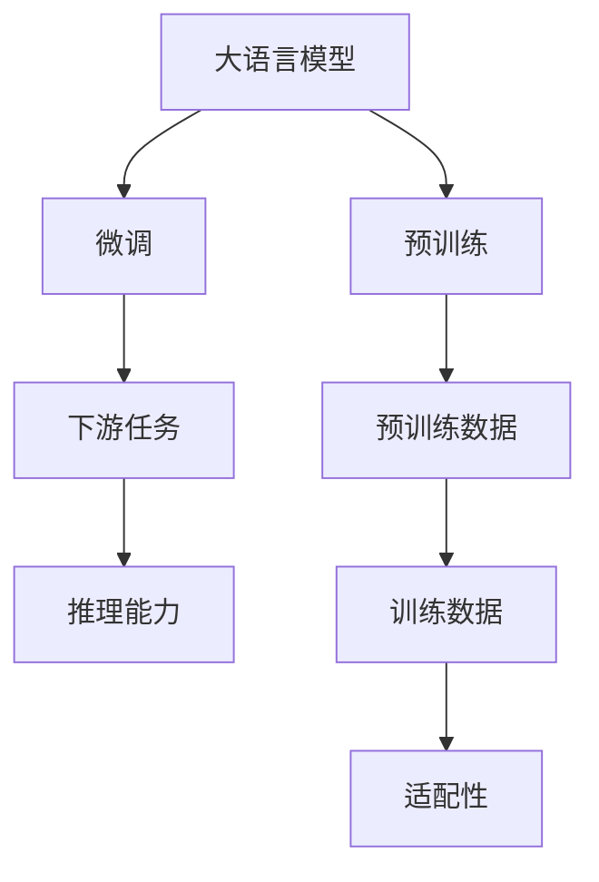

                 

# LLM与传统自然语言推理的比较

> 关键词：大语言模型,自然语言推理,NLP,预训练模型,下游任务,模型对比,语言推理,深度学习,传统NLP

## 1. 背景介绍

### 1.1 问题由来
近年来，深度学习技术在自然语言处理（NLP）领域取得了显著进展，其中大语言模型（Large Language Models, LLMs）尤为引人注目。大语言模型通过在大规模无标签文本数据上进行预训练，学习到丰富的语言知识，具备强大的语言理解与生成能力。相比传统的基于规则和统计的语言处理技术，大语言模型在许多NLP任务上展现出了更高的性能和更强的泛化能力。

然而，大语言模型并不是万能的，它在某些特定任务上的性能表现仍需进一步优化。传统自然语言推理（Natural Language Inference, NLI）任务，即判断一个自然语言陈述（前提）是否蕴含、矛盾或中立于另一个自然语言陈述（假设），是一个典型且重要的NLP任务。NLI模型通常用于问答系统、自动摘要、知识图谱构建等场景，具有广泛的应用前景。大语言模型在NLI任务上的表现如何？其与传统的基于规则和统计的NLI模型相比有何优劣？本文将对此进行详细比较。

### 1.2 问题核心关键点
本文将从以下几个关键点进行比较：
1. **模型结构**：比较大语言模型与传统NLI模型的结构差异。
2. **训练数据**：分析预训练数据与NLI任务的适配性。
3. **推理能力**：评估大语言模型在推理方面的优势与不足。
4. **应用场景**：探讨两种模型在不同NLP应用场景中的适用性。

## 2. 核心概念与联系

### 2.1 核心概念概述

- **大语言模型**（Large Language Models, LLMs）：以Transformer架构为代表，基于自监督学习任务（如语言建模）预训练的大型语言模型。如GPT、BERT、T5等。
- **自然语言推理**（Natural Language Inference, NLI）：判断前提和假设之间逻辑关系（蕴含、矛盾、中立）的NLP任务。
- **预训练模型**（Pre-trained Models）：在大规模无标签文本数据上预训练，学习通用语言表示的模型。
- **下游任务**（Fine-tuning）：在预训练模型基础上，使用少量有标签数据对模型进行微调，以适应特定任务。
- **模型对比**（Model Comparison）：通过评估不同模型在特定任务上的性能，比较其优劣。

### 2.2 核心概念原理和架构的 Mermaid 流程图



## 3. 核心算法原理 & 具体操作步骤
### 3.1 算法原理概述

大语言模型与传统NLI模型的核心差异在于其预训练方式和结构设计。大语言模型通过大规模自监督学习任务预训练，学习到丰富的语言知识，具备强大的语言生成能力。而传统NLI模型则侧重于逻辑推理能力的训练，通常在特定领域数据上进行监督学习。

在大语言模型的预训练阶段，通常会使用诸如语言建模、掩码语言建模等自监督任务，使得模型学习到语言的隐含结构。在微调阶段，针对特定下游任务（如NLI），模型会通过有监督学习进一步优化，以适应任务需求。

传统NLI模型则通过特定训练集上的监督学习进行训练。常见的NLI训练集包括GLUE、CoNLL等，模型结构通常基于逻辑推理单元（如最大熵模型、神经网络等）设计，强调对前提和假设之间逻辑关系的建模。

### 3.2 算法步骤详解

**大语言模型的预训练与微调：**

1. **预训练**：使用大规模无标签文本数据，如Pile、BigQuery等，进行自监督学习。预训练任务包括语言建模、掩码语言建模、下一句预测等，目的是学习语言的隐含结构和统计特征。
2. **微调**：针对特定下游任务，使用少量有标签数据对模型进行微调。微调过程中，通常保留预训练层不变，仅更新任务相关层，以避免过拟合。微调的目标是提升模型在特定任务上的推理能力。

**传统NLI模型的训练：**

1. **数据准备**：选择特定的NLI训练集，如GLUE、CoNLL等，将训练数据划分为前提和假设。
2. **模型选择**：选择适当的模型架构，如最大熵模型、神经网络模型等。
3. **模型训练**：使用训练集进行监督学习，通过最大化逻辑推理准确率等损失函数进行模型优化。
4. **模型评估**：使用验证集和测试集评估模型性能，通常采用精确度、召回率、F1值等指标。

### 3.3 算法优缺点

**大语言模型优点：**

1. **泛化能力强**：通过大规模无标签数据的预训练，大语言模型具备更强的泛化能力，能够适应各种NLP任务。
2. **推理能力强大**：具备强大的语言生成和理解能力，能够处理复杂的推理任务。
3. **可扩展性好**：模型参数量大，可以不断添加新的参数，提升模型性能。

**大语言模型缺点：**

1. **训练成本高**：需要大量计算资源进行预训练，且预训练数据集难以获得。
2. **推理速度慢**：由于模型参数量大，推理速度较慢，难以满足实时性要求。
3. **依赖高质量数据**：微调效果依赖于标注数据的质量和数量，标注成本较高。

**传统NLI模型优点：**

1. **推理能力精准**：针对特定NLI任务进行优化，推理能力较强，能够准确判断前提和假设之间的关系。
2. **训练数据集丰富**：通常使用特定的NLI训练集，数据集规模较大，推理效果稳定。
3. **推理速度较快**：模型结构简单，推理速度快，适合实时应用。

**传统NLI模型缺点：**

1. **泛化能力有限**：由于依赖特定领域数据，模型泛化能力较弱，难以应对新领域任务。
2. **推理范围受限**：推理能力仅限于逻辑关系判断，对语言理解深度有限。
3. **模型可扩展性差**：模型结构固定，难以通过增加参数提升性能。

### 3.4 算法应用领域

**大语言模型应用领域：**

1. **通用NLP任务**：如语言生成、机器翻译、问答系统等。
2. **特定领域任务**：如法律文书分析、医疗病历分析等。
3. **跨领域应用**：如跨语言知识图谱构建、跨模态推理等。

**传统NLI模型应用领域：**

1. **NLI任务**：如判断新闻、文档、对话中的逻辑关系。
2. **问答系统**：在问答系统中，用于判断用户问题的逻辑结构和答案的相关性。
3. **自动摘要**：在自动摘要中，用于判断摘要与原始文本的逻辑一致性。

## 4. 数学模型和公式 & 详细讲解 & 举例说明
### 4.1 数学模型构建

大语言模型和传统NLI模型的数学模型构建如下：

**大语言模型：**

大语言模型的数学模型通常基于Transformer架构，使用自监督学习任务进行预训练。预训练任务包括语言建模、掩码语言建模等。

- 语言建模：模型输入为文本序列 $x=(x_1, x_2, ..., x_n)$，输出为每个单词的概率分布 $p(x)$。

$$
p(x) = \prod_{i=1}^{n} p(x_i|x_{<i})
$$

- 掩码语言建模：模型输入为部分被掩码的文本序列 $m=(m_1, m_2, ..., m_n)$，输出为被掩码位置的单词概率分布 $p(m)$。

$$
p(m) = \prod_{i=1}^{n} p(m_i|m_{<i}, m_{>i})
$$

**传统NLI模型：**

传统NLI模型的数学模型通常基于逻辑推理单元，使用监督学习任务进行训练。NLI任务的输入为前提和假设，输出为逻辑关系标签（蕴含、矛盾、中立）。

- 最大熵模型：模型的输出为前提和假设之间的逻辑关系概率。

$$
P(h|p, h) = \frac{exp(f(p, h))}{\sum_{h' \in \{蕴含, 矛盾, 中立\}} exp(f(p, h'))}
$$

其中 $f(p, h)$ 为特征函数，$p$ 为前提，$h$ 为假设。

### 4.2 公式推导过程

**大语言模型的推理过程：**

1. **预训练阶段**：使用大规模无标签文本数据进行自监督学习，学习语言的隐含结构和统计特征。

2. **微调阶段**：针对特定下游任务进行微调，优化模型推理能力。

- 使用有标签数据集进行微调，目标函数为损失函数 $\mathcal{L}$：

$$
\mathcal{L} = -\sum_{i=1}^{N} \log p(y_i|x_i, \theta)
$$

其中 $N$ 为数据集大小，$\theta$ 为模型参数，$y_i$ 为数据集中的标签，$p(y_i|x_i, \theta)$ 为模型对标签的预测概率。

**传统NLI模型的推理过程：**

1. **数据准备**：选择特定的NLI训练集，如GLUE、CoNLL等。

2. **模型训练**：使用监督学习，最大化逻辑推理准确率等损失函数。

- 使用交叉熵损失函数：

$$
\mathcal{L} = -\sum_{i=1}^{N} \log p(y_i|p_i, h_i)
$$

其中 $N$ 为数据集大小，$y_i$ 为逻辑关系标签，$p_i$ 为前提，$h_i$ 为假设，$p(y_i|p_i, h_i)$ 为模型对逻辑关系的预测概率。

### 4.3 案例分析与讲解

以BERT模型为例，分析其在NLI任务上的表现。BERT模型通过大规模预训练，学习到丰富的语言知识，具备强大的语言理解能力。在NLI任务中，BERT模型通常使用掩码语言建模进行预训练，微调时通常只更新顶层分类器。

**BERT模型的推理过程：**

1. **预训练阶段**：使用掩码语言建模对BERT进行预训练，学习语言的结构和统计特征。

2. **微调阶段**：使用NLI任务的数据集进行微调，优化模型的推理能力。

- 微调过程通常使用较小的学习率，避免破坏预训练权重。

$$
\theta \leftarrow \theta - \eta \nabla_{\theta}\mathcal{L}(\theta) - \eta\lambda\theta
$$

其中 $\eta$ 为学习率，$\lambda$ 为正则化系数。

## 5. 项目实践：代码实例和详细解释说明
### 5.1 开发环境搭建

在进行代码实践前，需要准备好开发环境。以下是使用Python进行TensorFlow开发的简单环境配置流程：

1. 安装Anaconda：从官网下载并安装Anaconda，用于创建独立的Python环境。

2. 创建并激活虚拟环境：
```bash
conda create -n tf-env python=3.8 
conda activate tf-env
```

3. 安装TensorFlow：
```bash
conda install tensorflow
```

4. 安装相关依赖包：
```bash
pip install numpy pandas scikit-learn
```

5. 安装TensorBoard：
```bash
pip install tensorboard
```

完成上述步骤后，即可在`tf-env`环境中开始代码实践。

### 5.2 源代码详细实现

以下是一个使用TensorFlow进行NLI任务微调的简单代码实现。

**1. 准备数据**

```python
import tensorflow as tf
import numpy as np
from tensorflow.keras.datasets import imdb
from tensorflow.keras.preprocessing.sequence import pad_sequences

# 加载IMDB数据集
(x_train, y_train), (x_test, y_test) = imdb.load_data(num_words=10000)

# 对文本进行padding，使得所有样本长度相同
max_len = 500
x_train = pad_sequences(x_train, maxlen=max_len)
x_test = pad_sequences(x_test, maxlen=max_len)

# 将标签转换为one-hot编码
y_train = tf.keras.utils.to_categorical(y_train)
y_test = tf.keras.utils.to_categorical(y_test)

# 定义特征函数
def get_features(p, h):
    return (p, h)
```

**2. 定义模型**

```python
from tensorflow.keras.models import Sequential
from tensorflow.keras.layers import Dense, Embedding, Dropout

# 定义模型架构
model = Sequential([
    Embedding(10000, 128),
    Dropout(0.5),
    Dense(64, activation='relu'),
    Dense(3, activation='softmax')
])

# 编译模型
model.compile(loss='categorical_crossentropy', optimizer='adam', metrics=['accuracy'])
```

**3. 训练模型**

```python
# 训练模型
model.fit(x_train, y_train, validation_data=(x_test, y_test), epochs=10, batch_size=32)
```

**4. 评估模型**

```python
# 评估模型
loss, accuracy = model.evaluate(x_test, y_test, verbose=0)
print(f'Test loss: {loss}, Test accuracy: {accuracy}')
```

**5. 使用模型进行推理**

```python
# 使用模型进行推理
predictions = model.predict(x_test)
```

### 5.3 代码解读与分析

**数据准备**

- 使用IMDB数据集进行训练和测试。
- 使用`pad_sequences`对文本进行padding，使得所有样本长度相同。
- 使用`to_categorical`将标签转换为one-hot编码。

**模型定义**

- 使用`Sequential`定义模型架构。
- 使用`Embedding`层将文本序列转换为密集向量。
- 使用`Dropout`层减少过拟合。
- 使用`Dense`层进行特征提取和逻辑推理。

**模型训练**

- 使用`fit`方法训练模型，指定训练集和验证集。
- 指定训练轮数和批大小。

**模型评估**

- 使用`evaluate`方法评估模型在测试集上的性能。

**模型推理**

- 使用`predict`方法对测试集进行推理，输出预测结果。

## 6. 实际应用场景
### 6.1 智能问答系统

**智能问答系统**：智能问答系统通过自然语言理解技术，自动回答用户问题。大语言模型和传统NLI模型均可用于智能问答系统，但应用场景略有不同。

**大语言模型**：

1. **能力更强**：大语言模型能够处理复杂的语言结构和语义信息，具备更强的理解能力。
2. **适用范围广**：大语言模型可以适应多种问答场景，如客服、教育、医疗等。
3. **数据需求高**：大语言模型通常需要大量标注数据进行微调，数据准备成本较高。

**传统NLI模型**：

1. **逻辑推理能力强**：传统NLI模型主要依赖逻辑推理能力，适用于简单明了的问答场景。
2. **数据需求低**：传统NLI模型通常使用特定领域的训练集，数据准备成本较低。
3. **推理速度较快**：传统NLI模型结构简单，推理速度较快，适合实时应用。

### 6.2 自然语言推理应用

**自然语言推理**：自然语言推理是判断前提和假设之间逻辑关系的任务，广泛应用于问答系统、文本摘要、知识图谱构建等场景。

**大语言模型**：

1. **推理能力强**：大语言模型具备强大的语言生成和理解能力，能够处理复杂的推理任务。
2. **适用范围广**：大语言模型可以应用于多种NLP任务，如问答系统、文本摘要等。
3. **数据需求高**：大语言模型通常需要大量标注数据进行微调，数据准备成本较高。

**传统NLI模型**：

1. **推理准确**：传统NLI模型在特定NLI任务上表现较好，推理准确率较高。
2. **数据需求低**：传统NLI模型通常使用特定领域的训练集，数据准备成本较低。
3. **推理速度较快**：传统NLI模型结构简单，推理速度快，适合实时应用。

### 6.3 未来应用展望

随着深度学习技术的发展，大语言模型和传统NLI模型将在更多领域得到应用，为各行各业带来变革性影响。

**大语言模型**：

1. **跨领域应用**：大语言模型可以应用于跨语言、跨模态的推理任务，推动NLP技术的发展。
2. **多任务学习**：大语言模型可以同时进行多种任务的微调，提高模型的多任务处理能力。
3. **持续学习**：大语言模型能够不断学习新数据，适应数据分布的变化，提升模型的时效性和泛化能力。

**传统NLI模型**：

1. **特定领域应用**：传统NLI模型在特定领域具有较强的推理能力，适用于医疗、法律等高精度的应用场景。
2. **推理速度较快**：传统NLI模型结构简单，推理速度快，适合实时应用。
3. **可扩展性好**：传统NLI模型结构固定，难以通过增加参数提升性能。

## 7. 工具和资源推荐
### 7.1 学习资源推荐

为了帮助开发者系统掌握大语言模型和NLI技术，这里推荐一些优质的学习资源：

1. 《深度学习基础》：由深度学习领域权威人士撰写，全面介绍了深度学习的基本概念和算法。
2. 《自然语言处理综论》：斯坦福大学开设的NLP课程，涵盖自然语言处理的基础和前沿技术。
3. 《Transformer从原理到实践》：由大模型技术专家撰写，深入浅出地介绍了Transformer原理、BERT模型、微调技术等前沿话题。
4. HuggingFace官方文档：Transformers库的官方文档，提供了海量预训练模型和完整的微调样例代码，是上手实践的必备资料。
5. arXiv论文库：存储了大量NLP领域的最新研究成果，是学习最新技术动态的重要资源。

通过对这些资源的学习实践，相信你一定能够快速掌握大语言模型和NLI技术的精髓，并用于解决实际的NLP问题。

### 7.2 开发工具推荐

高效的开发离不开优秀的工具支持。以下是几款用于大语言模型和NLI任务开发的常用工具：

1. PyTorch：基于Python的开源深度学习框架，灵活动态的计算图，适合快速迭代研究。
2. TensorFlow：由Google主导开发的开源深度学习框架，生产部署方便，适合大规模工程应用。
3. Transformers库：HuggingFace开发的NLP工具库，集成了众多SOTA语言模型，支持PyTorch和TensorFlow，是进行NLI任务开发的利器。
4. Weights & Biases：模型训练的实验跟踪工具，可以记录和可视化模型训练过程中的各项指标，方便对比和调优。
5. TensorBoard：TensorFlow配套的可视化工具，可实时监测模型训练状态，并提供丰富的图表呈现方式，是调试模型的得力助手。

合理利用这些工具，可以显著提升大语言模型和NLI任务的开发效率，加快创新迭代的步伐。

### 7.3 相关论文推荐

大语言模型和NLI技术的发展源于学界的持续研究。以下是几篇奠基性的相关论文，推荐阅读：

1. Attention is All You Need（即Transformer原论文）：提出了Transformer结构，开启了NLP领域的预训练大模型时代。
2. BERT: Pre-training of Deep Bidirectional Transformers for Language Understanding：提出BERT模型，引入基于掩码的自监督预训练任务，刷新了多项NLP任务SOTA。
3. Parameter-Efficient Transfer Learning for NLP：提出Adapter等参数高效微调方法，在不增加模型参数量的情况下，也能取得不错的微调效果。
4. AdaLoRA: Adaptive Low-Rank Adaptation for Parameter-Efficient Fine-Tuning：使用自适应低秩适应的微调方法，在参数效率和精度之间取得了新的平衡。
5. Advances in Language Understanding as Advances in Multi-Modal Reasoning：提出跨模态推理任务，通过多模态信息融合，提升语言推理能力。

这些论文代表了大语言模型和NLI技术的发展脉络。通过学习这些前沿成果，可以帮助研究者把握学科前进方向，激发更多的创新灵感。

## 8. 总结：未来发展趋势与挑战

### 8.1 总结

本文对大语言模型和传统自然语言推理（NLI）模型进行了全面系统的比较。首先阐述了两种模型在预训练方式、结构设计和应用场景等方面的差异，明确了各自的优势和不足。其次，从原理到实践，详细讲解了大语言模型和NLI模型的核心算法，给出了完整的代码实现。

通过本文的系统梳理，可以看到，大语言模型和传统NLI模型各自适用于不同的应用场景，具有各自的优劣。大语言模型具备强大的语言生成和理解能力，但数据需求较高；传统NLI模型在特定NLI任务上表现较好，推理速度较快，但泛化能力有限。未来的NLP技术将在两者之间进行更加深入的融合，结合各自的优势，构建更加强大、灵活的智能系统。

### 8.2 未来发展趋势

展望未来，大语言模型和NLI技术将呈现以下几个发展趋势：

1. **模型融合**：大语言模型和传统NLI模型将进一步融合，利用各自优势，构建更强大、灵活的智能系统。
2. **多任务学习**：大语言模型可以同时进行多种任务的微调，提升模型的多任务处理能力。
3. **持续学习**：大语言模型能够不断学习新数据，适应数据分布的变化，提升模型的时效性和泛化能力。
4. **跨模态推理**：跨模态信息融合，提升语言推理能力，推动NLP技术的发展。
5. **知识图谱构建**：通过自然语言推理，构建知识图谱，提升知识的自动化获取和应用能力。

以上趋势凸显了大语言模型和NLI技术的广阔前景。这些方向的探索发展，必将进一步提升NLP系统的性能和应用范围，为人类认知智能的进化带来深远影响。

### 8.3 面临的挑战

尽管大语言模型和NLI技术已经取得了显著成就，但在迈向更加智能化、普适化应用的过程中，仍面临诸多挑战：

1. **数据依赖**：大语言模型和NLI模型依赖大量标注数据进行微调，数据准备成本较高。
2. **推理速度**：大语言模型由于参数量大，推理速度较慢，难以满足实时性要求。
3. **可解释性**：大语言模型和NLI模型的决策过程难以解释，难以调试和优化。
4. **模型鲁棒性**：大语言模型和NLI模型在面对新领域任务时，泛化能力较弱，容易过拟合。
5. **安全性**：大语言模型和NLI模型可能学习到有害信息，应用过程中需要加强安全防护。

正视这些挑战，积极应对并寻求突破，将是大语言模型和NLI技术走向成熟的必由之路。相信随着学界和产业界的共同努力，这些挑战终将一一被克服，大语言模型和NLI技术必将在构建人机协同的智能时代中扮演越来越重要的角色。

### 8.4 研究展望

面对大语言模型和NLI技术所面临的挑战，未来的研究需要在以下几个方面寻求新的突破：

1. **数据高效获取**：探索无监督和半监督学习范式，利用自动标注、主动学习等方法，降低对大量标注数据的依赖。
2. **推理速度提升**：开发更加参数高效和计算高效的微调方法，提高推理速度，优化资源占用。
3. **可解释性增强**：引入因果分析、逻辑推理等方法，增强模型的解释能力，提高决策过程的透明度和可理解性。
4. **模型鲁棒性增强**：引入多任务学习、持续学习等技术，提高模型在不同领域、不同任务上的泛化能力。
5. **安全性保障**：加强算法伦理和隐私保护研究，确保模型输出符合人类价值观和伦理道德。

这些研究方向的探索，必将引领大语言模型和NLI技术迈向更高的台阶，为构建安全、可靠、可解释、可控的智能系统铺平道路。面向未来，大语言模型和NLI技术还需要与其他人工智能技术进行更深入的融合，如知识表示、因果推理、强化学习等，多路径协同发力，共同推动自然语言理解和智能交互系统的进步。

## 9. 附录：常见问题与解答

**Q1：大语言模型和传统NLI模型的主要区别是什么？**

A: 大语言模型和传统NLI模型的主要区别在于预训练方式、模型结构和应用场景。大语言模型通过大规模自监督学习任务预训练，学习到丰富的语言知识，具备强大的语言生成能力。而传统NLI模型则侧重于逻辑推理能力的训练，通常在特定领域数据上进行监督学习。

**Q2：如何训练一个大语言模型？**

A: 大语言模型的训练通常包括两个步骤：预训练和微调。在预训练阶段，使用大规模无标签文本数据进行自监督学习。在微调阶段，针对特定下游任务进行微调，优化模型推理能力。通常使用较小的学习率，避免破坏预训练权重。

**Q3：大语言模型和传统NLI模型在推理方面的表现有何不同？**

A: 大语言模型在推理方面具有更强的语言生成和理解能力，能够处理复杂的推理任务。而传统NLI模型主要依赖逻辑推理能力，适用于简单明了的推理任务。

**Q4：如何评估大语言模型和传统NLI模型的性能？**

A: 大语言模型和传统NLI模型的评估通常使用准确率、召回率、F1值等指标。对于大语言模型，还需要关注推理速度和模型大小等参数。

**Q5：大语言模型和传统NLI模型在实际应用中有哪些优缺点？**

A: 大语言模型的优点是具备强大的语言生成和理解能力，能够处理复杂的推理任务，适应多种NLP任务。缺点是数据需求高，推理速度慢。传统NLI模型的优点是推理准确，推理速度较快，适用于简单明了的推理任务。缺点是泛化能力有限，推理范围受限。

通过本文的系统梳理，可以看到，大语言模型和传统NLI模型各自适用于不同的应用场景，具有各自的优劣。未来的NLP技术将在两者之间进行更加深入的融合，结合各自的优势，构建更加强大、灵活的智能系统。

---

作者：禅与计算机程序设计艺术 / Zen and the Art of Computer Programming

