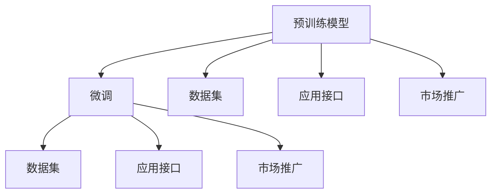

                 

# LLM产业链生态:从无到有的蓬勃发展

> 关键词：大语言模型(LLM),预训练,微调(Fine-tuning),LLM生态,产业链,核心组件,实际应用,挑战与发展

## 1. 背景介绍

### 1.1 问题由来

随着深度学习技术的迅猛发展，大语言模型(LLM)在自然语言处理(NLP)领域取得了突破性进展。LLM通过在大规模无标签文本数据上预训练，学习到了丰富的语言知识和常识，可以应用于文本分类、情感分析、对话系统、机器翻译等多种下游任务。近年来，LLM在学术界和工业界都受到了广泛关注，相关研究和技术在多个行业落地应用，构建起了一条涵盖技术研发、数据处理、应用开发、市场推广等环节的完整产业链，形成了蓬勃发展的生态系统。

### 1.2 问题核心关键点

当前，大语言模型在推动NLP产业化的进程中发挥着重要作用，但同时也面临着数据稀缺、计算资源昂贵、模型可解释性不足等诸多挑战。为了克服这些困难，推动LLM产业链的成熟发展，本文将详细探讨LLM生态链的构成及其核心组件，分析实际应用中的具体案例，并展望未来发展趋势和潜在挑战。

## 2. 核心概念与联系

### 2.1 核心概念概述

在深入探讨LLM产业链生态前，我们首先需要明确几个核心概念：

- **大语言模型(LLM)**：指通过预训练和微调得到的大型自然语言处理模型，具备强大的文本生成、分类、推理能力。
- **预训练(Pre-training)**：指在大规模无标签文本数据上，通过自监督学习任务训练模型，学习通用语言表示的过程。
- **微调(Fine-tuning)**：指在预训练模型的基础上，使用下游任务的少量标注数据，通过有监督学习优化模型在该任务上的性能。
- **LLM产业链**：指围绕大语言模型构建的研发、数据、应用、市场等环节形成的一条完整价值链，包含技术研发、数据处理、应用开发、市场推广等多个阶段。
- **核心组件**：包括预训练模型、微调技术、数据集、应用接口、市场推广等。

### 2.2 核心概念原理和架构的 Mermaid 流程图



这个流程图展示了LLM产业链生态的基本结构，其中预训练模型是核心，微调是手段，数据集和应用接口是支撑，市场推广是延伸。

## 3. 核心算法原理 & 具体操作步骤

### 3.1 算法原理概述

大语言模型的产业链生态主要包括预训练、微调、数据集、应用接口、市场推广等关键环节。本节将逐一介绍这些核心算法的原理和具体操作步骤。

### 3.2 算法步骤详解

#### 3.2.1 预训练

预训练是大语言模型产业链生态的基础环节。预训练模型通过在大规模无标签文本数据上自监督学习，学习到语言的一般规律和模式。预训练模型通常采用自回归或自编码的结构，如BERT、GPT等。

预训练流程一般包括以下几个步骤：
1. **数据准备**：收集大规模无标签文本数据，如维基百科、新闻、论文等。
2. **模型设计**：设计预训练模型，如Transformer等。
3. **模型训练**：在大规模数据上通过自监督学习任务（如掩码语言模型、下一句预测等）进行训练。
4. **模型评估**：在验证集上评估模型性能，选择表现最好的模型进行后续微调。

#### 3.2.2 微调

微调是在预训练模型的基础上，通过下游任务的少量标注数据进行有监督学习，提升模型在该任务上的性能。微调是LLM产业链生态中的关键环节，通过微调，模型可以适应特定领域或特定任务的需求。

微调流程一般包括以下几个步骤：
1. **数据准备**：收集下游任务的少量标注数据。
2. **模型加载**：加载预训练模型作为初始化参数。
3. **任务适配**：添加任务适配层，如分类头、解码器等。
4. **模型训练**：在标注数据上通过优化算法（如Adam、SGD等）进行训练。
5. **模型评估**：在验证集上评估模型性能，调整超参数，确保最优效果。

#### 3.2.3 数据集

数据集是预训练和微调的重要支撑。LLM产业链生态需要大量的标注数据来训练和微调模型，以提升模型性能。数据集通常包括标注数据集、验证集和测试集。

数据集构建流程一般包括以下几个步骤：
1. **数据收集**：收集任务相关的文本数据。
2. **数据清洗**：去除噪音数据，确保数据质量。
3. **数据标注**：为数据打上标签，生成标注数据集。
4. **数据分割**：将数据集划分为训练集、验证集和测试集。

#### 3.2.4 应用接口

应用接口是LLM产业链生态的重要组成部分，用于封装模型，提供统一的应用接口，方便开发者调用和使用。常见的应用接口包括RESTful API、gRPC等。

应用接口构建流程一般包括以下几个步骤：
1. **模型封装**：将预训练和微调后的模型封装为API接口。
2. **接口设计**：设计API接口的输入输出格式、请求参数等。
3. **接口测试**：在测试集上测试API接口，确保正确性。
4. **接口部署**：将API接口部署到服务器或云端，供开发者使用。

#### 3.2.5 市场推广

市场推广是LLM产业链生态的延伸环节，通过市场营销、技术支持、售后服务等手段，推动模型的应用和落地。市场推广是产业链生态健康发展的关键因素。

市场推广流程一般包括以下几个步骤：
1. **市场调研**：调研市场需求和用户需求，确定推广目标。
2. **产品发布**：发布预训练和微调后的模型，提供应用接口。
3. **市场营销**：通过线上线下渠道，宣传产品功能和使用效果。
4. **技术支持**：提供技术支持，解决用户在使用中遇到的问题。
5. **售后服务**：提供售后服务，确保用户满意度。

### 3.3 算法优缺点

大语言模型产业链生态中的核心算法具有以下优点：
1. **高效性**：通过预训练和微调，模型能够在短时间内获得优异的性能，适用于各种NLP任务。
2. **可扩展性**：预训练和微调技术可以应用于多种任务和领域，具有较强的通用性。
3. **灵活性**：通过数据集和应用接口的设计，可以适应不同应用场景的需求。

同时，该算法也存在一些缺点：
1. **计算资源昂贵**：预训练和微调需要大量的计算资源和存储空间，成本较高。
2. **数据依赖**：模型性能受数据质量和数量的影响较大。
3. **可解释性不足**：预训练和微调模型通常被视为"黑盒"系统，难以解释其内部工作机制。

### 3.4 算法应用领域

大语言模型产业链生态在多个领域得到了广泛应用，包括但不限于以下几个方面：

- **文本分类**：如情感分析、主题分类、垃圾邮件过滤等。通过微调使模型学习文本-标签映射。
- **命名实体识别**：识别文本中的人名、地名、机构名等特定实体。通过微调使模型掌握实体边界和类型。
- **关系抽取**：从文本中抽取实体之间的语义关系。通过微调使模型学习实体-关系三元组。
- **问答系统**：对自然语言问题给出答案。将问题-答案对作为微调数据，训练模型学习匹配答案。
- **机器翻译**：将源语言文本翻译成目标语言。通过微调使模型学习语言-语言映射。
- **文本摘要**：将长文本压缩成简短摘要。将文章-摘要对作为微调数据，使模型学习抓取要点。
- **对话系统**：使机器能够与人自然对话。将多轮对话历史作为上下文，微调模型进行回复生成。

除了上述这些经典任务外，大语言模型产业链生态还在可控文本生成、常识推理、代码生成、数据增强等多个领域得到了创新性的应用。

## 4. 数学模型和公式 & 详细讲解 & 举例说明

### 4.1 数学模型构建

大语言模型产业链生态中的预训练和微调过程都可以通过数学模型进行描述。这里以BERT模型为例，介绍其数学模型的构建。

BERT模型通过在大规模无标签文本数据上进行预训练，学习到语言的通用表示。预训练目标函数为：

$$
\mathcal{L}_{pre} = -\frac{1}{N}\sum_{i=1}^N \sum_{j=1}^{2} \mathcal{L}_{ij}(x)
$$

其中，$\mathcal{L}_{ij}$为在位置$i$和位置$j$的掩码预测损失，$x$为输入文本。

在微调过程中，通过添加任务适配层（如分类头），使模型学习特定任务的标签表示。微调目标函数为：

$$
\mathcal{L}_{fin} = -\frac{1}{N}\sum_{i=1}^N \sum_{j=1}^{C} y_{ij} \log \hat{y}_{ij}
$$

其中，$y_{ij}$为真实标签，$\hat{y}_{ij}$为模型预测的概率分布，$C$为类别数。

### 4.2 公式推导过程

#### 4.2.1 BERT预训练目标函数

BERT预训练模型在大量无标签文本数据上进行掩码预测。预训练数据集由两部分组成：掩码预测数据集和下一句预测数据集。

掩码预测数据集中，输入文本中的某些位置被随机掩码掉，模型需要预测这些位置上的掩码单词。掩码预测损失函数为：

$$
\mathcal{L}_{ij} = -\frac{1}{V} \sum_{v=1}^{V} \log \hat{y}_{v|x_i,j}
$$

其中，$V$为词汇表大小，$\hat{y}_{v|x_i,j}$为模型在位置$i$和位置$j$的掩码预测概率。

下一句预测数据集中，输入文本和下一句文本作为前向传递的输入，模型需要预测两个句子是否连续出现。下一句预测损失函数为：

$$
\mathcal{L}_{ij} = -\frac{1}{V} \sum_{v=1}^{V} \log \hat{y}_{v|x_i,j}
$$

其中，$V$为词汇表大小，$\hat{y}_{v|x_i,j}$为模型在位置$i$和位置$j$的下一句预测概率。

#### 4.2.2 BERT微调目标函数

BERT微调过程中，通过添加任务适配层，学习特定任务的标签表示。假设任务为文本分类，目标函数为：

$$
\mathcal{L}_{fin} = -\frac{1}{N}\sum_{i=1}^N \sum_{j=1}^{C} y_{ij} \log \hat{y}_{ij}
$$

其中，$y_{ij}$为真实标签，$\hat{y}_{ij}$为模型预测的概率分布，$C$为类别数。

### 4.3 案例分析与讲解

#### 4.3.1 案例1：情感分析

情感分析任务的目标是根据文本判断情感倾向，通常分为正面、负面和中性三类。

假设模型为BERT，输入文本为："I am happy today!"。模型通过微调学习情感分析的分类头，输出概率分布：

$$
\hat{y}_{1|x_i,j} = 0.95, \quad \hat{y}_{2|x_i,j} = 0.05, \quad \hat{y}_{3|x_i,j} = 0
$$

其中，$\hat{y}_{1|x_i,j}$为正面情感的预测概率，$\hat{y}_{2|x_i,j}$为负面情感的预测概率，$\hat{y}_{3|x_i,j}$为中性情感的预测概率。

#### 4.3.2 案例2：机器翻译

机器翻译任务的目标是将源语言文本翻译成目标语言文本。假设模型为BERT，输入文本为："Hello, how are you?"，目标语言为西班牙语。

模型通过微调学习语言-语言映射，输出概率分布：

$$
\hat{y}_{1|x_i,j} = 0.8, \quad \hat{y}_{2|x_i,j} = 0.2
$$

其中，$\hat{y}_{1|x_i,j}$为目标语言中的"你好"，$\hat{y}_{2|x_i,j}$为目标语言中的"猫"。

## 5. 项目实践：代码实例和详细解释说明

### 5.1 开发环境搭建

在进行LLM产业链生态的实践前，我们需要准备好开发环境。以下是使用Python进行PyTorch开发的环境配置流程：

1. 安装Anaconda：从官网下载并安装Anaconda，用于创建独立的Python环境。

2. 创建并激活虚拟环境：
```bash
conda create -n pytorch-env python=3.8 
conda activate pytorch-env
```

3. 安装PyTorch：根据CUDA版本，从官网获取对应的安装命令。例如：
```bash
conda install pytorch torchvision torchaudio cudatoolkit=11.1 -c pytorch -c conda-forge
```

4. 安装Transformers库：
```bash
pip install transformers
```

5. 安装各类工具包：
```bash
pip install numpy pandas scikit-learn matplotlib tqdm jupyter notebook ipython
```

完成上述步骤后，即可在`pytorch-env`环境中开始LLM产业链生态的实践。

### 5.2 源代码详细实现

下面我们以情感分析任务为例，给出使用Transformers库对BERT模型进行微调的PyTorch代码实现。

首先，定义情感分析任务的数据处理函数：

```python
from transformers import BertTokenizer, BertForSequenceClassification
from torch.utils.data import Dataset
import torch

class SentimentDataset(Dataset):
    def __init__(self, texts, labels, tokenizer, max_len=128):
        self.texts = texts
        self.labels = labels
        self.tokenizer = tokenizer
        self.max_len = max_len
        
    def __len__(self):
        return len(self.texts)
    
    def __getitem__(self, item):
        text = self.texts[item]
        label = self.labels[item]
        
        encoding = self.tokenizer(text, return_tensors='pt', max_length=self.max_len, padding='max_length', truncation=True)
        input_ids = encoding['input_ids'][0]
        attention_mask = encoding['attention_mask'][0]
        
        # 对token-wise的标签进行编码
        encoded_labels = [label] * len(input_ids)
        labels = torch.tensor(encoded_labels, dtype=torch.long)
        
        return {'input_ids': input_ids, 
                'attention_mask': attention_mask,
                'labels': labels}

# 加载预训练模型和tokenizer
model = BertForSequenceClassification.from_pretrained('bert-base-cased', num_labels=3)
tokenizer = BertTokenizer.from_pretrained('bert-base-cased')

# 创建dataset
train_dataset = SentimentDataset(train_texts, train_labels, tokenizer)
dev_dataset = SentimentDataset(dev_texts, dev_labels, tokenizer)
test_dataset = SentimentDataset(test_texts, test_labels, tokenizer)
```

然后，定义模型和优化器：

```python
from transformers import AdamW

optimizer = AdamW(model.parameters(), lr=2e-5)
```

接着，定义训练和评估函数：

```python
from torch.utils.data import DataLoader
from tqdm import tqdm
from sklearn.metrics import classification_report

device = torch.device('cuda') if torch.cuda.is_available() else torch.device('cpu')
model.to(device)

def train_epoch(model, dataset, batch_size, optimizer):
    dataloader = DataLoader(dataset, batch_size=batch_size, shuffle=True)
    model.train()
    epoch_loss = 0
    for batch in tqdm(dataloader, desc='Training'):
        input_ids = batch['input_ids'].to(device)
        attention_mask = batch['attention_mask'].to(device)
        labels = batch['labels'].to(device)
        model.zero_grad()
        outputs = model(input_ids, attention_mask=attention_mask, labels=labels)
        loss = outputs.loss
        epoch_loss += loss.item()
        loss.backward()
        optimizer.step()
    return epoch_loss / len(dataloader)

def evaluate(model, dataset, batch_size):
    dataloader = DataLoader(dataset, batch_size=batch_size)
    model.eval()
    preds, labels = [], []
    with torch.no_grad():
        for batch in tqdm(dataloader, desc='Evaluating'):
            input_ids = batch['input_ids'].to(device)
            attention_mask = batch['attention_mask'].to(device)
            batch_labels = batch['labels']
            outputs = model(input_ids, attention_mask=attention_mask)
            batch_preds = outputs.logits.argmax(dim=2).to('cpu').tolist()
            batch_labels = batch_labels.to('cpu').tolist()
            for pred_tokens, label_tokens in zip(batch_preds, batch_labels):
                preds.append(pred_tokens[:len(label_tokens)])
                labels.append(label_tokens)
                
    print(classification_report(labels, preds))
```

最后，启动训练流程并在测试集上评估：

```python
epochs = 5
batch_size = 16

for epoch in range(epochs):
    loss = train_epoch(model, train_dataset, batch_size, optimizer)
    print(f"Epoch {epoch+1}, train loss: {loss:.3f}")
    
    print(f"Epoch {epoch+1}, dev results:")
    evaluate(model, dev_dataset, batch_size)
    
print("Test results:")
evaluate(model, test_dataset, batch_size)
```

以上就是使用PyTorch对BERT进行情感分析任务微调的完整代码实现。可以看到，得益于Transformers库的强大封装，我们可以用相对简洁的代码完成BERT模型的加载和微调。

### 5.3 代码解读与分析

让我们再详细解读一下关键代码的实现细节：

**SentimentDataset类**：
- `__init__`方法：初始化文本、标签、分词器等关键组件。
- `__len__`方法：返回数据集的样本数量。
- `__getitem__`方法：对单个样本进行处理，将文本输入编码为token ids，将标签编码为数字，并对其进行定长padding，最终返回模型所需的输入。

**模型和优化器**：
- 加载预训练模型和tokenizer，选择合适的预训练模型和tokenizer。
- 定义优化器及其学习率。

**训练和评估函数**：
- 使用PyTorch的DataLoader对数据集进行批次化加载，供模型训练和推理使用。
- 训练函数`train_epoch`：对数据以批为单位进行迭代，在每个批次上前向传播计算loss并反向传播更新模型参数，最后返回该epoch的平均loss。
- 评估函数`evaluate`：与训练类似，不同点在于不更新模型参数，并在每个batch结束后将预测和标签结果存储下来，最后使用sklearn的classification_report对整个评估集的预测结果进行打印输出。

**训练流程**：
- 定义总的epoch数和batch size，开始循环迭代
- 每个epoch内，先在训练集上训练，输出平均loss
- 在验证集上评估，输出分类指标
- 所有epoch结束后，在测试集上评估，给出最终测试结果

可以看到，PyTorch配合Transformers库使得BERT微调的代码实现变得简洁高效。开发者可以将更多精力放在数据处理、模型改进等高层逻辑上，而不必过多关注底层的实现细节。

当然，工业级的系统实现还需考虑更多因素，如模型的保存和部署、超参数的自动搜索、更灵活的任务适配层等。但核心的微调范式基本与此类似。

## 6. 实际应用场景

### 6.1 智能客服系统

基于大语言模型微调的对话技术，可以广泛应用于智能客服系统的构建。传统客服往往需要配备大量人力，高峰期响应缓慢，且一致性和专业性难以保证。而使用微调后的对话模型，可以7x24小时不间断服务，快速响应客户咨询，用自然流畅的语言解答各类常见问题。

在技术实现上，可以收集企业内部的历史客服对话记录，将问题和最佳答复构建成监督数据，在此基础上对预训练对话模型进行微调。微调后的对话模型能够自动理解用户意图，匹配最合适的答案模板进行回复。对于客户提出的新问题，还可以接入检索系统实时搜索相关内容，动态组织生成回答。如此构建的智能客服系统，能大幅提升客户咨询体验和问题解决效率。

### 6.2 金融舆情监测

金融机构需要实时监测市场舆论动向，以便及时应对负面信息传播，规避金融风险。传统的人工监测方式成本高、效率低，难以应对网络时代海量信息爆发的挑战。基于大语言模型微调的文本分类和情感分析技术，为金融舆情监测提供了新的解决方案。

具体而言，可以收集金融领域相关的新闻、报道、评论等文本数据，并对其进行主题标注和情感标注。在此基础上对预训练语言模型进行微调，使其能够自动判断文本属于何种主题，情感倾向是正面、中性还是负面。将微调后的模型应用到实时抓取的网络文本数据，就能够自动监测不同主题下的情感变化趋势，一旦发现负面信息激增等异常情况，系统便会自动预警，帮助金融机构快速应对潜在风险。

### 6.3 个性化推荐系统

当前的推荐系统往往只依赖用户的历史行为数据进行物品推荐，无法深入理解用户的真实兴趣偏好。基于大语言模型微调技术，个性化推荐系统可以更好地挖掘用户行为背后的语义信息，从而提供更精准、多样的推荐内容。

在实践中，可以收集用户浏览、点击、评论、分享等行为数据，提取和用户交互的物品标题、描述、标签等文本内容。将文本内容作为模型输入，用户的后续行为（如是否点击、购买等）作为监督信号，在此基础上微调预训练语言模型。微调后的模型能够从文本内容中准确把握用户的兴趣点。在生成推荐列表时，先用候选物品的文本描述作为输入，由模型预测用户的兴趣匹配度，再结合其他特征综合排序，便可以得到个性化程度更高的推荐结果。

### 6.4 未来应用展望

随着大语言模型微调技术的发展，未来其应用领域将会更加广泛，为各行各业带来更多变革性影响。

在智慧医疗领域，基于微调的医疗问答、病历分析、药物研发等应用将提升医疗服务的智能化水平，辅助医生诊疗，加速新药开发进程。

在智能教育领域，微调技术可应用于作业批改、学情分析、知识推荐等方面，因材施教，促进教育公平，提高教学质量。

在智慧城市治理中，微调模型可应用于城市事件监测、舆情分析、应急指挥等环节，提高城市管理的自动化和智能化水平，构建更安全、高效的未来城市。

此外，在企业生产、社会治理、文娱传媒等众多领域，基于大模型微调的人工智能应用也将不断涌现，为经济社会发展注入新的动力。相信随着技术的日益成熟，微调方法将成为人工智能落地应用的重要范式，推动人工智能技术在垂直行业的规模化落地。总之，微调需要开发者根据具体任务，不断迭代和优化模型、数据和算法，方能得到理想的效果。

## 7. 工具和资源推荐

### 7.1 学习资源推荐

为了帮助开发者系统掌握大语言模型微调的理论基础和实践技巧，这里推荐一些优质的学习资源：

1. 《Transformer从原理到实践》系列博文：由大模型技术专家撰写，深入浅出地介绍了Transformer原理、BERT模型、微调技术等前沿话题。

2. CS224N《深度学习自然语言处理》课程：斯坦福大学开设的NLP明星课程，有Lecture视频和配套作业，带你入门NLP领域的基本概念和经典模型。

3. 《Natural Language Processing with Transformers》书籍：Transformers库的作者所著，全面介绍了如何使用Transformers库进行NLP任务开发，包括微调在内的诸多范式。

4. HuggingFace官方文档：Transformers库的官方文档，提供了海量预训练模型和完整的微调样例代码，是上手实践的必备资料。

5. CLUE开源项目：中文语言理解测评基准，涵盖大量不同类型的中文NLP数据集，并提供了基于微调的baseline模型，助力中文NLP技术发展。

通过对这些资源的学习实践，相信你一定能够快速掌握大语言模型微调的精髓，并用于解决实际的NLP问题。
###  7.2 开发工具推荐

高效的开发离不开优秀的工具支持。以下是几款用于大语言模型微调开发的常用工具：

1. PyTorch：基于Python的开源深度学习框架，灵活动态的计算图，适合快速迭代研究。大部分预训练语言模型都有PyTorch版本的实现。

2. TensorFlow：由Google主导开发的开源深度学习框架，生产部署方便，适合大规模工程应用。同样有丰富的预训练语言模型资源。

3. Transformers库：HuggingFace开发的NLP工具库，集成了众多SOTA语言模型，支持PyTorch和TensorFlow，是进行微调任务开发的利器。

4. Weights & Biases：模型训练的实验跟踪工具，可以记录和可视化模型训练过程中的各项指标，方便对比和调优。与主流深度学习框架无缝集成。

5. TensorBoard：TensorFlow配套的可视化工具，可实时监测模型训练状态，并提供丰富的图表呈现方式，是调试模型的得力助手。

6. Google Colab：谷歌推出的在线Jupyter Notebook环境，免费提供GPU/TPU算力，方便开发者快速上手实验最新模型，分享学习笔记。

合理利用这些工具，可以显著提升大语言模型微调任务的开发效率，加快创新迭代的步伐。

### 7.3 相关论文推荐

大语言模型和微调技术的发展源于学界的持续研究。以下是几篇奠基性的相关论文，推荐阅读：

1. Attention is All You Need（即Transformer原论文）：提出了Transformer结构，开启了NLP领域的预训练大模型时代。

2. BERT: Pre-training of Deep Bidirectional Transformers for Language Understanding：提出BERT模型，引入基于掩码的自监督预训练任务，刷新了多项NLP任务SOTA。

3. Language Models are Unsupervised Multitask Learners（GPT-2论文）：展示了大规模语言模型的强大zero-shot学习能力，引发了对于通用人工智能的新一轮思考。

4. Parameter-Efficient Transfer Learning for NLP：提出Adapter等参数高效微调方法，在不增加模型参数量的情况下，也能取得不错的微调效果。

5. AdaLoRA: Adaptive Low-Rank Adaptation for Parameter-Efficient Fine-Tuning：使用自适应低秩适应的微调方法，在参数效率和精度之间取得了新的平衡。

这些论文代表了大语言模型微调技术的发展脉络。通过学习这些前沿成果，可以帮助研究者把握学科前进方向，激发更多的创新灵感。

## 8. 总结：未来发展趋势与挑战

### 8.1 总结

本文对大语言模型产业链生态的构建进行了全面系统的介绍。首先阐述了LLM产业链生态的背景和意义，明确了预训练、微调、数据集、应用接口、市场推广等关键环节的重要性。其次，从原理到实践，详细讲解了预训练和微调的核心算法及其具体操作步骤。同时，本文还探讨了LLM产业链生态在智能客服、金融舆情、个性化推荐等多个领域的应用场景，展示了LLM产业链生态的广阔前景。此外，本文精选了LLM产业链生态的学习资源、开发工具和相关论文，力求为开发者提供全方位的技术指引。

通过本文的系统梳理，可以看到，大语言模型产业链生态正在成为NLP产业化的重要组成部分，极大地拓展了预训练语言模型的应用边界，推动了NLP技术的产业化进程。未来，伴随预训练语言模型和微调方法的持续演进，相信NLP技术将在更多领域得到广泛应用，深刻影响人类的生产生活方式。

### 8.2 未来发展趋势

展望未来，大语言模型产业链生态将呈现以下几个发展趋势：

1. **技术不断演进**：预训练和微调技术将不断提升，模型规模将进一步增大，性能将更加强大。

2. **应用领域拓展**：LLM产业链生态将进一步拓展到更多领域，如智慧医疗、智能教育、智慧城市等。

3. **可解释性增强**：大语言模型的可解释性将成为重要研究方向，通过因果分析和知识图谱等手段，增强模型的可解释性。

4. **持续学习**：LLM产业链生态将更加注重模型的持续学习，通过增量学习等手段，保持模型的时效性和适应性。

5. **跨领域迁移**：LLM产业链生态将更加注重模型的跨领域迁移能力，通过迁移学习等手段，提升模型在不同领域的表现。

6. **多模态融合**：LLM产业链生态将更加注重多模态信息的融合，通过视觉、语音等多模态数据的整合，提升模型的语言理解和生成能力。

以上趋势凸显了大语言模型产业链生态的广阔前景。这些方向的探索发展，必将进一步提升NLP系统的性能和应用范围，为人类认知智能的进化带来深远影响。

### 8.3 面临的挑战

尽管大语言模型产业链生态已经取得了一定的进展，但在迈向更加智能化、普适化应用的过程中，它仍面临着诸多挑战：

1. **数据稀缺**：部分领域的数据稀缺是制约模型性能提升的重要因素。

2. **计算资源昂贵**：预训练和微调需要大量的计算资源，成本较高。

3. **可解释性不足**：大语言模型通常被视为"黑盒"系统，难以解释其内部工作机制。

4. **安全性**：大语言模型可能学习到有害信息，传递到下游任务，带来安全隐患。

5. **知识整合能力不足**：现有的模型难以灵活吸收和运用更广泛的先验知识。

6. **资源优化**：在实际部署中，模型的资源优化问题仍然存在。

7. **伦理和合规性**：大语言模型可能带来伦理和合规性问题，需要严格监管和审核。

这些挑战是大语言模型产业链生态迈向成熟的重要障碍，需要全行业共同努力解决。

### 8.4 研究展望

面对大语言模型产业链生态所面临的挑战，未来的研究需要在以下几个方面寻求新的突破：

1. **无监督学习**：探索无监督学习范式，摆脱对大规模标注数据的依赖。

2. **参数高效微调**：开发更加参数高效的微调方法，减少计算资源消耗。

3. **多模态融合**：研究多模态融合技术，提升模型的跨领域迁移能力。

4. **因果推断**：引入因果推断方法，增强模型的稳定性和鲁棒性。

5. **知识图谱**：将知识图谱等先验知识与神经网络模型结合，提升模型的知识整合能力。

6. **对抗训练**：通过对抗训练等手段，提高模型的鲁棒性和安全性。

7. **可解释性增强**：研究可解释性增强技术，增强模型的可解释性和可审计性。

这些研究方向的探索，必将引领大语言模型产业链生态的进一步发展，为构建安全、可靠、可解释、可控的智能系统铺平道路。面向未来，大语言模型产业链生态需要与其他人工智能技术进行更深入的融合，多路径协同发力，共同推动自然语言理解和智能交互系统的进步。只有勇于创新、敢于突破，才能不断拓展语言模型的边界，让智能技术更好地造福人类社会。

## 9. 附录：常见问题与解答

**Q1：大语言模型产业链生态是否适用于所有NLP任务？**

A: 大语言模型产业链生态在大多数NLP任务上都能取得不错的效果，特别是对于数据量较小的任务。但对于一些特定领域的任务，如医学、法律等，仅仅依靠通用语料预训练的模型可能难以很好地适应。此时需要在特定领域语料上进一步预训练，再进行微调，才能获得理想效果。

**Q2：预训练和微调技术如何平衡计算资源和模型性能？**

A: 预训练和微调技术需要平衡计算资源和模型性能。通常，预训练阶段需要消耗大量的计算资源，但能够学习到通用的语言知识，而微调阶段资源消耗较小，但能够适应特定领域或任务的需求。

**Q3：如何提高大语言模型的可解释性？**

A: 提高大语言模型的可解释性可以通过以下方法：
1. 引入因果分析方法，识别模型决策的关键特征，增强输出解释的因果性和逻辑性。
2. 使用符号化的先验知识，如知识图谱、逻辑规则等，增强模型的可解释性。
3. 提供详细模型训练过程和参数调整的文档，帮助用户理解模型的内部机制。

**Q4：如何应对大语言模型产业链生态中的数据稀缺问题？**

A: 应对数据稀缺问题可以通过以下方法：
1. 使用无监督学习或半监督学习，在少量标注数据上训练模型。
2. 引入主动学习、对抗学习等方法，提高标注数据的利用效率。
3. 利用数据增强技术，如回译、近义替换等，扩充训练集。
4. 利用多源数据、跨领域数据等，提升模型的泛化能力。

**Q5：如何提高大语言模型的安全性？**

A: 提高大语言模型的安全性可以通过以下方法：
1. 在模型训练目标中引入伦理导向的评估指标，过滤和惩罚有害的输出倾向。
2. 加强人工干预和审核，建立模型行为的监管机制。
3. 引入对抗训练、知识图谱等手段，提高模型的鲁棒性和安全性。

这些方法可以有效地应对大语言模型产业链生态中的安全性问题，确保模型的输出符合人类价值观和伦理道德。

---

作者：禅与计算机程序设计艺术 / Zen and the Art of Computer Programming

