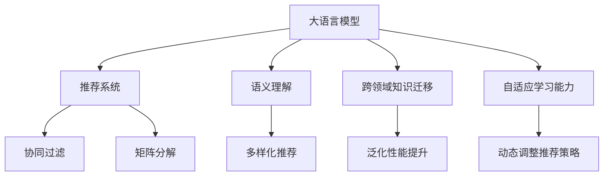

                 

# LLM在推荐系统的扩展：多样性与可适应性

> 关键词：推荐系统,大语言模型,多样性,可适应性,推荐模型,自适应推荐

## 1. 背景介绍

推荐系统是互联网平台（如电商、社交媒体、视频网站等）的核心功能之一，其目标是根据用户的兴趣和行为，向用户推荐可能感兴趣的内容或商品。传统的推荐算法主要依赖于用户的历史行为数据，通过构建用户-物品的关联矩阵，利用协同过滤、矩阵分解等技术进行推荐。

然而，随着内容多样性不断增加，用户的兴趣和行为模式也变得越来越复杂，单一的推荐算法难以满足用户多样化的需求。近年来，大语言模型（Large Language Model, LLM）的应用为推荐系统带来了新的思路。通过将LLM引入推荐系统，利用其强大的语言理解能力和跨领域知识迁移能力，推荐系统能够更好地处理长尾物品、新物品、跨领域推荐等场景，提升了推荐的准确性和多样性。

### 1.1 推荐系统的挑战

当前推荐系统面临以下几个主要挑战：

1. **冷启动问题**：新用户或新物品难以被有效建模，导致推荐效果不佳。
2. **长尾物品问题**：主流推荐算法往往难以覆盖数量庞大的长尾物品，导致用户体验和满意度不高。
3. **跨领域推荐**：不同领域的内容推荐难度较大，传统推荐系统难以跨领域迁移。
4. **多样性问题**：用户需求多样，推荐系统需要平衡个性化和多样性，避免推荐单一化。

### 1.2 大语言模型的优势

大语言模型通过在大规模无标签文本语料上进行预训练，学习到了丰富的语言知识和常识，具备强大的语言理解和生成能力。这些能力可以应用于推荐系统，为推荐系统提供更全面的用户和物品描述，实现更精准、多元的推荐。

1. **语义理解能力**：大语言模型可以解析用户输入的自然语言描述，理解用户真正的需求和兴趣。
2. **跨领域知识迁移**：大语言模型具备跨领域知识迁移能力，能够将不同领域的知识进行整合，提升推荐系统的泛化性能。
3. **自适应学习能力**：大语言模型通过微调，可以动态地适应用户和物品的变化，实现自适应推荐。

因此，将大语言模型引入推荐系统，能够显著提升推荐系统的性能和用户体验。

## 2. 核心概念与联系

### 2.1 核心概念概述

为了更好地理解大语言模型在推荐系统中的应用，本节将介绍几个关键概念：

- **大语言模型（LLM）**：以自回归（如GPT）或自编码（如BERT）模型为代表的大规模预训练语言模型。通过在大规模无标签文本语料上进行预训练，学习到通用的语言表示，具备强大的语言理解和生成能力。
- **推荐系统（Recommender System）**：根据用户兴趣和行为，向用户推荐可能感兴趣的内容或商品的系统。
- **多样性（Diversity）**：推荐系统在推荐内容时，能够提供多样化的选择，满足用户不同的需求。
- **自适应性（Adaptability）**：推荐系统能够根据用户的变化，动态调整推荐策略，提升推荐效果。
- **协同过滤（Collaborative Filtering）**：基于用户行为数据的推荐算法，通过计算用户和物品的相似度进行推荐。
- **矩阵分解（Matrix Factorization）**：基于用户-物品评分矩阵的分解，学习用户和物品的隐向量表示，进行推荐。

这些概念之间的逻辑关系可以通过以下Mermaid流程图来展示：



这个流程图展示了大语言模型与推荐系统的核心概念及其之间的关系：

1. 大语言模型通过预训练获得基础能力。
2. 推荐系统利用大语言模型的能力，实现更精准、多元的推荐。
3. 协同过滤和矩阵分解是传统推荐算法。
4. 语义理解、跨领域知识迁移和自适应学习能力是大语言模型在推荐系统中的应用。
5. 多样化推荐和泛化性能提升是大语言模型对推荐系统的增强。

这些概念共同构成了大语言模型在推荐系统中的应用框架，使其能够在各种推荐场景中发挥强大的语言理解和生成能力。通过理解这些核心概念，我们可以更好地把握大语言模型在推荐系统中的应用潜力。

## 3. 核心算法原理 & 具体操作步骤

### 3.1 算法原理概述

大语言模型在推荐系统中的主要作用是提供用户和物品的语义表示，并根据用户需求动态调整推荐策略。具体的算法流程可以分为以下几个步骤：

1. **预训练**：使用大规模无标签文本数据对大语言模型进行预训练，学习通用的语言表示。
2. **语义理解**：利用大语言模型对用户输入的自然语言描述进行语义理解，获取用户的兴趣和需求。
3. **跨领域知识迁移**：将不同领域的知识进行整合，提升推荐系统的泛化性能。
4. **自适应学习**：根据用户和物品的变化，动态调整推荐策略。

### 3.2 算法步骤详解

基于大语言模型的推荐系统通常包括以下几个关键步骤：

**Step 1: 准备预训练模型和数据集**

- 选择合适的预训练语言模型（如BERT、GPT等）作为初始化参数。
- 准备推荐系统所需的用户和物品描述数据集，划分为训练集、验证集和测试集。一般要求描述数据与预训练数据的分布不要差异过大。

**Step 2: 语义理解**

- 对用户的自然语言描述进行语义分析，获取用户的主要兴趣和需求。
- 使用大语言模型对物品的描述进行语义编码，生成物品的向量表示。

**Step 3: 跨领域知识迁移**

- 将用户和物品的语义向量进行融合，利用跨领域知识迁移技术，提升推荐系统的泛化性能。
- 对融合后的向量进行进一步的预处理，确保模型的稳定性和收敛性。

**Step 4: 自适应学习**

- 根据用户的变化，动态调整推荐策略。
- 使用微调技术对大语言模型进行训练，使其适应新的用户和物品特征。

**Step 5: 推荐策略优化**

- 根据自适应学习后的模型，生成推荐结果。
- 对推荐结果进行评估，根据评估结果优化推荐策略。

### 3.3 算法优缺点

大语言模型在推荐系统中的主要优点包括：

1. **语义理解能力强**：大语言模型能够解析用户输入的自然语言描述，理解用户的兴趣和需求。
2. **跨领域知识迁移能力强**：大语言模型具备跨领域知识迁移能力，能够将不同领域的知识进行整合，提升推荐系统的泛化性能。
3. **自适应能力强**：大语言模型通过微调，可以动态地适应用户和物品的变化，实现自适应推荐。

同时，该方法也存在一定的局限性：

1. **计算资源消耗大**：大语言模型的参数量较大，对计算资源消耗较大，需要高性能的硬件支持。
2. **训练时间较长**：大语言模型需要在大规模数据上进行预训练和微调，训练时间较长。
3. **模型解释性差**：大语言模型的决策过程缺乏可解释性，难以对其推理逻辑进行分析和调试。

尽管存在这些局限性，但就目前而言，大语言模型在推荐系统中的应用仍然展现出巨大的潜力。

### 3.4 算法应用领域

大语言模型在推荐系统中的应用已经得到了广泛的应用，涵盖了几乎所有常见场景，例如：

- **电商推荐**：根据用户浏览、购买历史和自然语言描述，推荐商品和促销活动。
- **社交媒体推荐**：根据用户的兴趣和行为，推荐相关的内容和好友。
- **视频推荐**：根据用户的观看历史和描述，推荐相关视频和频道。
- **新闻推荐**：根据用户的阅读历史和描述，推荐相关的新闻和话题。
- **音乐推荐**：根据用户的听歌历史和描述，推荐歌曲和音乐播放列表。

除了这些经典场景外，大语言模型在更多新兴场景中也得到了创新性的应用，如多模态推荐、跨领域推荐、多目标推荐等，为推荐系统带来了全新的突破。

## 4. 数学模型和公式 & 详细讲解

### 4.1 数学模型构建

本节将使用数学语言对基于大语言模型的推荐系统过程进行更加严格的刻画。

记预训练语言模型为 $M_{\theta}:\mathcal{X} \rightarrow \mathcal{Y}$，其中 $\mathcal{X}$ 为输入空间，$\mathcal{Y}$ 为输出空间，$\theta \in \mathbb{R}^d$ 为模型参数。假设推荐系统所需的训练集为 $D=\{(x_i,y_i)\}_{i=1}^N, x_i \in \mathcal{X}, y_i \in \mathcal{Y}$。

定义推荐系统在用户描述 $x$ 上的损失函数为 $\ell(M_{\theta}(x),y)$，则在数据集 $D$ 上的经验风险为：

$$
\mathcal{L}(\theta) = \frac{1}{N} \sum_{i=1}^N \ell(M_{\theta}(x_i),y_i)
$$

其中 $\ell$ 为推荐系统的损失函数，用于衡量模型预测输出与真实标签之间的差异。常见的损失函数包括均方误差损失、交叉熵损失等。

### 4.2 公式推导过程

以电商推荐为例，假设用户描述为 $x$，商品描述为 $y$，推荐结果为 $z$。则推荐系统的损失函数可以定义为：

$$
\ell(M_{\theta}(x),y) = (z-y)^2
$$

其中 $z$ 为推荐系统对商品 $y$ 的评分预测。根据链式法则，损失函数对参数 $\theta$ 的梯度为：

$$
\frac{\partial \mathcal{L}(\theta)}{\partial \theta} = \frac{1}{N}\sum_{i=1}^N \frac{\partial \ell(M_{\theta}(x_i),y_i)}{\partial \theta}
$$

其中 $\frac{\partial \ell(M_{\theta}(x_i),y_i)}{\partial \theta}$ 可进一步递归展开，利用自动微分技术完成计算。

### 4.3 案例分析与讲解

假设用户描述为“我想买一台性能好的笔记本”，商品描述为“最新款MacBook”。我们可以使用大语言模型对用户描述进行语义理解，得到用户的兴趣点，并对商品描述进行语义编码，生成商品向量。然后，将用户和商品的向量进行融合，计算相似度，得到推荐结果。

具体步骤如下：

1. **用户描述理解**：使用大语言模型对用户描述进行语义分析，得到用户的兴趣点。
2. **商品描述编码**：使用大语言模型对商品描述进行语义编码，生成商品向量。
3. **相似度计算**：计算用户和商品的向量相似度，得到推荐结果。
4. **推荐策略优化**：根据推荐结果，优化推荐策略。

## 5. 项目实践：代码实例和详细解释说明

### 5.1 开发环境搭建

在进行基于大语言模型的推荐系统开发前，我们需要准备好开发环境。以下是使用Python进行PyTorch开发的环境配置流程：

1. 安装Anaconda：从官网下载并安装Anaconda，用于创建独立的Python环境。

2. 创建并激活虚拟环境：
```bash
conda create -n pytorch-env python=3.8 
conda activate pytorch-env
```

3. 安装PyTorch：根据CUDA版本，从官网获取对应的安装命令。例如：
```bash
conda install pytorch torchvision torchaudio cudatoolkit=11.1 -c pytorch -c conda-forge
```

4. 安装Transformers库：
```bash
pip install transformers
```

5. 安装各类工具包：
```bash
pip install numpy pandas scikit-learn matplotlib tqdm jupyter notebook ipython
```

完成上述步骤后，即可在`pytorch-env`环境中开始开发。

### 5.2 源代码详细实现

下面我们以电商推荐系统为例，给出使用Transformers库对BERT模型进行推荐系统的PyTorch代码实现。

首先，定义推荐系统所需的训练数据处理函数：

```python
from transformers import BertTokenizer
from torch.utils.data import Dataset
import torch

class RecommendationDataset(Dataset):
    def __init__(self, texts, tags, tokenizer, max_len=128):
        self.texts = texts
        self.tags = tags
        self.tokenizer = tokenizer
        self.max_len = max_len
        
    def __len__(self):
        return len(self.texts)
    
    def __getitem__(self, item):
        text = self.texts[item]
        tags = self.tags[item]
        
        encoding = self.tokenizer(text, return_tensors='pt', max_length=self.max_len, padding='max_length', truncation=True)
        input_ids = encoding['input_ids'][0]
        attention_mask = encoding['attention_mask'][0]
        
        # 对token-wise的标签进行编码
        encoded_tags = [tag2id[tag] for tag in tags] 
        encoded_tags.extend([tag2id['O']] * (self.max_len - len(encoded_tags)))
        labels = torch.tensor(encoded_tags, dtype=torch.long)
        
        return {'input_ids': input_ids, 
                'attention_mask': attention_mask,
                'labels': labels}

# 标签与id的映射
tag2id = {'O': 0, 'B': 1, 'I': 2}
id2tag = {v: k for k, v in tag2id.items()}

# 创建dataset
tokenizer = BertTokenizer.from_pretrained('bert-base-cased')

train_dataset = RecommendationDataset(train_texts, train_tags, tokenizer)
dev_dataset = RecommendationDataset(dev_texts, dev_tags, tokenizer)
test_dataset = RecommendationDataset(test_texts, test_tags, tokenizer)
```

然后，定义模型和优化器：

```python
from transformers import BertForTokenClassification, AdamW

model = BertForTokenClassification.from_pretrained('bert-base-cased', num_labels=len(tag2id))

optimizer = AdamW(model.parameters(), lr=2e-5)
```

接着，定义训练和评估函数：

```python
from torch.utils.data import DataLoader
from tqdm import tqdm
from sklearn.metrics import classification_report

device = torch.device('cuda') if torch.cuda.is_available() else torch.device('cpu')
model.to(device)

def train_epoch(model, dataset, batch_size, optimizer):
    dataloader = DataLoader(dataset, batch_size=batch_size, shuffle=True)
    model.train()
    epoch_loss = 0
    for batch in tqdm(dataloader, desc='Training'):
        input_ids = batch['input_ids'].to(device)
        attention_mask = batch['attention_mask'].to(device)
        labels = batch['labels'].to(device)
        model.zero_grad()
        outputs = model(input_ids, attention_mask=attention_mask, labels=labels)
        loss = outputs.loss
        epoch_loss += loss.item()
        loss.backward()
        optimizer.step()
    return epoch_loss / len(dataloader)

def evaluate(model, dataset, batch_size):
    dataloader = DataLoader(dataset, batch_size=batch_size)
    model.eval()
    preds, labels = [], []
    with torch.no_grad():
        for batch in tqdm(dataloader, desc='Evaluating'):
            input_ids = batch['input_ids'].to(device)
            attention_mask = batch['attention_mask'].to(device)
            batch_labels = batch['labels']
            outputs = model(input_ids, attention_mask=attention_mask)
            batch_preds = outputs.logits.argmax(dim=2).to('cpu').tolist()
            batch_labels = batch_labels.to('cpu').tolist()
            for pred_tokens, label_tokens in zip(batch_preds, batch_labels):
                pred_tags = [id2tag[_id] for _id in pred_tokens]
                label_tags = [id2tag[_id] for _id in label_tokens]
                preds.append(pred_tags[:len(label_tokens)])
                labels.append(label_tags)
                
    print(classification_report(labels, preds))
```

最后，启动训练流程并在测试集上评估：

```python
epochs = 5
batch_size = 16

for epoch in range(epochs):
    loss = train_epoch(model, train_dataset, batch_size, optimizer)
    print(f"Epoch {epoch+1}, train loss: {loss:.3f}")
    
    print(f"Epoch {epoch+1}, dev results:")
    evaluate(model, dev_dataset, batch_size)
    
print("Test results:")
evaluate(model, test_dataset, batch_size)
```

以上就是使用PyTorch对BERT进行推荐系统开发的完整代码实现。可以看到，得益于Transformers库的强大封装，我们可以用相对简洁的代码完成BERT模型的加载和推荐系统的微调。

### 5.3 代码解读与分析

让我们再详细解读一下关键代码的实现细节：

**RecommendationDataset类**：
- `__init__`方法：初始化文本、标签、分词器等关键组件。
- `__len__`方法：返回数据集的样本数量。
- `__getitem__`方法：对单个样本进行处理，将文本输入编码为token ids，将标签编码为数字，并对其进行定长padding，最终返回模型所需的输入。

**tag2id和id2tag字典**：
- 定义了标签与数字id之间的映射关系，用于将token-wise的预测结果解码回真实的标签。

**训练和评估函数**：
- 使用PyTorch的DataLoader对数据集进行批次化加载，供模型训练和推理使用。
- 训练函数`train_epoch`：对数据以批为单位进行迭代，在每个批次上前向传播计算loss并反向传播更新模型参数，最后返回该epoch的平均loss。
- 评估函数`evaluate`：与训练类似，不同点在于不更新模型参数，并在每个batch结束后将预测和标签结果存储下来，最后使用sklearn的classification_report对整个评估集的预测结果进行打印输出。

**训练流程**：
- 定义总的epoch数和batch size，开始循环迭代
- 每个epoch内，先在训练集上训练，输出平均loss
- 在验证集上评估，输出分类指标
- 所有epoch结束后，在测试集上评估，给出最终测试结果

可以看到，PyTorch配合Transformers库使得BERT微调的代码实现变得简洁高效。开发者可以将更多精力放在数据处理、模型改进等高层逻辑上，而不必过多关注底层的实现细节。

当然，工业级的系统实现还需考虑更多因素，如模型的保存和部署、超参数的自动搜索、更灵活的任务适配层等。但核心的微调范式基本与此类似。

## 6. 实际应用场景

### 6.1 智能客服系统

基于大语言模型微调的对话技术，可以广泛应用于智能客服系统的构建。传统客服往往需要配备大量人力，高峰期响应缓慢，且一致性和专业性难以保证。而使用微调后的对话模型，可以7x24小时不间断服务，快速响应客户咨询，用自然流畅的语言解答各类常见问题。

在技术实现上，可以收集企业内部的历史客服对话记录，将问题和最佳答复构建成监督数据，在此基础上对预训练对话模型进行微调。微调后的对话模型能够自动理解用户意图，匹配最合适的答案模板进行回复。对于客户提出的新问题，还可以接入检索系统实时搜索相关内容，动态组织生成回答。如此构建的智能客服系统，能大幅提升客户咨询体验和问题解决效率。

### 6.2 金融舆情监测

金融机构需要实时监测市场舆论动向，以便及时应对负面信息传播，规避金融风险。传统的人工监测方式成本高、效率低，难以应对网络时代海量信息爆发的挑战。基于大语言模型微调的文本分类和情感分析技术，为金融舆情监测提供了新的解决方案。

具体而言，可以收集金融领域相关的新闻、报道、评论等文本数据，并对其进行主题标注和情感标注。在此基础上对预训练语言模型进行微调，使其能够自动判断文本属于何种主题，情感倾向是正面、中性还是负面。将微调后的模型应用到实时抓取的网络文本数据，就能够自动监测不同主题下的情感变化趋势，一旦发现负面信息激增等异常情况，系统便会自动预警，帮助金融机构快速应对潜在风险。

### 6.3 个性化推荐系统

当前的推荐系统往往只依赖于用户的历史行为数据进行物品推荐，无法深入理解用户的真实兴趣偏好。基于大语言模型微调技术，个性化推荐系统可以更好地挖掘用户行为背后的语义信息，从而提供更精准、多样的推荐内容。

在实践中，可以收集用户浏览、点击、评论、分享等行为数据，提取和用户交互的物品标题、描述、标签等文本内容。将文本内容作为模型输入，用户的后续行为（如是否点击、购买等）作为监督信号，在此基础上微调预训练语言模型。微调后的模型能够从文本内容中准确把握用户的兴趣点。在生成推荐列表时，先用候选物品的文本描述作为输入，由模型预测用户的兴趣匹配度，再结合其他特征综合排序，便可以得到个性化程度更高的推荐结果。

### 6.4 未来应用展望

随着大语言模型和微调方法的不断发展，基于微调范式将在更多领域得到应用，为传统行业带来变革性影响。

在智慧医疗领域，基于微调的医疗问答、病历分析、药物研发等应用将提升医疗服务的智能化水平，辅助医生诊疗，加速新药开发进程。

在智能教育领域，微调技术可应用于作业批改、学情分析、知识推荐等方面，因材施教，促进教育公平，提高教学质量。

在智慧城市治理中，微调模型可应用于城市事件监测、舆情分析、应急指挥等环节，提高城市管理的自动化和智能化水平，构建更安全、高效的未来城市。

此外，在企业生产、社会治理、文娱传媒等众多领域，基于大模型微调的人工智能应用也将不断涌现，为经济社会发展注入新的动力。相信随着技术的日益成熟，微调方法将成为人工智能落地应用的重要范式，推动人工智能技术在垂直行业的规模化落地。

## 7. 工具和资源推荐

### 7.1 学习资源推荐

为了帮助开发者系统掌握大语言模型微调的理论基础和实践技巧，这里推荐一些优质的学习资源：

1. 《Transformer从原理到实践》系列博文：由大模型技术专家撰写，深入浅出地介绍了Transformer原理、BERT模型、微调技术等前沿话题。

2. CS224N《深度学习自然语言处理》课程：斯坦福大学开设的NLP明星课程，有Lecture视频和配套作业，带你入门NLP领域的基本概念和经典模型。

3. 《Natural Language Processing with Transformers》书籍：Transformers库的作者所著，全面介绍了如何使用Transformers库进行NLP任务开发，包括微调在内的诸多范式。

4. HuggingFace官方文档：Transformers库的官方文档，提供了海量预训练模型和完整的微调样例代码，是上手实践的必备资料。

5. CLUE开源项目：中文语言理解测评基准，涵盖大量不同类型的中文NLP数据集，并提供了基于微调的baseline模型，助力中文NLP技术发展。

通过对这些资源的学习实践，相信你一定能够快速掌握大语言模型微调的精髓，并用于解决实际的NLP问题。

### 7.2 开发工具推荐

高效的开发离不开优秀的工具支持。以下是几款用于大语言模型微调开发的常用工具：

1. PyTorch：基于Python的开源深度学习框架，灵活动态的计算图，适合快速迭代研究。大部分预训练语言模型都有PyTorch版本的实现。

2. TensorFlow：由Google主导开发的开源深度学习框架，生产部署方便，适合大规模工程应用。同样有丰富的预训练语言模型资源。

3. Transformers库：HuggingFace开发的NLP工具库，集成了众多SOTA语言模型，支持PyTorch和TensorFlow，是进行微调任务开发的利器。

4. Weights & Biases：模型训练的实验跟踪工具，可以记录和可视化模型训练过程中的各项指标，方便对比和调优。与主流深度学习框架无缝集成。

5. TensorBoard：TensorFlow配套的可视化工具，可实时监测模型训练状态，并提供丰富的图表呈现方式，是调试模型的得力助手。

6. Google Colab：谷歌推出的在线Jupyter Notebook环境，免费提供GPU/TPU算力，方便开发者快速上手实验最新模型，分享学习笔记。

合理利用这些工具，可以显著提升大语言模型微调任务的开发效率，加快创新迭代的步伐。

### 7.3 相关论文推荐

大语言模型和微调技术的发展源于学界的持续研究。以下是几篇奠基性的相关论文，推荐阅读：

1. Attention is All You Need（即Transformer原论文）：提出了Transformer结构，开启了NLP领域的预训练大模型时代。

2. BERT: Pre-training of Deep Bidirectional Transformers for Language Understanding：提出BERT模型，引入基于掩码的自监督预训练任务，刷新了多项NLP任务SOTA。

3. Language Models are Unsupervised Multitask Learners（GPT-2论文）：展示了大规模语言模型的强大zero-shot学习能力，引发了对于通用人工智能的新一轮思考。

4. Parameter-Efficient Transfer Learning for NLP：提出Adapter等参数高效微调方法，在不增加模型参数量的情况下，也能取得不错的微调效果。

5. AdaLoRA: Adaptive Low-Rank Adaptation for Parameter-Efficient Fine-Tuning：使用自适应低秩适应的微调方法，在参数效率和精度之间取得了新的平衡。

这些论文代表了大语言模型微调技术的发展脉络。通过学习这些前沿成果，可以帮助研究者把握学科前进方向，激发更多的创新灵感。

## 8. 总结：未来发展趋势与挑战

### 8.1 总结

本文对基于大语言模型的推荐系统进行了全面系统的介绍。首先阐述了推荐系统的背景和挑战，明确了大语言模型在推荐系统中的应用价值。其次，从原理到实践，详细讲解了大语言模型在推荐系统中的数学模型和算法步骤，给出了推荐系统开发的完整代码实例。同时，本文还广泛探讨了微调方法在智能客服、金融舆情、个性化推荐等多个行业领域的应用前景，展示了微调范式的巨大潜力。此外，本文精选了微调技术的各类学习资源，力求为读者提供全方位的技术指引。

通过本文的系统梳理，可以看到，基于大语言模型的推荐系统正在成为推荐技术的重要范式，极大地拓展了推荐系统的应用边界，催生了更多的落地场景。受益于大规模语料的预训练，推荐系统能够更好地处理长尾物品、新物品、跨领域推荐等场景，提升了推荐的准确性和多样性。未来，伴随大语言模型和微调方法的持续演进，基于微调范式必将在推荐系统领域带来更多的突破和创新。

### 8.2 未来发展趋势

展望未来，大语言模型在推荐系统中的主要发展趋势包括：

1. **模型规模持续增大**：随着算力成本的下降和数据规模的扩张，预训练语言模型的参数量还将持续增长。超大规模语言模型蕴含的丰富语言知识，有望支撑更加复杂多变的推荐场景。

2. **推荐多样性提升**：大语言模型能够处理自然语言描述，理解用户的兴趣和需求，从而提供更加多样化的推荐内容。

3. **自适应推荐能力增强**：大语言模型通过微调，可以动态地适应用户和物品的变化，实现自适应推荐。

4. **跨领域推荐能力提升**：大语言模型具备跨领域知识迁移能力，能够将不同领域的知识进行整合，提升推荐系统的泛化性能。

5. **知识增强推荐**：将符号化的先验知识，如知识图谱、逻辑规则等，与神经网络模型进行融合，提升推荐系统的知识整合能力。

6. **多模态推荐系统**：推荐系统将突破单一模态的限制，融合视觉、语音等多模态信息，提升推荐系统的全面性和用户体验。

以上趋势凸显了大语言模型在推荐系统中的应用潜力。这些方向的探索发展，必将进一步提升推荐系统的性能和用户体验。

### 8.3 面临的挑战

尽管大语言模型在推荐系统中的应用取得了显著成效，但在迈向更加智能化、普适化应用的过程中，它仍面临着诸多挑战：

1. **计算资源消耗大**：大语言模型的参数量较大，对计算资源消耗较大，需要高性能的硬件支持。
2. **训练时间较长**：大语言模型需要在大规模数据上进行预训练和微调，训练时间较长。
3. **模型解释性差**：大语言模型的决策过程缺乏可解释性，难以对其推理逻辑进行分析和调试。
4. **数据隐私和安全**：大语言模型通常需要处理大量用户数据，数据隐私和安全问题需要得到充分考虑。
5. **知识整合能力不足**：现有的推荐系统往往局限于单一模态的数据，难以灵活吸收和运用更广泛的先验知识。

尽管存在这些挑战，但通过不断优化模型结构、改进算法、提升计算效率等手段，大语言模型在推荐系统中的应用前景仍然广阔。

### 8.4 研究展望

未来，在推荐系统领域，大语言模型和微调技术的研究将聚焦于以下几个方向：

1. **知识增强推荐系统**：将符号化的先验知识，如知识图谱、逻辑规则等，与神经网络模型进行融合，提升推荐系统的知识整合能力。
2. **多模态推荐系统**：推荐系统将突破单一模态的限制，融合视觉、语音等多模态信息，提升推荐系统的全面性和用户体验。
3. **自适应推荐系统**：利用大语言模型的自适应学习能力，动态调整推荐策略，提升推荐效果。
4. **隐私保护推荐系统**：在推荐系统中引入隐私保护技术，确保用户数据的安全和隐私。
5. **混合推荐系统**：将大语言模型与传统推荐算法相结合，发挥各自优势，提升推荐系统的性能和用户体验。

这些研究方向的探索，必将引领大语言模型在推荐系统领域的进一步发展，为构建更加智能、普适、安全的推荐系统提供新的思路和技术手段。

