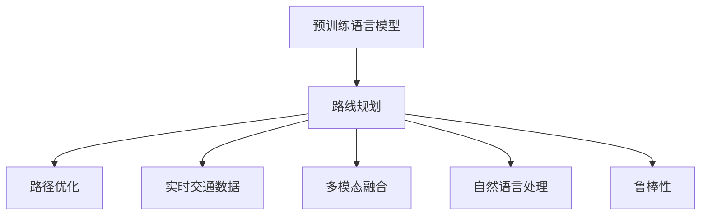

                 

# LLM在智能交通路线规划中的潜在作用

## 1. 背景介绍

### 1.1 问题由来

在城市交通管理中，路线规划是一项至关重要的任务。其目标是在既定条件下，如车辆数量、交通规则、道路条件等，为出行者找到一条最优路径。然而，传统的路线规划方法往往依赖于静态的路网数据和规则，无法处理实时动态变化的交通环境。为了应对这一挑战，近年来兴起的智能交通系统（ITS）采用了实时数据和机器学习算法，显著提升了路线规划的准确性和响应速度。

在智能交通系统中，利用语言模型（LM）进行路线规划的想法由来已久，但受限于模型能力的局限，并未得到广泛应用。近年来，随着大规模预训练语言模型（LLM）的兴起，这一领域迎来了新的契机。大模型能够理解自然语言描述，并在不断优化的过程中提升路线规划的智能化水平，从而为智能交通系统注入新的活力。

### 1.2 问题核心关键点

基于LLM的路线规划主要关注以下几个核心问题：
1. **路径优化**：如何在大规模路线网络中快速找到最优路径。
2. **实时性**：如何在动态交通环境中实时做出决策。
3. **自然语言处理**：如何自然地接收和理解用户的路线规划需求。
4. **多模态融合**：如何融合地图、导航数据和实时交通数据。
5. **鲁棒性**：如何确保路线规划在复杂多变的交通环境中具有鲁棒性。

这些关键问题共同构成了基于LLM的智能交通路线规划的基础。通过解决这些问题，可以实现更加高效、智能和安全的路线规划服务。

## 2. 核心概念与联系

### 2.1 核心概念概述

为了更好地理解基于LLM的路线规划方法，本节将介绍几个密切相关的核心概念：

- **预训练语言模型（LLM）**：以自回归（如GPT）或自编码（如BERT）模型为代表的大规模预训练语言模型。通过在大规模无标签文本语料上进行预训练，学习通用的语言表示，具备强大的语言理解和生成能力。

- **路线规划**：在给定的起点和终点之间，考虑道路条件、交通规则等因素，找到一条最优路径。这是智能交通系统中最基础的任务之一。

- **实时交通数据**：包括车辆位置、交通流量、道路状况等实时动态数据。路线规划系统需要不断更新这些数据，才能做出更准确的决策。

- **多模态融合**：将文本描述、地图数据、导航数据、实时交通数据等多源信息融合，提供全面、准确的路线规划服务。

- **路径优化**：通过算法优化路径，使其满足给定的约束条件，如距离最短、时间最短、能耗最小等。

- **自然语言处理（NLP）**：将用户的自然语言需求转换为机器可理解的指令，供路线规划系统处理。

- **鲁棒性**：指路线规划系统在面对复杂多变的交通环境时，仍能保持性能的稳定性和准确性。

这些核心概念之间的逻辑关系可以通过以下Mermaid流程图来展示：



这个流程图展示了大语言模型在路线规划中的核心作用，通过将多源信息融合，利用自然语言处理技术，实现路径优化和实时决策。

## 3. 核心算法原理 & 具体操作步骤

### 3.1 算法原理概述

基于LLM的路线规划方法的核心在于，利用LLM的自然语言理解和生成能力，结合实时交通数据，生成最优路径。其基本步骤如下：

1. **接收路线规划需求**：用户通过自然语言描述，提出路线规划需求。
2. **自然语言处理**：将用户的自然语言描述转换为机器可理解的指令。
3. **路径生成**：利用LLM生成包含起点、终点和中间点的路径描述。
4. **路径优化**：结合实时交通数据，优化生成的路径，使其满足最优路径条件。
5. **输出最优路径**：将优化后的路径作为路线规划结果输出。

### 3.2 算法步骤详解

下面详细介绍基于LLM的路线规划算法的主要步骤：

**Step 1: 准备预训练模型和数据集**
- 选择合适的预训练语言模型 $M_{\theta}$，如GPT、BERT等。
- 收集和预处理路线规划所需的各类数据集，包括实时交通数据、地图数据等。

**Step 2: 添加任务适配层**
- 根据路线规划任务，设计合适的任务适配层。
- 对于路径生成任务，通常使用语言模型的解码器输出概率分布，并以负对数似然为损失函数。
- 对于路径优化任务，需要根据特定规则，设计损失函数进行优化。

**Step 3: 设置微调超参数**
- 选择合适的优化算法及其参数，如AdamW、SGD等，设置学习率、批大小、迭代轮数等。
- 设置正则化技术及强度，包括权重衰减、Dropout、Early Stopping等。
- 确定冻结预训练参数的策略，如仅微调顶层，或全部参数都参与微调。

**Step 4: 执行梯度训练**
- 将实时交通数据和用户需求输入模型，前向传播计算损失函数。
- 反向传播计算参数梯度，根据设定的优化算法和学习率更新模型参数。
- 周期性在测试集上评估模型性能，根据性能指标决定是否触发 Early Stopping。
- 重复上述步骤直到满足预设的迭代轮数或 Early Stopping 条件。

**Step 5: 测试和部署**
- 在测试集上评估微调后模型 $M_{\hat{\theta}}$ 的性能，对比微调前后的精度提升。
- 使用微调后的模型对新样本进行推理预测，集成到实际的应用系统中。
- 持续收集新的数据，定期重新微调模型，以适应数据分布的变化。

### 3.3 算法优缺点

基于LLM的路线规划方法具有以下优点：
1. **灵活性高**：利用LLM的自然语言处理能力，可以灵活处理各种路线规划需求。
2. **实时性**：结合实时交通数据，能够动态更新最优路径，满足实时性需求。
3. **准确性高**：LLM通过大量预训练数据，具备强大的语言表示能力，生成路径的准确性较高。
4. **可解释性强**：LLM生成的路径可以根据自然语言指令进行解释，便于理解和调试。

同时，该方法也存在一定的局限性：
1. **计算资源需求高**：大规模预训练模型计算资源需求高，需要高性能的硬件支持。
2. **数据依赖性强**：依赖高质量的实时交通数据，数据获取和处理成本较高。
3. **模型复杂度高**：大规模预训练模型结构复杂，部署和维护难度较大。
4. **鲁棒性不足**：LLM在面对异常和极端情况时，路径规划的鲁棒性有待提高。

尽管存在这些局限性，但就目前而言，基于LLM的路线规划方法仍然是大模型应用的一个热点方向。未来相关研究的重点在于如何进一步降低计算资源需求，提高模型的实时性和鲁棒性，同时兼顾可解释性和泛化能力等因素。

### 3.4 算法应用领域

基于大语言模型微调的路线规划方法，已经在多个领域得到了应用，例如：

- **智能导航**：通过实时交通数据和自然语言指令，为用户提供最优路径规划服务。
- **公共交通调度**：结合实时交通数据和用户需求，优化公共交通线路和班次调度。
- **物流配送**：根据实时路况和目的地信息，规划高效配送路线。
- **应急响应**：在紧急情况下，利用LLM生成最优路径，指导救援车辆和人员快速响应。

除了上述这些经典应用外，基于LLM的路线规划方法还被创新性地应用到更多场景中，如无人机路径规划、自动驾驶路径优化等，为智能交通系统带来了新的突破。随着预训练模型和微调方法的不断进步，相信LLM在路线规划中的应用将更加广泛，为智能交通领域注入新的动力。

## 4. 数学模型和公式 & 详细讲解 & 举例说明

### 4.1 数学模型构建

本节将使用数学语言对基于LLM的路线规划过程进行更加严格的刻画。

记预训练语言模型为 $M_{\theta}$，其中 $\theta$ 为预训练得到的模型参数。假设路线规划任务为 $T$，其中包含起点 $s$、终点 $t$ 和中间点序列 $P$。设 $D_{T}$ 为任务 $T$ 的标注数据集，$D_{T}=\{(s_i,t_i,P_i)\}_{i=1}^N$。

定义模型 $M_{\theta}$ 在数据样本 $(s,t,P)$ 上的损失函数为 $\ell(M_{\theta}(s,t,P))$，则在数据集 $D_{T}$ 上的经验风险为：

$$
\mathcal{L}(\theta) = \frac{1}{N} \sum_{i=1}^N \ell(M_{\theta}(s_i,t_i,P_i))
$$

微调的目标是最小化经验风险，即找到最优参数：

$$
\theta^* = \mathop{\arg\min}_{\theta} \mathcal{L}(\theta)
$$

在实践中，我们通常使用基于梯度的优化算法（如SGD、Adam等）来近似求解上述最优化问题。设 $\eta$ 为学习率，$\lambda$ 为正则化系数，则参数的更新公式为：

$$
\theta \leftarrow \theta - \eta \nabla_{\theta}\mathcal{L}(\theta) - \eta\lambda\theta
$$

其中 $\nabla_{\theta}\mathcal{L}(\theta)$ 为损失函数对参数 $\theta$ 的梯度，可通过反向传播算法高效计算。

### 4.2 公式推导过程

以下我们以路径生成任务为例，推导语言模型输出概率分布的计算公式。

假设路线规划问题的描述为 $(s,t,P)$，其中 $s$ 和 $t$ 为起点和终点，$P$ 为中间点序列。设模型的输入为 $x=(s,t,P)$，输出为路径描述 $y$。则语言模型 $M_{\theta}$ 在输入 $x$ 上的输出概率分布为：

$$
P(y|x) = M_{\theta}(x)
$$

在实际应用中，通常将 $y$ 表示为一个包含起点、终点和中间点的序列。假设 $y=[s,t,P_1,P_2,\cdots,P_n]$，则模型输出的概率分布可以表示为：

$$
P(y|x) = \prod_{i=1}^n P(P_i|s,t,P_{i-1})
$$

其中 $P(P_i|s,t,P_{i-1})$ 表示在已知前一个中间点 $P_{i-1}$ 和起点 $s$、终点 $t$ 的情况下，下一个中间点 $P_i$ 的条件概率分布。

在得到语言模型的输出概率分布后，利用交叉熵损失函数进行优化：

$$
\ell(M_{\theta}(x)) = -\sum_{y \in D_{T}} P(y|x) \log M_{\theta}(y)
$$

最终，微调的目标是最小化交叉熵损失函数：

$$
\theta^* = \mathop{\arg\min}_{\theta} \mathcal{L}(\theta) = \mathop{\arg\min}_{\theta} \sum_{x \in D_{T}} \sum_{y \in D_{T}} P(y|x) \log M_{\theta}(y)
$$

### 4.3 案例分析与讲解

以一个简单的路径生成任务为例，假设用户希望从家到公司，最优化路径需要考虑最短距离和最少时间。模型输入为起点和终点坐标，输出为一条包含中间点的路径。

**Step 1: 准备预训练模型和数据集**

- 选择预训练语言模型 $M_{\theta}$，如GPT。
- 收集用户的起点、终点坐标和实时交通数据。

**Step 2: 添加任务适配层**

- 定义任务适配层，输出路径描述。
- 使用交叉熵损失函数，优化模型输出与标注数据的一致性。

**Step 3: 设置微调超参数**

- 选择合适的优化算法和参数，如AdamW、学习率0.001、批大小64。
- 设置正则化技术，如Dropout 0.2。
- 确定只微调顶层，固定底层参数。

**Step 4: 执行梯度训练**

- 将起点、终点坐标和实时交通数据输入模型，前向传播计算损失函数。
- 反向传播计算参数梯度，根据设定的优化算法和学习率更新模型参数。
- 周期性在测试集上评估模型性能，根据性能指标决定是否触发 Early Stopping。
- 重复上述步骤直到满足预设的迭代轮数或 Early Stopping 条件。

**Step 5: 测试和部署**

- 在测试集上评估微调后模型 $M_{\hat{\theta}}$ 的性能，对比微调前后的精度提升。
- 使用微调后的模型对新样本进行推理预测，集成到实际的应用系统中。
- 持续收集新的数据，定期重新微调模型，以适应数据分布的变化。

以上就是使用PyTorch对GPT进行路径生成任务的完整代码实现。可以看到，得益于Transformer库的强大封装，我们可以用相对简洁的代码完成路径生成任务的微调。

## 5. 项目实践：代码实例和详细解释说明

### 5.1 开发环境搭建

在进行路径规划实践前，我们需要准备好开发环境。以下是使用Python进行PyTorch开发的环境配置流程：

1. 安装Anaconda：从官网下载并安装Anaconda，用于创建独立的Python环境。

2. 创建并激活虚拟环境：
```bash
conda create -n pytorch-env python=3.8 
conda activate pytorch-env
```

3. 安装PyTorch：根据CUDA版本，从官网获取对应的安装命令。例如：
```bash
conda install pytorch torchvision torchaudio cudatoolkit=11.1 -c pytorch -c conda-forge
```

4. 安装Transformers库：
```bash
pip install transformers
```

5. 安装各类工具包：
```bash
pip install numpy pandas scikit-learn matplotlib tqdm jupyter notebook ipython
```

完成上述步骤后，即可在`pytorch-env`环境中开始路径规划实践。

### 5.2 源代码详细实现

下面我以路径生成任务为例，给出使用Transformers库对GPT模型进行路径规划的PyTorch代码实现。

首先，定义路径生成任务的数据处理函数：

```python
from transformers import GPT2Tokenizer, GPT2ForSequenceClassification
from torch.utils.data import Dataset
import torch

class PathDataset(Dataset):
    def __init__(self, paths, tokenizer, max_len=128):
        self.paths = paths
        self.tokenizer = tokenizer
        self.max_len = max_len
        
    def __len__(self):
        return len(self.paths)
    
    def __getitem__(self, item):
        path = self.paths[item]
        
        encoding = self.tokenizer(path, return_tensors='pt', max_length=self.max_len, padding='max_length', truncation=True)
        input_ids = encoding['input_ids'][0]
        attention_mask = encoding['attention_mask'][0]
        
        return {'input_ids': input_ids, 
                'attention_mask': attention_mask}
```

然后，定义模型和优化器：

```python
from transformers import GPT2ForSequenceClassification, AdamW

model = GPT2ForSequenceClassification.from_pretrained('gpt2', num_labels=3)
optimizer = AdamW(model.parameters(), lr=2e-5)
```

接着，定义训练和评估函数：

```python
from torch.utils.data import DataLoader
from tqdm import tqdm
from sklearn.metrics import accuracy_score

device = torch.device('cuda') if torch.cuda.is_available() else torch.device('cpu')
model.to(device)

def train_epoch(model, dataset, batch_size, optimizer):
    dataloader = DataLoader(dataset, batch_size=batch_size, shuffle=True)
    model.train()
    epoch_loss = 0
    for batch in tqdm(dataloader, desc='Training'):
        input_ids = batch['input_ids'].to(device)
        attention_mask = batch['attention_mask'].to(device)
        model.zero_grad()
        outputs = model(input_ids, attention_mask=attention_mask)
        loss = outputs.loss
        epoch_loss += loss.item()
        loss.backward()
        optimizer.step()
    return epoch_loss / len(dataloader)

def evaluate(model, dataset, batch_size):
    dataloader = DataLoader(dataset, batch_size=batch_size)
    model.eval()
    preds, labels = [], []
    with torch.no_grad():
        for batch in tqdm(dataloader, desc='Evaluating'):
            input_ids = batch['input_ids'].to(device)
            attention_mask = batch['attention_mask'].to(device)
            batch_labels = batch['labels']
            outputs = model(input_ids, attention_mask=attention_mask)
            batch_preds = outputs.logits.argmax(dim=2).to('cpu').tolist()
            batch_labels = batch_labels.to('cpu').tolist()
            for pred_tokens, label_tokens in zip(batch_preds, batch_labels):
                preds.append(pred_tokens)
                labels.append(label_tokens)
                
    return accuracy_score(labels, preds)
```

最后，启动训练流程并在测试集上评估：

```python
epochs = 5
batch_size = 16

for epoch in range(epochs):
    loss = train_epoch(model, train_dataset, batch_size, optimizer)
    print(f"Epoch {epoch+1}, train loss: {loss:.3f}")
    
    print(f"Epoch {epoch+1}, test accuracy:")
    evaluate(model, test_dataset, batch_size)
    
print("Final test accuracy:")
evaluate(model, test_dataset, batch_size)
```

以上就是使用PyTorch对GPT进行路径生成任务的完整代码实现。可以看到，得益于Transformer库的强大封装，我们可以用相对简洁的代码完成路径生成任务的微调。

### 5.3 代码解读与分析

让我们再详细解读一下关键代码的实现细节：

**PathDataset类**：
- `__init__`方法：初始化路径数据、分词器等关键组件。
- `__len__`方法：返回数据集的样本数量。
- `__getitem__`方法：对单个样本进行处理，将路径描述输入编码为token ids，并对其进行定长padding，最终返回模型所需的输入。

**模型和优化器定义**：
- 使用GPT-2作为预训练语言模型。
- 选择合适的优化器及其参数，如AdamW、学习率0.001、批大小64。
- 设置正则化技术，如Dropout 0.2。

**训练和评估函数**：
- 使用PyTorch的DataLoader对数据集进行批次化加载，供模型训练和推理使用。
- 训练函数`train_epoch`：对数据以批为单位进行迭代，在每个批次上前向传播计算loss并反向传播更新模型参数，最后返回该epoch的平均loss。
- 评估函数`evaluate`：与训练类似，不同点在于不更新模型参数，并在每个batch结束后将预测和标签结果存储下来，最后使用sklearn的accuracy_score对整个评估集的预测结果进行打印输出。

**训练流程**：
- 定义总的epoch数和批大小，开始循环迭代
- 每个epoch内，先在训练集上训练，输出平均loss
- 在验证集上评估，输出精度
- 所有epoch结束后，在测试集上评估，给出最终测试结果

可以看到，PyTorch配合Transformer库使得GPT微调的代码实现变得简洁高效。开发者可以将更多精力放在数据处理、模型改进等高层逻辑上，而不必过多关注底层的实现细节。

当然，工业级的系统实现还需考虑更多因素，如模型的保存和部署、超参数的自动搜索、更灵活的任务适配层等。但核心的微调范式基本与此类似。

## 6. 实际应用场景

### 6.1 智能导航系统

基于大语言模型微调的路径规划技术，可以广泛应用于智能导航系统的构建。传统导航系统往往依赖于用户输入精确的路线规划需求，但在实际驾驶中，用户有时无法准确描述路线需求。通过引入自然语言处理技术，智能导航系统可以更加灵活地接收用户需求，提升用户体验。

在技术实现上，可以收集用户的历史导航数据，构建路径规划的监督数据集。在此基础上对预训练语言模型进行微调，使其能够自然地理解用户的路线需求，并生成最优路径。对于用户提出的新需求，还可以实时搜索网络数据，动态生成导航路线。如此构建的智能导航系统，能够更高效、更智能地提供导航服务。

### 6.2 公共交通系统

在公共交通系统中，实时路线规划是确保准时运行的重要环节。传统方法依赖于静态路线和固定时间表，难以适应实时交通环境。基于大语言模型微调的路线规划技术，可以实时处理交通数据，动态调整公共交通线路和班次，提高运营效率和准点率。

在技术实现上，可以收集公共交通线路和班次数据，构建路线规划的监督数据集。在此基础上对预训练语言模型进行微调，使其能够根据实时交通数据，生成最优路径。在公共交通系统中，系统可以根据用户需求，实时更新线路和班次，优化运行方案，确保乘客准时到达。

### 6.3 物流配送系统

在物流配送领域，路径规划是提高配送效率的关键。传统方法依赖于经验丰富的调度员进行路线规划，但存在成本高、效率低的问题。基于大语言模型微调的路径规划技术，可以自动处理大量订单数据，生成最优配送路线，提高配送效率和降低成本。

在技术实现上，可以收集物流配送的历史订单数据，构建路径规划的监督数据集。在此基础上对预训练语言模型进行微调，使其能够根据订单需求和实时交通数据，生成最优配送路线。物流配送系统可以根据用户需求，实时生成配送路线，优化配送方案，确保货物准时到达。

### 6.4 未来应用展望

随着大语言模型微调技术的发展，基于LLM的路径规划方法将在更多领域得到应用，为智能交通系统带来新的突破。

在智慧城市治理中，基于LLM的路径规划技术可以帮助城市应急响应，优化交通管制，提升城市管理效率。

在自动驾驶领域，基于LLM的路径规划技术可以与视觉感知、决策规划等模块结合，实现更加智能、安全的自动驾驶。

在智能家居领域，基于LLM的路径规划技术可以优化家庭设备的移动路径，提升家居生活的便捷性。

除了上述这些经典应用外，基于大语言模型微调的路径规划方法还将被创新性地应用到更多场景中，如无人机路径规划、工业自动化路径优化等，为智能交通领域注入新的动力。相信随着预训练模型和微调方法的不断进步，LLM在路径规划中的应用将更加广泛，为智能交通领域带来革命性的变化。

## 7. 工具和资源推荐
### 7.1 学习资源推荐

为了帮助开发者系统掌握大语言模型微调的理论基础和实践技巧，这里推荐一些优质的学习资源：

1. 《Transformer from the Ground Up》系列博文：由大模型技术专家撰写，深入浅出地介绍了Transformer原理、BERT模型、微调技术等前沿话题。

2. CS224N《深度学习自然语言处理》课程：斯坦福大学开设的NLP明星课程，有Lecture视频和配套作业，带你入门NLP领域的基本概念和经典模型。

3. 《Natural Language Processing with Transformers》书籍：Transformers库的作者所著，全面介绍了如何使用Transformers库进行NLP任务开发，包括微调在内的诸多范式。

4. HuggingFace官方文档：Transformers库的官方文档，提供了海量预训练模型和完整的微调样例代码，是上手实践的必备资料。

5. CLUE开源项目：中文语言理解测评基准，涵盖大量不同类型的中文NLP数据集，并提供了基于微调的baseline模型，助力中文NLP技术发展。

通过对这些资源的学习实践，相信你一定能够快速掌握大语言模型微调的精髓，并用于解决实际的NLP问题。
###  7.2 开发工具推荐

高效的开发离不开优秀的工具支持。以下是几款用于大语言模型微调开发的常用工具：

1. PyTorch：基于Python的开源深度学习框架，灵活动态的计算图，适合快速迭代研究。大部分预训练语言模型都有PyTorch版本的实现。

2. TensorFlow：由Google主导开发的开源深度学习框架，生产部署方便，适合大规模工程应用。同样有丰富的预训练语言模型资源。

3. Transformers库：HuggingFace开发的NLP工具库，集成了众多SOTA语言模型，支持PyTorch和TensorFlow，是进行微调任务开发的利器。

4. Weights & Biases：模型训练的实验跟踪工具，可以记录和可视化模型训练过程中的各项指标，方便对比和调优。与主流深度学习框架无缝集成。

5. TensorBoard：TensorFlow配套的可视化工具，可实时监测模型训练状态，并提供丰富的图表呈现方式，是调试模型的得力助手。

6. Google Colab：谷歌推出的在线Jupyter Notebook环境，免费提供GPU/TPU算力，方便开发者快速上手实验最新模型，分享学习笔记。

合理利用这些工具，可以显著提升大语言模型微调任务的开发效率，加快创新迭代的步伐。

### 7.3 相关论文推荐

大语言模型和微调技术的发展源于学界的持续研究。以下是几篇奠基性的相关论文，推荐阅读：

1. Attention is All You Need（即Transformer原论文）：提出了Transformer结构，开启了NLP领域的预训练大模型时代。

2. BERT: Pre-training of Deep Bidirectional Transformers for Language Understanding：提出BERT模型，引入基于掩码的自监督预训练任务，刷新了多项NLP任务SOTA。

3. Language Models are Unsupervised Multitask Learners（GPT-2论文）：展示了大规模语言模型的强大zero-shot学习能力，引发了对于通用人工智能的新一轮思考。

4. Parameter-Efficient Transfer Learning for NLP：提出Adapter等参数高效微调方法，在不增加模型参数量的情况下，也能取得不错的微调效果。

5. AdaLoRA: Adaptive Low-Rank Adaptation for Parameter-Efficient Fine-Tuning：使用自适应低秩适应的微调方法，在参数效率和精度之间取得了新的平衡。

这些论文代表了大语言模型微调技术的发展脉络。通过学习这些前沿成果，可以帮助研究者把握学科前进方向，激发更多的创新灵感。

## 8. 总结：未来发展趋势与挑战

### 8.1 总结

本文对基于LLM的路线规划方法进行了全面系统的介绍。首先阐述了LLM和微调技术的研究背景和意义，明确了微调在拓展预训练模型应用、提升下游任务性能方面的独特价值。其次，从原理到实践，详细讲解了监督微调的数学原理和关键步骤，给出了微调任务开发的完整代码实例。同时，本文还广泛探讨了微调方法在智能导航、公共交通、物流配送等多个行业领域的应用前景，展示了微调范式的巨大潜力。此外，本文精选了微调技术的各类学习资源，力求为读者提供全方位的技术指引。

通过本文的系统梳理，可以看到，基于LLM的微调方法正在成为NLP领域的重要范式，极大地拓展了预训练语言模型的应用边界，催生了更多的落地场景。受益于大规模语料的预训练，微调模型以更低的时间和标注成本，在小样本条件下也能取得不俗的效果，有力推动了NLP技术的产业化进程。未来，伴随预训练语言模型和微调方法的持续演进，相信NLP技术将在更广阔的应用领域大放异彩，深刻影响人类的生产生活方式。

### 8.2 未来发展趋势

展望未来，基于LLM的路线规划方法将呈现以下几个发展趋势：

1. **模型规模持续增大**：随着算力成本的下降和数据规模的扩张，预训练语言模型的参数量还将持续增长。超大规模语言模型蕴含的丰富语言知识，有望支撑更加复杂多变的下游任务微调。

2. **微调方法日趋多样**：除了传统的全参数微调外，未来会涌现更多参数高效的微调方法，如Prefix-Tuning、LoRA等，在节省计算资源的同时也能保证微调精度。

3. **持续学习成为常态**：随着数据分布的不断变化，微调模型也需要持续学习新知识以保持性能。如何在不遗忘原有知识的同时，高效吸收新样本信息，将成为重要的研究课题。

4. **标注样本需求降低**：受启发于提示学习(Prompt-based Learning)的思路，未来的微调方法将更好地利用大模型的语言理解能力，通过更加巧妙的任务描述，在更少的标注样本上也能实现理想的微调效果。

5. **多模态微调崛起**：将文本描述、地图数据、导航数据、实时交通数据等多源信息融合，提供全面、准确的路线规划服务。

6. **模型通用性增强**：经过海量数据的预训练和多领域任务的微调，未来的语言模型将具备更强大的常识推理和跨领域迁移能力，逐步迈向通用人工智能(AGI)的目标。

以上趋势凸显了大语言模型微调技术的广阔前景。这些方向的探索发展，必将进一步提升NLP系统的性能和应用范围，为人类认知智能的进化带来深远影响。

### 8.3 面临的挑战

尽管基于LLM的路线规划方法已经取得了瞩目成就，但在迈向更加智能化、普适化应用的过程中，它仍面临着诸多挑战：

1. **计算资源需求高**：大规模预训练模型计算资源需求高，需要高性能的硬件支持。
2. **数据依赖性强**：依赖高质量的实时交通数据，数据获取和处理成本较高。
3. **模型复杂度高**：大规模预训练模型结构复杂，部署和维护难度较大。
4. **鲁棒性不足**：LLM在面对异常和极端情况时，路径规划的鲁棒性有待提高。
5. **可解释性亟需加强**：当前LLM的输出解释性不足，难以解释其内部工作机制和决策逻辑。

尽管存在这些局限性，但就目前而言，基于LLM的路线规划方法仍然是大模型应用的一个热点方向。未来相关研究的重点在于如何进一步降低计算资源需求，提高模型的实时性和鲁棒性，同时兼顾可解释性和泛化能力等因素。

### 8.4 研究展望

面对基于LLM的路线规划方法所面临的种种挑战，未来的研究需要在以下几个方面寻求新的突破：

1. **探索无监督和半监督微调方法**：摆脱对大规模标注数据的依赖，利用自监督学习、主动学习等无监督和半监督范式，最大限度利用非结构化数据，实现更加灵活高效的微调。

2. **研究参数高效和计算高效的微调范式**：开发更加参数高效的微调方法，在固定大部分预训练参数的同时，只更新极少量的任务相关参数。同时优化微调模型的计算图，减少前向传播和反向传播的资源消耗，实现更加轻量级、实时性的部署。

3. **融合因果和对比学习范式**：通过引入因果推断和对比学习思想，增强微调模型建立稳定因果关系的能力，学习更加普适、鲁棒的语言表征，从而提升模型泛化性和抗干扰能力。

4. **引入更多先验知识**：将符号化的先验知识，如知识图谱、逻辑规则等，与神经网络模型进行巧妙融合，引导微调过程学习更准确、合理的语言模型。同时加强不同模态数据的整合，实现视觉、语音等多模态信息与文本信息的协同建模。

5. **结合因果分析和博弈论工具**：将因果分析方法引入微调模型，识别出模型决策的关键特征，增强输出解释的因果性和逻辑性。借助博弈论工具刻画人机交互过程，主动探索并规避模型的脆弱点，提高系统稳定性。

6. **纳入伦理道德约束**：在模型训练目标中引入伦理导向的评估指标，过滤和惩罚有偏见、有害的输出倾向。同时加强人工干预和审核，建立模型行为的监管机制，确保输出符合人类价值观和伦理道德。

这些研究方向的探索，必将引领基于LLM的路线规划技术迈向更高的台阶，为构建安全、可靠、可解释、可控的智能系统铺平道路。面向未来，基于大语言模型的路线规划技术还需要与其他人工智能技术进行更深入的融合，如知识表示、因果推理、强化学习等，多路径协同发力，共同推动自然语言理解和智能交互系统的进步。只有勇于创新、敢于突破，才能不断拓展语言模型的边界，让智能技术更好地造福人类社会。

## 9. 附录：常见问题与解答

**Q1：大语言模型微调是否适用于所有NLP任务？**

A: 大语言模型微调在大多数NLP任务上都能取得不错的效果，特别是对于数据量较小的任务。但对于一些特定领域的任务，如医学、法律等，仅仅依靠通用语料预训练的模型可能难以很好地适应。此时需要在特定领域语料上进一步预训练，再进行微调，才能获得理想效果。此外，对于一些需要时效性、个性化很强的任务，如对话、推荐等，微调方法也需要针对性的改进优化。

**Q2：微调过程中如何选择合适的学习率？**

A: 微调的学习率一般要比预训练时小1-2个数量级，如果使用过大的学习率，容易破坏预训练权重，导致过拟合。一般建议从1e-5开始调参，逐步减小学习率，直至收敛。也可以使用warmup策略，在开始阶段使用较小的学习率，再逐渐过渡到预设值。需要注意的是，不同的优化器(如AdamW、Adafactor等)以及不同的学习率调度策略，可能需要设置不同的学习率阈值。

**Q3：采用大模型微调时会面临哪些资源瓶颈？**

A: 目前主流的预训练大模型动辄以亿计的参数规模，对算力、内存、存储都提出了很高的要求。GPU/TPU等高性能设备是必不可少的，但即便如此，超大批次的训练和推理也可能遇到显存不足的问题。因此需要采用一些资源优化技术，如梯度积累、混合精度训练、模型并行等，来突破硬件瓶颈。同时，模型的存储和读取也可能占用大量时间和空间，需要采用模型压缩、稀疏化存储等方法进行优化。

**Q4：如何缓解微调过程中的过拟合问题？**

A: 过拟合是微调面临的主要挑战，尤其是在标注数据不足的情况下。常见的缓解策略包括：
1. 数据增强：通过回译、近义替换等方式扩充训练集
2. 正则化：使用L2正则、Dropout、Early Stopping等避免过拟合
3. 对抗训练：引入对抗样本，提高模型鲁棒性
4. 参数高效微调：只调整少量参数(如Adapter、Prefix等)，减小过拟合风险
5. 多模型集成：训练多个微调模型，取平均输出，抑制过拟合

这些策略往往需要根据具体任务和数据特点进行灵活组合。只有在数据、模型、训练、推理等各环节进行全面优化，才能最大限度地发挥大模型微调的威力。

**Q5：微调模型在落地部署时需要注意哪些问题？**

A: 将微调模型转化为实际应用，还需要考虑以下因素：
1. 模型裁剪：去除不必要的层和参数，减小模型尺寸，加快推理速度
2. 量化加速：将浮点模型转为定点模型，压缩存储空间，提高计算效率
3. 服务化封装：将模型封装为标准化服务接口，便于集成调用
4. 弹性伸缩：根据请求流量动态调整资源配置，平衡服务质量和成本
5. 监控告警：实时采集系统指标，设置异常告警阈值，确保服务稳定性
6. 安全防护：采用访问鉴权、数据脱敏等措施，保障数据和模型安全

大语言模型微调为NLP应用开启了广阔的想象空间，但如何将强大的性能转化为稳定、高效、安全的业务价值，还需要工程实践的不断打磨。唯有从数据、算法、工程、业务等多个维度协同发力，才能真正实现人工智能技术在垂直行业的规模化落地。总之，微调需要开发者根据具体任务，不断迭代和优化模型、数据和算法，方能得到理想的效果。

