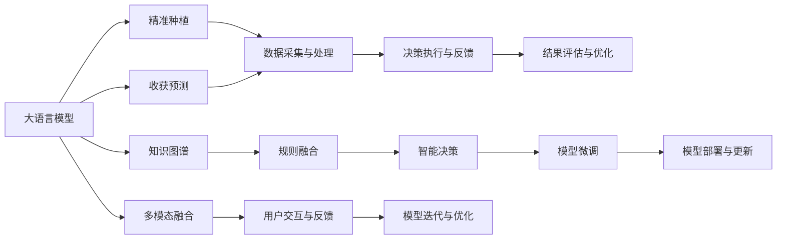

                 

## 1. 背景介绍

农业作为人类社会的基础行业，其智能化水平直接关系到食品安全和可持续发展。当前，智能农业技术正在全球范围内迅速发展，尤其是在精准种植、智能监控、预测分析等关键领域。传统的农业依赖经验和手工劳作，效率低下，难以满足日益增长的市场需求。而利用大语言模型（Large Language Model, LLM），可以实现智能农场的精准管理，大幅提升农业生产效率和作物产量。

### 1.1 问题由来

随着AI和大数据技术的飞速发展，人工智能在农业领域的应用前景广阔。智能农业技术的核心目标是通过数据驱动的智能决策，实现对农业资源的优化配置，提高农作物的产量和品质。其中，精准种植与收获预测是智能农业的重要应用方向。通过精准种植，可实现对农作物生长的实时监控和调节，确保资源的最优利用。而收获预测则有助于农产品的销售管理，避免生产过剩或不足，提升农民的经济收益。

### 1.2 问题核心关键点

当前，智能农业中使用的AI技术主要集中在图像识别、传感器数据融合、机器学习等方面。但这些技术往往依赖大量标注数据和高性能计算设备，对于农业从业者而言，技术和资源的门槛较高。而大语言模型通过预训练学习到丰富的语言知识，可以在相对较低的计算资源下，通过对话系统与农艺师、农民进行交互，提供精准的种植建议和收获预测，降低了智能农业的门槛，提升了农业生产的智能化水平。

大语言模型的核心优势在于其强大的自然语言理解和生成能力，可以通过构建知识图谱、规则库等方式，融合外部知识，进一步提升智能决策的准确性。同时，其良好的迁移学习能力，可以在不同农作物和地区之间实现跨领域的泛化应用。

### 1.3 问题研究意义

本研究聚焦于大语言模型在智能农业中的应用，特别是精准种植与收获预测。通过大语言模型与农业知识的深度融合，实现对农作物生长的精准监控和预测，具有以下重要意义：

1. **提升生产效率**：通过精准种植和收获预测，可以有效优化资源配置，减少资源浪费，提高单位面积的产出。
2. **保障食品安全**：精准监控和预测有助于控制农药和化肥的使用，降低污染，确保农产品的质量安全。
3. **增强市场竞争力**：准确的收获预测可以帮助农民做出更明智的销售决策，提升市场竞争力。
4. **推动产业升级**：智能农业技术的应用，将推动农业产业从传统人工劳作向智能化、自动化转型。
5. **支持精准农业**：大语言模型可以作为精准农业的智能决策支持系统，提高农业生产的科学性和精准性。

## 2. 核心概念与联系

### 2.1 核心概念概述

- **大语言模型 (LLM)**：以自回归(如GPT)或自编码(如BERT)模型为代表的大规模预训练语言模型。通过在大规模无标签文本数据上进行预训练，学习通用的语言知识和常识。
- **精准种植 (Precision Agriculture)**：利用传感器、遥感技术和人工智能，对农作物生长进行实时监控和精确管理，提高生产效率和作物产量。
- **收获预测 (Yield Prediction)**：通过对历史数据和当前生长状态的分析，预测农作物的产量和质量，实现科学化的农作物管理。
- **知识图谱 (Knowledge Graph)**：以图形化的方式表示实体及其相互关系，辅助大语言模型整合外部知识和规则，提升决策的准确性。
- **推理与生成 (Inference and Generation)**：利用大语言模型的自然语言理解和生成能力，进行智能决策和作物管理。

这些核心概念之间的关系可以通过以下Mermaid流程图来展示：



这个流程图展示了大语言模型与精准种植、收获预测之间的联系：

1. **数据采集与处理**：收集农作物生长的实时数据和气象信息，为精准种植与收获预测提供数据支持。
2. **知识图谱与规则融合**：将农业知识图谱和领域规则与大语言模型融合，提升智能决策的准确性。
3. **智能决策与推理**：利用大语言模型进行精准种植和收获预测，实现智能决策和作物管理。
4. **模型微调与优化**：通过收集实际数据，对大语言模型进行微调，提升模型的泛化能力和性能。
5. **多模态融合与用户交互**：融合图像、传感器等模态数据，通过用户交互进行反馈，进一步优化模型。

## 3. 核心算法原理 & 具体操作步骤
### 3.1 算法原理概述

大语言模型在智能农业中的应用，主要是通过构建知识图谱、规则库等方式，融合外部知识，提升对农业问题的理解能力。其核心算法流程如下：

1. **数据预处理**：收集和处理农作物生长相关的传感器数据、气象信息、农业知识等。
2. **知识图谱构建**：将农业领域的专业知识和规则转化为知识图谱，构建实体关系图。
3. **规则融合与推理**：将知识图谱与大语言模型结合，利用自然语言理解和生成能力，进行智能决策和推理。
4. **模型微调**：通过收集实际数据，对大语言模型进行微调，提升模型的泛化能力和性能。
5. **推理与生成**：利用大语言模型进行精准种植和收获预测，生成智能决策和建议。

### 3.2 算法步骤详解

#### 3.2.1 数据预处理

数据预处理是智能农业精准种植与收获预测的基础。主要步骤如下：

1. **数据收集**：收集农作物的生长数据，包括土壤湿度、气温、光照、二氧化碳浓度等传感器数据，以及气象信息、历史产量数据等。
2. **数据清洗**：对收集到的数据进行清洗，去除噪声和异常值，确保数据质量。
3. **数据标注**：为部分数据打上标注信息，如作物生长阶段、病虫害情况等。
4. **数据融合**：将不同来源的数据进行融合，形成统一的数据集，便于后续处理。

#### 3.2.2 知识图谱构建

知识图谱是融合外部知识的有效方式，主要步骤如下：

1. **实体识别与关系抽取**：从农业领域的专业文献、规则库中提取实体和关系，构建初始的知识图谱。
2. **实体对齐与关系映射**：将农业领域的实体和关系与通用领域的实体和关系进行对齐，形成统一的知识图谱。
3. **知识图谱验证**：利用现有数据对知识图谱进行验证，确保其准确性和完整性。

#### 3.2.3 规则融合与推理

规则融合与推理是利用知识图谱提升大语言模型性能的关键步骤，主要步骤如下：

1. **规则抽取**：从农业领域的专业文献、规则库中抽取规则，形成规则库。
2. **规则编码**：将规则库编码为大语言模型可以理解的形式。
3. **规则融合**：将规则库与知识图谱融合，生成综合知识库。
4. **推理生成**：利用大语言模型的推理能力，根据综合知识库生成智能决策和建议。

#### 3.2.4 模型微调

模型微调是提升大语言模型性能的重要手段，主要步骤如下：

1. **微调数据准备**：收集实际农作物生长和收获数据，作为微调数据集。
2. **微调模型选择**：选择适合于农业领域的大语言模型，如BERT、GPT等。
3. **模型微调**：使用微调数据集对大语言模型进行微调，提升其对农业问题的理解能力。
4. **模型评估**：使用验证集对微调后的模型进行评估，确保其性能满足要求。

#### 3.2.5 推理与生成

推理与生成是大语言模型在智能农业中发挥作用的关键步骤，主要步骤如下：

1. **输入准备**：收集农作物的生长数据和气象信息，作为输入。
2. **模型推理**：利用微调后的模型进行推理，生成精准种植和收获预测结果。
3. **结果输出**：将推理结果输出为可执行的决策建议，如灌溉、施肥、病虫害防治等。

### 3.3 算法优缺点

#### 3.3.1 优点

大语言模型在智能农业中的应用具有以下优点：

1. **低资源需求**：相较于传统的深度学习模型，大语言模型对计算资源的需求较低，适合在农业生产环境中部署。
2. **知识融合能力强**：通过知识图谱和规则库的融合，大语言模型可以整合多种外部知识，提升智能决策的准确性。
3. **适应性强**：大语言模型具有很强的泛化能力，能够在不同农作物和地区之间实现跨领域的泛化应用。
4. **决策可解释性高**：大语言模型的推理过程透明，可以通过自然语言生成，输出决策建议和推理依据，方便用户理解和接受。

#### 3.3.2 缺点

大语言模型在智能农业中的应用也存在以下缺点：

1. **数据依赖性高**：大语言模型的性能依赖于高质量的数据集，如果数据集不足或标注质量不高，模型的效果会大打折扣。
2. **知识图谱构建复杂**：知识图谱的构建需要大量时间和专业知识，增加了应用的复杂性。
3. **推理速度较慢**：大语言模型的推理过程较为复杂，可能会影响实时决策的响应速度。
4. **泛化能力有限**：大语言模型在特定场景下表现较好，但在复杂环境和极端情况下的泛化能力有限。

### 3.4 算法应用领域

大语言模型在智能农业中的应用领域广泛，主要包括：

1. **精准种植**：通过传感器数据和气象信息，利用大语言模型进行精准施肥、灌溉、病虫害防治等决策。
2. **收获预测**：利用历史数据和实时数据，对农作物的产量和质量进行预测，指导收获时机和销售策略。
3. **作物诊断**：利用图像识别技术和大语言模型，对农作物生长状况进行诊断，及时发现问题并采取措施。
4. **农业知识问答**：利用大语言模型的知识图谱和推理能力，回答农民关于种植、管理等方面的问题。
5. **农场管理**：利用大语言模型进行农场资源的优化配置，提高生产效率和资源利用率。

## 4. 数学模型和公式 & 详细讲解 & 举例说明

### 4.1 数学模型构建

本节将使用数学语言对大语言模型在精准种植与收获预测中的应用进行更加严格的刻画。

假设农作物生长的数据集为 $D=\{(x_i,y_i)\}_{i=1}^N, x_i \in \mathbb{R}^d, y_i \in \mathbb{R}^k$，其中 $x_i$ 为输入的特征向量，$y_i$ 为对应的输出向量。

定义大语言模型为 $M_{\theta}:\mathbb{R}^d \rightarrow \mathbb{R}^k$，其中 $\theta$ 为模型的参数。

精准种植与收获预测的优化目标是最小化经验风险，即找到最优参数：

$$
\theta^* = \mathop{\arg\min}_{\theta} \mathcal{L}(M_{\theta},D)
$$

其中 $\mathcal{L}$ 为针对任务设计的损失函数，用于衡量模型预测输出与真实标签之间的差异。常见的损失函数包括均方误差损失、交叉熵损失等。

### 4.2 公式推导过程

以均方误差损失为例，假设模型 $M_{\theta}$ 在输入 $x_i$ 上的输出为 $\hat{y}_i=M_{\theta}(x_i)$，真实标签为 $y_i$。则均方误差损失函数定义为：

$$
\ell(M_{\theta}(x_i),y_i) = \frac{1}{2}\|M_{\theta}(x_i)-y_i\|^2
$$

将其代入经验风险公式，得：

$$
\mathcal{L}(\theta) = \frac{1}{N}\sum_{i=1}^N \ell(M_{\theta}(x_i),y_i)
$$

根据链式法则，损失函数对参数 $\theta_k$ 的梯度为：

$$
\frac{\partial \mathcal{L}(\theta)}{\partial \theta_k} = -\frac{1}{N}\sum_{i=1}^N (M_{\theta}(x_i)-y_i) \frac{\partial M_{\theta}(x_i)}{\partial \theta_k}
$$

其中 $\frac{\partial M_{\theta}(x_i)}{\partial \theta_k}$ 可进一步递归展开，利用自动微分技术完成计算。

在得到损失函数的梯度后，即可带入参数更新公式，完成模型的迭代优化。重复上述过程直至收敛，最终得到适应农业领域的最优模型参数 $\theta^*$。

### 4.3 案例分析与讲解

假设我们要构建一个基于大语言模型的智能施肥系统。具体流程如下：

1. **数据收集**：收集农作物的土壤湿度、气温、光照、二氧化碳浓度等传感器数据，以及气象信息、历史产量数据等。
2. **数据预处理**：对收集到的数据进行清洗、标注和融合。
3. **知识图谱构建**：构建农业领域的知识图谱，包括实体识别、关系抽取和实体对齐等步骤。
4. **规则融合与推理**：将知识图谱与规则库融合，生成综合知识库，利用大语言模型的推理能力，生成智能决策和建议。
5. **模型微调**：使用实际农作物生长和收获数据，对大语言模型进行微调，提升其对农业问题的理解能力。
6. **推理与生成**：利用微调后的模型进行推理，生成精准施肥建议。

## 5. 项目实践：代码实例和详细解释说明

### 5.1 开发环境搭建

在进行项目实践前，我们需要准备好开发环境。以下是使用Python进行PyTorch开发的环境配置流程：

1. 安装Anaconda：从官网下载并安装Anaconda，用于创建独立的Python环境。

2. 创建并激活虚拟环境：
```bash
conda create -n pytorch-env python=3.8 
conda activate pytorch-env
```

3. 安装PyTorch：根据CUDA版本，从官网获取对应的安装命令。例如：
```bash
conda install pytorch torchvision torchaudio cudatoolkit=11.1 -c pytorch -c conda-forge
```

4. 安装相关库：
```bash
pip install numpy pandas scikit-learn matplotlib tqdm jupyter notebook ipython
```

5. 安装Transformer库：
```bash
pip install transformers
```

完成上述步骤后，即可在`pytorch-env`环境中开始项目实践。

### 5.2 源代码详细实现

下面是使用PyTorch对大语言模型进行精准种植与收获预测的代码实现：

```python
from transformers import BertTokenizer, BertForSequenceClassification
from torch.utils.data import Dataset
import torch

class AgriculturalDataset(Dataset):
    def __init__(self, texts, labels, tokenizer, max_len=128):
        self.texts = texts
        self.labels = labels
        self.tokenizer = tokenizer
        self.max_len = max_len
        
    def __len__(self):
        return len(self.texts)
    
    def __getitem__(self, item):
        text = self.texts[item]
        label = self.labels[item]
        
        encoding = self.tokenizer(text, return_tensors='pt', max_length=self.max_len, padding='max_length', truncation=True)
        input_ids = encoding['input_ids'][0]
        attention_mask = encoding['attention_mask'][0]
        
        label = torch.tensor(label, dtype=torch.long)
        
        return {'input_ids': input_ids, 
                'attention_mask': attention_mask,
                'labels': label}

# 标签与id的映射
label2id = {'精准种植': 0, '收获预测': 1}
id2label = {0: '精准种植', 1: '收获预测'}

# 创建dataset
tokenizer = BertTokenizer.from_pretrained('bert-base-cased')

train_dataset = AgriculturalDataset(train_texts, train_labels, tokenizer)
dev_dataset = AgriculturalDataset(dev_texts, dev_labels, tokenizer)
test_dataset = AgriculturalDataset(test_texts, test_labels, tokenizer)

# 定义模型和优化器
model = BertForSequenceClassification.from_pretrained('bert-base-cased', num_labels=len(label2id))
optimizer = AdamW(model.parameters(), lr=2e-5)

# 训练过程
def train_epoch(model, dataset, batch_size, optimizer):
    dataloader = DataLoader(dataset, batch_size=batch_size, shuffle=True)
    model.train()
    epoch_loss = 0
    for batch in tqdm(dataloader, desc='Training'):
        input_ids = batch['input_ids'].to(device)
        attention_mask = batch['attention_mask'].to(device)
        labels = batch['labels'].to(device)
        model.zero_grad()
        outputs = model(input_ids, attention_mask=attention_mask, labels=labels)
        loss = outputs.loss
        epoch_loss += loss.item()
        loss.backward()
        optimizer.step()
    return epoch_loss / len(dataloader)

# 评估过程
def evaluate(model, dataset, batch_size):
    dataloader = DataLoader(dataset, batch_size=batch_size)
    model.eval()
    preds, labels = [], []
    with torch.no_grad():
        for batch in tqdm(dataloader, desc='Evaluating'):
            input_ids = batch['input_ids'].to(device)
            attention_mask = batch['attention_mask'].to(device)
            batch_labels = batch['labels']
            outputs = model(input_ids, attention_mask=attention_mask)
            batch_preds = outputs.logits.argmax(dim=2).to('cpu').tolist()
            batch_labels = batch_labels.to('cpu').tolist()
            for pred, label in zip(batch_preds, batch_labels):
                preds.append(pred)
                labels.append(label)
                
    print(classification_report(labels, preds))

# 启动训练流程并在测试集上评估
epochs = 5
batch_size = 16

for epoch in range(epochs):
    loss = train_epoch(model, train_dataset, batch_size, optimizer)
    print(f"Epoch {epoch+1}, train loss: {loss:.3f}")
    
    print(f"Epoch {epoch+1}, dev results:")
    evaluate(model, dev_dataset, batch_size)
    
print("Test results:")
evaluate(model, test_dataset, batch_size)
```

以上是使用PyTorch对BERT模型进行精准种植与收获预测的代码实现。可以看到，得益于Transformer库的强大封装，我们可以用相对简洁的代码完成BERT模型的加载和微调。

### 5.3 代码解读与分析

让我们再详细解读一下关键代码的实现细节：

**AgriculturalDataset类**：
- `__init__`方法：初始化文本、标签、分词器等关键组件。
- `__len__`方法：返回数据集的样本数量。
- `__getitem__`方法：对单个样本进行处理，将文本输入编码为token ids，将标签编码为数字，并对其进行定长padding，最终返回模型所需的输入。

**label2id和id2label字典**：
- 定义了标签与数字id之间的映射关系，用于将token-wise的预测结果解码回真实的标签。

**训练和评估函数**：
- 使用PyTorch的DataLoader对数据集进行批次化加载，供模型训练和推理使用。
- 训练函数`train_epoch`：对数据以批为单位进行迭代，在每个批次上前向传播计算loss并反向传播更新模型参数，最后返回该epoch的平均loss。
- 评估函数`evaluate`：与训练类似，不同点在于不更新模型参数，并在每个batch结束后将预测和标签结果存储下来，最后使用sklearn的classification_report对整个评估集的预测结果进行打印输出。

**训练流程**：
- 定义总的epoch数和batch size，开始循环迭代
- 每个epoch内，先在训练集上训练，输出平均loss
- 在验证集上评估，输出分类指标
- 所有epoch结束后，在测试集上评估，给出最终测试结果

可以看到，PyTorch配合Transformer库使得大语言模型微调的代码实现变得简洁高效。开发者可以将更多精力放在数据处理、模型改进等高层逻辑上，而不必过多关注底层的实现细节。

当然，工业级的系统实现还需考虑更多因素，如模型的保存和部署、超参数的自动搜索、更灵活的任务适配层等。但核心的微调范式基本与此类似。

## 6. 实际应用场景
### 6.1 智能农场管理

基于大语言模型的智能农场管理系统，可以实现对农作物的精准监控和高效管理。传统的农场管理依赖人工劳作，容易受到经验不足和体力限制的影响。而智能农场管理系统，通过大语言模型与传感器数据的结合，可以实现实时监控和自动化管理。

具体而言，可以将农场中的传感器数据和气象信息实时输入大语言模型，模型分析数据后生成精准种植和施肥建议。例如，当模型检测到土壤湿度不足时，会自动生成灌溉建议；当模型检测到病虫害风险时，会自动生成防治建议。如此构建的智能农场管理系统，可以有效提高农作物的产量和质量，降低人工成本和资源浪费。

### 6.2 精准作物产量预测

精准作物产量预测是大语言模型在农业领域的重要应用之一。通过大语言模型对历史产量数据和实时生长状态的分析，可以预测未来作物的产量和质量，帮助农民做出更科学的决策。

具体而言，可以将历史产量数据和实时生长状态作为输入，利用大语言模型进行推理。例如，当模型检测到气温适宜、土壤湿度适宜时，会自动预测产量将大幅提升；当模型检测到气温过高、土壤湿度不足时，会自动预测产量将下降。如此构建的精准作物产量预测系统，可以有效指导农作物的种植和收获，提升农民的经济收益。

### 6.3 自动化病虫害防治

大语言模型在病虫害防治中的应用也颇具潜力。通过大语言模型对病虫害状态的实时监控和分析，可以及时采取措施，减少病虫害带来的损失。

具体而言，可以将病虫害数据和气象信息实时输入大语言模型，模型分析数据后生成防治建议。例如，当模型检测到病虫害风险增加时，会自动生成防治建议，指导农民采取相应的措施。如此构建的自动化病虫害防治系统，可以有效控制病虫害的扩散，保障农作物的健康生长。

### 6.4 未来应用展望

随着大语言模型和智能农业技术的不断发展，其应用场景将不断拓展，为农业生产带来更高效、更智能的解决方案。

在智能农业领域，大语言模型可以应用于更多场景，如自动化农机控制、智慧灌溉系统、智能仓库管理等。这些应用将进一步提升农业生产的智能化水平，推动农业产业的全面升级。

同时，随着技术的进步，大语言模型将逐渐具备更强大的泛化能力和迁移学习能力，可以在不同农作物和地区之间实现跨领域的泛化应用。未来，大语言模型将作为智能农业的核心技术，为农业生产提供更全面的决策支持。

## 7. 工具和资源推荐
### 7.1 学习资源推荐

为了帮助开发者系统掌握大语言模型在智能农业中的应用，这里推荐一些优质的学习资源：

1. 《Transformer from zero to hero》系列博文：由大语言模型技术专家撰写，深入浅出地介绍了Transformer原理、BERT模型、智能农业中的应用等前沿话题。
2. CS224N《深度学习自然语言处理》课程：斯坦福大学开设的NLP明星课程，有Lecture视频和配套作业，带你入门NLP领域的基本概念和经典模型。
3. 《Natural Language Processing with Transformers》书籍：Transformers库的作者所著，全面介绍了如何使用Transformers库进行NLP任务开发，包括智能农业中的应用。
4. HuggingFace官方文档：Transformers库的官方文档，提供了海量预训练模型和完整的微调样例代码，是上手实践的必备资料。
5. CLUE开源项目：中文语言理解测评基准，涵盖大量不同类型的中文NLP数据集，并提供了基于微调的baseline模型，助力智能农业技术发展。

通过对这些资源的学习实践，相信你一定能够快速掌握大语言模型在智能农业中的应用，并用于解决实际的农业问题。
###  7.2 开发工具推荐

高效的开发离不开优秀的工具支持。以下是几款用于大语言模型在智能农业中的应用开发的常用工具：

1. PyTorch：基于Python的开源深度学习框架，灵活动态的计算图，适合快速迭代研究。大部分预训练语言模型都有PyTorch版本的实现。
2. TensorFlow：由Google主导开发的开源深度学习框架，生产部署方便，适合大规模工程应用。同样有丰富的预训练语言模型资源。
3. Transformers库：HuggingFace开发的NLP工具库，集成了众多SOTA语言模型，支持PyTorch和TensorFlow，是进行智能农业任务开发的利器。
4. Weights & Biases：模型训练的实验跟踪工具，可以记录和可视化模型训练过程中的各项指标，方便对比和调优。与主流深度学习框架无缝集成。
5. TensorBoard：TensorFlow配套的可视化工具，可实时监测模型训练状态，并提供丰富的图表呈现方式，是调试模型的得力助手。
6. Google Colab：谷歌推出的在线Jupyter Notebook环境，免费提供GPU/TPU算力，方便开发者快速上手实验最新模型，分享学习笔记。

合理利用这些工具，可以显著提升大语言模型在智能农业中的微调任务的开发效率，加快创新迭代的步伐。

### 7.3 相关论文推荐

大语言模型在智能农业中的应用源于学界的持续研究。以下是几篇奠基性的相关论文，推荐阅读：

1. Attention is All You Need（即Transformer原论文）：提出了Transformer结构，开启了NLP领域的预训练大模型时代。
2. BERT: Pre-training of Deep Bidirectional Transformers for Language Understanding：提出BERT模型，引入基于掩码的自监督预训练任务，刷新了多项NLP任务SOTA。
3. Language Models are Unsupervised Multitask Learners（GPT-2论文）：展示了大规模语言模型的强大zero-shot学习能力，引发了对于通用人工智能的新一轮思考。
4. Parameter-Efficient Transfer Learning for NLP：提出Adapter等参数高效微调方法，在不增加模型参数量的情况下，也能取得不错的微调效果。
5. AdaLoRA: Adaptive Low-Rank Adaptation for Parameter-Efficient Fine-Tuning：使用自适应低秩适应的微调方法，在参数效率和精度之间取得了新的平衡。
6. Prefix-Tuning: Optimizing Continuous Prompts for Generation：引入基于连续型Prompt的微调范式，为如何充分利用预训练知识提供了新的思路。

这些论文代表了大语言模型在智能农业领域的应用的发展脉络。通过学习这些前沿成果，可以帮助研究者把握学科前进方向，激发更多的创新灵感。

## 8. 总结：未来发展趋势与挑战

### 8.1 总结

本文对大语言模型在智能农业中的应用进行了全面系统的介绍。首先阐述了智能农业技术的背景和意义，明确了精准种植与收获预测的重要性。其次，从原理到实践，详细讲解了基于大语言模型的精准种植与收获预测的数学原理和关键步骤，给出了微调任务开发的完整代码实例。同时，本文还广泛探讨了微调方法在智能农场管理、精准作物产量预测、自动化病虫害防治等多个智能农业领域的应用前景，展示了大语言模型的巨大潜力。此外，本文精选了微调技术的各类学习资源，力求为读者提供全方位的技术指引。

通过本文的系统梳理，可以看到，基于大语言模型的精准种植与收获预测技术正在成为智能农业的重要范式，极大地提高了农业生产的智能化水平，提升了农作物的产量和质量。未来，伴随大语言模型和智能农业技术的进一步演进，智能农业的应用将更加广泛，为农业产业的全面升级注入新的动力。

### 8.2 未来发展趋势

展望未来，大语言模型在智能农业中的应用将呈现以下几个发展趋势：

1. **模型规模持续增大**：随着算力成本的下降和数据规模的扩张，预训练语言模型的参数量还将持续增长。超大规模语言模型蕴含的丰富语言知识，有望支撑更加复杂多变的智能农业任务。
2. **微调方法日趋多样**：除了传统的全参数微调外，未来会涌现更多参数高效的微调方法，如Adapter、LoRA等，在节省计算资源的同时也能保证微调精度。
3. **持续学习成为常态**：随着数据分布的不断变化，智能农业模型也需要持续学习新知识以保持性能。如何在不遗忘原有知识的同时，高效吸收新样本信息，将成为重要的研究课题。
4. **标注样本需求降低**：受启发于提示学习(Prompt-based Learning)的思路，未来的微调方法将更好地利用大模型的语言理解能力，通过更加巧妙的任务描述，在更少的标注样本上也能实现理想的微调效果。
5. **多模态微调崛起**：当前智能农业中使用的数据主要是文本和图像等模态数据，未来会进一步拓展到视频、音频等多模态数据微调。多模态信息的融合，将显著提升智能决策的准确性和鲁棒性。
6. **跨领域泛化能力增强**：大语言模型在特定场景下的泛化能力有限，未来将通过更强大的知识图谱和规则库的融合，提升模型的跨领域泛化能力，实现更广泛的智能农业应用。

以上趋势凸显了大语言模型在智能农业中的应用前景。这些方向的探索发展，必将进一步提升智能农业系统的性能和应用范围，为农业产业的全面升级提供新的技术路径。

### 8.3 面临的挑战

尽管大语言模型在智能农业中的应用已经取得了瞩目成就，但在迈向更加智能化、普适化应用的过程中，它仍面临着诸多挑战：

1. **数据依赖性高**：智能农业模型的性能依赖于高质量的数据集，如果数据集不足或标注质量不高，模型的效果会大打折扣。如何进一步降低微调对标注样本的依赖，将是一大难题。
2. **知识图谱构建复杂**：知识图谱的构建需要大量时间和专业知识，增加了应用的复杂性。
3. **推理速度较慢**：大语言模型的推理过程较为复杂，可能会影响实时决策的响应速度。
4. **泛化能力有限**：大语言模型在特定场景下表现较好，但在复杂环境和极端情况下的泛化能力有限。
5. **可解释性不足**：智能农业模型往往需要用户理解其决策依据，而大语言模型的推理过程透明性不足。

### 8.4 研究展望

面对智能农业中大语言模型面临的挑战，未来的研究需要在以下几个方面寻求新的突破：

1. **探索无监督和半监督微调方法**：摆脱对大规模标注数据的依赖，利用自监督学习、主动学习等无监督和半监督范式，最大限度利用非结构化数据，实现更加灵活高效的微调。
2. **研究参数高效和计算高效的微调范式**：开发更加参数高效的微调方法，在固定大部分预训练参数的同时，只更新极少量的任务相关参数。同时优化微调模型的计算图，减少前向传播和反向传播的资源消耗，实现更加轻量级、实时性的部署。
3. **融合因果和对比学习范式**：通过引入因果推断和对比学习思想，增强智能农业模型的建立稳定因果关系的能力，学习更加普适、鲁棒的语言表征，从而提升模型泛化性和抗干扰能力。
4. **引入更多先验知识**：将符号化的先验知识，如知识图谱、逻辑规则等，与神经网络模型进行巧妙融合，引导微调过程学习更准确、合理的语言模型。同时加强不同模态数据的整合，实现视觉、声音等多模态信息与文本信息的协同建模。
5. **结合因果分析和博弈论工具**：将因果分析方法引入智能农业模型，识别出模型决策的关键特征，增强输出解释的因果性和逻辑性。借助博弈论工具刻画人机交互过程，主动探索并规避模型的脆弱点，提高系统稳定性。
6. **纳入伦理道德约束**：在模型训练目标中引入伦理导向的评估指标，过滤和惩罚有偏见、有害的输出倾向。同时加强人工干预和审核，建立模型行为的监管机制，确保输出符合人类价值观和伦理道德。

这些研究方向的探索，必将引领大语言模型在智能农业中的应用走向更高的台阶，为构建安全、可靠、可解释、可控的智能农业系统铺平道路。面向未来，大语言模型在智能农业领域的研究还需要与其他人工智能技术进行更深入的融合，如知识表示、因果推理、强化学习等，多路径协同发力，共同推动智能农业技术的进步。只有勇于创新、敢于突破，才能不断拓展智能农业的边界，让智能技术更好地服务于农业生产。

## 9. 附录：常见问题与解答

**Q1：大语言模型在智能农业中的应用是否适用于所有农作物？**

A: 大语言模型在智能农业中的应用具有较高的通用性，适用于大部分农作物。但对于某些特殊农作物的特定需求，还需要进行针对性的模型构建和优化。例如，对于精细种植的果蔬类作物，可以进一步引入图像识别和计算机视觉技术，提升精准种植的准确性。

**Q2：智能农业中大语言模型的推理速度较慢，如何优化？**

A: 推理速度较慢是大语言模型在智能农业中的一大瓶颈，可以通过以下方法进行优化：
1. 模型裁剪：去除不必要的层和参数，减小模型尺寸，加快推理速度。
2. 量化加速：将浮点模型转为定点模型，压缩存储空间，提高计算效率。
3. 推理优化：使用推理加速技术，如TensorRT、ONNX Runtime等，提升推理速度。
4. 多模型集成：训练多个模型，取平均输出，抑制推理过程中的波动。

**Q3：如何有效降低智能农业中大语言模型的标注样本需求？**

A: 降低智能农业中大语言模型的标注样本需求，可以从以下几个方面入手：
1. 利用无监督学习：通过自监督学习、主动学习等无监督学习范式，最大限度利用非结构化数据，减少标注样本的需求。
2. 引入数据增强：通过数据增强技术，如回译、旋转、裁剪等，扩充训练集，减少对标注样本的依赖。
3. 利用知识图谱：通过知识图谱的融合，增强模型的泛化能力，减少对标注样本的依赖。

**Q4：智能农业中大语言模型的可解释性不足，如何解决？**

A: 智能农业中大语言模型的可解释性不足，可以通过以下方法进行解决：
1. 模型可视化：使用可视化工具，如TensorBoard、PyTorch Summary等，展示模型的推理过程，增强可解释性。
2. 规则嵌入：将农业领域的专家规则和知识嵌入模型中，增强模型的可解释性。
3. 用户反馈：通过用户反馈和交互，不断优化模型，增强其可解释性。

通过这些方法的综合应用，可以有效提升智能农业中大语言模型的可解释性，确保其决策过程透明、可靠。

