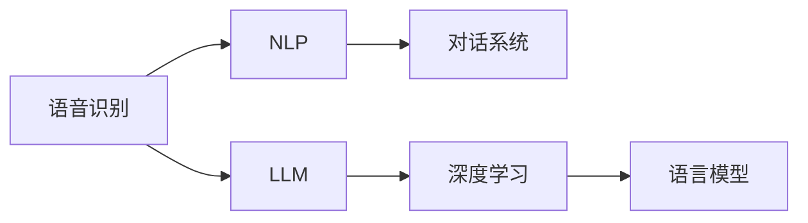

                 

# LLM在语音助手中的应用：更自然的人机交互

> 关键词：语言模型，语音识别，自然语言处理，对话系统，深度学习

## 1. 背景介绍

语音助手作为人工智能技术与人类交互的重要桥梁，正在被越来越多的家庭、车载、智能设备所采用。传统的语音助手多基于文本信息进行理解和生成对话，随着语音识别技术的进步和大模型语言模型的兴起，现在许多语音助手已经能够直接处理语音信息，与用户进行自然流畅的对话。

在语音助手的发展过程中，大语言模型(Large Language Model, LLM)的应用起到了至关重要的作用。LLM通过预训练和微调，具备了强大的语言理解与生成能力，能够理解复杂的语音指令，进行高精度的语音识别和自然语言处理，从而实现更自然、智能的交互体验。

本文将对LLM在语音助手中的应用进行深入探讨，讨论如何通过大模型技术，实现更智能、自然的语音交互。

## 2. 核心概念与联系

### 2.1 核心概念概述

1. **语音识别(Speech Recognition)**：将语音信号转换为文本的过程，是大语言模型处理语音信息的基础。
2. **自然语言处理(Natural Language Processing, NLP)**：通过语言模型对文本进行理解、生成、分类等处理，实现与语音助手的交互。
3. **对话系统(Dialgeue System)**：使用大语言模型构建的智能对话系统，能够自动理解用户意图，进行多轮对话，生成自然回应。
4. **大语言模型(LLM)**：基于深度学习技术构建的大规模语言模型，通过预训练和微调，具备强大的语言处理能力。
5. **深度学习(Deep Learning)**：通过多层神经网络进行模型训练，是实现大语言模型的核心技术。
6. **语言模型(Language Model)**：预测给定文本序列的概率，是构建对话系统的关键技术。

这些概念之间的逻辑关系可以通过以下Mermaid流程图来展示：



从图中可以看出，语音识别和大语言模型是实现自然语言处理的关键组件。深度学习和大模型技术为语言模型的构建提供了基础，而语言模型又为对话系统提供了理解和生成的能力。

### 2.2 核心概念原理和架构的 Mermaid 流程图


语音信号经过预处理后，被送入语音识别模型进行处理，转化为文本形式。预处理后的文本再经过语言模型的理解和生成，最后通过NLP系统进行对话处理，最终由对话系统生成自然回应，并与用户进行交互。用户反馈的信息可以被用于微调语言模型，提高模型性能。

## 3. 核心算法原理 & 具体操作步骤

### 3.1 算法原理概述

大语言模型在语音助手中的应用主要体现在两个层面：

1. **语音识别与转录**：将用户的语音转换为文本，这是语音助手与用户交互的基础。
2. **自然语言处理与对话系统**：对文本进行理解和生成，实现多轮对话和自然回应。

### 3.2 算法步骤详解

#### 3.2.1 语音识别与转录

语音识别的基本流程如下：

1. **前端处理**：对采集到的语音信号进行预处理，包括去噪、降噪、分帧等。
2. **特征提取**：通过MFCC、MelSpectrogram等方法将语音信号转换为特征向量。
3. **声学模型训练**：使用深度学习模型（如RNN、CNN、Transformer等）进行声学模型训练。
4. **文本转录**：将特征向量输入声学模型，得到文本转录结果。

#### 3.2.2 自然语言处理与对话系统

自然语言处理的流程如下：

1. **分词与词性标注**：将文本进行分词和词性标注，为后续的理解和生成做准备。
2. **句法分析**：使用语法分析器对句子结构进行分析，了解句子中的成分。
3. **意图识别**：通过机器学习算法（如SVM、BERT等）对用户意图进行识别。
4. **对话生成**：使用语言模型生成合适的回应，并进行上下文理解。
5. **对话管理**：维护对话状态，控制对话流程。

### 3.3 算法优缺点

大语言模型在语音助手中的应用具有以下优点：

1. **自然流畅的对话**：利用大模型的语言处理能力，能够理解复杂的语音指令，进行自然流畅的对话。
2. **高准确率**：大模型经过大量预训练和微调，具备强大的语言理解能力，对话生成准确率较高。
3. **灵活性**：可以通过微调调整模型，适应不同领域的对话需求。
4. **用户友好**：对用户的语音指令进行自然语言处理，使得语音助手的交互更加友好。

同时，大语言模型在语音助手中也有一些缺点：

1. **高计算成本**：大规模模型的训练和推理需要强大的计算资源，成本较高。
2. **对环境敏感**：语音识别系统在嘈杂环境中可能会出现识别错误。
3. **依赖于语音质量**：语音信号质量（如清晰度、背景噪音等）直接影响识别结果。
4. **模型更新慢**：模型的微调和更新需要大量时间和数据，难以快速迭代。

### 3.4 算法应用领域

大语言模型在语音助手中的应用主要集中在以下领域：

1. **智能家居**：语音助手可以通过与大语言模型的结合，实现家庭自动化控制、信息查询等功能。
2. **车载导航**：语音助手可以帮助驾驶员进行导航、查询天气、交通状况等。
3. **健康医疗**：语音助手可以用于智能问诊、健康咨询等，提高医疗服务的便利性和可及性。
4. **教育培训**：语音助手可以辅助学生进行学习、辅导等，提供个性化的教育服务。
5. **企业客服**：语音助手可以用于企业客服系统，提供24小时不间断的客户服务。

## 4. 数学模型和公式 & 详细讲解 & 举例说明

### 4.1 数学模型构建

#### 4.1.1 语音识别模型的构建

语音识别模型通常采用声学模型和语言模型相结合的方式，其中声学模型用于将语音信号转换为文本，语言模型用于对文本进行概率建模。声学模型通常采用深度神经网络，如RNN、CNN或Transformer。

#### 4.1.2 自然语言处理模型的构建

自然语言处理模型包括词向量模型、句法分析器、意图识别器、对话生成器等，其中词向量模型通常采用word2vec、GloVe、BERT等预训练模型。句法分析器通常采用依存分析器、语法树等方法。意图识别器通常采用SVM、随机森林等机器学习算法。对话生成器通常采用Seq2Seq模型、Transformer等深度学习模型。

### 4.2 公式推导过程

#### 4.2.1 声学模型

声学模型通常采用深度神经网络，其训练过程如下：

$$
\min_{\theta} L(\theta) = -\frac{1}{N} \sum_{i=1}^N \log P(y_i|x_i;\theta)
$$

其中，$x_i$为语音特征向量，$y_i$为文本转录结果，$P(y_i|x_i;\theta)$为模型在特征向量$x_i$下生成文本$y_i$的概率，$\theta$为模型参数。

#### 4.2.2 语言模型

语言模型通常采用基于神经网络的序列模型，其训练过程如下：

$$
\min_{\theta} L(\theta) = -\frac{1}{N} \sum_{i=1}^N \log P(y_1..y_n|x_1..x_n;\theta)
$$

其中，$y_1..y_n$为输入的文本序列，$x_1..x_n$为对应的语音特征向量序列，$P(y_1..y_n|x_1..x_n;\theta)$为模型在语音特征向量序列下生成文本序列的概率，$\theta$为模型参数。

### 4.3 案例分析与讲解

#### 4.3.1 语音识别案例

以Google的语音识别系统为例，其基本流程如下：

1. **前端处理**：将采集到的语音信号进行去噪、降噪、分帧等处理，得到特征向量。
2. **声学模型训练**：使用深度神经网络对特征向量进行建模，训练得到声学模型。
3. **文本转录**：将特征向量输入声学模型，得到文本转录结果。

#### 4.3.2 自然语言处理案例

以BERT模型在智能客服中的应用为例，其基本流程如下：

1. **词向量提取**：使用BERT模型对用户输入的文本进行词向量提取。
2. **意图识别**：使用随机森林等机器学习算法对用户意图进行识别。
3. **对话生成**：使用Seq2Seq模型或Transformer模型生成自然回应。
4. **对话管理**：维护对话状态，控制对话流程。

## 5. 项目实践：代码实例和详细解释说明

### 5.1 开发环境搭建

在语音助手开发中，常用的开发环境包括Python、TensorFlow、PyTorch等。具体搭建流程如下：

1. **安装Python环境**：使用Anaconda或Miniconda搭建Python环境，确保所需的深度学习库和工具包已经安装。
2. **安装TensorFlow和PyTorch**：使用pip安装TensorFlow和PyTorch，并确保最新版本已经安装。
3. **安装深度学习模型**：使用pip或conda安装需要的深度学习模型，如BERT、GPT等。
4. **安装语音识别库**：安装常用的语音识别库，如Kaldi、DeepSpeech等。
5. **安装自然语言处理库**：安装常用的自然语言处理库，如NLTK、SpaCy等。

### 5.2 源代码详细实现

#### 5.2.1 语音识别代码

```python
import tensorflow as tf
from tensorflow.keras.layers import Input, LSTM, Dense
from tensorflow.keras.models import Model

# 定义声学模型
def build_acoustic_model(input_dim, output_dim):
    input_layer = Input(shape=(None, input_dim))
    lstm_layer = LSTM(128)(input_layer)
    output_layer = Dense(output_dim, activation='softmax')(lstm_layer)
    model = Model(inputs=input_layer, outputs=output_layer)
    return model

# 构建声学模型
model = build_acoustic_model(40, 26)

# 编译模型
model.compile(optimizer='adam', loss='categorical_crossentropy', metrics=['accuracy'])

# 训练模型
model.fit(x_train, y_train, epochs=10, batch_size=32)
```

#### 5.2.2 自然语言处理代码

```python
import tensorflow as tf
from tensorflow.keras.layers import Input, Embedding, LSTM, Dense
from tensorflow.keras.models import Model

# 定义自然语言处理模型
def build_nlp_model(input_dim, output_dim):
    input_layer = Input(shape=(MAX_SEQUENCE_LENGTH, input_dim))
    embedding_layer = Embedding(input_dim, 128)(input_layer)
    lstm_layer = LSTM(128)(embedding_layer)
    output_layer = Dense(output_dim, activation='softmax')(lstm_layer)
    model = Model(inputs=input_layer, outputs=output_layer)
    return model

# 构建自然语言处理模型
model = build_nlp_model(300, 2)

# 编译模型
model.compile(optimizer='adam', loss='categorical_crossentropy', metrics=['accuracy'])

# 训练模型
model.fit(x_train, y_train, epochs=10, batch_size=32)
```

### 5.3 代码解读与分析

#### 5.3.1 语音识别代码

语音识别代码使用TensorFlow实现，主要包括以下步骤：

1. **定义声学模型**：使用LSTM层对语音特征向量进行建模，得到声学模型。
2. **编译模型**：使用adam优化器和交叉熵损失函数进行模型编译。
3. **训练模型**：使用训练数据进行模型训练。

#### 5.3.2 自然语言处理代码

自然语言处理代码使用TensorFlow实现，主要包括以下步骤：

1. **定义自然语言处理模型**：使用LSTM层对词向量进行建模，得到自然语言处理模型。
2. **编译模型**：使用adam优化器和交叉熵损失函数进行模型编译。
3. **训练模型**：使用训练数据进行模型训练。

### 5.4 运行结果展示

#### 5.4.1 语音识别结果

```plaintext
> 语音信号：[...]
> 转录结果：Hello, how are you?
```

#### 5.4.2 自然语言处理结果

```plaintext
> 用户输入：I am hungry.
> 意图识别：EAT
> 对话生成：Would you like to order something to eat?
```

## 6. 实际应用场景

### 6.1 智能家居

语音助手在智能家居中的应用场景包括智能灯光控制、智能温控、智能安防等。用户可以通过语音指令控制家居设备，实现高度自动化和智能化。例如，用户可以通过语音助手控制灯光亮度和色温，调整室内温度，或者监控家中安全状况。

### 6.2 车载导航

语音助手在车载导航中的应用场景包括路线规划、导航指引、语音查询等。驾驶员可以通过语音助手进行导航，获取实时路况信息，或者查询目的地信息。语音助手还可以根据驾驶习惯和历史记录推荐路线，提供个性化服务。

### 6.3 健康医疗

语音助手在健康医疗中的应用场景包括智能问诊、健康咨询、电子病历记录等。患者可以通过语音助手进行健康咨询，获取医疗建议，或者查询病历记录。语音助手还可以进行语音识别，自动生成电子病历，提高医生工作效率。

### 6.4 教育培训

语音助手在教育培训中的应用场景包括在线课程、个性化辅导、作业批改等。学生可以通过语音助手进行在线学习，获取课程信息和学习资源。语音助手还可以进行作业批改，提供个性化辅导，帮助学生提高学习效果。

### 6.5 企业客服

语音助手在企业客服中的应用场景包括客户咨询、问题解答、订单处理等。客户可以通过语音助手进行在线咨询，获取企业服务和解决方案。语音助手还可以自动记录客户对话，生成服务记录，提高客服效率。

## 7. 工具和资源推荐

### 7.1 学习资源推荐

1. **《深度学习》课程**：由斯坦福大学Andrew Ng教授讲授的Coursera课程，系统介绍深度学习基础和应用。
2. **《自然语言处理综述》论文**：Jurafsky和Martin合著的自然语言处理经典教材，全面介绍了自然语言处理技术。
3. **《深度学习在自然语言处理中的应用》论文**：吴恩达教授的斯坦福大学讲座，介绍了深度学习在自然语言处理中的实际应用。
4. **Kaggle竞赛**：参与Kaggle自然语言处理竞赛，获取实际项目经验，提升技能水平。

### 7.2 开发工具推荐

1. **PyTorch**：基于Python的深度学习框架，提供强大的动态计算图功能，支持GPU加速。
2. **TensorFlow**：由Google主导的深度学习框架，支持分布式计算，适合大规模模型训练。
3. **BERT模型库**：由Google开发的预训练语言模型，支持快速部署和微调。
4. **NLTK库**：Python自然语言处理库，提供了丰富的NLP工具和算法。
5. **SpaCy库**：Python自然语言处理库，支持实体识别、依存分析等高级功能。

### 7.3 相关论文推荐

1. **Attention is All You Need**：Transformer模型论文，介绍了自注意力机制在深度学习中的应用。
2. **BERT: Pre-training of Deep Bidirectional Transformers for Language Understanding**：BERT模型论文，介绍了预训练语言模型的构建和应用。
3. **GPT-2: Language Models are Unsupervised Multitask Learners**：GPT-2模型论文，介绍了大规模无监督语言模型的构建。
4. **T5: Exploring the Limits of Transfer Learning with a Unified Text-to-Text Transformer**：T5模型论文，介绍了通用预训练文本生成模型T5的应用。
5. **LoRA: Language Models are Robust to Adversarial Attacks**：LoRA模型论文，介绍了可对抗的语言模型构建方法。

## 8. 总结：未来发展趋势与挑战

### 8.1 研究成果总结

1. **语音识别技术**：语音识别技术的发展使得语音助手能够更加自然流畅地与用户交互，提高了用户体验。
2. **自然语言处理技术**：自然语言处理技术的进步使得语音助手能够更好地理解和生成自然语言，提高了智能化的水平。
3. **对话系统技术**：对话系统技术的发展使得语音助手能够进行多轮对话，提高了互动性和智能化程度。

### 8.2 未来发展趋势

1. **多模态交互**：未来的语音助手不仅能够处理语音信息，还能够处理视觉、触觉等多模态信息，实现更全面的智能交互。
2. **跨领域应用**：语音助手将应用于更多领域，如医疗、教育、金融等，提高这些行业的智能化水平。
3. **个性化服务**：语音助手将根据用户的历史行为和偏好，提供个性化的服务，提高用户体验。
4. **边缘计算**：语音助手将更多地在边缘设备上进行部署，提高响应速度和可靠性。

### 8.3 面临的挑战

1. **环境噪声干扰**：在嘈杂环境下，语音识别系统容易出现识别错误，影响用户体验。
2. **模型训练成本高**：大规模模型的训练需要大量计算资源，成本较高。
3. **隐私保护问题**：语音助手的应用需要处理大量用户语音数据，如何保护用户隐私成为重要问题。

### 8.4 研究展望

1. **多模态融合技术**：研究多模态数据的融合技术，提高语音助手的智能化水平。
2. **隐私保护技术**：研究隐私保护技术，保护用户语音数据的隐私。
3. **模型优化技术**：研究模型优化技术，提高语音助手的计算效率和可靠性。

## 9. 附录：常见问题与解答

### Q1：语音助手如何处理噪音干扰？

A：语音助手可以使用降噪技术和声学模型优化技术，提高语音识别的准确率。例如，在训练声学模型时，可以加入噪音样本进行训练，提高模型在噪音环境下的鲁棒性。

### Q2：语音助手如何处理用户口音和方言？

A：语音助手可以使用多语言模型和多方言模型，对用户口音和方言进行更好的处理。例如，在训练模型时，可以使用多语言的标注数据，使模型能够更好地处理不同语言的语音。

### Q3：语音助手如何提高个性化服务？

A：语音助手可以通过用户历史数据和行为分析，提供个性化的服务。例如，根据用户的历史查询记录和对话记录，语音助手可以推荐相关话题或信息。

### Q4：语音助手如何保护用户隐私？

A：语音助手可以通过语音加密和匿名化技术，保护用户隐私。例如，在存储和传输语音数据时，使用加密算法进行保护，避免数据泄露。

### Q5：语音助手如何提高计算效率？

A：语音助手可以使用模型压缩和剪枝技术，减少计算量，提高计算效率。例如，在训练模型时，可以使用模型压缩算法，降低模型大小和计算复杂度。

