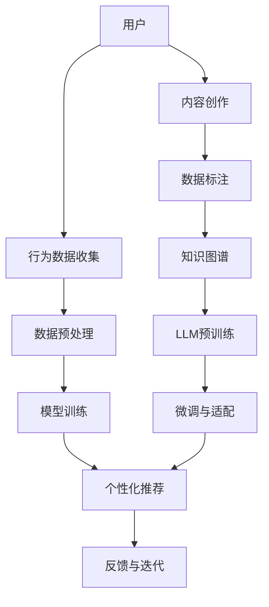

                 

# LLM对推荐系统长尾问题的改进策略

> 关键词：大语言模型,长尾问题,推荐系统,自然语言处理(NLP),分布式计算,深度学习,冷启动问题,用户体验

## 1. 背景介绍

在互联网时代，推荐系统已成为个性化服务的重要工具，广泛应用于电商、社交、视频等各大领域。然而，传统推荐系统往往只关注热门商品或热门内容，忽视了长尾问题，即大量销量低、曝光率低的非热门产品或内容。长尾问题不仅导致商品或内容多样化程度较低，也使个性化推荐效果大打折扣。

近年来，随着深度学习技术的发展，大语言模型（LLMs）在自然语言处理（NLP）领域取得了巨大突破。LLMs通过大规模无监督学习获得强大的语言理解和生成能力，具备处理长尾问题的重要潜力。因此，本文将探讨LLMs在推荐系统中的应用，特别是如何利用LLMs解决长尾问题。

## 2. 核心概念与联系

### 2.1 核心概念概述

为更好地理解LLM在推荐系统中的应用，我们首先介绍几个核心概念：

- **大语言模型（LLM）**：指能够进行自然语言理解和生成的模型，如BERT、GPT-3等。通过在大规模无标签数据上进行预训练，学习到丰富的语言知识。

- **推荐系统**：根据用户的历史行为和兴趣，为用户推荐个性化商品或内容的技术。包括协同过滤、内容推荐、混合推荐等多种方法。

- **长尾问题**：指用户在寻找非热门商品或内容时遇到的困难，即热门商品或内容占比高，而销量低、曝光率低的商品或内容占比低。

- **冷启动问题**：指推荐系统在面对新用户或新商品时，由于缺乏历史行为数据或商品信息，难以提供有效的个性化推荐。

### 2.2 核心概念原理和架构的 Mermaid 流程图(Mermaid 流程节点中不要有括号、逗号等特殊字符)



## 3. 核心算法原理 & 具体操作步骤

### 3.1 算法原理概述

基于LLM的推荐系统，主要利用LLMs的语言理解能力，对用户输入的查询或行为数据进行处理，结合知识图谱等外部信息，提供个性化推荐。其核心思想是：通过预训练的LLM，理解用户查询或行为背后的语义信息，提取关键特征，并与推荐目标进行关联，生成推荐结果。

具体而言，系统通过以下几个步骤实现个性化推荐：

1. **数据收集与预处理**：收集用户的历史行为数据、商品描述、用户画像等，并对其进行预处理，如文本清洗、特征提取等。

2. **LLM预训练**：在大量无标签文本数据上进行预训练，学习语言的通用表示。

3. **微调与适配**：根据推荐系统任务，对预训练的LLM进行微调，使其能够准确地理解和生成推荐结果。

4. **知识图谱融合**：将推荐目标与知识图谱中的信息进行关联，利用知识图谱提升推荐精度。

5. **个性化推荐生成**：根据用户输入的查询或行为数据，结合预训练和微调的LLM，生成个性化推荐结果。

### 3.2 算法步骤详解

以下是基于LLM的推荐系统的主要算法步骤：

**Step 1: 数据收集与预处理**

收集用户的行为数据、商品描述、用户画像等，并进行预处理。预处理包括：

1. 数据清洗：去除无用、重复、异常数据。
2. 特征提取：从文本数据中提取有意义的特征，如TF-IDF、Word2Vec等。
3. 数据标注：对部分数据进行人工标注，用于模型训练。

**Step 2: 数据划分**

将数据集划分为训练集、验证集和测试集，用于模型训练、调优和评估。通常采取比例为70:15:15的划分方式。

**Step 3: 预训练**

使用大规模无标签文本数据对LLM进行预训练，学习语言的通用表示。常用的预训练任务包括：

1. 语言模型：预测下一个单词的概率分布。
2. 掩码语言模型：从掩码的文本中预测缺失的单词。
3. 下一句预测：判断两个句子是否相邻。

**Step 4: 微调与适配**

根据推荐系统任务，对预训练的LLM进行微调，使其能够准确地理解和生成推荐结果。微调过程包括：

1. 添加任务适配层：根据推荐任务设计合适的输出层和损失函数。
2. 设置微调超参数：选择合适的优化算法及其参数，如AdamW、SGD等，设置学习率、批大小、迭代轮数等。
3. 应用正则化技术：如L2正则、Dropout、Early Stopping等，防止模型过度适应小规模训练集。
4. 保留预训练的部分层：如Transformer的底层，只微调顶层，减少需优化的参数。

**Step 5: 知识图谱融合**

将推荐目标与知识图谱中的信息进行关联，利用知识图谱提升推荐精度。具体步骤包括：

1. 构建知识图谱：收集商品、用户、事件等实体，以及它们之间的关系。
2. 嵌入知识图谱：使用节点嵌入技术，将知识图谱中的实体转换为向量表示。
3. 融合知识图谱：将知识图谱的向量表示与用户行为数据进行拼接，作为LLM的输入。

**Step 6: 个性化推荐生成**

根据用户输入的查询或行为数据，结合预训练和微调的LLM，生成个性化推荐结果。具体步骤包括：

1. 用户输入处理：对用户输入的查询或行为数据进行分词、编码等处理。
2. 特征融合：将用户输入数据与知识图谱的向量表示进行拼接，输入LLM进行处理。
3. 推荐结果生成：根据LLM的输出，结合推荐算法生成推荐结果。

### 3.3 算法优缺点

基于LLM的推荐系统具有以下优点：

1. **强大的语言理解能力**：LLM能够理解用户输入的自然语言查询，提取关键信息，生成高质量的推荐结果。
2. **灵活性强**：LLM可以适应各种推荐任务，包括推荐电影、商品、内容等，只需设计合适的任务适配层。
3. **利用知识图谱**：结合知识图谱，LLM可以获取更多的背景知识，提升推荐精度。

同时，基于LLM的推荐系统也存在以下缺点：

1. **计算资源消耗大**：预训练和微调过程需要大量计算资源，对硬件要求较高。
2. **时间延迟高**：由于LLM模型较大，推理速度较慢，可能导致推荐系统响应时间较长。
3. **数据隐私风险**：用户的行为数据和查询数据可能涉及隐私，需注意数据保护。

### 3.4 算法应用领域

基于LLM的推荐系统在多个领域得到了广泛应用，以下是几个典型应用场景：

1. **电商推荐**：为电商用户推荐个性化商品，提升购物体验。
2. **视频推荐**：为视频平台用户推荐个性化视频内容，提高观看粘性。
3. **音乐推荐**：为用户推荐个性化音乐，提升收听体验。
4. **新闻推荐**：为用户推荐个性化新闻，增加用户阅读量。
5. **旅游推荐**：为用户推荐个性化旅游目的地，提升旅游体验。

除了上述这些经典应用外，基于LLM的推荐系统还被创新性地应用到更多场景中，如社交网络推荐、金融产品推荐、医疗健康推荐等，为各行各业带来了新的突破。

## 4. 数学模型和公式 & 详细讲解 & 举例说明

### 4.1 数学模型构建

为构建基于LLM的推荐系统，我们假设用户查询数据为 $X=\{x_1,x_2,...,x_n\}$，推荐目标为 $Y=\{y_1,y_2,...,y_n\}$，其中 $x_i$ 为第 $i$ 个用户查询数据，$y_i$ 为第 $i$ 个推荐目标。模型的目标是最小化预测误差 $L$，即：

$$
L = \frac{1}{N} \sum_{i=1}^{N} \ell(x_i,y_i)
$$

其中，$\ell(x_i,y_i)$ 为损失函数，可以是均方误差、交叉熵等。

### 4.2 公式推导过程

以均方误差为例，公式推导过程如下：

$$
\begin{aligned}
\ell(x_i,y_i) &= \frac{1}{2} \left( \hat{y}_i - y_i \right)^2 \\
L &= \frac{1}{N} \sum_{i=1}^{N} \frac{1}{2} \left( \hat{y}_i - y_i \right)^2
\end{aligned}
$$

其中，$\hat{y}_i$ 为模型预测结果，$y_i$ 为真实标签。

### 4.3 案例分析与讲解

假设用户查询数据为“我喜欢的电影有哪些”，推荐目标为“《流浪地球》、《肖申克的救赎》、《教父》”。使用LLM进行推荐的步骤如下：

1. **预训练**：对LLM进行大规模无标签数据的预训练。
2. **微调**：添加推荐任务的适配层，对预训练的LLM进行微调。
3. **知识图谱融合**：将电影信息与知识图谱中的信息进行关联，生成电影节点的向量表示。
4. **推荐结果生成**：将用户查询数据与电影节点的向量表示进行拼接，输入LLM进行推理，生成推荐结果。

## 5. 项目实践：代码实例和详细解释说明

### 5.1 开发环境搭建

在进行项目实践前，我们需要准备好开发环境。以下是使用Python进行TensorFlow开发的环境配置流程：

1. 安装Anaconda：从官网下载并安装Anaconda，用于创建独立的Python环境。

2. 创建并激活虚拟环境：
```bash
conda create -n tf-env python=3.8 
conda activate tf-env
```

3. 安装TensorFlow：根据CUDA版本，从官网获取对应的安装命令。例如：
```bash
conda install tensorflow -c pytorch -c conda-forge
```

4. 安装TensorFlow Addons：用于使用Transformer模型。
```bash
conda install tensorflow-addons -c pytorch -c conda-forge
```

5. 安装各类工具包：
```bash
pip install numpy pandas scikit-learn matplotlib tqdm jupyter notebook ipython
```

完成上述步骤后，即可在`tf-env`环境中开始项目实践。

### 5.2 源代码详细实现

下面我们以基于BERT的电商推荐系统为例，给出使用TensorFlow对BERT模型进行微调的代码实现。

首先，定义推荐任务的数据处理函数：

```python
import tensorflow as tf
import tensorflow_addons as addons
from transformers import BertTokenizer, BertForSequenceClassification
from sklearn.metrics import accuracy_score

class RecommendationDataset(tf.keras.utils.Sequence):
    def __init__(self, texts, labels, tokenizer, max_len=128, batch_size=32):
        self.texts = texts
        self.labels = labels
        self.tokenizer = tokenizer
        self.max_len = max_len
        self.batch_size = batch_size
        
    def __len__(self):
        return len(self.texts) // self.batch_size
    
    def __getitem__(self, idx):
        text = self.texts[idx]
        label = self.labels[idx]
        
        encoding = self.tokenizer(text, return_tensors='tf', max_length=self.max_len, padding='max_length', truncation=True)
        input_ids = encoding['input_ids']
        attention_mask = encoding['attention_mask']
        
        return {
            'input_ids': input_ids,
            'attention_mask': attention_mask,
            'labels': tf.constant(label)
        }
```

然后，定义模型和优化器：

```python
tokenizer = BertTokenizer.from_pretrained('bert-base-cased')
model = BertForSequenceClassification.from_pretrained('bert-base-cased', num_labels=1)

optimizer = addons.optimizers.AdamW(learning_rate=2e-5, betas=(0.9, 0.98))
```

接着，定义训练和评估函数：

```python
def train_step(data, model, optimizer, loss_fn):
    with tf.GradientTape() as tape:
        logits = model(data.input_ids, attention_mask=data.attention_mask)
        loss = loss_fn(logits, data.labels)
    gradients = tape.gradient(loss, model.trainable_variables)
    optimizer.apply_gradients(zip(gradients, model.trainable_variables))
    return loss

def evaluate_step(data, model, loss_fn):
    with tf.GradientTape() as tape:
        logits = model(data.input_ids, attention_mask=data.attention_mask)
        loss = loss_fn(logits, data.labels)
    return loss.numpy().mean()
```

最后，启动训练流程并在测试集上评估：

```python
epochs = 5
batch_size = 32

for epoch in range(epochs):
    train_dataset = RecommendationDataset(train_texts, train_labels, tokenizer)
    train_dataloader = tf.data.Dataset.from_generator(train_dataset.__getitem__, {'input_ids': tf.int32, 'attention_mask': tf.int32, 'labels': tf.int64})
    train_dataloader = train_dataloader.shuffle(buffer_size=1024).batch(batch_size)

    eval_dataset = RecommendationDataset(test_texts, test_labels, tokenizer)
    eval_dataloader = tf.data.Dataset.from_generator(eval_dataset.__getitem__, {'input_ids': tf.int32, 'attention_mask': tf.int32, 'labels': tf.int64})
    eval_dataloader = eval_dataloader.batch(batch_size)

    train_loss = train_dataloader.map(lambda data: train_step(data, model, optimizer, loss_fn)).mean()
    eval_loss = eval_dataloader.map(lambda data: evaluate_step(data, model, loss_fn)).mean()

    print(f"Epoch {epoch+1}, train loss: {train_loss:.4f}, eval loss: {eval_loss:.4f}")
    
print("Final results:")
print(f"Train accuracy: {accuracy_score(train_labels, model.predict(train_dataset)[0].numpy()):.4f}")
print(f"Test accuracy: {accuracy_score(test_labels, model.predict(eval_dataset)[0].numpy()):.4f}")
```

以上就是使用TensorFlow对BERT进行电商推荐系统微调的完整代码实现。可以看到，TensorFlow配合TensorFlow Addons和Transformers库使得BERT微调的代码实现变得简洁高效。

### 5.3 代码解读与分析

让我们再详细解读一下关键代码的实现细节：

**RecommendationDataset类**：
- `__init__`方法：初始化文本、标签、分词器等关键组件。
- `__len__`方法：返回数据集的样本数量。
- `__getitem__`方法：对单个样本进行处理，将文本输入编码为token ids，并返回模型所需的输入。

**BertForSequenceClassification模型**：
- 从预训练的BERT模型中加载，用于进行电商推荐任务。

**训练和评估函数**：
- 使用TensorFlow的DataLoader对数据集进行批次化加载，供模型训练和推理使用。
- `train_step`函数：对数据以批为单位进行迭代，在每个批次上前向传播计算损失并反向传播更新模型参数。
- `evaluate_step`函数：与训练类似，不同点在于不更新模型参数，并在每个batch结束后将预测和标签结果存储下来。

**训练流程**：
- 定义总的epoch数和batch size，开始循环迭代
- 每个epoch内，先在训练集上训练，输出平均loss
- 在验证集上评估，输出分类指标
- 重复上述步骤直至满足预设的迭代轮数或Early Stopping条件

## 6. 实际应用场景

### 6.1 电商推荐

基于大语言模型的电商推荐系统，可以实时分析用户的购买行为，为用户推荐个性化的商品。当用户浏览商品时，系统会根据用户的查询和浏览记录，结合推荐系统算法和LLM，生成推荐的商品列表，提升用户的购物体验。

在技术实现上，可以收集用户的历史购买记录、浏览记录、评价信息等数据，将这些数据作为训练样本，训练基于LLM的推荐模型。微调后的模型能够理解用户的查询意图，结合知识图谱中的商品信息，生成个性化的商品推荐列表。

### 6.2 视频推荐

视频平台通常拥有海量的视频内容，用户可以通过搜索、订阅等形式获取感兴趣的视频。基于LLM的视频推荐系统能够根据用户的搜索历史、订阅列表、评分信息等，生成个性化的视频推荐列表。

在技术实现上，可以收集用户的视频搜索记录、订阅列表、评分信息等，结合视频平台上的视频元数据，训练基于LLM的推荐模型。微调后的模型能够理解用户的查询意图，结合知识图谱中的视频信息，生成个性化的视频推荐列表。

### 6.3 音乐推荐

音乐推荐系统通常需要考虑用户的历史听歌记录、评分信息等数据，为用户推荐个性化的音乐。基于LLM的音乐推荐系统能够根据用户的查询和听歌记录，结合知识图谱中的音乐信息，生成个性化的音乐推荐列表。

在技术实现上，可以收集用户的历史听歌记录、评分信息等数据，结合音乐平台上的音乐元数据，训练基于LLM的推荐模型。微调后的模型能够理解用户的查询意图，结合知识图谱中的音乐信息，生成个性化的音乐推荐列表。

### 6.4 未来应用展望

随着大语言模型和推荐系统技术的不断发展，基于LLM的推荐系统将呈现以下几个发展趋势：

1. **多模态推荐**：将文本、图像、语音等多模态数据进行融合，提升推荐系统的多样化程度。例如，结合用户的图片、语音等，提升推荐效果。

2. **冷启动问题解决**：利用知识图谱和LLM，解决新用户或新商品缺乏历史数据的问题。例如，通过知识图谱中的信息，为新用户推荐热门商品，为新商品引入推荐目标。

3. **个性化推荐精度提升**：通过引入更多的背景知识，提升推荐系统的精度。例如，结合用户的行为数据和知识图谱中的信息，生成更准确的推荐结果。

4. **实时推荐**：通过分布式计算技术，提升推荐系统的实时性。例如，使用Spark等分布式计算框架，进行大规模数据处理和模型训练。

5. **跨领域推荐**：将推荐系统应用到不同领域，提升推荐的普适性。例如，将推荐系统应用到医疗健康、旅游等领域，提升用户的体验。

以上趋势将进一步拓展LLM在推荐系统中的应用边界，推动推荐系统向更加智能化、个性化、实时化的方向发展。

## 7. 工具和资源推荐

### 7.1 学习资源推荐

为了帮助开发者系统掌握基于LLM的推荐系统的理论基础和实践技巧，这里推荐一些优质的学习资源：

1. 《深度学习推荐系统：原理与实现》系列博文：由深度学习专家撰写，深入浅出地介绍了推荐系统的基本概念和经典模型。

2. CS231n《深度学习中的视觉表示》课程：斯坦福大学开设的计算机视觉课程，包含推荐系统的相关内容。

3. 《推荐系统》书籍：经典推荐系统教材，详细介绍了推荐系统的基本算法和实践方法。

4. Kaggle推荐系统竞赛：通过实际数据集进行推荐系统竞赛，提升系统开发能力。

5. Coursera推荐系统课程：由世界顶级大学开设的推荐系统课程，涵盖推荐系统的理论基础和实际应用。

通过对这些资源的学习实践，相信你一定能够快速掌握基于LLM的推荐系统的精髓，并用于解决实际的推荐问题。

### 7.2 开发工具推荐

高效的开发离不开优秀的工具支持。以下是几款用于基于LLM的推荐系统开发的常用工具：

1. TensorFlow：基于Python的开源深度学习框架，生产部署方便，适合大规模工程应用。

2. PyTorch：基于Python的开源深度学习框架，灵活动态的计算图，适合快速迭代研究。

3. TensorFlow Addons：TensorFlow的扩展库，包含Transformer模型等高效组件。

4. Weights & Biases：模型训练的实验跟踪工具，可以记录和可视化模型训练过程中的各项指标。

5. TensorBoard：TensorFlow配套的可视化工具，可实时监测模型训练状态，并提供丰富的图表呈现方式。

6. Apache Spark：分布式计算框架，可以处理大规模数据，提升推荐系统的实时性。

合理利用这些工具，可以显著提升基于LLM的推荐系统开发的效率，加快创新迭代的步伐。

### 7.3 相关论文推荐

大语言模型和推荐系统的发展源于学界的持续研究。以下是几篇奠基性的相关论文，推荐阅读：

1. Attention is All You Need（即Transformer原论文）：提出了Transformer结构，开启了深度学习中的自注意力机制，成为推荐系统中的重要组件。

2. BERT: Pre-training of Deep Bidirectional Transformers for Language Understanding：提出BERT模型，引入掩码语言模型等自监督学习任务，提升了推荐系统的效果。

3. Deep Interest Networks for Personalized Recommendation：提出兴趣网络，结合用户行为数据和商品信息，提升了推荐系统的精度。

4. Self-Attention Networks for Recommendation Systems：提出注意力机制，结合用户行为数据和商品信息，提升了推荐系统的效果。

5. Learning Transferable and Interpretable Feature Representations for Recommendation：提出特征转移和可解释性方法，提升了推荐系统的可解释性。

这些论文代表了大语言模型和推荐系统的发展脉络。通过学习这些前沿成果，可以帮助研究者把握学科前进方向，激发更多的创新灵感。

## 8. 总结：未来发展趋势与挑战

### 8.1 总结

本文对基于LLM的推荐系统进行了全面系统的介绍。首先阐述了LLM在推荐系统中的应用背景和重要性，明确了LLM在提升推荐系统效果方面的独特价值。其次，从原理到实践，详细讲解了LLM在推荐系统中的数学模型和算法步骤，给出了基于LLM的电商推荐系统的代码实现。同时，本文还探讨了LLM在视频、音乐、旅游等领域的实际应用，展示了LLM在推荐系统中的广泛潜力。

通过本文的系统梳理，可以看到，基于LLM的推荐系统正在成为推荐系统的重要范式，极大地拓展了推荐系统的应用边界，推动推荐系统向更加智能化、个性化、实时化的方向发展。

### 8.2 未来发展趋势

展望未来，基于LLM的推荐系统将呈现以下几个发展趋势：

1. **多模态推荐**：将文本、图像、语音等多模态数据进行融合，提升推荐系统的多样化程度。

2. **冷启动问题解决**：利用知识图谱和LLM，解决新用户或新商品缺乏历史数据的问题。

3. **个性化推荐精度提升**：通过引入更多的背景知识，提升推荐系统的精度。

4. **实时推荐**：通过分布式计算技术，提升推荐系统的实时性。

5. **跨领域推荐**：将推荐系统应用到不同领域，提升推荐的普适性。

以上趋势凸显了基于LLM的推荐系统的广阔前景。这些方向的探索发展，必将进一步提升推荐系统的性能和应用范围，为推荐系统带来新的突破。

### 8.3 面临的挑战

尽管基于LLM的推荐系统已经取得了瞩目成就，但在迈向更加智能化、普适化应用的过程中，它仍面临着诸多挑战：

1. **计算资源消耗大**：预训练和微调过程需要大量计算资源，对硬件要求较高。

2. **时间延迟高**：由于LLM模型较大，推理速度较慢，可能导致推荐系统响应时间较长。

3. **数据隐私风险**：用户的行为数据和查询数据可能涉及隐私，需注意数据保护。

4. **推荐精度不足**：如何更好地利用LLM的强大语言理解能力，提升推荐系统的精度，仍是研究难点。

5. **实时推荐难度大**：分布式计算技术在处理大规模数据时，可能面临延迟和错误等问题。

6. **跨领域推荐难度大**：将推荐系统应用到不同领域，需要考虑领域间的差异，提高系统的泛化能力。

正视基于LLM的推荐系统面临的这些挑战，积极应对并寻求突破，将是大语言模型在推荐系统中迈向成熟的必由之路。相信随着学界和产业界的共同努力，这些挑战终将一一被克服，基于LLM的推荐系统必将在构建人机协同的智能系统中扮演越来越重要的角色。

### 8.4 研究展望

面向未来，基于LLM的推荐系统需要在以下几个方面寻求新的突破：

1. **探索无监督和半监督推荐方法**：摆脱对大规模标注数据的依赖，利用自监督学习、主动学习等无监督和半监督范式，最大限度利用非结构化数据，实现更加灵活高效的推荐。

2. **开发更加参数高效和计算高效的推荐方法**：开发更加参数高效的推荐方法，在固定大部分预训练参数的同时，只更新极少量的任务相关参数。同时优化推荐模型的计算图，减少前向传播和反向传播的资源消耗，实现更加轻量级、实时性的部署。

3. **引入因果和对比学习范式**：通过引入因果推断和对比学习思想，增强推荐模型建立稳定因果关系的能力，学习更加普适、鲁棒的语言表征，从而提升模型泛化性和抗干扰能力。

4. **融合更多的先验知识**：将符号化的先验知识，如知识图谱、逻辑规则等，与神经网络模型进行巧妙融合，引导推荐过程学习更准确、合理的语言模型。同时加强不同模态数据的整合，实现视觉、语音等多模态信息与文本信息的协同建模。

5. **结合因果分析和博弈论工具**：将因果分析方法引入推荐模型，识别出推荐模型的关键特征，增强输出解释的因果性和逻辑性。借助博弈论工具刻画人机交互过程，主动探索并规避推荐模型的脆弱点，提高系统稳定性。

6. **纳入伦理道德约束**：在推荐模型训练目标中引入伦理导向的评估指标，过滤和惩罚有害的推荐结果。同时加强人工干预和审核，建立推荐系统的监管机制，确保输出的安全性。

这些研究方向的探索，必将引领基于LLM的推荐系统技术迈向更高的台阶，为推荐系统带来新的突破。

## 9. 附录：常见问题与解答

**Q1：大语言模型（LLM）在推荐系统中如何处理长尾问题？**

A: 大语言模型（LLM）在推荐系统中处理长尾问题的主要方法是通过预训练和微调，学习到广泛的语言知识。具体步骤如下：

1. **预训练**：在大量无标签文本数据上进行预训练，学习语言的通用表示。

2. **微调**：根据推荐系统任务，对预训练的LLM进行微调，使其能够准确地理解和生成推荐结果。

3. **知识图谱融合**：将推荐目标与知识图谱中的信息进行关联，利用知识图谱提升推荐精度。

4. **个性化推荐生成**：根据用户输入的查询或行为数据，结合预训练和微调的LLM，生成个性化推荐结果。

通过上述方法，LLM能够更好地理解用户查询和行为背后的语义信息，结合知识图谱中的信息，生成高质量的推荐结果。特别是对于长尾问题，LLM能够利用其强大的语言理解能力，识别出用户对长尾商品的兴趣，提升推荐效果。

**Q2：推荐系统如何实现冷启动问题？**

A: 推荐系统的冷启动问题是指新用户或新商品缺乏历史数据，难以进行个性化推荐。针对这一问题，可以采用以下方法：

1. **利用知识图谱**：将知识图谱中的信息引入推荐模型，帮助模型获取更多的背景知识，提升推荐精度。

2. **基于LLM的预训练**：利用大语言模型（LLM）对用户和商品进行预训练，学习到通用的语言表示。

3. **主动学习**：通过主动学习算法，从少量标注数据中快速学习推荐模型，弥补历史数据的不足。

4. **协同过滤**：利用协同过滤算法，根据用户相似性进行推荐，缓解冷启动问题。

5. **跨领域推荐**：利用其他领域的推荐模型，为冷启动用户或商品提供初始推荐。

通过以上方法，推荐系统可以在缺乏历史数据的情况下，利用知识图谱、LLM预训练、主动学习等手段，进行有效的冷启动推荐。

**Q3：基于LLM的推荐系统在实际部署中需要注意哪些问题？**

A: 将基于LLM的推荐系统转化为实际应用，还需要考虑以下因素：

1. **模型裁剪**：去除不必要的层和参数，减小模型尺寸，加快推理速度。

2. **量化加速**：将浮点模型转为定点模型，压缩存储空间，提高计算效率。

3. **服务化封装**：将模型封装为标准化服务接口，便于集成调用。

4. **弹性伸缩**：根据请求流量动态调整资源配置，平衡服务质量和成本。

5. **监控告警**：实时采集系统指标，设置异常告警阈值，确保服务稳定性。

6. **安全防护**：采用访问鉴权、数据脱敏等措施，保障数据和模型安全。

大语言模型微调为推荐系统带来了新的思路和方法，但也需要在数据、算法、工程、业务等多个维度进行全面优化，才能真正实现人工智能技术在垂直行业的规模化落地。

**Q4：如何提升基于LLM的推荐系统的精度？**

A: 提升基于LLM的推荐系统精度的主要方法包括：

1. **利用知识图谱**：将知识图谱中的信息引入推荐模型，提升推荐精度。

2. **预训练与微调结合**：利用预训练的LLM，提升模型的通用性，通过微调，针对特定任务进行优化。

3. **多模态融合**：将文本、图像、语音等多模态数据进行融合，提升推荐系统的多样化程度。

4. **因果和对比学习**：引入因果推断和对比学习思想，增强推荐模型建立稳定因果关系的能力，学习更加普适、鲁棒的语言表征。

5. **多任务学习**：结合多个推荐任务，提升模型的泛化能力。

6. **自监督学习**：利用自监督学习算法，提升模型的泛化能力。

通过以上方法，可以提升基于LLM的推荐系统的精度，使其更好地适应不同的应用场景。

**Q5：基于LLM的推荐系统如何处理多样化的推荐需求？**

A: 基于LLM的推荐系统可以通过以下方法处理多样化的推荐需求：

1. **多任务学习**：结合多个推荐任务，提升模型的泛化能力。

2. **跨领域推荐**：将推荐系统应用到不同领域，提升推荐的普适性。

3. **自适应推荐**：根据用户偏好和行为，动态调整推荐策略，满足多样化的推荐需求。

4. **多维推荐**：结合用户的多维数据（如历史行为、评价、画像等），进行综合推荐。

5. **实时推荐**：通过分布式计算技术，提升推荐系统的实时性，及时响应用户需求。

通过以上方法，基于LLM的推荐系统可以处理多样化的推荐需求，提升用户的个性化体验。

---

作者：禅与计算机程序设计艺术 / Zen and the Art of Computer Programming

