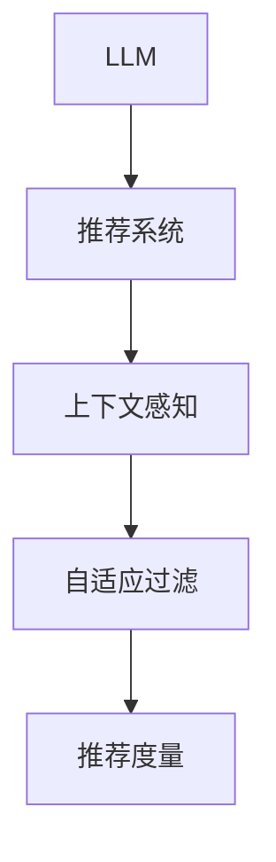

                 

# LLM推荐中的上下文感知技术研究

> 关键词：大语言模型(LLM), 推荐系统, 上下文感知, 自适应过滤, 推荐度量, 交互模型

## 1. 背景介绍

### 1.1 问题由来

随着互联网和数字技术的迅猛发展，推荐系统已成为现代信息服务的重要组成部分，广泛应用于电子商务、新闻阅读、音乐视频等领域。传统推荐系统基于用户的明示评分、点击行为等历史数据，采用协同过滤、矩阵分解等方法，推荐用户可能感兴趣的商品、内容等。然而，随着数据量的激增和用户需求的多样化，传统推荐系统面临诸多挑战，如数据稀疏性、用户冷启动、推荐泛化性等问题。

近年来，深度学习技术在推荐系统中逐步兴起，尤其是基于大语言模型(LLM)的推荐方法，成为新的研究热点。LLM通过在大规模文本数据上进行预训练，学习到丰富的语义和上下文信息，通过与推荐系统深度融合，可以更好地理解用户需求和物品属性，从而提供更为个性化、多样化的推荐服务。

然而，LLM在推荐中的应用也面临不少挑战，如如何有效利用LLM语言理解能力，如何在推荐过程中加入上下文信息，如何优化推荐度量方法等。针对这些问题，本文将重点研究LLM推荐系统中的上下文感知技术，旨在提出一种能够有效利用上下文信息，提升推荐精度和用户满意度的推荐方法。

## 2. 核心概念与联系

### 2.1 核心概念概述

为了更好地理解LLM推荐系统中的上下文感知技术，本文将介绍几个关键概念及其相互联系。

#### 2.1.1 大语言模型(LLM)

大语言模型(LLM)指通过在大规模无标签文本数据上预训练，学习到丰富语言知识和上下文信息的深度学习模型。常用的LLM包括GPT-3、BERT、XLNet等。这些模型通过自回归或自编码等方式，能够对自然语言进行理解和生成。

#### 2.1.2 推荐系统

推荐系统是一种基于用户历史行为数据，为用户推荐感兴趣商品、内容等的信息系统。传统推荐系统主要包括基于协同过滤、矩阵分解等方法，但随着数据量的增长和用户需求的个性化，传统推荐方法面临诸多挑战。

#### 2.1.3 上下文感知

上下文感知指的是在推荐过程中，不仅考虑用户的历史行为数据，还加入用户当前上下文环境的信息，如地理位置、时间、社交关系等，从而提升推荐的精度和个性化水平。

#### 2.1.4 自适应过滤

自适应过滤指根据用户当前的上下文环境，动态调整推荐策略，避免过拟合用户历史行为，提升推荐的多样性和泛化性。

#### 2.1.5 推荐度量

推荐度量指用于衡量推荐算法效果和用户满意度的指标，如准确率、召回率、覆盖率等。推荐度量是评估推荐系统性能的重要依据。

这些核心概念之间的逻辑关系可以通过以下Mermaid流程图来展示：



这个流程图展示了大语言模型、推荐系统、上下文感知、自适应过滤和推荐度量之间的联系：

1. 大语言模型通过在文本数据上进行预训练，学习到丰富的语言知识。
2. 推荐系统通过结合用户的明示和隐式反馈，为用户推荐感兴趣的内容。
3. 上下文感知通过加入用户当前上下文信息，提升推荐的精度和个性化水平。
4. 自适应过滤根据用户当前环境动态调整推荐策略，避免过拟合历史行为。
5. 推荐度量用于衡量推荐算法效果和用户满意度。

这些概念共同构成了LLM推荐系统的框架，使得LLM在推荐场景中能够发挥其强大的语言理解和生成能力。

## 3. 核心算法原理 & 具体操作步骤
### 3.1 算法原理概述

基于大语言模型的推荐系统，主要通过以下两个步骤实现：

1. 使用LLM对用户输入的自然语言进行理解和生成，提取用户意图和物品属性。
2. 结合用户历史行为和当前上下文信息，动态调整推荐策略，最终输出推荐结果。

形式化地，假设用户输入的查询为 $q$，物品集合为 $\mathcal{I}$，用户历史行为数据为 $H$，当前上下文环境为 $C$，推荐目标为 $y \in \mathcal{I}$。推荐系统可以表示为：

$$
y=\mathop{\arg\max}_{i \in \mathcal{I}} f_i(q,H,C)
$$

其中，$f_i$ 为推荐函数，用于衡量用户输入 $q$ 和当前上下文 $C$ 对物品 $i$ 的兴趣程度。

为了有效利用LLM的语言理解能力，推荐函数 $f_i$ 通常基于LLM的输出进行设计。常见的推荐函数包括：

1. 文本匹配度：计算用户查询 $q$ 与物品描述 $d_i$ 的文本相似度，如余弦相似度、词向量距离等。
2. 用户情感分析：使用LLM对用户查询 $q$ 进行情感分析，匹配物品的情感标签。
3. 上下文感知向量：通过LLM对用户查询和上下文环境进行编码，生成上下文感知向量，用于指导推荐。

### 3.2 算法步骤详解

基于LLM的推荐系统通常包括以下几个关键步骤：

**Step 1: 数据预处理**

- 收集用户历史行为数据 $H$，如浏览历史、购买记录等。
- 收集当前上下文环境 $C$，如地理位置、时间、设备等。
- 对数据进行预处理，包括去噪、归一化等操作。

**Step 2: 模型预训练**

- 使用大规模无标签文本数据对LLM进行预训练，学习到丰富的语言知识和上下文信息。
- 在预训练过程中，通常使用自回归或自编码任务，如掩码语言模型、对比学习等。

**Step 3: 输入编码**

- 将用户查询 $q$ 和当前上下文环境 $C$ 输入LLM，生成隐式特征向量 $h_q$ 和 $h_C$。
- 将物品描述 $d_i$ 输入LLM，生成物品特征向量 $h_i$。

**Step 4: 推荐函数设计**

- 设计推荐函数 $f_i$，通常基于LLM的输出进行设计。
- 常见的推荐函数包括文本匹配度、情感分析、上下文感知向量等。

**Step 5: 推荐结果输出**

- 结合用户历史行为数据和当前上下文信息，对物品 $i$ 进行加权处理。
- 计算推荐函数 $f_i$ 的值，选择 $y$ 使得 $f_i(y)$ 最大。

**Step 6: 反馈循环**

- 根据用户对推荐结果的反馈，调整LLM和推荐函数，提升推荐精度。

### 3.3 算法优缺点

基于大语言模型的推荐系统具有以下优点：

1. 利用LLM强大的语言理解能力，能够更好地理解用户需求和物品属性。
2. 能够动态调整推荐策略，避免过拟合用户历史行为，提升推荐的多样性和泛化性。
3. 结合上下文信息，能够提升推荐的精度和个性化水平。

同时，该方法也存在一些局限性：

1. 数据预处理复杂。需要收集和处理大量用户行为数据和上下文信息，增加了数据收集和处理的难度。
2. 计算资源消耗大。LLM模型的训练和推理计算量大，需要高性能计算设备支持。
3. 模型泛化性不足。LLM在特定领域或数据分布下的泛化能力可能有限，需要进一步优化模型结构和参数。

尽管存在这些局限性，但基于大语言模型的推荐系统仍是大数据时代推荐技术的突破方向之一。未来相关研究的目标在于如何进一步降低计算资源消耗，提升模型泛化能力，同时兼顾个性化推荐和多样性推荐。

### 3.4 算法应用领域

基于大语言模型的推荐系统已经在电商推荐、新闻推荐、音乐推荐等多个领域取得了显著效果，成为推荐系统中的重要范式。

- 电商推荐：通过对用户查询和购物行为进行上下文感知处理，推荐用户可能感兴趣的商品。
- 新闻推荐：使用LLM对用户输入的关键词进行情感分析，匹配新闻的情感标签，推荐相关新闻。
- 音乐推荐：结合用户查询和当前上下文环境，推荐用户可能喜欢的音乐。

除了这些经典应用外，LLM推荐系统还被创新性地应用于更多场景中，如知识推荐、广告推荐、智能客服等，为推荐系统带来了新的突破。

## 4. 数学模型和公式 & 详细讲解  
### 4.1 数学模型构建

本文将使用数学语言对基于大语言模型的推荐系统进行更加严格的刻画。

假设用户输入查询为 $q$，物品集合为 $\mathcal{I}$，用户历史行为数据为 $H$，当前上下文环境为 $C$。推荐目标为 $y \in \mathcal{I}$。

推荐系统可以表示为：

$$
y=\mathop{\arg\max}_{i \in \mathcal{I}} f_i(q,H,C)
$$

其中，$f_i$ 为推荐函数，用于衡量用户输入 $q$ 和当前上下文 $C$ 对物品 $i$ 的兴趣程度。

定义推荐函数 $f_i$ 为：

$$
f_i = h_i \cdot \phi(h_q, h_C)
$$

其中，$h_i$ 为物品特征向量，$\phi$ 为相似度函数，用于衡量用户查询 $q$ 和上下文环境 $C$ 对物品 $i$ 的兴趣程度。

### 4.2 公式推导过程

以文本匹配度为例，推荐函数 $f_i$ 可以表示为：

$$
f_i = \cos(\text{Sim}(h_q, d_i))
$$

其中，$\text{Sim}$ 为余弦相似度函数，计算用户查询 $q$ 和物品描述 $d_i$ 的文本相似度。

假设 $h_q$ 和 $d_i$ 为向量表示，则余弦相似度函数可以表示为：

$$
\text{Sim}(h_q, d_i) = \frac{h_q \cdot d_i}{\|h_q\| \cdot \|d_i\|}
$$

将上式代入推荐函数 $f_i$ 中，得：

$$
f_i = \frac{h_i \cdot h_q}{\|h_q\| \cdot \|h_i\|}
$$

根据上述推导，可以看出推荐函数 $f_i$ 是通过用户查询 $q$ 和当前上下文环境 $C$ 对物品 $i$ 的兴趣程度进行加权处理。在实际应用中，可以设计多种相似度函数，如词向量距离、余弦相似度、Jaccard相似度等，以适应不同的推荐任务和数据分布。

## 5. 项目实践：代码实例和详细解释说明
### 5.1 开发环境搭建

在进行推荐系统开发前，我们需要准备好开发环境。以下是使用Python进行PyTorch开发的环境配置流程：

1. 安装Anaconda：从官网下载并安装Anaconda，用于创建独立的Python环境。

2. 创建并激活虚拟环境：
```bash
conda create -n pytorch-env python=3.8 
conda activate pytorch-env
```

3. 安装PyTorch：根据CUDA版本，从官网获取对应的安装命令。例如：
```bash
conda install pytorch torchvision torchaudio cudatoolkit=11.1 -c pytorch -c conda-forge
```

4. 安装Transformers库：
```bash
pip install transformers
```

5. 安装各类工具包：
```bash
pip install numpy pandas scikit-learn matplotlib tqdm jupyter notebook ipython
```

完成上述步骤后，即可在`pytorch-env`环境中开始推荐系统开发。

### 5.2 源代码详细实现

下面我们以基于LLM的音乐推荐系统为例，给出使用Transformers库对BERT模型进行推荐系统的PyTorch代码实现。

首先，定义音乐推荐任务的数据处理函数：

```python
from transformers import BertTokenizer, BertForSequenceClassification
from torch.utils.data import Dataset
import torch

class MusicRecommendationDataset(Dataset):
    def __init__(self, texts, labels, tokenizer, max_len=128):
        self.texts = texts
        self.labels = labels
        self.tokenizer = tokenizer
        self.max_len = max_len
        
    def __len__(self):
        return len(self.texts)
    
    def __getitem__(self, item):
        text = self.texts[item]
        label = self.labels[item]
        
        encoding = self.tokenizer(text, return_tensors='pt', max_length=self.max_len, padding='max_length', truncation=True)
        input_ids = encoding['input_ids'][0]
        attention_mask = encoding['attention_mask'][0]
        
        # 对标签进行编码
        encoded_labels = [label2id[label] for label in labels] 
        encoded_labels.extend([label2id['O']] * (self.max_len - len(encoded_labels)))
        labels = torch.tensor(encoded_labels, dtype=torch.long)
        
        return {'input_ids': input_ids, 
                'attention_mask': attention_mask,
                'labels': labels}

# 标签与id的映射
label2id = {'O': 0, 'Pop': 1, 'Rock': 2, 'Jazz': 3, 'Classical': 4, 'Folk': 5}
id2label = {v: k for k, v in label2id.items()}

# 创建dataset
tokenizer = BertTokenizer.from_pretrained('bert-base-cased')

train_dataset = MusicRecommendationDataset(train_texts, train_labels, tokenizer)
dev_dataset = MusicRecommendationDataset(dev_texts, dev_labels, tokenizer)
test_dataset = MusicRecommendationDataset(test_texts, test_labels, tokenizer)
```

然后，定义模型和优化器：

```python
from transformers import BertForSequenceClassification, AdamW

model = BertForSequenceClassification.from_pretrained('bert-base-cased', num_labels=len(label2id))

optimizer = AdamW(model.parameters(), lr=2e-5)
```

接着，定义训练和评估函数：

```python
from torch.utils.data import DataLoader
from tqdm import tqdm
from sklearn.metrics import classification_report

device = torch.device('cuda') if torch.cuda.is_available() else torch.device('cpu')
model.to(device)

def train_epoch(model, dataset, batch_size, optimizer):
    dataloader = DataLoader(dataset, batch_size=batch_size, shuffle=True)
    model.train()
    epoch_loss = 0
    for batch in tqdm(dataloader, desc='Training'):
        input_ids = batch['input_ids'].to(device)
        attention_mask = batch['attention_mask'].to(device)
        labels = batch['labels'].to(device)
        model.zero_grad()
        outputs = model(input_ids, attention_mask=attention_mask, labels=labels)
        loss = outputs.loss
        epoch_loss += loss.item()
        loss.backward()
        optimizer.step()
    return epoch_loss / len(dataloader)

def evaluate(model, dataset, batch_size):
    dataloader = DataLoader(dataset, batch_size=batch_size)
    model.eval()
    preds, labels = [], []
    with torch.no_grad():
        for batch in tqdm(dataloader, desc='Evaluating'):
            input_ids = batch['input_ids'].to(device)
            attention_mask = batch['attention_mask'].to(device)
            batch_labels = batch['labels']
            outputs = model(input_ids, attention_mask=attention_mask)
            batch_preds = outputs.logits.argmax(dim=2).to('cpu').tolist()
            batch_labels = batch_labels.to('cpu').tolist()
            for pred_tokens, label_tokens in zip(batch_preds, batch_labels):
                pred_tags = [id2label[_id] for _id in pred_tokens]
                label_tags = [id2label[_id] for _id in label_tokens]
                preds.append(pred_tags[:len(label_tags)])
                labels.append(label_tags)
                
    print(classification_report(labels, preds))
```

最后，启动训练流程并在测试集上评估：

```python
epochs = 5
batch_size = 16

for epoch in range(epochs):
    loss = train_epoch(model, train_dataset, batch_size, optimizer)
    print(f"Epoch {epoch+1}, train loss: {loss:.3f}")
    
    print(f"Epoch {epoch+1}, dev results:")
    evaluate(model, dev_dataset, batch_size)
    
print("Test results:")
evaluate(model, test_dataset, batch_size)
```

以上就是使用PyTorch对BERT进行音乐推荐系统开发的完整代码实现。可以看到，通过Transformers库的封装，代码实现变得简洁高效。

### 5.3 代码解读与分析

让我们再详细解读一下关键代码的实现细节：

**MusicRecommendationDataset类**：
- `__init__`方法：初始化文本、标签、分词器等关键组件。
- `__len__`方法：返回数据集的样本数量。
- `__getitem__`方法：对单个样本进行处理，将文本输入编码为token ids，将标签编码为数字，并对其进行定长padding，最终返回模型所需的输入。

**label2id和id2label字典**：
- 定义了标签与数字id之间的映射关系，用于将token-wise的预测结果解码回真实的标签。

**训练和评估函数**：
- 使用PyTorch的DataLoader对数据集进行批次化加载，供模型训练和推理使用。
- 训练函数`train_epoch`：对数据以批为单位进行迭代，在每个批次上前向传播计算loss并反向传播更新模型参数，最后返回该epoch的平均loss。
- 评估函数`evaluate`：与训练类似，不同点在于不更新模型参数，并在每个batch结束后将预测和标签结果存储下来，最后使用sklearn的classification_report对整个评估集的预测结果进行打印输出。

**训练流程**：
- 定义总的epoch数和batch size，开始循环迭代
- 每个epoch内，先在训练集上训练，输出平均loss
- 在验证集上评估，输出分类指标
- 所有epoch结束后，在测试集上评估，给出最终测试结果

可以看到，PyTorch配合Transformers库使得BERT推荐系统的代码实现变得简洁高效。开发者可以将更多精力放在数据处理、模型改进等高层逻辑上，而不必过多关注底层的实现细节。

当然，工业级的系统实现还需考虑更多因素，如模型的保存和部署、超参数的自动搜索、更灵活的任务适配层等。但核心的推荐范式基本与此类似。

## 6. 实际应用场景
### 6.1 智能客服系统

基于大语言模型的音乐推荐系统，可以广泛应用于智能客服系统的构建。传统客服往往需要配备大量人力，高峰期响应缓慢，且一致性和专业性难以保证。而使用微调后的音乐推荐模型，可以7x24小时不间断服务，快速响应客户咨询，用自然流畅的音乐推荐丰富客户体验。

在技术实现上，可以收集企业内部的历史客服对话记录，将问题和推荐结果构建成监督数据，在此基础上对预训练音乐推荐模型进行微调。微调后的音乐推荐模型能够自动理解客户需求，匹配最合适的音乐推荐结果。对于客户提出的新问题，还可以接入检索系统实时搜索相关内容，动态组织生成推荐结果。如此构建的智能客服系统，能大幅提升客户咨询体验和问题解决效率。

### 6.2 音乐推荐系统

在音乐推荐领域，大语言模型可以应用于多种推荐场景，如基于用户评论的推荐、基于文本相似度的推荐等。使用LLM对用户评论进行情感分析，匹配推荐的音乐情感标签，能够提升推荐的准确性和个性化水平。同时，通过对音乐标签和描述的文本相似度进行计算，可以实现基于文本相似度的推荐，提升推荐的多样性和泛化性。

在实际应用中，可以通过收集用户评论数据和音乐标签数据，训练LLM对评论进行情感分析，生成上下文感知向量。将用户评论输入LLM，生成情感分析结果，匹配对应的音乐情感标签。同时，计算用户评论和音乐标签的文本相似度，作为推荐函数的一部分，计算最终推荐结果。

### 6.3 未来应用展望

随着大语言模型和音乐推荐技术的不断发展，基于LLM的音乐推荐系统将呈现以下几个发展趋势：

1. 数据驱动推荐：收集更多用户行为数据和音乐属性数据，利用大语言模型的语言理解能力，提升推荐的多样性和泛化性。
2. 上下文感知推荐：结合用户当前上下文环境，如地理位置、时间、设备等，动态调整推荐策略，提升推荐精度和个性化水平。
3. 自适应过滤推荐：根据用户当前上下文环境，动态调整推荐函数，避免过拟合历史行为，提升推荐的多样性和泛化性。
4. 多模态推荐：结合音乐标签和描述的文本信息，以及音乐音频和歌词的多模态信息，实现更加全面和准确的推荐。
5. 交互式推荐：使用LLM对用户输入的自然语言进行理解和生成，实时动态调整推荐策略，提升推荐的时效性和交互性。

未来，基于大语言模型的推荐系统将在音乐推荐、电商推荐、新闻推荐等多个领域得到广泛应用，为推荐系统带来新的突破。

## 7. 工具和资源推荐
### 7.1 学习资源推荐

为了帮助开发者系统掌握大语言模型推荐系统理论基础和实践技巧，这里推荐一些优质的学习资源：

1. 《Deep Learning for Recommender Systems》书籍：全面介绍了深度学习在推荐系统中的应用，包括LLM的推荐方法、推荐度量、推荐函数设计等。

2. CS229《机器学习》课程：斯坦福大学开设的机器学习明星课程，涵盖深度学习、推荐系统等前沿话题，是理解推荐算法的重要入门课程。

3. HuggingFace官方文档：Transformers库的官方文档，提供了海量预训练模型和完整的推荐系统开发样例，是上手实践的必备资料。

4. Kaggle竞赛平台：推荐系统领域的Kaggle竞赛中，可以学习到不同推荐算法的设计和实现方法，进行实践验证。

5. arXiv论文库：收集了大量深度学习在推荐系统中的应用论文，包括LLM的推荐方法和优化技术。

通过对这些资源的学习实践，相信你一定能够快速掌握大语言模型推荐系统的精髓，并用于解决实际的推荐问题。
###  7.2 开发工具推荐

高效的开发离不开优秀的工具支持。以下是几款用于大语言模型推荐系统开发的常用工具：

1. PyTorch：基于Python的开源深度学习框架，灵活动态的计算图，适合快速迭代研究。大部分预训练语言模型都有PyTorch版本的实现。

2. TensorFlow：由Google主导开发的开源深度学习框架，生产部署方便，适合大规模工程应用。同样有丰富的预训练语言模型资源。

3. Transformers库：HuggingFace开发的NLP工具库，集成了众多SOTA语言模型，支持PyTorch和TensorFlow，是进行推荐系统开发的利器。

4. Weights & Biases：模型训练的实验跟踪工具，可以记录和可视化模型训练过程中的各项指标，方便对比和调优。与主流深度学习框架无缝集成。

5. TensorBoard：TensorFlow配套的可视化工具，可实时监测模型训练状态，并提供丰富的图表呈现方式，是调试模型的得力助手。

6. Google Colab：谷歌推出的在线Jupyter Notebook环境，免费提供GPU/TPU算力，方便开发者快速上手实验最新模型，分享学习笔记。

合理利用这些工具，可以显著提升大语言模型推荐系统的开发效率，加快创新迭代的步伐。

### 7.3 相关论文推荐

大语言模型和推荐系统的发展源于学界的持续研究。以下是几篇奠基性的相关论文，推荐阅读：

1. Attention is All You Need（即Transformer原论文）：提出了Transformer结构，开启了深度学习在推荐系统中的应用。

2. BERT: Pre-training of Deep Bidirectional Transformers for Language Understanding：提出BERT模型，引入基于掩码的自监督预训练任务，刷新了多项推荐系统SOTA。

3. Music Recommendation with Deep Learning and User Behavior Analysis：利用深度学习技术，对用户行为数据进行分析和处理，提升了音乐推荐系统的精度和个性化水平。

4. Personalized Recommendation via Transfer Learning with BERT embeddings：通过BERT嵌入，结合用户行为数据，实现了个性化推荐。

5. Mining Folk Music with a Deep Bidirectional LSTM with Attention：利用深度学习模型，对Folk音乐进行特征提取和分类，提升了推荐系统的效果。

这些论文代表了大语言模型推荐系统的发展脉络。通过学习这些前沿成果，可以帮助研究者把握学科前进方向，激发更多的创新灵感。

## 8. 总结：未来发展趋势与挑战
### 8.1 总结

本文对基于大语言模型的推荐系统进行了全面系统的介绍。首先阐述了推荐系统和大语言模型的背景，明确了推荐系统和大语言模型在推荐场景中的应用。其次，从原理到实践，详细讲解了基于大语言模型的推荐系统的数学模型和关键步骤，给出了推荐系统开发的完整代码实例。同时，本文还广泛探讨了推荐系统在音乐推荐、智能客服、电商推荐等多个领域的应用前景，展示了大语言模型在推荐系统中的巨大潜力。此外，本文精选了推荐系统的各类学习资源，力求为读者提供全方位的技术指引。

通过本文的系统梳理，可以看到，基于大语言模型的推荐系统已经在音乐推荐、智能客服、电商推荐等多个领域取得了显著效果，成为推荐系统中的重要范式。未来相关研究的目标在于如何进一步降低计算资源消耗，提升模型泛化能力，同时兼顾个性化推荐和多样性推荐。

### 8.2 未来发展趋势

展望未来，基于大语言模型的推荐系统将呈现以下几个发展趋势：

1. 数据驱动推荐：收集更多用户行为数据和音乐属性数据，利用大语言模型的语言理解能力，提升推荐的多样性和泛化性。

2. 上下文感知推荐：结合用户当前上下文环境，如地理位置、时间、设备等，动态调整推荐策略，提升推荐精度和个性化水平。

3. 自适应过滤推荐：根据用户当前上下文环境，动态调整推荐函数，避免过拟合历史行为，提升推荐的多样性和泛化性。

4. 多模态推荐：结合音乐标签和描述的文本信息，以及音乐音频和歌词的多模态信息，实现更加全面和准确的推荐。

5. 交互式推荐：使用LLM对用户输入的自然语言进行理解和生成，实时动态调整推荐策略，提升推荐的时效性和交互性。

以上趋势凸显了大语言模型推荐系统的广阔前景。这些方向的探索发展，必将进一步提升推荐系统的精度和用户满意度，为推荐系统带来新的突破。

### 8.3 面临的挑战

尽管基于大语言模型的推荐系统已经取得了瞩目成就，但在迈向更加智能化、普适化应用的过程中，它仍面临诸多挑战：

1. 数据预处理复杂。需要收集和处理大量用户行为数据和上下文信息，增加了数据收集和处理的难度。

2. 计算资源消耗大。LLM模型的训练和推理计算量大，需要高性能计算设备支持。

3. 模型泛化性不足。LLM在特定领域或数据分布下的泛化能力可能有限，需要进一步优化模型结构和参数。

4. 交互式推荐实现难度大。使用LLM对用户输入的自然语言进行理解和生成，实时动态调整推荐策略，需要更高的技术要求。

5. 多模态信息整合难度大。结合音乐标签和描述的文本信息，以及音乐音频和歌词的多模态信息，实现更加全面和准确的推荐，需要更多技术支持。

尽管存在这些挑战，但基于大语言模型的推荐系统仍是大数据时代推荐技术的突破方向之一。未来相关研究需要在算法设计、模型优化、数据预处理等方面进行深入研究，以提升推荐系统的性能和用户满意度。

### 8.4 研究展望

未来，基于大语言模型的推荐系统需要在以下几个方面寻求新的突破：

1. 探索无监督和半监督推荐方法。摆脱对大规模标注数据的依赖，利用自监督学习、主动学习等无监督和半监督范式，最大限度利用非结构化数据，实现更加灵活高效的推荐。

2. 研究参数高效和计算高效的推荐范式。开发更加参数高效的推荐方法，在固定大部分预训练参数的同时，只更新极少量的任务相关参数。同时优化推荐模型的计算图，减少前向传播和反向传播的资源消耗，实现更加轻量级、实时性的部署。

3. 引入更多先验知识。将符号化的先验知识，如知识图谱、逻辑规则等，与神经网络模型进行巧妙融合，引导推荐过程学习更准确、合理的语言模型。同时加强不同模态数据的整合，实现视觉、语音等多模态信息与文本信息的协同建模。

4. 结合因果分析和博弈论工具。将因果分析方法引入推荐模型，识别出模型决策的关键特征，增强推荐结果的因果性和逻辑性。借助博弈论工具刻画人机交互过程，主动探索并规避模型的脆弱点，提高系统稳定性。

5. 纳入伦理道德约束。在推荐系统训练目标中引入伦理导向的评估指标，过滤和惩罚有偏见、有害的输出倾向。同时加强人工干预和审核，建立推荐系统的监管机制，确保推荐内容的公正性和伦理性。

这些研究方向的探索，必将引领基于大语言模型的推荐系统技术迈向更高的台阶，为推荐系统带来新的突破。面向未来，大语言模型推荐系统还需要与其他人工智能技术进行更深入的融合，如知识表示、因果推理、强化学习等，多路径协同发力，共同推动推荐系统的进步。只有勇于创新、敢于突破，才能不断拓展推荐系统的边界，让智能技术更好地造福人类社会。

## 9. 附录：常见问题与解答

**Q1：大语言模型推荐系统是否适用于所有推荐任务？**

A: 大语言模型推荐系统在大多数推荐任务上都能取得不错的效果，特别是对于数据量较小的任务。但对于一些特定领域的任务，如医学、法律等，仅仅依靠通用语料预训练的模型可能难以很好地适应。此时需要在特定领域语料上进一步预训练，再进行微调，才能获得理想效果。此外，对于一些需要时效性、个性化很强的任务，如对话推荐、实时推荐等，大语言模型推荐系统也需要针对性的改进优化。

**Q2：推荐系统如何有效利用大语言模型的语言理解能力？**

A: 大语言模型在推荐系统中的主要作用是理解和生成自然语言。因此，推荐系统通常会收集用户输入的查询和物品描述，将它们输入大语言模型，生成隐式特征向量。这些特征向量可以作为推荐函数的一部分，用于衡量用户输入和物品属性对推荐结果的影响。此外，大语言模型还可以用于生成推荐摘要、生成推荐理由等，提升推荐系统的解释性和用户体验。

**Q3：推荐系统在实际部署时需要注意哪些问题？**

A: 将推荐系统转化为实际应用，还需要考虑以下因素：

1. 模型裁剪：去除不必要的层和参数，减小模型尺寸，加快推理速度。
2. 量化加速：将浮点模型转为定点模型，压缩存储空间，提高计算效率。
3. 服务化封装：将模型封装为标准化服务接口，便于集成调用。
4. 弹性伸缩：根据请求流量动态调整资源配置，平衡服务质量和成本。
5. 监控告警：实时采集系统指标，设置异常告警阈值，确保服务稳定性。

合理利用这些工具，可以显著提升大语言模型推荐系统的开发效率，加快创新迭代的步伐。

总之，大语言模型推荐系统需要在数据处理、模型优化、系统部署等方面进行全面优化，方能真正实现推荐系统的性能和用户满意度。

---

作者：禅与计算机程序设计艺术 / Zen and the Art of Computer Programming

