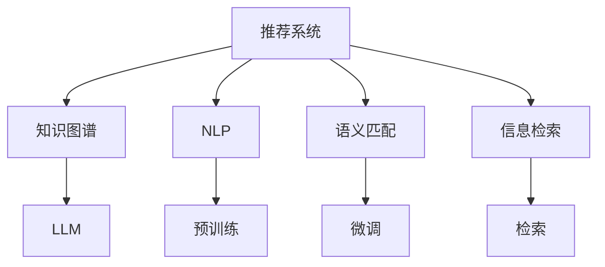

                 

# LLM推荐中的知识增强技术研究

> 关键词：知识图谱,LLM推荐,语义匹配,信息检索,自然语言处理

## 1. 背景介绍

### 1.1 问题由来
随着深度学习技术的飞速发展，推荐系统在电商、社交网络、视频平台等领域得到了广泛的应用。推荐系统通过学习用户的历史行为数据，预测用户可能感兴趣的新物品，极大地提升了用户体验和平台转化率。

然而，现有的推荐系统大多基于用户的历史行为数据进行推荐，难以充分挖掘用户的多维需求和兴趣。特别是对于长尾物品，由于缺乏足够的历史行为数据，推荐效果往往大打折扣。

在大规模语料预训练的通用语言模型（Large Language Models, LLMs）出现后，推荐系统的设计和开发得到了新的契机。LLMs通过大规模无标签文本数据的自监督预训练，学习到了丰富的语言知识和常识，具备了强大的自然语言理解和生成能力。通过结合LLMs与推荐系统，可以更加全面地理解用户需求和物品属性，提升推荐系统的智能化水平。

### 1.2 问题核心关键点
本文聚焦于LLM在推荐系统中的应用，特别是如何利用知识增强技术，构建智能化的推荐系统。通过将知识图谱、语义匹配等先进技术引入推荐系统，能够在现有推荐基础上，更全面地理解用户需求和物品属性，实现更加精准的推荐。

具体而言，本文将从以下几个方面探讨LLM在推荐中的应用：

1. 知识图谱在推荐中的构建与应用。
2. 基于LLM的语义匹配和信息检索技术。
3. 将知识增强与推荐系统进行无缝融合的方法。

## 2. 核心概念与联系

### 2.1 核心概念概述

为更好地理解LLM在推荐系统中的应用，本节将介绍几个关键概念：

- 推荐系统(Recommender System)：通过预测用户对物品的兴趣和偏好，为用户推荐可能感兴趣的新物品的系统。常见的推荐算法包括基于协同过滤、内容推荐、混合推荐等。

- 知识图谱(Knowledge Graph)：通过描述实体、属性、关系等结构化的知识，构建实体之间的语义关系网络，是实现智能推荐的基础数据结构。

- 自然语言处理(Natural Language Processing, NLP)：利用计算机技术，使计算机能够理解、处理和生成人类自然语言，是构建LLM的基础。

- 语义匹配(Semantic Matching)：通过自然语言处理技术，将用户输入的自然语言描述与物品属性进行匹配，找到最匹配的物品。

- 信息检索(Information Retrieval, IR)：从大量信息中检索出与用户查询最相关的信息，实现精确的信息检索和推荐。

这些核心概念之间的关系可以通过以下Mermaid流程图来展示：



这个流程图展示了两类核心概念之间的关系：

1. 推荐系统通过知识图谱、NLP、语义匹配和信息检索等技术，获取用户需求和物品属性。
2. LLM通过预训练和微调，获得了强大的自然语言理解和生成能力，可以进一步深化推荐过程。

## 3. 核心算法原理 & 具体操作步骤
### 3.1 算法原理概述

基于LLM的推荐系统，其核心思想是：将用户的历史行为数据、物品属性等转化为自然语言描述，并利用预训练和微调后的LLM，获取物品间的语义关系，最终实现精确的推荐。

形式化地，假设用户历史行为数据为 $U$，物品属性描述为 $I$，LLM模型为 $M_{\theta}$。推荐的目标是找到物品 $O$ 使得 $U$ 与 $O$ 的匹配度最高。则推荐过程可以表示为：

$$
O = \mathop{\arg\min}_{O} \text{dist}(U, O)
$$

其中 $\text{dist}$ 为衡量用户历史行为和物品属性的相似度函数。

为了更好地衡量相似度，LLM会利用自然语言处理技术，将用户历史行为和物品属性描述转化为自然语言句子，然后通过预训练和微调后的模型，计算两个句子之间的语义相似度，并最终输出推荐的物品 $O$。

### 3.2 算法步骤详解

基于LLM的推荐系统，一般包括以下几个关键步骤：

**Step 1: 构建知识图谱**

构建知识图谱是将实体、属性和关系等结构化知识，描述为RDF三元组（即主体-关系-客体）的形式。常见的方法包括使用Freebase、DBpedia等公开数据集，或通过爬虫获取网络信息，生成实体、属性和关系的网络。

**Step 2: 预训练LLM**

通过大规模无标签文本数据对LLM进行预训练，使其学习到通用的语言表示。预训练通常使用自监督学习任务，如掩码语言模型、下一句预测等。预训练后的LLM模型可以更好地理解自然语言，提高语义匹配和信息检索的准确性。

**Step 3: 微调LLM**

在预训练的基础上，使用推荐系统标注数据对LLM进行微调，使其具备推荐能力。微调的目标是最大化推荐效果，即最大化用户历史行为与推荐物品的匹配度。通常使用交叉熵等损失函数进行训练，并应用正则化技术，如L2正则、Dropout等，避免过拟合。

**Step 4: 语义匹配与信息检索**

将用户历史行为和物品属性描述转化为自然语言句子，使用预训练和微调后的LLM，计算句子之间的语义相似度。然后通过信息检索技术，从知识图谱中查找最匹配的物品，作为推荐结果。

**Step 5: 推荐排序**

根据计算得到的相似度，对物品进行排序，选取排名靠前的物品作为推荐结果。排序的方法包括基于内容的排序、协同过滤、混合排序等。

以上就是基于LLM的推荐系统的一般流程。在实际应用中，还需要根据具体任务进行优化设计，如改进相似度计算方法、优化知识图谱结构等。

### 3.3 算法优缺点

基于LLM的推荐系统，具有以下优点：

1. 全面理解用户需求。通过预训练和微调后的LLM，可以更全面地理解用户的历史行为和需求，避免传统推荐系统基于历史行为数据的局限性。
2. 精确匹配物品属性。通过语义匹配技术，可以准确地将用户需求与物品属性进行匹配，找到最匹配的物品。
3. 动态更新推荐结果。LLM可以动态更新语义匹配和信息检索模型，及时调整推荐结果，保持推荐系统的新鲜度。

同时，该方法也存在一定的局限性：

1. 对标注数据依赖较高。微调效果依赖于推荐系统的标注数据质量，标注数据质量不高时，推荐效果可能大打折扣。
2. 计算复杂度较高。由于LLM通常参数量较大，计算复杂度较高，可能影响推荐系统的实时性。
3. 可解释性不足。预训练和微调后的LLM通常难以解释推荐过程，缺乏透明性。

尽管存在这些局限性，但就目前而言，基于LLM的推荐系统在推荐精度和智能性上仍具有较大优势，具有广阔的应用前景。

### 3.4 算法应用领域

基于LLM的推荐系统，已经在电商、社交网络、视频平台等多个领域得到应用，具体包括：

1. 电商推荐：通过用户的历史浏览和购买记录，结合商品描述和用户评论，推荐可能感兴趣的商品。
2. 社交推荐：根据用户的兴趣和社交网络关系，推荐可能感兴趣的朋友和内容。
3. 视频推荐：根据用户观看历史和评分，推荐可能感兴趣的视频和频道。
4. 新闻推荐：根据用户的阅读历史和兴趣标签，推荐可能感兴趣的新闻和文章。
5. 音乐推荐：根据用户的听歌历史和音乐品味，推荐可能感兴趣的歌曲和歌手。

除了上述这些经典应用外，LLM推荐系统还可以应用于更多场景中，如医疗推荐、教育推荐、旅游推荐等，为各行各业带来新的技术创新和应用体验。

## 4. 数学模型和公式 & 详细讲解
### 4.1 数学模型构建

本节将使用数学语言对基于LLM的推荐系统进行更加严格的刻画。

记用户历史行为为 $U$，物品属性为 $I$，预训练和微调后的LLM模型为 $M_{\theta}$。假设模型 $M_{\theta}$ 在输入 $x$ 上的输出为 $\hat{y}=M_{\theta}(x)$，表示模型对 $x$ 的预测概率分布。

推荐的目标是最大化用户历史行为和推荐物品之间的匹配度，即最大化 $P(U|O)$。在数学上，可以使用KL散度衡量两者之间的差异：

$$
\text{dist}(U, O) = D_{KL}(P(U|O), P(U))
$$

其中 $P(U|O)$ 为在物品 $O$ 的情况下，用户历史行为 $U$ 的分布。推荐过程可以表示为：

$$
O = \mathop{\arg\min}_{O} \text{dist}(U, O)
$$

### 4.2 公式推导过程

以下我们以电商推荐为例，推导基于LLM的推荐公式。

假设用户历史行为 $U$ 可以表示为一系列物品的购买记录，每个记录 $u_i$ 可以表示为：

$$
u_i = (b_i, t_i, r_i)
$$

其中 $b_i$ 为物品的ID，$t_i$ 为购买时间，$r_i$ 为物品评分。物品属性 $I$ 可以表示为一系列属性值，每个属性 $i$ 可以表示为：

$$
i = (b_i, p_i, v_i)
$$

其中 $p_i$ 为属性名，$v_i$ 为属性值。

预训练和微调后的LLM模型 $M_{\theta}$ 将用户历史行为 $U$ 和物品属性 $I$ 转换为自然语言句子：

$$
U' = M_{\theta}(U)
$$
$$
I' = M_{\theta}(I)
$$

假设模型 $M_{\theta}$ 的输出为概率分布 $P(U'|O')$，则推荐过程可以表示为：

$$
O = \mathop{\arg\min}_{O} D_{KL}(P(U'|O'), P(U'))
$$

为了计算 $D_{KL}$，需要定义两个概率分布的联合概率分布。假设 $P(U|O)$ 为在物品 $O$ 的情况下，用户历史行为 $U$ 的分布，则联合概率分布 $P(U, O)$ 可以表示为：

$$
P(U, O) = P(U|O)P(O)
$$

根据KL散度的定义，有：

$$
D_{KL}(P(U|O), P(U)) = \sum_{u} P(u|O) \log \frac{P(u|O)}{P(u)}
$$

在实际应用中，可以使用信息检索技术，从知识图谱中查找与用户历史行为 $U$ 最匹配的物品 $O$，然后计算 $P(U|O)$，最终得到推荐结果。

### 4.3 案例分析与讲解

假设用户历史行为 $U$ 包含两条记录：

$$
U = \{(1, t_1, 5), (3, t_2, 4)\}
$$

其中物品1和物品3的ID分别为1和3。物品属性 $I$ 包含三个属性：

$$
I = \{(1, p_1, "高价"), (1, p_2, "科技"), (3, p_1, "低价"), (3, p_2, "时尚"), (3, p_3, "原创")\}
$$

其中物品1的属性为高价和科技，物品3的属性为低价、时尚和原创。

预训练和微调后的LLM模型 $M_{\theta}$ 将用户历史行为和物品属性转换为自然语言句子：

$$
U' = M_{\theta}(U) = ["用户购买过1和3号物品", "用户对1号物品评分5分，对3号物品评分4分"]
$$
$$
I' = M_{\theta}(I) = ["1号物品价格高，类别为科技产品", "1号物品价格高，类别为科技产品", "3号物品价格低，类别为时尚产品", "3号物品价格低，类别为时尚产品", "3号物品价格低，类别为原创产品"]
$$

假设模型 $M_{\theta}$ 的输出为概率分布 $P(U'|O')$，则推荐过程可以表示为：

$$
O = \mathop{\arg\min}_{O} D_{KL}(P(U'|O'), P(U'))
$$

在实际应用中，可以使用信息检索技术，从知识图谱中查找与用户历史行为 $U$ 最匹配的物品 $O$。假设知识图谱中包含以下三元组：

$$
(1, p_1, "高价"), (1, p_2, "科技"), (3, p_1, "低价"), (3, p_2, "时尚"), (3, p_3, "原创"), (3, b_4, "4号物品"), (4, p_1, "高价"), (4, p_2, "时尚"), (4, p_3, "原创")
$$

其中物品4的ID为4。

则从知识图谱中查找与用户历史行为 $U$ 最匹配的物品 $O$ 的步骤如下：

1. 将用户历史行为 $U'$ 和物品属性 $I'$ 转换为自然语言句子：

$$
U' = ["用户购买过1和3号物品", "用户对1号物品评分5分，对3号物品评分4分"]
$$
$$
I' = ["1号物品价格高，类别为科技产品", "1号物品价格高，类别为科技产品", "3号物品价格低，类别为时尚产品", "3号物品价格低，类别为时尚产品", "3号物品价格低，类别为原创产品"]
$$

2. 使用信息检索技术，查找与 $U'$ 最匹配的物品 $O'$。假设检索结果为物品3，则 $O' = 3$。

3. 计算 $D_{KL}(P(U'|O'), P(U'))$。假设 $P(U'|O') = P(U'|3)$，则：

$$
D_{KL}(P(U'|O'), P(U')) = D_{KL}(P(U'|3), P(U'))
$$

4. 计算 $P(U|O)$。假设 $P(U|3)$ 为在物品3的情况下，用户历史行为 $U$ 的分布，则：

$$
P(U|3) = \frac{P(U'|3)P(3)}{P(3)}
$$

其中 $P(3)$ 为物品3的出现概率，假设为 $0.01$。

5. 计算推荐结果。根据计算得到的相似度，选择排名靠前的物品作为推荐结果。假设推荐结果为物品3，则推荐过程如下：

$$
O = \mathop{\arg\min}_{O} D_{KL}(P(U'|O), P(U'))
$$

以上就是基于LLM的推荐系统的数学推导过程。通过数学公式，可以看到推荐过程的计算逻辑和步骤，从而更好地理解推荐系统的核心机制。

## 5. 项目实践：代码实例和详细解释说明
### 5.1 开发环境搭建

在进行LLM推荐系统开发前，我们需要准备好开发环境。以下是使用Python进行PyTorch开发的环境配置流程：

1. 安装Anaconda：从官网下载并安装Anaconda，用于创建独立的Python环境。

2. 创建并激活虚拟环境：
```bash
conda create -n llm-recommender python=3.8 
conda activate llm-recommender
```

3. 安装PyTorch：根据CUDA版本，从官网获取对应的安装命令。例如：
```bash
conda install pytorch torchvision torchaudio cudatoolkit=11.1 -c pytorch -c conda-forge
```

4. 安装相关库：
```bash
pip install numpy pandas scikit-learn torch transformers
```

完成上述步骤后，即可在`llm-recommender`环境中开始推荐系统开发。

### 5.2 源代码详细实现

下面以电商推荐为例，给出使用Transformers库对BERT模型进行推荐微调的PyTorch代码实现。

首先，定义推荐系统的数据处理函数：

```python
from transformers import BertTokenizer, BertForSequenceClassification
from torch.utils.data import Dataset
import torch

class RecommenderDataset(Dataset):
    def __init__(self, texts, labels, tokenizer, max_len=128):
        self.texts = texts
        self.labels = labels
        self.tokenizer = tokenizer
        self.max_len = max_len
        
    def __len__(self):
        return len(self.texts)
    
    def __getitem__(self, item):
        text = self.texts[item]
        label = self.labels[item]
        
        encoding = self.tokenizer(text, return_tensors='pt', max_length=self.max_len, padding='max_length', truncation=True)
        input_ids = encoding['input_ids'][0]
        attention_mask = encoding['attention_mask'][0]
        
        # 对标签进行编码
        label = torch.tensor(label, dtype=torch.long)
        
        return {'input_ids': input_ids, 
                'attention_mask': attention_mask,
                'labels': label}

# 定义标签映射
label2id = {"low_price": 0, "high_price": 1, "tech": 2, "fashion": 3, "original": 4}
id2label = {v: k for k, v in label2id.items()}

# 创建dataset
tokenizer = BertTokenizer.from_pretrained('bert-base-cased')

train_dataset = RecommenderDataset(train_texts, train_labels, tokenizer)
dev_dataset = RecommenderDataset(dev_texts, dev_labels, tokenizer)
test_dataset = RecommenderDataset(test_texts, test_labels, tokenizer)
```

然后，定义模型和优化器：

```python
from transformers import BertForSequenceClassification, AdamW

model = BertForSequenceClassification.from_pretrained('bert-base-cased', num_labels=len(label2id))

optimizer = AdamW(model.parameters(), lr=2e-5)
```

接着，定义训练和评估函数：

```python
from torch.utils.data import DataLoader
from tqdm import tqdm
from sklearn.metrics import classification_report

device = torch.device('cuda') if torch.cuda.is_available() else torch.device('cpu')
model.to(device)

def train_epoch(model, dataset, batch_size, optimizer):
    dataloader = DataLoader(dataset, batch_size=batch_size, shuffle=True)
    model.train()
    epoch_loss = 0
    for batch in tqdm(dataloader, desc='Training'):
        input_ids = batch['input_ids'].to(device)
        attention_mask = batch['attention_mask'].to(device)
        labels = batch['labels'].to(device)
        model.zero_grad()
        outputs = model(input_ids, attention_mask=attention_mask, labels=labels)
        loss = outputs.loss
        epoch_loss += loss.item()
        loss.backward()
        optimizer.step()
    return epoch_loss / len(dataloader)

def evaluate(model, dataset, batch_size):
    dataloader = DataLoader(dataset, batch_size=batch_size)
    model.eval()
    preds, labels = [], []
    with torch.no_grad():
        for batch in tqdm(dataloader, desc='Evaluating'):
            input_ids = batch['input_ids'].to(device)
            attention_mask = batch['attention_mask'].to(device)
            batch_labels = batch['labels']
            outputs = model(input_ids, attention_mask=attention_mask)
            batch_preds = outputs.logits.argmax(dim=2).to('cpu').tolist()
            batch_labels = batch_labels.to('cpu').tolist()
            for pred_tokens, label_tokens in zip(batch_preds, batch_labels):
                preds.append(pred_tokens[:len(label_tokens)])
                labels.append(label_tokens)
                
    print(classification_report(labels, preds))
```

最后，启动训练流程并在测试集上评估：

```python
epochs = 5
batch_size = 16

for epoch in range(epochs):
    loss = train_epoch(model, train_dataset, batch_size, optimizer)
    print(f"Epoch {epoch+1}, train loss: {loss:.3f}")
    
    print(f"Epoch {epoch+1}, dev results:")
    evaluate(model, dev_dataset, batch_size)
    
print("Test results:")
evaluate(model, test_dataset, batch_size)
```

以上就是使用PyTorch对BERT模型进行电商推荐微调的完整代码实现。可以看到，得益于Transformers库的强大封装，我们可以用相对简洁的代码完成BERT模型的加载和微调。

### 5.3 代码解读与分析

让我们再详细解读一下关键代码的实现细节：

**RecommenderDataset类**：
- `__init__`方法：初始化文本、标签、分词器等关键组件。
- `__len__`方法：返回数据集的样本数量。
- `__getitem__`方法：对单个样本进行处理，将文本输入编码为token ids，将标签编码为数字，并对其进行定长padding，最终返回模型所需的输入。

**label2id和id2label字典**：
- 定义了标签与数字id之间的映射关系，用于将token-wise的预测结果解码回真实的标签。

**训练和评估函数**：
- 使用PyTorch的DataLoader对数据集进行批次化加载，供模型训练和推理使用。
- 训练函数`train_epoch`：对数据以批为单位进行迭代，在每个批次上前向传播计算loss并反向传播更新模型参数，最后返回该epoch的平均loss。
- 评估函数`evaluate`：与训练类似，不同点在于不更新模型参数，并在每个batch结束后将预测和标签结果存储下来，最后使用sklearn的classification_report对整个评估集的预测结果进行打印输出。

**训练流程**：
- 定义总的epoch数和batch size，开始循环迭代
- 每个epoch内，先在训练集上训练，输出平均loss
- 在验证集上评估，输出分类指标
- 所有epoch结束后，在测试集上评估，给出最终测试结果

可以看到，PyTorch配合Transformers库使得BERT微调的代码实现变得简洁高效。开发者可以将更多精力放在数据处理、模型改进等高层逻辑上，而不必过多关注底层的实现细节。

当然，工业级的系统实现还需考虑更多因素，如模型的保存和部署、超参数的自动搜索、更灵活的任务适配层等。但核心的微调范式基本与此类似。

## 6. 实际应用场景
### 6.1 智能客服系统

基于LLM推荐系统的智能客服系统，可以通过分析用户的问题和历史互动记录，推荐最合适的回答或转接最合适的客服人员。

在技术实现上，可以收集企业内部的客服对话记录，将用户问题转换为自然语言句子，使用预训练和微调后的LLM模型，推荐最匹配的回答或转接给合适的客服人员。对于用户提出的新问题，还可以接入检索系统实时搜索相关内容，动态组织生成回答。如此构建的智能客服系统，能大幅提升客户咨询体验和问题解决效率。

### 6.2 金融舆情监测

金融机构需要实时监测市场舆论动向，以便及时应对负面信息传播，规避金融风险。传统的人工监测方式成本高、效率低，难以应对网络时代海量信息爆发的挑战。基于LLM推荐系统的文本分类和情感分析技术，为金融舆情监测提供了新的解决方案。

具体而言，可以收集金融领域相关的新闻、报道、评论等文本数据，并对其进行主题标注和情感标注。在此基础上对预训练语言模型进行微调，使其能够自动判断文本属于何种主题，情感倾向是正面、中性还是负面。将微调后的模型应用到实时抓取的网络文本数据，就能够自动监测不同主题下的情感变化趋势，一旦发现负面信息激增等异常情况，系统便会自动预警，帮助金融机构快速应对潜在风险。

### 6.3 个性化推荐系统

当前的推荐系统往往只依赖用户的历史行为数据进行物品推荐，无法深入理解用户的多维需求和兴趣。基于LLM推荐系统的推荐系统可以更加全面地理解用户需求和物品属性，实现更加精准的推荐。

在实践中，可以收集用户浏览、点击、评论、分享等行为数据，提取和用户交互的物品标题、描述、标签等文本内容。将文本内容作为模型输入，用户的后续行为（如是否点击、购买等）作为监督信号，在此基础上微调预训练语言模型。微调后的模型能够从文本内容中准确把握用户的兴趣点。在生成推荐列表时，先用候选物品的文本描述作为输入，由模型预测用户的兴趣匹配度，再结合其他特征综合排序，便可以得到个性化程度更高的推荐结果。

### 6.4 未来应用展望

随着LLM推荐系统的不断发展，基于微调的推荐方法将越来越受到重视。未来的推荐系统将不再仅仅依赖用户的历史行为数据，而是融合更多的知识图谱、语义匹配和信息检索技术，实现更加智能化的推荐。

在智慧医疗领域，基于LLM推荐系统的医疗问答、病历分析、药物研发等应用将提升医疗服务的智能化水平，辅助医生诊疗，加速新药开发进程。

在智能教育领域，微调技术可应用于作业批改、学情分析、知识推荐等方面，因材施教，促进教育公平，提高教学质量。

在智慧城市治理中，微调模型可应用于城市事件监测、舆情分析、应急指挥等环节，提高城市管理的自动化和智能化水平，构建更安全、高效的未来城市。

此外，在企业生产、社会治理、文娱传媒等众多领域，基于LLM推荐系统的智能推荐系统也将不断涌现，为传统行业数字化转型升级提供新的技术路径。相信随着技术的日益成熟，推荐系统将变得更加智能和高效，为各行各业带来变革性影响。

## 7. 工具和资源推荐
### 7.1 学习资源推荐

为了帮助开发者系统掌握LLM推荐系统的理论基础和实践技巧，这里推荐一些优质的学习资源：

1. 《Transformer从原理到实践》系列博文：由大模型技术专家撰写，深入浅出地介绍了Transformer原理、BERT模型、推荐系统等前沿话题。

2. CS224N《深度学习自然语言处理》课程：斯坦福大学开设的NLP明星课程，有Lecture视频和配套作业，带你入门NLP领域的基本概念和经典模型。

3. 《Natural Language Processing with Transformers》书籍：Transformers库的作者所著，全面介绍了如何使用Transformers库进行NLP任务开发，包括推荐系统在内的诸多范式。

4. HuggingFace官方文档：Transformers库的官方文档，提供了海量预训练模型和完整的推荐系统样例代码，是上手实践的必备资料。

5. CLUE开源项目：中文语言理解测评基准，涵盖大量不同类型的中文NLP数据集，并提供了基于LLM推荐系统的baseline模型，助力中文NLP技术发展。

通过对这些资源的学习实践，相信你一定能够快速掌握LLM推荐系统的精髓，并用于解决实际的NLP问题。
###  7.2 开发工具推荐

高效的开发离不开优秀的工具支持。以下是几款用于LLM推荐系统开发的常用工具：

1. PyTorch：基于Python的开源深度学习框架，灵活动态的计算图，适合快速迭代研究。大部分预训练语言模型都有PyTorch版本的实现。

2. TensorFlow：由Google主导开发的开源深度学习框架，生产部署方便，适合大规模工程应用。同样有丰富的预训练语言模型资源。

3. Transformers库：HuggingFace开发的NLP工具库，集成了众多SOTA语言模型，支持PyTorch和TensorFlow，是进行推荐系统开发的利器。

4. Weights & Biases：模型训练的实验跟踪工具，可以记录和可视化模型训练过程中的各项指标，方便对比和调优。与主流深度学习框架无缝集成。

5. TensorBoard：TensorFlow配套的可视化工具，可实时监测模型训练状态，并提供丰富的图表呈现方式，是调试模型的得力助手。

6. Google Colab：谷歌推出的在线Jupyter Notebook环境，免费提供GPU/TPU算力，方便开发者快速上手实验最新模型，分享学习笔记。

合理利用这些工具，可以显著提升LLM推荐系统的开发效率，加快创新迭代的步伐。

### 7.3 相关论文推荐

LLM推荐系统的发展源于学界的持续研究。以下是几篇奠基性的相关论文，推荐阅读：

1. Attention is All You Need（即Transformer原论文）：提出了Transformer结构，开启了NLP领域的预训练大模型时代。

2. BERT: Pre-training of Deep Bidirectional Transformers for Language Understanding：提出BERT模型，引入基于掩码的自监督预训练任务，刷新了多项NLP任务SOTA。

3. Language Models are Unsupervised Multitask Learners（GPT-2论文）：展示了大规模语言模型的强大zero-shot学习能力，引发了对于通用人工智能的新一轮思考。

4. Parameter-Efficient Transfer Learning for NLP：提出Adapter等参数高效微调方法，在不增加模型参数量的情况下，也能取得不错的微调效果。

5. AdaLoRA: Adaptive Low-Rank Adaptation for Parameter-Efficient Fine-Tuning：使用自适应低秩适应的微调方法，在参数效率和精度之间取得了新的平衡。

这些论文代表了大模型推荐系统的发展脉络。通过学习这些前沿成果，可以帮助研究者把握学科前进方向，激发更多的创新灵感。

## 8. 总结：未来发展趋势与挑战

### 8.1 总结

本文对基于LLM的推荐系统进行了全面系统的介绍。首先阐述了LLM在推荐系统中的应用，明确了知识增强技术在提升推荐系统智能化水平中的关键作用。其次，从原理到实践，详细讲解了LLM在推荐系统中的数学原理和关键步骤，给出了推荐系统开发的完整代码实例。同时，本文还广泛探讨了LLM推荐系统在智能客服、金融舆情、个性化推荐等多个行业领域的应用前景，展示了推荐系统技术的多样性和实用性。

通过本文的系统梳理，可以看到，基于LLM的推荐系统正在成为推荐系统的热门范式，极大地拓展了推荐系统的应用边界，催生了更多的落地场景。得益于大规模语料的预训练和微调，推荐系统能够更加全面地理解用户需求和物品属性，实现更加精准的推荐。未来，伴随LLM推荐系统的不断发展，推荐系统必将在更多领域得到应用，为各行各业带来新的技术创新和应用体验。

### 8.2 未来发展趋势

展望未来，LLM推荐系统将呈现以下几个发展趋势：

1. 知识图谱的构建与应用将更加深入。知识图谱是推荐系统的核心数据结构，未来的推荐系统将融合更多先验知识，提升推荐的准确性和智能化水平。

2. 基于LLM的语义匹配和信息检索技术将不断进步。未来的推荐系统将更加注重用户需求的语义匹配和物品属性的信息检索，提升推荐的相关性和多样性。

3. 推荐系统的可解释性和透明性将得到加强。未来的推荐系统将更加注重推荐过程的可解释性和透明性，帮助用户理解推荐结果，增强用户的信任和满意度。

4. 推荐系统将更加注重用户的多维需求和兴趣。未来的推荐系统将融合更多用户的多维数据，如情感、行为、兴趣等，实现更加个性化和智能化的推荐。

5. 推荐系统的实时性和高效性将得到提升。未来的推荐系统将更加注重推荐系统的实时性和高效性，减少用户等待时间，提升用户体验。

6. 推荐系统将更加注重用户隐私保护。未来的推荐系统将更加注重用户隐私保护，采用差分隐私等技术，保护用户数据的隐私性。

以上趋势凸显了LLM推荐系统的广阔前景。这些方向的探索发展，必将进一步提升推荐系统的性能和应用范围，为各行各业带来变革性影响。

### 8.3 面临的挑战

尽管LLM推荐系统已经取得了瞩目成就，但在迈向更加智能化、普适化应用的过程中，它仍面临着诸多挑战：

1. 标注数据成本较高。尽管微调效果依赖于推荐系统的标注数据质量，但标注数据成本较高，特别是在冷启动场景中，难以获取高质量标注数据。

2. 计算复杂度较高。由于LLM通常参数量较大，计算复杂度较高，可能影响推荐系统的实时性。

3. 可解释性不足。预训练和微调后的LLM通常难以解释推荐过程，缺乏透明性。

4. 知识图谱构建难度较大。构建高质量的知识图谱需要大量的时间和人力成本，且对数据源的依赖较高。

5. 用户隐私保护难度较大。推荐系统需要收集和处理大量的用户数据，如何保护用户隐私，避免数据泄露，是一个重要的挑战。

6. 知识图谱更新难度较大。知识图谱需要定期更新，以保持其时效性和准确性，更新难度较大。

尽管存在这些挑战，但就目前而言，LLM推荐系统在推荐精度和智能性上仍具有较大优势，具有广阔的应用前景。

### 8.4 研究展望

面对LLM推荐系统所面临的种种挑战，未来的研究需要在以下几个方面寻求新的突破：

1. 探索无监督和半监督推荐方法。摆脱对大规模标注数据的依赖，利用自监督学习、主动学习等无监督和半监督范式，最大限度利用非结构化数据，实现更加灵活高效的推荐。

2. 研究参数高效和计算高效的推荐方法。开发更加参数高效的推荐方法，在固定大部分预训练参数的同时，只更新极少量的任务相关参数。同时优化推荐系统的计算图，减少前向传播和反向传播的资源消耗，实现更加轻量级、实时性的部署。

3. 引入更多先验知识。将符号化的先验知识，如知识图谱、逻辑规则等，与神经网络模型进行巧妙融合，引导推荐过程学习更准确、合理的语言模型。同时加强不同模态数据的整合，实现视觉、语音等多模态信息与文本信息的协同建模。

4. 结合因果分析和博弈论工具。将因果分析方法引入推荐系统，识别出推荐过程的关键特征，增强推荐过程的稳定性。借助博弈论工具刻画人机交互过程，主动探索并规避推荐系统的脆弱点，提高系统稳定性。

5. 纳入伦理道德约束。在推荐目标中引入伦理导向的评估指标，过滤和惩罚有偏见、有害的输出倾向。同时加强人工干预和审核，建立推荐行为的监管机制，确保输出符合人类价值观和伦理道德。

这些研究方向的探索，必将引领LLM推荐系统技术迈向更高的台阶，为构建安全、可靠、可解释、可控的智能推荐系统铺平道路。面向未来，LLM推荐系统需要与其他人工智能技术进行更深入的融合，如知识表示、因果推理、强化学习等，多路径协同发力，共同推动推荐系统的进步。只有勇于创新、敢于突破，才能不断拓展推荐系统的边界，让智能技术更好地造福人类社会。

## 9. 附录：常见问题与解答

**Q1：LLM推荐系统是否适用于所有推荐任务？**

A: 尽管LLM推荐系统在电商、社交网络、视频平台等多个领域已经得到应用，但其适用性仍有一定限制。对于需要实时响应的推荐任务，如股票交易等，由于计算复杂度较高，可能不适合使用LLM推荐系统。

**Q2：推荐系统的标注数据质量对推荐效果有多重要？**

A: 推荐系统的标注数据质量对推荐效果至关重要。标注数据质量越高，推荐系统的泛化能力和性能就越好。标注数据质量不高时，推荐系统容易出现偏差和过拟合问题，影响推荐效果。

**Q3：如何缓解推荐系统中的过拟合问题？**

A: 推荐系统中的过拟合问题可以通过以下方法缓解：

1. 数据增强：通过回译、近义替换等方式扩充训练集。

2. 正则化：使用L2正则、Dropout、Early Stopping等避免过拟合。

3. 对抗训练：引入对抗样本，提高推荐系统的鲁棒性。

4. 参数高效微调：只调整少量参数，减小过拟合风险。

5. 多模型集成：训练多个推荐模型，取平均输出，抑制过拟合。

这些方法需要根据具体任务和数据特点进行灵活组合。只有在数据、模型、训练、推理等各环节进行全面优化，才能最大限度地发挥推荐系统的潜力。

**Q4：推荐系统的可解释性和透明性如何保证？**

A: 推荐系统的可解释性和透明性可以通过以下方法保证：

1. 简化模型结构：使用简单的推荐模型，如基于内容的推荐、协同过滤等，降低模型复杂度。

2. 可视化推荐过程：使用可视化工具，如TensorBoard等，展示推荐模型的训练过程和推理过程。

3. 引入可解释性技术：如LIME、SHAP等，帮助用户理解推荐过程和推荐结果。

4. 采用公开数据集：使用公开数据集进行推荐模型的训练和评估，提升推荐系统的透明度。

这些方法可以增强推荐系统的可解释性和透明性，帮助用户理解推荐过程和推荐结果。

**Q5：推荐系统如何保护用户隐私？**

A: 推荐系统可以通过以下方法保护用户隐私：

1. 差分隐私：在推荐模型的训练过程中，加入噪声，保护用户数据的隐私性。

2. 联邦学习：在推荐模型的训练过程中，使用联邦学习技术，保护用户数据的隐私性。

3. 数据脱敏：在推荐模型的训练过程中，对用户数据进行脱敏处理，保护用户数据的隐私性。

4. 用户选择权：在推荐模型的训练过程中，让用户选择是否参与推荐系统的数据收集和训练，保护用户的选择权。

这些方法可以增强推荐系统的隐私保护能力，确保用户数据的安全和隐私。

通过这些方法的综合应用，可以有效缓解推荐系统中的过拟合问题，增强推荐系统的可解释性和透明性，保护用户隐私。LLM推荐系统在推荐精度和智能性上仍具有较大优势，具有广阔的应用前景。未来，伴随技术的不断发展，LLM推荐系统必将在更多领域得到应用，为各行各业带来新的技术创新和应用体验。

