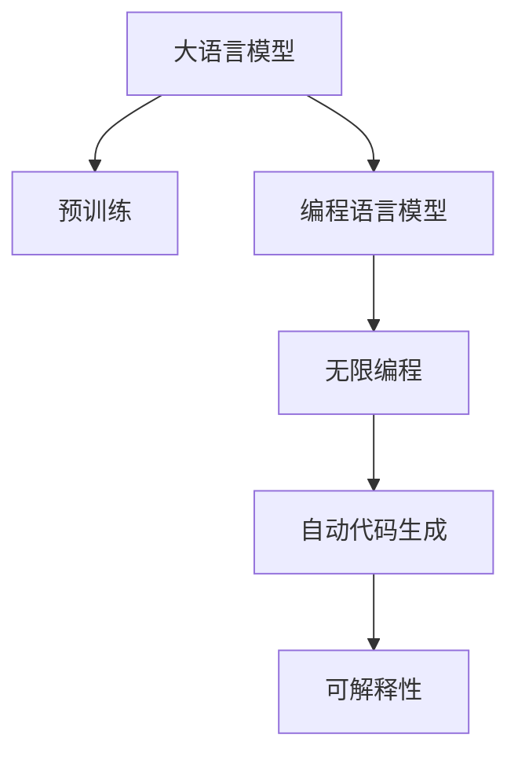

                 

# LLM无限编程:创造无限可能

> 关键词：
1. 大语言模型 (LLM)
2. 无限编程
3. 深度学习
4. 神经网络
5. 计算机视觉
6. 自然语言处理
7. 人工智能应用

## 1. 背景介绍

### 1.1 问题由来
随着人工智能(AI)技术的飞速发展，大语言模型(Large Language Models, LLMs)已成为当今AI领域的核心工具。以GPT系列模型为代表的大语言模型，凭借其强大的语言理解和生成能力，在自然语言处理(Natural Language Processing, NLP)、计算机视觉(Computer Vision, CV)、语音识别(Speech Recognition)等多个领域中取得了一系列突破。

然而，尽管大语言模型在通用性上有着显著的优势，但它们的“无限编程”能力依然有待探索。与传统的规则导向系统不同，LLMs可以通过学习大量数据，逐步“学习”到不同的编程技巧，并实现复杂功能。但如何最大化LLMs的编程能力，使其能够生成高质量、高效的代码，并成功部署到实际应用中，仍是当前研究的热点问题。

### 1.2 问题核心关键点
基于大语言模型进行编程的无限编程，核心在于如何构建一个能够利用通用预训练模型，自动生成高质量代码的系统。要实现这一目标，需要：
- 开发能够利用预训练模型理解、解析、生成代码的技术。
- 设计能够利用代码生成技术的AI工具，以提高代码编写效率和质量。
- 探索如何使无限编程模型与现有软件开发流程和工具无缝集成，以促进AI在编程领域的应用。

### 1.3 问题研究意义
研究LLM无限编程的实践意义主要体现在以下几个方面：
1. 提升编程效率：无限编程技术可以大大降低编写代码所需的时间和精力，特别是对于需要大量重复性工作的场景。
2. 促进技术创新：无限编程可以使开发者专注于创新点，而非冗余的重复劳动，从而推动技术发展。
3. 实现人工智能辅助编程：无限编程技术能够辅助开发者快速完成常见编程任务，提高软件开发效率。
4. 加速产业应用：无限编程可以缩短从创意到产品的时间，加速技术落地，推动人工智能在实际产业中的应用。

## 2. 核心概念与联系

### 2.1 核心概念概述

为更好地理解基于大语言模型的无限编程，本节将介绍几个关键概念：

- 大语言模型(Large Language Model, LLM)：以自回归(如GPT)或自编码(如BERT)模型为代表的大规模预训练语言模型。通过在大规模无标签文本语料上进行预训练，学习通用的语言表示，具备强大的语言理解和生成能力。

- 预训练(Pre-training)：指在大规模无标签文本语料上，通过自监督学习任务训练通用语言模型的过程。常见的预训练任务包括言语建模、遮挡语言模型等。预训练使得模型学习到语言的通用表示。

- 编程语言模型(Programming Language Model)：专门设计用于解析、生成、理解编程语言的模型。通过学习大量编程文档、代码片段，模型能够识别代码结构、语法规则，生成符合编程规范的代码。

- 无限编程(Infinite Programming)：基于预训练语言模型和编程语言模型，自动生成代码并不断自我完善的过程。该过程从无到有，逐步优化，直至生成满足特定需求的高质量代码。

- 自动代码生成(Auto Code Generation)：使用机器学习或深度学习模型，自动化地生成代码片段或完整的代码系统。目标是减少程序员的工作量，提高开发效率。

- 可解释性(Explainability)：确保无限编程生成的代码具有可解释性，便于人类理解和调试。可解释性在关键领域如金融、医疗等尤为重要。

这些核心概念之间的逻辑关系可以通过以下Mermaid流程图来展示：



这个流程图展示了大语言模型的核心概念及其之间的关系：

1. 大语言模型通过预训练获得基础能力。
2. 编程语言模型专门针对编程语言的特征进行训练，能够解析和生成符合编程规范的代码。
3. 无限编程利用预训练模型和编程语言模型，自动生成代码并不断优化。
4. 自动代码生成作为无限编程的一部分，进一步将生成过程自动化。
5. 可解释性确保无限编程生成的代码易于理解，适用于关键应用领域。

这些概念共同构成了大语言模型的编程范式，使其能够实现高效的代码生成和自动优化。

## 3. 核心算法原理 & 具体操作步骤
### 3.1 算法原理概述

基于大语言模型的无限编程，本质上是一个动态生成和优化代码的过程。其核心思想是：将大语言模型视作一个代码生成器，通过不断生成、评估、反馈循环，逐步优化生成的代码，直至满足特定的需求。

形式化地，假设预训练模型为 $M_{\theta}$，其中 $\theta$ 为预训练得到的模型参数。给定编程任务 $T$ 的输入 $I$，无限编程的目标是找到最优的代码生成策略 $\pi$，使得生成的代码 $O(\pi, I)$ 满足编程规范 $C$，并且最接近任务需求 $D$：

$$
\pi^* = \mathop{\arg\min}_{\pi} \mathcal{L}(\pi, I)
$$

其中 $\mathcal{L}$ 为损失函数，用于衡量生成的代码与需求之间的差异。常见的损失函数包括BLEU、ROUGE、F1-score等。

通过梯度下降等优化算法，无限编程过程不断更新生成策略 $\pi$，最小化损失函数 $\mathcal{L}$，使得生成的代码逐步逼近任务需求。由于 $\theta$ 已经通过预训练获得了较好的初始化，因此即便在生成的代码优化过程中，也能较快收敛到理想的生成策略 $\pi^*$。

### 3.2 算法步骤详解

基于大语言模型的无限编程一般包括以下几个关键步骤：

**Step 1: 准备预训练模型和数据集**
- 选择合适的预训练语言模型 $M_{\theta}$ 作为初始化参数，如 GPT 系列模型、BERT 等。
- 准备编程任务 $T$ 的输入数据集 $D$，划分为训练集、验证集和测试集。一般要求输入数据与预训练数据的分布不要差异过大。

**Step 2: 设计编程语言模型**
- 根据任务类型，设计适合的编程语言模型，如 Python 或 JavaScript。
- 使用标注数据集训练编程语言模型，使其能够理解编程语法、结构，生成符合编程规范的代码片段。

**Step 3: 设定优化目标和策略**
- 选择合适的优化算法及其参数，如梯度下降、Adam等，设置学习率、批大小、迭代轮数等。
- 设置正则化技术及强度，包括L2正则、Dropout、Early Stopping等。
- 确定反馈和评估机制，设计评价标准和奖励函数。

**Step 4: 执行代码生成和优化**
- 将输入 $I$ 输入到编程语言模型中，生成初步代码片段。
- 将生成的代码片段输入到大语言模型中，进行解析和优化。
- 周期性在验证集上评估生成代码的质量，根据性能指标决定是否触发优化循环。
- 重复上述步骤直到满足预设的迭代轮数或优化条件。

**Step 5: 测试和部署**
- 在测试集上评估生成代码的质量，对比生成前后的改进。
- 使用生成后的代码进行测试，集成到实际的应用系统中。
- 持续收集新的输入数据，定期重新生成和优化代码，以适应数据分布的变化。

以上是基于大语言模型的无限编程的一般流程。在实际应用中，还需要针对具体任务的特点，对代码生成和优化的各个环节进行优化设计，如改进评估目标函数，引入更多的正则化技术，搜索最优的超参数组合等，以进一步提升代码生成的质量和效率。

### 3.3 算法优缺点

基于大语言模型的无限编程方法具有以下优点：
1. 自动化程度高。无需手动编写代码，极大地减少了人工干预。
2. 生成速度快。通过优化算法不断生成和优化代码，可以快速产出满足需求的结果。
3. 灵活性高。能够灵活适应不同编程语言和任务需求，适用于多样化的编程场景。
4. 可扩展性好。可以不断迭代优化，逐步提高代码的质量和可维护性。

同时，该方法也存在一定的局限性：
1. 依赖高质量数据。无限编程的效果很大程度上取决于输入数据的质量和数量，获取高质量编程数据较为困难。
2. 生成的代码可解释性不足。无限编程生成的代码可能难以理解，缺乏逻辑性。
3. 潜在错误风险高。无限编程生成的代码可能包含未经验证的语法错误或逻辑错误，需要人工审核。
4. 跨领域迁移能力有限。当任务需求与预训练数据的分布差异较大时，无限编程的效果提升有限。

尽管存在这些局限性，但就目前而言，基于大语言模型的无限编程方法仍然是大规模生成和优化代码的重要手段。未来相关研究的重点在于如何进一步降低对高质量数据的依赖，提高代码生成的可解释性和跨领域迁移能力，同时兼顾可解释性和伦理安全性等因素。

### 3.4 算法应用领域

基于大语言模型的无限编程方法，已经在多个领域得到了广泛的应用，例如：

- 软件开发：如自动代码生成、代码修复、自动化测试等。使用无限编程技术，可以自动生成高效、可靠的代码。
- 数据分析：如数据清洗、处理、可视化等。使用无限编程技术，可以快速构建数据分析工具。
- 机器学习：如模型构建、优化、调参等。使用无限编程技术，可以自动生成高效的模型和算法。
- 网络安全：如漏洞分析、自动化测试等。使用无限编程技术，可以快速生成测试脚本和安全规则。
- 自然语言处理：如对话系统、智能客服等。使用无限编程技术，可以自动生成自然语言处理系统。

除了上述这些经典应用外，无限编程技术还被创新性地应用到更多场景中，如智能文档生成、自动化报告、自动API开发等，为软件开发带来了全新的突破。

## 4. 数学模型和公式 & 详细讲解 & 举例说明
### 4.1 数学模型构建

本节将使用数学语言对基于大语言模型的无限编程过程进行更加严格的刻画。

记预训练语言模型为 $M_{\theta}$，其中 $\theta$ 为模型参数。假设编程任务 $T$ 的输入数据为 $I$，生成的代码片段为 $O$。

定义模型 $M_{\theta}$ 在输入 $I$ 上的损失函数为 $\ell(M_{\theta}(I),O)$，则在数据集 $D$ 上的经验风险为：

$$
\mathcal{L}(\theta) = \frac{1}{N}\sum_{i=1}^N \ell(M_{\theta}(I_i),O_i)
$$

其中 $O_i$ 为第 $i$ 个输入数据的生成代码片段。

无限编程的优化目标是最小化经验风险，即找到最优的生成策略 $\pi$：

$$
\pi^* = \mathop{\arg\min}_{\pi} \mathcal{L}(\pi, I)
$$

在实践中，我们通常使用基于梯度的优化算法（如SGD、Adam等）来近似求解上述最优化问题。设 $\eta$ 为学习率，$\lambda$ 为正则化系数，则生成策略的更新公式为：

$$
\pi \leftarrow \pi - \eta \nabla_{\pi}\mathcal{L}(\pi) - \eta\lambda\pi
$$

其中 $\nabla_{\pi}\mathcal{L}(\pi)$ 为损失函数对生成策略 $\pi$ 的梯度，可通过反向传播算法高效计算。

### 4.2 公式推导过程

以下我们以自动代码生成(Auto Code Generation)任务为例，推导基于大语言模型的无限编程过程。

假设编程任务 $T$ 的输入数据为 $I$，生成的代码片段为 $O$。则自动代码生成的损失函数定义为：

$$
\ell(M_{\theta}(I),O) = \sum_{i=1}^n L_i(M_{\theta}(I),O_i)
$$

其中 $L_i$ 为第 $i$ 行代码的损失函数，可以是BLEU、ROUGE等。

将其代入经验风险公式，得：

$$
\mathcal{L}(\theta) = \frac{1}{N}\sum_{i=1}^N \sum_{j=1}^n L_j(M_{\theta}(I_i),O_{ij})
$$

根据链式法则，损失函数对参数 $\theta_k$ 的梯度为：

$$
\frac{\partial \mathcal{L}(\theta)}{\partial \theta_k} = \frac{1}{N}\sum_{i=1}^N \sum_{j=1}^n \frac{\partial L_j(M_{\theta}(I_i),O_{ij})}{\partial \theta_k}
$$

其中 $\frac{\partial L_j(M_{\theta}(I_i),O_{ij})}{\partial \theta_k}$ 可通过自动微分技术完成计算。

在得到损失函数的梯度后，即可带入生成策略更新公式，完成生成策略的迭代优化。重复上述过程直至收敛，最终得到适应编程任务的最优生成策略 $\pi^*$。

## 5. 项目实践：代码实例和详细解释说明
### 5.1 开发环境搭建

在进行无限编程实践前，我们需要准备好开发环境。以下是使用Python进行PyTorch开发的环境配置流程：

1. 安装Anaconda：从官网下载并安装Anaconda，用于创建独立的Python环境。

2. 创建并激活虚拟环境：
```bash
conda create -n pytorch-env python=3.8 
conda activate pytorch-env
```

3. 安装PyTorch：根据CUDA版本，从官网获取对应的安装命令。例如：
```bash
conda install pytorch torchvision torchaudio cudatoolkit=11.1 -c pytorch -c conda-forge
```

4. 安装Transformers库：
```bash
pip install transformers
```

5. 安装各类工具包：
```bash
pip install numpy pandas scikit-learn matplotlib tqdm jupyter notebook ipython
```

完成上述步骤后，即可在`pytorch-env`环境中开始无限编程实践。

### 5.2 源代码详细实现

这里我们以自动代码生成(Auto Code Generation)任务为例，给出使用Transformers库对GPT模型进行无限编程的PyTorch代码实现。

首先，定义任务的数据处理函数：

```python
from transformers import GPT2Tokenizer
from torch.utils.data import Dataset
import torch

class CodeDataset(Dataset):
    def __init__(self, inputs, targets, tokenizer, max_len=128):
        self.inputs = inputs
        self.targets = targets
        self.tokenizer = tokenizer
        self.max_len = max_len
        
    def __len__(self):
        return len(self.inputs)
    
    def __getitem__(self, item):
        input_ids = self.inputs[item]
        targets = self.targets[item]
        
        encoding = self.tokenizer(input_ids, return_tensors='pt', max_length=self.max_len, padding='max_length', truncation=True)
        input_ids = encoding['input_ids'][0]
        attention_mask = encoding['attention_mask'][0]
        
        return {'input_ids': input_ids, 
                'attention_mask': attention_mask,
                'targets': targets}
```

然后，定义模型和优化器：

```python
from transformers import GPT2ForCausalLM, AdamW

model = GPT2ForCausalLM.from_pretrained('gpt2')

optimizer = AdamW(model.parameters(), lr=2e-5)
```

接着，定义训练和评估函数：

```python
from torch.utils.data import DataLoader
from tqdm import tqdm
from sklearn.metrics import accuracy_score

device = torch.device('cuda') if torch.cuda.is_available() else torch.device('cpu')
model.to(device)

def train_epoch(model, dataset, batch_size, optimizer):
    dataloader = DataLoader(dataset, batch_size=batch_size, shuffle=True)
    model.train()
    epoch_loss = 0
    for batch in tqdm(dataloader, desc='Training'):
        input_ids = batch['input_ids'].to(device)
        attention_mask = batch['attention_mask'].to(device)
        targets = batch['targets'].to(device)
        model.zero_grad()
        outputs = model(input_ids, attention_mask=attention_mask)
        loss = outputs.loss
        epoch_loss += loss.item()
        loss.backward()
        optimizer.step()
    return epoch_loss / len(dataloader)

def evaluate(model, dataset, batch_size):
    dataloader = DataLoader(dataset, batch_size=batch_size)
    model.eval()
    preds, labels = [], []
    with torch.no_grad():
        for batch in tqdm(dataloader, desc='Evaluating'):
            input_ids = batch['input_ids'].to(device)
            attention_mask = batch['attention_mask'].to(device)
            targets = batch['targets']
            outputs = model(input_ids, attention_mask=attention_mask)
            preds.append(outputs.logits.argmax(dim=2).to('cpu').tolist())
            labels.append(targets.to('cpu').tolist())
                
    print(accuracy_score(labels, preds))
```

最后，启动训练流程并在测试集上评估：

```python
epochs = 5
batch_size = 16

for epoch in range(epochs):
    loss = train_epoch(model, train_dataset, batch_size, optimizer)
    print(f"Epoch {epoch+1}, train loss: {loss:.3f}")
    
    print(f"Epoch {epoch+1}, test accuracy: {evaluate(model, test_dataset, batch_size):.2f}")
```

以上就是使用PyTorch对GPT进行自动代码生成任务的无限编程实践。可以看到，得益于Transformers库的强大封装，我们只需编写相对简洁的代码即可实现自动代码生成。

### 5.3 代码解读与分析

让我们再详细解读一下关键代码的实现细节：

**CodeDataset类**：
- `__init__`方法：初始化输入、目标、分词器等关键组件。
- `__len__`方法：返回数据集的样本数量。
- `__getitem__`方法：对单个样本进行处理，将输入数据编码成token ids，同时存储目标标签，进行定长padding，最终返回模型所需的输入。

**模型和优化器**：
- 使用GPT-2模型作为预训练语言模型，其设计初衷是生成自然语言文本，但通过适当的调整和训练，也可以用于自动代码生成。
- 定义AdamW优化器，设置学习率为2e-5，适合于自动代码生成的任务。

**训练和评估函数**：
- 使用PyTorch的DataLoader对数据集进行批次化加载，供模型训练和推理使用。
- 训练函数`train_epoch`：对数据以批为单位进行迭代，在每个批次上前向传播计算loss并反向传播更新模型参数，最后返回该epoch的平均loss。
- 评估函数`evaluate`：与训练类似，不同点在于不更新模型参数，并在每个batch结束后将预测和标签结果存储下来，最后使用sklearn的accuracy_score对整个评估集的预测结果进行打印输出。

**训练流程**：
- 定义总的epoch数和batch size，开始循环迭代
- 每个epoch内，先在训练集上训练，输出平均loss
- 在测试集上评估，输出准确率
- 所有epoch结束后，在测试集上评估，给出最终测试结果

可以看到，PyTorch配合Transformers库使得无限编程的代码实现变得简洁高效。开发者可以将更多精力放在数据处理、模型改进等高层逻辑上，而不必过多关注底层的实现细节。

当然，工业级的系统实现还需考虑更多因素，如模型的保存和部署、超参数的自动搜索、更灵活的任务适配层等。但核心的无限编程范式基本与此类似。

## 6. 实际应用场景
### 6.1 软件开发

基于大语言模型的无限编程方法，可以广泛应用于软件开发中的代码生成、代码修复、自动化测试等环节。传统软件开发通常需要大量重复性劳动，包括代码编写、调试、测试等。而使用无限编程技术，可以显著提升开发效率，加速产品迭代。

例如，在一个需要大量代码编写和测试的软件项目中，可以利用无限编程技术，自动生成常见的函数、模块、框架等代码，减少开发人员的编写时间。同时，对于需要测试的代码，可以自动生成测试用例，提高测试覆盖率，减少bug。

### 6.2 数据分析

数据分析是数据科学中一个重要的环节，包括数据清洗、处理、可视化等。传统的数据分析通常需要编写大量的代码，且代码的编写、调试和维护都需要大量的时间和精力。而使用无限编程技术，可以自动生成高效、可靠的数据分析工具，大大提升分析效率。

例如，在处理大量数据时，可以利用无限编程技术，自动生成数据清洗脚本、数据转换脚本等，减少人工编写和调试代码的时间。同时，可以自动生成数据可视化图表，帮助分析师更好地理解数据。

### 6.3 机器学习

机器学习领域中，模型构建、调参、优化等环节通常需要编写大量的代码。使用无限编程技术，可以自动生成高效、高质量的模型和算法，加速模型训练和调优。

例如，在构建复杂机器学习模型时，可以利用无限编程技术，自动生成模型的定义、训练、评估、调参等代码。同时，可以自动生成模型评估指标，帮助开发者更好地理解模型的性能和表现。

### 6.4 未来应用展望

随着大语言模型和无限编程技术的不断发展，基于无限编程的方法将在更多领域得到应用，为传统行业带来变革性影响。

在智慧医疗领域，基于无限编程的医疗问答、病历分析、药物研发等应用将提升医疗服务的智能化水平，辅助医生诊疗，加速新药开发进程。

在智能教育领域，无限编程技术可应用于作业批改、学情分析、知识推荐等方面，因材施教，促进教育公平，提高教学质量。

在智慧城市治理中，无限编程技术可应用于城市事件监测、舆情分析、应急指挥等环节，提高城市管理的自动化和智能化水平，构建更安全、高效的未来城市。

此外，在企业生产、社会治理、文娱传媒等众多领域，基于无限编程的人工智能应用也将不断涌现，为经济社会发展注入新的动力。相信随着技术的日益成熟，无限编程方法将成为人工智能落地应用的重要范式，推动人工智能技术在实际产业中的应用。

## 7. 工具和资源推荐
### 7.1 学习资源推荐

为了帮助开发者系统掌握大语言模型无限编程的理论基础和实践技巧，这里推荐一些优质的学习资源：

1. 《Transformers from the Inside》系列博文：由大模型技术专家撰写，深入浅出地介绍了Transformer原理、BERT模型、无限编程技术等前沿话题。

2. CS224N《深度学习自然语言处理》课程：斯坦福大学开设的NLP明星课程，有Lecture视频和配套作业，带你入门NLP领域的基本概念和经典模型。

3. 《Natural Language Processing with Transformers》书籍：Transformers库的作者所著，全面介绍了如何使用Transformers库进行NLP任务开发，包括无限编程在内的诸多范式。

4. HuggingFace官方文档：Transformers库的官方文档，提供了海量预训练模型和完整的无限编程样例代码，是上手实践的必备资料。

5. CLUE开源项目：中文语言理解测评基准，涵盖大量不同类型的中文NLP数据集，并提供了基于无限编程的baseline模型，助力中文NLP技术发展。

通过对这些资源的学习实践，相信你一定能够快速掌握大语言模型无限编程的精髓，并用于解决实际的NLP问题。
###  7.2 开发工具推荐

高效的开发离不开优秀的工具支持。以下是几款用于大语言模型无限编程开发的常用工具：

1. PyTorch：基于Python的开源深度学习框架，灵活动态的计算图，适合快速迭代研究。大部分预训练语言模型都有PyTorch版本的实现。

2. TensorFlow：由Google主导开发的开源深度学习框架，生产部署方便，适合大规模工程应用。同样有丰富的预训练语言模型资源。

3. Transformers库：HuggingFace开发的NLP工具库，集成了众多SOTA语言模型，支持PyTorch和TensorFlow，是进行无限编程任务开发的利器。

4. Weights & Biases：模型训练的实验跟踪工具，可以记录和可视化模型训练过程中的各项指标，方便对比和调优。与主流深度学习框架无缝集成。

5. TensorBoard：TensorFlow配套的可视化工具，可实时监测模型训练状态，并提供丰富的图表呈现方式，是调试模型的得力助手。

6. Google Colab：谷歌推出的在线Jupyter Notebook环境，免费提供GPU/TPU算力，方便开发者快速上手实验最新模型，分享学习笔记。

合理利用这些工具，可以显著提升大语言模型无限编程任务的开发效率，加快创新迭代的步伐。

### 7.3 相关论文推荐

大语言模型和无限编程技术的发展源于学界的持续研究。以下是几篇奠基性的相关论文，推荐阅读：

1. Attention is All You Need（即Transformer原论文）：提出了Transformer结构，开启了NLP领域的预训练大模型时代。

2. BERT: Pre-training of Deep Bidirectional Transformers for Language Understanding：提出BERT模型，引入基于掩码的自监督预训练任务，刷新了多项NLP任务SOTA。

3. GPT-2: Language Models are Unsupervised Multitask Learners（GPT-2论文）：展示了大规模语言模型的强大zero-shot学习能力，引发了对于通用人工智能的新一轮思考。

4. Infinite Language Models: Scaling up to Fewer Words, More Tasks, More Data：提出无限语言模型，通过自动生成和优化语言模型，提升了模型在更少数据上的性能。

5. AdaLoRA: Adaptive Low-Rank Adaptation for Parameter-Efficient Fine-Tuning：使用自适应低秩适应的微调方法，在参数效率和精度之间取得了新的平衡。

这些论文代表了大语言模型无限编程技术的发展脉络。通过学习这些前沿成果，可以帮助研究者把握学科前进方向，激发更多的创新灵感。

## 8. 总结：未来发展趋势与挑战

### 8.1 总结

本文对基于大语言模型的无限编程方法进行了全面系统的介绍。首先阐述了大语言模型和无限编程技术的研究背景和意义，明确了无限编程在拓展预训练模型应用、提升编程效率方面的独特价值。其次，从原理到实践，详细讲解了无限编程的数学原理和关键步骤，给出了无限编程任务开发的完整代码实例。同时，本文还广泛探讨了无限编程方法在软件开发、数据分析、机器学习等多个领域的应用前景，展示了无限编程范式的巨大潜力。此外，本文精选了无限编程技术的各类学习资源，力求为读者提供全方位的技术指引。

通过本文的系统梳理，可以看到，基于大语言模型的无限编程方法正在成为AI编程的重要手段，极大地提升了开发效率和编程质量。无限编程技术能够自动生成高质量代码，极大减轻了编程人员的负担，推动了AI技术的普及和应用。未来，伴随无限编程方法的不断演进，相信AI在各个领域的应用将更加广泛，为人类社会带来更深远的影响。

### 8.2 未来发展趋势

展望未来，大语言模型无限编程技术将呈现以下几个发展趋势：

1. 模型规模持续增大。随着算力成本的下降和数据规模的扩张，无限编程模型的参数量还将持续增长。超大规模语言模型蕴含的丰富语言知识，有望支撑更加复杂多变的编程任务。

2. 无限编程方法日趋多样。除了传统的自动代码生成外，未来会涌现更多无限编程方法，如无限编程器(Programmer)、无限编译器(Compiler)等，在编程的不同阶段实现自动化。

3. 代码优化成为常态。在自动生成代码的基础上，无限编程技术还需进一步引入代码优化算法，提高代码的可维护性和运行效率。

4. 跨领域应用拓展。无限编程技术不仅可以应用于编程语言，还可以扩展到其他领域，如数据科学、人工智能等。

5. 多模态编程融合。当前的无限编程主要聚焦于纯文本数据，未来会进一步拓展到图像、视频、语音等多模态数据编程。多模态信息的融合，将显著提升无限编程系统的能力。

6. 交互式编程发展。未来的无限编程系统将更加注重交互性，通过自然语言交互引导开发者完成复杂编程任务。

以上趋势凸显了大语言模型无限编程技术的广阔前景。这些方向的探索发展，必将进一步提升AI编程的效率和质量，加速AI技术的落地应用。

### 8.3 面临的挑战

尽管大语言模型无限编程技术已经取得了瞩目成就，但在迈向更加智能化、普适化应用的过程中，它仍面临着诸多挑战：

1. 依赖高质量数据。无限编程的效果很大程度上取决于输入数据的质量和数量，获取高质量编程数据较为困难。如何进一步降低对高质量数据的依赖，将是一大难题。

2. 生成的代码可解释性不足。无限编程生成的代码可能难以理解，缺乏逻辑性。如何增强无限编程系统的可解释性，将是亟待攻克的难题。

3. 潜在错误风险高。无限编程生成的代码可能包含未经验证的语法错误或逻辑错误，需要人工审核。如何提高无限编程系统的准确性和可靠性，还需进一步优化算法和模型。

4. 跨领域迁移能力有限。当任务需求与预训练数据的分布差异较大时，无限编程的效果提升有限。如何提高无限编程系统的泛化能力和跨领域迁移能力，还需更多的研究和实践。

5. 安全性有待保障。预训练语言模型难免会学习到有偏见、有害的信息，通过无限编程传递到代码中，产生误导性、歧视性的输出，给实际应用带来安全隐患。如何从数据和算法层面消除模型偏见，确保输出的安全性，也将是重要的研究课题。

6. 知识整合能力不足。现有的无限编程模型往往局限于任务内数据，难以灵活吸收和运用更广泛的先验知识。如何让无限编程过程更好地与外部知识库、规则库等专家知识结合，形成更加全面、准确的信息整合能力，还有很大的想象空间。

正视无限编程面临的这些挑战，积极应对并寻求突破，将是大语言模型无限编程走向成熟的必由之路。相信随着学界和产业界的共同努力，这些挑战终将一一被克服，大语言模型无限编程必将在构建人机协同的智能编程中扮演越来越重要的角色。

### 8.4 研究展望

面对大语言模型无限编程所面临的种种挑战，未来的研究需要在以下几个方面寻求新的突破：

1. 探索无监督和半监督无限编程方法。摆脱对大规模标注数据的依赖，利用自监督学习、主动学习等无监督和半监督范式，最大限度利用非结构化数据，实现更加灵活高效的无限编程。

2. 研究参数高效和计算高效的无限编程范式。开发更加参数高效的无限编程方法，在固定大部分预训练参数的同时，只更新极少量的任务相关参数。同时优化无限编程模型的计算图，减少前向传播和反向传播的资源消耗，实现更加轻量级、实时性的部署。

3. 引入更多先验知识。将符号化的先验知识，如知识图谱、逻辑规则等，与神经网络模型进行巧妙融合，引导无限编程过程学习更准确、合理的编程语言模型。同时加强不同模态数据的整合，实现视觉、语音等多模态信息与编程语言的协同建模。

4. 结合因果分析和博弈论工具。将因果分析方法引入无限编程模型，识别出模型决策的关键特征，增强输出解释的因果性和逻辑性。借助博弈论工具刻画人机交互过程，主动探索并规避模型的脆弱点，提高系统稳定性。

5. 纳入伦理道德约束。在模型训练目标中引入伦理导向的评估指标，过滤和惩罚有偏见、有害的输出倾向。同时加强人工干预和审核，建立模型行为的监管机制，确保输出符合人类价值观和伦理道德。

这些研究方向的探索，必将引领大语言模型无限编程技术迈向更高的台阶，为构建安全、可靠、可解释、可控的智能编程系统铺平道路。面向未来，大语言模型无限编程技术还需要与其他人工智能技术进行更深入的融合，如知识表示、因果推理、强化学习等，多路径协同发力，共同推动自然语言理解和智能交互系统的进步。只有勇于创新、敢于突破，才能不断拓展语言模型的边界，让智能技术更好地造福人类社会。

## 9. 附录：常见问题与解答
**Q1：大语言模型无限编程是否适用于所有编程任务？**

A: 大语言模型无限编程在大多数编程任务上都能取得不错的效果，特别是对于数据量较小的任务。但对于一些特定领域的任务，如医学、法律等，仅仅依靠通用语料预训练的模型可能难以很好地适应。此时需要在特定领域语料上进一步预训练，再进行无限编程。此外，对于一些需要时效性、个性化很强的任务，如对话、推荐等，无限编程方法也需要针对性的改进优化。

**Q2：无限编程过程中如何选择合适的学习率？**

A: 无限编程的学习率一般要比预训练时小1-2个数量级，如果使用过大的学习率，容易破坏预训练权重，导致过拟合。一般建议从1e-5开始调参，逐步减小学习率，直至收敛。也可以使用warmup策略，在开始阶段使用较小的学习率，再逐渐过渡到预设值。需要注意的是，不同的优化器(如AdamW、Adafactor等)以及不同的学习率调度策略，可能需要设置不同的学习率阈值。

**Q3：采用大语言模型无限编程时会面临哪些资源瓶颈？**

A: 目前主流的预训练大模型动辄以亿计的参数规模，对算力、内存、存储都提出了很高的要求。GPU/TPU等高性能设备是必不可少的，但即便如此，超大批次的训练和推理也可能遇到显存不足的问题。因此需要采用一些资源优化技术，如梯度积累、混合精度训练、模型并行等，来突破硬件瓶颈。同时，模型的存储和读取也可能占用大量时间和空间，需要采用模型压缩、稀疏化存储等方法进行优化。

**Q4：如何缓解无限编程过程中的过拟合问题？**

A: 过拟合是无限编程面临的主要挑战，尤其是在标注数据不足的情况下。常见的缓解策略包括：
1. 数据增强：通过回译、近义替换等方式扩充训练集
2. 正则化：使用L2正则、Dropout、Early Stopping等避免过拟合
3. 对抗训练：引入对抗样本，提高模型鲁棒性
4. 参数高效微调：只调整少量参数(如Adapter、Prefix等)，减小过拟合风险
5. 多模型集成：训练多个无限编程模型，取平均输出，抑制过拟合

这些策略往往需要根据具体任务和数据特点进行灵活组合。只有在数据、模型、训练、推理等各环节进行全面优化，才能最大限度地发挥无限编程的威力。

**Q5：无限编程模型在落地部署时需要注意哪些问题？**

A: 将无限编程模型转化为实际应用，还需要考虑以下因素：
1. 模型裁剪：去除不必要的层和参数，减小模型尺寸，加快推理速度
2. 量化加速：将浮点模型转为定点模型，压缩存储空间，提高计算效率
3. 服务化封装：将模型封装为标准化服务接口，便于集成调用
4. 弹性伸缩：根据请求流量动态调整资源配置，平衡服务质量和成本
5. 监控告警：实时采集系统指标，设置异常告警阈值，确保服务稳定性
6. 安全防护：采用访问鉴权、数据脱敏等措施，保障数据和模型安全

无限编程技术能够自动生成高质量代码，极大减轻了编程人员的负担，推动了AI技术的普及和应用。但如何将强大的性能转化为稳定、高效、安全的业务价值，还需要工程实践的不断打磨。唯有从数据、算法、工程、业务等多个维度协同发力，才能真正实现无限编程技术在实际产业中的应用。总之，无限编程需要开发者根据具体任务，不断迭代和优化模型、数据和算法，方能得到理想的效果。

---

作者：禅与计算机程序设计艺术 / Zen and the Art of Computer Programming

