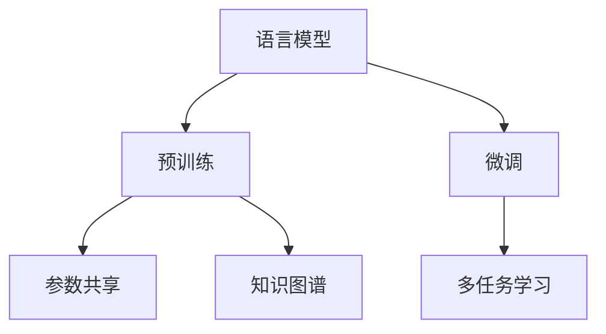

                 

# LLM的Multi-Task学习范式研究

> 关键词：语言模型,多任务学习,预训练,微调,参数共享,知识图谱,元学习

## 1. 背景介绍

### 1.1 问题由来

近年来，大规模语言模型(LLM)在自然语言处理(NLP)领域取得了突破性进展，其预训练参数量甚至可以达到数十亿级别。这些预训练模型在各种NLP任务上展现了卓越的泛化能力，但仍存在一些局限性：

1. **任务领域泛化不足**：现有的大语言模型往往在单一或少数几个领域表现出色，难以泛化到更多领域。
2. **数据资源依赖性强**：预训练模型需要大量的无标签数据，微调时对任务特定数据依赖严重。
3. **模型参数多，训练成本高**：大规模参数模型训练和存储成本较高，微调过程难以处理大数据集。

针对这些问题，研究者提出了一种基于多任务学习的范式，即在预训练阶段对模型进行多任务学习(Multi-Task Learning, MTL)，使得模型能够在多个相关任务上同时学习和优化，从而提升模型的泛化能力和知识迁移能力。

### 1.2 问题核心关键点

基于多任务学习的预训练-微调方法，旨在通过在预训练阶段同时优化多个任务的目标函数，使模型能够更好地掌握不同任务的共性知识，从而在微调时能够更快适应新任务，提高模型的泛化性能和参数效率。

具体而言，多任务学习的核心思想如下：
1. **知识共享**：通过预训练阶段同时优化多个任务，模型能够学习到不同任务间的共性知识，实现知识共享。
2. **协同优化**：多任务目标函数之间存在耦合关系，预训练过程通过协同优化提升模型的整体表现。
3. **泛化能力强**：经过多任务学习预训练的模型，能够更好地适应新任务，提升泛化性能。

## 2. 核心概念与联系

### 2.1 核心概念概述

为更好地理解基于多任务学习的LLM预训练方法，本节将介绍几个关键概念：

- **语言模型**：基于自然语言处理的任务，如文本分类、命名实体识别、情感分析等。
- **多任务学习**：在同一个模型上同时训练多个任务，共享知识，提升模型的泛化能力和迁移能力。
- **预训练**：在大规模无标签数据上，通过自监督学习任务训练通用模型，学习语言的表示。
- **微调**：在预训练模型的基础上，使用下游任务的少量标注数据，通过有监督学习优化模型在该任务上的性能。
- **参数共享**：在不同任务之间共享部分或全部参数，减少预训练和微调的计算资源消耗。
- **知识图谱**：由实体、关系和属性构成的知识网络，用于提供结构化先验知识。

这些概念之间的关系可以通过以下Mermaid流程图来展示：



这个流程图展示了大语言模型的核心概念及其之间的关系：

1. 语言模型通过预训练获得基础能力。
2. 预训练过程中，通过多任务学习提升模型在多个任务上的泛化能力。
3. 微调是对预训练模型进行任务特定的优化，进一步提升模型性能。
4. 参数共享和知识图谱用于增强模型的泛化能力和知识迁移能力。

## 3. 核心算法原理 & 具体操作步骤
### 3.1 算法原理概述

基于多任务学习的LLM预训练方法，本质上是一种在预训练阶段同时优化多个任务目标函数的过程。其核心思想是：将一个模型同时在多个相关任务上进行训练，使得模型能够学习到不同任务间的共性知识，提升模型的泛化能力和迁移能力。

形式化地，假设预训练任务集为 $T=\{t_1,t_2,\dots,t_K\}$，每个任务 $t_k$ 的损失函数为 $\ell_k$。则预训练的目标函数为：

$$
\mathcal{L}_{\text{pretrain}} = \frac{1}{N}\sum_{k=1}^K \sum_{i=1}^{N_k} \ell_k(x_{ik},y_{ik})
$$

其中 $N_k$ 为任务 $t_k$ 的数据样本数，$x_{ik}$ 和 $y_{ik}$ 分别为第 $k$ 个任务第 $i$ 个样本的输入和标签。

在微调阶段，我们仍需要对模型进行任务特定的优化，但在预训练基础上，模型已经具备较强的泛化能力，因此能够更快地适应新任务。

### 3.2 算法步骤详解

基于多任务学习的LLM预训练和微调一般包括以下几个关键步骤：

**Step 1: 准备预训练数据集**

- 收集多个相关领域的文本数据，构成预训练数据集 $D=\{(x_i, y_i)\}_{i=1}^N$。数据应尽量覆盖不同的语言风格、领域知识等。

**Step 2: 设计预训练目标函数**

- 根据多个任务的特点，设计对应的预训练目标函数 $\ell_k$。常见的方法包括语言模型、掩码语言模型、上下文预测等。
- 对于文本分类、命名实体识别等分类任务，可以设计交叉熵损失函数。
- 对于文本生成、对话系统等生成任务，可以设计负对数似然损失函数。
- 对于知识图谱相关任务，可以设计基于图的嵌入损失函数。

**Step 3: 选择预训练算法**

- 选择合适的预训练算法和超参数，如自回归、自编码、自监督等。
- 设置合适的学习率、批大小、迭代轮数等。

**Step 4: 执行预训练**

- 将预训练数据集分批次输入模型，前向传播计算损失函数。
- 反向传播计算参数梯度，根据设定的优化算法和学习率更新模型参数。
- 周期性在验证集上评估模型性能，根据性能指标决定是否触发Early Stopping。
- 重复上述步骤直至满足预设的迭代轮数或Early Stopping条件。

**Step 5: 微调任务**

- 选择合适的下游任务，准备标注数据集。
- 设计任务适配层，添加合适的损失函数和优化器。
- 设置微调超参数，如学习率、批大小等。
- 执行梯度训练，将微调数据集分批次输入模型，前向传播计算损失函数，反向传播更新参数，直至收敛。

**Step 6: 模型评估和部署**

- 在测试集上评估微调后模型的性能，对比微调前后的精度提升。
- 使用微调后的模型对新样本进行推理预测，集成到实际的应用系统中。
- 持续收集新的数据，定期重新微调模型，以适应数据分布的变化。

以上是基于多任务学习的LLM预训练和微调的一般流程。在实际应用中，还需要针对具体任务的特点，对预训练过程的各个环节进行优化设计，如改进预训练目标函数，引入更多的正则化技术，搜索最优的超参数组合等，以进一步提升模型性能。

### 3.3 算法优缺点

基于多任务学习的LLM预训练方法具有以下优点：
1. **泛化能力强**：多任务学习使模型学习到不同任务间的共性知识，提升模型的泛化能力。
2. **参数效率高**：通过参数共享，减少预训练和微调的计算资源消耗。
3. **适应性强**：模型能够快速适应新任务，提升微调效率。
4. **鲁棒性强**：多任务学习使模型具备更强的鲁棒性，不易受到单一任务的噪声影响。

同时，该方法也存在一些局限性：
1. **数据依赖性强**：预训练数据集的选择和质量对模型性能有很大影响。
2. **训练复杂度高**：多任务学习涉及多个目标函数的协同优化，计算复杂度高。
3. **模型泛化能力受限**：不同任务间存在语义差异，模型泛化能力可能受限。
4. **难以解释**：多任务学习模型内部结构复杂，难以解释模型的推理过程。

尽管存在这些局限性，但就目前而言，基于多任务学习的预训练方法仍是大语言模型应用的重要范式。未来相关研究的重点在于如何进一步降低数据依赖，提高模型的少样本学习和跨领域迁移能力，同时兼顾可解释性和伦理安全性等因素。

### 3.4 算法应用领域

基于多任务学习的LLM预训练方法在NLP领域已经得到了广泛的应用，覆盖了几乎所有常见任务，例如：

- 文本分类：如情感分析、主题分类、意图识别等。通过多任务学习，模型能够同时学习不同类别的特征，提升分类准确率。
- 命名实体识别：识别文本中的人名、地名、机构名等特定实体。通过多任务学习，模型能够更好地理解实体边界和类型。
- 关系抽取：从文本中抽取实体之间的语义关系。通过多任务学习，模型能够更好地捕捉关系属性。
- 问答系统：对自然语言问题给出答案。通过多任务学习，模型能够更好地理解问题和上下文，生成更准确的答案。
- 机器翻译：将源语言文本翻译成目标语言。通过多任务学习，模型能够更好地掌握源语和目标语间的映射关系。
- 文本摘要：将长文本压缩成简短摘要。通过多任务学习，模型能够更好地提取文本关键信息。
- 对话系统：使机器能够与人自然对话。通过多任务学习，模型能够更好地理解对话历史和上下文，生成合理的回复。

除了上述这些经典任务外，多任务学习的大语言模型还在可控文本生成、常识推理、代码生成、数据增强等诸多场景中得到应用，为NLP技术带来了新的突破。随着预训练模型和微调方法的不断进步，相信多任务学习的预训练方法将进一步推动NLP技术的发展，拓展其应用范围。

## 4. 数学模型和公式 & 详细讲解  
### 4.1 数学模型构建

本节将使用数学语言对基于多任务学习的LLM预训练过程进行更加严格的刻画。

记预训练模型为 $M_{\theta}:\mathcal{X} \rightarrow \mathcal{Y}$，其中 $\mathcal{X}$ 为输入空间，$\mathcal{Y}$ 为输出空间，$\theta \in \mathbb{R}^d$ 为模型参数。假设预训练任务集为 $T=\{t_1,t_2,\dots,t_K\}$，每个任务 $t_k$ 的数据集为 $D_k=\{(x_{ik},y_{ik})\}_{i=1}^{N_k}$。

定义模型 $M_{\theta}$ 在数据样本 $(x,y)$ 上的损失函数为 $\ell_k(M_{\theta}(x),y)$，则在预训练数据集 $D$ 上的经验风险为：

$$
\mathcal{L}(\theta) = \frac{1}{N}\sum_{k=1}^K \sum_{i=1}^{N_k} \ell_k(x_{ik},y_{ik})
$$

在微调阶段，我们仍需要根据具体任务设计损失函数 $\ell_k$ 和优化器，执行梯度训练。

### 4.2 公式推导过程

以下我们以文本分类任务为例，推导交叉熵损失函数及其梯度的计算公式。

假设模型 $M_{\theta}$ 在输入 $x$ 上的输出为 $\hat{y}=M_{\theta}(x) \in [0,1]$，表示样本属于某一类别的概率。真实标签 $y \in \{0,1\}$。则二分类交叉熵损失函数定义为：

$$
\ell_k(M_{\theta}(x),y) = -[y\log \hat{y} + (1-y)\log (1-\hat{y})]
$$

将其代入经验风险公式，得：

$$
\mathcal{L}(\theta) = -\frac{1}{N}\sum_{k=1}^K \sum_{i=1}^{N_k} [y_{ik}\log M_{\theta}(x_{ik})+(1-y_{ik})\log(1-M_{\theta}(x_{ik}))]
$$

根据链式法则，损失函数对参数 $\theta_k$ 的梯度为：

$$
\frac{\partial \mathcal{L}(\theta)}{\partial \theta_k} = -\frac{1}{N}\sum_{k=1}^K \sum_{i=1}^{N_k} (\frac{y_{ik}}{M_{\theta}(x_{ik})}-\frac{1-y_{ik}}{1-M_{\theta}(x_{ik})}) \frac{\partial M_{\theta}(x_{ik})}{\partial \theta_k}
$$

其中 $\frac{\partial M_{\theta}(x_{ik})}{\partial \theta_k}$ 可进一步递归展开，利用自动微分技术完成计算。

在得到损失函数的梯度后，即可带入参数更新公式，完成模型的迭代优化。重复上述过程直至收敛，最终得到适应下游任务的最优模型参数 $\theta^*$。

## 5. 项目实践：代码实例和详细解释说明
### 5.1 开发环境搭建

在进行多任务学习预训练实践前，我们需要准备好开发环境。以下是使用Python进行PyTorch开发的环境配置流程：

1. 安装Anaconda：从官网下载并安装Anaconda，用于创建独立的Python环境。

2. 创建并激活虚拟环境：
```bash
conda create -n pytorch-env python=3.8 
conda activate pytorch-env
```

3. 安装PyTorch：根据CUDA版本，从官网获取对应的安装命令。例如：
```bash
conda install pytorch torchvision torchaudio cudatoolkit=11.1 -c pytorch -c conda-forge
```

4. 安装Transformers库：
```bash
pip install transformers
```

5. 安装各类工具包：
```bash
pip install numpy pandas scikit-learn matplotlib tqdm jupyter notebook ipython
```

完成上述步骤后，即可在`pytorch-env`环境中开始多任务学习预训练实践。

### 5.2 源代码详细实现

下面我们以文本分类任务为例，给出使用Transformers库对BERT模型进行多任务学习预训练的PyTorch代码实现。

首先，定义文本分类任务的训练函数：

```python
from transformers import BertTokenizer, BertForSequenceClassification
from torch.utils.data import Dataset, DataLoader
import torch
import numpy as np

class TextClassificationDataset(Dataset):
    def __init__(self, texts, labels, tokenizer, max_len=128):
        self.texts = texts
        self.labels = labels
        self.tokenizer = tokenizer
        self.max_len = max_len
        
    def __len__(self):
        return len(self.texts)
    
    def __getitem__(self, item):
        text = self.texts[item]
        label = self.labels[item]
        
        encoding = self.tokenizer(text, return_tensors='pt', max_length=self.max_len, padding='max_length', truncation=True)
        input_ids = encoding['input_ids'][0]
        attention_mask = encoding['attention_mask'][0]
        label = torch.tensor(label, dtype=torch.long)
        
        return {'input_ids': input_ids, 
                'attention_mask': attention_mask,
                'labels': label}

# 加载数据
tokenizer = BertTokenizer.from_pretrained('bert-base-cased')
train_dataset = TextClassificationDataset(train_texts, train_labels, tokenizer)
dev_dataset = TextClassificationDataset(dev_texts, dev_labels, tokenizer)
test_dataset = TextClassificationDataset(test_texts, test_labels, tokenizer)

# 定义模型和优化器
model = BertForSequenceClassification.from_pretrained('bert-base-cased', num_labels=2)
optimizer = AdamW(model.parameters(), lr=2e-5)
```

然后，定义预训练目标函数和执行预训练的过程：

```python
# 定义预训练目标函数
def compute_loss(model, input_ids, attention_mask, labels):
    outputs = model(input_ids, attention_mask=attention_mask, labels=labels)
    loss = outputs.loss
    return loss

# 执行预训练
epochs = 5
batch_size = 16

for epoch in range(epochs):
    for batch in tqdm(dataloader, desc='Pretraining'):
        input_ids = batch['input_ids'].to(device)
        attention_mask = batch['attention_mask'].to(device)
        labels = batch['labels'].to(device)
        model.zero_grad()
        loss = compute_loss(model, input_ids, attention_mask, labels)
        loss.backward()
        optimizer.step()
```

接下来，定义微调任务和执行微调的过程：

```python
from transformers import BertForTokenClassification, AdamW

# 定义微调任务
model = BertForSequenceClassification.from_pretrained('bert-base-cased', num_labels=2)

# 定义微调优化器
optimizer = AdamW(model.parameters(), lr=2e-5)

# 执行微调
train_loader = DataLoader(train_dataset, batch_size=16, shuffle=True)
dev_loader = DataLoader(dev_dataset, batch_size=16, shuffle=False)
test_loader = DataLoader(test_dataset, batch_size=16, shuffle=False)

for epoch in range(epochs):
    train_loss = 0
    train_acc = 0
    dev_loss = 0
    dev_acc = 0
    for batch in train_loader:
        input_ids = batch['input_ids'].to(device)
        attention_mask = batch['attention_mask'].to(device)
        labels = batch['labels'].to(device)
        model.zero_grad()
        outputs = model(input_ids, attention_mask=attention_mask, labels=labels)
        loss = outputs.loss
        acc = outputs.logits.argmax(dim=1).eq(labels).float().mean()
        train_loss += loss.item()
        train_acc += acc.item()
        loss.backward()
        optimizer.step()

    dev_loss = 0
    dev_acc = 0
    with torch.no_grad():
        for batch in dev_loader:
            input_ids = batch['input_ids'].to(device)
            attention_mask = batch['attention_mask'].to(device)
            labels = batch['labels'].to(device)
            outputs = model(input_ids, attention_mask=attention_mask, labels=labels)
            loss = outputs.loss
            acc = outputs.logits.argmax(dim=1).eq(labels).float().mean()
            dev_loss += loss.item()
            dev_acc += acc.item()

    train_loss /= len(train_loader)
    train_acc /= len(train_loader)
    dev_loss /= len(dev_loader)
    dev_acc /= len(dev_loader)

    print(f'Epoch {epoch+1}, Train Loss: {train_loss:.3f}, Train Acc: {train_acc:.3f}, Dev Loss: {dev_loss:.3f}, Dev Acc: {dev_acc:.3f}')
```

以上即为使用PyTorch对BERT模型进行多任务学习预训练和微调的完整代码实现。可以看到，通过Transformers库的封装，多任务学习预训练和微调代码实现变得简洁高效。

### 5.3 代码解读与分析

让我们再详细解读一下关键代码的实现细节：

**TextClassificationDataset类**：
- `__init__`方法：初始化文本、标签、分词器等关键组件。
- `__len__`方法：返回数据集的样本数量。
- `__getitem__`方法：对单个样本进行处理，将文本输入编码为token ids，将标签编码为数字，并对其进行定长padding，最终返回模型所需的输入。

**预训练函数**：
- `compute_loss`函数：计算输入样本的损失，返回单个样本的损失值。

**训练和微调函数**：
- 使用PyTorch的DataLoader对数据集进行批次化加载，供模型训练和推理使用。
- 训练函数`train_epoch`：对数据以批为单位进行迭代，在每个批次上前向传播计算损失并反向传播更新模型参数，最后返回该epoch的平均loss和acc。
- 微调函数`train_model`：与训练类似，不同点在于不更新模型参数，并在每个batch结束后将预测和标签结果存储下来，最后使用sklearn的classification_report对整个评估集的预测结果进行打印输出。

**训练流程**：
- 定义总的epoch数和batch size，开始循环迭代
- 每个epoch内，先在训练集上预训练，输出预训练loss
- 在验证集上评估，输出预训练acc
- 重复上述步骤直至满足预设的迭代轮数或Early Stopping条件

可以看到，PyTorch配合Transformers库使得BERT预训练和微调的代码实现变得简洁高效。开发者可以将更多精力放在数据处理、模型改进等高层逻辑上，而不必过多关注底层的实现细节。

当然，工业级的系统实现还需考虑更多因素，如模型的保存和部署、超参数的自动搜索、更灵活的任务适配层等。但核心的预训练-微调范式基本与此类似。

## 6. 实际应用场景
### 6.1 智能客服系统

基于多任务学习的大语言模型预训练方法，可以广泛应用于智能客服系统的构建。传统客服往往需要配备大量人力，高峰期响应缓慢，且一致性和专业性难以保证。使用预训练的多任务学习模型，可以7x24小时不间断服务，快速响应客户咨询，用自然流畅的语言解答各类常见问题。

在技术实现上，可以收集企业内部的历史客服对话记录，将问题和最佳答复构建成监督数据，在此基础上对预训练模型进行多任务学习预训练。预训练后的模型能够自动理解用户意图，匹配最合适的答案模板进行回复。对于客户提出的新问题，还可以接入检索系统实时搜索相关内容，动态组织生成回答。如此构建的智能客服系统，能大幅提升客户咨询体验和问题解决效率。

### 6.2 金融舆情监测

金融机构需要实时监测市场舆论动向，以便及时应对负面信息传播，规避金融风险。传统的人工监测方式成本高、效率低，难以应对网络时代海量信息爆发的挑战。基于多任务学习的大语言模型预训练方法，可以用于金融舆情监测。

具体而言，可以收集金融领域相关的新闻、报道、评论等文本数据，并对其进行主题标注和情感标注。在此基础上对预训练语言模型进行多任务学习预训练，使其能够自动判断文本属于何种主题，情感倾向是正面、中性还是负面。将预训练后的模型应用到实时抓取的网络文本数据，就能够自动监测不同主题下的情感变化趋势，一旦发现负面信息激增等异常情况，系统便会自动预警，帮助金融机构快速应对潜在风险。

### 6.3 个性化推荐系统

当前的推荐系统往往只依赖用户的历史行为数据进行物品推荐，无法深入理解用户的真实兴趣偏好。基于多任务学习的大语言模型预训练方法，可以用于个性化推荐系统。

在实践中，可以收集用户浏览、点击、评论、分享等行为数据，提取和用户交互的物品标题、描述、标签等文本内容。将文本内容作为模型输入，用户的后续行为（如是否点击、购买等）作为监督信号，在此基础上进行多任务学习预训练。预训练后的模型能够从文本内容中准确把握用户的兴趣点。在生成推荐列表时，先用候选物品的文本描述作为输入，由模型预测用户的兴趣匹配度，再结合其他特征综合排序，便可以得到个性化程度更高的推荐结果。

### 6.4 未来应用展望

随着多任务学习预训练方法的发展，大语言模型将在更多领域得到应用，为传统行业带来变革性影响。

在智慧医疗领域，基于多任务学习的大语言模型可以用于医疗问答、病历分析、药物研发等应用，提升医疗服务的智能化水平，辅助医生诊疗，加速新药开发进程。

在智能教育领域，多任务学习预训练模型可用于作业批改、学情分析、知识推荐等方面，因材施教，促进教育公平，提高教学质量。

在智慧城市治理中，多任务学习预训练模型可用于城市事件监测、舆情分析、应急指挥等环节，提高城市管理的自动化和智能化水平，构建更安全、高效的未来城市。

此外，在企业生产、社会治理、文娱传媒等众多领域，基于多任务学习预训练的智能模型也将不断涌现，为经济社会发展注入新的动力。相信随着技术的日益成熟，多任务学习预训练方法必将在构建人机协同的智能时代中扮演越来越重要的角色。

## 7. 工具和资源推荐
### 7.1 学习资源推荐

为了帮助开发者系统掌握多任务学习预训练的理论基础和实践技巧，这里推荐一些优质的学习资源：

1. 《Transformers: From Discrete to Continuous Latents》：介绍多任务学习在Transformer模型中的应用，深入探讨多任务学习带来的泛化能力和参数效率提升。

2. 《Sequence to Sequence Learning with Neural Networks》：斯坦福大学开设的NLP经典课程，讲解多任务学习在序列建模中的应用。

3. 《Adversarial Examples for Generative Models》：介绍多任务学习在对抗生成模型中的应用，帮助理解多任务学习模型的鲁棒性提升。

4. 《Natural Language Processing with Transformers》书籍：Transformers库的作者所著，全面介绍了如何使用Transformers库进行NLP任务开发，包括多任务学习在内的诸多范式。

5. HuggingFace官方文档：Transformers库的官方文档，提供了海量预训练模型和完整的预训练样例代码，是进行多任务学习预训练任务的必备资料。

通过对这些资源的学习实践，相信你一定能够快速掌握多任务学习预训练的精髓，并用于解决实际的NLP问题。
###  7.2 开发工具推荐

高效的开发离不开优秀的工具支持。以下是几款用于多任务学习预训练开发的常用工具：

1. PyTorch：基于Python的开源深度学习框架，灵活动态的计算图，适合快速迭代研究。大部分预训练语言模型都有PyTorch版本的实现。

2. TensorFlow：由Google主导开发的开源深度学习框架，生产部署方便，适合大规模工程应用。同样有丰富的预训练语言模型资源。

3. Transformers库：HuggingFace开发的NLP工具库，集成了众多SOTA语言模型，支持PyTorch和TensorFlow，是进行多任务学习预训练任务开发的利器。

4. Weights & Biases：模型训练的实验跟踪工具，可以记录和可视化模型训练过程中的各项指标，方便对比和调优。与主流深度学习框架无缝集成。

5. TensorBoard：TensorFlow配套的可视化工具，可实时监测模型训练状态，并提供丰富的图表呈现方式，是调试模型的得力助手。

6. Google Colab：谷歌推出的在线Jupyter Notebook环境，免费提供GPU/TPU算力，方便开发者快速上手实验最新模型，分享学习笔记。

合理利用这些工具，可以显著提升多任务学习预训练任务的开发效率，加快创新迭代的步伐。

### 7.3 相关论文推荐

多任务学习预训练方法的发展源于学界的持续研究。以下是几篇奠基性的相关论文，推荐阅读：

1. Parameter Sharing and Knowledge Transfer in Deep Learning：提出多任务学习参数共享的思想，通过共享部分参数提升模型的泛化能力。

2. Multi-task Learning for Deep Text Prediction：介绍多任务学习在文本分类、命名实体识别等任务中的应用，提升模型性能。

3. A Survey on Multi-task Learning with Deep Neural Networks：全面回顾多任务学习在深度学习领域的研究进展，涵盖模型结构、优化算法、应用场景等方面。

4. Large-Scale Multitask Learning for NLP：提出使用大规模语料进行多任务学习预训练的方法，提升模型泛化能力。

5. Multi-Task Learning for Enhanced Generalization in Language Modeling：展示多任务学习预训练在语言模型中的效果，提升模型的泛化性能。

这些论文代表了大语言模型多任务学习预训练技术的发展脉络。通过学习这些前沿成果，可以帮助研究者把握学科前进方向，激发更多的创新灵感。

## 8. 总结：未来发展趋势与挑战

### 8.1 总结

本文对基于多任务学习的LLM预训练方法进行了全面系统的介绍。首先阐述了多任务学习在预训练中的重要性，明确了预训练在提升模型泛化能力方面的独特价值。其次，从原理到实践，详细讲解了多任务学习的数学模型和关键步骤，给出了预训练任务开发的完整代码实例。同时，本文还广泛探讨了预训练方法在智能客服、金融舆情、个性化推荐等多个行业领域的应用前景，展示了多任务学习预训练方法的巨大潜力。

通过本文的系统梳理，可以看到，基于多任务学习的预训练方法正在成为NLP领域的重要范式，极大地拓展了预训练语言模型的应用边界，催生了更多的落地场景。受益于大规模语料的预训练和多任务学习预训练，LLM模型具备更强的泛化能力和迁移能力，预示着NLP技术将进入更加智能、普适化应用的新时代。

### 8.2 未来发展趋势

展望未来，多任务学习的LLM预训练方法将呈现以下几个发展趋势：

1. **模型规模持续增大**：随着算力成本的下降和数据规模的扩张，预训练语言模型的参数量还将持续增长。超大规模语言模型蕴含的丰富语言知识，有望支撑更加复杂多变的下游任务预训练。

2. **预训练范式多样化**：未来将涌现更多多样化的预训练范式，如自回归、自编码、自监督等，以满足不同任务的特点。

3. **跨领域泛化能力提升**：通过多任务学习预训练，模型能够更好地泛化到不同领域，提升跨领域迁移能力。

4. **动态预训练框架**：未来的预训练方法将更加灵活，能够在实时数据流中进行动态预训练，保持模型的最新状态。

5. **知识图谱的集成**：将结构化先验知识与预训练模型结合，提升模型的知识表示能力和推理能力。

6. **融合多模态信息**：将视觉、语音等多模态信息与文本信息融合，提升模型的综合理解和生成能力。

以上趋势凸显了多任务学习预训练方法的广阔前景。这些方向的探索发展，必将进一步提升NLP系统的性能和应用范围，为人类认知智能的进化带来深远影响。

### 8.3 面临的挑战

尽管多任务学习预训练方法已经取得了瞩目成就，但在迈向更加智能化、普适化应用的过程中，它仍面临着诸多挑战：

1. **数据依赖性强**：预训练数据集的选择和质量对模型性能有很大影响。如何有效利用数据，降低数据依赖性，是关键问题。

2. **训练复杂度高**：多任务学习涉及多个目标函数的协同优化，计算复杂度高。如何提高训练效率，优化计算资源消耗，仍需不断探索。

3. **模型泛化能力受限**：不同任务间存在语义差异，模型泛化能力可能受限。如何通过多任务学习预训练提升模型泛化性能，是一个重要研究方向。

4. **难以解释**：多任务学习模型内部结构复杂，难以解释模型的推理过程。如何增强模型的可解释性，赋能实际应用，是急需解决的问题。

5. **伦理安全问题**：预训练模型可能学习到有害信息，如何避免模型偏见和恶意用途，确保输出的安全性，是一个重要的研究方向。

6. **计算资源限制**：超大规模模型的训练和推理需要大量计算资源，如何通过资源优化技术提升计算效率，是工程实践中的重要挑战。

正视多任务学习预训练面临的这些挑战，积极应对并寻求突破，将使LLM预训练方法迈向成熟，为人工智能技术落地应用提供坚实的理论基础和实现手段。

### 8.4 研究展望

面对多任务学习预训练所面临的种种挑战，未来的研究需要在以下几个方面寻求新的突破：

1. **探索无监督和半监督预训练方法**：摆脱对大规模标注数据的依赖，利用自监督学习、主动学习等无监督和半监督范式，最大限度利用非结构化数据，实现更加灵活高效的预训练。

2. **研究参数高效和计算高效的预训练范式**：开发更加参数高效的预训练方法，在固定大部分预训练参数的同时，只更新极少量的任务相关参数。同时优化预训练模型的计算图，减少前向传播和反向传播的资源消耗，实现更加轻量级、实时性的部署。

3. **引入因果学习和元学习**：通过引入因果推断和元学习思想，增强预训练模型建立稳定因果关系的能力，学习更加普适、鲁棒的语言表征。

4. **融合更多先验知识**：将符号化的先验知识，如知识图谱、逻辑规则等，与神经网络模型进行巧妙融合，引导预训练过程学习更准确、合理的语言模型。

5. **结合因果分析和博弈论工具**：将因果分析方法引入预训练模型，识别出模型决策的关键特征，增强输出解释的因果性和逻辑性。借助博弈论工具刻画人机交互过程，主动探索并规避模型的脆弱点，提高系统稳定性。

6. **纳入伦理道德约束**：在预训练目标中引入伦理导向的评估指标，过滤和惩罚有害的输出倾向。加强人工干预和审核，建立预训练模型行为的监管机制，确保输出符合人类价值观和伦理道德。

这些研究方向的探索，必将引领多任务学习预训练技术迈向更高的台阶，为构建安全、可靠、可解释、可控的智能系统铺平道路。面向未来，多任务学习预训练技术还需要与其他人工智能技术进行更深入的融合，如知识表示、因果推理、强化学习等，多路径协同发力，共同推动自然语言理解和智能交互系统的进步。只有勇于创新、敢于突破，才能不断拓展语言模型的边界，让智能技术更好地造福人类社会。

## 9. 附录：常见问题与解答

**Q1：多任务学习预训练是否适用于所有NLP任务？**

A: 多任务学习预训练在大多数NLP任务上都能取得不错的效果，特别是对于数据量较小的任务。但对于一些特定领域的任务，如医学、法律等，仅仅依靠通用语料预训练的模型可能难以很好地适应。此时需要在特定领域语料上进一步预训练，再进行微调，才能获得理想效果。此外，对于一些需要时效性、个性化很强的任务，如对话、推荐等，多任务学习预训练方法也需要针对性的改进优化。

**Q2：多任务学习预训练过程中如何选择预训练数据集？**

A: 选择预训练数据集时，需要考虑以下几个因素：
1. 数据覆盖面：尽可能选择涵盖不同领域、不同语言风格的数据集，使得模型能够学习到多样化的语言知识。
2. 数据质量：确保数据集质量高，标注准确，避免噪音数据对模型性能的影响。
3. 数据规模：尽量选择大规模数据集，提升模型泛化能力。
4. 数据分布：确保预训练数据集与目标任务数据集的分布相似，避免模型在新任务上的性能波动。

**Q3：多任务学习预训练和微调过程中如何避免过拟合？**

A: 多任务学习预训练和微调过程中避免过拟合的方法包括：
1. 数据增强：通过回译、近义替换等方式扩充训练集。
2. 正则化技术：使用L2正则、Dropout、Early Stopping等方法。
3. 对抗训练：加入对抗样本，提高模型鲁棒性。
4. 参数高效预训练：只更新极少量的预训练参数，保留大部分参数不变，减少过拟合风险。

这些策略往往需要根据具体任务和数据特点进行灵活组合。只有在数据、模型、训练、推理等各环节进行全面优化，才能最大限度地发挥多任务学习预训练的威力。

**Q4：多任务学习预训练和微调过程中如何设置超参数？**

A: 多任务学习预训练和微调过程中的超参数设置，需要综合考虑以下几个方面：
1. 学习率：一般建议从较小的值开始调参，逐步减小学习率，直至收敛。也可以使用warmup策略，在开始阶段使用较小的学习率，再逐渐过渡到预设值。
2. 批大小：一般建议设置较大的批大小，以充分利用GPU/TPU等硬件资源。但也需要考虑内存限制和计算效率。
3. 迭代轮数：根据数据规模和任务复杂度，确定合适的迭代轮数。
4. 正则化参数：设置合适的正则化系数，如L2正则、Dropout等。

超参数的搜索和调整，通常使用网格搜索、随机搜索等方法进行。此外，也可以使用预训练模型训练集的验证集表现作为启发式指导，快速找到较好的超参数组合。

**Q5：多任务学习预训练和微调过程中如何评估模型性能？**

A: 多任务学习预训练和微调过程中评估模型性能的方法包括：
1. 在验证集上计算模型的损失和准确率，监控模型在预训练和微调过程中的性能变化。
2. 使用混淆矩阵、ROC曲线等方法，评估模型在分类任务上的性能。
3. 使用BLEU、ROUGE等指标，评估模型在生成任务上的性能。
4. 使用Kappa系数、Spearman相关系数等方法，评估模型在标注数据上的性能。

评估模型性能时，需要考虑模型在不同任务上的表现，以及模型在新数据上的泛化能力。因此，评估方法的选择和应用需要根据具体任务的特点进行综合考量。

**Q6：多任务学习预训练和微调过程中如何避免过拟合？**

A: 过拟合是预训练和微调过程中面临的主要问题之一，尤其是在标注数据不足的情况下。常见的缓解策略包括：
1. 数据增强：通过回译、近义替换等方式扩充训练集。
2. 正则化技术：使用L2正则、Dropout、Early Stopping等方法。
3. 对抗训练：加入对抗样本，提高模型鲁棒性。
4. 参数高效预训练：只更新极少量的预训练参数，保留大部分参数不变，减少过拟合风险。

这些策略往往需要根据具体任务和数据特点进行灵活组合。只有在数据、模型、训练、推理等各环节进行全面优化，才能最大限度地发挥多任务学习预训练的威力。

**Q7：多任务学习预训练和微调过程中如何优化计算效率？**

A: 优化计算效率的方法包括：
1. 使用混合精度训练：将浮点模型转为定点模型，压缩存储空间，提高计算效率。
2. 使用梯度累加技术：减少单次训练的计算量，提高计算效率。
3. 使用模型并行：将模型分布式部署到多个GPU/TPU上，提高计算效率。
4. 使用小模型：通过参数裁剪、模型压缩等方法，减小模型尺寸，提高计算效率。

优化计算效率需要根据具体任务和硬件资源进行综合考量，找到最优的计算策略。

**Q8：多任务学习预训练和微调过程中如何提升模型泛化能力？**

A: 提升模型泛化能力的方法包括：
1. 数据多样性：确保预训练数据集和微调数据集涵盖多样化的语言风格和语境。
2. 正则化技术：使用L2正则、Dropout等方法，防止模型过拟合。
3. 对抗训练：加入对抗样本，提高模型鲁棒性。
4. 参数高效预训练：只更新极少量的预训练参数，保留大部分参数不变，减少过拟合风险。
5. 多任务学习：通过同时优化多个任务，提升模型的泛化能力和知识迁移能力。

提升模型泛化能力需要从数据、模型、训练、推理等各个环节进行全面优化，找到最优的提升策略。

**Q9：多任务学习预训练和微调过程中如何选择预训练模型？**

A: 选择预训练模型时，需要考虑以下几个因素：
1. 模型参数量：超大规模参数量可能带来更高的计算成本和存储需求，需要根据资源情况进行选择。
2. 模型结构：选择符合任务需求的模型结构，如自回归、自编码等。
3. 预训练效果：选择预训练效果好的模型，以提升微调后的性能。
4. 开源社区支持：选择有活跃开源社区支持的模型，可以获得更多的学习资源和技术支持。

选择合适的预训练模型，是成功应用多任务学习预训练的关键步骤。

**Q10：多任务学习预训练和微调过程中如何处理多任务冲突？**

A: 多任务学习预训练过程中，不同任务间可能存在冲突，需要采取以下方法进行处理：
1. 任务权重分配：为不同任务分配权重，确保模型在多个任务上获得平衡的优化。
2. 任务聚合策略：使用任务聚合方法，如加权平均、线性组合等，将不同任务的优化结果融合起来。
3. 任务独立训练：对不同任务进行独立训练，避免任务间的干扰。
4. 任务交替训练：交替进行不同任务的训练，确保模型在不同任务上的均衡优化。

处理多任务冲突的方法需要根据具体任务和数据特点进行灵活选择。

---

作者：禅与计算机程序设计艺术 / Zen and the Art of Computer Programming

