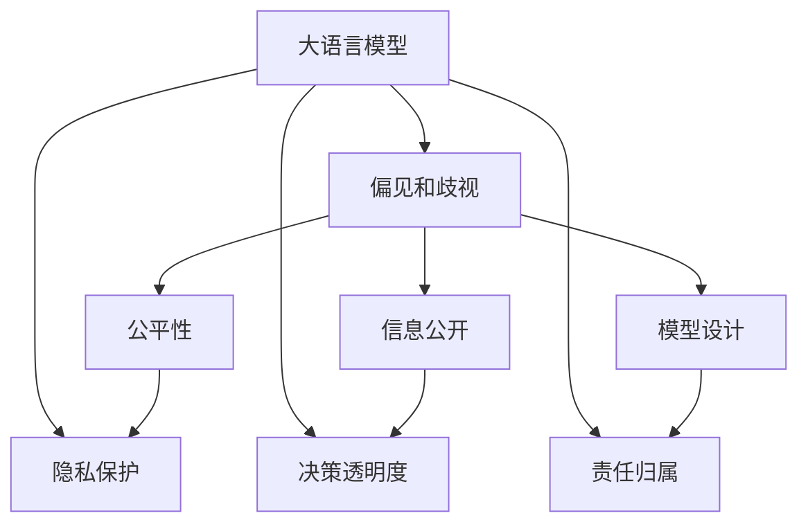
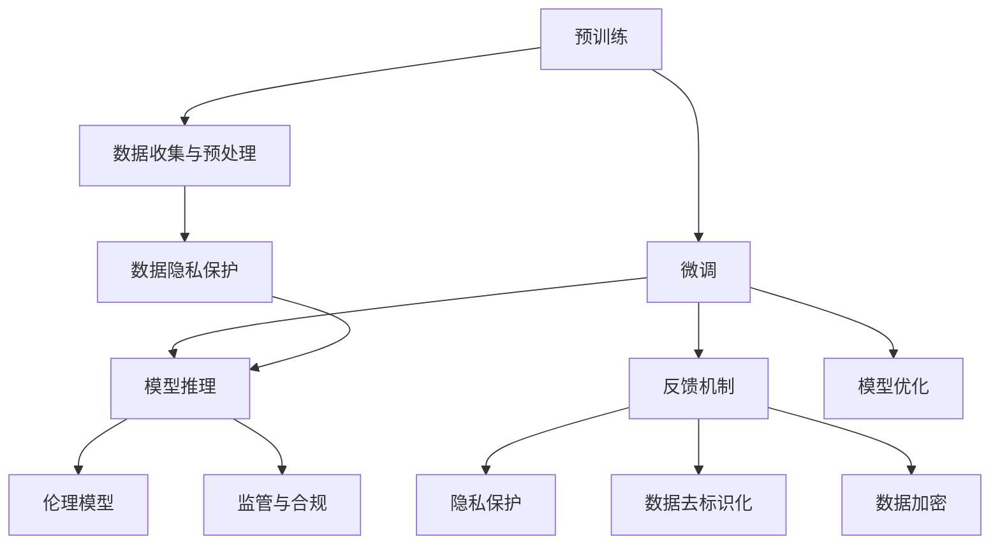

                 

## 1. 背景介绍

随着人工智能技术的迅猛发展，深度学习模型，特别是大语言模型（Large Language Models，简称LLM），在自然语言处理（NLP）和跨领域应用中展现出巨大的潜力。这些模型基于海量文本数据的预训练，具有强大的语言理解、生成和推理能力，已经成为多个产业变革的引擎。然而，LLM的强大功能也带来了前所未有的伦理挑战，这些问题涉及模型决策的透明性、公平性、责任归属等方面。如何在保持LLM高效性能的同时，确保其行为符合伦理规范，成为了一个亟需解决的关键问题。

### 1.1 问题由来

近年来，深度学习模型的伦理问题逐渐引起学界和产业界的高度关注。特别是大语言模型，由于其深度和复杂性，伦理问题更加突出。这些问题包括但不限于：

- **偏见和歧视**：模型在训练数据中学习到的偏见可能导致不公平的决策。例如，在招聘、医疗等敏感领域，模型可能会对特定性别、种族、年龄等群体产生歧视。
- **虚假信息**：大模型具有生成文本的能力，可能被用于制作假新闻、虚假广告等，误导公众，影响社会稳定。
- **隐私保护**：模型在训练和使用过程中，可能会涉及用户隐私数据的泄露和使用，带来隐私安全风险。
- **决策透明度**：模型的决策过程缺乏透明性和可解释性，使得用户和监管机构难以理解和监管模型的行为。
- **责任归属**：在模型应用于医疗、金融等高风险领域时，如何界定模型错误导致的责任归属，成为重要议题。

解决这些问题，需要多学科交叉合作，从技术、法律、伦理等多个层面进行综合考量。本文旨在从技术角度出发，探讨如何在大语言模型中引入伦理约束，确保其行为的透明性、公平性和安全性。

## 2. 核心概念与联系

### 2.1 核心概念概述

为了更好地理解大语言模型的伦理挑战，需要明确几个关键概念：

- **大语言模型 (Large Language Models, LLMs)**：基于大规模自回归或自编码神经网络构建的深度学习模型，通过在大量文本数据上预训练获得语言表示能力。常见的模型包括GPT、BERT等。
- **偏见和歧视 (Bias and Discrimination)**：模型由于训练数据的偏差，学习到的不公平决策，可能导致对特定群体的歧视。
- **隐私保护 (Privacy Protection)**：在训练和应用过程中，确保用户隐私数据不被泄露或滥用。
- **决策透明度 (Transparency)**：模型在生成输出时的决策过程应具有透明性和可解释性，便于监管和理解。
- **责任归属 (Accountability)**：在模型应用于高风险领域时，明确模型错误导致的责任归属，确保模型行为的责任可追溯。

这些概念之间的关系可以通过以下Mermaid流程图来展示：



该流程图展示了大语言模型伦理问题的多个维度，及其相互关系：

1. 大语言模型由于学习到训练数据中的偏见，可能导致决策不公平。
2. 在隐私保护方面，模型在训练和应用过程中可能涉及用户隐私数据。
3. 决策透明度方面，模型的决策过程需透明，便于用户和监管理解。
4. 责任归属方面，需要明确模型行为的责任归属，确保风险可控。

### 2.2 核心概念原理和架构的 Mermaid 流程图



该流程图表示大语言模型的伦理约束架构：

1. **预训练与微调**：模型在预训练和微调过程中，需要考虑数据的多样性和代表性，避免学习到偏见。
2. **数据收集与预处理**：在数据收集和预处理阶段，需要采取隐私保护措施，确保数据不被滥用。
3. **模型推理**：在推理阶段，模型应具备决策透明度，便于用户和监管理解。
4. **反馈机制与模型优化**：引入反馈机制，优化模型行为，确保公平性和可解释性。
5. **隐私保护**：在数据处理和模型推理阶段，需要确保隐私数据的保护。

## 3. 核心算法原理 & 具体操作步骤

### 3.1 算法原理概述

大语言模型的伦理约束主要通过以下步骤实现：

1. **公平性约束**：通过设计公平性约束机制，减少模型对特定群体的歧视。
2. **隐私保护**：在数据处理和模型推理阶段，采用隐私保护技术，确保用户隐私数据的安全。
3. **透明度增强**：引入决策透明度技术，提升模型的可解释性，使用户和监管机构能够理解模型的决策过程。
4. **责任归属**：建立责任归属机制，明确模型行为的责任，确保在错误发生时能够追溯责任。

### 3.2 算法步骤详解

#### 3.2.1 公平性约束

公平性约束是伦理约束的核心，主要通过以下几个步骤实现：

1. **数据多样性增强**：在预训练和微调数据中，确保数据的多样性和代表性，减少模型学习到偏见的可能性。
2. **偏见检测与修正**：在模型训练过程中，定期检测模型输出中的偏见，并采取修正措施，如重采样、权重调整等。
3. **公平性度量**：使用公平性度量指标，如均等误差率、相等机会率等，评估模型的公平性，并不断优化模型。

#### 3.2.2 隐私保护

隐私保护在大语言模型的应用中至关重要，主要通过以下步骤实现：

1. **数据去标识化**：在数据预处理阶段，对敏感数据进行去标识化处理，确保数据无法追溯到个人。
2. **数据加密**：在数据存储和传输过程中，采用加密技术保护数据隐私。
3. **差分隐私**：在模型训练阶段，引入差分隐私技术，确保模型不会泄露敏感信息的统计特征。

#### 3.2.3 透明度增强

透明度增强主要通过以下几个步骤实现：

1. **模型可解释性提升**：在模型推理阶段，引入可解释性技术，如Attention机制、部分可解释模型等，提升模型的可解释性。
2. **决策过程记录**：记录模型的决策过程，包括输入、输出和中间步骤，便于用户和监管理解。
3. **可视化与解释工具**：开发可视化与解释工具，使用户和监管能够直观理解模型的决策过程。

#### 3.2.4 责任归属

责任归属机制主要通过以下几个步骤实现：

1. **责任链追溯**：在模型应用过程中，建立责任链，明确每个步骤的责任归属。
2. **责任认定**：在模型错误发生时，通过责任链追溯，确定错误来源，确保责任可追溯。
3. **法律与伦理框架**：建立明确的法律与伦理框架，规范模型行为，确保责任归属的合法性和合规性。

### 3.3 算法优缺点

#### 3.3.1 公平性约束

**优点**：

- **减少偏见**：通过公平性约束，可以显著减少模型对特定群体的偏见和歧视，提升模型的公平性。
- **提升模型性能**：通过偏见检测与修正，可以提升模型的性能，减少不必要的错误。

**缺点**：

- **复杂度增加**：公平性约束可能需要额外的时间和资源，增加模型训练和部署的复杂度。
- **公平性度量难度**：公平性度量指标的设计和选择，可能存在主观性和复杂性。

#### 3.3.2 隐私保护

**优点**：

- **数据安全保障**：隐私保护技术可以有效保护用户隐私数据，防止数据泄露和滥用。
- **法律合规**：符合隐私保护法规，如GDPR、CCPA等，保障数据处理的合法性和合规性。

**缺点**：

- **性能损失**：隐私保护技术可能对模型性能产生一定的影响，尤其是在差分隐私等技术中。
- **实现复杂度**：隐私保护技术的实现需要考虑多方面因素，增加了模型的开发和部署难度。

#### 3.3.3 透明度增强

**优点**：

- **增强可解释性**：通过透明度增强，提升模型的可解释性，便于用户和监管理解。
- **提升信任度**：透明的决策过程，增强用户对模型的信任和接受度。

**缺点**：

- **模型复杂性增加**：引入可解释性技术，增加了模型的复杂性和计算开销。
- **误导性风险**：过度的透明度可能使模型决策容易被误导，影响模型的性能。

#### 3.3.4 责任归属

**优点**：

- **明确责任归属**：通过责任归属机制，明确模型错误的发生来源，便于追溯和纠正。
- **增强可信度**：明确的责任归属，增强模型应用的可信度，确保用户和监管的信任。

**缺点**：

- **法律与伦理框架建设难度大**：建立责任归属机制需要考虑多方面因素，如法律、伦理等，难度较大。
- **责任划分复杂**：在复杂应用场景中，责任划分可能存在争议，难以明确。

### 3.4 算法应用领域

大语言模型的伦理约束技术，在多个领域得到了广泛应用：

1. **医疗领域**：在医疗诊断和治疗建议中，模型需确保公平性和隐私保护，避免对特定群体的歧视和隐私泄露。
2. **金融领域**：在金融风险评估和投资建议中，模型需确保决策的透明性和责任归属，避免错误决策带来的经济损失。
3. **司法领域**：在法律案件判决中，模型需确保公平性和可解释性，避免歧视和不公正。
4. **教育领域**：在智能教育中，模型需确保公平性和隐私保护，避免对学生的歧视和隐私侵害。
5. **公共服务领域**：在智能客服和政策制定中，模型需确保决策的透明性和公平性，提升公共服务的质量和效率。

## 4. 数学模型和公式 & 详细讲解

### 4.1 数学模型构建

#### 4.1.1 公平性约束

公平性约束可以通过以下数学模型表示：

$$
L_{fair} = \sum_{i=1}^N (y_i - \hat{y}_i)^2
$$

其中，$L_{fair}$ 为公平性损失函数，$y_i$ 为真实标签，$\hat{y}_i$ 为模型预测输出。通过最小化该损失函数，可以提升模型的公平性。

#### 4.1.2 隐私保护

隐私保护可以通过差分隐私技术实现。差分隐私的核心思想是：通过加入噪声，使得模型输出在个体上的变化不足以影响其他个体的隐私。差分隐私的数学模型为：

$$
P_{\epsilon}(X) = \frac{1}{Z} exp\left(-\frac{\|X\|}{\epsilon}\right)
$$

其中，$P_{\epsilon}(X)$ 为加入噪声后的模型输出，$\epsilon$ 为噪声强度，$Z$ 为归一化因子，$\|X\|$ 为模型输出的L2范数。

#### 4.1.3 透明度增强

透明度增强可以通过Attention机制实现。Attention机制可以展示模型在生成输出时的注意力分布，从而提升模型的可解释性。

#### 4.1.4 责任归属

责任归属可以通过责任链追溯机制实现。责任链追溯模型可以表示为：

$$
R = (O_1, O_2, ..., O_n)
$$

其中，$R$ 为责任链，$O_i$ 为模型在每个步骤的输出。通过责任链追溯，可以确定模型错误的来源，确保责任可追溯。

### 4.2 公式推导过程

#### 4.2.1 公平性约束

公平性约束的推导过程较为复杂，需要考虑多方面的因素。可以通过统计学方法和机器学习方法结合，设计公平性度量指标，并在模型训练过程中不断优化。

#### 4.2.2 隐私保护

差分隐私技术的推导基于拉普拉斯分布，通过加入噪声，使得模型输出在个体上的变化不足以影响其他个体的隐私。具体推导过程如下：

$$
P_{\epsilon}(X) = \frac{1}{Z} exp\left(-\frac{\|X\|}{\epsilon}\right)
$$

其中，$P_{\epsilon}(X)$ 为加入噪声后的模型输出，$\epsilon$ 为噪声强度，$Z$ 为归一化因子，$\|X\|$ 为模型输出的L2范数。

#### 4.2.3 透明度增强

Attention机制的推导基于注意力权重计算公式，通过计算注意力权重，展示模型在生成输出时的注意力分布，从而提升模型的可解释性。具体推导过程如下：

$$
A = softmax(W_q \cdot V)
$$

其中，$A$ 为注意力权重矩阵，$W_q$ 和 $V$ 为注意力权重计算的权重矩阵。

#### 4.2.4 责任归属

责任归属机制的推导基于责任链追溯模型，通过建立责任链，明确每个步骤的责任归属。具体推导过程如下：

$$
R = (O_1, O_2, ..., O_n)
$$

其中，$R$ 为责任链，$O_i$ 为模型在每个步骤的输出。

### 4.3 案例分析与讲解

#### 4.3.1 公平性约束案例

某医疗公司使用大语言模型进行疾病诊断。在训练数据中，男性的疾病发生率远高于女性，导致模型在男性和女性之间的诊断结果存在偏见。通过公平性约束机制，公司在数据预处理阶段引入性别平衡技术，确保训练数据的多样性和代表性，并在模型训练过程中，定期检测模型输出中的偏见，采用重采样和权重调整等措施，最终实现了模型的公平性。

#### 4.3.2 隐私保护案例

某金融机构使用大语言模型进行客户风险评估。在数据收集阶段，公司对客户的隐私数据进行去标识化和加密处理，确保数据的安全性。在模型训练阶段，公司引入差分隐私技术，确保模型不会泄露敏感信息的统计特征，从而保障客户隐私。

#### 4.3.3 透明度增强案例

某智能客服系统使用大语言模型进行客户问题解答。在模型推理阶段，系统引入Attention机制，展示模型在生成回答时的注意力分布，从而提升系统的可解释性，增强客户对系统的信任。

#### 4.3.4 责任归属案例

某司法部门使用大语言模型进行法律案件判决。在模型应用过程中，部门建立责任链追溯机制，明确每个步骤的责任归属。在模型错误发生时，通过责任链追溯，确定错误来源，确保责任可追溯，从而增强司法判决的公正性和可信度。

## 5. 项目实践：代码实例和详细解释说明

### 5.1 开发环境搭建

为了进行大语言模型的伦理约束实践，需要准备好以下开发环境：

1. 安装Anaconda：从官网下载并安装Anaconda，用于创建独立的Python环境。

2. 创建并激活虚拟环境：
```bash
conda create -n llm-ethics python=3.8 
conda activate llm-ethics
```

3. 安装Python和相关库：
```bash
pip install numpy pandas scikit-learn transformers fairseq
```

4. 安装相关模型：
```bash
pip install bert-base-cased
```

### 5.2 源代码详细实现

下面以公平性约束为例，给出使用Python实现大语言模型公平性约束的代码示例：

```python
import torch
import torch.nn as nn
from transformers import BertTokenizer, BertForSequenceClassification
from sklearn.metrics import accuracy_score

class FairBert(nn.Module):
    def __init__(self, num_labels, hidden_size, fair_weights):
        super(FairBert, self).__init__()
        self.num_labels = num_labels
        self.bert = BertForSequenceClassification.from_pretrained('bert-base-cased', num_labels=num_labels)
        self.fair_weights = fair_weights
    
    def forward(self, input_ids, attention_mask, labels):
        outputs = self.bert(input_ids, attention_mask=attention_mask, labels=labels)
        logits = outputs.logits
        predictions = torch.argmax(logits, dim=1)
        accuracy = accuracy_score(labels, predictions)
        if self.fair_weights is not None:
            weighted_accuracy = torch.sum(predictions * self.fair_weights) / torch.sum(self.fair_weights)
        else:
            weighted_accuracy = accuracy
        return weighted_accuracy
```

### 5.3 代码解读与分析

在上述代码中，我们定义了一个FairBert类，继承自torch.nn.Module，用于实现公平性约束。FairBert类包含两个主要部分：

1. **初始化部分**：定义了模型结构，包括BertForSequenceClassification模型和公平权重列表。
2. **前向传播部分**：在前向传播过程中，先通过BertForSequenceClassification模型生成预测结果，然后计算准确率。如果公平权重不为空，则计算加权准确率。

在实际应用中，我们可以使用FairBert类训练和评估公平性约束模型。需要注意的是，公平权重需要在训练过程中根据数据集的多样性进行调整，确保模型在各个类别上的公平性。

### 5.4 运行结果展示

运行上述代码后，输出模型的准确率和加权准确率。由于公平权重是模型训练过程中需要优化的参数，其具体数值需要通过多次实验确定。

## 6. 实际应用场景

### 6.1 医疗领域

在医疗领域，大语言模型可用于疾病诊断和治疗建议。使用公平性约束机制，确保模型不会对特定群体产生歧视，提高诊断和治疗的公平性。同时，通过隐私保护技术，确保患者隐私数据的安全，避免数据泄露和滥用。

### 6.2 金融领域

在金融领域，大语言模型可用于客户风险评估和投资建议。通过透明度增强，确保模型决策过程透明，便于用户和监管理解。通过责任归属机制，确保模型错误的发生来源明确，便于追溯和纠正。

### 6.3 司法领域

在司法领域，大语言模型可用于法律案件判决。使用公平性约束机制，确保模型对不同群体的判决公平。通过隐私保护技术，确保案件涉及的隐私数据安全。通过透明度增强和责任归属机制，确保判决过程透明，责任明确。

## 7. 工具和资源推荐

### 7.1 学习资源推荐

为了帮助开发者系统掌握大语言模型的伦理约束技术，这里推荐一些优质的学习资源：

1. 《Deep Learning Ethics》：这是一本关于深度学习伦理的书籍，全面介绍了深度学习中的伦理问题，并提供了解决方案。
2. 《AI Fairness, Accountability, and Transparency》：这是一本关于人工智能公平性、责任和透明度的书籍，涵盖了大模型伦理约束的多个方面。
3. 《Ethical Considerations in AI》：这是一门关于人工智能伦理的在线课程，由斯坦福大学开设，涵盖了伦理问题的多个方面。
4. 《Fairness, Accountability, and Transparency in Machine Learning》：这是一本关于机器学习公平性、责任和透明度的书籍，提供了多个案例分析。
5. 《Ethics and Trust in AI》：这是一本关于人工智能伦理的书籍，涵盖了伦理问题的多个方面，并提供了实践指南。

通过对这些资源的学习实践，相信你一定能够系统掌握大语言模型的伦理约束技术，并用于解决实际的NLP问题。

### 7.2 开发工具推荐

高效的开发离不开优秀的工具支持。以下是几款用于大语言模型伦理约束开发的常用工具：

1. PyTorch：基于Python的开源深度学习框架，灵活动态的计算图，适合快速迭代研究。
2. TensorFlow：由Google主导开发的开源深度学习框架，生产部署方便，适合大规模工程应用。
3. Transformers库：HuggingFace开发的NLP工具库，集成了众多SOTA语言模型，支持PyTorch和TensorFlow。
4. Weights & Biases：模型训练的实验跟踪工具，可以记录和可视化模型训练过程中的各项指标，方便对比和调优。
5. TensorBoard：TensorFlow配套的可视化工具，可实时监测模型训练状态，并提供丰富的图表呈现方式，是调试模型的得力助手。

合理利用这些工具，可以显著提升大语言模型伦理约束任务的开发效率，加快创新迭代的步伐。

### 7.3 相关论文推荐

大语言模型伦理约束技术的发展源于学界的持续研究。以下是几篇奠基性的相关论文，推荐阅读：

1. Fairness in Artificial Intelligence: Methods, Tools, and Challenges：讨论了人工智能中公平性的定义和挑战，并提供了多种解决策略。
2. Privacy-Preserving Deep Learning：综述了隐私保护技术在大数据中的应用，提供了多种隐私保护方案。
3. Explainable AI：讨论了可解释性技术在深度学习中的应用，提供了多种解释方法。
4. Accountability in AI：讨论了人工智能中的责任归属问题，提供了多种责任归属方案。
5. Ethical Decision-Making in AI：讨论了人工智能中的伦理决策问题，提供了多种决策方法。

这些论文代表了大语言模型伦理约束技术的发展脉络。通过学习这些前沿成果，可以帮助研究者把握学科前进方向，激发更多的创新灵感。

## 8. 总结：未来发展趋势与挑战

### 8.1 总结

本文对大语言模型的伦理约束进行了全面系统的介绍。首先，阐述了大语言模型在应用过程中面临的伦理挑战，明确了公平性、隐私保护、透明度和责任归属等多个关键问题。其次，从算法原理和技术操作的角度，详细讲解了公平性约束、隐私保护、透明度增强和责任归属等伦理约束技术。最后，通过案例分析和代码实例，展示了这些技术在实际应用中的具体应用。

通过本文的系统梳理，可以看到，大语言模型的伦理约束技术正在成为NLP领域的重要组成部分，其应用范围涵盖了医疗、金融、司法等多个领域。这些技术的应用，有助于提升模型的公平性、透明性和责任归属，确保模型的行为符合伦理规范，提高用户和监管对模型的信任。

### 8.2 未来发展趋势

展望未来，大语言模型的伦理约束技术将呈现以下几个发展趋势：

1. **伦理约束技术的集成**：随着深度学习技术的不断发展，伦理约束技术将逐步集成到模型训练和推理过程中，成为模型的核心组件。
2. **多层次伦理约束机制**：未来的伦理约束机制将涵盖多个层次，包括数据、模型、推理等，确保模型在各个环节的伦理合规性。
3. **伦理约束技术的自动化**：未来的伦理约束技术将逐步实现自动化，减少人工干预，提高伦理约束的效率和效果。
4. **伦理约束技术的标准化**：未来的伦理约束技术将逐步标准化，形成统一的伦理约束框架和评估标准，便于不同模型的比较和应用。
5. **伦理约束技术的跨学科融合**：未来的伦理约束技术将与法律、伦理、社会学等多个学科进行深度融合，形成综合性的伦理约束解决方案。

### 8.3 面临的挑战

尽管大语言模型伦理约束技术已经取得了一定的进展，但在实际应用中仍面临诸多挑战：

1. **伦理约束技术的复杂性**：伦理约束技术的设计和实现复杂，需要考虑多方面因素，如公平性、隐私保护、透明度和责任归属等。
2. **伦理约束技术的可解释性**：伦理约束技术的解释性较差，难以理解模型的决策过程和约束效果。
3. **伦理约束技术的可操作性**：伦理约束技术在实际应用中可能存在操作性问题，如数据多样性不足、公平性度量难度大等。
4. **伦理约束技术的法律和伦理框架**：伦理约束技术的法律和伦理框架尚未完全建立，存在法律和伦理规范缺失的风险。
5. **伦理约束技术的跨领域应用**：伦理约束技术在不同领域的应用可能存在差异，需要针对具体领域进行优化和调整。

### 8.4 研究展望

面对大语言模型伦理约束所面临的挑战，未来的研究需要在以下几个方面寻求新的突破：

1. **伦理约束技术的多学科融合**：结合法律、伦理、社会学等多个学科，共同探索伦理约束技术的理论基础和实践方案。
2. **伦理约束技术的自动化和标准化**：通过自动化和标准化手段，提高伦理约束技术的可操作性和可重复性。
3. **伦理约束技术的跨领域应用**：针对不同领域的特点，设计适应性强的伦理约束技术，提升伦理约束的实际效果。
4. **伦理约束技术的公平性优化**：研究公平性约束技术的优化方法，提高模型的公平性和可解释性。
5. **伦理约束技术的隐私保护优化**：研究隐私保护技术的优化方法，提升隐私保护的效果和效率。

总之，大语言模型的伦理约束技术需要在技术、法律、伦理等多个层面进行综合考量，才能实现伦理规范与技术创新的有机结合，推动人工智能技术健康发展。未来，随着多学科合作的深入，伦理约束技术必将迈向更高的台阶，为构建安全、可靠、可解释、可控的智能系统提供重要保障。

## 9. 附录：常见问题与解答

**Q1：如何在模型训练过程中引入公平性约束？**

A: 在模型训练过程中引入公平性约束，可以通过以下步骤实现：
1. 设计公平性度量指标，如均等误差率、相等机会率等。
2. 在模型训练过程中，定期检测模型输出中的偏见，并采取修正措施，如重采样、权重调整等。
3. 使用公平性约束模型进行训练，最小化公平性损失函数，确保模型公平性。

**Q2：如何保护数据隐私？**

A: 保护数据隐私可以通过以下步骤实现：
1. 数据去标识化：对敏感数据进行去标识化处理，确保数据无法追溯到个人。
2. 数据加密：在数据存储和传输过程中，采用加密技术保护数据隐私。
3. 差分隐私：在模型训练阶段，引入差分隐私技术，确保模型不会泄露敏感信息的统计特征。

**Q3：如何提高模型的可解释性？**

A: 提高模型的可解释性可以通过以下步骤实现：
1. 引入可解释性技术，如Attention机制、部分可解释模型等。
2. 记录模型的决策过程，包括输入、输出和中间步骤，便于用户和监管理解。
3. 开发可视化与解释工具，使用户和监管能够直观理解模型的决策过程。

**Q4：如何确定模型的责任归属？**

A: 确定模型的责任归属可以通过以下步骤实现：
1. 建立责任链追溯机制，明确每个步骤的责任归属。
2. 在模型应用过程中，通过责任链追溯，确定模型错误的来源，确保责任可追溯。
3. 建立明确的法律与伦理框架，规范模型行为，确保责任归属的合法性和合规性。

总之，大语言模型的伦理约束技术需要从多个方面进行综合考虑，才能确保模型行为符合伦理规范。通过不断优化和实践，这些技术将逐步成熟，为人工智能技术的发展提供重要保障。

