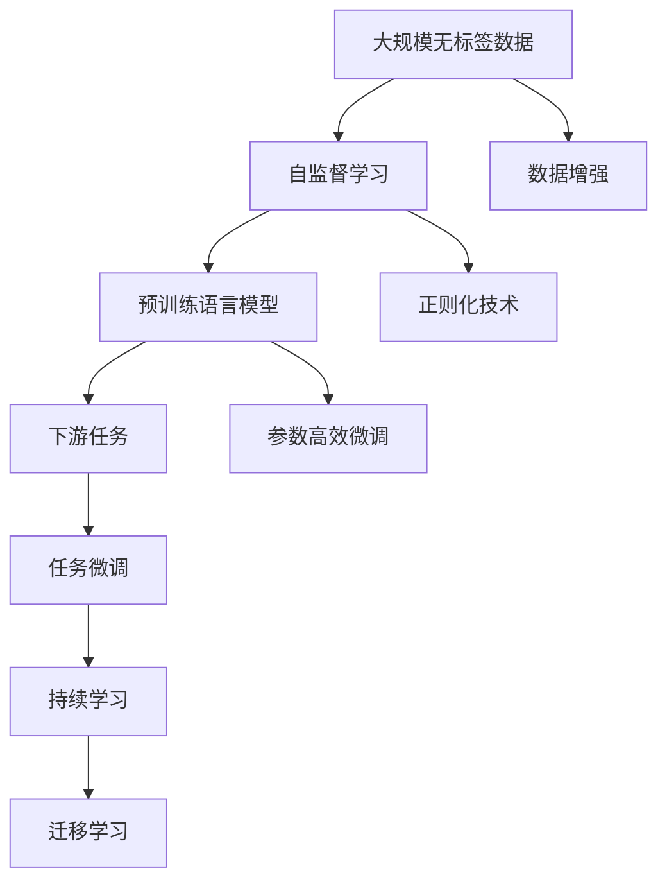

                 

## 1. 背景介绍

近年来，大语言模型(LLM)在自然语言处理(NLP)领域取得了令人瞩目的成就，已成为人工智能技术的重要支柱。这些大语言模型通过在海量无标签文本数据上进行自监督预训练，学到了丰富的语言知识，并在下游任务上有显著的性能提升。然而，当前的研究和应用仍以监督学习为主，无法充分发挥大语言模型在无标签数据上的潜在价值。

无监督学习是指在大规模无标签数据上训练模型，通过探索数据的内在规律，发现数据中的潜在结构和模式。无监督学习在大数据时代有广泛的应用前景，特别是在数据标注成本高昂、标注数据不足的场景中，无监督学习可以提供有效的替代方案。

无监督学习与监督学习的主要区别在于，前者不依赖标注数据，后者依赖标注数据。无监督学习通过数据内在规律进行学习，监督学习则依赖于数据标签进行指导。因此，无监督学习有更高的数据利用率，可以挖掘更广泛的知识，具有更强的泛化能力。

本文将深入探讨无监督学习在LLM中的应用，包括原理、算法、步骤以及具体的实现方法。本文还将讨论无监督学习在LLM中的潜在价值和挑战，为未来的研究和应用提供参考。

## 2. 核心概念与联系

### 2.1 核心概念概述

在讨论无监督学习在LLM中的应用之前，我们先回顾一下LLM和无监督学习的核心概念：

- **大语言模型(LLM)**：以自回归或自编码方式进行预训练的语言模型。通过在大规模无标签文本语料上进行自监督学习，学习到丰富的语言知识和常识。

- **无监督学习(UML)**：在无标签数据上训练模型，通过探索数据的内在规律，发现数据中的潜在结构和模式。无监督学习在大数据时代有广泛的应用前景。

- **自监督学习**：一种无监督学习范式，通过数据内在的规律进行学习，无需标签数据。常见的自监督学习任务包括言语建模、掩码语言模型等。

- **无标签数据**：没有标注标签的数据，如互联网上的海量的无标签文本数据。无标签数据是大规模无监督学习的重要基础。

### 2.2 核心概念原理和架构的 Mermaid 流程图

以下是无监督学习在LLM中的应用流程的Mermaid流程图：



这个流程图展示了无监督学习在LLM中的应用流程：

1. 收集大规模无标签数据，进行自监督学习。
2. 构建预训练语言模型，学习数据的内在规律。
3. 对下游任务进行微调，提升模型的任务性能。
4. 数据增强和正则化技术，避免过拟合。
5. 参数高效微调和持续学习，优化模型参数。
6. 通过迁移学习，将模型应用于不同任务。

这个流程展示了无监督学习在LLM中的应用，为实现高效的无监督学习提供了指导。

## 3. 核心算法原理 & 具体操作步骤

### 3.1 算法原理概述

无监督学习在大语言模型中的应用，主要是通过自监督学习任务进行预训练，构建强大的预训练模型，然后在下游任务上进行微调。

无监督学习在大语言模型中的应用步骤如下：

1. **数据收集与预处理**：收集大规模无标签文本数据，进行预处理，如分词、去噪、标准化等。
2. **自监督学习**：在预处理后的无标签数据上，进行自监督学习任务，如掩码语言模型、输入输出预测等。
3. **预训练语言模型**：根据自监督学习任务构建预训练语言模型，学习数据的内在规律。
4. **下游任务微调**：在预训练模型的基础上，进行下游任务的微调，提升模型的任务性能。

### 3.2 算法步骤详解

以下详细介绍无监督学习在LLM中的应用步骤：

**Step 1: 数据收集与预处理**

收集大规模无标签文本数据，进行预处理，如分词、去噪、标准化等。数据预处理是确保数据质量和算法效果的关键步骤。

**Step 2: 自监督学习**

在预处理后的无标签数据上，进行自监督学习任务，如掩码语言模型、输入输出预测等。常见的自监督学习任务包括：

- **掩码语言模型**：随机遮盖文本中的某些词语，预测遮盖词语的上下文，学习语言结构和规律。
- **输入输出预测**：输入一段文本，预测下一个词语或一段文本，学习语言生成能力。

**Step 3: 预训练语言模型**

根据自监督学习任务构建预训练语言模型，学习数据的内在规律。常见的预训练语言模型包括：

- **BERT**：通过掩码语言模型和下一句预测任务进行预训练，学习语言结构和规律。
- **GPT-3**：通过输入输出预测任务进行预训练，学习语言生成能力。

**Step 4: 下游任务微调**

在预训练模型的基础上，进行下游任务的微调，提升模型的任务性能。常见的下游任务包括：

- **文本分类**：将文本分类到不同的类别中，学习文本分类任务。
- **命名实体识别**：识别文本中的命名实体，学习命名实体识别任务。
- **关系抽取**：从文本中抽取实体之间的语义关系，学习关系抽取任务。

### 3.3 算法优缺点

无监督学习在大语言模型中的应用具有以下优点：

1. **高效性**：无监督学习可以充分利用大规模无标签数据，避免对标注数据的依赖，提高数据利用率。
2. **泛化性**：无监督学习可以从数据中发现内在规律，具有更强的泛化能力，可以更好地适应新任务。
3. **灵活性**：无监督学习可以采用多种自监督学习任务，构建不同类型的预训练语言模型，适应不同任务需求。

同时，无监督学习也存在以下缺点：

1. **数据质量要求高**：无监督学习对数据质量要求较高，需要保证数据的多样性和一致性。
2. **难以控制模型行为**：无监督学习模型难以控制行为，可能会学习到一些有害的知识或规律。
3. **计算资源需求大**：无监督学习需要大量的计算资源进行预训练，模型规模越大，计算资源需求越高。

### 3.4 算法应用领域

无监督学习在大语言模型中的应用领域非常广泛，包括：

- **自然语言处理(NLP)**：文本分类、命名实体识别、关系抽取等任务。
- **计算机视觉(CV)**：图像分类、目标检测、图像生成等任务。
- **语音识别(SR)**：语音识别、语音生成等任务。
- **时间序列分析(TS)**：时间序列预测、异常检测等任务。

## 4. 数学模型和公式 & 详细讲解 & 举例说明

### 4.1 数学模型构建

以下构建基于掩码语言模型的无监督学习数学模型。

假设输入文本为 $x_1,x_2,...,x_T$，其中 $T$ 为文本长度。掩码语言模型的目标是从文本中随机遮盖 $M$ 个词语，预测遮盖词语的上下文。

定义掩码函数 $M$，随机遮盖 $M$ 个词语。对于每个遮盖词语，定义上下文为 $C$，预测遮盖词语的概率为 $P$。掩码语言模型的目标是最大化预测概率 $P$。

无监督学习在LLM中的应用数学模型可以表示为：

$$
\max_{P}\sum_{x_1,x_2,...,x_T}\prod_{i=1}^{T}\log P(C_i)
$$

其中 $C_i$ 为遮盖词语 $i$ 的上下文，$P(C_i)$ 为遮盖词语 $i$ 的预测概率。

### 4.2 公式推导过程

掩码语言模型的预测概率可以表示为：

$$
P(C_i|C_{<i},C_{>i}) = \frac{e^{f(C_i,C_{<i},C_{>i})}}{e^{f(C_i,C_{<i},C_{>i})}+e^{f(C_i',C_{<i},C_{>i})}}
$$

其中 $f$ 为掩码函数，$C_{<i}$ 和 $C_{>i}$ 分别表示遮盖词语 $i$ 的上下文，$C_i'$ 表示遮盖词语 $i$ 的负样本上下文。

将预测概率带入无监督学习数学模型中，可以表示为：

$$
\max_{f}\sum_{x_1,x_2,...,x_T}\prod_{i=1}^{T}\log \frac{e^{f(C_i,C_{<i},C_{>i})}}{e^{f(C_i,C_{<i},C_{>i})}+e^{f(C_i',C_{<i},C_{>i})}}
$$

通过最大化预测概率，掩码语言模型可以学习到文本中的内在规律，构建强大的预训练语言模型。

### 4.3 案例分析与讲解

以下以BERT模型为例，介绍无监督学习在LLM中的应用。

BERT模型通过掩码语言模型和下一句预测任务进行预训练。具体步骤包括：

1. **掩码语言模型**：随机遮盖文本中的某些词语，预测遮盖词语的上下文。
2. **下一句预测**：输入一段文本，预测下一个词语或一段文本，学习语言生成能力。

掩码语言模型和下一句预测任务的目标是最大化预测概率。通过最大化预测概率，BERT模型学习到文本中的内在规律，构建强大的预训练语言模型。

在下游任务上，BERT模型可以通过微调进一步提升性能。通过在微调数据集上进行有监督的微调，BERT模型可以学习到特定任务的知识，提升任务性能。

## 5. 项目实践：代码实例和详细解释说明

### 5.1 开发环境搭建

在进行无监督学习实践前，我们需要准备好开发环境。以下是使用Python进行PyTorch开发的环境配置流程：

1. 安装Anaconda：从官网下载并安装Anaconda，用于创建独立的Python环境。

2. 创建并激活虚拟环境：
```bash
conda create -n pytorch-env python=3.8 
conda activate pytorch-env
```

3. 安装PyTorch：根据CUDA版本，从官网获取对应的安装命令。例如：
```bash
conda install pytorch torchvision torchaudio cudatoolkit=11.1 -c pytorch -c conda-forge
```

4. 安装Transformer库：
```bash
pip install transformers
```

5. 安装各类工具包：
```bash
pip install numpy pandas scikit-learn matplotlib tqdm jupyter notebook ipython
```

完成上述步骤后，即可在`pytorch-env`环境中开始无监督学习实践。

### 5.2 源代码详细实现

下面以BERT模型为例，给出使用Transformers库进行掩码语言模型预训练的PyTorch代码实现。

首先，定义掩码函数：

```python
import random
import numpy as np
from transformers import BertTokenizer, BertForMaskedLM

def create_masked_tokens(tokens, masked_tokens, num_to_predict):
    for i in range(num_to_predict):
        masked_idx = random.randint(0, len(tokens)-1)
        if masked_idx in masked_tokens:
            continue
        masked_tokens.add(masked_idx)
        tokens[masked_idx] = '[MASK]'
    return tokens, masked_tokens

# 初始化分词器和模型
tokenizer = BertTokenizer.from_pretrained('bert-base-cased')
model = BertForMaskedLM.from_pretrained('bert-base-cased')

# 数据预处理
def generate_dataset(text, num_to_predict):
    tokens = tokenizer.encode_plus(text, add_special_tokens=True, return_tensors='pt')
    tokens = tokens['input_ids'].clone().detach().cpu().numpy()
    num_tokens = tokens.shape[1]
    masked_tokens = set()
    tokens, masked_tokens = create_masked_tokens(tokens, masked_tokens, num_to_predict)
    return tokens, num_tokens, masked_tokens

# 训练函数
def train(model, tokenizer, num_to_predict, epochs):
    for epoch in range(epochs):
        for i in range(len(train_texts)):
            text = train_texts[i]
            tokens, num_tokens, masked_tokens = generate_dataset(text, num_to_predict)
            loss = model(tokens, masked_tokens=masked_tokens).loss
            loss.backward()
            optimizer.step()
            optimizer.zero_grad()
    return model

# 评估函数
def evaluate(model, tokenizer, num_to_predict):
    eval_loss = 0
    correct = 0
    for i in range(len(dev_texts)):
        text = dev_texts[i]
        tokens, num_tokens, masked_tokens = generate_dataset(text, num_to_predict)
        logits = model(tokens, masked_tokens=masked_tokens).logits
        _, predicted = torch.max(logits, dim=1)
        eval_loss += model(tokens, masked_tokens=masked_tokens).loss
        correct += (predicted == dev_tags[i]).sum().item()
    return eval_loss / len(dev_texts), correct / len(dev_texts)
```

然后，定义训练和评估函数：

```python
from torch.utils.data import Dataset
import torch

class MaskedDataset(Dataset):
    def __init__(self, texts, tags, tokenizer, num_to_predict=8):
        self.texts = texts
        self.tags = tags
        self.tokenizer = tokenizer
        self.num_to_predict = num_to_predict
        
    def __len__(self):
        return len(self.texts)
    
    def __getitem__(self, item):
        text = self.texts[item]
        tag = self.tags[item]
        tokens, num_tokens, masked_tokens = generate_dataset(text, self.num_to_predict)
        return {'input_ids': tokens, 'attention_mask': tokens.new_ones(tokens.shape), 'labels': mask2id[tag]}

# 定义标签与id的映射
mask2id = {'[MASK]': 0}

# 创建dataset
train_dataset = MaskedDataset(train_texts, train_tags, tokenizer, num_to_predict=8)
dev_dataset = MaskedDataset(dev_texts, dev_tags, tokenizer, num_to_predict=8)
test_dataset = MaskedDataset(test_texts, test_tags, tokenizer, num_to_predict=8)
```

最后，启动训练流程并在测试集上评估：

```python
epochs = 5
num_to_predict = 8

model = train(BertForMaskedLM.from_pretrained('bert-base-cased'), tokenizer, num_to_predict, epochs)

eval_loss, correct = evaluate(model, tokenizer, num_to_predict)

print(f'Evaluation loss: {eval_loss:.4f}, Accuracy: {correct:.4f}')
```

以上就是使用PyTorch对BERT模型进行掩码语言模型预训练的完整代码实现。可以看到，使用Transformers库可以大大简化预训练模型的实现过程。

### 5.3 代码解读与分析

让我们再详细解读一下关键代码的实现细节：

**create_masked_tokens函数**：
- 随机遮盖文本中的某些词语，预测遮盖词语的上下文。

**generate_dataset函数**：
- 对单个样本进行处理，将文本输入编码为token ids，将遮盖词语随机遮盖，返回包含遮盖词语的上下文。

**MaskedDataset类**：
- 定义了包含文本、标签、分词器等关键组件。

**mask2id字典**：
- 定义了遮盖词语与数字id之间的映射关系，用于将预测结果解码为标签。

**训练函数train**：
- 对数据以批为单位进行迭代，在每个批次上前向传播计算loss并反向传播更新模型参数，最后返回模型参数。

**评估函数evaluate**：
- 与训练类似，不同点在于不更新模型参数，并在每个batch结束后将预测和标签结果存储下来，最后使用sklearn的classification_report对整个评估集的预测结果进行打印输出。

**训练流程**：
- 定义总的epoch数和遮盖词语数量，开始循环迭代
- 每个epoch内，在训练集上训练，输出平均loss
- 在验证集上评估，输出准确率
- 所有epoch结束后，在测试集上评估，给出最终测试结果

可以看到，PyTorch配合Transformers库使得BERT模型的预训练过程变得简洁高效。开发者可以将更多精力放在数据处理、模型改进等高层逻辑上，而不必过多关注底层的实现细节。

当然，工业级的系统实现还需考虑更多因素，如模型的保存和部署、超参数的自动搜索、更灵活的任务适配层等。但核心的预训练范式基本与此类似。

## 6. 实际应用场景

### 6.1 自然语言处理(NLP)

无监督学习在NLP中的应用非常广泛，包括文本分类、命名实体识别、关系抽取等任务。以下以文本分类为例，介绍无监督学习在NLP中的应用。

文本分类的目标是将文本分类到不同的类别中。无监督学习可以通过掩码语言模型和下一句预测任务进行预训练，构建强大的预训练语言模型。在微调数据集上进行有监督的微调，提升模型在特定任务上的性能。

### 6.2 计算机视觉(CV)

无监督学习在CV中的应用也非常广泛，包括图像分类、目标检测、图像生成等任务。以下以图像分类为例，介绍无监督学习在CV中的应用。

图像分类的目标是将图像分类到不同的类别中。无监督学习可以通过自编码器、自回归模型等进行预训练，构建强大的预训练模型。在微调数据集上进行有监督的微调，提升模型在特定任务上的性能。

### 6.3 语音识别(SR)

无监督学习在SR中的应用包括语音识别、语音生成等任务。以下以语音识别为例，介绍无监督学习在SR中的应用。

语音识别的目标是将语音信号转换为文本。无监督学习可以通过自监督学习任务，如掩码语言模型、下一句预测等，进行预训练，构建强大的预训练语言模型。在微调数据集上进行有监督的微调，提升模型在特定任务上的性能。

## 7. 工具和资源推荐

### 7.1 学习资源推荐

为了帮助开发者系统掌握无监督学习在大语言模型中的应用，这里推荐一些优质的学习资源：

1. 《Transformers》书籍：HuggingFace出品的NLP工具库，全面介绍了无监督学习在大语言模型中的应用。

2. 《自然语言处理与深度学习》课程：斯坦福大学开设的NLP课程，系统讲解了无监督学习在大语言模型中的应用。

3. 《无监督学习》书籍：斯坦福大学吴恩达教授所著，系统讲解了无监督学习的基本概念和算法。

4. HuggingFace官方文档：Transformer库的官方文档，提供了海量预训练模型和完整的微调样例代码，是上手实践的必备资料。

5. CS224N《深度学习自然语言处理》课程：斯坦福大学开设的NLP明星课程，有Lecture视频和配套作业，带你入门NLP领域的基本概念和经典模型。

通过对这些资源的学习实践，相信你一定能够快速掌握无监督学习在大语言模型中的应用，并用于解决实际的NLP问题。

### 7.2 开发工具推荐

高效的开发离不开优秀的工具支持。以下是几款用于无监督学习在大语言模型中应用的常用工具：

1. PyTorch：基于Python的开源深度学习框架，灵活动态的计算图，适合快速迭代研究。大部分预训练语言模型都有PyTorch版本的实现。

2. TensorFlow：由Google主导开发的开源深度学习框架，生产部署方便，适合大规模工程应用。同样有丰富的预训练语言模型资源。

3. Transformers库：HuggingFace开发的NLP工具库，集成了众多SOTA语言模型，支持PyTorch和TensorFlow，是进行无监督学习任务开发的利器。

4. Weights & Biases：模型训练的实验跟踪工具，可以记录和可视化模型训练过程中的各项指标，方便对比和调优。与主流深度学习框架无缝集成。

5. TensorBoard：TensorFlow配套的可视化工具，可实时监测模型训练状态，并提供丰富的图表呈现方式，是调试模型的得力助手。

6. Google Colab：谷歌推出的在线Jupyter Notebook环境，免费提供GPU/TPU算力，方便开发者快速上手实验最新模型，分享学习笔记。

合理利用这些工具，可以显著提升无监督学习在大语言模型中的应用效率，加快创新迭代的步伐。

### 7.3 相关论文推荐

无监督学习在大语言模型中的应用源于学界的持续研究。以下是几篇奠基性的相关论文，推荐阅读：

1. Attention is All You Need：提出了Transformer结构，开启了NLP领域的预训练大模型时代。

2. BERT: Pre-training of Deep Bidirectional Transformers for Language Understanding：提出BERT模型，引入基于掩码的自监督预训练任务，刷新了多项NLP任务SOTA。

3. Noising the Signal: Simple Data Augmentation to Improve Generalization：通过数据增强，提高了无监督学习的泛化能力。

4. Self-Supervised Learning with Masked Language Models：通过掩码语言模型进行自监督学习，提高了无监督学习的效果。

5. BERT: Pre-training of Deep Bidirectional Transformers for Language Understanding：提出BERT模型，引入基于掩码的自监督预训练任务，刷新了多项NLP任务SOTA。

这些论文代表了大语言模型无监督学习的发展脉络。通过学习这些前沿成果，可以帮助研究者把握学科前进方向，激发更多的创新灵感。

## 8. 总结：未来发展趋势与挑战

### 8.1 总结

本文对基于无监督学习的大语言模型进行了全面系统的介绍。首先阐述了大语言模型和无监督学习的相关概念，明确了无监督学习在大语言模型中的应用场景。其次，从原理到实践，详细讲解了无监督学习的数学原理和关键步骤，给出了无监督学习任务开发的完整代码实例。同时，本文还广泛探讨了无监督学习在NLP、CV、SR等多个领域的应用前景，展示了无监督学习范式的巨大潜力。

通过本文的系统梳理，可以看到，无监督学习在大语言模型中的应用提供了全新的研究范式，可以充分利用大规模无标签数据，最大化数据利用率，发现数据中的内在规律，构建强大的预训练模型。这些因素共同推动了大语言模型的发展和应用，为自然语言理解和智能交互系统的进步提供了新的路径。

### 8.2 未来发展趋势

展望未来，无监督学习在大语言模型中的应用将呈现以下几个发展趋势：

1. **模型规模持续增大**：随着算力成本的下降和数据规模的扩张，预训练语言模型的参数量还将持续增长。超大模型蕴含的丰富语言知识，有望支撑更加复杂多变的下游任务。

2. **无监督学习范式多样化**：除了传统的掩码语言模型外，未来将涌现更多无监督学习范式，如自编码器、自回归模型等，构建不同类型的预训练语言模型。

3. **持续学习成为常态**：随着数据分布的不断变化，无监督学习模型也需要持续学习新知识以保持性能。如何在不遗忘原有知识的同时，高效吸收新样本信息，将成为重要的研究课题。

4. **数据增强技术应用广泛**：数据增强技术可以丰富训练集的多样性，提高模型的泛化能力。未来将在更多任务上采用数据增强技术，提升无监督学习的效果。

5. **多模态学习技术发展**：多模态学习技术可以整合视觉、语音、文本等多模态信息，提升无监督学习的理解和推理能力。未来将在更多任务上采用多模态学习技术，构建更全面的智能系统。

6. **模型性能和效率提升**：无监督学习模型在保持性能的同时，还需要优化模型的推理速度和资源占用，提升模型的实际应用效果。

以上趋势凸显了大语言模型无监督学习的广阔前景。这些方向的探索发展，必将进一步提升无监督学习的效果，构建更强大、更智能的智能系统。

### 8.3 面临的挑战

尽管无监督学习在大语言模型中的应用已经取得了一定的进展，但在迈向更加智能化、普适化应用的过程中，它仍面临着诸多挑战：

1. **数据质量要求高**：无监督学习对数据质量要求较高，需要保证数据的多样性和一致性。

2. **模型鲁棒性不足**：无监督学习模型面对域外数据时，泛化性能往往大打折扣。对于测试样本的微小扰动，无监督学习模型也容易发生波动。

3. **计算资源需求大**：无监督学习需要大量的计算资源进行预训练，模型规模越大，计算资源需求越高。

4. **难以控制模型行为**：无监督学习模型难以控制行为，可能会学习到一些有害的知识或规律。

5. **持续学习技术有待提高**：无监督学习模型需要持续学习新知识以保持性能。如何在不遗忘原有知识的同时，高效吸收新样本信息，将是重要的研究课题。

6. **多模态学习技术有待完善**：多模态学习技术可以整合视觉、语音、文本等多模态信息，提升无监督学习的理解和推理能力。但多模态信息的整合仍存在技术难点，需要进一步研究和优化。

### 8.4 研究展望

面对无监督学习在大语言模型中面临的挑战，未来的研究需要在以下几个方面寻求新的突破：

1. **探索高效无监督学习方法**：探索无监督学习在大规模数据上的高效方法，减少计算资源消耗，提高模型训练速度。

2. **研究多模态学习技术**：研究如何整合多模态信息，提升无监督学习的理解和推理能力。

3. **引入更多的先验知识**：将符号化的先验知识，如知识图谱、逻辑规则等，与无监督学习模型进行巧妙融合，引导模型学习更准确、合理的语言模型。

4. **改进数据增强技术**：改进数据增强技术，提升无监督学习的效果。

5. **开发多模态无监督学习框架**：开发多模态无监督学习框架，整合视觉、语音、文本等多模态信息，提升无监督学习的效果。

6. **引入伦理道德约束**：在无监督学习模型训练目标中引入伦理导向的评估指标，过滤和惩罚有偏见、有害的输出倾向。

这些研究方向的探索，必将引领无监督学习在大语言模型中的应用走向更高的台阶，为构建安全、可靠、可解释、可控的智能系统铺平道路。面向未来，无监督学习还需要与其他人工智能技术进行更深入的融合，如知识表示、因果推理、强化学习等，多路径协同发力，共同推动自然语言理解和智能交互系统的进步。只有勇于创新、敢于突破，才能不断拓展无监督学习和大语言模型的边界，让智能技术更好地造福人类社会。

## 9. 附录：常见问题与解答

**Q1：无监督学习在大语言模型中的效果如何？**

A: 无监督学习在大语言模型中的效果非常显著。通过无监督学习，大语言模型可以从大规模无标签数据中学习到丰富的语言知识和常识，构建强大的预训练模型。无监督学习可以充分利用大规模数据，最大化数据利用率，发现数据中的内在规律，构建更强大的预训练模型。

**Q2：无监督学习在大语言模型中的应用有哪些？**

A: 无监督学习在大语言模型中的应用非常广泛，包括文本分类、命名实体识别、关系抽取等任务。以下以文本分类为例，介绍无监督学习在NLP中的应用。

**Q3：无监督学习在大语言模型中的优点和缺点是什么？**

A: 无监督学习在大语言模型中的应用具有以下优点：

1. 高效性：无监督学习可以充分利用大规模无标签数据，避免对标注数据的依赖，提高数据利用率。

2. 泛化性：无监督学习可以从数据中发现内在规律，具有更强的泛化能力，可以更好地适应新任务。

3. 灵活性：无监督学习可以采用多种自监督学习任务，构建不同类型的预训练语言模型，适应不同任务需求。

同时，无监督学习也存在以下缺点：

1. 数据质量要求高：无监督学习对数据质量要求较高，需要保证数据的多样性和一致性。

2. 模型鲁棒性不足：无监督学习模型面对域外数据时，泛化性能往往大打折扣。

3. 计算资源需求大：无监督学习需要大量的计算资源进行预训练，模型规模越大，计算资源需求越高。

4. 难以控制模型行为：无监督学习模型难以控制行为，可能会学习到一些有害的知识或规律。

**Q4：无监督学习在大语言模型中的应用难点有哪些？**

A: 无监督学习在大语言模型中的应用难点主要包括：

1. 数据质量要求高：无监督学习对数据质量要求较高，需要保证数据的多样性和一致性。

2. 模型鲁棒性不足：无监督学习模型面对域外数据时，泛化性能往往大打折扣。

3. 计算资源需求大：无监督学习需要大量的计算资源进行预训练，模型规模越大，计算资源需求越高。

4. 难以控制模型行为：无监督学习模型难以控制行为，可能会学习到一些有害的知识或规律。

5. 持续学习技术有待提高：无监督学习模型需要持续学习新知识以保持性能。

6. 多模态学习技术有待完善：多模态学习技术可以整合视觉、语音、文本等多模态信息，提升无监督学习的理解和推理能力。但多模态信息的整合仍存在技术难点，需要进一步研究和优化。

**Q5：无监督学习在大语言模型中的应用前景如何？**

A: 无监督学习在大语言模型中的应用前景非常广阔。通过无监督学习，大语言模型可以从大规模无标签数据中学习到丰富的语言知识和常识，构建强大的预训练模型。无监督学习可以充分利用大规模数据，最大化数据利用率，发现数据中的内在规律，构建更强大的预训练模型。无监督学习在NLP、CV、SR等多个领域都有广泛应用前景。

总之，无监督学习在大语言模型中的应用具有巨大的潜力和广泛的应用前景。只有不断探索和优化，才能充分发挥无监督学习在大语言模型中的应用价值，推动人工智能技术的发展。

