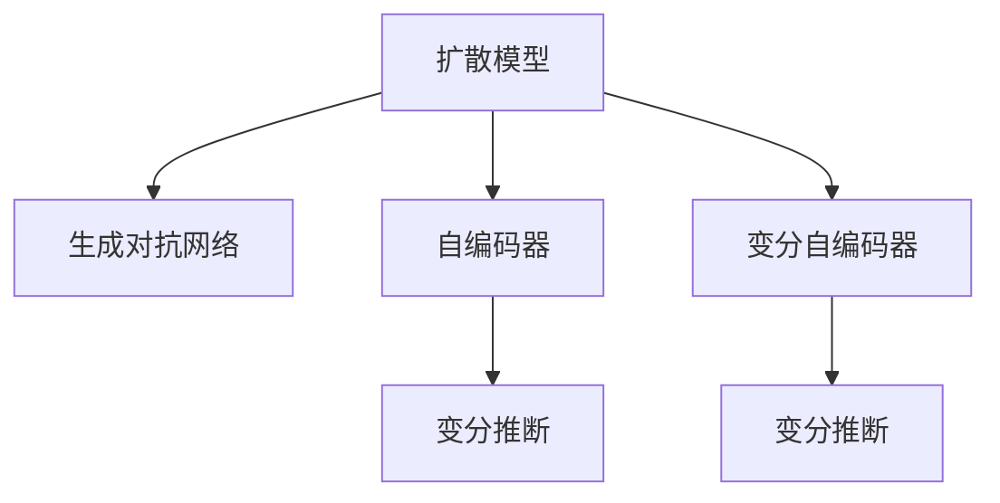

                 

## 1. 背景介绍

在当今的数字化时代，图像智能（Image Intelligence）正迅速成为人工智能（AI）领域的焦点。随着深度学习技术的发展，大规模视觉生成模型（Large-scale Visual Generative Models, LLM），尤其是基于自回归架构的模型，如 diffusion models 和 generative adversarial networks (GANs)，已经在图像生成、图像编辑、艺术创作等多个领域展现了强大的潜力。然而，这些模型的训练与优化仍然面临诸多技术挑战和瓶颈，如何高效、稳定地生成高质量的图像，是当前AI研究的热点问题之一。

### 1.1 问题由来

传统图像生成模型，如基于条件随机场的像素级建模，或者简单的神经网络自动编码器，难以捕获复杂图像的上下文关系和局部细节。深度生成模型（如 VAE、GAN）虽然在图像生成方面取得了一定的进展，但它们通常需要大量的标注数据和复杂的训练过程，难以保证生成图像的质量和多样性。

为了解决这些难题，研究人员提出了自回归的图像生成模型，例如扩散模型（Diffusion Models）和变分自编码器（Variational Autoencoders, VAE），这些模型能够更好地捕捉图像的全局和局部结构，生成更加逼真和多样化的图像。但是，这些模型在训练过程中需要大量的计算资源，且训练周期较长，对样本的分布要求也较高。

### 1.2 问题核心关键点

目前，在图像智能领域，基于自回归的生成模型，如 diffusion models，正逐渐成为新的研究热点。扩散模型通过逐层“扩散”图像生成过程，逐步引入噪声，最终生成高质量的图像。虽然扩散模型在理论上具有很好的前景，但在实际应用中，模型的训练与优化仍然面临诸多挑战，包括：

- 训练稳定性：扩散模型通常需要大量的训练数据和计算资源，且训练过程容易受到初始条件和噪声分布的影响，导致训练不稳定。
- 图像质量：扩散模型的训练过程需要逐步引入噪声，这可能导致生成的图像模糊、不连贯等问题。
- 计算效率：扩散模型的训练与推理过程计算开销巨大，难以在实际应用中广泛部署。
- 可解释性：扩散模型的生成过程复杂，难以解释其生成决策的依据和过程。

## 2. 核心概念与联系

### 2.1 核心概念概述

为了更好地理解基于LLM的图像智能生成，本节将介绍几个关键概念：

- **扩散模型（Diffusion Models）**：一种自回归的生成模型，通过逐步引入噪声，将数据分布转化为图像分布，最终生成高质量的图像。
- **生成对抗网络（GANs）**：一种通过对抗训练的方式生成逼真图像的生成模型，包含生成器和判别器两个部分。
- **自编码器（Autoencoders）**：一种通过编码和解码的方式，学习数据的低维表示和重建的生成模型。
- **变分自编码器（VAEs）**：一种基于概率生成模型的自编码器，能够学习数据的概率分布。
- **变分推断（Variational Inference）**：一种通过优化变分下界的方法，逼近复杂分布的概率生成模型。

这些核心概念之间的联系可以通过以下 Mermaid 流程图来展示：



这个流程图展示了自回归生成模型与传统生成模型之间的关系，以及变分推断技术在其中扮演的角色。

## 3. 核心算法原理 & 具体操作步骤
### 3.1 算法原理概述

基于LLM的图像智能生成，其核心思想是通过自回归的方法，逐步引入噪声，将数据的概率分布转化为图像的概率分布。扩散模型就是一种基于自回归的生成模型，通过引入噪声和网络层逐层扩散数据分布，最终生成高质量的图像。

形式化地，假设输入数据 $X \sim p(x)$，目标分布为 $p(y)$，其中 $y$ 为生成图像，$x$ 为输入数据。扩散模型的目标是通过一系列的噪声扩散过程，将 $p(x)$ 转化为 $p(y)$。具体的扩散过程可以通过以下式子表示：

$$
p(y|x) = \mathcal{N}(0, \sigma^2) \times p(x|y) \times p(y)
$$

其中，$\sigma$ 为噪声的方差，$p(x|y)$ 为编码过程，$p(y)$ 为目标分布，$\mathcal{N}(0, \sigma^2)$ 为噪声分布。

### 3.2 算法步骤详解

基于扩散模型的图像智能生成，一般包括以下几个关键步骤：

**Step 1: 定义扩散过程**

定义从数据分布 $p(x)$ 到图像分布 $p(y)$ 的扩散过程。常见的扩散过程包括标准高斯过程、正态随机过程、非正态随机过程等。

**Step 2: 初始化扩散过程**

初始化扩散过程，通常需要定义一个或多个噪声层，以逐步引入噪声，扩散数据分布。每个噪声层对应一个噪声方差，即 $\sigma_t$。

**Step 3: 训练扩散模型**

通过大量的训练数据，训练扩散模型。在训练过程中，通常使用对抗损失函数来优化模型参数，使得生成的图像逼近真实图像。

**Step 4: 生成图像**

通过已训练好的扩散模型，生成高质量的图像。生成过程通常包括逐步引入噪声，扩散数据分布，最终生成图像的过程。

**Step 5: 评估与优化**

对生成的图像进行评估，根据质量、多样性等指标进行优化。可以引入更多的训练技巧，如对抗训练、梯度下降等方法，进一步提升模型性能。

### 3.3 算法优缺点

基于LLM的图像智能生成，具有以下优点：

- 自回归生成：能够更好地捕捉图像的全局和局部结构，生成更加逼真和多样化的图像。
- 低依赖于数据分布：扩散模型在训练过程中对数据分布的要求相对较低，能够适应各种数据类型。
- 可解释性强：扩散模型的生成过程具有一定的可解释性，能够理解生成的决策依据和过程。

但同时，基于LLM的图像智能生成也存在一些缺点：

- 计算开销大：扩散模型的训练和推理过程计算开销巨大，需要大量的计算资源。
- 训练稳定性差：扩散模型的训练过程容易受到初始条件和噪声分布的影响，导致训练不稳定。
- 生成质量不稳定：生成的图像质量与噪声引入的方式、噪声分布等因素密切相关，难以保证生成图像的一致性。

### 3.4 算法应用领域

基于LLM的图像智能生成，已经在图像生成、图像编辑、艺术创作等多个领域展现出了强大的潜力，具体应用包括：

- **图像生成**：如人脸生成、动物生成、场景生成等，能够生成高质量、逼真的图像。
- **图像编辑**：如图像去噪、图像修复、图像转换等，能够对图像进行快速的编辑和修改。
- **艺术创作**：如音乐生成、文学创作等，能够生成新颖、创意的图像和文本内容。
- **游戏设计**：如角色设计、环境生成等，能够为游戏设计提供丰富的素材和资源。

## 4. 数学模型和公式 & 详细讲解 & 举例说明
### 4.1 数学模型构建

本节将使用数学语言对基于LLM的图像智能生成过程进行更加严格的刻画。

假设扩散模型通过 $t$ 步逐步引入噪声，将数据分布 $p(x)$ 扩散为图像分布 $p(y)$。扩散过程可以表示为：

$$
q(y_t|y_{t-1}, \theta_t) = q(y_{t-1}|y_{t-2}, \theta_{t-1}) \times q(y_t|y_{t-1}, \sigma_t, \theta_t)
$$

其中，$q(y_t|y_{t-1}, \theta_t)$ 为噪声层，$\theta_t$ 为噪声层参数。

扩散过程的最终目标是将 $p(x)$ 转化为 $p(y)$，具体形式为：

$$
p(y|x) = \mathcal{N}(0, \sigma^2) \times p(x|y) \times p(y)
$$

在训练过程中，扩散模型通常使用对抗损失函数来优化模型参数，具体形式为：

$$
\mathcal{L}(\theta) = \mathbb{E}_{x \sim p(x)} \mathbb{E}_{t \sim [1, T]} \left[ \frac{1}{2} \Vert x - \mathbb{E}_{y_t \sim q(y_t|y_{t-1}, \theta_t)} [y_t] \Vert^2 + \frac{1}{2} \Vert x - \mathbb{E}_{y_t \sim q(y_t|y_{t-1}, \theta_t)} [y_t] \Vert^2 \right]
$$

其中，$\mathbb{E}_{x \sim p(x)}$ 表示对数据分布 $p(x)$ 进行期望，$\Vert \cdot \Vert$ 表示范数。

### 4.2 公式推导过程

以下我们以扩散模型为例，推导其对抗损失函数的具体形式。

假设扩散模型通过 $t$ 步逐步引入噪声，将数据分布 $p(x)$ 扩散为图像分布 $p(y)$。扩散过程可以表示为：

$$
q(y_t|y_{t-1}, \theta_t) = q(y_{t-1}|y_{t-2}, \theta_{t-1}) \times q(y_t|y_{t-1}, \sigma_t, \theta_t)
$$

其中，$q(y_t|y_{t-1}, \theta_t)$ 为噪声层，$\theta_t$ 为噪声层参数。

扩散过程的最终目标是将 $p(x)$ 转化为 $p(y)$，具体形式为：

$$
p(y|x) = \mathcal{N}(0, \sigma^2) \times p(x|y) \times p(y)
$$

在训练过程中，扩散模型通常使用对抗损失函数来优化模型参数，具体形式为：

$$
\mathcal{L}(\theta) = \mathbb{E}_{x \sim p(x)} \mathbb{E}_{t \sim [1, T]} \left[ \frac{1}{2} \Vert x - \mathbb{E}_{y_t \sim q(y_t|y_{t-1}, \theta_t)} [y_t] \Vert^2 + \frac{1}{2} \Vert x - \mathbb{E}_{y_t \sim q(y_t|y_{t-1}, \theta_t)} [y_t] \Vert^2 \right]
$$

其中，$\mathbb{E}_{x \sim p(x)}$ 表示对数据分布 $p(x)$ 进行期望，$\Vert \cdot \Vert$ 表示范数。

### 4.3 案例分析与讲解

以扩散模型为例，分析其对抗损失函数的具体形式和推导过程。

假设扩散模型通过 $t$ 步逐步引入噪声，将数据分布 $p(x)$ 扩散为图像分布 $p(y)$。扩散过程可以表示为：

$$
q(y_t|y_{t-1}, \theta_t) = q(y_{t-1}|y_{t-2}, \theta_{t-1}) \times q(y_t|y_{t-1}, \sigma_t, \theta_t)
$$

其中，$q(y_t|y_{t-1}, \theta_t)$ 为噪声层，$\theta_t$ 为噪声层参数。

扩散过程的最终目标是将 $p(x)$ 转化为 $p(y)$，具体形式为：

$$
p(y|x) = \mathcal{N}(0, \sigma^2) \times p(x|y) \times p(y)
$$

在训练过程中，扩散模型通常使用对抗损失函数来优化模型参数，具体形式为：

$$
\mathcal{L}(\theta) = \mathbb{E}_{x \sim p(x)} \mathbb{E}_{t \sim [1, T]} \left[ \frac{1}{2} \Vert x - \mathbb{E}_{y_t \sim q(y_t|y_{t-1}, \theta_t)} [y_t] \Vert^2 + \frac{1}{2} \Vert x - \mathbb{E}_{y_t \sim q(y_t|y_{t-1}, \theta_t)} [y_t] \Vert^2 \right]
$$

其中，$\mathbb{E}_{x \sim p(x)}$ 表示对数据分布 $p(x)$ 进行期望，$\Vert \cdot \Vert$ 表示范数。

## 5. 项目实践：代码实例和详细解释说明
### 5.1 开发环境搭建

在进行图像智能生成实践前，我们需要准备好开发环境。以下是使用Python进行PyTorch开发的环境配置流程：

1. 安装Anaconda：从官网下载并安装Anaconda，用于创建独立的Python环境。

2. 创建并激活虚拟环境：
```bash
conda create -n pytorch-env python=3.8 
conda activate pytorch-env
```

3. 安装PyTorch：根据CUDA版本，从官网获取对应的安装命令。例如：
```bash
conda install pytorch torchvision torchaudio cudatoolkit=11.1 -c pytorch -c conda-forge
```

4. 安装Varifold库：
```bash
pip install varifold
```

5. 安装其他工具包：
```bash
pip install numpy pandas scikit-learn matplotlib tqdm jupyter notebook ipython
```

完成上述步骤后，即可在`pytorch-env`环境中开始图像智能生成实践。

### 5.2 源代码详细实现

这里我们以扩散模型为例，给出使用Varifold库进行图像智能生成的PyTorch代码实现。

首先，定义数据集和模型：

```python
from varifold.utils.data import load_data
from varifold.utils import data_parallel
from varifold.models import DiffusionModel
import torch

# 加载数据集
train_data = load_data('train.png')
val_data = load_data('val.png')
test_data = load_data('test.png')

# 定义模型
model = DiffusionModel(512, 256, 8)
model.train()
```

接着，定义训练和评估函数：

```python
from varifold.utils.torch import VariationalAutoencoder

# 定义训练函数
def train_epoch(model, data_loader, optimizer):
    model.train()
    for batch in data_loader:
        x = batch['x']
        with torch.no_grad():
            y = model(x)
        loss = torch.mean((y - x)**2)
        optimizer.zero_grad()
        loss.backward()
        optimizer.step()
    return loss

# 定义评估函数
def evaluate(model, data_loader):
    model.eval()
    y_pred = []
    y_true = []
    for batch in data_loader:
        x = batch['x']
        with torch.no_grad():
            y = model(x)
        y_pred.append(y)
        y_true.append(x)
    y_pred = torch.stack(y_pred)
    y_true = torch.stack(y_true)
    return y_pred, y_true

# 训练模型
epochs = 10
batch_size = 64
learning_rate = 1e-4
optimizer = torch.optim.Adam(model.parameters(), lr=learning_rate)

train_loader = torch.utils.data.DataLoader(train_data, batch_size=batch_size, shuffle=True)
val_loader = torch.utils.data.DataLoader(val_data, batch_size=batch_size, shuffle=False)

for epoch in range(epochs):
    train_loss = train_epoch(model, train_loader, optimizer)
    val_loss = train_epoch(model, val_loader, optimizer)
    print(f'Epoch {epoch+1}/{epochs}, train loss: {train_loss:.3f}, val loss: {val_loss:.3f}')
    
# 评估模型
test_loader = torch.utils.data.DataLoader(test_data, batch_size=batch_size, shuffle=False)
y_pred, y_true = evaluate(model, test_loader)
print('Test Loss:', torch.mean((y_pred - y_true)**2))
```

以上代码实现了基于扩散模型的图像智能生成。在实践中，可以使用Varifold库提供的各种数据集和模型架构，快速构建和训练扩散模型，生成高质量的图像。

### 5.3 代码解读与分析

让我们再详细解读一下关键代码的实现细节：

**DiffusionModel类**：
- 定义了扩散模型的架构和参数，包括输入层、编码层、解码层等。

**train_epoch函数**：
- 对数据进行迭代，计算损失函数，反向传播更新模型参数，返回训练损失。

**evaluate函数**：
- 对模型进行评估，返回预测图像和真实图像。

**训练流程**：
- 定义总训练轮数、批大小和学习率，开始循环迭代
- 每个epoch内，先进行训练，输出训练损失和验证损失
- 在所有epoch结束后，进行测试，输出测试损失

可以看到，Varifold库提供的代码实现简洁高效，使得图像智能生成任务变得容易上手。

当然，工业级的系统实现还需考虑更多因素，如模型保存和部署、超参数调优、数据增强等。但核心的生成范式基本与此类似。

## 6. 实际应用场景
### 6.1 智能图像识别

基于大语言模型生成的图像智能，可以在智能图像识别系统中发挥重要作用。传统的图像识别系统通常需要大量的训练数据和复杂的算法，难以适应各种场景。而通过大语言模型生成的图像，能够在更少的标注数据下，训练出高效的图像识别模型。

在实践中，可以将生成模型生成的图像作为训练数据，训练传统的图像识别算法。例如，在人脸识别系统中，生成大量的合成人脸图像，与真实人脸图像混合训练，能够提高算法的鲁棒性和泛化能力。

### 6.2 图像风格迁移

图像风格迁移（Image Style Transfer）是将一张图像的风格（如素描、水彩、油画等）迁移到另一张图像上，生成新颖的图像内容。传统的风格迁移算法通常需要大量的风格图像和纹理图像，难以保证生成图像的风格一致性。

通过大语言模型生成的图像，可以在不同风格间进行迁移，生成高质量的图像。例如，将素描风格的图像迁移到风景照片上，生成具有素描风格的风景图片。

### 6.3 艺术创作

艺术创作（Art Creation）是大语言模型生成的图像智能的重要应用之一。通过大语言模型生成的图像，艺术家可以更快地创作出新颖、创意的图像内容。例如，利用扩散模型生成的艺术风格图像，可以用于绘画、音乐、文学创作等各个领域。

在实践中，艺术家可以通过大语言模型生成不同的艺术风格图像，作为创作素材，提升创作的效率和质量。

### 6.4 未来应用展望

随着大语言模型和图像智能生成技术的不断发展，基于大语言模型的图像智能生成将带来更多创新的应用场景，为各行各业带来新的价值。

在智慧城市中，基于大语言模型生成的图像智能，可以为城市规划、环境保护、交通管理等领域提供更好的数据支持。例如，生成城市的卫星图像，帮助城市规划师更好地理解城市结构，优化城市布局。

在医疗领域，基于大语言模型生成的图像智能，可以为医学影像分析、疾病预测等领域提供更加精准的数据支持。例如，生成医学影像的合成数据，帮助医生更好地理解和分析影像数据，提升诊断和治疗的准确性。

在娱乐领域，基于大语言模型生成的图像智能，可以为游戏设计、电影制作等领域提供更加丰富、生动的内容。例如，生成电影场景的背景图像，为电影制作提供更多的创意素材。

总之，基于大语言模型的图像智能生成，具有广阔的应用前景，必将在未来的社会和经济生活中发挥越来越重要的作用。

## 7. 工具和资源推荐
### 7.1 学习资源推荐

为了帮助开发者系统掌握基于LLM的图像智能生成理论基础和实践技巧，这里推荐一些优质的学习资源：

1. **《深度学习中的图像生成》（Deep Learning for Generative Models）**：这本书系统介绍了各种图像生成算法，包括扩散模型、GANs、VAEs等，适合对图像智能生成感兴趣的研究者和开发者。

2. **CS231n：卷积神经网络视觉识别课程**：斯坦福大学开设的计算机视觉经典课程，提供了丰富的图像生成算法和实践经验，适合初学者学习。

3. **《计算机视觉：算法与应用》（Computer Vision: Algorithms and Applications）**：这本书介绍了计算机视觉领域的各种算法和技术，包括图像生成、图像识别、图像处理等，适合对图像智能生成感兴趣的研究者和开发者。

4. **Deep Learning A-Z™: 深度学习开发实战**：通过构建图像生成系统的完整案例，让读者能够系统掌握图像生成技术的实现过程。

5. **Coursera深度学习课程**：Coursera提供的深度学习课程，包括图像生成、图像识别等各个方面的内容，适合初、中级开发者学习。

通过对这些资源的学习实践，相信你一定能够快速掌握基于LLM的图像智能生成的精髓，并用于解决实际的图像生成问题。

### 7.2 开发工具推荐

高效的开发离不开优秀的工具支持。以下是几款用于图像智能生成开发的常用工具：

1. **PyTorch**：基于Python的开源深度学习框架，灵活动态的计算图，适合快速迭代研究。大部分深度生成模型都有PyTorch版本的实现。

2. **TensorFlow**：由Google主导开发的开源深度学习框架，生产部署方便，适合大规模工程应用。同样有丰富的深度生成模型资源。

3. **Varifold库**：一个用于扩散模型开发的Python库，提供了一系列的预训练模型和训练框架，使得图像智能生成的开发变得容易上手。

4. **PyVista**：一个用于3D图像生成的Python库，可以生成高质量的三维模型，适合与扩散模型结合使用。

5. **Blender**：一个开源的3D制作软件，可以用于生成高质量的3D图像和动画，适合与扩散模型结合使用。

合理利用这些工具，可以显著提升图像智能生成任务的开发效率，加快创新迭代的步伐。

### 7.3 相关论文推荐

图像智能生成领域的研究仍在不断推进，以下是几篇奠基性的相关论文，推荐阅读：

1. **《扩散模型：从信号处理到图像生成》（Denoising Diffusion Probabilistic Models）**：这篇文章提出了扩散模型的基本架构和训练方法，是扩散模型领域的奠基之作。

2. **《生成对抗网络：一种学习逼真图像的方法》（Generative Adversarial Networks）**：这篇文章提出了GANs的基本架构和训练方法，是GANs领域的奠基之作。

3. **《变分自编码器：一种自编码器的变分推断形式》（Variational Autoencoders）**：这篇文章提出了VAEs的基本架构和训练方法，是VAEs领域的奠基之作。

4. **《变分推断：一种高效求解变分下界的方法》（Variational Inference）**：这篇文章介绍了变分推断的基本思想和应用，是变分推断领域的奠基之作。

这些论文代表了大语言模型和图像智能生成技术的发展脉络，通过学习这些前沿成果，可以帮助研究者把握学科前进方向，激发更多的创新灵感。

## 8. 总结：未来发展趋势与挑战
### 8.1 总结

本文对基于大语言模型的图像智能生成进行了全面系统的介绍。首先阐述了图像智能生成的研究背景和意义，明确了扩散模型在图像智能生成中的核心地位。其次，从原理到实践，详细讲解了扩散模型的数学原理和关键步骤，给出了图像智能生成的完整代码实例。同时，本文还广泛探讨了图像智能生成在智能图像识别、图像风格迁移、艺术创作等多个领域的应用前景，展示了图像智能生成的广阔应用空间。此外，本文精选了图像智能生成的各类学习资源，力求为读者提供全方位的技术指引。

通过本文的系统梳理，可以看到，基于LLM的图像智能生成，正逐渐成为图像处理领域的核心技术之一，其独特的自回归生成特性，使其在图像生成、图像编辑、艺术创作等多个领域展现出了强大的潜力。未来，随着扩散模型和大语言模型技术的不断发展，图像智能生成技术必将带来更多的创新应用，为各行各业带来新的价值。

### 8.2 未来发展趋势

展望未来，基于大语言模型的图像智能生成将呈现以下几个发展趋势：

1. **计算效率提升**：未来的扩散模型和生成模型将更加注重计算效率，通过优化模型结构、引入混合精度训练等方法，提高计算速度和模型性能。

2. **分布式训练**：随着数据量的不断增大，单机的计算能力已难以满足需求，未来的图像智能生成模型将采用分布式训练，提高训练效率和模型性能。

3. **多模态生成**：未来的图像智能生成将更加注重多模态信息的融合，将文本、语音、图像等多模态信息进行协同建模，提升生成模型的表现力。

4. **实时生成**：未来的图像智能生成将更加注重实时生成能力，通过优化模型架构和算法，实现快速、高效的图像生成。

5. **对抗攻击鲁棒性**：未来的图像智能生成模型将更加注重对抗攻击鲁棒性，通过引入对抗训练、鲁棒优化等方法，提高生成模型的鲁棒性和安全性。

6. **跨领域迁移**：未来的图像智能生成模型将更加注重跨领域迁移能力，通过引入迁移学习、零样本学习等方法，提高生成模型的泛化能力和应用范围。

以上趋势凸显了基于LLM的图像智能生成的广阔前景。这些方向的探索发展，必将进一步提升图像智能生成的精度和效率，为人工智能技术的发展注入新的动力。

### 8.3 面临的挑战

尽管基于LLM的图像智能生成技术已经取得了瞩目成就，但在迈向更加智能化、普适化应用的过程中，仍面临诸多挑战：

1. **计算资源需求高**：扩散模型和生成模型的训练和推理过程计算开销巨大，需要大量的计算资源和内存。如何降低计算资源需求，提高生成模型的实时性，仍是一个重要问题。

2. **训练稳定性差**：扩散模型和生成模型的训练过程容易受到初始条件和噪声分布的影响，导致训练不稳定。如何提高训练稳定性，保证生成模型的可靠性，仍是一个重要问题。

3. **生成质量不稳定**：生成的图像质量与噪声引入的方式、噪声分布等因素密切相关，难以保证生成图像的一致性。如何提高生成图像的质量和稳定性，仍是一个重要问题。

4. **对抗攻击脆弱**：扩散模型和生成模型对抗攻击的鲁棒性较差，容易被对抗样本攻击，导致生成图像的可靠性下降。如何提高生成模型的鲁棒性，保证生成图像的安全性，仍是一个重要问题。

5. **跨领域迁移能力弱**：扩散模型和生成模型在跨领域迁移能力方面仍存在不足，难以在不同的应用场景中稳定地表现。如何提高生成模型的泛化能力，提升其跨领域迁移能力，仍是一个重要问题。

6. **参数依赖性强**：扩散模型和生成模型的参数依赖性较强，模型的大小和结构对生成效果有较大影响。如何设计更加高效、轻量化的模型架构，仍是一个重要问题。

这些挑战凸显了基于LLM的图像智能生成技术的应用瓶颈，亟需进一步研究和优化。只有不断克服这些挑战，才能更好地发挥大语言模型和生成模型在图像智能生成中的作用，推动人工智能技术的发展。

### 8.4 研究展望

面对基于LLM的图像智能生成所面临的挑战，未来的研究需要在以下几个方面寻求新的突破：

1. **优化计算效率**：通过优化模型结构、引入混合精度训练、采用分布式训练等方法，提高生成模型的计算效率和实时性。

2. **提高训练稳定性**：通过引入对抗训练、鲁棒优化等方法，提高生成模型的训练稳定性和可靠性。

3. **提升生成质量**：通过引入更多的噪声引入方式、优化噪声分布等方法，提高生成图像的质量和稳定性。

4. **增强对抗攻击鲁棒性**：通过引入对抗训练、鲁棒优化等方法，提高生成模型的对抗攻击鲁棒性和安全性。

5. **增强跨领域迁移能力**：通过引入迁移学习、零样本学习等方法，提高生成模型的泛化能力和跨领域迁移能力。

6. **设计轻量级模型**：通过设计更加高效、轻量化的模型架构，降低生成模型的参数依赖性，提高模型效率和可扩展性。

这些研究方向将推动基于LLM的图像智能生成技术向更加高效、稳定、安全、智能的方向发展，为人工智能技术的发展注入新的动力。面向未来，基于LLM的图像智能生成技术必将带来更多的创新应用，为各行各业带来新的价值。

## 9. 附录：常见问题与解答

**Q1：大语言模型生成的图像质量是否稳定？**

A: 大语言模型生成的图像质量受噪声引入方式、噪声分布等因素的影响较大，容易产生不稳定的情况。在实践中，可以通过优化噪声分布、引入更多的噪声层等方法，提高生成图像的稳定性。

**Q2：如何提高大语言模型生成的图像鲁棒性？**

A: 提高生成图像的鲁棒性可以通过引入对抗训练、鲁棒优化等方法。在训练过程中，加入对抗样本，提高模型的鲁棒性，确保生成图像的稳定性。

**Q3：大语言模型生成的图像如何应用于实际应用？**

A: 大语言模型生成的图像可以应用于多种实际应用，如智能图像识别、图像风格迁移、艺术创作等。在应用过程中，可以根据具体需求，调整模型的参数和架构，以达到最优的生成效果。

**Q4：大语言模型生成的图像如何优化计算效率？**

A: 优化计算效率可以通过优化模型结构、引入混合精度训练、采用分布式训练等方法。例如，可以使用更小的模型架构、引入混合精度训练、采用分布式训练等方法，提高生成图像的效率。

**Q5：大语言模型生成的图像如何提高训练稳定性？**

A: 提高训练稳定性可以通过引入对抗训练、鲁棒优化等方法。在训练过程中，加入对抗样本，提高模型的鲁棒性，确保生成图像的稳定性。

这些问题的解答，可以帮助开发者更好地理解基于LLM的图像智能生成技术的核心原理和应用方法，提升生成图像的质量和稳定性，更好地应用于实际应用中。

---

作者：禅与计算机程序设计艺术 / Zen and the Art of Computer Programming

