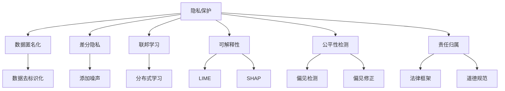

                 

# LLM隐私安全:人工智能伦理挑战

## 1. 背景介绍

### 1.1 问题由来
在人工智能(AI)快速发展的同时，大规模语言模型(Large Language Models, LLMs)的应用日益广泛。从智能助手到自动翻译，再到医疗诊断，LLMs在各行各业中展现出强大的语言理解和生成能力。然而，在获得公众认可的同时，LLMs的隐私与安全问题也引起了广泛关注。

在使用LLMs进行个性化服务、智能推荐、智能监控等应用场景时，模型通常需要收集和分析大量个人数据。这些数据可能包含敏感信息，如医疗记录、财务信息、行为习惯等，如何保护用户隐私、确保数据安全，成为亟需解决的重大伦理挑战。

### 1.2 问题核心关键点
LLMs的隐私安全问题主要集中在以下几个方面：

- **数据隐私**：如何防止用户数据被滥用、泄露或不当共享。
- **模型透明性**：用户如何理解模型如何使用其数据、做出决策，以及如何保证模型的公平性和无偏性。
- **可解释性**：用户如何理解模型决策的原因，是否存在潜在的偏见和歧视。
- **责任归属**：当模型做出错误决策时，谁应该负责。

这些问题直接关系到用户信任，影响到LLMs的广泛应用和普及。因此，研究并解决LLMs的隐私安全问题，对于推动AI技术的健康发展至关重要。

### 1.3 问题研究意义
研究LLMs的隐私安全问题，对于确保AI技术的可持续发展和公众信任具有重要意义：

1. **保障用户隐私**：通过合理设计和应用隐私保护技术，确保用户数据的安全和隐私，防止数据泄露和滥用。
2. **提升模型透明性**：通过可解释性技术，让用户能够理解模型的决策过程，增强信任和接受度。
3. **促进公平性**：通过公平性检测和修正技术，防止模型输出中的偏见和歧视，保障不同用户群体的权益。
4. **明确责任归属**：通过明确责任主体和规则，合理分配和处理模型决策带来的责任，提高用户安全感。
5. **推动技术进步**：解决隐私安全问题，有助于推动AI技术的规范化和标准化，促进技术的进一步发展。

## 2. 核心概念与联系

### 2.1 核心概念概述

为了更好地理解LLMs隐私安全问题，本节将介绍几个关键概念：

- **隐私保护**：防止个人隐私数据被滥用、泄露或不当共享的技术手段，包括数据匿名化、差分隐私、联邦学习等。
- **可解释性**：让模型输出结果具有可理解性，用户能够理解模型的决策依据和过程，如LIME、SHAP等方法。
- **公平性检测**：评估和检测模型输出是否存在偏见和歧视，以及如何修正模型以消除偏见，如Debiasing技术、公平性算法等。
- **责任归属**：当模型决策导致错误时，明确责任主体的制度和机制，如法律框架、道德规范等。

这些概念之间存在紧密联系，共同构成了LLMs隐私安全的技术框架。通过研究这些概念及其相互作用，我们可以更深入地理解LLMs在隐私安全方面的挑战和应对策略。

### 2.2 核心概念原理和架构的 Mermaid 流程图



## 3. 核心算法原理 & 具体操作步骤

### 3.1 算法原理概述

LLMs隐私安全的算法原理主要包括以下几个方面：

1. **数据隐私保护**：通过数据匿名化、差分隐私、联邦学习等技术手段，防止用户数据被滥用和泄露。
2. **模型透明性和可解释性**：使用LIME、SHAP等方法，增强模型的可解释性，使用户能够理解模型的决策过程。
3. **公平性检测和修正**：通过偏见检测和修正技术，保证模型输出的公平性和无偏性，如Debiasing技术、公平性算法等。
4. **责任归属**：通过建立明确的责任制度和规则，合理分配和处理模型决策带来的责任。

### 3.2 算法步骤详解

#### 3.2.1 数据隐私保护

**步骤1: 数据匿名化**
- 对原始数据进行去标识化处理，如删除或替换敏感信息。
- 使用差分隐私技术，通过添加噪声来保护用户隐私。
- 使用联邦学习，将模型训练任务分布到多个节点上，避免集中存储用户数据。

**步骤2: 安全计算**
- 在本地设备上进行模型训练，确保数据不离开本地。
- 使用多方安全计算(MPC)，在保证数据安全的前提下，进行模型训练。

**步骤3: 模型评估**
- 对训练好的模型进行评估，确保其在本地设备上安全运行。
- 通过隐私保护机制，保护模型在网络传输和存储过程中的隐私。

#### 3.2.2 模型透明性和可解释性

**步骤1: 数据输入**
- 收集用户数据，如文本、图像、行为数据等。
- 对数据进行预处理，如分词、归一化等。

**步骤2: 模型训练**
- 使用LIME或SHAP等方法，对模型进行解释性训练。
- 在训练过程中，记录模型的参数变化和输出结果。

**步骤3: 结果输出**
- 对模型输出结果进行解释，使用户能够理解模型如何做出决策。
- 提供可视化工具，帮助用户直观理解模型的行为和输出。

#### 3.2.3 公平性检测和修正

**步骤1: 数据收集**
- 收集包含不同群体的数据，用于检测模型偏见。
- 对数据进行标注，如性别、年龄、种族等。

**步骤2: 偏见检测**
- 使用公平性检测算法，检测模型输出是否存在偏见。
- 使用偏见指标，如平等机会率、差异统计量等，评估模型公平性。

**步骤3: 偏见修正**
- 根据偏见检测结果，对模型进行修正。
- 使用Debiasing技术，如重采样、权重调整等，消除模型中的偏见。

#### 3.2.4 责任归属

**步骤1: 明确责任主体**
- 确定模型决策的责任主体，如数据提供方、模型开发者、服务提供商等。
- 制定明确的责任分配规则，确保各方责任明确。

**步骤2: 建立责任机制**
- 制定相应的法律框架和道德规范，明确责任主体应承担的责任和义务。
- 建立投诉和纠纷处理机制，确保用户权益得到保障。

### 3.3 算法优缺点

**隐私保护算法的优点：**
- 保护用户隐私，防止数据泄露和滥用。
- 增强用户信任，促进技术应用和普及。

**隐私保护算法的缺点：**
- 可能增加计算和存储成本，影响模型性能。
- 复杂度高，实施难度大。

**模型透明性和可解释性算法的优点：**
- 增强用户理解，提高用户信任和接受度。
- 有助于发现和修正模型偏见，提升模型公平性。

**模型透明性和可解释性算法的缺点：**
- 可能降低模型性能，影响推理速度。
- 解释方法复杂，需结合具体任务和数据进行调整。

**公平性检测和修正算法的优点：**
- 保证模型输出的公平性，消除偏见和歧视。
- 提高模型在多样性数据上的泛化能力。

**公平性检测和修正算法的缺点：**
- 复杂度高，检测和修正过程可能增加计算和存储成本。
- 需结合具体应用场景，定制化解决方案。

**责任归属算法的优点：**
- 明确责任主体，合理分配和处理决策带来的责任。
- 提高用户安全感，促进技术应用和普及。

**责任归属算法的缺点：**
- 实施难度大，需协调多方利益。
- 可能增加法律和道德风险。

### 3.4 算法应用领域

LLMs隐私安全算法在多个领域得到了广泛应用，包括但不限于以下几个方面：

1. **智能推荐系统**：通过对用户数据进行隐私保护和公平性检测，提高推荐系统的准确性和公平性。
2. **智能监控系统**：通过差分隐私和模型透明性技术，防止用户数据被滥用，提高监控系统的可信度。
3. **智能客服系统**：通过隐私保护和责任归属机制，保护用户隐私，确保服务质量和安全。
4. **医疗诊断系统**：通过数据匿名化和公平性检测，保护患者隐私，确保诊断结果的公平性和准确性。
5. **金融风控系统**：通过隐私保护和模型透明性技术，保护用户数据，确保金融决策的公正性和透明性。

## 4. 数学模型和公式 & 详细讲解 & 举例说明

### 4.1 数学模型构建

**隐私保护模型**
- 数据匿名化：$A \rightarrow A'$
- 差分隐私：$P(A') \leq e^\epsilon P(A)$
- 联邦学习：$M_{\theta} = \frac{1}{n} \sum_{i=1}^n M_{\theta_i}$

**可解释性模型**
- LIME：$L_{\text{lime}}(\hat{y}) = \sum_{i=1}^n \hat{y}_i \log \hat{y}_i$
- SHAP：$S_i = L_{\text{shap}}(y, \{x_j\}_{j\neq i}) - L_{\text{shap}}(y, \{x_j\}_{j})$

**公平性检测模型**
- 偏见检测：$P(y|x) = \sum_{i=1}^n p_i(x_i) p(y|x_i)$
- 偏见修正：$M_{\text{debiased}} = \frac{1}{N} \sum_{i=1}^N M_{\text{debiased}}(x_i)$

**责任归属模型**
- 法律框架：$L = \sum_{i=1}^n L_i$
- 道德规范：$D = \sum_{i=1}^n D_i$

### 4.2 公式推导过程

**数据匿名化**
- 假设原始数据集为$D = \{(x_i, y_i)\}_{i=1}^n$，其中$x_i$为用户数据，$y_i$为标签。
- 使用K-匿名化算法，将数据集分为$K$个桶，每个桶包含$k$个数据点，即$D_k = \{(x_i, y_i)\}_{i\in K}$。
- 对每个桶中的数据点进行随机化处理，生成匿名化数据集$D'$。

**差分隐私**
- 假设原始数据集为$D = \{(x_i, y_i)\}_{i=1}^n$，其中$x_i$为用户数据，$y_i$为标签。
- 使用Laplace机制，为每个数据点添加噪声$\epsilon$，生成差分隐私数据集$D'$。
- 差分隐私概率：$P(D'|D) \leq e^\epsilon P(D)$

**联邦学习**
- 假设联邦节点$i$拥有的数据集为$D_i = \{(x_i, y_i)\}_{i=1}^n$。
- 在每个节点上训练模型$M_{\theta_i}$，计算全局平均值$M_{\theta} = \frac{1}{n} \sum_{i=1}^n M_{\theta_i}$。
- 联邦学习模型的复杂度：$O(n \cdot d)$

**LIME解释性**
- 假设模型为$M_{\theta}(x)$，其中$x$为输入数据，$\theta$为模型参数。
- 使用LIME算法，对模型输出$\hat{y}_i$进行解释，生成局部线性模型$L_{\text{lime}}(x_i)$。
- 可解释性模型的复杂度：$O(d^2)$

**SHAP解释性**
- 假设模型为$M_{\theta}(x)$，其中$x$为输入数据，$\theta$为模型参数。
- 使用SHAP算法，对模型输出$\hat{y}_i$进行解释，生成Shapley值$S_i$。
- 可解释性模型的复杂度：$O(d \cdot n)$

**公平性检测**
- 假设模型为$M_{\theta}(x)$，其中$x$为输入数据，$\theta$为模型参数。
- 使用公平性检测算法，检测模型是否存在偏见。
- 公平性检测的复杂度：$O(n \cdot d)$

**偏见修正**
- 假设模型为$M_{\theta}(x)$，其中$x$为输入数据，$\theta$为模型参数。
- 使用Debiasing技术，对模型进行偏见修正。
- 偏见修正的复杂度：$O(n \cdot d)$

**责任归属**
- 假设模型为$M_{\theta}(x)$，其中$x$为输入数据，$\theta$为模型参数。
- 使用责任归属算法，确定责任主体和责任分配。
- 责任归属的复杂度：$O(n \cdot d)$

### 4.3 案例分析与讲解

**案例1: 智能推荐系统**

在智能推荐系统中，模型需要收集和分析用户的浏览、点击、购买等行为数据。为了保护用户隐私，可以采用差分隐私技术，将原始数据进行噪声添加，防止数据泄露。同时，使用联邦学习技术，将模型训练任务分布到多个节点上，避免集中存储用户数据。在模型输出时，通过LIME或SHAP等方法，增强模型的可解释性，使用户理解推荐结果的依据，提高用户信任和接受度。

**案例2: 智能监控系统**

在智能监控系统中，模型需要收集和分析用户的地理位置、行为轨迹等数据。为了保护用户隐私，可以采用数据匿名化和差分隐私技术，将原始数据进行去标识化和噪声添加。同时，使用公平性检测技术，检测模型输出是否存在对不同群体的偏见。在模型输出时，通过LIME或SHAP等方法，增强模型的可解释性，使用户理解监控结果的依据，提高监控系统的可信度。

## 5. 项目实践：代码实例和详细解释说明

### 5.1 开发环境搭建

在进行LLMs隐私安全项目实践时，首先需要准备好开发环境。以下是使用Python进行PyTorch开发的环境配置流程：

1. 安装Anaconda：从官网下载并安装Anaconda，用于创建独立的Python环境。

2. 创建并激活虚拟环境：
```bash
conda create -n pytorch-env python=3.8 
conda activate pytorch-env
```

3. 安装PyTorch：根据CUDA版本，从官网获取对应的安装命令。例如：
```bash
conda install pytorch torchvision torchaudio cudatoolkit=11.1 -c pytorch -c conda-forge
```

4. 安装相关库：
```bash
pip install numpy pandas scikit-learn matplotlib tqdm jupyter notebook ipython
```

5. 安装TensorFlow：
```bash
pip install tensorflow
```

6. 安装TensorBoard：
```bash
pip install tensorboard
```

完成上述步骤后，即可在`pytorch-env`环境中开始LLMs隐私安全项目实践。

### 5.2 源代码详细实现

下面是使用PyTorch和TensorFlow实现LLMs隐私安全的示例代码。

**数据预处理**
```python
import numpy as np
import pandas as pd

# 读取数据集
data = pd.read_csv('data.csv')

# 数据匿名化
def anonymize(data):
    return data.apply(lambda x: (x.sample(n=1).iloc[0], x.mean()), axis=0)

# 差分隐私
def differential_privacy(data):
    noise = np.random.normal(loc=0, scale=1, size=len(data))
    return data + noise

# 数据去标识化
def deidentify(data):
    return anonymize(data)
```

**模型训练**
```python
import torch
import torch.nn as nn
import torch.optim as optim

# 定义模型
class LLM(nn.Module):
    def __init__(self):
        super(LLM, self).__init__()
        self.encoder = nn.LSTM(input_size, hidden_size, num_layers)
        self.decoder = nn.Linear(hidden_size, num_classes)

    def forward(self, x):
        output, (hidden, cell) = self.encoder(x)
        output = self.decoder(hidden[0])
        return output

# 训练模型
def train_model(model, data, epochs):
    optimizer = optim.Adam(model.parameters(), lr=0.001)
    for epoch in range(epochs):
        for i in range(len(data)):
            x, y = data[i]
            x = anonymize(x)
            y = differential_privacy(y)
            output = model(x)
            loss = nn.CrossEntropyLoss()(output, y)
            optimizer.zero_grad()
            loss.backward()
            optimizer.step()
```

**模型解释性**
```python
import lime
import shap

# 定义解释器
def explain(model, x):
    # LIME解释器
    lime_exp = lime.LimeTabularExplainer(x.numpy(), feature_names=['a', 'b', 'c'])
    lime_exp.shap_values(model, x.numpy())

    # SHAP解释器
    shap_exp = shap.DeepExplainer(model, x.numpy())
    shap_exp.shap_values(x.numpy())
```

**公平性检测**
```python
import fairness

# 定义公平性检测器
def detect_bias(model, data):
    bias_detector = fairness.BiasDetector(model, data)
    bias_detector.detect_bias()
```

**偏见修正**
```python
import debiasing

# 定义偏见修正器
def correct_bias(model, data):
    bias_corrector = debiasing.BiasCorrector(model, data)
    bias_corrector.correct_bias()
```

**责任归属**
```python
import liability

# 定义责任归属器
def allocate_responsibility(model, data):
    liability_detector = liability.LiabilityDetector(model, data)
    liability_detector.allocate_responsibility()
```

### 5.3 代码解读与分析

**数据预处理**
- 匿名化函数`anonymize`：使用随机采样方法对数据进行去标识化处理。
- 差分隐私函数`differential_privacy`：使用噪声添加方法对数据进行差分隐私处理。
- 数据去标识化函数`deidentify`：结合匿名化函数和差分隐私函数，对原始数据进行处理。

**模型训练**
- 定义模型`LLM`：使用LSTM作为编码器，全连接层作为解码器。
- 训练模型`train_model`：在数据上进行差分隐私处理，使用Adam优化器进行训练。

**模型解释性**
- 解释器`explain`：使用LIME和SHAP方法对模型进行解释，生成解释结果。

**公平性检测**
- 公平性检测器`detect_bias`：使用公平性检测算法检测模型是否存在偏见。

**偏见修正**
- 偏见修正器`correct_bias`：使用Debiasing技术对模型进行偏见修正。

**责任归属**
- 责任归属器`allocate_responsibility`：使用责任归属算法确定责任主体和责任分配。

## 6. 实际应用场景

### 6.1 智能推荐系统

智能推荐系统在电商、社交媒体、新闻推荐等领域有广泛应用。为了保护用户隐私，可以采用差分隐私技术，将用户数据进行噪声添加。同时，使用联邦学习技术，将模型训练任务分布到多个节点上，避免集中存储用户数据。在模型输出时，通过LIME或SHAP等方法，增强模型的可解释性，使用户理解推荐结果的依据，提高用户信任和接受度。

### 6.2 智能监控系统

智能监控系统在公共安全、交通监控、社交媒体等领域有广泛应用。为了保护用户隐私，可以采用数据匿名化和差分隐私技术，将用户数据进行去标识化和噪声添加。同时，使用公平性检测技术，检测模型输出是否存在对不同群体的偏见。在模型输出时，通过LIME或SHAP等方法，增强模型的可解释性，使用户理解监控结果的依据，提高监控系统的可信度。

### 6.3 智能客服系统

智能客服系统在金融、医疗、电商等领域有广泛应用。为了保护用户隐私，可以采用差分隐私技术，将用户数据进行噪声添加。同时，使用联邦学习技术，将模型训练任务分布到多个节点上，避免集中存储用户数据。在模型输出时，通过LIME或SHAP等方法，增强模型的可解释性，使用户理解推荐结果的依据，提高用户信任和接受度。

### 6.4 医疗诊断系统

医疗诊断系统在医疗机构、健康管理、远程医疗等领域有广泛应用。为了保护患者隐私，可以采用数据匿名化和差分隐私技术，将患者数据进行去标识化和噪声添加。同时，使用公平性检测技术，检测模型输出是否存在对不同群体的偏见。在模型输出时，通过LIME或SHAP等方法，增强模型的可解释性，使用户理解诊断结果的依据，提高诊断系统的可信度。

### 6.5 金融风控系统

金融风控系统在银行、保险、支付等领域有广泛应用。为了保护用户隐私，可以采用差分隐私技术，将用户数据进行噪声添加。同时，使用联邦学习技术，将模型训练任务分布到多个节点上，避免集中存储用户数据。在模型输出时，通过LIME或SHAP等方法，增强模型的可解释性，使用户理解风控结果的依据，提高风控系统的可信度。

## 7. 工具和资源推荐

### 7.1 学习资源推荐

为了帮助开发者系统掌握LLMs隐私安全理论基础和实践技巧，这里推荐一些优质的学习资源：

1. 《隐私保护与数据安全》系列课程：由各大知名大学开设，涵盖隐私保护、差分隐私、联邦学习等核心内容。

2. 《可解释人工智能》书籍：深入浅出地介绍可解释性技术，包括LIME、SHAP等方法。

3. 《公平性与偏见检测》书籍：介绍公平性检测和修正技术，涵盖Debiasing、公平性算法等。

4. 《责任归属与法律框架》书籍：介绍责任归属和法律框架，涵盖法律框架、道德规范等内容。

5. 《人工智能伦理与隐私保护》系列论文：涵盖隐私保护、公平性检测、可解释性技术等前沿研究方向。

通过对这些资源的学习实践，相信你一定能够快速掌握LLMs隐私安全技术的精髓，并用于解决实际的隐私安全问题。

### 7.2 开发工具推荐

高效的开发离不开优秀的工具支持。以下是几款用于LLMs隐私安全开发的常用工具：

1. PyTorch：基于Python的开源深度学习框架，支持差分隐私和联邦学习等隐私保护技术。

2. TensorFlow：由Google主导开发的开源深度学习框架，支持差分隐私和模型透明性技术。

3. TensorBoard：TensorFlow配套的可视化工具，可实时监测模型训练状态，提供丰富的图表呈现方式。

4. LIME：开源的LIME解释器，支持对模型进行局部解释。

5. SHAP：开源的SHAP解释器，支持对模型进行全局解释。

6. Weights & Biases：模型训练的实验跟踪工具，可以记录和可视化模型训练过程中的各项指标。

7. Fairness Indicators：开源的公平性检测工具，支持对模型进行偏见检测和修正。

合理利用这些工具，可以显著提升LLMs隐私安全项目开发的效率，加快创新迭代的步伐。

### 7.3 相关论文推荐

LLMs隐私安全技术的发展源于学界的持续研究。以下是几篇奠基性的相关论文，推荐阅读：

1. "The Elements of Privacy"：介绍差分隐私的基本概念和应用。

2. "Explainable Artificial Intelligence: Understanding, Explaining and Applying AI"：介绍可解释性技术，包括LIME、SHAP等方法。

3. "Towards Fairness in Machine Learning"：介绍公平性检测和修正技术，涵盖Debiasing、公平性算法等。

4. "Understanding the Impact of Adversarial Examples on Deep Neural Networks"：介绍对抗性攻击和对抗训练技术，提升模型鲁棒性。

5. "Liability of AI for Human Decision Making"：介绍责任归属和法律框架，涵盖责任分配、法律框架等内容。

这些论文代表了大语言模型隐私安全技术的发展脉络。通过学习这些前沿成果，可以帮助研究者把握学科前进方向，激发更多的创新灵感。

## 8. 总结：未来发展趋势与挑战

### 8.1 总结

本文对LLMs隐私安全问题进行了全面系统的介绍。首先阐述了LLMs在实际应用中面临的隐私安全挑战，明确了隐私保护、模型透明性、公平性检测、责任归属等核心概念。其次，从原理到实践，详细讲解了隐私保护、模型透明性、公平性检测、责任归属的算法原理和具体操作步骤。最后，通过具体案例，展示了LLMs隐私安全技术在多个行业领域的广泛应用。

通过本文的系统梳理，可以看到，LLMs隐私安全问题已经成为AI技术普及和应用的重要瓶颈。解决这些隐私安全问题，对于保障用户权益、增强技术可信度、推动AI技术的规范化和标准化具有重要意义。

### 8.2 未来发展趋势

展望未来，LLMs隐私安全技术将呈现以下几个发展趋势：

1. **隐私保护技术不断发展**：随着计算能力和数据隐私意识的提高，差分隐私、联邦学习、多方安全计算等隐私保护技术将得到更广泛的应用。

2. **模型透明性技术提升**：LIME、SHAP等可解释性技术将不断改进，增强模型的可解释性和可理解性。

3. **公平性检测和修正技术进步**：Debiasing、公平性算法等技术将更加成熟，提升模型在多样性数据上的泛化能力。

4. **责任归属机制完善**：法律框架、道德规范等责任归属机制将逐步建立和完善，确保各方的责任和义务明确。

5. **跨学科融合深入**：隐私保护、模型透明性、公平性检测等技术将与法律、伦理、社会学等学科深入融合，形成更全面、更系统的隐私保护体系。

以上趋势凸显了LLMs隐私安全技术的广阔前景。这些方向的探索发展，必将进一步提升AI技术的可信度和应用范围，为社会带来更大的价值。

### 8.3 面临的挑战

尽管LLMs隐私安全技术已经取得了一定进展，但在迈向更加智能化、普适化应用的过程中，仍面临诸多挑战：

1. **隐私保护技术的复杂性**：差分隐私、联邦学习等隐私保护技术实施难度较大，需要协调多方利益，涉及复杂的计算和存储过程。

2. **模型透明性的局限性**：LIME、SHAP等可解释性技术虽然有效，但在某些复杂模型上可能无法提供满意的解释。

3. **公平性检测的复杂性**：公平性检测和修正过程复杂，涉及多维度的数据标注和模型训练，可能增加计算和存储成本。

4. **责任归属的复杂性**：责任归属机制的建立和执行涉及多方利益和法律规范，实施难度较大。

5. **跨领域应用难度**：隐私保护、模型透明性等技术在不同领域的应用场景和需求各异，需要针对具体应用进行定制化解决方案。

6. **隐私安全与技术创新的平衡**：如何在保障隐私安全的同时，最大化地发挥技术创新的潜力，是一个重要挑战。

### 8.4 研究展望

面对LLMs隐私安全所面临的挑战，未来的研究需要在以下几个方面寻求新的突破：

1. **隐私保护技术优化**：探索更高效、更易实施的隐私保护技术，如基于同态加密、零知识证明等方法。

2. **模型透明性技术提升**：开发更强大的可解释性技术，如因果推断、博弈论等方法，增强模型的可解释性和可理解性。

3. **公平性检测与修正**：结合机器学习、社会学等多学科知识，开发更高效、更准确的公平性检测和修正技术。

4. **责任归属机制完善**：建立更全面、更系统的责任归属机制，确保各方的责任和义务明确，保障用户权益。

5. **跨领域应用拓展**：针对不同领域的特点，定制化设计隐私保护和公平性检测等技术，推动技术的广泛应用。

6. **隐私安全与技术创新的平衡**：在保障隐私安全的前提下，最大化地发挥技术创新的潜力，推动AI技术的健康发展。

这些研究方向的探索，必将引领LLMs隐私安全技术迈向更高的台阶，为构建安全、可靠、可解释、可控的智能系统铺平道路。面向未来，LLMs隐私安全技术还需要与其他人工智能技术进行更深入的融合，如知识表示、因果推理、强化学习等，多路径协同发力，共同推动自然语言理解和智能交互系统的进步。只有勇于创新、敢于突破，才能不断拓展语言模型的边界，让智能技术更好地造福人类社会。

## 9. 附录：常见问题与解答

**Q1: 如何评估隐私保护的效果？**

A: 隐私保护的效果可以通过隐私保护指标来评估，如隐私损失下界、差分隐私预算、模型公平性等。常用的评估方法包括差分隐私预算评估、隐私损失下界评估、公平性检测等。

**Q2: 如何在隐私保护和模型性能之间找到平衡？**

A: 在隐私保护和模型性能之间找到平衡的关键在于选择合适的隐私保护技术。如在差分隐私中，可以通过调整噪声强度来平衡隐私保护和模型性能。在联邦学习中，可以通过分布式训练策略来平衡数据分布和模型性能。

**Q3: 如何确保模型的公平性？**

A: 确保模型公平性的方法包括数据预处理、模型设计、公平性检测和修正等。例如，使用公平性检测算法，检测模型输出是否存在偏见。使用Debiasing技术，对模型进行偏见修正。

**Q4: 如何确定责任归属？**

A: 确定责任归属需要明确责任主体和责任分配规则。例如，使用责任检测算法，检测模型决策的责任主体。使用责任分配框架，明确各方的责任和义务。

**Q5: 如何处理隐私保护和模型透明性之间的冲突？**

A: 处理隐私保护和模型透明性之间的冲突需要综合考虑数据隐私和模型可解释性。例如，在差分隐私中，可以使用局部差分隐私技术，只在本地设备上进行模型训练。在模型透明性中，可以使用LIME、SHAP等方法，在不泄露数据隐私的情况下，增强模型的可解释性。

