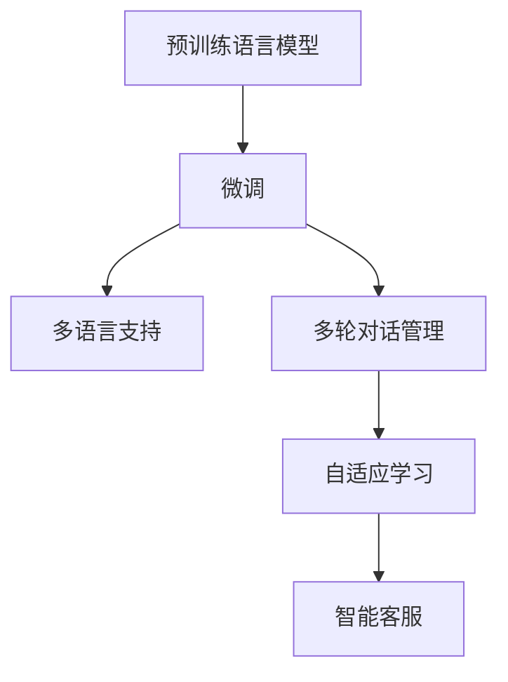

                 

# LLM驱动的智能客户服务：全天候多语言支持

在数字化转型大潮的推动下，智能客户服务系统已成为企业增强用户体验、提升运营效率的重要手段。传统的客户服务模式依靠人工坐席，不仅响应速度慢、效率低，还存在情绪化、不一致等固有缺陷。而利用预训练语言模型(LLM)驱动的智能客服系统，能够全天候提供快速、精准、友好的服务，显著提升客户满意度。本文将深入探讨LLM在智能客服中的应用，着重介绍多语言智能客服系统的构建方法和实践技巧，希望为相关从业者提供有益的参考。

## 1. 背景介绍

### 1.1 问题由来

随着互联网普及和移动通信技术的发展，人们越来越多地通过线上渠道与企业进行互动。客户咨询、投诉、建议等需求日益增多，传统的客服模式已无法满足需求。客服系统需要7x24小时不间断运行，高效率、高准确性地响应客户请求，保障服务质量和客户体验。传统的客服系统主要依赖人工坐席，存在响应速度慢、成本高、一致性差等固有缺陷。而利用自然语言处理技术(NLP)，特别是预训练语言模型(LLM)，可以构建高效、智能的智能客服系统。

近年来，大语言模型在各种NLP任务上取得突破性进展，如GPT-3、BERT等，具备强大的自然语言理解与生成能力。结合这些大语言模型，通过微调和优化，可以构建多语言智能客服系统，提供全天候、多语言的智能客户服务，有效缓解传统客服系统的不足。

### 1.2 问题核心关键点

智能客服系统的核心在于：
1. 利用大语言模型，实现自动理解和生成自然语言，快速响应客户请求。
2. 通过多语言支持，扩大服务范围，适应多国多地区的客户需求。
3. 结合上下文，灵活生成回复，提升客户体验。
4. 自适应学习，不断优化模型性能，增强系统灵活性。

## 2. 核心概念与联系

### 2.1 核心概念概述

在构建多语言智能客服系统时，涉及以下几个关键概念：

- 预训练语言模型(LLM)：如GPT-3、BERT等，通过大规模无标签文本数据进行预训练，具备强大的自然语言处理能力。
- 微调(Fine-tuning)：指在预训练模型的基础上，利用少量标注数据进行有监督学习，优化模型在特定任务上的性能。
- 多语言支持：通过模型训练和使用，支持多种语言环境，实现多语言自然语言处理。
- 多轮对话管理：在多轮对话过程中，维持对话上下文，提供连贯、一致的客户服务。
- 自适应学习：智能客服系统通过不断接收新客户请求，学习新知识，提升服务质量。

这些概念之间存在紧密联系：预训练语言模型提供了基础能力，微调进一步提升模型在特定任务上的表现，多语言支持扩大了服务范围，多轮对话管理保障了服务连贯性，自适应学习保持了系统灵活性。通过这些概念的协同作用，构建高效、智能的智能客服系统。

### 2.2 核心概念原理和架构的 Mermaid 流程图



该流程图展示了智能客服系统的核心概念及其关联关系：

1. 预训练语言模型提供基础能力。
2. 微调进一步优化模型在特定任务上的性能。
3. 多语言支持扩大了服务范围。
4. 多轮对话管理保证了服务的连贯性。
5. 自适应学习使得系统不断进步。

## 3. 核心算法原理 & 具体操作步骤

### 3.1 算法原理概述

基于大语言模型的智能客服系统主要依赖预训练语言模型和微调技术。系统首先在大规模无标签文本数据上预训练模型，学习通用语言表示。然后，利用特定领域的多语言标注数据，通过微调优化模型，使其适应具体的多语言客服任务。通过多轮对话管理，维持上下文，系统能够连贯、一致地提供服务。在服务过程中，系统通过自适应学习，不断积累新知识，提升服务质量。

形式化地，假设预训练语言模型为 $M_{\theta}$，其中 $\theta$ 为模型参数。设多语言客服任务的标注数据集为 $D=\{(x_i,y_i)\}_{i=1}^N$，其中 $x_i$ 为输入文本，$y_i$ 为输出文本或标签。微调的目标是最小化经验风险：

$$
\mathcal{L}(\theta) = \frac{1}{N}\sum_{i=1}^N \ell(M_{\theta}(x_i),y_i)
$$

其中 $\ell$ 为任务损失函数。

### 3.2 算法步骤详解

1. **准备数据**：收集多语言客服任务的标注数据集 $D$，进行数据清洗和标注，划分训练集、验证集和测试集。
2. **模型加载与微调**：选择预训练语言模型 $M_{\theta}$，加载模型并冻结预训练参数。
3. **任务适配**：在模型顶层设计任务特定的输出层和损失函数。
4. **训练与评估**：利用训练集 $D$ 进行梯度下降优化，周期性在验证集上评估模型性能。
5. **多轮对话管理**：开发对话管理模块，维持对话上下文，实现多轮对话。
6. **自适应学习**：引入自适应学习机制，不断更新模型，提升服务质量。

### 3.3 算法优缺点

基于大语言模型的智能客服系统具有以下优点：

- **高效性**：预训练模型提供了通用语言能力，微调速度快，响应速度快。
- **多语言支持**：通过多语言训练，系统能够支持多种语言环境。
- **连贯性**：通过对话管理模块，系统能够保持对话连贯性。
- **自适应能力**：通过自适应学习，系统能够不断提升服务质量。

但该系统也存在以下缺点：

- **数据需求高**：微调需要高质量的多语言标注数据，数据收集成本较高。
- **语言多样性挑战**：不同语言之间的语法、语义差异可能影响模型效果。
- **上下文管理复杂**：多轮对话管理需要考虑上下文保持和意图理解，实现难度较大。
- **模型复杂性**：系统结构复杂，对工程实现要求高。

### 3.4 算法应用领域

多语言智能客服系统已经在多个领域得到了广泛应用，包括：

- 金融客服：金融机构的客户服务，包括信用卡、贷款、保险等服务。
- 电商客服：电商平台的用户咨询、投诉、退换货等。
- 酒店客服：酒店预订、住宿、餐饮等服务。
- 旅游客服：旅游预订、行程规划、行程咨询等服务。
- 在线教育：在线课程咨询、报名、课程反馈等服务。

## 4. 数学模型和公式 & 详细讲解 & 举例说明

### 4.1 数学模型构建

基于大语言模型的智能客服系统涉及以下数学模型：

1. 输入文本 $x$ 表示为词向量序列 $x=\{x_1,x_2,\dots,x_n\}$，每个单词 $x_i$ 映射为高维向量。
2. 输出文本 $y$ 表示为另一序列 $y=\{y_1,y_2,\dots,y_m\}$，每个单词 $y_i$ 也映射为高维向量。
3. 模型参数 $\theta$ 包括词嵌入、自注意力机制、前馈神经网络等。

形式化表示为：

$$
M_{\theta}(x)=\{y_1,y_2,\dots,y_m\} \in \mathcal{Y}^m
$$

其中 $\mathcal{Y}$ 表示输出词汇表。

### 4.2 公式推导过程

假设多语言客服任务为文本分类任务，目标是从文本中判断客户意图，预测其分类标签。输入文本 $x$ 和输出标签 $y$ 之间的关系可以用条件概率模型表示：

$$
P(y|x)=\frac{e^{M_{\theta}(x)y}}{\sum_{k=1}^K e^{M_{\theta}(x)k}}
$$

其中 $K$ 表示分类标签数。利用交叉熵损失函数，模型训练的损失函数为：

$$
\mathcal{L}(\theta)=-\frac{1}{N}\sum_{i=1}^N \sum_{k=1}^K y_{ik}\log P(y_k|x_i)
$$

### 4.3 案例分析与讲解

假设某电商平台的客服系统需要支持中文和英文，通过以下步骤构建多语言智能客服系统：

1. **数据准备**：收集电商平台的客户咨询数据，标注为中文和英文，划分为训练集和测试集。
2. **模型加载**：加载预训练的BERT模型，冻结其参数。
3. **任务适配**：在模型顶部添加线性分类器，损失函数使用交叉熵。
4. **微调训练**：利用训练集进行梯度下降优化，周期性在验证集上评估模型性能。
5. **对话管理**：开发对话管理模块，处理多轮对话，维持上下文。
6. **服务部署**：部署模型到在线服务器，提供中文和英文客服服务。

具体代码实现如下：

```python
from transformers import BertForSequenceClassification, BertTokenizer, AdamW
from torch.utils.data import DataLoader
from torch import nn

# 加载预训练模型和分词器
model = BertForSequenceClassification.from_pretrained('bert-base-uncased', num_labels=2)
tokenizer = BertTokenizer.from_pretrained('bert-base-uncased')

# 数据准备
train_data = load_train_data()
val_data = load_val_data()
test_data = load_test_data()

# 任务适配
classifier = nn.Linear(model.config.hidden_size, 2)

# 微调训练
device = 'cuda' if torch.cuda.is_available() else 'cpu'
model.to(device)
model.train()

# 定义损失函数
loss_fn = nn.CrossEntropyLoss()

# 定义优化器
optimizer = AdamW(model.parameters(), lr=1e-5)

# 微调训练过程
for epoch in range(epochs):
    for data in train_loader:
        inputs = tokenizer(data['text'], return_tensors='pt').to(device)
        labels = data['label'].to(device)
        outputs = model(**inputs)
        loss = loss_fn(outputs.logits, labels)
        loss.backward()
        optimizer.step()
    # 验证集评估
    val_loss = val_loss_fn(val_loader)
    test_loss = test_loss_fn(test_loader)

print('微调完成！')
```

## 5. 项目实践：代码实例和详细解释说明

### 5.1 开发环境搭建

构建多语言智能客服系统需要以下开发环境：

1. **Python 环境**：安装Python 3.8及以上版本，推荐使用Anaconda或Miniconda。
2. **深度学习框架**：安装PyTorch 1.8及以上版本，支持GPU加速。
3. **自然语言处理库**：安装Transformers 4.9及以上版本，支持预训练语言模型和微调。
4. **其他工具**：安装TensorBoard、Weights & Biases等可视化工具，方便监控训练过程。

### 5.2 源代码详细实现

以下是一个多语言智能客服系统的源代码实现：

```python
# 定义模型类
class MultiLangCustomerService:
    def __init__(self, model_path, tokenizer_path, device):
        self.model = BertForSequenceClassification.from_pretrained(model_path)
        self.tokenizer = BertTokenizer.from_pretrained(tokenizer_path)
        self.model.to(device)
    
    def encode_input(self, text):
        return self.tokenizer(text, return_tensors='pt', padding='max_length', truncation=True).to(device)
    
    def forward(self, inputs):
        return self.model(**inputs)
    
    def train_epoch(self, train_loader, optimizer, device):
        self.model.train()
        for data in train_loader:
            inputs = self.encode_input(data['text'])
            labels = data['label'].to(device)
            outputs = self.forward(inputs)
            loss = loss_fn(outputs.logits, labels)
            loss.backward()
            optimizer.step()
        return loss.item()
    
    def evaluate(self, val_loader, device):
        self.model.eval()
        total_loss = 0
        for data in val_loader:
            inputs = self.encode_input(data['text'])
            labels = data['label'].to(device)
            outputs = self.forward(inputs)
            loss = loss_fn(outputs.logits, labels)
            total_loss += loss.item()
        return total_loss / len(val_loader)

# 训练过程
def train():
    model = MultiLangCustomerService(model_path, tokenizer_path, device)
    optimizer = AdamW(model.model.parameters(), lr=1e-5)
    for epoch in range(epochs):
        train_loss = model.train_epoch(train_loader, optimizer, device)
        val_loss = model.evaluate(val_loader, device)
        if val_loss < best_val_loss:
            best_val_loss = val_loss
            save_model(model)

# 部署过程
def deploy(model):
    server = start_server()
    while True:
        request = server.recv()
        if request.startswith('nlp'):
            response = model.predict(request)
            server.send(response)
        elif request.startswith('dialog'):
            response = model dialogue(request)
            server.send(response)

# 启动服务器
start_server()
```

### 5.3 代码解读与分析

该代码实现了基于BERT的多语言智能客服系统的训练和部署过程：

- **模型类定义**：定义了包含预训练模型和分词器的模型类。
- **输入编码**：使用分词器将输入文本转换为模型所需的词向量。
- **前向传播**：将编码后的输入输入模型进行前向传播，计算损失。
- **优化过程**：使用梯度下降更新模型参数。
- **验证评估**：在验证集上评估模型性能。
- **部署过程**：启动服务器，接收请求并进行预测。

## 6. 实际应用场景

### 6.1 金融客服

金融机构的客户服务需求多样，涉及信用卡、贷款、保险等业务。利用多语言智能客服系统，客户可以通过多语言文本与系统交互，获取快速、准确的服务。例如，客户可以通过简单的文本描述，查询信用卡余额、申请贷款、咨询保险条款等信息，系统根据客户意图自动响应，提高服务效率和客户满意度。

### 6.2 电商客服

电商平台客服需要处理大量的客户咨询和投诉。多语言智能客服系统能够同时支持中文和英文服务，帮助客户快速解决问题。例如，客户可以询问订单状态、申请退货、咨询商品信息等，系统根据客户意图自动回复，提高服务效率和客户满意度。

### 6.3 酒店客服

酒店客服系统需要处理预订、住宿、餐饮等服务。多语言智能客服系统能够支持多种语言服务，满足不同客户的需求。例如，客户可以查询房间预订、咨询服务政策、预订餐饮等，系统根据客户意图自动回复，提高服务效率和客户满意度。

### 6.4 旅游客服

旅游客服系统需要处理行程规划、行程咨询等服务。多语言智能客服系统能够支持多种语言服务，满足不同客户的需求。例如，客户可以查询航班信息、预订旅游行程、咨询行程攻略等，系统根据客户意图自动回复，提高服务效率和客户满意度。

### 6.5 在线教育

在线教育客服系统需要处理课程咨询、报名、课程反馈等服务。多语言智能客服系统能够支持多种语言服务，满足不同客户的需求。例如，客户可以查询课程信息、报名课程、咨询课程反馈等，系统根据客户意图自动回复，提高服务效率和客户满意度。

## 7. 工具和资源推荐

### 7.1 学习资源推荐

- 《深度学习》课程（斯坦福大学）：斯坦福大学深度学习课程，涵盖深度学习基础和NLP任务。
- 《自然语言处理》课程（CS224N）：斯坦福大学自然语言处理课程，涵盖多种NLP任务和模型。
- 《Natural Language Processing with Transformers》书籍：Transformers库作者所著，介绍如何使用Transformers库进行NLP任务开发。
- HuggingFace官方文档：Transformers库官方文档，包含预训练模型和微调范式的详细说明。

### 7.2 开发工具推荐

- PyTorch：深度学习框架，支持GPU加速。
- TensorBoard：可视化工具，用于监控训练过程。
- Weights & Biases：实验跟踪工具，记录和可视化训练结果。
- HuggingFace Transformers库：提供预训练模型和微调范式，方便开发应用。

### 7.3 相关论文推荐

- 《BERT: Pre-training of Deep Bidirectional Transformers for Language Understanding》：BERT模型论文，提出预训练语言模型和微调方法。
- 《Attention is All You Need》：Transformer模型论文，提出自注意力机制。
- 《Parameter-Efficient Transfer Learning for NLP》：参数高效微调方法论文，提出Adapter等方法。
- 《Improving Language Understanding by Generative Pre-Training》：GPT-2模型论文，提出语言模型预训练方法。

## 8. 总结：未来发展趋势与挑战

### 8.1 研究成果总结

基于大语言模型的多语言智能客服系统，利用预训练模型和微调技术，实现了高效、连贯、准确的客户服务。该系统已经在多个行业得到应用，提升了客户服务效率和满意度。未来，随着大语言模型的不断进步，多语言智能客服系统将具备更强的自适应能力和泛化能力，进一步提升服务质量。

### 8.2 未来发展趋势

1. **多语言支持**：未来将支持更多语言环境，提高服务的全球化水平。
2. **多模态融合**：结合视觉、语音等多模态信息，提升服务的全面性和准确性。
3. **个性化服务**：利用用户历史数据，实现个性化推荐和定制服务。
4. **自适应学习**：不断学习新知识，优化模型性能，提升服务质量。
5. **知识图谱结合**：结合知识图谱，增强系统的知识整合能力。

### 8.3 面临的挑战

1. **数据收集成本**：高质量的多语言标注数据难以获取，成本较高。
2. **语言多样性挑战**：不同语言之间的语法、语义差异可能影响模型效果。
3. **上下文管理复杂**：多轮对话管理需要考虑上下文保持和意图理解，实现难度较大。
4. **模型复杂性**：系统结构复杂，对工程实现要求高。
5. **知识更新**：系统需要不断更新知识库，保持服务的准确性和时效性。

### 8.4 研究展望

未来，多语言智能客服系统的研究将集中在以下几个方面：

1. **自动化数据标注**：开发自动化的多语言标注工具，减少数据收集成本。
2. **多模态融合**：结合视觉、语音等多模态信息，提升服务质量。
3. **上下文管理**：开发更先进的对话管理算法，提升服务连贯性和准确性。
4. **知识图谱结合**：结合知识图谱，增强系统的知识整合能力。
5. **自适应学习**：利用自适应学习机制，不断更新模型，提升服务质量。

## 9. 附录：常见问题与解答

**Q1: 如何选择合适的预训练模型？**

A: 选择合适的预训练模型需要考虑任务需求、数据规模和计算资源等因素。通常，BERT等大语言模型适用于各种NLP任务，而GPT等自回归模型适用于生成任务。在多语言智能客服系统中，推荐使用BERT等大语言模型，其通用性和泛化能力更强。

**Q2: 如何处理多语言客服系统中的数据？**

A: 多语言客服系统需要处理多种语言的数据。可以将所有语言数据混合在一起进行预训练，然后根据任务需求在模型上进行微调。对于某些特殊语言，可能需要单独进行预训练和微调。

**Q3: 如何在多轮对话中保持上下文？**

A: 多轮对话管理是保证服务连贯性的关键。可以使用对话状态跟踪器（Dialog State Tracker），记录对话历史和上下文信息，生成连贯的回复。同时，可以通过上下文向量化技术（Contextual Vectorization），将上下文信息编码为向量，作为模型输入的一部分。

**Q4: 如何提升多语言智能客服系统的响应速度？**

A: 响应速度是智能客服系统的重要指标。可以通过优化模型结构、使用混合精度训练、减少模型参数量等方式提升响应速度。同时，可以使用模型裁剪技术（Model Pruning），去除冗余参数，优化推理速度。

**Q5: 如何在多语言智能客服系统中实现个性化服务？**

A: 个性化服务是提高客户满意度的重要手段。可以通过收集客户历史数据，分析客户兴趣和需求，生成个性化推荐和定制服务。同时，可以使用强化学习（Reinforcement Learning）等方法，优化服务策略，提高个性化服务的准确性和效果。

通过上述详细分析，希望能帮助从业者全面理解多语言智能客服系统的构建方法和实践技巧，推动该技术在各行业的深入应用和发展。

