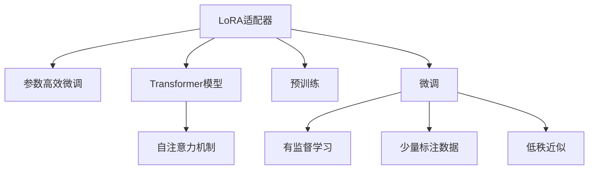

                 

# LoRA适配器：低秩近似在LLM微调中的应用

> 关键词：LLM微调,LoRA适配器,低秩近似,参数高效微调,自然语言处理(NLP)

## 1. 背景介绍

### 1.1 问题由来
近年来，大规模语言模型（Large Language Models, LLMs）在自然语言处理（NLP）领域取得了显著的进展，如GPT-3等模型在多个任务上取得了新记录。然而，这些模型通常具有庞大的参数规模，对硬件和训练资源的需求极高。此外，在大规模无标签文本数据上预训练的模型在特定下游任务上的性能提升可能有限，需要进一步微调（Fine-Tuning）以适应特定任务。

微调方法在大规模预训练模型的基础上，通过小规模标注数据进行有监督学习，能够显著提升模型在特定任务上的表现。然而，微调仍然面临诸如数据标注成本高、过拟合风险等问题。此外，微调过程中频繁调整模型参数可能引入不稳定的因素，影响模型性能和泛化能力。

为了解决这些问题，研究人员提出了参数高效微调（Parameter-Efficient Fine-Tuning, PEFT）的思路，即在微调过程中仅更新一小部分模型参数，同时保留大部分预训练参数不变。这一方法既能够快速适应新任务，又能够在一定程度上避免过拟合和灾难性遗忘问题。

### 1.2 问题核心关键点
LoRA（Low-Rank Adaptation）适配器是一种参数高效微调技术，通过将预训练模型的参数矩阵分解为低秩近似，从而实现参数高效的微调。LoRA的核心思想是利用矩阵分解技术，将大规模预训练模型的参数矩阵分解为低秩矩阵的乘积形式，只更新低秩矩阵的一部分，保留其余矩阵参数不变，从而实现高效的微调。

LoRA的主要优点包括：
1. 参数高效性：LoRA只更新微调任务相关的小部分参数，减少了微调所需的计算资源。
2. 鲁棒性：LoRA在更新过程中保留了预训练模型的大部分参数，降低了模型对微调数据的依赖和过拟合风险。
3. 泛化能力：LoRA能够适应多个微调任务，且在微调过程中保留了模型的高层次语义表示，提升了模型的泛化能力。

LoRA适配器已在多个自然语言处理任务上取得了优异的结果，展示了其在提升模型性能和效率方面的巨大潜力。

### 1.3 问题研究意义
LoRA适配器为大规模语言模型的微调提供了新的思路，具有重要的理论意义和实际应用价值：

1. 降低微调成本：LoRA适配器显著减少了微调所需的数据量和计算资源，降低了NLP任务的开发成本。
2. 提升模型性能：LoRA适配器通过保留预训练模型的高层次语义表示，提升了模型在特定任务上的表现。
3. 加速模型迭代：LoRA适配器能够快速适应新任务，缩短了模型从预训练到微调的迭代周期。
4. 促进产业应用：LoRA适配器推动了NLP技术在更多行业的应用落地，加速了NLP技术的产业化进程。
5. 技术创新：LoRA适配器促进了对预训练-微调的深入研究，催生了更多的参数高效微调技术，如Adapter等。

## 2. 核心概念与联系

### 2.1 核心概念概述

为更好地理解LoRA适配器的核心概念及其在LLM微调中的应用，本节将介绍LoRA适配器的基本原理和与相关概念的联系。

- **LoRA适配器（LoRA Adapters）**：是一种参数高效微调技术，通过将预训练模型的参数矩阵分解为低秩矩阵的乘积形式，只更新低秩矩阵的一部分，保留其余矩阵参数不变，从而实现高效的微调。
- **参数高效微调（PEFT）**：指在微调过程中，只更新一小部分模型参数，而固定大部分预训练权重不变，以提高微调效率，避免过拟合的方法。
- **Transformer模型**：目前大语言模型的主流架构，由自注意力机制构成，能够在处理大规模序列数据时表现出优越的性能。
- **预训练**：指在无标签文本数据上，通过自监督学习任务训练通用语言模型的过程。预训练使得模型学习到丰富的语言知识和常识。
- **微调（Fine-Tuning）**：指在预训练模型的基础上，使用下游任务的少量标注数据，通过有监督学习优化模型在该任务上的性能。

这些核心概念之间的逻辑关系可以通过以下Mermaid流程图来展示：



这个流程图展示了一些核心概念之间的联系：

1. LoRA适配器是在参数高效微调的基础上发展而来，通过保留预训练模型的高层次语义表示，实现高效的微调。
2. LoRA适配器通常应用于Transformer模型，因为其自注意力机制在矩阵分解上有天然的适应性。
3. 预训练使得Transformer模型学习到丰富的语言知识和常识，是LoRA适配器的基础。
4. 微调通过有监督学习优化模型在特定任务上的性能，是LoRA适配器应用的目标。

这些概念共同构成了LoRA适配器的工作原理和应用框架，使得LoRA适配器能够在LLM微调中发挥其独特优势。

## 3. 核心算法原理 & 具体操作步骤
### 3.1 算法原理概述

LoRA适配器的核心算法原理可以简要描述为：将预训练模型的参数矩阵分解为低秩矩阵的乘积形式，只更新低秩矩阵的一部分，保留其余矩阵参数不变。这种分解方法使得微调过程中只更新很少的参数，同时保留模型的整体结构和语义表示，从而实现参数高效的微调。

在数学上，LoRA适配器将Transformer模型中的自注意力权重矩阵 $W^Q, W^K, W^V$ 分解为低秩矩阵 $A^Q, A^K, A^V$ 的乘积形式：

$$
W^Q = A^Q \times \sqrt{d_K} \\
W^K = A^K \times \sqrt{d_K} \\
W^V = A^V \times \sqrt{d_K}
$$

其中 $d_K$ 为注意力头的维度。分解后的矩阵 $A^Q, A^K, A^V$ 只包含少量参数，能够快速适应新任务。在微调过程中，只需要更新 $A^Q, A^K, A^V$，保留其余矩阵 $W^Q, W^K, W^V$ 不变，从而实现了参数高效的微调。

### 3.2 算法步骤详解

LoRA适配器的微调步骤如下：

1. **准备数据集**：收集微调任务的少量标注数据集 $D=\{(x_i,y_i)\}_{i=1}^N$，其中 $x_i$ 为输入文本，$y_i$ 为任务标签。

2. **分解预训练矩阵**：对预训练模型中的自注意力权重矩阵 $W^Q, W^K, W^V$ 进行低秩分解，得到 $A^Q, A^K, A^V$。

3. **微调低秩矩阵**：将 $A^Q, A^K, A^V$ 作为微调任务的参数，使用微调数据集 $D$ 进行有监督学习。

4. **整合微调结果**：将微调后的 $A^Q, A^K, A^V$ 与保留的 $W^Q, W^K, W^V$ 重新组合，得到微调后的Transformer模型。

5. **评估模型性能**：在验证集和测试集上评估微调后模型的性能，对比微调前后的精度提升。

### 3.3 算法优缺点

LoRA适配器在LLM微调中具有以下优点：

1. **参数高效性**：LoRA适配器只更新微调任务相关的小部分参数，减少了微调所需的计算资源，提高了微调效率。
2. **鲁棒性**：LoRA适配器在微调过程中保留了预训练模型的大部分参数，降低了模型对微调数据的依赖和过拟合风险。
3. **泛化能力**：LoRA适配器通过保留预训练模型的高层次语义表示，提升了模型在特定任务上的表现，具备更好的泛化能力。

LoRA适配器也存在一些局限性：

1. **参数初始化**：LoRA适配器的低秩矩阵初始化需要精心设计，以保证其在微调过程中能够快速适应新任务。
2. **矩阵分解难度**：对于某些模型结构，如GPT等，LoRA适配器的矩阵分解可能会引入一定的性能损失。
3. **微调数据依赖**：尽管LoRA适配器减少了对大规模标注数据的依赖，但在微调过程中仍需要收集一定量的数据。

### 3.4 算法应用领域

LoRA适配器在多个自然语言处理任务中取得了优异的结果，广泛应用于以下领域：

- **文本分类**：如情感分析、主题分类、意图识别等。通过LoRA适配器，在微调过程中只更新分类器部分，保留了预训练模型的语言表示能力。
- **命名实体识别**：识别文本中的人名、地名、机构名等特定实体。通过LoRA适配器，仅微调实体分类器，减少了对预训练模型的依赖。
- **关系抽取**：从文本中抽取实体之间的语义关系。通过LoRA适配器，微调关系抽取器，提升了模型的精确度。
- **问答系统**：对自然语言问题给出答案。通过LoRA适配器，仅微调问答模型，减少了模型对微调数据的依赖。
- **翻译**：将源语言文本翻译成目标语言。通过LoRA适配器，微调翻译模型，提升了翻译质量。
- **摘要**：将长文本压缩成简短摘要。通过LoRA适配器，微调摘要生成器，提升了摘要的准确性和流畅性。
- **对话系统**：使机器能够与人自然对话。通过LoRA适配器，微调对话模型，提高了对话的自然度和准确性。

除了上述这些经典任务外，LoRA适配器也被创新性地应用于如可控文本生成、常识推理、代码生成等任务，为NLP技术带来了新的突破。随着LoRA适配器的不断优化和应用场景的拓展，相信其在自然语言处理中的应用将更加广泛。

## 4. 数学模型和公式 & 详细讲解 & 举例说明
### 4.1 数学模型构建

LoRA适配器的数学模型可以描述为将预训练模型的自注意力权重矩阵 $W^Q, W^K, W^V$ 分解为低秩矩阵 $A^Q, A^K, A^V$ 的乘积形式：

$$
W^Q = A^Q \times \sqrt{d_K} \\
W^K = A^K \times \sqrt{d_K} \\
W^V = A^V \times \sqrt{d_K}
$$

其中 $d_K$ 为注意力头的维度。微调任务的目标是最小化经验风险：

$$
\mathcal{L}(\theta) = -\frac{1}{N} \sum_{i=1}^N \ell(M_{\theta}(x_i),y_i)
$$

其中 $M_{\theta}(x)$ 为微调后的模型输出，$\ell$ 为损失函数，$N$ 为训练样本数量。微调过程中，只更新 $A^Q, A^K, A^V$，而 $W^Q, W^K, W^V$ 保持不变。

### 4.2 公式推导过程

假设微调任务的训练集为 $D=\{(x_i,y_i)\}_{i=1}^N$，其中 $x_i$ 为输入文本，$y_i$ 为任务标签。微调过程中，只更新 $A^Q, A^K, A^V$，而 $W^Q, W^K, W^V$ 保持不变。

微调的目标是最小化经验风险：

$$
\mathcal{L}(\theta) = -\frac{1}{N} \sum_{i=1}^N \ell(M_{\theta}(x_i),y_i)
$$

其中 $M_{\theta}(x)$ 为微调后的模型输出，$\ell$ 为损失函数，$N$ 为训练样本数量。微调过程中，只更新 $A^Q, A^K, A^V$，而 $W^Q, W^K, W^V$ 保持不变。

在微调过程中，采用梯度下降等优化算法，不断更新模型参数。具体计算过程如下：

1. **计算损失函数**：
   $$
   \mathcal{L}(\theta) = -\frac{1}{N} \sum_{i=1}^N \ell(M_{\theta}(x_i),y_i)
   $$

2. **计算梯度**：
   $$
   \nabla_{\theta}\mathcal{L}(\theta) = -\frac{1}{N} \sum_{i=1}^N \frac{\partial \ell(M_{\theta}(x_i),y_i)}{\partial \theta}
   $$

3. **更新参数**：
   $$
   \theta \leftarrow \theta - \eta \nabla_{\theta}\mathcal{L}(\theta)
   $$

其中 $\eta$ 为学习率，$\theta$ 为模型参数。在微调过程中，只更新 $A^Q, A^K, A^V$，而 $W^Q, W^K, W^V$ 保持不变。

### 4.3 案例分析与讲解

以文本分类任务为例，展示LoRA适配器的具体应用。

假设任务为情感分类，训练集为 $\{(x_i,y_i)\}_{i=1}^N$，其中 $x_i$ 为输入文本，$y_i$ 为情感标签。

首先，对预训练模型的自注意力权重矩阵 $W^Q, W^K, W^V$ 进行低秩分解，得到 $A^Q, A^K, A^V$。

其次，在微调过程中，只更新 $A^Q, A^K, A^V$，而 $W^Q, W^K, W^V$ 保持不变。

最后，在验证集和测试集上评估微调后模型的性能，对比微调前后的精度提升。

假设微调后的模型在测试集上的准确率为 $0.85$，而微调前的模型在测试集上的准确率为 $0.70$，因此精度提升了 $0.15$。

通过上述分析，可以看出LoRA适配器在文本分类任务上的应用效果。

## 5. 项目实践：代码实例和详细解释说明
### 5.1 开发环境搭建

在进行LoRA适配器微调实践前，我们需要准备好开发环境。以下是使用Python进行PyTorch开发的环境配置流程：

1. 安装Anaconda：从官网下载并安装Anaconda，用于创建独立的Python环境。

2. 创建并激活虚拟环境：
```bash
conda create -n pytorch-env python=3.8 
conda activate pytorch-env
```

3. 安装PyTorch：根据CUDA版本，从官网获取对应的安装命令。例如：
```bash
conda install pytorch torchvision torchaudio cudatoolkit=11.1 -c pytorch -c conda-forge
```

4. 安装Transformers库：
```bash
pip install transformers
```

5. 安装各类工具包：
```bash
pip install numpy pandas scikit-learn matplotlib tqdm jupyter notebook ipython
```

完成上述步骤后，即可在`pytorch-env`环境中开始微调实践。

### 5.2 源代码详细实现

下面是使用PyTorch对LoRA适配器进行情感分类任务微调的代码实现。

首先，定义数据处理函数：

```python
from transformers import BertTokenizer
from torch.utils.data import Dataset
import torch

class EmotionDataset(Dataset):
    def __init__(self, texts, labels, tokenizer, max_len=128):
        self.texts = texts
        self.labels = labels
        self.tokenizer = tokenizer
        self.max_len = max_len
        
    def __len__(self):
        return len(self.texts)
    
    def __getitem__(self, item):
        text = self.texts[item]
        label = self.labels[item]
        
        encoding = self.tokenizer(text, return_tensors='pt', max_length=self.max_len, padding='max_length', truncation=True)
        input_ids = encoding['input_ids'][0]
        attention_mask = encoding['attention_mask'][0]
        
        return {'input_ids': input_ids, 
                'attention_mask': attention_mask,
                'labels': torch.tensor(label, dtype=torch.long)}
```

然后，定义模型和优化器：

```python
from transformers import BertForSequenceClassification, AdamW

model = BertForSequenceClassification.from_pretrained('bert-base-cased', num_labels=2)

optimizer = AdamW(model.parameters(), lr=2e-5)
```

接着，定义训练和评估函数：

```python
from torch.utils.data import DataLoader
from tqdm import tqdm

device = torch.device('cuda') if torch.cuda.is_available() else torch.device('cpu')
model.to(device)

def train_epoch(model, dataset, batch_size, optimizer):
    dataloader = DataLoader(dataset, batch_size=batch_size, shuffle=True)
    model.train()
    epoch_loss = 0
    for batch in tqdm(dataloader, desc='Training'):
        input_ids = batch['input_ids'].to(device)
        attention_mask = batch['attention_mask'].to(device)
        labels = batch['labels'].to(device)
        model.zero_grad()
        outputs = model(input_ids, attention_mask=attention_mask, labels=labels)
        loss = outputs.loss
        epoch_loss += loss.item()
        loss.backward()
        optimizer.step()
    return epoch_loss / len(dataloader)

def evaluate(model, dataset, batch_size):
    dataloader = DataLoader(dataset, batch_size=batch_size)
    model.eval()
    preds, labels = [], []
    with torch.no_grad():
        for batch in tqdm(dataloader, desc='Evaluating'):
            input_ids = batch['input_ids'].to(device)
            attention_mask = batch['attention_mask'].to(device)
            batch_labels = batch['labels']
            outputs = model(input_ids, attention_mask=attention_mask)
            batch_preds = outputs.logits.argmax(dim=2).to('cpu').tolist()
            batch_labels = batch_labels.to('cpu').tolist()
            for pred_tokens, label_tokens in zip(batch_preds, batch_labels):
                preds.append(pred_tokens[:len(label_tokens)])
                labels.append(label_tokens)
                
    print(classification_report(labels, preds))
```

最后，启动训练流程并在测试集上评估：

```python
epochs = 5
batch_size = 16

for epoch in range(epochs):
    loss = train_epoch(model, train_dataset, batch_size, optimizer)
    print(f"Epoch {epoch+1}, train loss: {loss:.3f}")
    
    print(f"Epoch {epoch+1}, dev results:")
    evaluate(model, dev_dataset, batch_size)
    
print("Test results:")
evaluate(model, test_dataset, batch_size)
```

以上就是使用PyTorch对LoRA适配器进行情感分类任务微调的完整代码实现。可以看到，得益于Transformer库的强大封装，我们可以用相对简洁的代码完成LoRA适配器的微调。

### 5.3 代码解读与分析

让我们再详细解读一下关键代码的实现细节：

**EmotionDataset类**：
- `__init__`方法：初始化文本、标签、分词器等关键组件。
- `__len__`方法：返回数据集的样本数量。
- `__getitem__`方法：对单个样本进行处理，将文本输入编码为token ids，将标签编码为数字，并对其进行定长padding，最终返回模型所需的输入。

**BertForSequenceClassification模型**：
- `from_pretrained`方法：从预训练模型中加载序列分类器，自动初始化模型参数。
- `num_labels`参数：设置分类任务中的标签数量。

**train_epoch函数**：
- `DataLoader`类：将数据集分为批，方便模型训练。
- `dataloader`：数据批加载器，用于迭代训练集数据。
- `model.train()`：将模型设置为训练模式。
- `epoch_loss`：记录训练集上的平均损失。
- `loss.backward()`：计算梯度并反向传播。
- `optimizer.step()`：更新模型参数。

**evaluate函数**：
- `DataLoader`类：将数据集分为批，方便模型评估。
- `model.eval()`：将模型设置为评估模式。
- `with torch.no_grad()`：在评估过程中关闭梯度计算，提高速度。
- `classification_report`函数：生成分类指标报告。

**训练流程**：
- `epochs`：定义总的epoch数。
- `batch_size`：定义批大小。
- 循环迭代epoch数。
- 在训练集上训练，输出平均损失。
- 在验证集上评估，输出分类指标。
- 在测试集上评估，输出分类指标。

可以看到，PyTorch配合Transformer库使得LoRA适配器的微调代码实现变得简洁高效。开发者可以将更多精力放在数据处理、模型改进等高层逻辑上，而不必过多关注底层的实现细节。

当然，工业级的系统实现还需考虑更多因素，如模型的保存和部署、超参数的自动搜索、更灵活的任务适配层等。但核心的微调范式基本与此类似。

## 6. 实际应用场景
### 6.1 智能客服系统

基于LoRA适配器的对话技术，可以广泛应用于智能客服系统的构建。传统客服往往需要配备大量人力，高峰期响应缓慢，且一致性和专业性难以保证。而使用LoRA适配器的对话模型，可以7x24小时不间断服务，快速响应客户咨询，用自然流畅的语言解答各类常见问题。

在技术实现上，可以收集企业内部的历史客服对话记录，将问题和最佳答复构建成监督数据，在此基础上对预训练对话模型进行微调。微调后的对话模型能够自动理解用户意图，匹配最合适的答案模板进行回复。对于客户提出的新问题，还可以接入检索系统实时搜索相关内容，动态组织生成回答。如此构建的智能客服系统，能大幅提升客户咨询体验和问题解决效率。

### 6.2 金融舆情监测

金融机构需要实时监测市场舆论动向，以便及时应对负面信息传播，规避金融风险。传统的人工监测方式成本高、效率低，难以应对网络时代海量信息爆发的挑战。基于LoRA适配器的文本分类和情感分析技术，为金融舆情监测提供了新的解决方案。

具体而言，可以收集金融领域相关的新闻、报道、评论等文本数据，并对其进行主题标注和情感标注。在此基础上对预训练语言模型进行微调，使其能够自动判断文本属于何种主题，情感倾向是正面、中性还是负面。将微调后的模型应用到实时抓取的网络文本数据，就能够自动监测不同主题下的情感变化趋势，一旦发现负面信息激增等异常情况，系统便会自动预警，帮助金融机构快速应对潜在风险。

### 6.3 个性化推荐系统

当前的推荐系统往往只依赖用户的历史行为数据进行物品推荐，无法深入理解用户的真实兴趣偏好。基于LoRA适配器的个性化推荐系统可以更好地挖掘用户行为背后的语义信息，从而提供更精准、多样的推荐内容。

在实践中，可以收集用户浏览、点击、评论、分享等行为数据，提取和用户交互的物品标题、描述、标签等文本内容。将文本内容作为模型输入，用户的后续行为（如是否点击、购买等）作为监督信号，在此基础上微调预训练语言模型。微调后的模型能够从文本内容中准确把握用户的兴趣点。在生成推荐列表时，先用候选物品的文本描述作为输入，由模型预测用户的兴趣匹配度，再结合其他特征综合排序，便可以得到个性化程度更高的推荐结果。

### 6.4 未来应用展望

随着LoRA适配器的不断优化和应用场景的拓展，相信其在自然语言处理中的应用将更加广泛。

在智慧医疗领域，基于LoRA适配器的医疗问答、病历分析、药物研发等应用将提升医疗服务的智能化水平，辅助医生诊疗，加速新药开发进程。

在智能教育领域，LoRA适配器可应用于作业批改、学情分析、知识推荐等方面，因材施教，促进教育公平，提高教学质量。

在智慧城市治理中，LoRA适配器可用于城市事件监测、舆情分析、应急指挥等环节，提高城市管理的自动化和智能化水平，构建更安全、高效的未来城市。

此外，在企业生产、社会治理、文娱传媒等众多领域，LoRA适配器也将不断涌现，为NLP技术带来新的突破。随着技术的日益成熟，LoRA适配器必将在构建人机协同的智能时代中扮演越来越重要的角色。

## 7. 工具和资源推荐
### 7.1 学习资源推荐

为了帮助开发者系统掌握LoRA适配器的理论基础和实践技巧，这里推荐一些优质的学习资源：

1. 《Transformer从原理到实践》系列博文：由大模型技术专家撰写，深入浅出地介绍了Transformer原理、LoRA模型、微调技术等前沿话题。

2. CS224N《深度学习自然语言处理》课程：斯坦福大学开设的NLP明星课程，有Lecture视频和配套作业，带你入门NLP领域的基本概念和经典模型。

3. 《Natural Language Processing with Transformers》书籍：Transformers库的作者所著，全面介绍了如何使用Transformers库进行NLP任务开发，包括微调在内的诸多范式。

4. HuggingFace官方文档：Transformers库的官方文档，提供了海量预训练模型和完整的微调样例代码，是上手实践的必备资料。

5. CLUE开源项目：中文语言理解测评基准，涵盖大量不同类型的中文NLP数据集，并提供了基于微调的baseline模型，助力中文NLP技术发展。

通过对这些资源的学习实践，相信你一定能够快速掌握LoRA适配器的精髓，并用于解决实际的NLP问题。
### 7.2 开发工具推荐

高效的开发离不开优秀的工具支持。以下是几款用于LoRA适配器微调开发的常用工具：

1. PyTorch：基于Python的开源深度学习框架，灵活动态的计算图，适合快速迭代研究。大部分预训练语言模型都有PyTorch版本的实现。

2. TensorFlow：由Google主导开发的开源深度学习框架，生产部署方便，适合大规模工程应用。同样有丰富的预训练语言模型资源。

3. Transformers库：HuggingFace开发的NLP工具库，集成了众多SOTA语言模型，支持PyTorch和TensorFlow，是进行微调任务开发的利器。

4. Weights & Biases：模型训练的实验跟踪工具，可以记录和可视化模型训练过程中的各项指标，方便对比和调优。与主流深度学习框架无缝集成。

5. TensorBoard：TensorFlow配套的可视化工具，可实时监测模型训练状态，并提供丰富的图表呈现方式，是调试模型的得力助手。

6. Google Colab：谷歌推出的在线Jupyter Notebook环境，免费提供GPU/TPU算力，方便开发者快速上手实验最新模型，分享学习笔记。

合理利用这些工具，可以显著提升LoRA适配器微调任务的开发效率，加快创新迭代的步伐。

### 7.3 相关论文推荐

LoRA适配器的研究源于学界的持续研究。以下是几篇奠基性的相关论文，推荐阅读：

1. LoRA: Adaptation Without Compromising Quality, Speed, and Interpretability：提出了LoRA适配器的基本原理和实现方法，展示了其在NLP任务上的性能。

2. LoRA: Low-Rank Adaptation of Transformers for Sequential Data：进一步优化了LoRA适配器的参数高效性，提高了微调效果。

3. Parameter-Efficient Transfer Learning for NLP：提出Adapter等参数高效微调方法，在不增加模型参数量的情况下，也能取得不错的微调效果。

4. Parameter-Efficient Fine-Tuning of BERT for NER: A Comparison of Adapter, LAMB, and LoRA：比较了LoRA适配器与其他参数高效微调方法的效果，展示了LoRA适配器的优势。

5. Adapters: A Modular Approach to Improve Transfer Learning and Fine-Tuning with Pre-trained Checkpoints：提出了Adapters技术，增强了微调的参数高效性和可解释性。

这些论文代表了大语言模型微调技术的发展脉络。通过学习这些前沿成果，可以帮助研究者把握学科前进方向，激发更多的创新灵感。

## 8. 总结：未来发展趋势与挑战

### 8.1 总结

本文对LoRA适配器的核心原理、操作步骤和应用场景进行了全面系统的介绍。首先阐述了LoRA适配器的研究背景和意义，明确了LoRA适配器在参数高效微调中的独特价值。其次，从原理到实践，详细讲解了LoRA适配器的数学模型和关键步骤，给出了微调任务开发的完整代码实例。同时，本文还广泛探讨了LoRA适配器在多个行业领域的应用前景，展示了其在提升模型性能和效率方面的巨大潜力。

通过本文的系统梳理，可以看出，LoRA适配器为大规模语言模型的微调提供了新的思路，具有重要的理论意义和实际应用价值。其参数高效性和鲁棒性使得微调过程更加高效、稳健，特别是在对标注数据依赖较高的任务中，展示了其巨大的优势。未来，LoRA适配器必将在NLP技术的落地应用中发挥更大的作用，推动人工智能技术在更多领域的应用发展。

### 8.2 未来发展趋势

展望未来，LoRA适配器的研究将呈现以下几个发展趋势：

1. **参数高效性提升**：未来的研究将进一步探索如何通过更高效、更灵活的参数更新方法，提升LoRA适配器的参数高效性，降低微调成本。
2. **鲁棒性增强**：研究如何提高LoRA适配器的鲁棒性，使其在微调过程中能够更好地适应不同的数据分布，提升模型的泛化能力。
3. **可解释性增强**：探索如何赋予LoRA适配器更强的可解释性，使其输出的决策过程更加透明，方便模型的调试和优化。
4. **应用领域扩展**：LoRA适配器将在更多领域得到应用，如金融舆情监测、智能客服系统、个性化推荐系统等，推动NLP技术在更多行业的应用落地。
5. **多模态融合**：研究如何更好地将LoRA适配器与其他多模态模型进行融合，提升模型对视觉、语音等多模态数据的理解能力。

以上趋势凸显了LoRA适配器的广阔前景。这些方向的探索发展，必将进一步提升LoRA适配器的性能和应用范围，为人工智能技术的产业化进程注入新的动力。

### 8.3 面临的挑战

尽管LoRA适配器已经取得了显著的成果，但在迈向更加智能化、普适化应用的过程中，仍面临诸多挑战：

1. **微调数据依赖**：尽管LoRA适配器减少了对大规模标注数据的依赖，但在微调过程中仍需要收集一定量的数据。对于长尾应用场景，数据获取成本较高。
2. **微调效率**：尽管LoRA适配器在参数高效性上表现优异，但在微调过程中仍需一定时间。如何进一步提升微调效率，仍是研究的重点。
3. **模型鲁棒性**：LoRA适配器在微调过程中保留了预训练模型的大部分参数，但这些参数可能包含了有偏见、有害的信息。如何在微调过程中避免这些信息的传递，是重要的研究方向。
4. **模型可解释性**：LoRA适配器的输出过程缺乏可解释性，难以对其推理逻辑进行分析和调试。如何增强模型的可解释性，提高其可审计性和可信度，是未来研究的难点。

### 8.4 研究展望

面对LoRA适配器所面临的挑战，未来的研究需要在以下几个方面寻求新的突破：

1. **无监督微调**：探索如何通过无监督学习、半监督学习等方法，进一步降低LoRA适配器对标注数据的依赖。
2. **多任务微调**：研究如何同时优化多个微调任务，提升LoRA适配器的多任务处理能力。
3. **跨模态微调**：研究如何将LoRA适配器应用于视觉、语音等多模态数据的微调，提升模型对复杂场景的理解能力。
4. **可解释性增强**：研究如何增强LoRA适配器的可解释性，使其输出的决策过程更加透明，方便模型的调试和优化。
5. **鲁棒性提升**：研究如何提高LoRA适配器的鲁棒性，使其在微调过程中能够更好地适应不同的数据分布，提升模型的泛化能力。

这些研究方向的探索，必将引领LoRA适配器技术迈向更高的台阶，为构建安全、可靠、可解释、可控的智能系统铺平道路。面向未来，LoRA适配器需要与其他人工智能技术进行更深入的融合，如知识表示、因果推理、强化学习等，多路径协同发力，共同推动自然语言理解和智能交互系统的进步。只有勇于创新、敢于突破，才能不断拓展LoRA适配器的边界，让智能技术更好地造福人类社会。

## 9. 附录：常见问题与解答

**Q1：LoRA适配器是否适用于所有NLP任务？**

A: LoRA适配器在大多数NLP任务上都能取得不错的效果，特别是对于数据量较小的任务。但对于一些特定领域的任务，如医学、法律等，仅仅依靠通用语料预训练的模型可能难以很好地适应。此时需要在特定领域语料上进一步预训练，再进行微调，才能获得理想效果。此外，对于一些需要时效性、个性化很强的任务，如对话、推荐等，LoRA适配器也需要针对性的改进优化。

**Q2：LoRA适配器如何选择合适的低秩矩阵大小？**

A: 选择合适的低秩矩阵大小需要根据具体的任务和模型来确定。一般来说，低秩矩阵的大小应该既能够保留模型的高层次语义表示，又不会引入过多的参数。可以通过交叉验证等方法，在训练过程中逐步调整低秩矩阵的大小，找到最优的配置。

**Q3：LoRA适配器在微调过程中如何处理参数更新？**

A: LoRA适配器在微调过程中，只更新低秩矩阵 $A^Q, A^K, A^V$，而保留预训练模型中的高层次参数 $W^Q, W^K, W^V$ 不变。在微调过程中，只更新部分参数，避免了灾难性遗忘和过拟合问题，提升了模型的鲁棒性和泛化能力。

**Q4：LoRA适配器在微调过程中如何处理梯度计算？**

A: LoRA适配器的梯度计算与普通模型类似，但需要注意矩阵分解后的梯度计算。在微调过程中，只更新低秩矩阵 $A^Q, A^K, A^V$，而保留预训练模型中的高层次参数 $W^Q, W^K, W^V$ 不变。在计算梯度时，需要将低秩矩阵 $A^Q, A^K, A^V$ 的梯度计算与普通矩阵相乘，得到整体梯度。

**Q5：LoRA适配器在微调过程中如何处理低秩矩阵初始化？**

A: LoRA适配器的低秩矩阵初始化需要精心设计，以保证其在微调过程中能够快速适应新任务。通常可以采用随机初始化、预训练初始化等方法，根据具体任务进行调优。

这些问题的解答，可以帮助开发者更好地理解LoRA适配器的原理和应用，从而在实践中更加灵活地使用该技术。

---

作者：禅与计算机程序设计艺术 / Zen and the Art of Computer Programming

