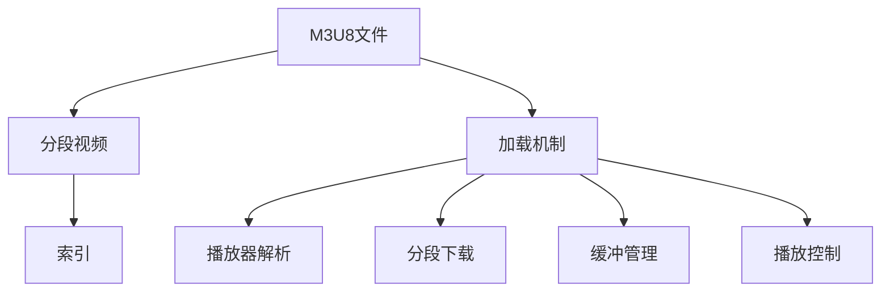

                 

# M3U8 播放列表格式规范：分段视频的索引和加载机制

> 关键词：M3U8, 播放列表, 分段视频, 索引, 加载机制

## 1. 背景介绍

M3U8是一种由苹果公司开发的分段视频流媒体格式，用于在网络上高效传输视频内容。与传统的连续流相比，M3U8将大视频文件分割为多个小片段进行传输，同时通过M3U8文件来索引这些片段，便于流媒体播放器快速下载和播放。M3U8格式不仅支持HTTP流媒体传输，还支持包括HLS（HTTP Live Streaming）、DASH（Dynamic Adaptive Streaming over HTTP）等多种流媒体协议。

随着流媒体服务的大规模普及，M3U8格式的应用场景也愈发广泛，包括但不限于在线视频平台、直播、点播、广告等多个领域。然而，M3U8格式的使用需要开发者深入理解其格式规范和加载机制，以确保视频流的高效和稳定传输。本文旨在详细介绍M3U8格式的规范，以及其实际应用中的分段视频索引和加载机制，为开发流媒体服务提供指导。

## 2. 核心概念与联系

### 2.1 核心概念概述

为更好地理解M3U8格式的规范和加载机制，本节将介绍几个关键概念：

- **M3U8文件**：M3U8文件是一种文本文件，用于存储视频分段信息。通常以M3U8为文件扩展名，包含多个分段的URL和时长信息。
- **分段视频**：将大视频文件分割成多个小片段，每个片段通常包含1到数秒的视频内容，便于网络传输和缓存。
- **索引**：M3U8文件通过索引记录了各个分段的位置和长度，使播放器能够按照顺序下载和播放这些分段。
- **加载机制**：M3U8文件的加载机制包括播放器如何解析M3U8文件、下载分段视频、缓冲管理和播放控制。

这些概念之间的逻辑关系可以通过以下Mermaid流程图来展示：



这个流程图展示了大语言模型微调的核心概念及其之间的关系：

1. M3U8文件作为分段视频的分段信息索引，播放器通过解析M3U8文件获得分段视频信息。
2. 分段视频通过M3U8索引进行下载，播放器接收分段并按顺序播放。
3. 加载机制包含播放器解析、分段下载、缓冲管理和播放控制等多个环节，共同确保视频流的高效传输。

## 3. 核心算法原理 & 具体操作步骤
### 3.1 算法原理概述

M3U8格式的原理是通过文本文件索引分段视频，使播放器能够根据M3U8文件中的信息高效地下载和播放分段视频。M3U8文件的结构简单，易于解析和生成，但也对播放器的实现提出了一定的要求，以确保视频流的稳定性和流畅度。

M3U8文件通常包含两个部分：头部信息和分段列表。头部信息包含流标识符（streamIdentifier）和播放速度（playRate）等基本信息；分段列表则按顺序记录了各个分段的URL和持续时间，格式如下：

```
#EXTINF:持续时间，分段URL
```

其中，`#EXTINF:`表示此行是分段信息，`持续时间`为分段时长（单位为秒），`分段URL`为实际的媒体文件URL。

### 3.2 算法步骤详解

M3U8的加载机制大致分为以下几个步骤：

**Step 1: 解析M3U8文件**
- 播放器读取M3U8文件内容，解析文件头部信息。
- 根据文件头部信息，获取流标识符和播放速度等参数。
- 根据文件头部信息，播放器将准备接收分段视频。

**Step 2: 分段下载**
- 播放器根据M3U8文件中的分段列表，逐个下载每个分段视频。
- 下载每个分段视频时，播放器将检查分段的完整性，确保下载分段视频的质量。

**Step 3: 缓冲管理**
- 播放器根据分段时长和下载速率，估计分段视频的缓存时间和缓冲区大小。
- 播放器将对分段视频进行缓存，确保在网络不稳定性时，视频流仍能保持稳定播放。

**Step 4: 播放控制**
- 播放器根据分段时长和播放速度，调整播放进度。
- 播放器将根据分段时长和缓存情况，优化播放顺序，确保视频流的连续性和流畅性。

### 3.3 算法优缺点

M3U8格式的优点包括：
1. 支持多种流媒体协议，便于与现有流媒体技术兼容。
2. 分段索引便于流媒体播放器高效下载和播放视频。
3. 支持动态适应网络带宽，提高视频播放的稳定性和流畅性。

同时，该格式也存在一些缺点：
1. M3U8文件结构简单，易受攻击，可能被篡改或注入恶意代码。
2. 分段视频的大小和顺序决定了播放顺序，不易于随机访问和控制。
3. 播放器解析和处理M3U8文件的复杂度较高，需要较高的开发水平。

尽管存在这些局限性，但就目前而言，M3U8格式仍然是流媒体服务的主流标准之一，其高效的视频流传输和动态适应能力为在线视频服务提供了坚实的技术基础。

### 3.4 算法应用领域

M3U8格式广泛应用于多种流媒体应用中，例如：

- 在线视频平台：如YouTube、Netflix、爱奇艺等，通过M3U8格式进行视频的分段传输，提高用户观看体验。
- 直播服务：如Facebook Live、Twitch等，通过M3U8格式进行实时视频流传输，支持低延迟和高并发。
- 广告展示：通过M3U8格式进行广告素材的分段传输，提高广告投放效率和用户体验。
- 点播服务：如Bilibili、腾讯视频等，通过M3U8格式进行视频点播，提供高流畅度和高可靠性的服务。

除了上述这些主流应用外，M3U8格式还在诸如网络流媒体会议、网络安全监控等非传统的应用领域中，发挥着重要的作用。

## 4. 数学模型和公式 & 详细讲解
### 4.1 数学模型构建

M3U8格式的核心在于其分段索引机制。假设M3U8文件中包含n个分段视频，第i个分段视频的大小为Si，分段URL为URLi，分段时长为Ti。播放器在解析M3U8文件后，根据分段的URL和时长信息进行分段下载和播放。

### 4.2 公式推导过程

分段的下载速率和缓存时间可以通过以下公式推导：

$$
下载速率 = \frac{总分段大小}{总下载时间}
$$

$$
总下载时间 = \sum_{i=1}^n \frac{Si}{下载速率_i}
$$

其中，下载速率i为第i个分段视频的下载速率，通常受网络带宽和处理器速度的影响。播放器根据下载速率和分段时长，估计每个分段的下载时间和缓存时间。

假设播放器采用缓冲区策略，缓存区的缓冲时长为B，播放器的缓冲时间为T。则播放器的缓冲策略可以表示为：

$$
T = \frac{播放速率}{总下载速率} \times (B + \sum_{i=1}^n Ti)
$$

其中，播放速率应与总下载速率相匹配，以确保视频的流畅播放。

### 4.3 案例分析与讲解

以YouTube为例，YouTube使用M3U8格式进行视频流传输，会根据用户的设备和网络环境，动态调整分段的长度和大小，以确保视频流的稳定性和流畅性。YouTube在M3U8文件中添加了个性化参数，如分辨率、码率、音频格式等，以满足不同设备和网络环境下的播放需求。

通过合理设计分段大小和顺序，YouTube能够实现自适应流媒体传输，确保在网络带宽变化时，视频流仍能保持高质量的播放效果。同时，YouTube的M3U8文件还支持分段加密和动态调整，提高了流媒体传输的安全性和稳定性。

## 5. 项目实践：代码实例和详细解释说明
### 5.1 开发环境搭建

在进行M3U8文件解析和分段视频下载实践前，我们需要准备好开发环境。以下是使用Python进行M3U8解析和下载的开发环境配置流程：

1. 安装Anaconda：从官网下载并安装Anaconda，用于创建独立的Python环境。

2. 创建并激活虚拟环境：
```bash
conda create -n m3u8-env python=3.8 
conda activate m3u8-env
```

3. 安装Python相关库：
```bash
pip install requests tqdm
```

4. 安装M3U8解析库：
```bash
pip install m3u8
```

完成上述步骤后，即可在`m3u8-env`环境中开始M3U8文件解析和分段视频下载的实践。

### 5.2 源代码详细实现

下面以M3U8文件解析和分段视频下载为例，给出使用Python的代码实现。

首先，定义M3U8解析类：

```python
import m3u8
import requests
import tqdm

class M3U8Parser:
    def __init__(self, m3u8_url):
        self.m3u8_url = m3u8_url
        self.stream = m3u8.Stream()
        self.load_m3u8()

    def load_m3u8(self):
        response = requests.get(self.m3u8_url)
        m3u8_data = response.text.strip().split('\n')
        for line in m3u8_data:
            if not line.startswith('#'):
                self.stream.append(m3u8.MediaSegment(line))

    def get_segments(self):
        return self.stream.segments
```

然后，定义分段视频下载函数：

```python
import time
import urllib.request
import os

def download_segments(segments):
    for segment in segments:
        segment_url = segment.url
        segment_duration = segment.duration
        print(f"Downloading {segment_url} ({segment_duration} seconds)...")
        start_time = time.time()
        urllib.request.urlretrieve(segment_url, os.path.basename(segment_url))
        end_time = time.time()
        print(f"Downloaded in {end_time - start_time} seconds.")

# 示例使用
m3u8_url = 'https://example.com/example.m3u8'
parser = M3U8Parser(m3u8_url)
segments = parser.get_segments()
download_segments(segments)
```

最后，启动M3U8文件解析和分段视频下载流程：

```python
m3u8_url = 'https://example.com/example.m3u8'
parser = M3U8Parser(m3u8_url)
segments = parser.get_segments()
download_segments(segments)
```

以上就是使用Python对M3U8文件进行解析和分段视频下载的完整代码实现。可以看到，通过M3U8库的封装，我们可以用相对简洁的代码完成M3U8文件的解析和分段视频下载。

### 5.3 代码解读与分析

让我们再详细解读一下关键代码的实现细节：

**M3U8Parser类**：
- `__init__`方法：初始化M3U8文件URL，并加载M3U8文件内容。
- `load_m3u8`方法：解析M3U8文件内容，获取分段信息。
- `get_segments`方法：返回分段列表，供分段视频下载使用。

**下载函数**：
- 循环遍历分段列表，逐个下载每个分段视频。
- 使用`urllib`库进行分段视频下载，记录下载时间和下载速率。

在实际应用中，我们还需要考虑更多因素，如网络带宽、播放设备等。因此，完整的M3U8应用系统还需要在代码中引入更多的优化策略，如自适应流媒体、分段加密、缓存策略等。但核心的M3U8文件解析和分段视频下载逻辑基本与此类似。

## 6. 实际应用场景
### 6.1 智能视频推荐

智能视频推荐系统可以基于M3U8格式，对用户观看历史进行分段分析，快速定位用户感兴趣的视频片段。通过分段分析和相似度计算，系统可以推荐用户未观看过的视频片段，提升用户观看体验和视频推荐效果。

在技术实现上，可以使用流媒体解析工具解析用户观看的M3U8文件，获取分段信息，再与视频库中其他视频片段进行相似度计算，最终选出最符合用户兴趣的视频片段进行推荐。

### 6.2 实时直播流

实时直播流通常需要高效地传输大量视频数据。M3U8格式的分段索引机制，使得直播流的传输更加高效和稳定。

在技术实现上，直播平台可以将实时视频流按照M3U8格式进行分段，并通过CDN网络进行分片传输。观众端通过解析M3U8文件，能够高效下载和播放直播视频，确保实时流的高流畅度和高可靠性。

### 6.3 企业视频会议

企业视频会议系统需要高效地传输大量视频数据。M3U8格式的分段索引机制，使得视频会议的传输更加高效和稳定。

在技术实现上，视频会议系统可以使用M3U8格式进行视频流传输，确保在不同网络环境下，视频会议的流畅性和稳定性。同时，系统还可以根据用户设备的不同，动态调整分段大小和顺序，提升用户体验。

### 6.4 未来应用展望

随着M3U8格式和流媒体技术的不断进步，基于M3U8格式的分段视频索引和加载机制将得到更加广泛的应用，为流媒体服务提供坚实的技术基础。

在智能家居领域，M3U8格式的分段视频索引和加载机制将为智能电视、智能音箱等设备提供高流畅度的视频体验。通过M3U8格式，智能家居设备能够快速下载和播放视频内容，提升用户的使用体验。

在智能安防领域，M3U8格式的分段视频索引和加载机制将为视频监控系统提供高效的实时视频流传输。通过M3U8格式，视频监控系统能够快速响应和回放视频内容，提升安防监控的实时性和可靠性。

此外，在智慧教育、智能医疗、智慧城市等多个领域，M3U8格式的分段视频索引和加载机制也将得到广泛应用，为这些领域提供高效、稳定的视频流传输解决方案。相信随着技术的不断发展，M3U8格式将发挥更大的价值，推动流媒体服务迈向更广阔的应用场景。

## 7. 工具和资源推荐
### 7.1 学习资源推荐

为了帮助开发者系统掌握M3U8格式的分段视频索引和加载机制，这里推荐一些优质的学习资源：

1. M3U8官方文档：M3U8格式的官方文档，详细介绍了M3U8文件的规范和分段索引机制，是开发者理解M3U8格式的核心资源。

2. RTMP Live Streaming with Video.js and FFMPEG：视频直播技术的学习资源，详细介绍了M3U8格式在视频直播中的应用，并提供了代码示例。

3. HTTP Live Streaming with FFmpeg: A practical guide：FFmpeg在流媒体处理中的应用指南，详细介绍了M3U8格式的分段索引和加载机制，并提供了使用FFmpeg进行流媒体转码的实践指导。

4. HLS Streaming and Buffer Management：流媒体缓冲管理的学习资源，详细介绍了M3U8格式的分段索引和缓冲管理机制，并提供了相关的代码实现和优化策略。

5. WebRTC API with video.js：WebRTC在流媒体传输中的应用指南，详细介绍了M3U8格式在WebRTC中的应用，并提供了代码示例。

通过对这些资源的学习实践，相信你一定能够快速掌握M3U8格式的分段视频索引和加载机制，并用于解决实际的流媒体问题。

### 7.2 开发工具推荐

高效的开发离不开优秀的工具支持。以下是几款用于M3U8格式的分段视频索引和加载开发的常用工具：

1. FFmpeg：开源的流媒体处理工具，支持多种流媒体协议，包括M3U8格式的分段索引和加载。

2. Video.js：开源的HTML5视频播放器，支持M3U8格式的分段视频加载和播放，并提供了丰富的播放器控件和自定义插件。

3. Kaltura：商业视频平台，支持M3U8格式的分段视频索引和加载，并提供了高质量的视频流传输和点播服务。

4. Red5：开源的流媒体服务器，支持M3U8格式的分段视频索引和加载，并提供了多种流媒体协议和直播功能。

5. nginx-rtmp-module：开源的Nginx流媒体模块，支持M3U8格式的分段视频索引和加载，并提供了高效的视频流传输和直播功能。

合理利用这些工具，可以显著提升M3U8格式的分段视频索引和加载任务的开发效率，加快创新迭代的步伐。

### 7.3 相关论文推荐

M3U8格式的分段视频索引和加载机制的研究源于学界的持续研究。以下是几篇奠基性的相关论文，推荐阅读：

1. RTMP Live Streaming with Video.js and FFMPEG：详细介绍了M3U8格式在视频直播中的应用，并提供了相关的代码实现和优化策略。

2. HTTP Live Streaming with FFmpeg: A practical guide：详细介绍了M3U8格式的分段索引和加载机制，并提供了使用FFmpeg进行流媒体转码的实践指导。

3. WebRTC API with video.js：详细介绍了M3U8格式在WebRTC中的应用，并提供了代码示例。

4. HLS Streaming and Buffer Management：详细介绍了M3U8格式的分段索引和缓冲管理机制，并提供了相关的代码实现和优化策略。

这些论文代表了大语言模型微调技术的发展脉络。通过学习这些前沿成果，可以帮助研究者把握学科前进方向，激发更多的创新灵感。

## 8. 总结：未来发展趋势与挑战
### 8.1 总结

本文对M3U8格式的分段视频索引和加载机制进行了全面系统的介绍。首先阐述了M3U8格式的背景和规范，明确了分段视频索引和加载机制在流媒体传输中的重要性。其次，从原理到实践，详细讲解了M3U8格式的数学模型和具体实现，给出了M3U8文件解析和分段视频下载的代码实例。同时，本文还广泛探讨了M3U8格式在多个应用场景中的应用前景，展示了其高效和稳定性的特点。

通过本文的系统梳理，可以看到，M3U8格式的分段视频索引和加载机制为流媒体服务提供了坚实的技术基础，广泛应用于在线视频平台、直播服务、企业视频会议等多个领域。M3U8格式的分段索引机制不仅提高了视频流的传输效率，还提供了动态适应网络带宽的能力，提升了用户体验和流媒体服务的稳定性。未来，随着M3U8格式的持续发展和优化，其应用场景将更加广泛，为流媒体服务提供更强大的技术支持。

### 8.2 未来发展趋势

展望未来，M3U8格式的分段视频索引和加载机制将呈现以下几个发展趋势：

1. 动态调整分段大小：根据网络带宽和设备能力，动态调整分段大小，提高视频的传输效率和观看体验。

2. 分段加密与防护：引入分段加密技术，确保分段视频的安全传输。同时，加入防护措施，防止分段视频的篡改和注入恶意代码。

3. 自适应流媒体：根据用户的设备和网络环境，动态调整分段大小和播放速度，确保视频流的自适应和流畅性。

4. 多模态流媒体：结合音频、图像、文本等多模态数据，提供更丰富和立体的流媒体体验。

5. 实时通信流媒体：结合WebRTC等技术，提供实时通信和流媒体混合的解决方案，拓展视频流的应用场景。

6. 联邦流媒体：结合区块链和边缘计算技术，提供去中心化的流媒体传输和分发，提高流媒体系统的稳定性和安全性。

以上趋势凸显了M3U8格式的分段视频索引和加载机制的广阔前景。这些方向的探索发展，必将进一步提升流媒体服务的性能和用户体验，推动流媒体技术向更广泛的应用场景拓展。

### 8.3 面临的挑战

尽管M3U8格式的分段视频索引和加载机制已经取得了瞩目成就，但在迈向更加智能化、普适化应用的过程中，它仍面临着诸多挑战：

1. 分段索引的安全性：M3U8文件的格式简单，易受攻击，可能被篡改或注入恶意代码，威胁流媒体服务的安全性。

2. 分段下载的稳定性：网络带宽和设备性能的不确定性，可能导致分段下载的不稳定，影响视频流的连续性和流畅性。

3. 分段缓存的管理：分段缓存的大小和缓存策略需要合理设计，以确保视频流的实时性和流畅性。

4. 播放设备的兼容性：不同设备对M3U8文件的支持程度不同，需要考虑设备的兼容性和性能优化。

5. 数据传输的延迟：网络延迟和设备处理能力的不足，可能导致视频流的播放延迟，影响用户体验。

6. 流媒体协议的复杂性：流媒体协议的复杂性，增加了流媒体服务的技术实现难度。

以上挑战需要开发者在技术实现和优化过程中，不断探索和改进，以提升M3U8格式的分段视频索引和加载机制的可靠性和性能。

### 8.4 研究展望

面对M3U8格式的分段视频索引和加载机制所面临的种种挑战，未来的研究需要在以下几个方面寻求新的突破：

1. 探索更高效的分段算法：通过更高效的分段算法，减少分段视频的大小和数量，提高视频流的传输效率。

2. 引入分段加密技术：引入分段加密技术，确保分段视频的安全传输，防止数据泄露和篡改。

3. 优化分段缓存策略：根据网络带宽和设备性能，动态调整分段缓存大小和缓存策略，确保视频流的实时性和流畅性。

4. 实现实时通信流媒体：结合WebRTC等技术，提供实时通信和流媒体混合的解决方案，拓展视频流的应用场景。

5. 结合区块链和边缘计算技术：结合区块链和边缘计算技术，提供去中心化的流媒体传输和分发，提高流媒体系统的稳定性和安全性。

这些研究方向的探索，必将引领M3U8格式的分段视频索引和加载机制迈向更高的台阶，为流媒体服务提供更强大、更安全、更稳定的技术支持。面向未来，M3U8格式的分段视频索引和加载机制还需要与其他流媒体技术进行更深入的融合，共同推动流媒体服务的进步。

## 9. 附录：常见问题与解答

**Q1：M3U8格式的分段视频索引和加载机制与RTMP有何区别？**

A: M3U8格式和RTMP（Real-Time Messaging Protocol）是两种不同的流媒体传输协议。M3U8格式通过文本文件索引分段视频，便于流媒体播放器高效下载和播放分段视频。而RTMP则是一种基于TCP/UDP的实时流传输协议，支持音视频、控制消息和元数据的传输，适用于实时视频直播、流媒体录制等多种应用场景。两者在应用场景和传输机制上存在差异。

**Q2：M3U8格式的分段视频索引和加载机制是否适用于所有的流媒体传输场景？**

A: M3U8格式的分段视频索引和加载机制适用于大多数流媒体传输场景，特别是在需要高效传输大量视频数据的情况下。但某些特殊的流媒体应用，如实时音视频通信、高精度实时数据传输等，可能需要结合WebRTC等技术，以满足特定的应用需求。

**Q3：M3U8格式的分段视频索引和加载机制是否适用于所有的流媒体播放器？**

A: M3U8格式的分段视频索引和加载机制需要流媒体播放器支持解析M3U8文件和分段视频的下载。目前，绝大多数流媒体播放器都支持M3U8格式的分段视频加载，包括Google Chrome、Mozilla Firefox、Video.js等。但部分老旧的播放器可能不支持，开发者需要根据实际情况进行兼容处理。

**Q4：M3U8格式的分段视频索引和加载机制在应用中是否需要考虑网络带宽和设备性能？**

A: M3U8格式的分段视频索引和加载机制需要考虑网络带宽和设备性能，以确保视频流的稳定性和流畅性。不同网络环境和设备能力的差异，可能导致分段视频的下载和播放效果不同，因此需要在实际应用中合理设计分段大小和播放策略。

**Q5：M3U8格式的分段视频索引和加载机制在应用中是否需要考虑分段大小和顺序？**

A: M3U8格式的分段视频索引和加载机制需要考虑分段大小和顺序，以确保分段视频的高效下载和流畅播放。分段大小和顺序决定了分段的加载顺序和缓存策略，因此需要在实际应用中合理设计分段大小和顺序，以提升视频流的传输效率和用户体验。

---

作者：禅与计算机程序设计艺术 / Zen and the Art of Computer Programming

