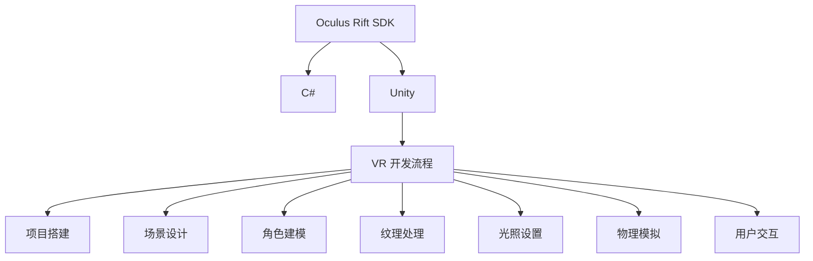

                 

# Oculus Rift SDK：在 Rift 上开发

> 关键词：Oculus Rift, SDK, C#, Unity, Oculus SDK, VR 游戏开发, Oculus 虚拟现实

## 1. 背景介绍

### 1.1 问题由来
Oculus Rift是一款广受欢迎的虚拟现实头显设备，通过其SDK（软件开发工具包），开发者可以轻松创建高度沉浸感、互动性强的虚拟现实应用程序。Oculus Rift SDK不仅支持Unity游戏引擎，还支持C#等语言，为开发者提供了一个友好的开发平台。然而，对于许多初学者和开发新手来说，Oculus Rift SDK的应用和开发仍然是一项具有挑战性的任务。本文将深入介绍Oculus Rift SDK的基础知识和核心技术，帮助开发者在Rift上快速开发出高性能、沉浸式的虚拟现实应用程序。

## 2. 核心概念与联系

### 2.1 核心概念概述

为了更好地理解Oculus Rift SDK的应用，本文将介绍几个关键概念及其相互关系：

- **Oculus Rift SDK**：Oculus Rift SDK是Oculus公司提供的一组工具和API，用于在Oculus Rift头显上开发虚拟现实应用程序。
- **C#**：C#是一种面向对象的编程语言，由Microsoft开发，广泛应用于游戏开发、Web应用开发等。
- **Unity**：Unity是一款广泛使用的游戏引擎，支持跨平台开发，可以在PC、手机、VR等平台上运行。
- **虚拟现实(VR)**：虚拟现实是一种通过计算机生成的模拟环境，使用户能够沉浸在虚拟世界中。
- **SDK**：软件开发工具包，是一组工具和API，用于开发特定平台的应用程序。
- **VR开发流程**：包括项目搭建、场景设计、角色建模、纹理处理、光照设置、物理模拟、用户交互等。

这些概念之间的关系通过以下Mermaid流程图进行展示：



这个流程图展示了大语言模型微调的核心概念及其相互关系：

1. Oculus Rift SDK提供了一组API和工具，用于在Oculus Rift头显上开发应用程序。
2. C#是Oculus Rift SDK支持的编程语言之一，开发者可以使用C#编写代码实现虚拟现实应用程序。
3. Unity是一个支持跨平台开发的 game engine，广泛用于游戏和虚拟现实开发。
4. VR开发流程包括多个步骤，如项目搭建、场景设计、角色建模等，最终实现用户交互。

这些概念共同构成了Oculus Rift SDK的应用和开发框架，使其能够在各种场景下实现高度沉浸感、互动性强的虚拟现实应用程序。通过理解这些核心概念，我们可以更好地把握Oculus Rift SDK的工作原理和优化方向。

## 3. 核心算法原理 & 具体操作步骤

### 3.1 算法原理概述

Oculus Rift SDK的算法原理主要包括以下几个方面：

- **空间感知与定位**：Oculus Rift SDK通过摄像头和传感器获取用户头显的姿态和位置信息，用于实现空间定位和用户交互。
- **渲染与显示**：SDK提供渲染引擎和图形API，用于渲染虚拟场景和实时图像，并显示在Oculus Rift头显上。
- **输入输出处理**：SDK支持多种输入输出方式，如键盘、鼠标、手柄、追踪器等，通过处理用户输入实现交互。
- **物理模拟**：SDK提供了物理引擎和碰撞检测机制，用于模拟物体间的物理交互，增强虚拟现实场景的逼真感。

### 3.2 算法步骤详解

在Oculus Rift SDK上进行应用程序开发，一般包括以下几个步骤：

**Step 1: 准备开发环境**

1. 安装Oculus Rift SDK：从Oculus官网下载安装包，安装Oculus Rift SDK。
2. 配置Unity：在Unity中创建新的VR项目，并选择Oculus Rift平台作为目标平台。
3. 设置开发工具：配置C#开发工具，如Visual Studio、MonoDevelop等，用于编写和调试代码。

**Step 2: 编写应用程序**

1. 定义场景：在Unity中创建场景，设置虚拟场景的布局和元素。
2. 创建角色和物体：导入3D模型、纹理等资源，创建虚拟角色和物体。
3. 实现空间定位：使用SDK提供的空间感知API，获取用户头显的位置和姿态信息。
4. 实现用户交互：使用SDK提供的输入输出API，处理用户的输入和输出，实现交互。
5. 实现物理模拟：使用SDK提供的物理引擎和碰撞检测机制，实现物体间的物理交互。

**Step 3: 调试和优化**

1. 调试代码：使用Unity和SDK提供的调试工具，检查代码中的错误和问题。
2. 优化性能：使用Unity和SDK提供的性能优化工具，调整渲染设置、优化物理模拟等，提高应用性能。
3. 测试应用程序：在Oculus Rift头显上测试应用程序，检查应用的性能和用户体验。

**Step 4: 发布和部署**

1. 打包应用程序：使用Unity和SDK提供的打包工具，将应用程序打包为可执行文件或发布包。
2. 发布到Oculus Store：将应用程序上传到Oculus Store，供用户下载和使用。

### 3.3 算法优缺点

使用Oculus Rift SDK进行VR应用程序开发，有以下优点：

- **易于上手**：Oculus Rift SDK提供了丰富的API和文档，使开发过程相对简单。
- **性能稳定**：SDK经过Oculus的优化和测试，能够提供稳定的性能表现。
- **支持多种平台**：Oculus Rift SDK支持多种平台，包括PC、移动设备等。
- **生态系统完善**：Oculus Rift SDK拥有广泛的开发者社区和资源，能够快速获取帮助和支持。

同时，也存在一些缺点：

- **性能要求高**：VR应用程序对硬件要求较高，需要高性能的计算机和显卡。
- **开发成本高**：开发VR应用程序需要较高的硬件成本和开发成本。
- **用户体验复杂**：VR应用程序需要对用户的空间定位和交互进行优化，用户体验相对复杂。

## 4. 数学模型和公式 & 详细讲解 & 举例说明

### 4.1 数学模型构建

Oculus Rift SDK的核心算法涉及空间感知、渲染和物理模拟等方面。下面我们将分别介绍这些方面的数学模型构建。

- **空间感知**：Oculus Rift SDK通过摄像头和传感器获取用户头显的姿态和位置信息，实现空间定位和用户交互。

- **渲染**：Oculus Rift SDK使用图形API，将虚拟场景渲染为2D或3D图像，并在Oculus Rift头显上显示。

- **物理模拟**：Oculus Rift SDK使用物理引擎和碰撞检测机制，模拟物体间的物理交互。

### 4.2 公式推导过程

由于篇幅限制，本文将只介绍空间感知和渲染的公式推导过程。

**空间感知**

空间感知模型涉及头显的位置和姿态信息，通常使用四元数或旋转矩阵表示。以四元数为例，公式推导如下：

$$
q = \begin{bmatrix} w & x & y & z \end{bmatrix}^T
$$

**渲染**

渲染模型涉及虚拟场景的3D变换和2D投影。以透视投影为例，公式推导如下：

$$
\begin{bmatrix} x' \\ y' \\ z' \\ 1 \end{bmatrix} = \begin{bmatrix} \frac{x}{z} & 0 & 0 & 0 \\ 0 & \frac{y}{z} & 0 & 0 \\ 0 & 0 & 1 & 0 \\ 0 & 0 & 0 & 1 \end{bmatrix} \begin{bmatrix} x \\ y \\ z \\ 1 \end{bmatrix}
$$

### 4.3 案例分析与讲解

为了更好地理解Oculus Rift SDK的应用，我们将通过一个简单的案例进行讲解。

**案例：创建一个简单的VR应用**

1. 打开Unity，创建一个新的VR项目。
2. 在场景中创建一个球体，设置为虚拟对象。
3. 在C#脚本中编写代码，获取用户头显的位置和姿态信息，并根据用户头显的位置实时移动球体的位置和姿态。
4. 编译并运行应用程序，在Oculus Rift头显上测试球体的移动效果。

## 5. 项目实践：代码实例和详细解释说明

### 5.1 开发环境搭建

在Oculus Rift SDK上进行应用程序开发，需要准备以下开发环境：

1. 安装Oculus Rift SDK：从Oculus官网下载安装包，安装Oculus Rift SDK。
2. 配置Unity：在Unity中创建新的VR项目，并选择Oculus Rift平台作为目标平台。
3. 设置开发工具：配置C#开发工具，如Visual Studio、MonoDevelop等，用于编写和调试代码。

### 5.2 源代码详细实现

下面是一个简单的VR应用示例，用于演示如何使用Oculus Rift SDK进行开发。

```csharp
using UnityEngine;
using Oculus Rift SDK;

public class OculusExample : MonoBehaviour
{
    // 获取头显信息
    public InputSource headSource = InputSource.HMD;
    public HeadPoseData headPoseData;

    void Update()
    {
        // 获取头显的位置和姿态信息
        headPoseData = OculusInput.GetHeadPoseData(headSource);

        // 根据头显的位置移动球体
        transform.position = headPoseData.position;
        transform.rotation = headPoseData.rotation;
    }
}
```

### 5.3 代码解读与分析

该示例代码中，我们使用了Oculus Rift SDK提供的InputSource和HeadPoseData类，获取用户头显的位置和姿态信息。在Update函数中，根据头显的位置和姿态信息，实时更新球体的位置和姿态，实现了球体随着头显的移动而移动的效果。

### 5.4 运行结果展示

运行该示例代码，在Oculus Rift头显上测试球体的移动效果。可以看到，球体能够随着头显的移动而移动，实现了简单的交互效果。

## 6. 实际应用场景

### 6.1 智能家居控制

Oculus Rift SDK可以用于智能家居控制应用程序的开发。通过在Oculus Rift头显上展示家居场景，用户可以通过手势和语音命令控制家居设备，实现智能家居控制。

### 6.2 虚拟会议

Oculus Rift SDK可以用于虚拟会议应用程序的开发。通过在Oculus Rift头显上展示虚拟会议室，用户可以与远程会议者进行虚拟会议，实现远程协作。

### 6.3 虚拟旅游

Oculus Rift SDK可以用于虚拟旅游应用程序的开发。通过在Oculus Rift头显上展示虚拟旅游场景，用户可以进行虚拟旅游，体验不同地方的风景和文化。

### 6.4 未来应用展望

随着VR技术的不断进步，Oculus Rift SDK的应用场景将越来越广泛，未来将会有更多的VR应用程序涌现。Oculus Rift SDK将会在教育、医疗、娱乐等领域发挥重要作用，带来更多的应用可能性。

## 7. 工具和资源推荐

### 7.1 学习资源推荐

为了帮助开发者系统掌握Oculus Rift SDK的基础知识和核心技术，以下是一些优质的学习资源：

1. Oculus官方文档：Oculus Rift SDK的官方文档，提供了丰富的API和示例代码，是学习Oculus Rift SDK的重要资源。
2. Unity官方文档：Unity游戏引擎的官方文档，详细介绍了VR开发的相关知识和技术。
3. C#官方文档：C#语言的官方文档，提供了丰富的编程语言资源和技术支持。
4. Oculus开发者社区：Oculus官方提供的开发者社区，提供了大量的开发资源和技术支持。

### 7.2 开发工具推荐

以下是几款用于Oculus Rift SDK开发的常用工具：

1. Unity：广泛使用的游戏引擎，支持跨平台开发，可以在PC、移动设备、Oculus Rift等平台上运行。
2. Visual Studio：微软开发的企业级开发工具，支持C#语言的开发和调试。
3. MonoDevelop：开源的开发工具，支持C#语言的开发和调试。
4. Oculus Input：Oculus Rift SDK提供的输入输出API，用于处理用户的输入和输出。
5. Oculus Physics：Oculus Rift SDK提供的物理引擎和碰撞检测机制，用于模拟物体间的物理交互。

### 7.3 相关论文推荐

以下是几篇具有代表性的相关论文，推荐阅读：

1. A Survey on Virtual Reality (VR) in Human-Computer Interaction（VR在HCI中的应用综述）：介绍了VR技术在HCI中的各种应用，包括VR应用程序的开发和用户交互。
2. Real-time Rendering for Virtual Reality（VR实时渲染）：介绍了VR应用程序的渲染技术，包括纹理映射、光照设置等。
3. Augmented Reality and Virtual Reality for Interactive Visualization（AR和VR在交互式可视化中的应用）：介绍了AR和VR技术在交互式可视化中的应用，包括虚拟场景的创建和渲染。

## 8. 总结：未来发展趋势与挑战

### 8.1 总结

本文对Oculus Rift SDK的应用进行了全面系统的介绍。首先阐述了Oculus Rift SDK的背景和核心技术，明确了在Oculus Rift头显上开发虚拟现实应用程序的重要性。其次，从原理到实践，详细讲解了Oculus Rift SDK的算法原理和具体操作步骤，给出了VR应用程序开发的完整代码实例。同时，本文还探讨了Oculus Rift SDK在多个行业领域的应用前景，展示了其广阔的应用可能性。

通过本文的系统梳理，可以看到，Oculus Rift SDK正在成为VR应用程序开发的重要工具，极大地拓展了虚拟现实应用程序的应用边界，催生了更多的落地场景。得益于Oculus Rift SDK的支持，VR技术正在逐步走向成熟，为传统行业带来了变革性影响。未来，随着VR技术的不断进步，Oculus Rift SDK的应用场景将越来越广泛，为社会各个领域带来更多的创新和突破。

### 8.2 未来发展趋势

展望未来，Oculus Rift SDK将呈现以下几个发展趋势：

1. **硬件性能提升**：随着VR硬件的不断进步，Oculus Rift SDK将能够支持更高性能、更逼真的虚拟现实场景。
2. **跨平台支持**：Oculus Rift SDK将支持更多的平台，包括PC、手机、移动设备等。
3. **生态系统完善**：Oculus Rift SDK将拥有更广泛的开发者社区和资源，提供更多的开发支持和帮助。
4. **用户体验优化**：Oculus Rift SDK将提供更好的用户体验优化技术，提升虚拟现实应用程序的沉浸感和互动性。
5. **应用场景扩展**：Oculus Rift SDK将支持更多的应用场景，如教育、医疗、娱乐等。

以上趋势凸显了Oculus Rift SDK的广阔前景。这些方向的探索发展，将进一步提升虚拟现实应用程序的性能和应用范围，为人类生产生活带来更深刻的变革。

### 8.3 面临的挑战

尽管Oculus Rift SDK在VR应用程序开发中取得了显著进展，但在迈向更加智能化、普适化应用的过程中，仍面临诸多挑战：

1. **硬件成本高**：Oculus Rift头显和其他VR设备价格较高，限制了其普及和应用。
2. **用户使用习惯**：VR设备的使用习惯和体验相对复杂，需要用户进行一定的适应和培训。
3. **生态系统不完善**：尽管Oculus Rift SDK的生态系统逐渐完善，但仍需更多的开发者和资源支持。
4. **技术瓶颈**：VR技术在渲染、物理模拟等方面仍存在技术瓶颈，需不断改进和优化。

尽管存在这些挑战，但Oculus Rift SDK仍具有广阔的发展前景，相信在学界和产业界的共同努力下，这些挑战终将一一克服，Oculus Rift SDK必将在构建人机协同的智能时代中扮演越来越重要的角色。

### 8.4 研究展望

面向未来，Oculus Rift SDK的研究方向主要集中在以下几个方面：

1. **硬件优化**：继续提升硬件性能，优化渲染和物理模拟技术，实现更逼真的虚拟现实场景。
2. **生态系统扩展**：吸引更多的开发者和资源，扩展生态系统，提供更多的开发支持和帮助。
3. **用户体验优化**：优化用户使用习惯和体验，提升虚拟现实应用程序的沉浸感和互动性。
4. **应用场景扩展**：探索更多应用场景，如教育、医疗、娱乐等，提升应用价值。

这些研究方向的探索，将引领Oculus Rift SDK技术迈向更高的台阶，为构建人机协同的智能时代提供更强大的技术支撑。

## 9. 附录：常见问题与解答

**Q1：Oculus Rift SDK是否适用于所有VR平台？**

A: Oculus Rift SDK主要适用于Oculus Rift头显平台，但部分功能也可以应用于其他VR平台。开发者需要根据具体的平台和需求进行适配。

**Q2：如何提高Oculus Rift应用程序的性能？**

A: 提高Oculus Rift应用程序的性能，可以从以下几个方面入手：

1. 优化渲染设置：调整渲染分辨率、纹理质量等，降低计算负荷。
2. 优化物理模拟：优化物理引擎和碰撞检测机制，降低计算负荷。
3. 使用GPU加速：使用GPU加速技术，提高渲染和计算效率。
4. 减少数据传输：减少数据传输和处理，降低延迟和带宽消耗。

**Q3：Oculus Rift SDK支持哪些编程语言？**

A: Oculus Rift SDK主要支持C#编程语言，但开发者也可以使用其他编程语言进行开发，如C++、Python等。

**Q4：Oculus Rift应用程序的调试和测试方法有哪些？**

A: Oculus Rift应用程序的调试和测试方法包括：

1. 使用Unity和SDK提供的调试工具，检查代码中的错误和问题。
2. 使用Oculus Rift头显进行测试，检查应用程序的性能和用户体验。
3. 使用模拟器进行测试，检查应用程序在不同平台上的表现。

**Q5：Oculus Rift SDK的未来发展方向是什么？**

A: Oculus Rift SDK的未来发展方向包括：

1. 硬件性能提升：提升硬件性能，实现更高性能、更逼真的虚拟现实场景。
2. 跨平台支持：支持更多的平台，包括PC、手机、移动设备等。
3. 生态系统完善：拥有更广泛的开发者社区和资源，提供更多的开发支持和帮助。
4. 用户体验优化：优化用户使用习惯和体验，提升虚拟现实应用程序的沉浸感和互动性。
5. 应用场景扩展：支持更多的应用场景，如教育、医疗、娱乐等。

通过这些措施，Oculus Rift SDK将能够提供更强大、更灵活、更智能的虚拟现实开发平台，为开发者带来更多的创新和突破。

