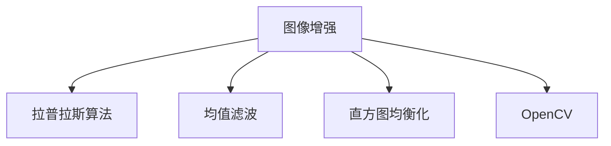

                 

# OpenCV 图像增强算法：改善图像质量和视觉效果

> 关键词：图像增强, 图像处理, 计算机视觉, OpenCV, 图像质量, 视觉效果

## 1. 背景介绍

在数字图像处理领域，图像增强技术一直处于核心位置。通过提高图像质量，改善视觉体验，图像增强技术被广泛应用于医疗、安全监控、自动驾驶、娱乐等多个领域。本文将从基础概念、核心算法、工程实现等方面，深入介绍OpenCV图像增强算法。

### 1.1 图像增强的意义

图像增强，即通过改善图像质量，使其更符合人眼观察和后续处理需求的技术。常见的图像增强手段包括：

- **锐化**：使图像边缘更清晰，细节更明显。
- **去噪**：去除图像噪声，提高图像清晰度和对比度。
- **对比度增强**：调整图像亮度和对比度，提高图像的动态范围。
- **色彩增强**：调整图像色彩，增强图像的视觉冲击力。
- **直方图均衡化**：通过改变图像的像素分布，增强图像的对比度和亮度。

图像增强技术的意义在于：

1. **提升识别效果**：清晰的图像更容易被计算机识别，提高机器视觉系统的准确率。
2. **美化视觉效果**：高质量的图像能给用户带来更好的视觉体验，提升用户满意度。
3. **便于后续处理**：优化后的图像，便于进一步的分割、分割、分类等处理。

### 1.2 图像增强的发展历程

图像增强技术的发展经历了从传统的数学模型到现代机器学习算法的转变。20世纪80年代，数字图像处理技术开始兴起，图像增强方法主要以数学模型为基础，如拉普拉斯算法、均值滤波等。随着计算机技术的进步，图像增强算法逐渐从传统的统计和几何方法转向基于机器学习的算法，如深度学习、卷积神经网络等。

近年来，OpenCV等开源计算机视觉库的出现，进一步推动了图像增强技术的普及和应用。OpenCV提供了丰富、高效的图像处理和增强工具，帮助开发者轻松实现图像增强功能。

## 2. 核心概念与联系

### 2.1 核心概念概述

- **图像增强**：通过改善图像质量，使其更符合人眼观察和后续处理需求的技术。
- **拉普拉斯算法**：一种用于图像增强的算法，通过增强图像高频成分，使图像边缘更加清晰。
- **均值滤波**：一种基于统计的图像去噪算法，通过计算图像各像素的平均值，去除噪声。
- **直方图均衡化**：通过改变图像的像素分布，增强图像的对比度和亮度。
- **OpenCV**：一个开源计算机视觉库，提供丰富的图像处理和增强功能。

这些核心概念之间的关系可以用以下Mermaid流程图表示：



这个流程图展示了图像增强技术的主要方法和工具：

1. **拉普拉斯算法**：用于增强图像的高频成分，使图像边缘更加清晰。
2. **均值滤波**：用于去噪，减少图像的噪声，提高图像清晰度。
3. **直方图均衡化**：用于调整图像的像素分布，增强图像的对比度和亮度。
4. **OpenCV**：提供这些算法的实现和应用平台，方便开发者进行图像增强。

## 3. 核心算法原理 & 具体操作步骤

### 3.1 算法原理概述

图像增强的原理在于利用数学和统计学方法，改善图像的视觉质量。其核心思想是通过提升图像的对比度、清晰度、颜色饱和度等指标，使图像更加符合人眼感知和后续处理的需求。

常见的图像增强方法包括：

- **拉普拉斯算法**：通过增强图像的高频成分，使图像边缘更加清晰。
- **均值滤波**：通过计算图像各像素的平均值，去除噪声，提高图像清晰度。
- **直方图均衡化**：通过改变图像的像素分布，增强图像的对比度和亮度。
- **色彩增强**：通过调整图像的色彩，增强视觉冲击力。

这些算法均基于不同的数学模型和统计方法，具有不同的优缺点和适用范围。

### 3.2 算法步骤详解

以拉普拉斯算法为例，其具体步骤如下：

1. **计算拉普拉斯算子**：通过计算图像的高频成分，得到拉普拉斯算子。
2. **卷积操作**：将拉普拉斯算子与原始图像进行卷积操作，得到增强后的图像。
3. **非线性变换**：通常需要对增强后的图像进行非线性变换，如对数变换、平方根变换等，进一步提升图像质量。

下面以OpenCV为例，详细介绍拉普拉斯算法的实现步骤。

**步骤1：导入OpenCV和numpy库**

```python
import cv2
import numpy as np
```

**步骤2：读取原始图像**

```python
img = cv2.imread('input.jpg')
```

**步骤3：计算拉普拉斯算子**

```python
laplacian = cv2.Laplacian(img, cv2.CV_64F)
```

**步骤4：非线性变换**

```python
laplacian = np.exp(laplacian)
```

**步骤5：显示增强后的图像**

```python
cv2.imshow('Laplacian Image', laplacian)
cv2.waitKey(0)
cv2.destroyAllWindows()
```

### 3.3 算法优缺点

拉普拉斯算法的主要优点包括：

- **边缘增强**：拉普拉斯算法能够有效地增强图像的边缘，使其更加清晰。
- **计算简单**：拉普拉斯算法的计算量相对较小，易于实现。

其主要缺点包括：

- **细节丢失**：拉普拉斯算法在增强边缘的同时，可能会导致图像细节的丢失。
- **噪声放大**：对于噪声较多的图像，拉普拉斯算法可能会放大噪声。

### 3.4 算法应用领域

拉普拉斯算法广泛应用于医学影像增强、卫星图像处理、自动驾驶等领域。通过提高图像的清晰度，这些算法能够显著提升图像的识别和处理效果，带来实际应用价值。

## 4. 数学模型和公式 & 详细讲解 & 举例说明

### 4.1 数学模型构建

拉普拉斯算法基于以下数学模型：

$$
L(x) = \nabla^2 x = \frac{\partial^2 x}{\partial x^2} + \frac{\partial^2 x}{\partial y^2}
$$

其中，$x$ 表示原始图像，$L(x)$ 表示拉普拉斯算子。

### 4.2 公式推导过程

拉普拉斯算子通过二阶导数得到，具体推导如下：

$$
L(x) = \frac{\partial^2 x}{\partial x^2} + \frac{\partial^2 x}{\partial y^2}
$$

对二维图像进行拉普拉斯变换，可以得到：

$$
L(x) = \begin{bmatrix}
0 & -1 & 0 \\
-1 & 4 & -1 \\
0 & -1 & 0
\end{bmatrix} \otimes \begin{bmatrix}
x_{i-1,j-1} \\
x_{i,j-1} \\
x_{i+1,j-1} \\
x_{i-1,j} \\
x_{i,j} \\
x_{i+1,j} \\
x_{i-1,j+1} \\
x_{i,j+1} \\
x_{i+1,j+1}
\end{bmatrix}
$$

其中，$\otimes$ 表示卷积操作。

### 4.3 案例分析与讲解

以医学影像增强为例，拉普拉斯算法可以帮助医学影像更清晰地展示器官轮廓，提高医生的诊断准确率。通过增强影像的高频成分，拉普拉斯算法能够突出重要的结构细节，使影像更具信息量。

## 5. 项目实践：代码实例和详细解释说明

### 5.1 开发环境搭建

在进行图像增强项目开发前，需要搭建好开发环境。以下是在Linux系统中搭建OpenCV开发环境的步骤：

1. 安装Python和pip：

```bash
sudo apt-get update
sudo apt-get install python3 python3-pip
```

2. 安装OpenCV：

```bash
pip install opencv-python
```

3. 测试OpenCV安装：

```python
import cv2
print(cv2.__version__)
```

### 5.2 源代码详细实现

以下是一个基于OpenCV的拉普拉斯算法实现示例：

```python
import cv2
import numpy as np

# 读取原始图像
img = cv2.imread('input.jpg')

# 计算拉普拉斯算子
laplacian = cv2.Laplacian(img, cv2.CV_64F)

# 非线性变换
laplacian = np.exp(laplacian)

# 显示增强后的图像
cv2.imshow('Laplacian Image', laplacian)
cv2.waitKey(0)
cv2.destroyAllWindows()
```

### 5.3 代码解读与分析

**读取原始图像**：

```python
img = cv2.imread('input.jpg')
```

**计算拉普拉斯算子**：

```python
laplacian = cv2.Laplacian(img, cv2.CV_64F)
```

**非线性变换**：

```python
laplacian = np.exp(laplacian)
```

**显示增强后的图像**：

```python
cv2.imshow('Laplacian Image', laplacian)
cv2.waitKey(0)
cv2.destroyAllWindows()
```

## 6. 实际应用场景

### 6.1 医学影像增强

在医学影像处理中，拉普拉斯算法常用于提高图像清晰度，突出重要结构细节。例如，在X光片处理中，拉普拉斯算法可以帮助医生更清晰地看到骨骼结构，提高诊断的准确率。

### 6.2 自动驾驶

在自动驾驶中，拉普拉斯算法用于提高图像清晰度，增强路标和障碍物的识别。例如，通过拉普拉斯算法，可以使道路标识更加清晰，帮助车辆更准确地进行导航。

### 6.3 视频监控

在视频监控中，拉普拉斯算法用于增强图像边缘，提高视频监控的清晰度。例如，在安防系统中，通过拉普拉斯算法，可以使监控图像的边缘更加清晰，帮助安防人员更准确地识别异常行为。

### 6.4 未来应用展望

未来，图像增强技术将在更多领域得到应用。例如，在无人机图像处理中，拉普拉斯算法可以用于增强图像清晰度，提高无人机的导航和目标检测能力。在虚拟现实中，拉普拉斯算法可以用于提高图像的清晰度和对比度，提升虚拟现实的沉浸感。

## 7. 工具和资源推荐

### 7.1 学习资源推荐

1. **《OpenCV官方文档》**：OpenCV官方文档是学习OpenCV的最佳资源，提供了详细的API文档和示例代码。
2. **《计算机视觉：算法与应用》**：该书详细介绍了计算机视觉的基本概念和算法，适合初学者入门。
3. **《OpenCV计算机视觉编程》**：该书以OpenCV为工具，介绍了计算机视觉的基本概念和算法实现。

### 7.2 开发工具推荐

1. **PyCharm**：PyCharm是Python的集成开发环境，支持OpenCV等库的使用，方便代码开发和调试。
2. **Jupyter Notebook**：Jupyter Notebook是一个交互式编程环境，适合进行实验和数据分析。
3. **Git**：Git是一个版本控制系统，适合团队协作和代码管理。

### 7.3 相关论文推荐

1. **《A Comparative Study of Image Enhancement Techniques》**：这篇论文对比了多种图像增强算法的效果，为选择合适的算法提供了参考。
2. **《Laplacian Pyramid for Image Super-Resolution》**：这篇论文介绍了基于拉普拉斯金字塔的图像超分辨率算法，适合进一步学习和研究。

## 8. 总结：未来发展趋势与挑战

### 8.1 研究成果总结

OpenCV图像增强算法在图像质量提升和视觉体验改善方面具有重要应用价值。通过拉普拉斯算法、均值滤波、直方图均衡化等技术，可以实现对图像的全面优化。

### 8.2 未来发展趋势

未来，图像增强技术将向以下几个方向发展：

1. **深度学习应用**：深度学习算法在图像增强中的应用将越来越广泛，提供更高的图像质量。
2. **多模态增强**：结合视觉、声音、触觉等多模态数据，提供更加全面的图像增强方案。
3. **自适应增强**：通过自适应算法，根据不同图像特征进行针对性增强，提高图像增强效果。

### 8.3 面临的挑战

尽管OpenCV图像增强技术已经取得了显著进展，但仍面临以下挑战：

1. **计算资源消耗**：图像增强算法通常需要大量的计算资源，如何优化算法效率，减少计算资源消耗，是未来的一个重要研究方向。
2. **鲁棒性问题**：图像增强算法对噪声、光照等干扰因素较为敏感，如何提高算法的鲁棒性，增强其对复杂场景的适应能力，是一个亟待解决的问题。
3. **数据依赖**：图像增强算法的效果很大程度上依赖于输入图像的质量，如何提高算法的通用性和鲁棒性，使其在不同场景下都能保持稳定效果，是未来的一个重要研究方向。

### 8.4 研究展望

未来，图像增强技术需要在以下几个方面进行进一步研究：

1. **深度学习增强**：利用深度学习技术，实现更加智能化的图像增强算法。
2. **多模态融合**：结合视觉、声音、触觉等多模态数据，实现更加全面的图像增强。
3. **自适应算法**：开发自适应算法，根据不同图像特征进行针对性增强。
4. **鲁棒性优化**：提高算法的鲁棒性，增强其对复杂场景的适应能力。
5. **数据增强**：通过数据增强技术，提高算法的通用性和鲁棒性。

## 9. 附录：常见问题与解答

**Q1: OpenCV中拉普拉斯算法的参数有哪些？**

A: OpenCV中拉普拉斯算法的参数主要有：

- `src`：输入图像。
- `ddepth`：输出图像的数据类型，可选值有 `CV_16S`、`CV_32F`、`CV_64F`。
- `ksize`：卷积核的大小，一般取值为 `3`。

**Q2: 拉普拉斯算法是否适合所有类型的图像？**

A: 拉普拉斯算法通常适用于图像边缘清晰，噪声较少的情况。对于噪声较多的图像，可能需要结合去噪算法进行处理。

**Q3: OpenCV中的拉普拉斯算法与图像金字塔有何关系？**

A: OpenCV中的拉普拉斯算法可以通过图像金字塔实现多尺度处理，通过不同尺度的拉普拉斯变换，实现多尺度的图像增强。

---

作者：禅与计算机程序设计艺术 / Zen and the Art of Computer Programming

