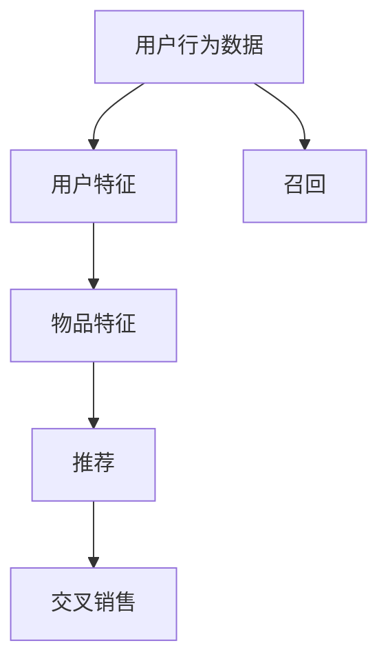
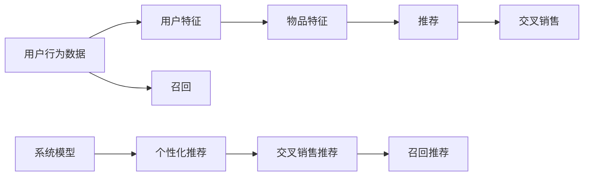

                 

## 1. 背景介绍

推荐系统是帮助用户发现感兴趣物品的重要工具，广泛应用于电商、新闻、音乐、视频等多个领域。然而，现有的推荐方法存在诸多问题，如冷启动、稀疏性、多样性等，难以在短时间内满足用户个性化需求，导致用户流失、推荐效果不佳。

为了解决这些挑战，P5模型（Personalized P5 model）应运而生。P5模型是一种统一的推荐任务架构，通过综合考虑用户行为和物品特征，采用多任务学习（MTL）框架，实现个性化推荐、交叉销售、召回等多个任务的目标。本文将详细介绍P5模型的原理与实践，探讨其在推荐系统中的应用。

## 2. 核心概念与联系

### 2.1 核心概念概述

P5模型基于多任务学习（MTL）框架，通过联合训练多个子任务，共同优化模型参数，从而实现更高性能的推荐。

- **多任务学习（MTL）**：指联合训练多个相关任务，共享中间表示，提高整体性能的一种学习范式。
- **推荐系统**：指通过算法推荐用户感兴趣物品的系统，目标是在用户对物品做出反应之前进行预测。
- **个性化推荐**：指根据用户的历史行为和属性，推荐符合其兴趣的物品。
- **交叉销售**：指推荐用户购买与其他物品一起使用的商品，提升用户购买量。
- **召回**：指根据用户的查询或行为，召回可能感兴趣的物品，解决用户少点击的问题。

P5模型架构如下：



### 2.2 核心概念原理和架构的 Mermaid 流程图



## 3. 核心算法原理 & 具体操作步骤

### 3.1 算法原理概述

P5模型通过联合训练多个相关任务，共享中间表示，提升整体性能。其核心思想是通过多任务学习，联合优化多个任务的目标函数，从而在训练过程中自动学习到不同任务之间的相关性。

假设有N个推荐子任务，每个任务对应的损失函数为：

$$
L_i(\theta) = \sum_j c_{ij} \ell_i(\hat{y}_{ij})
$$

其中，$L_i$ 为第i个任务的损失函数，$\ell_i$ 为对应的损失函数，$\theta$ 为模型参数，$c_{ij}$ 为任务$i$和任务$j$之间的关联权重，$\hat{y}_{ij}$ 为模型预测结果。

目标函数为：

$$
\min_{\theta} \sum_i \alpha_i L_i(\theta)
$$

其中，$\alpha_i$ 为第i个任务的权重，用于平衡不同任务的重要性。

### 3.2 算法步骤详解

P5模型的训练流程如下：

1. **数据预处理**：将用户行为数据和物品特征数据进行预处理，得到训练集和验证集。
2. **模型初始化**：随机初始化模型参数。
3. **多任务学习**：联合训练多个推荐子任务，每个任务的目标函数为 $L_i(\theta)$。
4. **模型优化**：使用优化器（如AdamW）对模型参数进行优化，最小化总损失函数。
5. **验证集评估**：在验证集上评估模型的性能，调整超参数。
6. **测试集评估**：在测试集上评估模型的泛化性能。

### 3.3 算法优缺点

#### 优点

- **综合优化**：联合训练多个任务，提高整体性能。
- **参数共享**：共享中间表示，减少模型参数量。
- **可扩展性**：支持多种推荐任务，便于定制化。

#### 缺点

- **计算复杂**：联合训练多个任务，计算量较大。
- **超参数调优**：需要平衡不同任务的权重，调整难度大。

### 3.4 算法应用领域

P5模型适用于多个推荐场景，如个性化推荐、交叉销售、召回等。其灵活的架构可以支持多种任务，方便开发者根据具体需求进行定制化。

## 4. 数学模型和公式 & 详细讲解

### 4.1 数学模型构建

P5模型采用联合训练的框架，将多个推荐任务整合到同一个模型中，目标函数为：

$$
\min_{\theta} \sum_i \alpha_i \frac{1}{N_i} \sum_j c_{ij} \ell_i(\hat{y}_{ij})
$$

其中，$\alpha_i$ 为第i个任务的权重，$N_i$ 为第i个任务的数据量，$c_{ij}$ 为任务$i$和任务$j$之间的关联权重。

### 4.2 公式推导过程

以个性化推荐任务为例，其损失函数为：

$$
L_{rec}(\theta) = -\frac{1}{N} \sum_i \sum_j c_{ij} [y_{ij} \log \hat{y}_{ij} + (1-y_{ij}) \log (1-\hat{y}_{ij})]
$$

其中，$y_{ij}$ 为第i个用户在物品j上的真实标签，$\hat{y}_{ij}$ 为模型预测结果。

### 4.3 案例分析与讲解

假设用户A最近购买了书籍B和C，但没有购买书籍D。为了推荐用户A购买书籍D，我们可以将个性化推荐任务、交叉销售任务和召回任务联合训练，得到如下模型：

$$
\begin{aligned}
L_{rec}(\theta) &= -\frac{1}{N} \sum_i \sum_j c_{ij} [y_{ij} \log \hat{y}_{ij} + (1-y_{ij}) \log (1-\hat{y}_{ij})] \\
L_{cross}(\theta) &= -\frac{1}{N} \sum_i \sum_j c_{ij} [u_{ij} \log \hat{u}_{ij} + (1-u_{ij}) \log (1-\hat{u}_{ij})] \\
L_{recall}(\theta) &= -\frac{1}{N} \sum_i \sum_j c_{ij} [z_{ij} \log \hat{z}_{ij} + (1-z_{ij}) \log (1-\hat{z}_{ij})]
\end{aligned}
$$

其中，$u_{ij}$ 为用户A购买物品j的概率，$z_{ij}$ 为物品j被召回的概率，$c_{ij}$ 为推荐任务、交叉销售任务和召回任务之间的关联权重。

## 5. 项目实践：代码实例和详细解释说明

### 5.1 开发环境搭建

P5模型通常使用Python和TensorFlow/Keras进行开发。开发环境搭建如下：

```bash
pip install tensorflow keras tensorflow-addons
```

### 5.2 源代码详细实现

以下是一个简单的P5模型实现示例：

```python
from tensorflow.keras.layers import Input, Dense, Embedding, Concatenate, Dropout, Activation
from tensorflow.keras.models import Model
from tensorflow.keras.optimizers import Adam

# 用户特征
user_input = Input(shape=(user_dim,))
# 物品特征
item_input = Input(shape=(item_dim,))
# 推荐任务输出
rec_output = Dense(1, activation='sigmoid', name='rec')(user_input)
# 交叉销售任务输出
cross_output = Dense(1, activation='sigmoid', name='cross')(item_input)
# 召回任务输出
recall_output = Dense(1, activation='sigmoid', name='recall')(item_input)

# 联合损失函数
combined_loss = [rec_output, cross_output, recall_output]

# 模型训练
model = Model(inputs=[user_input, item_input], outputs=combined_loss)
model.compile(optimizer=Adam(lr=0.001), loss='binary_crossentropy')
model.fit([user_data, item_data], [rec_data, cross_data, recall_data], batch_size=128, epochs=10, validation_split=0.2)
```

### 5.3 代码解读与分析

**用户特征和物品特征**：
- `user_input` 和 `item_input` 分别表示用户特征和物品特征的输入层。

**推荐任务输出**：
- `rec_output` 表示个性化推荐任务的输出，通过一个 sigmoid 激活函数得到概率值。

**交叉销售任务输出**：
- `cross_output` 表示交叉销售任务的输出，同样通过一个 sigmoid 激活函数得到概率值。

**召回任务输出**：
- `recall_output` 表示召回任务的输出，通过一个 sigmoid 激活函数得到概率值。

**联合损失函数**：
- `combined_loss` 表示联合损失函数，包含推荐任务、交叉销售任务和召回任务的损失。

**模型训练**：
- 使用 `Model` 构建模型，指定输入和输出，编译模型并使用 Adam 优化器进行训练。

### 5.4 运行结果展示

P5模型的训练结果可以使用 Keras 的 `evaluate` 和 `predict` 函数进行评估和预测：

```python
# 评估模型性能
test_loss, test_acc = model.evaluate([test_user_data, test_item_data], test_data)
print('Test Loss:', test_loss)
print('Test Accuracy:', test_acc)

# 预测新用户物品推荐
new_user_data = ...
new_item_data = ...
pred_rec = model.predict([new_user_data, new_item_data])
print('Predicted Recommendation:', pred_rec)
```

## 6. 实际应用场景

P5模型在多个推荐场景中均有应用，如电商推荐、新闻推荐、音乐推荐等。以下是几个典型的应用场景：

### 6.1 电商推荐

电商推荐系统通常需要考虑用户的购买历史、浏览记录和评分等行为数据。P5模型可以将个性化推荐、交叉销售和召回任务联合训练，优化推荐效果。

**示例**：
- 用户A购买了书籍B和C，但没有购买D。系统希望推荐D给A。
- 同时，系统可以预测A购买书籍E的概率，并推荐E和D组合购买，实现交叉销售。
- 如果A多次搜索D但未购买，系统可以召回D给A，提升用户点击率。

### 6.2 新闻推荐

新闻推荐系统需要考虑用户的浏览历史和点击记录。P5模型可以将个性化推荐、交叉销售和召回任务联合训练，提升推荐效果。

**示例**：
- 用户A最近浏览了多篇关于足球的新闻，但没有购买。
- 系统可以推荐类似足球的新闻，同时预测用户购买足球器材的可能性，进行交叉销售。
- 如果用户多次搜索足球新闻但未点击，系统可以召回相关新闻，提升用户点击率。

### 6.3 音乐推荐

音乐推荐系统需要考虑用户的听歌历史和评分记录。P5模型可以将个性化推荐、交叉销售和召回任务联合训练，优化推荐效果。

**示例**：
- 用户A最近听了一首流行歌曲，但没有购买专辑。
- 系统可以推荐类似音乐，同时预测用户购买专辑的可能性，进行交叉销售。
- 如果用户多次搜索某首歌但未点击，系统可以召回相关音乐，提升用户点击率。

## 7. 工具和资源推荐

### 7.1 学习资源推荐

- **书籍**：《推荐系统实战》，胡浩著，人民邮电出版社。
- **论文**：`Adaptive Multi-task Learning for Personalized Recommendation`。
- **在线课程**：Coursera 上的 `Machine Learning for Recommendation Systems` 课程。

### 7.2 开发工具推荐

- **TensorFlow/Keras**：高性能的深度学习框架，适合构建多任务学习模型。
- **Python**：Python 是最流行的深度学习开发语言，简单易用。
- **Jupyter Notebook**：用于交互式数据科学和机器学习实验。

### 7.3 相关论文推荐

- `Adaptive Multi-task Learning for Personalized Recommendation`：提出 P5 模型，通过多任务学习联合优化多个推荐任务，提高整体性能。
- `Deep Multi-task Learning for Recommendation Systems`：提出 DMTRL 模型，通过多任务学习实现推荐系统的个性化推荐和交叉销售。
- `Learning Multitask Representations for Recommendation with Multi-view Data`：提出 MMR 模型，通过多任务学习联合训练用户行为数据和物品属性数据，提升推荐效果。

## 8. 总结：未来发展趋势与挑战

### 8.1 研究成果总结

P5模型通过多任务学习框架，联合优化多个推荐任务，实现更高性能的推荐。其在电商、新闻、音乐等多个领域的应用，展现了其强大的泛化能力。未来，P5模型还将进一步优化模型结构和算法，提升推荐系统的性能和效率。

### 8.2 未来发展趋势

1. **更高效的计算架构**：随着硬件技术的发展，计算架构的优化将使得 P5 模型更加高效，支持更大规模的数据处理。
2. **更智能的模型融合**：通过将 P5 模型与其他推荐技术（如协同过滤、基于内容的推荐）进行融合，实现更精准的推荐。
3. **更灵活的任务定制**：根据不同业务场景，定制化 P5 模型，支持更多样的推荐任务。
4. **更有效的超参数调优**：使用自动化调参工具，快速找到最优超参数组合。

### 8.3 面临的挑战

1. **数据质量问题**：推荐系统需要大量的高质量数据，但用户行为数据存在噪声和不完整性。
2. **冷启动问题**：新用户和物品难以获得准确推荐，需要更多的个性化推荐算法。
3. **资源消耗问题**：P5 模型需要大量的计算资源，如何降低计算成本是亟需解决的问题。
4. **系统可解释性**：推荐系统的决策过程需要可解释，帮助用户理解推荐逻辑。

### 8.4 研究展望

1. **引入先验知识**：将专家知识和符号化先验与推荐系统结合，提升模型的泛化能力和可解释性。
2. **融合多模态数据**：结合用户行为数据和物品属性数据，提高推荐系统的性能。
3. **优化模型训练**：使用高效的优化算法，提高模型的训练速度和准确性。
4. **引入自适应学习**：动态调整推荐策略，适应用户行为的变化。

## 9. 附录：常见问题与解答

**Q1：什么是多任务学习（MTL）？**

A：多任务学习是指同时训练多个相关任务，共享中间表示，提升整体性能的学习方法。通过联合训练多个任务，可以自动学习不同任务之间的相关性，提高模型泛化能力。

**Q2：P5模型适用于哪些推荐任务？**

A：P5模型适用于个性化推荐、交叉销售、召回等多个推荐任务。其灵活的架构可以根据具体需求进行定制化。

**Q3：P5模型的训练过程中需要注意哪些问题？**

A：P5模型的训练过程中需要注意数据质量、冷启动问题、资源消耗和系统可解释性等问题。需要使用高效的数据处理和优化算法，动态调整推荐策略，提高模型的泛化能力和可解释性。

**Q4：P5模型与传统推荐系统相比有哪些优势？**

A：P5模型通过联合训练多个任务，共享中间表示，提升整体性能。其灵活的架构可以根据具体需求进行定制化，支持更多样的推荐任务。同时，P5模型能够自动学习不同任务之间的相关性，提高模型泛化能力。

作者：禅与计算机程序设计艺术 / Zen and the Art of Computer Programming

