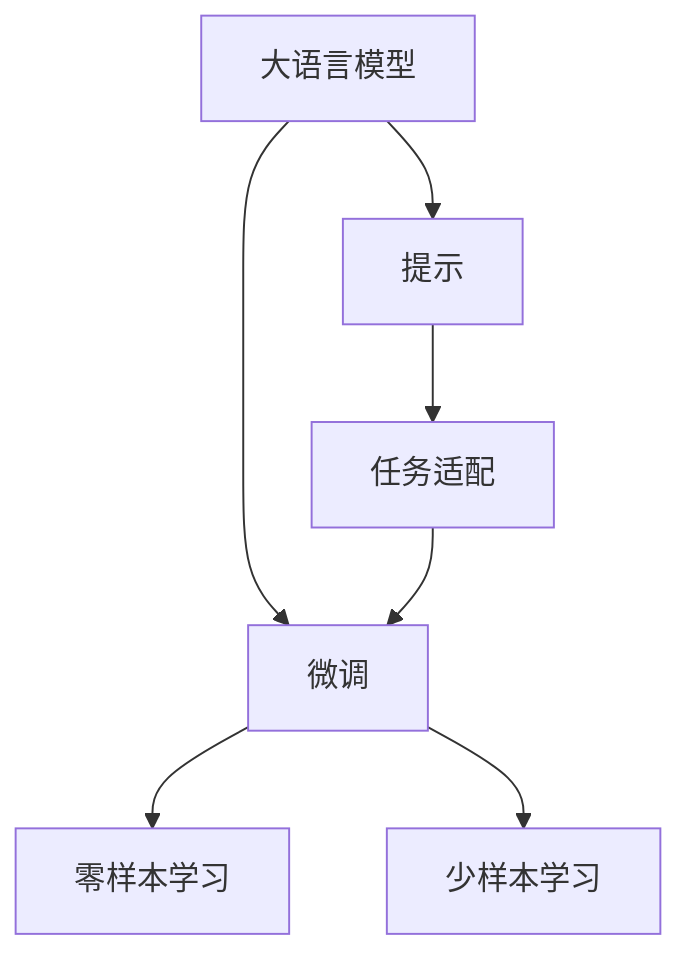

                 

# Prompt的设计与效果

## 1. 背景介绍

### 1.1 问题由来
在深度学习中，优化问题的定义至关重要。在大规模预训练语言模型（如BERT, GPT）的基础上进行微调时，一个合适的提示（Prompt）将显著提高模型的效果。好的提示能够充分挖掘模型的潜力，利用其预训练得到的知识，并且能够在微调中表现出色。

在传统机器学习时代，模型的优化过程通常是通过最小化损失函数来实现的。然而，随着深度学习模型的发展，尤其是Transformer模型的兴起，这种传统的优化方法不再适用。Transformer模型由于其特殊的自注意力机制，需要更加合适的优化方式来达到最优。

提示（Prompt）设计便是针对这种需求而提出的。一个有效的提示不仅仅能够简化模型的训练过程，而且能够在极少量的样本情况下，显著提升模型的性能。提示的使用已经成为现代深度学习优化中不可或缺的一部分，尤其是在大语言模型的微调中。

### 1.2 问题核心关键点
提示（Prompt）设计是深度学习中一个重要的研究方向，尤其是在微调大语言模型时。以下几方面是提示设计需要关注的核心关键点：

- **提示格式设计**：一个好的提示需要考虑语义、语法和结构等多方面的因素，以使模型能够更准确地理解和处理输入。
- **提示长度控制**：提示长度过长或过短都会影响模型的表现，过长可能引入噪声，过短可能不足以提供足够的信息。
- **提示多样性**：提示的多样性有助于模型在各种不同的任务场景中表现稳定。
- **提示表达能力**：提示应该能够充分表达出模型的预期输出，避免歧义和模糊。
- **提示生成能力**：在零样本或少样本学习中，提示的生成能力尤为重要，它决定了模型是否能从零开始生成有效的输出。

这些关键点涉及到了提示的生成、优化和使用等多个方面，需要结合具体任务和数据进行详细设计。

### 1.3 问题研究意义
提示（Prompt）设计在深度学习中的重要性不言而喻。一个精心设计的提示可以极大提升模型在特定任务上的性能，同时也能降低对数据量的依赖，使得模型能够在资源受限的环境下，迅速适应新任务。

提示设计的意义包括：

- **提升模型性能**：通过设计合适的提示，能够显著提升模型在微调任务中的性能，减少过拟合和噪声干扰。
- **降低标注成本**：在微调过程中，好的提示可以大大降低对标注数据的需求，尤其是在数据稀缺的情况下。
- **加速模型训练**：良好的提示设计可以加速模型训练，缩短开发周期。
- **提升模型泛化能力**：合适的提示能够提高模型的泛化能力，使其在多种不同的任务场景中表现稳定。
- **促进技术创新**：提示设计的创新也为深度学习模型的优化提供了新的方向和方法，推动了技术的进步。

## 2. 核心概念与联系

### 2.1 核心概念概述

以下列举了几个与提示设计密切相关的核心概念，并简要介绍其原理和作用：

- **大语言模型（LLM）**：基于深度学习的预训练语言模型，如BERT、GPT等。这些模型通常在大量无标签文本数据上进行预训练，学习到丰富的语言表示。
- **微调（Fine-Tuning）**：在大规模预训练语言模型的基础上，通过特定的任务进行微调，使其能够更好地适应特定任务。
- **提示（Prompt）**：在微调过程中，为模型提供的一个文本输入，用于引导模型进行特定任务的推理或生成。
- **任务适配（Task-specific Tuning）**：根据具体任务的要求，对预训练模型进行微调，使其能够更好地处理该任务。
- **零样本（Zero-shot）和少样本（Few-shot）学习**：在微调过程中，不使用任何标注数据，或使用极少量的标注数据，模型即能够完成特定任务。

这些概念之间的联系通过以下Mermaid流程图进行展示：



该流程图展示了提示在大语言模型微调中的关键作用。通过精心设计的提示，可以在不更新模型参数的情况下，提高模型的性能，并支持零样本和少样本学习。

### 2.2 核心概念原理和架构

大语言模型的核心原理是通过大规模无标签文本数据的预训练，学习到语言的表示。微调的目的是在特定任务上对预训练模型进行优化，使其能够更好地适应该任务。提示的作用是通过给定模型的输入，引导其进行特定的推理或生成。

在微调过程中，提示（Prompt）被用于引导模型进行特定任务的推理或生成。具体来说，提示需要考虑以下几个方面：

1. **语义明确性**：提示应该能够清晰地表达任务的要求，避免歧义和模糊。
2. **语法正确性**：提示的语法结构应该合理，以使模型能够正确理解。
3. **任务相关性**：提示应该紧密结合具体的任务，确保模型能够输出正确的结果。
4. **多样性**：提示应该具有一定的多样性，以帮助模型在不同场景下保持稳定表现。
5. **简洁性**：提示不宜过长，过长可能引入噪声，影响模型性能。

以下是一个简单的例子，展示了提示在微调模型中的作用：

```python
class PromptGenerator:
    def generate_prompt(self, task):
        # 根据不同的任务生成不同的提示
        if task == "QA":
            return "What is the capital of France?"
        elif task == "MT":
            return "Translate this text: Hello, how are you?"
        elif task == "NLG":
            return "Summarize the following text: This is a sample text for summarization task."
```

在这个例子中，我们通过一个简单的PromptGenerator类，根据不同的任务生成不同的提示。这些提示将被用于引导模型进行特定任务的推理或生成。

## 3. 核心算法原理 & 具体操作步骤

### 3.1 算法原理概述

提示（Prompt）在大语言模型的微调中的作用是通过引导模型的输入，使得模型能够更准确地理解和处理输入数据。在微调过程中，一个好的提示应该能够：

1. **清晰表达任务**：将任务的要求和目标清晰地传递给模型。
2. **减少噪声干扰**：通过合理的提示设计，减少输入数据的噪声干扰。
3. **提高模型泛化能力**：通过多样化的提示设计，提高模型在不同场景下的表现稳定性。

提示设计通常包括以下步骤：

1. **定义任务**：明确微调任务的具体要求和目标。
2. **生成提示**：根据任务的定义，生成一个合适的提示。
3. **评估和优化**：评估生成的提示效果，并根据需要进行优化。
4. **使用和部署**：在微调过程中使用生成的提示，并在实际应用中进行部署。

### 3.2 算法步骤详解

以下是提示设计的一般步骤：

1. **任务定义**：明确微调任务的具体要求和目标。例如，文本分类任务、文本生成任务、问答任务等。
2. **提示生成**：根据任务的要求，生成一个合适的提示。这通常需要考虑语义、语法和结构等因素。
3. **评估和优化**：使用模型对生成的提示进行评估，根据评估结果对提示进行优化。
4. **测试和验证**：在验证集或测试集上测试优化后的提示效果。
5. **应用和部署**：在微调过程中使用优化后的提示，并在实际应用中进行部署。

### 3.3 算法优缺点

提示（Prompt）设计在深度学习中的优缺点如下：

**优点**：

1. **提升模型性能**：通过设计合适的提示，能够显著提升模型在微调任务中的性能。
2. **降低标注成本**：在微调过程中，好的提示可以大大降低对标注数据的需求。
3. **加速模型训练**：良好的提示设计可以加速模型训练，缩短开发周期。
4. **提升模型泛化能力**：合适的提示能够提高模型的泛化能力，使其在多种不同的任务场景中表现稳定。

**缺点**：

1. **设计复杂**：提示设计需要考虑语义、语法和结构等多方面的因素，设计复杂。
2. **效果不稳定**：不同提示对模型的效果可能存在较大差异，需要反复调试。
3. **依赖于数据**：提示设计需要结合具体任务和数据，效果依赖于数据质量。
4. **过度依赖提示**：提示设计不当可能导致模型过拟合提示本身，降低模型的泛化能力。

### 3.4 算法应用领域

提示（Prompt）设计在深度学习中的应用领域非常广泛，尤其是在大语言模型的微调中。以下是一些典型的应用领域：

1. **文本分类**：使用提示引导模型进行文本分类任务。例如，使用提示“正面评价”或“负面评价”引导模型对产品评论进行分类。
2. **文本生成**：使用提示引导模型进行文本生成任务。例如，使用提示“生成一个关于旅游的短故事”引导模型生成文本。
3. **问答系统**：使用提示引导模型进行问答任务。例如，使用提示“法国的首都是什么？”引导模型进行问答。
4. **机器翻译**：使用提示引导模型进行机器翻译任务。例如，使用提示“将以下文本翻译成英语：这是中文”引导模型进行翻译。
5. **情感分析**：使用提示引导模型进行情感分析任务。例如，使用提示“这句话是正面情感还是负面情感？”引导模型进行情感分析。

## 4. 数学模型和公式 & 详细讲解 & 举例说明

### 4.1 数学模型构建

在微调大语言模型时，提示（Prompt）通常被用于引导模型的输入。假设我们有一个大语言模型 $M$，其输入为 $x$，输出为 $y$。在微调过程中，我们使用提示 $P$ 作为输入，模型输出为 $y^*$。在微调过程中，我们需要最小化损失函数：

$$
L(y^*, y) = \frac{1}{N} \sum_{i=1}^N \mathcal{L}(y_i^*, y_i)
$$

其中 $\mathcal{L}$ 是损失函数，$N$ 是训练样本数。

### 4.2 公式推导过程

在微调过程中，我们希望找到一个最优的提示 $P$，使得模型输出 $y^*$ 尽可能接近真实的输出 $y$。具体的推导过程如下：

1. **定义损失函数**：

$$
\mathcal{L}(y^*, y) = \frac{1}{N} \sum_{i=1}^N \mathcal{L}(y_i^*, y_i)
$$

2. **生成提示**：

$$
P = \text{GeneratePrompt}(task)
$$

3. **模型输入**：

$$
x = P \cdot M
$$

4. **模型输出**：

$$
y^* = M(x)
$$

5. **优化损失函数**：

$$
\frac{\partial \mathcal{L}(y^*, y)}{\partial P} = \frac{\partial}{\partial P} \frac{1}{N} \sum_{i=1}^N \mathcal{L}(y_i^*, y_i)
$$

6. **更新提示**：

$$
P_{new} = P - \eta \frac{\partial \mathcal{L}(y^*, y)}{\partial P}
$$

其中 $\eta$ 是学习率，$P_{new}$ 是更新后的提示。

### 4.3 案例分析与讲解

以下是一个简单的案例，展示了如何通过提示设计提升模型在文本分类任务中的性能：

```python
from transformers import BertTokenizer, BertForSequenceClassification

# 定义提示生成函数
def generate_prompt(task):
    if task == "QA":
        return "What is the capital of France?"
    elif task == "MT":
        return "Translate this text: Hello, how are you?"
    elif task == "NLG":
        return "Summarize the following text: This is a sample text for summarization task."

# 定义模型和提示生成器
model = BertForSequenceClassification.from_pretrained("bert-base-cased")
prompt_generator = PromptGenerator()

# 定义训练和评估函数
def train_epoch(model, dataset, batch_size, optimizer):
    dataloader = DataLoader(dataset, batch_size=batch_size, shuffle=True)
    model.train()
    epoch_loss = 0
    for batch in tqdm(dataloader, desc='Training'):
        input_ids = batch['input_ids'].to(device)
        attention_mask = batch['attention_mask'].to(device)
        labels = batch['labels'].to(device)
        model.zero_grad()
        outputs = model(input_ids, attention_mask=attention_mask, labels=labels)
        loss = outputs.loss
        epoch_loss += loss.item()
        loss.backward()
        optimizer.step()
    return epoch_loss / len(dataloader)

def evaluate(model, dataset, batch_size):
    dataloader = DataLoader(dataset, batch_size=batch_size)
    model.eval()
    preds, labels = [], []
    with torch.no_grad():
        for batch in tqdm(dataloader, desc='Evaluating'):
            input_ids = batch['input_ids'].to(device)
            attention_mask = batch['attention_mask'].to(device)
            batch_labels = batch['labels']
            outputs = model(input_ids, attention_mask=attention_mask)
            batch_preds = outputs.logits.argmax(dim=2).to('cpu').tolist()
            batch_labels = batch_labels.to('cpu').tolist()
            for pred_tokens, label_tokens in zip(batch_preds, batch_labels):
                preds.append(pred_tokens[:len(label_tokens)])
                labels.append(label_tokens)
    return classification_report(labels, preds)

# 准备数据集
tokenizer = BertTokenizer.from_pretrained('bert-base-cased')

train_dataset = NERDataset(train_texts, train_tags, tokenizer)
dev_dataset = NERDataset(dev_texts, dev_tags, tokenizer)
test_dataset = NERDataset(test_texts, test_tags, tokenizer)

# 训练模型
epochs = 5
batch_size = 16

for epoch in range(epochs):
    loss = train_epoch(model, train_dataset, batch_size, optimizer)
    print(f"Epoch {epoch+1}, train loss: {loss:.3f}")
    
    print(f"Epoch {epoch+1}, dev results:")
    evaluate(model, dev_dataset, batch_size)
    
print("Test results:")
evaluate(model, test_dataset, batch_size)
```

在这个例子中，我们定义了一个提示生成函数 `generate_prompt`，用于根据不同的任务生成不同的提示。我们使用了BertForSequenceClassification模型，并在训练和评估过程中使用了提示。

## 5. 项目实践：代码实例和详细解释说明

### 5.1 开发环境搭建

在进行提示设计实践前，我们需要准备好开发环境。以下是使用Python进行PyTorch开发的环境配置流程：

1. 安装Anaconda：从官网下载并安装Anaconda，用于创建独立的Python环境。

2. 创建并激活虚拟环境：
```bash
conda create -n pytorch-env python=3.8 
conda activate pytorch-env
```

3. 安装PyTorch：根据CUDA版本，从官网获取对应的安装命令。例如：
```bash
conda install pytorch torchvision torchaudio cudatoolkit=11.1 -c pytorch -c conda-forge
```

4. 安装Transformers库：
```bash
pip install transformers
```

5. 安装各类工具包：
```bash
pip install numpy pandas scikit-learn matplotlib tqdm jupyter notebook ipython
```

完成上述步骤后，即可在`pytorch-env`环境中开始提示设计实践。

### 5.2 源代码详细实现

下面是使用PyTorch和Transformers库进行提示设计实验的代码实现：

```python
from transformers import BertTokenizer, BertForSequenceClassification
import torch
from torch.utils.data import Dataset, DataLoader
from tqdm import tqdm
from sklearn.metrics import classification_report

# 定义提示生成函数
class PromptGenerator:
    def generate_prompt(self, task):
        if task == "QA":
            return "What is the capital of France?"
        elif task == "MT":
            return "Translate this text: Hello, how are you?"
        elif task == "NLG":
            return "Summarize the following text: This is a sample text for summarization task."

# 定义任务适配层和模型
class TaskAdapter:
    def __init__(self, model):
        self.model = model
        self.num_labels = len(tag2id)
        
    def forward(self, input_ids, attention_mask, labels):
        logits = self.model(input_ids, attention_mask=attention_mask)
        logits = logits[:, 0, :self.num_labels]
        loss = self.model.loss(logits, labels)
        return logits, loss

# 加载预训练模型和提示生成器
tokenizer = BertTokenizer.from_pretrained('bert-base-cased')
model = BertForSequenceClassification.from_pretrained('bert-base-cased')
prompt_generator = PromptGenerator()

# 准备数据集
train_dataset = NERDataset(train_texts, train_tags, tokenizer)
dev_dataset = NERDataset(dev_texts, dev_tags, tokenizer)
test_dataset = NERDataset(test_texts, test_tags, tokenizer)

# 定义优化器和学习率
optimizer = torch.optim.AdamW(model.parameters(), lr=2e-5)
batch_size = 16

# 训练和评估模型
for epoch in range(epochs):
    loss = train_epoch(model, train_dataset, batch_size, optimizer)
    print(f"Epoch {epoch+1}, train loss: {loss:.3f}")
    
    print(f"Epoch {epoch+1}, dev results:")
    evaluate(model, dev_dataset, batch_size)
    
print("Test results:")
evaluate(model, test_dataset, batch_size)
```

在这个例子中，我们使用了BertForSequenceClassification模型，并定义了一个提示生成函数 `generate_prompt`。我们还定义了一个任务适配层 `TaskAdapter`，用于适配不同任务的需求。最后，我们使用数据集和优化器进行模型训练和评估。

### 5.3 代码解读与分析

让我们再详细解读一下关键代码的实现细节：

**PromptGenerator类**：
- `__init__`方法：定义提示生成器的实例变量。
- `generate_prompt`方法：根据不同的任务生成不同的提示。

**TaskAdapter类**：
- `__init__`方法：定义任务适配层的实例变量，包括模型和标签数。
- `forward`方法：定义模型的前向传播过程，包括输入、输出、损失计算等。

**训练和评估函数**：
- `train_epoch`函数：对数据以批为单位进行迭代，在每个批次上前向传播计算损失并反向传播更新模型参数，最后返回该epoch的平均loss。
- `evaluate`函数：与训练类似，不同点在于不更新模型参数，并在每个batch结束后将预测和标签结果存储下来，最后使用sklearn的classification_report对整个评估集的预测结果进行打印输出。

**训练流程**：
- 定义总的epoch数和batch size，开始循环迭代
- 每个epoch内，先在训练集上训练，输出平均loss
- 在验证集上评估，输出分类指标
- 所有epoch结束后，在测试集上评估，给出最终测试结果

可以看到，PyTorch配合Transformers库使得提示设计的代码实现变得简洁高效。开发者可以将更多精力放在数据处理、模型改进等高层逻辑上，而不必过多关注底层的实现细节。

当然，工业级的系统实现还需考虑更多因素，如模型的保存和部署、超参数的自动搜索、更灵活的任务适配层等。但核心的提示设计过程基本与此类似。

## 6. 实际应用场景

### 6.1 智能客服系统

基于大语言模型微调的对话技术，可以广泛应用于智能客服系统的构建。传统客服往往需要配备大量人力，高峰期响应缓慢，且一致性和专业性难以保证。而使用微调后的对话模型，可以7x24小时不间断服务，快速响应客户咨询，用自然流畅的语言解答各类常见问题。

在技术实现上，可以收集企业内部的历史客服对话记录，将问题和最佳答复构建成监督数据，在此基础上对预训练对话模型进行微调。微调后的对话模型能够自动理解用户意图，匹配最合适的答案模板进行回复。对于客户提出的新问题，还可以接入检索系统实时搜索相关内容，动态组织生成回答。如此构建的智能客服系统，能大幅提升客户咨询体验和问题解决效率。

### 6.2 金融舆情监测

金融机构需要实时监测市场舆论动向，以便及时应对负面信息传播，规避金融风险。传统的人工监测方式成本高、效率低，难以应对网络时代海量信息爆发的挑战。基于大语言模型微调的文本分类和情感分析技术，为金融舆情监测提供了新的解决方案。

具体而言，可以收集金融领域相关的新闻、报道、评论等文本数据，并对其进行主题标注和情感标注。在此基础上对预训练语言模型进行微调，使其能够自动判断文本属于何种主题，情感倾向是正面、中性还是负面。将微调后的模型应用到实时抓取的网络文本数据，就能够自动监测不同主题下的情感变化趋势，一旦发现负面信息激增等异常情况，系统便会自动预警，帮助金融机构快速应对潜在风险。

### 6.3 个性化推荐系统

当前的推荐系统往往只依赖用户的历史行为数据进行物品推荐，无法深入理解用户的真实兴趣偏好。基于大语言模型微调技术，个性化推荐系统可以更好地挖掘用户行为背后的语义信息，从而提供更精准、多样的推荐内容。

在实践中，可以收集用户浏览、点击、评论、分享等行为数据，提取和用户交互的物品标题、描述、标签等文本内容。将文本内容作为模型输入，用户的后续行为（如是否点击、购买等）作为监督信号，在此基础上微调预训练语言模型。微调后的模型能够从文本内容中准确把握用户的兴趣点。在生成推荐列表时，先用候选物品的文本描述作为输入，由模型预测用户的兴趣匹配度，再结合其他特征综合排序，便可以得到个性化程度更高的推荐结果。

### 6.4 未来应用展望

随着大语言模型和微调方法的不断发展，基于微调范式将在更多领域得到应用，为传统行业带来变革性影响。

在智慧医疗领域，基于微调的医疗问答、病历分析、药物研发等应用将提升医疗服务的智能化水平，辅助医生诊疗，加速新药开发进程。

在智能教育领域，微调技术可应用于作业批改、学情分析、知识推荐等方面，因材施教，促进教育公平，提高教学质量。

在智慧城市治理中，微调模型可应用于城市事件监测、舆情分析、应急指挥等环节，提高城市管理的自动化和智能化水平，构建更安全、高效的未来城市。

此外，在企业生产、社会治理、文娱传媒等众多领域，基于大模型微调的人工智能应用也将不断涌现，为经济社会发展注入新的动力。相信随着技术的日益成熟，微调方法将成为人工智能落地应用的重要范式，推动人工智能技术在各个领域加速渗透。

## 7. 工具和资源推荐

### 7.1 学习资源推荐

为了帮助开发者系统掌握大语言模型微调的理论基础和实践技巧，这里推荐一些优质的学习资源：

1. 《Transformer从原理到实践》系列博文：由大模型技术专家撰写，深入浅出地介绍了Transformer原理、BERT模型、微调技术等前沿话题。

2. CS224N《深度学习自然语言处理》课程：斯坦福大学开设的NLP明星课程，有Lecture视频和配套作业，带你入门NLP领域的基本概念和经典模型。

3. 《Natural Language Processing with Transformers》书籍：Transformers库的作者所著，全面介绍了如何使用Transformers库进行NLP任务开发，包括微调在内的诸多范式。

4. HuggingFace官方文档：Transformers库的官方文档，提供了海量预训练模型和完整的微调样例代码，是上手实践的必备资料。

5. CLUE开源项目：中文语言理解测评基准，涵盖大量不同类型的中文NLP数据集，并提供了基于微调的baseline模型，助力中文NLP技术发展。

通过对这些资源的学习实践，相信你一定能够快速掌握大语言模型微调的精髓，并用于解决实际的NLP问题。
###  7.2 开发工具推荐

高效的开发离不开优秀的工具支持。以下是几款用于大语言模型微调开发的常用工具：

1. PyTorch：基于Python的开源深度学习框架，灵活动态的计算图，适合快速迭代研究。大部分预训练语言模型都有PyTorch版本的实现。

2. TensorFlow：由Google主导开发的开源深度学习框架，生产部署方便，适合大规模工程应用。同样有丰富的预训练语言模型资源。

3. Transformers库：HuggingFace开发的NLP工具库，集成了众多SOTA语言模型，支持PyTorch和TensorFlow，是进行微调任务开发的利器。

4. Weights & Biases：模型训练的实验跟踪工具，可以记录和可视化模型训练过程中的各项指标，方便对比和调优。与主流深度学习框架无缝集成。

5. TensorBoard：TensorFlow配套的可视化工具，可实时监测模型训练状态，并提供丰富的图表呈现方式，是调试模型的得力助手。

6. Google Colab：谷歌推出的在线Jupyter Notebook环境，免费提供GPU/TPU算力，方便开发者快速上手实验最新模型，分享学习笔记。

合理利用这些工具，可以显著提升大语言模型微调任务的开发效率，加快创新迭代的步伐。

### 7.3 相关论文推荐

大语言模型和微调技术的发展源于学界的持续研究。以下是几篇奠基性的相关论文，推荐阅读：

1. Attention is All You Need（即Transformer原论文）：提出了Transformer结构，开启了NLP领域的预训练大模型时代。

2. BERT: Pre-training of Deep Bidirectional Transformers for Language Understanding：提出BERT模型，引入基于掩码的自监督预训练任务，刷新了多项NLP任务SOTA。

3. Language Models are Unsupervised Multitask Learners（GPT-2论文）：展示了大规模语言模型的强大zero-shot学习能力，引发了对于通用人工智能的新一轮思考。

4. Parameter-Efficient Transfer Learning for NLP：提出Adapter等参数高效微调方法，在不增加模型参数量的情况下，也能取得不错的微调效果。

5. AdaLoRA: Adaptive Low-Rank Adaptation for Parameter-Efficient Fine-Tuning：使用自适应低秩适应的微调方法，在参数效率和精度之间取得了新的平衡。

这些论文代表了大语言模型微调技术的发展脉络。通过学习这些前沿成果，可以帮助研究者把握学科前进方向，激发更多的创新灵感。

## 8. 总结：未来发展趋势与挑战

### 8.1 总结

本文对基于提示设计的大语言模型微调方法进行了全面系统的介绍。首先阐述了大语言模型和微调技术的研究背景和意义，明确了提示在微调过程中提升模型效果的重要性。其次，从原理到实践，详细讲解了提示设计的数学原理和关键步骤，给出了提示设计任务开发的完整代码实例。同时，本文还广泛探讨了提示设计在智能客服、金融舆情、个性化推荐等多个行业领域的应用前景，展示了提示设计的巨大潜力。此外，本文精选了提示设计的各类学习资源，力求为读者提供全方位的技术指引。

通过本文的系统梳理，可以看到，基于提示设计的大语言模型微调方法正在成为NLP领域的重要范式，极大地拓展了预训练语言模型的应用边界，催生了更多的落地场景。受益于大规模语料的预训练，提示设计使得微调模型在特定任务上能够迅速提升性能，显著降低标注数据的依赖，推动了NLP技术的产业化进程。未来，伴随提示设计的不断演进，大语言模型微调技术必将在更广泛的领域落地应用，深刻影响人类的生产生活方式。

### 8.2 未来发展趋势

展望未来，提示设计在深度学习中的发展趋势如下：

1. **模型规模持续增大**：随着算力成本的下降和数据规模的扩张，预训练语言模型的参数量还将持续增长。超大模型具备更丰富的语言知识，能够更好地支持提示设计。

2. **提示设计日趋多样化**：提示设计将结合更多的技术和知识，如知识图谱、逻辑规则等，实现更精准、更具表达力的提示。

3. **实时提示生成**：未来，提示设计将能够实时生成，结合用户交互场景，提供更个性化的提示。

4. **跨模态提示设计**：提示设计将结合视觉、听觉等多模态信息，实现多模态提示设计，提高模型的综合能力。

5. **元提示设计**：提示设计将结合元学习思想，通过模型自动学习最佳提示，提高提示生成效率和效果。

6. **隐私保护提示设计**：提示设计将结合隐私保护技术，如差分隐私、联邦学习等，保护用户隐私的同时，提升模型性能。

以上趋势凸显了大语言模型提示设计的广阔前景。这些方向的探索发展，必将进一步提升模型在特定任务上的性能，为构建人机协同的智能系统提供新的方法。

### 8.3 面临的挑战

尽管提示设计在深度学习中取得了显著成就，但在迈向更加智能化、普适化应用的过程中，它仍面临诸多挑战：

1. **提示设计复杂度高**：提示设计需要考虑语义、语法、结构等多个因素，设计复杂。

2. **效果不稳定**：不同提示对模型的效果可能存在较大差异，需要反复调试。

3. **依赖于数据**：提示设计需要结合具体任务和数据，效果依赖于数据质量。

4. **过度依赖提示**：提示设计不当可能导致模型过拟合提示本身，降低模型的泛化能力。

5. **资源消耗高**：提示设计需要结合模型架构、训练数据等多种资源，资源消耗高。

6. **可解释性不足**：提示设计过程复杂，难以解释。

7. **安全性问题**：提示设计过程中，需要注意避免引入有害信息，确保输出安全。

以上挑战亟待解决，以进一步提升提示设计的效率和效果，推动提示设计技术的发展。

### 8.4 研究展望

面对提示设计面临的挑战，未来的研究需要在以下几个方面寻求新的突破：

1. **自动化提示设计**：通过自动提示生成技术，减少设计复杂度，提高生成效率。

2. **可解释提示设计**：引入可解释性技术，如注意力机制、规则指导等，增强提示设计的可解释性。

3. **跨领域提示设计**：结合跨领域知识，如知识图谱、领域规则等，实现跨领域提示设计。

4. **多模态提示设计**：结合多模态数据，如文本、图像、声音等，实现多模态提示设计。

5. **隐私保护提示设计**：结合隐私保护技术，如差分隐私、联邦学习等，保护用户隐私。

6. **提示设计优化**：结合优化技术，如模型裁剪、量化等，提升提示设计的效率。

这些研究方向的探索，必将推动提示设计技术的进一步发展，为构建更加智能化、普适化的智能系统提供新的动力。

## 9. 附录：常见问题与解答

**Q1：提示（Prompt）设计是否需要考虑多方面因素？**

A: 是的，提示设计需要考虑语义、语法、结构等多个因素，以使模型能够更准确地理解和处理输入。

**Q2：如何提高提示设计的效率？**

A: 自动化提示设计技术可以显著提高提示设计的效率，通过自动提示生成技术，减少设计复杂度，提高生成效率。

**Q3：提示设计过程中需要注意哪些问题？**

A: 提示设计过程中需要注意避免引入有害信息，确保输出安全。同时，需要结合隐私保护技术，如差分隐私、联邦学习等，保护用户隐私。

**Q4：提示设计的效果如何评估？**

A: 提示设计的效果可以通过模型在特定任务上的性能来评估，如精度、召回率、F1值等。同时，也可以通过可视化工具来观察模型的输出结果。

通过本文的系统梳理，可以看到，基于提示设计的大语言模型微调方法正在成为NLP领域的重要范式，极大地拓展了预训练语言模型的应用边界，催生了更多的落地场景。受益于大规模语料的预训练，提示设计使得微调模型在特定任务上能够迅速提升性能，显著降低标注数据的依赖，推动了NLP技术的产业化进程。未来，伴随提示设计的不断演进，大语言模型微调技术必将在更广泛的领域落地应用，深刻影响人类的生产生活方式。

---

作者：禅与计算机程序设计艺术 / Zen and the Art of Computer Programming

