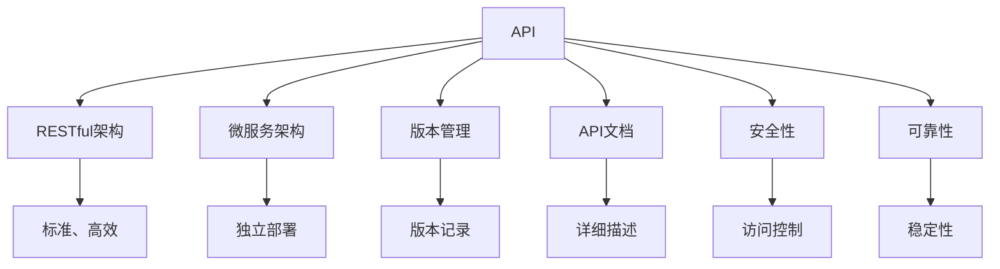

                 

# RESTful API设计：AI模型服务化的最佳实践

> 关键词：RESTful API, AI模型服务化, 微服务架构, HTTP协议, RESTful原则, 模型封装, API版本管理, API文档, API安全性

## 1. 背景介绍

### 1.1 问题由来

随着人工智能技术的迅猛发展，AI模型在自然语言处理、计算机视觉、语音识别等领域取得了显著进展。AI模型的使用也逐渐从研究阶段转向实际应用，广泛应用于智能推荐、智能客服、智能搜索、智能分析等多个业务场景中。如何高效、灵活、安全地将AI模型服务于不同业务，成为当前AI应用开发中的一个重要问题。

AI模型通常具有高精度、大计算量、不可解释等特点，难以直接融入传统的应用系统中。而通过API接口的形式封装AI模型，可以实现对模型的高效、灵活调用，同时保障模型的安全性与稳定性。RESTful API（Representational State Transfer, 表述性状态转移）作为互联网广泛使用的协议，具有标准、高效、可扩展的特性，非常适合用于AI模型的服务化。

### 1.2 问题核心关键点

在AI模型的服务化过程中，如何设计符合RESTful架构规范的API接口，是当前业界关注的焦点。RESTful API设计的主要考虑因素包括：
- 模型封装与版本管理
- 接口一致性与可扩展性
- 安全性与可靠性
- 性能与可伸缩性

本文将深入探讨基于RESTful架构的AI模型服务化方法，帮助开发者设计出高效、稳定、易用的API接口，服务于业务需求。

## 2. 核心概念与联系

### 2.1 核心概念概述

在RESTful API设计中，需要理解以下核心概念：

- **RESTful架构**：一种基于HTTP协议设计的软件架构风格，强调资源的操作、状态的无关性、无状态通信、统一接口等原则，适用于API的设计与开发。
- **API（Application Programming Interface, 应用程序编程接口）**：定义了应用程序间交互的通信协议、数据格式、调用方式等，是现代软件开发的重要组成部分。
- **微服务架构**：将应用程序拆分成多个独立运行、松散耦合的服务单元，通过轻量级通信协议进行通信，便于独立部署、扩展和维护。
- **版本管理**：API接口往往需要不断更新迭代，版本管理用于记录和管理不同版本的接口信息，方便新旧版本的切换和维护。
- **API文档**：提供API的详细描述和使用方法，帮助开发者快速上手和测试接口。
- **安全性与可靠性**：API接口的安全性包括访问控制、认证、授权等，可靠性包括接口的稳定性和容错性。

这些核心概念之间有着紧密的联系，共同构成了RESTful API设计的理论基础。

### 2.2 核心概念原理和架构的 Mermaid 流程图



该流程图展示了RESTful API设计的核心概念及其相互关系：

1. API接口基于RESTful架构，具有标准、高效的特点。
2. 微服务架构将API拆分成独立的服务单元，便于部署和扩展。
3. 版本管理记录API接口的不同版本，方便新旧版本切换。
4. API文档提供接口的详细描述，便于开发者快速上手。
5. 安全性与可靠性保障API接口的访问控制和稳定性。

通过这些核心概念的协同工作，可以设计出高效、稳定、易用的RESTful API接口。

## 3. 核心算法原理 & 具体操作步骤
### 3.1 算法原理概述

RESTful API设计的核心原理基于HTTP协议和RESTful原则。其主要思想是将API接口抽象为资源，通过HTTP方法对资源进行操作，实现对模型的服务化调用。RESTful API设计包括模型封装、接口定义、版本管理、安全性设计等多个方面。

### 3.2 算法步骤详解

#### 3.2.1 模型封装

1. **选择模型与框架**：选择合适的AI模型和框架进行封装，如TensorFlow、PyTorch等深度学习框架。
2. **定义输入与输出**：明确模型的输入和输出，定义数据格式和模型参数。
3. **封装模型**：使用Python或其他编程语言编写封装脚本，将模型封装成API接口。

#### 3.2.2 接口定义

1. **确定资源**：定义API接口的资源，通常以名词形式表示，如用户、商品、订单等。
2. **设计HTTP方法**：选择适合的HTTP方法（GET、POST、PUT、DELETE等）进行资源操作，如获取用户信息、创建用户订单等。
3. **定义路由规则**：根据资源和HTTP方法，定义路由规则，如/api/users、/api/orders等。
4. **设计输入与输出格式**：定义API接口的输入和输出格式，如JSON、XML等。

#### 3.2.3 版本管理

1. **版本标识**：为API接口定义版本号，如v1、v2等。
2. **版本记录**：记录不同版本的API接口信息，包括路由规则、输入输出格式、模型参数等。
3. **版本切换**：在API接口调用时，根据版本号选择对应的接口规则和模型参数。

#### 3.2.4 安全性设计

1. **认证与授权**：通过认证和授权机制，保障API接口的安全性。
2. **访问控制**：定义API接口的访问权限，如公共接口、私有接口等。
3. **API密钥**：为每个API接口分配唯一的密钥，通过密钥验证API请求的合法性。

### 3.3 算法优缺点

#### 3.3.1 优点

1. **标准与高效**：RESTful API基于HTTP协议，与Web技术高度兼容，易于集成和维护。
2. **可扩展性**：RESTful API采用微服务架构，便于扩展和升级。
3. **安全性与可靠性**：通过认证和授权机制，保障API接口的安全性和可靠性。

#### 3.3.2 缺点

1. **性能损耗**：RESTful API的HTTP请求需要额外的时间进行通信和数据处理，可能影响接口的响应速度。
2. **状态无关性**：RESTful API要求无状态通信，但一些业务场景下需要维护状态信息，可能影响接口的设计。

### 3.4 算法应用领域

RESTful API设计适用于各种基于AI模型的应用场景，包括但不限于：

- 自然语言处理：基于语言模型的问答系统、翻译系统、文本分析系统等。
- 计算机视觉：基于图像模型的图像识别、图像分类、人脸识别等。
- 语音识别：基于语音模型的语音识别、语音合成、语音情感分析等。
- 推荐系统：基于用户行为数据的推荐模型，如商品推荐、内容推荐等。
- 智能客服：基于对话模型的智能客服系统，提供自然语言对话和业务处理能力。

## 4. 数学模型和公式 & 详细讲解 & 举例说明

### 4.1 数学模型构建

RESTful API设计的数学模型主要涉及HTTP协议、RESTful原则、模型封装等概念，可以通过以下数学模型来描述：

1. **HTTP协议模型**：定义API接口的HTTP请求和响应模型，如下所示：

$$
\begin{align*}
HTTP Request: &\{Method, URI, Headers, Body\} \\
HTTP Response: &\{Status Code, Headers, Body\}
\end{align*}
$$

其中，Method表示HTTP方法，URI表示资源路径，Headers表示请求和响应的头信息，Body表示请求和响应的数据。

2. **RESTful原则模型**：定义RESTful API的资源和操作模型，如下所示：

$$
\begin{align*}
Resource: &\{URI, Resources\} \\
Operation: &\{HTTP Method, Operation\}
\end{align*}
$$

其中，URI表示资源路径，Resources表示资源对象，HTTP Method表示操作类型，Operation表示具体操作。

### 4.2 公式推导过程

#### 4.2.1 HTTP请求模型推导

假设API接口的HTTP请求为：

$$
\begin{align*}
HTTP Request: &\{GET, /users/1, Headers, Body\} \\
&\{Status Code, Headers, Body\}
\end{align*}
$$

其中，Method为GET，URI为/users/1，Headers和Body分别表示请求头和请求体。

HTTP响应的推导过程如下：

$$
\begin{align*}
HTTP Response: &\{Status Code, Headers, Body\}
\end{align*}
$$

其中，Status Code表示HTTP状态码，Headers和Body分别表示响应头和响应体。

#### 4.2.2 RESTful原则模型推导

假设API接口的资源为：

$$
\begin{align*}
Resource: &\{URI, Resources\}
\end{align*}
$$

其中，URI为/users，Resources表示用户资源对象。

RESTful原则下的操作推导如下：

$$
\begin{align*}
Operation: &\{GET, GetUser\} \\
&\{POST, CreateUser\} \\
&\{PUT, UpdateUser\} \\
&\{DELETE, DeleteUser\}
\end{align*}
$$

其中，GET表示获取用户信息，POST表示创建用户，PUT表示更新用户，DELETE表示删除用户。

### 4.3 案例分析与讲解

#### 4.3.1 示例

以基于TensorFlow的图像识别模型为例，分析RESTful API的设计过程。

1. **模型封装**：

假设使用TensorFlow框架封装了图像识别模型，模型接受一张图像作为输入，输出图像中的物体类别。

```python
import tensorflow as tf

def predict_image(image):
    # 预处理图像
    preprocessed_image = preprocess_image(image)
    # 加载模型
    model = load_model()
    # 进行预测
    predictions = model.predict(preprocessed_image)
    # 解码预测结果
    labels = decode_predictions(predictions)
    return labels
```

2. **接口定义**：

假设API接口定义如下：

- **URI**：/api/image_recognition
- **HTTP Method**：POST
- **输入格式**：图像数据，格式为base64编码的字符串。
- **输出格式**：JSON格式，包含物体类别和置信度。

3. **版本管理**：

假设API接口的版本号为v1，记录在配置文件中。

```json
{
    "version": "v1",
    "api": {
        "/api/image_recognition": {
            "method": "POST",
            "input": "base64_image",
            "output": {
                "label": "object类别",
                "confidence": "置信度"
            }
        }
    }
}
```

4. **安全性设计**：

假设API接口需要认证和授权机制，通过API密钥进行验证。

```python
import requests

def authenticate_request(api_key, url):
    headers = {"Authorization": f"Bearer {api_key}"}
    response = requests.get(url, headers=headers)
    if response.status_code == 200:
        return response.json()
    else:
        raise Exception(f"Authentication failed: {response.status_code}")
```

## 5. 项目实践：代码实例和详细解释说明

### 5.1 开发环境搭建

开发RESTful API接口需要以下工具和环境：

1. **Python**：推荐使用Python 3.8及以上版本，作为API开发的基础语言。
2. **Flask**：轻量级Web框架，用于搭建RESTful API接口。
3. **TensorFlow**：深度学习框架，用于封装和调用AI模型。
4. **Git**：版本控制系统，用于管理API接口的版本。

安装Flask和TensorFlow：

```bash
pip install flask tensorflow
```

### 5.2 源代码详细实现

以下是一个简单的TensorFlow图像识别模型的RESTful API接口实现示例。

1. **模型封装**：

```python
import tensorflow as tf

def predict_image(image):
    # 预处理图像
    preprocessed_image = preprocess_image(image)
    # 加载模型
    model = load_model()
    # 进行预测
    predictions = model.predict(preprocessed_image)
    # 解码预测结果
    labels = decode_predictions(predictions)
    return labels
```

2. **API接口实现**：

```python
from flask import Flask, request, jsonify

app = Flask(__name__)

@app.route("/api/image_recognition", methods=["POST"])
def image_recognition():
    # 获取请求数据
    data = request.json
    image = data["base64_image"]
    # 调用预测函数
    labels = predict_image(image)
    # 返回结果
    return jsonify(labels)

if __name__ == "__main__":
    app.run(debug=True)
```

3. **版本管理**：

使用Git版本控制系统记录API接口的版本信息。

```bash
git init
git add .
git commit -m "Initial commit"
git tag -a v1.0.0
```

4. **安全性设计**：

使用API密钥进行认证和授权。

```python
import requests

def authenticate_request(api_key, url):
    headers = {"Authorization": f"Bearer {api_key}"}
    response = requests.get(url, headers=headers)
    if response.status_code == 200:
        return response.json()
    else:
        raise Exception(f"Authentication failed: {response.status_code}")
```

### 5.3 代码解读与分析

1. **API接口的实现**：

使用Flask框架实现API接口，定义了`/api/image_recognition`的POST请求路径，接收base64编码的图像数据，调用`predict_image`函数进行预测，返回预测结果。

2. **版本管理**：

使用Git版本控制系统记录API接口的版本信息，通过`tag`命令定义版本号，便于管理和切换。

3. **安全性设计**：

使用API密钥进行认证和授权，确保只有授权用户可以访问API接口。

4. **API调用示例**：

```python
import requests

api_key = "your_api_key"
url = "http://localhost:5000/api/image_recognition"
headers = {"Authorization": f"Bearer {api_key}"}
data = {"base64_image": "your_base64_image"}
response = requests.post(url, headers=headers, json=data)
if response.status_code == 200:
    labels = response.json()
    print(labels)
else:
    raise Exception(f"Request failed: {response.status_code}")
```

## 6. 实际应用场景

### 6.1 智能推荐系统

智能推荐系统需要高效地调用推荐模型，生成个性化的推荐结果。RESTful API可以方便地封装和调用推荐模型，支持实时推荐和离线推荐。

#### 6.1.1 实时推荐

假设推荐系统需要根据用户的历史行为数据和实时点击行为，推荐相关的商品。可以通过RESTful API调用模型进行实时推荐。

```python
import requests

def recommend_items(user_id, click_items):
    api_key = "your_api_key"
    url = "http://localhost:5000/api/recommend_items"
    headers = {"Authorization": f"Bearer {api_key}"}
    data = {"user_id": user_id, "click_items": click_items}
    response = requests.post(url, headers=headers, json=data)
    if response.status_code == 200:
        items = response.json()
        return items
    else:
        raise Exception(f"Request failed: {response.status_code}")
```

#### 6.1.2 离线推荐

假设推荐系统需要对历史数据进行离线分析，生成推荐列表。可以通过RESTful API调用模型进行离线推荐。

```python
import requests

def generate_recommend_list(data_path):
    api_key = "your_api_key"
    url = "http://localhost:5000/api/generate_recommend_list"
    headers = {"Authorization": f"Bearer {api_key}"}
    data = {"data_path": data_path}
    response = requests.post(url, headers=headers, json=data)
    if response.status_code == 200:
        list = response.json()
        return list
    else:
        raise Exception(f"Request failed: {response.status_code}")
```

### 6.2 智能客服系统

智能客服系统需要高效地调用问答模型，解答用户的问题。RESTful API可以方便地封装和调用问答模型，支持多轮对话和知识库查询。

#### 6.2.1 多轮对话

假设智能客服系统需要与用户进行多轮对话，解答用户的问题。可以通过RESTful API调用模型进行多轮对话。

```python
import requests

def answer_question(user_message, context):
    api_key = "your_api_key"
    url = "http://localhost:5000/api/answer_question"
    headers = {"Authorization": f"Bearer {api_key}"}
    data = {"user_message": user_message, "context": context}
    response = requests.post(url, headers=headers, json=data)
    if response.status_code == 200:
        answer = response.json()
        return answer
    else:
        raise Exception(f"Request failed: {response.status_code}")
```

#### 6.2.2 知识库查询

假设智能客服系统需要查询知识库中的信息，解答用户的问题。可以通过RESTful API调用模型进行知识库查询。

```python
import requests

def query_knowledge_base(question):
    api_key = "your_api_key"
    url = "http://localhost:5000/api/query_knowledge_base"
    headers = {"Authorization": f"Bearer {api_key}"}
    data = {"question": question}
    response = requests.post(url, headers=headers, json=data)
    if response.status_code == 200:
        answer = response.json()
        return answer
    else:
        raise Exception(f"Request failed: {response.status_code}")
```

### 6.3 金融舆情监测系统

金融舆情监测系统需要高效地调用情感分析模型，监测金融市场的舆情变化。RESTful API可以方便地封装和调用情感分析模型，支持实时舆情分析和离线舆情分析。

#### 6.3.1 实时舆情分析

假设金融舆情监测系统需要实时监测市场舆情，分析舆情变化。可以通过RESTful API调用模型进行实时舆情分析。

```python
import requests

def analyze_market_sentiment(text):
    api_key = "your_api_key"
    url = "http://localhost:5000/api/analyze_market_sentiment"
    headers = {"Authorization": f"Bearer {api_key}"}
    data = {"text": text}
    response = requests.post(url, headers=headers, json=data)
    if response.status_code == 200:
        sentiment = response.json()
        return sentiment
    else:
        raise Exception(f"Request failed: {response.status_code}")
```

#### 6.3.2 离线舆情分析

假设金融舆情监测系统需要对历史数据进行离线分析，生成舆情报告。可以通过RESTful API调用模型进行离线舆情分析。

```python
import requests

def generate_market_sentiment_report(data_path):
    api_key = "your_api_key"
    url = "http://localhost:5000/api/generate_market_sentiment_report"
    headers = {"Authorization": f"Bearer {api_key}"}
    data = {"data_path": data_path}
    response = requests.post(url, headers=headers, json=data)
    if response.status_code == 200:
        report = response.json()
        return report
    else:
        raise Exception(f"Request failed: {response.status_code}")
```

## 7. 工具和资源推荐

### 7.1 学习资源推荐

1. **《RESTful Web Services》**：W. Roy Fielding著，详细介绍了RESTful架构的基本概念和设计原则。
2. **《RESTful Design Patterns》**：Leonard Richardson著，介绍了RESTful架构的常用设计模式和最佳实践。
3. **《Flask Web Development》**：Mitsuo Ota著，介绍了Flask框架的使用方法和API开发实践。
4. **《TensorFlow Model Garden》**：TensorFlow官方文档，提供了大量模型和API的示例代码。
5. **《RESTful APIs》**：Carlos Santana著，介绍了RESTful API的设计和开发方法。

通过学习这些资源，可以深入理解RESTful API的设计方法和最佳实践。

### 7.2 开发工具推荐

1. **Flask**：轻量级Web框架，易于上手和扩展。
2. **Swagger**：API文档生成工具，支持自动生成API文档和接口测试。
3. **Postman**：API接口测试工具，支持多种API请求方式和参数设置。
4. **Git**：版本控制系统，便于管理和记录API接口的版本。
5. **Jupyter Notebook**：Python开发工具，支持代码调试和数据可视化。

使用这些工具，可以显著提升RESTful API开发和测试的效率。

### 7.3 相关论文推荐

1. **《RESTful API Architecture》**：Richard Feldman, Jim Webber, Len Richardson, Sam Nicholson著，介绍了RESTful API架构的基本概念和设计原则。
2. **《Designing RESTful APIs》**：Kim Wiseman著，介绍了RESTful API的设计和开发方法。
3. **《Microservices with RESTful APIs》**：Nishant Prakash, Ben Roberts, Andrew Fox著，介绍了RESTful API在微服务架构中的应用。
4. **《API Versioning and Management》**：Robin E. George, Jonathan F. Arney, Jason H. Hall, Brian F. Merrill著，介绍了API版本管理和生命周期管理的最佳实践。
5. **《RESTful Web Services and Mashups》**：W. Roy Fielding著，介绍了RESTful Web服务的原理和应用。

这些论文提供了丰富的理论知识和实践经验，有助于深入理解RESTful API的设计和实现。

## 8. 总结：未来发展趋势与挑战

### 8.1 总结

本文对基于RESTful架构的AI模型服务化方法进行了全面系统的介绍。首先阐述了RESTful API在AI模型服务化中的应用背景和意义，明确了API接口设计的基本原则和方法。其次，从模型封装、接口定义、版本管理、安全性设计等方面，详细讲解了RESTful API设计的核心步骤和关键点。最后，通过实际应用场景的举例说明，展示了RESTful API在智能推荐、智能客服、金融舆情监测等领域的广泛应用。

通过本文的系统梳理，可以看到，RESTful API设计在AI模型服务化中具有重要的理论和实践价值。RESTful API不仅能够高效、灵活地服务化AI模型，还能通过API密钥等安全机制保障模型的安全性和可靠性。RESTful API的广泛应用，必将推动AI技术的更广泛落地，带来更多创新应用和业务价值。

### 8.2 未来发展趋势

展望未来，RESTful API设计将在AI模型服务化中呈现以下几个发展趋势：

1. **微服务架构的普及**：RESTful API将与微服务架构深度融合，进一步提升系统的可扩展性和可靠性。
2. **API版本管理的成熟**：API版本管理将得到更加广泛的应用，支持动态版本切换和版本回退，提升系统的稳定性和兼容性。
3. **API安全性的增强**：API安全性将得到进一步加强，通过身份认证、授权机制、API密钥等手段，保障系统的安全性和稳定性。
4. **API文档和测试的优化**：API文档和测试将得到优化，使用自动生成和自动化测试工具，提升API开发和维护的效率。
5. **API性能的优化**：API性能将得到进一步优化，通过缓存、负载均衡、API网关等技术，提升API的响应速度和可伸缩性。

这些趋势将推动RESTful API设计向更加高效、安全、易用、可靠的方向发展，进一步拓展AI模型的应用边界。

### 8.3 面临的挑战

尽管RESTful API设计在AI模型服务化中已经取得了显著进展，但仍面临诸多挑战：

1. **API接口的复杂性**：API接口的设计需要考虑多方面因素，如数据格式、输入输出、版本管理等，容易陷入复杂性和冗余性的困境。
2. **API接口的安全性**：API接口的安全性问题，如认证、授权、访问控制等，仍需进一步加强，避免安全漏洞和数据泄露。
3. **API接口的性能**：API接口的性能问题，如响应时间、吞吐量等，仍需进一步优化，保证系统的稳定性和可伸缩性。
4. **API接口的兼容性**：API接口的兼容性问题，如版本切换、API文档中各个版本的维护等，仍需进一步解决，提升系统的稳定性和兼容性。

这些挑战需要学界和业界共同努力，持续探索和优化，推动RESTful API设计向更加高效、安全、易用、可靠的方向发展。

### 8.4 研究展望

面对RESTful API设计所面临的挑战，未来的研究需要在以下几个方面寻求新的突破：

1. **API接口的简化与标准化**：通过简化API接口的设计，减少冗余和复杂性，提升API的易用性和兼容性。
2. **API接口的安全性增强**：引入更多的安全机制，如OAuth2、JWT等，提升API接口的安全性和可靠性。
3. **API接口的性能优化**：通过缓存、负载均衡、API网关等技术，优化API接口的响应速度和可伸缩性。
4. **API接口的自动化测试**：引入自动化的API测试工具，提升API接口的测试效率和覆盖率。
5. **API接口的持续集成与持续部署**：引入持续集成与持续部署(CI/CD)工具，优化API接口的开发和部署流程。

这些研究方向的探索，必将推动RESTful API设计向更加高效、安全、易用、可靠的方向发展，为AI模型的服务化提供更加坚实的技术基础。

## 9. 附录：常见问题与解答

**Q1：什么是RESTful API？**

A: RESTful API是基于RESTful架构风格的API接口，使用HTTP协议进行通信，支持资源的定义和操作，具有标准、高效、可扩展的特点。

**Q2：如何设计RESTful API接口？**

A: 设计RESTful API接口需要考虑资源、HTTP方法、路由规则、输入输出格式等多个因素。首先需要明确API接口的资源，选择适合的HTTP方法进行资源操作，定义路由规则和输入输出格式，最后进行安全性设计和版本管理。

**Q3：RESTful API设计有哪些最佳实践？**

A: RESTful API设计遵循RESTful架构的基本原则，如资源的操作、状态的无关性、无状态通信、统一接口等。设计过程中需要考虑安全性、可靠性、性能等因素，使用API密钥、认证、授权等手段保障API接口的安全性，通过缓存、负载均衡等技术提升API接口的性能。

**Q4：RESTful API的性能瓶颈有哪些？**

A: RESTful API的性能瓶颈主要包括HTTP请求的开销、模型调用的开销、数据传输的开销等。为了提升RESTful API的性能，可以通过缓存、负载均衡、API网关等技术优化性能，减少响应时间和提高吞吐量。

**Q5：RESTful API接口的版本管理有哪些方式？**

A: RESTful API接口的版本管理可以采用多种方式，如URL版本、HTTP头版本、查询参数版本等。使用URL版本管理时，可以在URL中增加版本号，如/api/v1/users；使用HTTP头版本管理时，可以在HTTP请求头中增加版本号，如"Content-Type: application/json; version=1.0"；使用查询参数版本管理时，可以在查询参数中增加版本号，如/api/users?version=1.0。

通过这些回答，可以帮助读者更好地理解RESTful API设计的核心概念和方法，为未来的API开发和优化提供参考。

