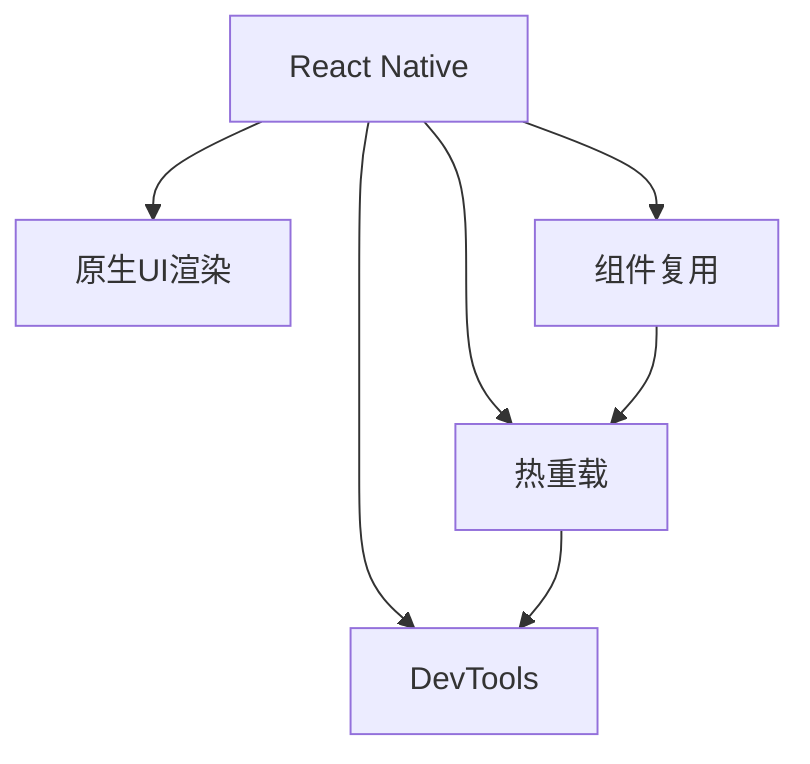
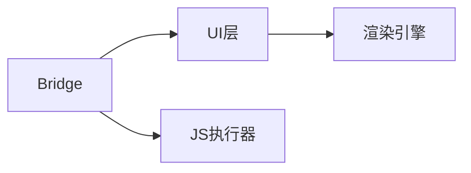

                 

# React Native：构建跨平台移动应用程序

> 关键词：React Native, 移动开发, 跨平台, 应用构建, JavaScript, Native API, 性能优化

## 1. 背景介绍

### 1.1 问题由来

随着移动互联网的迅猛发展，越来越多的企业和个人希望通过构建移动应用程序来提升业务和用户体验。传统的原生应用开发需要分别针对iOS和Android平台进行单独开发，成本高、周期长。而React Native的出现，使得开发者可以使用JavaScript和React框架，一次性构建跨平台移动应用，大大提升了开发效率。

React Native由Facebook在2015年推出，结合了React的声明式编程特性和原生UI渲染，能够使开发者使用一套代码库实现iOS和Android平台的兼容开发。自推出以来，React Native迅速成为移动开发领域的热门技术，广泛应用于电商、社交、游戏、教育等多个领域。

### 1.2 问题核心关键点

React Native的核心在于将JavaScript代码转换为原生UI，并结合了JavaScript生态系统的成熟性，使得开发者可以更快速、灵活地构建跨平台应用。它具备以下关键优势：

- 跨平台开发：一次开发，多平台部署，降低成本和开发周期。
- 共享组件库：React Native拥有丰富的第三方组件库，便于快速构建界面。
- 热重载和DevTools：热重载功能使得开发者能够即时预览修改，DevTools提供了实时调试和性能分析工具。
- 原生性能：React Native通过原生组件桥接，实现了接近原生应用的性能表现。

### 1.3 问题研究意义

React Native在移动互联网时代具有重要的应用价值：

1. 降低成本：跨平台开发减少了雇佣多个原生开发者的需求，降低了开发成本。
2. 提升效率：通过组件复用和热重载功能，加快了开发和迭代速度。
3. 灵活适配：开发者可以在不改变代码的情况下，快速适配不同平台的用户界面和交互逻辑。
4. 扩展能力：随着React生态系统的不断壮大，React Native的组件和工具库将不断丰富，助力应用功能拓展。
5. 促进协作：React Native提供了统一的开发语言和框架，使得跨团队协作更加便捷。

## 2. 核心概念与联系

### 2.1 核心概念概述

为了更好地理解React Native的核心概念，本节将介绍几个关键概念及其相互关系：

- **React Native**：由Facebook推出的跨平台移动应用框架，结合了React的声明式编程和原生UI渲染，使开发者能够使用JavaScript和React构建iOS和Android应用。
- **原生UI渲染**：通过原生组件桥接，React Native能够将JavaScript代码渲染为原生UI，实现接近原生的性能表现。
- **组件复用**：React Native拥有丰富的第三方组件库，开发者可以直接使用这些组件构建应用界面。
- **热重载**：React Native提供了热重载功能，使开发者能够在开发过程中即时预览修改，无需频繁重启应用。
- **DevTools**：React Native集成了Chrome DevTools，提供了实时调试和性能分析工具，帮助开发者快速定位问题。

这些核心概念通过Mermaid流程图展示如下：



### 2.2 核心概念原理和架构

React Native的核心架构包括以下几个关键组件：

- **Bridge**：负责JavaScript代码和原生代码之间的通信，通过Bridge组件桥接将JavaScript调用映射到原生代码。
- **UI层**：包括原生UI和React Native自己的组件库，开发者可以通过Bridge调用原生UI元素。
- **渲染引擎**：负责将React Native组件树渲染为原生UI，实现跨平台渲染。
- **JS执行器**：负责执行JavaScript代码，并管理桥接通信。

下图展示了React Native的核心架构：



### 2.3 核心概念联系

React Native的核心概念之间相互联系，共同构成了跨平台移动应用开发的基础。Bridge负责组件之间的通信，UI层提供了跨平台渲染的能力，渲染引擎和JS执行器确保了JavaScript代码能够正确渲染为原生UI，并实现了组件复用、热重载和DevTools等功能。

这些核心概念的有机结合，使得React Native能够在提升开发效率的同时，确保应用性能和用户体验。开发者可以在不牺牲原生性能的前提下，快速构建出跨平台的移动应用。

## 3. 核心算法原理 & 具体操作步骤

### 3.1 算法原理概述

React Native的实现原理基于React框架，通过Bridge将JavaScript代码桥接到原生代码，实现跨平台渲染。其核心算法包括以下几个步骤：

1. **组件桥接**：React Native将React组件通过Bridge转换为原生UI组件。
2. **状态管理**：React Native使用Redux或MobX等状态管理库，管理组件间的通信和数据更新。
3. **事件处理**：React Native通过Bridge将JavaScript事件处理函数映射到原生代码，实现事件监听。
4. **性能优化**：React Native采用原生渲染方式，并结合了虚拟DOM技术，优化了性能表现。

### 3.2 算法步骤详解

React Native的开发过程主要包括以下几个关键步骤：

**Step 1: 搭建开发环境**

1. 安装Node.js和npm，并创建React Native项目：
```bash
npx react-native init MyApp
```
2. 安装Android Studio和Xcode，配置Android和iOS开发环境。

**Step 2: 编写代码**

1. 使用React Native的组件和API编写应用代码，如：
```javascript
import React, { Component } from 'react';
import { View, Text, StyleSheet } from 'react-native';

export default class App extends Component {
  render() {
    return (
      <View style={styles.container}>
        <Text style={styles.welcome}>
          Welcome to React Native!
        </Text>
      </View>
    );
  }
}

const styles = StyleSheet.create({
  container: {
    flex: 1,
    justifyContent: 'center',
    alignItems: 'center',
    backgroundColor: '#F5FCFF',
  },
  welcome: {
    fontSize: 20,
    textAlign: 'center',
    margin: 10,
  },
});
```

2. 在App.js文件中进行组件渲染：
```javascript
import App from './App';
import { Platform } from 'react-native';

export default class MyApp extends Component {
  render() {
    return (
      <Platform.OS === 'ios' ? <App /> : <App />
    );
  }
}
```

**Step 3: 运行应用**

1. 启动应用：
```bash
npx react-native run-ios
npx react-native run-android
```
2. 使用模拟器或设备进行测试，观察应用效果。

**Step 4: 调试和优化**

1. 使用DevTools进行调试，例如设置断点、查看变量值、记录性能指标等。
2. 使用热重载功能，即时查看代码修改效果，无需频繁重启应用。

### 3.3 算法优缺点

React Native的主要优点包括：

- 跨平台开发：一次开发，多平台部署，节省了原生开发的时间和成本。
- 组件复用：丰富的第三方组件库和React组件，提高了开发效率。
- 热重载：开发过程中即时预览修改，加速迭代过程。
- DevTools：实时调试和性能分析，提高开发质量。

然而，React Native也存在一些缺点：

- 性能瓶颈：在大量组件和数据驱动下，可能会出现性能问题。
- 复杂性：原生组件桥接和状态管理可能会增加开发复杂性。
- 社区依赖：依赖原生组件库和第三方工具库，增加了维护难度。

### 3.4 算法应用领域

React Native广泛应用于各类移动应用开发领域，包括：

- 电商：构建商品展示、购物车、订单管理等应用。
- 社交：实现聊天室、朋友圈、消息推送等功能。
- 游戏：提供游戏界面、角色交互、动画效果等。
- 教育：开发在线学习、互动教学、作业批改等功能。
- 新闻：搭建新闻阅读、订阅推送、广告投放等应用。

## 4. 数学模型和公式 & 详细讲解 & 举例说明

### 4.1 数学模型构建

React Native的数学模型主要集中在如何通过JavaScript和Bridge组件桥接到原生UI渲染。假设开发者编写的React组件为 $C$，Bridge将其映射为原生UI组件 $O$，如下图所示：


其中，$C$ 和 $O$ 分别表示React组件和原生UI组件，箭头表示Bridge桥接作用。

### 4.2 公式推导过程

React Native的桥接机制可以通过以下公式来描述：

$$
O = C_B(C)
$$

其中，$C_B$ 表示Bridge组件桥接函数，将React组件 $C$ 转换为原生UI组件 $O$。假设 $C$ 和 $O$ 之间的关系为 $f$，则上述公式可以表示为：

$$
O = f(C)
$$

### 4.3 案例分析与讲解

假设开发者编写了一个简单的React组件，用于显示用户信息：

```javascript
import React, { Component } from 'react';
import { View, Text, StyleSheet } from 'react-native';

export default class User extends Component {
  render() {
    const { name, age } = this.props;
    return (
      <View style={styles.container}>
        <Text style={styles.name}>{name}</Text>
        <Text style={styles.age}>{age}</Text>
      </View>
    );
  }
}

const styles = StyleSheet.create({
  container: {
    flex: 1,
    justifyContent: 'center',
    alignItems: 'center',
    backgroundColor: '#F5FCFF',
  },
  name: {
    fontSize: 20,
    textAlign: 'center',
    margin: 10,
  },
  age: {
    fontSize: 20,
    textAlign: 'center',
    margin: 10,
  },
});
```

通过Bridge组件桥接，该组件可以被渲染为原生UI，例如在iOS平台上：

```objc
#import <React/RCTBridgeModule.h>

@interface RCTUserInfo : NSObject <RCTBridgeModule>
@property (nonatomic, strong) NSDictionary *userInfo;
@end

@implementation RCTUserInfo

@dynamic userInfo;

- (NSString *)name {
  return self.userInfo[@"name"];
}

- (NSString *)age {
  return self.userInfo[@"age"];
}

@end
```

在Android平台上，可以使用Kotlin编写类似的代码。

通过上述案例可以看出，React Native通过Bridge将JavaScript代码转换为原生UI，实现了跨平台渲染。开发者可以在React组件中定义UI界面和数据逻辑，桥接到原生平台上进行渲染。

## 5. 项目实践：代码实例和详细解释说明

### 5.1 开发环境搭建

为了顺利搭建React Native开发环境，需要安装以下软件和工具：

1. Node.js和npm：安装最新稳定版本，建议使用npx。
2. Android Studio和Xcode：分别安装Android和iOS开发环境。
3. React Native CLI：安装最新版，并配置本地环境。

安装完成后，通过以下命令初始化React Native项目：

```bash
npx react-native init MyApp
```

### 5.2 源代码详细实现

在App.js文件中，编写一个简单的计数器应用：

```javascript
import React, { Component } from 'react';
import { View, Text, StyleSheet, Button } from 'react-native';

export default class App extends Component {
  constructor(props) {
    super(props);
    this.state = { count: 0 };
  }

  increment() {
    this.setState({ count: this.state.count + 1 });
  }

  render() {
    return (
      <View style={styles.container}>
        <Text style={styles.title}>
          Counter
        </Text>
        <Text style={styles.count}>{this.state.count}</Text>
        <Button title="Increment" onPress={this.increment.bind(this)} />
      </View>
    );
  }
}

const styles = StyleSheet.create({
  container: {
    flex: 1,
    justifyContent: 'center',
    alignItems: 'center',
    backgroundColor: '#F5FCFF',
  },
  title: {
    fontSize: 20,
    textAlign: 'center',
    margin: 10,
  },
  count: {
    fontSize: 30,
    textAlign: 'center',
    margin: 10,
  },
});
```

在AndroidManifest.xml文件中，添加必要权限：

```xml
<uses-permission android:name="android.permission.INTERNET" />
```

在info.plist文件中，添加必要的配置项：

```xml
<key>com.facebook.react.version</key>
<string>56.0.0</string>
```

### 5.3 代码解读与分析

React Native的核心组件库提供了丰富的UI组件，开发者可以轻松构建各种界面。在这个简单的计数器应用中，我们使用了View、Text、Button等组件。

开发者可以通过setState方法更新组件状态，实现数据驱动的动态更新。Button组件的onPress事件绑定increment方法，用于增加计数器的值。

### 5.4 运行结果展示

在模拟器或设备上运行应用，可以看到计数器从0开始递增，并显示在屏幕上。

## 6. 实际应用场景

### 6.1 电商应用

电商应用是React Native的重要应用场景之一。React Native可以帮助电商企业快速构建商品展示、购物车、订单管理等功能。以下是一个简单的商品展示应用：

```javascript
import React, { Component } from 'react';
import { View, Text, StyleSheet, Image, TouchableOpacity } from 'react-native';

export default class Product extends Component {
  constructor(props) {
    super(props);
    this.state = { quantity: 0 };
  }

  render() {
    const { name, price, image } = this.props;
    return (
      <TouchableOpacity onPress={() => this.setState({ quantity: this.state.quantity + 1 })}>
        <View style={styles.container}>
          <Image style={styles.image} source={{ uri: image }} />
          <Text style={styles.name}>{name}</Text>
          <Text style={styles.price}>{price}</Text>
          <Text style={styles.quantity}>{this.state.quantity}</Text>
        </View>
      </TouchableOpacity>
    );
  }
}

const styles = StyleSheet.create({
  container: {
    flex: 1,
    flexDirection: 'column',
    backgroundColor: '#F5FCFF',
  },
  image: {
    width: 100,
    height: 100,
    margin: 10,
  },
  name: {
    fontSize: 20,
    textAlign: 'center',
    margin: 10,
  },
  price: {
    fontSize: 20,
    textAlign: 'center',
    margin: 10,
  },
  quantity: {
    fontSize: 20,
    textAlign: 'center',
    margin: 10,
  },
});
```

### 6.2 社交应用

社交应用是React Native的另一大应用场景。React Native可以帮助开发者快速构建聊天室、朋友圈、消息推送等功能。以下是一个简单的聊天室应用：

```javascript
import React, { Component } from 'react';
import { View, Text, StyleSheet, TextInput, Button } from 'react-native';

export default class Chat extends Component {
  constructor(props) {
    super(props);
    this.state = { messages: [], inputText: '' };
  }

  componentDidMount() {
    this.fetchMessages();
  }

  fetchMessages() {
    // 从服务器获取消息列表
    fetch('https://example.com/messages')
      .then(response => response.json())
      .then(data => this.setState({ messages: data }));
  }

  handleInput(text) {
    this.setState({ inputText: text });
  }

  sendMessage() {
    fetch('https://example.com/send', {
      method: 'POST',
      headers: {
        'Content-Type': 'application/json',
      },
      body: JSON.stringify({ message: this.state.inputText }),
    })
      .then(response => response.json())
      .then(data => {
        this.setState({
          messages: [...this.state.messages, data.message],
          inputText: '',
        });
      });
  }

  render() {
    return (
      <View style={styles.container}>
        {this.state.messages.map((message, index) => (
          <Text key={index}>{message}</Text>
        ))}
        <TextInput style={styles.input} onChangeText={this.handleInput.bind(this)} value={this.state.inputText} />
        <Button title="Send" onPress={this.sendMessage.bind(this)} />
      </View>
    );
  }
}

const styles = StyleSheet.create({
  container: {
    flex: 1,
    backgroundColor: '#F5FCFF',
  },
  input: {
    height: 40,
    margin: 10,
  },
});
```

### 6.3 游戏应用

游戏应用也是React Native的重要应用场景。React Native可以帮助开发者快速构建游戏界面、角色交互、动画效果等功能。以下是一个简单的拼图游戏应用：

```javascript
import React, { Component } from 'react';
import { View, Text, StyleSheet, Image, Animated } from 'react-native';

const tiles = [
  '1.png',
  '2.png',
  '3.png',
  '4.png',
  '5.png',
  '6.png',
  '7.png',
  '8.png',
  '9.png',
  '10.png',
];

export default class Puzzle extends Component {
  constructor(props) {
    super(props);
    this.state = { tiles: tiles, selectedTile: 0 };
    this.animations = Animated.timing(this.state.selectedTile, {
      toValue: 1,
      duration: 1000,
      useNativeDriver: true,
    });
  }

  render() {
    return (
      <View style={styles.container}>
        {tiles.map((tile, index) => (
          <Animated.Image
            key={index}
            style={[
              styles.tile,
              this.state.selectedTile === index ? styles.selected : styles.unselected,
            ]}
            source={{ uri: tile }}
            resizeMode="cover"
          />
        ))}
      </View>
    );
  }
}

const styles = StyleSheet.create({
  container: {
    flex: 1,
    backgroundColor: '#F5FCFF',
  },
  tile: {
    width: 100,
    height: 100,
    margin: 10,
  },
  selected: {
    opacity: 1,
    transform: [{ rotate: this.animations }],
  },
  unselected: {
    opacity: 0.5,
  },
});
```

## 7. 工具和资源推荐

### 7.1 学习资源推荐

为了帮助开发者快速掌握React Native开发技术，这里推荐一些优质的学习资源：

1. React Native官方文档：包含了完整的API和组件库介绍，以及详细的开发指南。
2. React Native教程：由阮一峰老师的教程，全面介绍了React Native的开发环境和核心技术。
3. React Native入门实战：通过实战项目，深入理解React Native的应用场景和开发流程。
4. React Native进阶实战：通过多个进阶项目，深入理解React Native的高级特性和最佳实践。

### 7.2 开发工具推荐

React Native开发离不开工具的支持，以下是几款常用的开发工具：

1. Visual Studio Code：轻量级编辑器，支持JavaScript和React开发，配置简单，功能强大。
2. Expo：React Native的官方平台，提供快速部署、组件库和DevTools等功能，适合快速开发。
3. Xcode和Android Studio：iOS和Android的官方开发工具，支持原生代码和React Native代码混合开发。
4. React Native CLI：命令行工具，支持创建、构建、打包和部署React Native应用。

### 7.3 相关论文推荐

React Native作为跨平台开发的新一代技术，不断推陈出新。以下是几篇经典论文，推荐阅读：

1. "React Native: A JavaScript Framework for Building Native Modules"（React Native 原理和设计）
2. "React Native: A Development Framework for Mobile Apps"（React Native 应用开发框架）
3. "React Native: A Cross-Platform UI Development Framework"（React Native 跨平台 UI 开发框架）

这些论文详细介绍了React Native的核心原理和设计思想，能够帮助开发者深入理解React Native的机制和技术细节。

## 8. 总结：未来发展趋势与挑战

### 8.1 研究成果总结

React Native作为跨平台移动应用开发的领先技术，自推出以来不断发展，已经成为移动开发的重要工具。React Native的核心原理和实现机制不断优化，性能和用户体验不断提升，开发效率不断提高。开发者可以通过React Native构建高效、灵活、易维护的跨平台应用。

### 8.2 未来发展趋势

React Native的未来发展趋势包括：

1. 组件库丰富：React Native的第三方组件库将不断丰富，提供更多功能性和美观性更强的UI组件。
2. 性能优化：通过更高效的渲染引擎和更智能的桥接机制，React Native将实现更流畅的用户体验。
3. 生态系统完善：React Native生态系统将不断完善，更多工具、插件和扩展将涌现，提升开发效率。
4. 社区活跃：React Native社区将继续活跃，开发者和贡献者将不断涌现，推动React Native的进步。
5. 技术融合：React Native将与更多技术融合，如人工智能、大数据、区块链等，拓展更多应用场景。

### 8.3 面临的挑战

尽管React Native已经取得了显著进展，但未来发展仍面临以下挑战：

1. 性能瓶颈：React Native在处理大量组件和复杂数据时，可能会出现性能问题。
2. 开发复杂性：原生组件桥接和状态管理可能会增加开发复杂性。
3. 社区依赖：依赖原生组件库和第三方工具库，增加了维护难度。
4. 跨平台一致性：不同平台的用户界面和交互逻辑可能存在不一致，需要更多优化。
5. 生态发展：React Native生态系统需要更多支持和完善，才能更好地支撑开发者应用开发。

### 8.4 研究展望

未来的React Native研究将集中在以下几个方向：

1. 性能优化：开发更高效的渲染引擎和桥接机制，提升应用性能。
2. 组件复用：设计更灵活、复用性更强的组件库，减少开发成本。
3. 社区建设：建立更活跃的开发者社区，推动技术进步和应用普及。
4. 技术融合：与其他技术融合，拓展更多应用场景，提升应用价值。
5. 安全性和可维护性：提升应用的安全性和可维护性，保障用户数据安全。

总之，React Native作为跨平台移动应用开发的重要工具，其未来发展前景广阔。开发者应积极探索和实践React Native的最新技术，不断提升应用性能和用户体验，推动React Native在各个领域的应用。

---

作者：禅与计算机程序设计艺术 / Zen and the Art of Computer Programming

