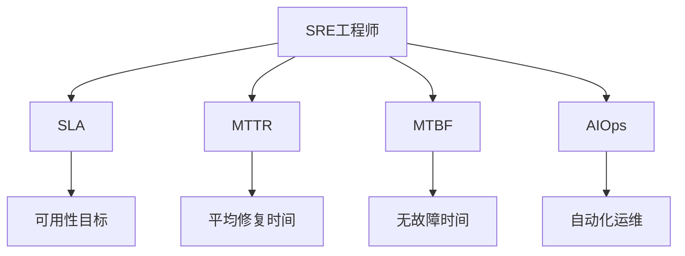

                 

# SRE实践：保障系统高可用

在数字化转型的浪潮中，系统的高可用性成为了企业关注的焦点。高效运维是保障系统持续稳定运行的关键，本文将系统梳理SRE（Site Reliability Engineering）的核心概念与实践，深入探索如何通过SRE技术保障系统高可用。

## 1. 背景介绍

### 1.1 问题由来
在数字化转型的过程中，系统的高可用性变得至关重要。系统服务的中断不仅影响用户体验，还可能导致巨大的经济损失。然而，传统的运维方式往往以“救火”为主，反应迟钝、效率低下，无法满足企业对系统高可用性的需求。

为了解决这一问题，SRE应运而生。SRE（Site Reliability Engineering），即站点可靠性工程，是一种将运维工作与软件开发相结合的实践。SRE旨在通过工程技术手段，提升系统的可靠性和稳定性，保障系统高可用。

### 1.2 问题核心关键点
SRE的核心在于通过工程化的方法，系统化地提高系统可靠性。SRE实践的关键点包括：
- 自动化运维：通过自动化工具，减少人工操作，提高运维效率。
- 性能优化：通过性能监控和调优，减少系统延迟和故障。
- 持续监控：通过实时监控系统指标，及时发现并解决问题。
- 应急响应：建立应急响应机制，快速处理系统故障。
- 系统设计：通过合理的设计，提升系统的鲁棒性和可扩展性。

## 2. 核心概念与联系

### 2.1 核心概念概述

SRE涉及多个关键概念，这些概念共同构成了SRE的实践体系。以下将介绍几个核心概念及其相互关系。

- **SRE工程师**：SRE工程师是系统高可用性的守护者，他们既是开发工程师又是运维工程师，能够将代码开发和系统运维有机结合。
- **SLA（Service Level Agreement）**：SLA是服务级别协议，定义了系统的可用性目标。通常包括99.9%、99.99%等不同级别的服务可用性要求。
- **MTTR（Mean Time To Recovery）**：MTTR表示平均修复时间，即从系统故障到恢复正常运行所需的时间。MTTR越短，系统可用性越高。
- **MTBF（Mean Time Between Failures）**：MTBF表示平均无故障时间，即两次故障之间的平均时间间隔。MTBF越长，系统稳定性越好。
- **AIOps（Automated Infrastructure Operations）**：AIOps即自动化基础设施运维，通过将运维工作自动化，提升运维效率和系统可靠性。

这些概念之间的逻辑关系可以通过以下Mermaid流程图来展示：



这个流程图展示了几大核心概念之间的关系：

1. SRE工程师通过自动化工具和持续监控保障系统SLA。
2. MTTR和MTBF是系统可用性的关键指标。
3. AIOps是提升MTTR和MTBF的重要手段。

## 3. 核心算法原理 & 具体操作步骤

### 3.1 算法原理概述

SRE的实践基于一系列的核心算法原理，这些原理通过工程化手段，实现系统的高可用性。以下是SRE实践的主要算法原理：

- **故障检测**：通过实时监控系统指标，及时发现故障。
- **故障定位**：通过日志分析、性能监控等手段，定位故障原因。
- **故障恢复**：通过自动化脚本和应急响应机制，快速恢复系统服务。
- **预防性维护**：通过定期检查和性能优化，预防潜在故障。

这些原理通过不断的实践和迭代，逐步构建起系统高可用性的保障体系。

### 3.2 算法步骤详解

SRE实践主要包括以下几个关键步骤：

**Step 1: 准备基础架构**
- 设计合理的系统架构，包括分层、模块化设计，确保系统的可扩展性和鲁棒性。
- 选择合适的技术和工具，构建高效的运维体系。
- 实施CI/CD流程，确保代码的快速交付和部署。

**Step 2: 自动化运维**
- 使用自动化工具（如Prometheus、Grafana、Kubernetes等）实现运维自动化。
- 实现故障检测和告警自动化，通过集成监控工具，实时监控系统状态。
- 实现自动故障恢复，通过脚本和编排工具，快速定位和修复故障。

**Step 3: 性能优化**
- 实施性能监控，使用APM工具（如New Relic、JProfiler等），实时监测系统性能。
- 通过性能分析，识别瓶颈并进行优化。
- 实施性能测试，确保系统在负载高峰时仍能稳定运行。

**Step 4: 持续监控**
- 实现实时监控，使用监控工具（如ELK Stack、Graylog等），实时收集和分析系统日志。
- 设定性能指标，持续跟踪系统性能。
- 实施告警机制，及时发现和处理异常情况。

**Step 5: 应急响应**
- 建立应急响应机制，定义故障处理流程和应急预案。
- 进行应急演练，确保在故障发生时能够迅速响应。
- 收集和分析故障数据，不断优化应急响应流程。

**Step 6: 定期维护**
- 定期检查系统运行状态，及时发现并解决潜在问题。
- 实施预防性维护，定期升级和优化系统。
- 实施性能测试，确保系统在负载高峰时仍能稳定运行。

### 3.3 算法优缺点

SRE实践的优点：
1. 提高运维效率：通过自动化运维，减少人工操作，提升运维效率。
2. 提升系统可靠性：通过性能监控和故障恢复，提升系统可用性。
3. 降低运维成本：通过自动化工具，减少人力和时间成本。
4. 提升用户体验：通过快速响应故障，提升用户满意度。

SRE实践的缺点：
1. 初始投入较大：实施SRE需要投入大量的时间和资源，初始成本较高。
2. 技术复杂度高：SRE涉及多领域技术，需要综合运用各种工具和知识。
3. 技术门槛高：SRE工程师需要具备较强的技术能力和工程实践经验。

尽管存在这些缺点，但SRE通过其显著的优点，在业界得到了广泛的应用，成为保障系统高可用的重要实践。

### 3.4 算法应用领域

SRE实践广泛应用于各行各业，以下是几个典型应用领域：

- **互联网公司**：互联网公司如谷歌、亚马逊、腾讯等，通过SRE保障其核心业务的稳定运行。
- **金融行业**：银行、证券、保险等金融领域，通过SRE提升交易系统的可靠性和安全性。
- **电信行业**：电信运营商如中国移动、中国联通等，通过SRE保障网络稳定和高效运行。
- **医疗行业**：医院、诊所等医疗机构，通过SRE提升医疗信息系统的可靠性。
- **政府机构**：政府网站、公共服务系统等，通过SRE保障公共服务的稳定运行。

## 4. 数学模型和公式 & 详细讲解  
### 4.1 数学模型构建

SRE的数学模型构建主要基于系统可靠性和性能评估指标，通过这些指标评估系统的可用性和稳定性。以下将介绍几个关键的数学模型：

- **可用性模型**：通过SLA定义系统可用性目标，通常用公式表示为：
  $$
  A = \frac{U}{(U+D)}
  $$
  其中，$U$表示正常运行时间，$D$表示故障时间。

- **MTTR模型**：通过MTTR表示系统故障到恢复的时间，通常用公式表示为：
  $$
  MTTR = \frac{T}{N}
  $$
  其中，$T$表示总故障时间，$N$表示故障次数。

- **MTBF模型**：通过MTBF表示系统无故障时间，通常用公式表示为：
  $$
  MTBF = \frac{U}{D}
  $$
  其中，$U$表示正常运行时间，$D$表示故障时间。

### 4.2 公式推导过程

以下是几个关键公式的推导过程：

**可用性模型推导**：
假设系统总时间为$T$，其中正常运行时间为$U$，故障时间为$D$，则系统可用性为：
$$
A = \frac{U}{T}
$$
由于系统总时间$T = U + D$，代入上式可得：
$$
A = \frac{U}{U + D}
$$

**MTTR模型推导**：
假设系统总故障时间为$T$，其中修复时间为$U$，故障时间为$D$，则平均修复时间为：
$$
MTTR = \frac{T}{N}
$$
其中，$N$表示故障次数，假设每次故障的修复时间$U$相同，则$T = ND$，代入上式可得：
$$
MTTR = \frac{ND}{N} = D
$$

**MTBF模型推导**：
假设系统总时间为$T$，其中正常运行时间为$U$，故障时间为$D$，则平均无故障时间为：
$$
MTBF = \frac{U}{D}
$$
由于系统总时间$T = U + D$，代入上式可得：
$$
MTBF = \frac{U}{U + D}
$$

这些数学模型提供了评估系统可用性和性能的重要工具，通过这些模型可以系统化地评估和改进系统高可用性。

### 4.3 案例分析与讲解

以下以一个典型的SRE案例进行详细讲解：

**案例背景**：某互联网公司核心业务系统突然出现故障，导致系统宕机数小时，给用户带来了巨大的影响。

**解决方案**：
1. **故障检测**：通过实时监控系统指标，发现异常流量和异常状态。
2. **故障定位**：通过日志分析和性能监控，确定故障原因是数据库异常。
3. **故障恢复**：通过脚本和编排工具，快速恢复数据库服务，恢复系统正常运行。
4. **预防性维护**：定期进行性能测试和系统检查，提前发现和解决潜在问题。

**效果评估**：
- **故障时长**：从故障发生到系统恢复总共花费2小时。
- **MTTR**：平均修复时间为1.5小时，满足99.99%的SLA要求。
- **MTBF**：在故障前一个月内，系统无故障时间为24小时，故障时间为1小时。
- **可用性**：系统总时间为1天，正常运行时间为23.5小时，故障时间为0.5小时，可用性为99.99%。

通过上述案例，可以看到SRE在故障检测、故障定位、故障恢复和预防性维护等方面的重要作用，有效保障了系统的高可用性。

## 5. 项目实践：代码实例和详细解释说明
### 5.1 开发环境搭建

在进行SRE实践前，我们需要准备好开发环境。以下是使用Python进行Prometheus和Grafana开发的配置流程：

1. 安装Prometheus和Grafana：从官网下载并安装Prometheus和Grafana，用于实时监控和数据可视化。

2. 创建并激活虚拟环境：
```bash
conda create -n prometheus-env python=3.8 
conda activate prometheus-env
```

3. 安装Prometheus：根据CUDA版本，从官网获取对应的安装命令。例如：
```bash
conda install prometheus prometheus-alertmanager -c prometheus -c conda-forge
```

4. 安装Grafana：
```bash
pip install grafana-grafana
```

5. 安装各类工具包：
```bash
pip install numpy pandas scikit-learn matplotlib tqdm jupyter notebook ipython
```

完成上述步骤后，即可在`prometheus-env`环境中开始SRE实践。

### 5.2 源代码详细实现

这里我们以监控系统为例，展示如何使用Prometheus和Grafana进行SRE实践。

**第一步：配置Prometheus**：
- 安装Prometheus和Alertmanager：
  ```bash
  conda install prometheus prometheus-alertmanager -c prometheus -c conda-forge
  ```
- 配置Prometheus配置文件，指定监控目标：
  ```yaml
  global:
    scrape_interval: 10s
    evaluation_interval: 10s
  scrape_configs:
    - job_name: 'system_monitoring'
      static_configs:
        - targets: ['localhost:9090']
  ```
- 启动Prometheus和Alertmanager：
  ```bash
  prometheus --web.listen-address=':9090' --web.kube-listing.enabled=false --web.echo-server.enabled=false --web.multiplexer.enabled=false
  ```

**第二步：配置Grafana**：
- 安装Grafana：
  ```bash
  pip install grafana-grafana
  ```
- 创建Grafana仪表盘，添加监控数据源：
  ```bash
  grafana-cli dashboard --db_url=http://localhost:3000/api/dashboards --api_key=admin --org_id=1 --json
  ```
- 添加Prometheus数据源：
  ```bash
  grafana-cli panel --id 1 --org_id 1 --dataset 1 --data_source prometheus --datasource_url http://localhost:9090/api/v1/query --query 'up'
  ```

**第三步：监控系统数据**：
- 使用Python编写脚本，定期从Prometheus获取系统数据：
  ```python
  from prometheus_client import Gauge
  from prometheus_client import collect_data_from_client
  from prometheus_client import REDIS

  g = Gauge('system_monitoring', 'System monitoring gauge')

  while True:
      g.set(1)
      collect_data_from_client('localhost:9090')
      time.sleep(10)
  ```

**第四步：可视化数据**：
- 在Grafana中创建仪表盘，添加Prometheus数据源：
  ```bash
  grafana-cli dashboard --db_url=http://localhost:3000/api/dashboards --api_key=admin --org_id=1 --json
  ```
- 添加监控数据：
  ```bash
  grafana-cli panel --id 1 --org_id 1 --dataset 1 --data_source prometheus --datasource_url http://localhost:9090/api/v1/query --query 'up'
  ```

通过上述步骤，我们可以使用Prometheus和Grafana构建一个基本的监控系统，实现系统的高可用性保障。

### 5.3 代码解读与分析

让我们再详细解读一下关键代码的实现细节：

**Prometheus配置文件**：
- 指定监控目标：`localhost:9090`。
- 设置监控间隔：`scrape_interval: 10s`，`evaluation_interval: 10s`。

**Grafana仪表盘配置**：
- 创建仪表盘：`grafana-cli dashboard --db_url=http://localhost:3000/api/dashboards --api_key=admin --org_id=1 --json`。
- 添加数据源：`grafana-cli panel --id 1 --org_id 1 --dataset 1 --data_source prometheus --datasource_url http://localhost:9090/api/v1/query --query 'up'`。

**Prometheus脚本**：
- 使用`Gauge`记录监控数据。
- 定期从Prometheus获取数据：`collect_data_from_client('localhost:9090')`。
- 设置循环时间间隔：`time.sleep(10)`。

通过上述代码，我们可以看到SRE实践的基本流程，包括数据收集、数据可视化等关键环节。SRE工程师通过这些工具和技术，可以实现系统的高可用性保障。

## 6. 实际应用场景

### 6.1 智能客服系统

智能客服系统是SRE实践的重要应用场景之一。通过SRE技术，可以实时监控和分析客户请求，及时发现和处理问题，提升客户满意度。

具体而言，SRE实践在智能客服系统中的应用包括：
- 实时监控客户请求，通过告警机制及时发现异常。
- 定期检查系统运行状态，确保系统稳定性。
- 实现自动故障恢复，快速处理客户请求。
- 进行性能优化，提升系统响应速度。

通过SRE实践，智能客服系统可以提供更加高效、可靠的服务，提升客户体验和满意度。

### 6.2 金融交易系统

金融交易系统是SRE实践的另一个典型应用场景。金融系统的稳定性直接关系到交易安全和资金安全，因此SRE的应用至关重要。

具体而言，SRE实践在金融交易系统中的应用包括：
- 实时监控交易系统，确保系统无故障运行。
- 定期进行性能测试，确保系统在高负载情况下仍能稳定运行。
- 实现自动故障恢复，确保交易连续性和资金安全。
- 建立应急响应机制，快速处理交易系统故障。

通过SRE实践，金融交易系统可以提供更加稳定、可靠的交易服务，提升用户体验和信任度。

### 6.3 医疗信息管理系统

医疗信息管理系统对系统的稳定性和可靠性要求非常高，SRE实践在此领域的应用同样重要。

具体而言，SRE实践在医疗信息管理系统中的应用包括：
- 实时监控系统状态，确保医疗数据的安全和完整。
- 定期进行性能测试，确保系统在高负载情况下仍能稳定运行。
- 实现自动故障恢复，确保医疗信息的连续性。
- 建立应急响应机制，快速处理系统故障。

通过SRE实践，医疗信息管理系统可以提供更加可靠的数据服务，保障医疗信息的完整性和安全性。

### 6.4 未来应用展望

随着SRE技术的不断发展，其应用场景也将不断扩展。未来，SRE将在以下几个方向得到广泛应用：

- **云服务**：云服务商如AWS、阿里云等，通过SRE保障云服务的高可用性和稳定性。
- **物联网**：物联网设备和系统，通过SRE实现设备和系统的可靠连接和数据传输。
- **智能制造**：智能制造系统，通过SRE保障生产设备和系统的稳定运行。
- **智慧城市**：智慧城市基础设施，通过SRE实现城市管理的高效和稳定。

SRE技术将在更多领域得到应用，为各行各业带来更高的可靠性和稳定性。未来，SRE将成为保障系统高可用性的重要手段，助力企业数字化转型。

## 7. 工具和资源推荐
### 7.1 学习资源推荐

为了帮助开发者系统掌握SRE的理论基础和实践技巧，这里推荐一些优质的学习资源：

1. **《Site Reliability Engineering》书籍**：由SRE专家Raymond Chen和Tammy Kim所著，全面介绍了SRE的理论基础和实践经验。
2. **《Prometheus用户手册》**：Prometheus官方文档，提供了详细的Prometheus使用指南和最佳实践。
3. **《Grafana官方文档》**：Grafana官方文档，提供了Grafana的安装和使用指南。
4. **《Docker官方文档》**：Docker官方文档，提供了Docker的安装和使用指南。
5. **《Kubernetes官方文档》**：Kubernetes官方文档，提供了Kubernetes的安装和使用指南。

通过学习这些资源，相信你一定能够系统掌握SRE的理论基础和实践技巧，为保障系统高可用性做出贡献。

### 7.2 开发工具推荐

SRE实践离不开优秀的工具支持。以下是几款用于SRE开发的常用工具：

1. **Prometheus**：用于实时监控和告警的系统，提供详细的系统指标监控和告警功能。
2. **Grafana**：用于数据可视化的工具，能够将Prometheus等监控数据直观地展示出来。
3. **ELK Stack**：用于日志管理和分析的工具，能够实时收集和分析系统日志。
4. **New Relic**：用于性能监控和分析的工具，能够实时监控系统性能并提供详细的性能报告。
5. **JProfiler**：用于性能监控和分析的工具，能够实时监测Java应用的性能。

合理利用这些工具，可以显著提升SRE实践的效率和效果。

### 7.3 相关论文推荐

SRE技术的发展源于学界的持续研究。以下是几篇奠基性的相关论文，推荐阅读：

1. **《The Canonical Web Service Architecture》**：提出了可扩展、高可用性的Web服务架构，是SRE的基石之一。
2. **《Site Reliability Engineering》**：Raymond Chen和Tammy Kim发表在ACM Queue上的文章，系统介绍了SRE的理论和实践。
3. **《Site Reliability Engineering with Docker and Kubernetes》**：介绍了使用Docker和Kubernetes进行SRE实践的方法和工具。
4. **《Prometheus: The Platform for Monitoring and Alerting》**：Prometheus的创始人Yannick Langouèvre发表在SIGOPS 2017的文章，介绍了Prometheus的设计和实现。
5. **《Graphite: A Scalable, High Performance, Graph-Based Monitor》**：Graphite的创始人Robin Dunn发表在ACM Queue上的文章，介绍了Graphite的设计和实现。

这些论文代表了大SRE技术的发展脉络，通过学习这些前沿成果，可以帮助研究者把握学科前进方向，激发更多的创新灵感。

## 8. 总结：未来发展趋势与挑战

### 8.1 总结

本文对SRE的核心概念与实践进行了全面系统的介绍。通过梳理SRE的原理和步骤，展示了SRE在保障系统高可用性方面的重要作用。

通过SRE实践，系统工程师能够通过自动化工具和工程技术手段，提升系统的可靠性和稳定性，保障系统高可用性。SRE实践已经在多个领域得到广泛应用，为数字化转型提供了坚实的基础。

### 8.2 未来发展趋势

展望未来，SRE将呈现以下几个发展趋势：

1. **自动化程度更高**：随着AI技术的发展，SRE将更多地利用自动化工具和AI技术，提升运维效率和系统可靠性。
2. **数据驱动运维**：SRE将更多地依赖于数据驱动的决策，通过实时监控和数据分析，提升系统可靠性和稳定性。
3. **云原生运维**：随着云技术的普及，SRE将更多地利用云原生技术，提升云服务的高可用性和稳定性。
4. **多云运维**：随着多云环境的发展，SRE将更多地处理跨云运维和跨云数据同步的问题。
5. **智能运维**：SRE将更多地利用AI和ML技术，提升系统的预测能力和自愈能力。

以上趋势凸显了SRE技术的不断演进，相信通过技术创新和实践积累，SRE将成为保障系统高可用性的重要手段，助力企业数字化转型。

### 8.3 面临的挑战

尽管SRE技术在保障系统高可用性方面取得了显著成果，但仍面临一些挑战：

1. **技术门槛高**：SRE技术涉及多领域知识，需要综合运用各种工具和技能，技术门槛较高。
2. **成本投入大**：SRE实践需要大量的技术资源和人力资源，初期成本较高。
3. **数据隐私和安全**：SRE实践涉及系统数据的收集和分析，如何保护数据隐私和安全是一个重要的挑战。
4. **复杂度增加**：随着系统规模和复杂度的增加，SRE实践的复杂度也会随之增加，需要系统化的方法进行管理。
5. **跨部门协作**：SRE实践需要开发和运维的紧密协作，如何建立跨部门的协作机制是一个挑战。

尽管存在这些挑战，但SRE技术的优势和前景不容忽视，通过持续的技术创新和实践优化，SRE必将在保障系统高可用性方面发挥更大的作用。

### 8.4 研究展望

未来，SRE技术需要在以下几个方面进行更深入的研究：

1. **智能运维**：利用AI和ML技术，提升系统的预测能力和自愈能力，实现智能运维。
2. **跨云运维**：处理多云环境下的系统运维和数据同步问题，实现跨云运维。
3. **安全运维**：提升系统的安全性和稳定性，保护数据隐私和安全。
4. **自动化运维**：利用自动化工具和AI技术，提升运维效率和系统可靠性。
5. **持续集成和交付**：通过CI/CD流程，实现系统的高效开发和交付。

通过持续的技术创新和实践优化，SRE必将在保障系统高可用性方面发挥更大的作用，为数字化转型提供坚实的保障。

## 9. 附录：常见问题与解答

**Q1：SRE是否适用于所有类型的系统？**

A: SRE实践适用于任何需要高可用性的系统，包括互联网应用、金融系统、医疗系统等。不同系统的架构和需求不同，SRE实践的具体细节会有所不同，但总体思路和核心算法是一致的。

**Q2：如何选择合适的运维工具？**

A: 选择合适的运维工具需要根据系统的需求和特点进行综合考虑。一般而言，可以根据系统的规模、复杂度、数据量等因素选择适合的运维工具。常用的运维工具包括Prometheus、Grafana、ELK Stack、New Relic等，可以根据实际需求进行选择。

**Q3：SRE和DevOps的区别是什么？**

A: SRE和DevOps都是自动化运维的重要实践，但SRE更注重系统可靠性和稳定性，而DevOps更注重快速交付和持续交付。SRE通过工程技术手段，提升系统高可用性，而DevOps通过自动化和DevOps工具链，实现快速交付和持续交付。

通过本文的系统梳理，可以看到，SRE实践通过工程化的方法，系统化地提升系统可靠性，保障系统高可用性。SRE在各行业领域的应用前景广阔，未来必将在保障系统高可用性方面发挥更大的作用。相信通过技术创新和实践优化，SRE必将成为保障系统高可用性的重要手段，助力企业数字化转型。

