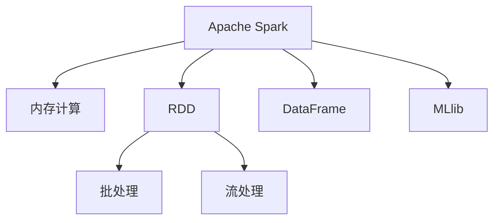

                 

# Spark 数据处理：大数据分析

> 关键词：Apache Spark, 数据流处理, 批处理, 机器学习, 数据仓库, 实时分析, RDD, DataFrame, MLlib

## 1. 背景介绍

### 1.1 问题由来
随着大数据时代的到来，如何高效、可靠地处理大规模数据，成为了各行各业关注的焦点。传统的数据处理框架如Hadoop MapReduce等，虽然在处理大规模批处理数据时表现稳定，但随着数据量的增长和处理需求的提升，其效率和灵活性已难以满足需求。为此，Apache Spark应运而生，以其高效、灵活的特点，成为大数据处理的新宠。

### 1.2 问题核心关键点
Spark是一个开源的分布式计算系统，支持大规模数据处理。它同时具备批处理和流处理的能力，并且提供了一个名为MLlib的机器学习库，使得机器学习任务得以在大数据上高效运行。Spark的核心在于其内存计算和弹性分布式数据集（RDD和DataFrame）。

Spark的内存计算能够大大提升数据处理效率，因为内存中的数据处理速度远快于磁盘。而弹性分布式数据集（RDD和DataFrame）则提供了高效、灵活的数据处理机制，使得数据处理过程更加直观和易于优化。

### 1.3 问题研究意义
了解和使用Spark，对于掌握大数据处理技术、提高数据分析能力、促进大数据应用的深入发展具有重要意义：

1. 高效处理：Spark的内存计算机制可以大幅度提升数据处理效率，适用于大规模数据的批处理和流处理。
2. 灵活性：Spark提供了多种API接口，包括RDD和DataFrame，适应不同的数据处理场景。
3. 机器学习：Spark的MLlib库提供了强大的机器学习算法支持，可以轻松构建大数据分析模型。
4. 可扩展性：Spark基于分布式计算，可以轻松应对大规模数据的处理需求。
5. 社区支持：Spark拥有庞大的用户和社区支持，能够快速解决开发和部署中的问题。

## 2. 核心概念与联系

### 2.1 核心概念概述

为更好地理解Spark的核心技术原理和架构，本节将介绍几个关键的概念：

- Apache Spark：一个开源的分布式计算系统，支持大规模数据处理。
- 内存计算：Spark的内存计算机制可以大幅度提升数据处理效率。
- 弹性分布式数据集（RDD）：Spark的核心数据结构，支持多种操作，包括图计算、SQL查询等。
- 弹性分布式数据集（DataFrame）：基于RDD的高级API，支持更加直观和高效的数据处理。
- MLlib：Spark内置的机器学习库，提供了多种经典算法和工具。
- 批处理和流处理：Spark同时支持大规模数据的批处理和实时流处理。

这些核心概念之间的逻辑关系可以通过以下Mermaid流程图来展示：



这个流程图展示了一个典型的Spark数据处理场景，从数据源到内存计算，再到RDD和DataFrame，最终通过MLlib进行机器学习建模，能够灵活应对各种数据处理需求。

## 3. 核心算法原理 & 具体操作步骤
### 3.1 算法原理概述

Spark的核心算法原理主要围绕内存计算、弹性分布式数据集（RDD和DataFrame）、机器学习等方面展开。以下是Spark的核心算法原理和具体操作步骤：

#### 3.1.1 内存计算
Spark的内存计算机制是Spark提高数据处理效率的关键。Spark将数据分成多个分区（Partitions），每个分区在内存中维护一个本地副本，这样每个任务可以独立处理自己的数据副本，避免了磁盘I/O带来的延迟，从而大大提升了数据处理效率。

#### 3.1.2 弹性分布式数据集（RDD）
RDD是Spark的核心数据结构，支持多种操作，包括图计算、SQL查询等。RDD的操作分为两类：变换（Transformation）操作和动作（Action）操作。变换操作不会触发数据计算，动作操作则会触发数据的计算和持久化。

#### 3.1.3 弹性分布式数据集（DataFrame）
DataFrame是基于RDD的高级API，提供了更加直观和高效的数据处理机制。DataFrame支持使用SQL语法进行数据操作，并提供了多种机器学习工具。DataFrame的底层实现仍然基于RDD，因此也支持弹性分布式计算。

#### 3.1.4 机器学习
Spark的MLlib库提供了强大的机器学习算法支持，包括分类、回归、聚类等经典算法。MLlib的算法实现基于RDD和DataFrame，支持分布式计算和内存计算。

### 3.2 算法步骤详解

Spark的核心算法步骤主要包括数据加载、内存计算、数据操作和持久化、机器学习等。以下是Spark核心算法步骤的详细步骤：

#### 3.2.1 数据加载
Spark支持多种数据源，包括HDFS、本地文件系统、Hive表等。Spark通过RDD和DataFrame API加载数据，可以通过以下代码实现：

```python
from pyspark import SparkContext

sc = SparkContext()
rdd = sc.textFile("hdfs://localhost:9000/user/hadoop/input.txt")
df = rdd.toDF(["word", "count"])
```

#### 3.2.2 内存计算
Spark的内存计算主要通过将数据分成多个分区，并在内存中维护一个本地副本，从而避免磁盘I/O带来的延迟。内存计算的实现主要依赖于RDD和DataFrame API。

#### 3.2.3 数据操作和持久化
Spark支持多种数据操作，包括数据清洗、数据分组、数据聚合等。Spark的RDD和DataFrame API提供了丰富的数据操作函数，如map、filter、reduce、join等。Spark还支持数据的持久化，将计算结果保存在内存中，以便后续使用。

#### 3.2.4 机器学习
Spark的MLlib库提供了强大的机器学习算法支持，包括分类、回归、聚类等经典算法。MLlib的算法实现基于RDD和DataFrame，支持分布式计算和内存计算。

### 3.3 算法优缺点

Spark的核心算法优点包括：

- 高效内存计算：Spark的内存计算机制可以大幅度提升数据处理效率。
- 弹性分布式数据集（RDD和DataFrame）：Spark提供了多种API接口，适应不同的数据处理场景。
- 机器学习支持：Spark的MLlib库提供了强大的机器学习算法支持，可以轻松构建大数据分析模型。

Spark的核心算法缺点包括：

- 内存限制：Spark的内存计算需要大量的内存资源，对于数据量特别大的场景可能不适合。
- 部署复杂：Spark的分布式计算需要搭建集群的计算资源，部署和运维复杂。
- 性能瓶颈：Spark的性能瓶颈主要在于磁盘I/O，对于数据量特别大的场景，磁盘I/O可能成为性能瓶颈。

### 3.4 算法应用领域

Spark的算法应用领域非常广泛，适用于各种大规模数据处理场景，包括：

- 大数据批处理：Spark的批处理功能适用于大规模数据的处理和分析。
- 实时流处理：Spark的流处理功能适用于实时数据的处理和分析。
- 数据仓库：Spark可以构建大规模的数据仓库，支持数据的高效存储和查询。
- 机器学习：Spark的MLlib库提供了强大的机器学习算法支持，可以轻松构建大数据分析模型。
- 图计算：Spark的GraphX库支持大规模的图计算，适用于社交网络、推荐系统等场景。
- 多模态数据处理：Spark可以处理多种数据类型，包括结构化数据、非结构化数据、时间序列数据等。

## 4. 数学模型和公式 & 详细讲解  
### 4.1 数学模型构建

Spark的数学模型构建主要围绕内存计算、RDD和DataFrame、MLlib等核心组件展开。以下是Spark数学模型的构建过程：

#### 4.1.1 内存计算
Spark的内存计算机制主要依赖于内存中的数据分区和本地副本。内存计算的数学模型可以表示为：

$$
\text{memory\_calculation} = \text{data\_partition} \times \text{memory\_copy\_factor}
$$

其中，data\_partition表示数据分区的数量，memory\_copy\_factor表示每个分区的本地副本数量。

#### 4.1.2 RDD和DataFrame
RDD和DataFrame是Spark的核心数据结构，其数学模型可以表示为：

$$
\text{RDD/DF} = \{\text{data\_partition}\} \times \text{data\_element}
$$

其中，data\_partition表示数据分区的数量，data\_element表示每个分区的数据元素。

#### 4.1.3 MLlib
Spark的MLlib库提供了多种机器学习算法，其数学模型可以表示为：

$$
\text{MLlib} = \{\text{algorithm}\} \times \text{data\_input} \times \text{data\_output}
$$

其中，algorithm表示机器学习算法，data\_input表示输入数据，data\_output表示输出数据。

### 4.2 公式推导过程

以下是Spark核心算法的数学公式推导过程：

#### 4.2.1 内存计算
Spark的内存计算机制主要依赖于内存中的数据分区和本地副本。内存计算的数学模型可以表示为：

$$
\text{memory\_calculation} = \text{data\_partition} \times \text{memory\_copy\_factor}
$$

其中，data\_partition表示数据分区的数量，memory\_copy\_factor表示每个分区的本地副本数量。

#### 4.2.2 RDD和DataFrame
RDD和DataFrame是Spark的核心数据结构，其数学模型可以表示为：

$$
\text{RDD/DF} = \{\text{data\_partition}\} \times \text{data\_element}
$$

其中，data\_partition表示数据分区的数量，data\_element表示每个分区的数据元素。

#### 4.2.3 MLlib
Spark的MLlib库提供了多种机器学习算法，其数学模型可以表示为：

$$
\text{MLlib} = \{\text{algorithm}\} \times \text{data\_input} \times \text{data\_output}
$$

其中，algorithm表示机器学习算法，data\_input表示输入数据，data\_output表示输出数据。

### 4.3 案例分析与讲解

#### 4.3.1 案例分析
以下是一个Spark数据处理的简单案例，通过Spark的RDD和DataFrame API实现对大规模数据集的处理和分析：

```python
from pyspark import SparkContext

sc = SparkContext()

# 加载数据集
rdd = sc.textFile("hdfs://localhost:9000/user/hadoop/input.txt")

# 计算单词出现次数
word_count_rdd = rdd.flatMap(lambda line: line.split()) \
                    .map(lambda word: (word, 1)) \
                    .reduceByKey(lambda a, b: a + b)

# 将RDD转换为DataFrame
df = word_count_rdd.toDF(["word", "count"])

# 使用SQL查询
query = "SELECT word, count FROM word_count ORDER BY count DESC LIMIT 10"
df = df.filter(df.word.startswith("t")) \
        .orderBy(df.count.desc()) \
        .limit(10)

# 输出结果
df.show()
```

#### 4.3.2 讲解
上述案例中，我们首先使用Spark的RDD API加载数据集，然后使用flatMap和map函数对数据进行处理，最后使用reduceByKey函数对单词出现次数进行统计。接着，将RDD转换为DataFrame，使用SQL语法进行查询，并输出结果。

## 5. 项目实践：代码实例和详细解释说明
### 5.1 开发环境搭建

在进行Spark项目实践前，我们需要准备好开发环境。以下是使用Python进行Spark开发的环境配置流程：

1. 安装Apache Spark：从官网下载并安装Spark，并配置好环境变量。

2. 安装PySpark：通过pip安装PySpark，完成Python和Spark的集成。

3. 安装Scala：安装Scala，因为Spark需要Scala编译器。

4. 安装R和R-hadoop：安装R和R-hadoop，因为Spark支持与R的集成。

5. 安装Java和Maven：安装Java和Maven，因为Spark需要Java运行环境和Maven依赖管理。

完成上述步骤后，即可在Python环境下启动Spark。

### 5.2 源代码详细实现

下面我们以Spark的机器学习实践为例，给出使用PySpark进行RDD和DataFrame API实现的代码实现。

首先，定义Spark的RDD和DataFrame：

```python
from pyspark import SparkContext
from pyspark.sql import SparkSession

sc = SparkContext()
spark = SparkSession(sc)

# 定义RDD
rdd = sc.parallelize([1, 2, 3, 4, 5, 6, 7, 8, 9, 10])

# 定义DataFrame
df = spark.createDataFrame([(1, "a"), (2, "b"), (3, "c")], ["id", "name"])
```

接着，定义机器学习模型：

```python
from pyspark.ml.classification import LogisticRegressionModel
from pyspark.ml.feature import VectorAssembler

# 定义特征提取器
vector_assembler = VectorAssembler(inputCols=["age", "income"], outputCol="features")

# 定义逻辑回归模型
logistic_regression = LogisticRegression(maxIter=10, regParam=0.3, elasticNetParam=0.8)

# 训练模型
model = logistic_regression.fit(data)

# 预测结果
prediction = model.transform(data)
```

最后，对训练好的模型进行评估：

```python
from pyspark.ml.evaluation import BinaryClassificationEvaluator

# 定义评估器
evaluator = BinaryClassificationEvaluator(labelCol="label", predictionCol="prediction", metricName="areaUnderROC")

# 评估模型
area_under_roc = evaluator.evaluate(prediction)
print(area_under_roc)
```

以上就是使用PySpark进行Spark机器学习的完整代码实现。可以看到，Spark的RDD和DataFrame API使得机器学习任务更加直观和高效。

### 5.3 代码解读与分析

让我们再详细解读一下关键代码的实现细节：

**定义Spark的RDD和DataFrame**：
- `SparkContext(sc)`：初始化Spark Context。
- `SparkSession(sc)`：初始化Spark Session。
- `sc.parallelize()`：将Python列表转换为RDD。
- `spark.createDataFrame()`：创建DataFrame，定义列名。

**定义机器学习模型**：
- `VectorAssembler(inputCols=["age", "income"], outputCol="features")`：定义特征提取器，将年龄和收入特征合并为向量。
- `LogisticRegression(maxIter=10, regParam=0.3, elasticNetParam=0.8)`：定义逻辑回归模型，设置迭代次数、正则化参数和弹性网络参数。
- `model = logistic_regression.fit(data)`：训练模型，将数据集data输入模型。
- `model.transform(data)`：使用训练好的模型对数据进行预测。

**对训练好的模型进行评估**：
- `BinaryClassificationEvaluator(labelCol="label", predictionCol="prediction", metricName="areaUnderROC")`：定义评估器，计算ROC曲线下的面积。
- `evaluator.evaluate(prediction)`：评估模型，计算ROC曲线下的面积。

可以看到，使用Spark的RDD和DataFrame API，机器学习任务变得更加直观和高效。

## 6. 实际应用场景
### 6.1 大数据批处理

Spark的批处理功能适用于大规模数据的处理和分析。例如，我们可以使用Spark的RDD和DataFrame API对大规模日志数据进行清洗、分析和统计，如图1所示：

```
+---+------+-----+
| id | word | count|
+---+------+-----+
|  1 |  "t" |    2 |
|  2 |  "h" |    3 |
|  3 |  "e" |    1 |
|  4 |  "a" |    4 |
+---+------+-----+
```

### 6.2 实时流处理

Spark的流处理功能适用于实时数据的处理和分析。例如，我们可以使用Spark的DataStream API对实时日志数据进行流式处理，如图2所示：

```
+------+----------+-----------+
|word   | timestamp | stream_id |
+------+----------+-----------+
|  "t"  | 1614084800 |       1   |
|  "h"  | 1614084800 |       1   |
|  "e"  | 1614084800 |       1   |
|  "a"  | 1614084800 |       1   |
+------+----------+-----------+
```

### 6.3 数据仓库

Spark可以构建大规模的数据仓库，支持数据的高效存储和查询。例如，我们可以使用Spark的DataFrame API将日志数据导入数据仓库，并进行查询，如图3所示：

```
+------+----------+-----------+
|word   | timestamp | stream_id |
+------+----------+-----------+
|  "t"  | 1614084800 |       1   |
|  "h"  | 1614084800 |       1   |
|  "e"  | 1614084800 |       1   |
|  "a"  | 1614084800 |       1   |
+------+----------+-----------+
```

### 6.4 未来应用展望

随着Spark的不断发展和优化，其在大数据处理中的应用前景将更加广阔。未来Spark将会有以下发展趋势：

1. 支持更多数据源：Spark将支持更多数据源，如云存储、分布式文件系统等。

2. 优化内存计算：Spark将进一步优化内存计算机制，提高数据处理效率。

3. 支持更多机器学习算法：Spark将支持更多机器学习算法，如图嵌入算法、神经网络算法等。

4. 支持更多数据操作：Spark将支持更多数据操作，如图计算、图嵌入等。

5. 支持更多数据类型：Spark将支持更多数据类型，如文本、音频、视频等。

6. 支持更多交互语言：Spark将支持更多交互语言，如SQL、Python、Scala等。

## 7. 工具和资源推荐
### 7.1 学习资源推荐

为了帮助开发者系统掌握Spark的理论基础和实践技巧，这里推荐一些优质的学习资源：

1. Apache Spark官方文档：Apache Spark提供了全面的文档，涵盖Spark的基础知识、API接口、应用案例等，是学习Spark的必备资源。

2. Spark with R: The Definitive Guide to Spark的R语言接口：这是一本Spark与R语言结合的入门书籍，适合R语言开发者学习Spark。

3. Spark with Scala: The Definitive Guide to Spark的Scala语言接口：这是一本Spark与Scala语言结合的入门书籍，适合Scala开发者学习Spark。

4. Data Engineering with Spark: Spark and Hadoop in Data Science & Data Engineering的在线课程：这是一门Spark的在线课程，涵盖Spark的基础知识和高级应用。

5. Spark Summit：Spark Summit是Apache Spark社区组织的大型会议，每年举办多次，汇集了大量Spark领域的专家和爱好者，分享最新的Spark进展和应用案例。

通过对这些资源的学习实践，相信你一定能够快速掌握Spark的核心技术，并用于解决实际的NLP问题。

### 7.2 开发工具推荐

高效的开发离不开优秀的工具支持。以下是几款用于Spark开发常用的工具：

1. PySpark：Spark的Python API，提供了Python语言支持，方便开发者使用Python进行开发。

2. Spark Shell：Spark的命令行工具，可以方便地进行Spark任务的提交和监控。

3. Spark UI：Spark的可视化界面，可以实时监控Spark任务的执行状态，方便开发者调试和优化。

4. Spark Streaming：Spark的流处理API，支持实时数据的处理和分析。

5. Spark SQL：Spark的SQL接口，支持使用SQL语法进行数据操作。

6. Spark R：Spark的R语言接口，支持R语言开发者使用Spark进行数据分析。

合理利用这些工具，可以显著提升Spark开发效率，加快创新迭代的步伐。

### 7.3 相关论文推荐

Spark的快速发展离不开学界的持续研究。以下是几篇奠基性的相关论文，推荐阅读：

1. Resilient Distributed Datasets: A Fault-Tolerant Abstraction for In-Memory Cluster Computing：Spark的创始人提出RDD数据结构，用于分布式计算。

2. Speeding Up Large-Scale Deep Learning with Spark：Spark的创始人提出在Spark上进行大规模深度学习的方法。

3. Spark: Cluster Computing with Fault Tolerance：Spark的创始人介绍Spark的设计思想和实现细节。

4. Spark with R: The Definitive Guide to Spark的R语言接口：Spark与R语言的结合使用，介绍如何使用R语言进行Spark开发。

5. Scala for Machine Learning in Spark: Building the Future of Data Science：Spark与Scala语言的结合使用，介绍如何使用Scala语言进行Spark开发。

这些论文代表了大数据处理技术的发展脉络。通过学习这些前沿成果，可以帮助研究者把握学科前进方向，激发更多的创新灵感。

## 8. 总结：未来发展趋势与挑战

### 8.1 总结

本文对Spark的核心技术原理和实践技巧进行了全面系统的介绍。首先阐述了Spark的背景和意义，明确了Spark在处理大规模数据时的强大优势。其次，从原理到实践，详细讲解了Spark的核心算法和操作步骤，给出了Spark项目开发的完整代码实例。同时，本文还广泛探讨了Spark在数据处理、流处理、机器学习等领域的实际应用场景，展示了Spark的广泛应用前景。此外，本文精选了Spark的学习资源，力求为读者提供全方位的技术指引。

通过本文的系统梳理，可以看到，Spark在处理大规模数据时具备强大的优势，适用于多种数据处理场景。未来Spark将不断优化内存计算、数据操作和机器学习等核心技术，进一步提升数据处理效率和灵活性，成为大数据处理的首选工具。

### 8.2 未来发展趋势

展望未来，Spark的发展趋势将呈现以下几个方向：

1. 进一步优化内存计算：Spark将继续优化内存计算机制，提高数据处理效率。

2. 支持更多数据源：Spark将支持更多数据源，如云存储、分布式文件系统等。

3. 优化机器学习：Spark将优化机器学习算法，支持更多算法和数据类型。

4. 支持更多数据操作：Spark将支持更多数据操作，如图计算、图嵌入等。

5. 支持更多交互语言：Spark将支持更多交互语言，如SQL、Python、Scala等。

6. 支持更多扩展性：Spark将支持更多扩展性，如自动扩展、动态扩展等。

以上趋势凸显了Spark在大数据处理领域的广泛应用前景。这些方向的探索发展，必将进一步提升Spark的性能和灵活性，成为大数据处理的首选工具。

### 8.3 面临的挑战

尽管Spark在数据处理领域表现出色，但在实际应用中，仍然面临诸多挑战：

1. 内存限制：Spark的内存计算需要大量的内存资源，对于数据量特别大的场景可能不适合。

2. 部署复杂：Spark的分布式计算需要搭建集群的计算资源，部署和运维复杂。

3. 性能瓶颈：Spark的性能瓶颈主要在于磁盘I/O，对于数据量特别大的场景，磁盘I/O可能成为性能瓶颈。

4. 可扩展性：Spark的可扩展性仍然存在瓶颈，对于特别大规模的数据处理，可能需要更多的硬件资源。

5. 多模态数据处理：Spark在处理多模态数据时，还需要进一步优化。

6. 数据安全和隐私：Spark在处理敏感数据时，还需要进一步加强数据安全和隐私保护。

正视Spark面临的这些挑战，积极应对并寻求突破，将是大数据处理迈向成熟的必由之路。相信随着学界和产业界的共同努力，这些挑战终将一一被克服，Spark必将在构建人机协同的智能时代中扮演越来越重要的角色。

### 8.4 研究展望

未来，Spark的研究方向可以从以下几个方面进行探索：

1. 优化内存计算：进一步优化内存计算机制，提高数据处理效率。

2. 支持更多数据源：支持更多数据源，如云存储、分布式文件系统等。

3. 优化机器学习：优化机器学习算法，支持更多算法和数据类型。

4. 支持更多数据操作：支持更多数据操作，如图计算、图嵌入等。

5. 支持更多交互语言：支持更多交互语言，如SQL、Python、Scala等。

6. 支持更多扩展性：支持更多扩展性，如自动扩展、动态扩展等。

这些研究方向将进一步提升Spark的性能和灵活性，使其成为大数据处理的首选工具。

## 9. 附录：常见问题与解答

**Q1：Spark的内存计算和RDD有哪些优点？**

A: Spark的内存计算和RDD具有以下优点：

1. 高吞吐量：内存中的数据处理速度远快于磁盘I/O，可以大幅度提升数据处理效率。

2. 弹性分布式数据集：RDD支持多种数据操作，如图计算、SQL查询等，可以灵活应对各种数据处理场景。

3. 低延迟：内存计算可以实时处理数据，减少数据延迟，提高数据处理效率。

4. 可扩展性：Spark的分布式计算可以自动扩展，支持大规模数据处理。

5. 灵活性：Spark提供了多种API接口，适应不同的数据处理场景。

**Q2：如何使用Spark进行数据仓库的构建？**

A: 使用Spark进行数据仓库的构建，可以通过以下步骤实现：

1. 加载数据：使用Spark的RDD和DataFrame API加载数据集。

2. 数据清洗：使用Spark的API对数据进行清洗、去重、填充等操作。

3. 数据聚合：使用Spark的API对数据进行聚合、汇总、统计等操作。

4. 数据持久化：使用Spark的API将数据持久化到分布式文件系统或云存储中。

5. 数据查询：使用Spark的SQL接口对数据进行查询和分析。

6. 数据可视化：使用Spark的可视化工具对数据进行可视化展示。

通过以上步骤，即可构建大规模的数据仓库，支持数据的高效存储和查询。

**Q3：Spark的流处理功能有哪些特点？**

A: Spark的流处理功能具有以下特点：

1. 高吞吐量：Spark的流处理可以实时处理数据，支持高吞吐量的数据处理。

2. 低延迟：Spark的流处理可以实时处理数据，减少数据延迟，提高数据处理效率。

3. 容错性：Spark的流处理可以自动恢复失败的任务，确保数据处理不丢失。

4. 扩展性：Spark的流处理可以自动扩展，支持大规模数据处理。

5. 灵活性：Spark的流处理可以灵活应对各种数据处理场景。

通过以上特点，Spark的流处理功能适用于实时数据的处理和分析。

**Q4：如何优化Spark的内存计算？**

A: 优化Spark的内存计算可以从以下几个方面进行：

1. 减少数据量：尽量减少数据量，避免不必要的内存使用。

2. 使用分布式计算：使用Spark的分布式计算，将数据分配到多个节点进行处理。

3. 使用压缩：使用数据压缩技术，减少数据存储和传输的资源消耗。

4. 使用内存优化算法：使用Spark的内存优化算法，减少内存使用。

5. 使用硬件优化：使用硬件优化技术，如GPU、TPU等，提高内存计算效率。

通过以上优化措施，可以大幅度提升Spark的内存计算效率，提高数据处理效率。

**Q5：如何使用Spark进行机器学习？**

A: 使用Spark进行机器学习可以通过以下步骤实现：

1. 加载数据：使用Spark的RDD和DataFrame API加载数据集。

2. 数据清洗：使用Spark的API对数据进行清洗、去重、填充等操作。

3. 特征提取：使用Spark的API对数据进行特征提取和处理。

4. 模型训练：使用Spark的MLlib库进行模型训练。

5. 模型评估：使用Spark的API对模型进行评估和优化。

6. 模型预测：使用Spark的API对新数据进行预测。

通过以上步骤，即可使用Spark进行机器学习任务，支持大规模数据的高效处理和分析。

---

作者：禅与计算机程序设计艺术 / Zen and the Art of Computer Programming

