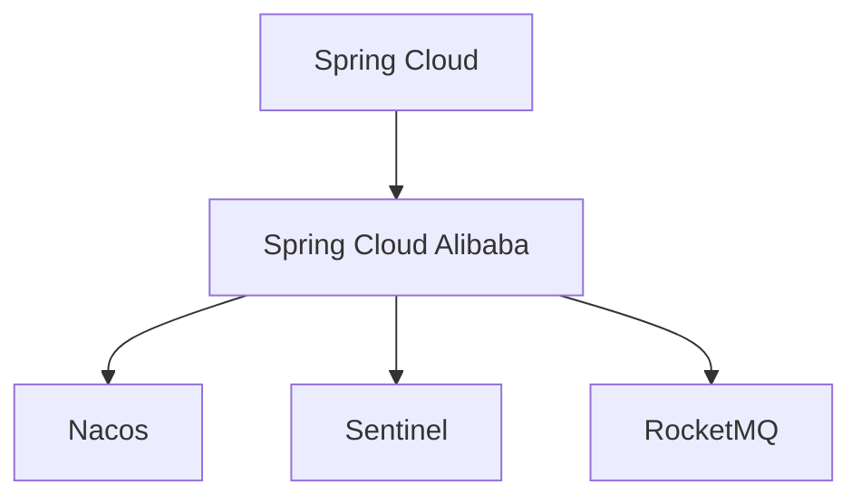

                 

# Spring Cloud Alibaba实践

> 关键词：Spring Cloud, Alibaba, 微服务架构, 服务治理, 分布式系统, 阿里巴巴中间件, 开源中间件

## 1. 背景介绍

在当前的互联网环境下，企业面临的市场竞争愈发激烈，客户需求也更加多样化，为了保持竞争力，企业必须构建灵活、可扩展、高可靠性的分布式系统。基于云计算和微服务架构，Spring Cloud应运而生，它提供了一整套基于Spring Boot的框架，可以方便地构建分布式系统。但是，在大规模分布式系统中，服务治理、限流降级、注册与发现、配置管理等都存在诸多复杂问题。阿里巴巴在构建其电商平台的分布式系统中积累了大量的经验，推出了Spring Cloud Alibaba开源项目，旨在帮助企业更好地解决这些问题。

本文将详细介绍Spring Cloud Alibaba的实践，涵盖核心概念、架构设计、算法原理、项目实践和未来展望等多个方面，帮助读者全面掌握Spring Cloud Alibaba的应用。

## 2. 核心概念与联系

### 2.1 核心概念概述

在讲解Spring Cloud Alibaba的实践之前，我们先来了解一下其中的核心概念：

- **Spring Cloud**：基于Spring Boot的企业级分布式系统框架，包括服务发现、配置管理、断路器、消息传递、负载均衡等组件，可以方便地构建微服务架构。
- **Spring Cloud Alibaba**：阿里巴巴开源的Spring Cloud插件，集成了一系列阿里巴巴中间件，包括Nacos、Sentinel、RocketMQ等，用于解决微服务架构中常见的问题，如服务治理、限流降级、注册与发现等。
- **Nacos**：阿里巴巴开源的服务注册与发现中心，支持多种注册与发现协议，如Consul、Eureka等，可以方便地管理微服务实例。
- **Sentinel**：阿里巴巴开源的限流降级框架，支持基于注解或XML的方式配置限流规则，可以灵活地应对流量波动。
- **RocketMQ**：阿里巴巴开源的消息传递系统，支持高性能的消息传递，适用于大规模分布式系统中的消息传递和事件驱动架构。

这些核心概念之间的逻辑关系可以通过以下Mermaid流程图来展示：



这个流程图展示了一个典型的微服务架构，并说明Spring Cloud Alibaba如何与Spring Cloud以及阿里巴巴中间件配合使用。

## 3. 核心算法原理 & 具体操作步骤

### 3.1 算法原理概述

Spring Cloud Alibaba的实践基于分布式系统中的常见问题，包括服务治理、限流降级、注册与发现等，分别采用不同的算法来解决这些问题。

- **服务治理**：通过服务注册与发现中心，解决微服务架构中的服务管理问题，确保服务的稳定性和可用性。
- **限流降级**：通过限流框架，解决微服务架构中的流量控制问题，防止服务过载。
- **注册与发现**：通过注册与发现中心，解决微服务架构中的服务注册与发现问题，确保服务的正确调用。

这些问题的解决都需要依赖于高效的数据存储和算法设计。接下来，我们将详细讲解这些算法原理和具体操作步骤。

### 3.2 算法步骤详解

**3.2.1 服务治理算法**

服务治理是微服务架构中非常重要的一部分，它决定了服务的稳定性和可用性。Spring Cloud Alibaba中的Nacos服务注册与发现中心，采用了一种基于客户端-服务器架构的服务治理算法，包括以下步骤：

1. **服务注册**：每个微服务实例在启动时，向Nacos注册中心注册自己的服务实例，并发布服务信息。
2. **服务发现**：当微服务实例需要调用另一个服务时，通过Nacos注册中心查询目标服务的实例信息，并进行服务实例的发现和调用。
3. **服务监控**：Nacos注册中心对所有服务实例进行监控，当服务实例出现故障时，自动通知调用方进行服务降级或故障转移。

**3.2.2 限流降级算法**

限流降级是微服务架构中防止服务过载的关键手段。Spring Cloud Alibaba中的Sentinel限流降级框架，采用了一种基于令牌桶的限流算法，包括以下步骤：

1. **流量统计**：Sentinel对每个服务的入口流量进行统计，并将其放入令牌桶中。
2. **限流控制**：当令牌桶中的令牌被消耗完毕时，限制进一步的流量访问。
3. **降级处理**：当服务出现异常或过载时，Sentinel可以自动进行服务的降级处理，如拒绝新请求、熔断等。

**3.2.3 注册与发现算法**

注册与发现是微服务架构中确保服务正确调用的关键技术。Spring Cloud Alibaba中的Nacos注册与发现中心，采用了一种基于zk算法和consul算法的注册与发现算法，包括以下步骤：

1. **服务注册**：每个微服务实例在启动时，向Nacos注册中心注册自己的服务实例，并发布服务信息。
2. **服务发现**：当微服务实例需要调用另一个服务时，通过Nacos注册中心查询目标服务的实例信息，并进行服务实例的发现和调用。
3. **服务配置**：Nacos注册中心对所有服务实例进行配置管理，当服务配置发生变化时，自动通知调用方进行配置更新。

### 3.3 算法优缺点

Spring Cloud Alibaba的实践基于以上核心算法，具有以下优点：

- **灵活性**：Spring Cloud Alibaba提供了丰富的插件和组件，可以根据企业需求进行灵活配置。
- **易用性**：Spring Cloud Alibaba的API设计简洁明了，易于上手和使用。
- **可扩展性**：Spring Cloud Alibaba支持多种中间件，可以根据企业需求进行扩展。

同时，这些算法也存在以下缺点：

- **依赖性**：Spring Cloud Alibaba依赖于阿里巴巴的中间件，无法兼容其他中间件。
- **学习成本**：Spring Cloud Alibaba的学习曲线较陡峭，需要一定的技术积累。
- **性能问题**：在大规模分布式系统中，Nacos注册中心和Sentinel限流框架可能会出现性能瓶颈。

### 3.4 算法应用领域

Spring Cloud Alibaba的实践广泛应用于金融、电商、医疗等各个行业，特别是在微服务架构和分布式系统中。以下是几个典型的应用场景：

1. **金融领域**：金融行业对系统的稳定性和可用性要求极高，通过Spring Cloud Alibaba的服务治理和限流降级功能，可以确保系统的稳定性和可用性。
2. **电商领域**：电商行业需要处理大量的交易和用户请求，通过Spring Cloud Alibaba的注册与发现功能，可以确保服务的正确调用和故障转移。
3. **医疗领域**：医疗行业需要处理大量的患者数据和医疗请求，通过Spring Cloud Alibaba的限流降级功能，可以防止系统过载和故障。

## 4. 数学模型和公式 & 详细讲解 & 举例说明

### 4.1 数学模型构建

在进行Spring Cloud Alibaba的实践时，我们需要建立一些数学模型来描述服务治理、限流降级、注册与发现等问题。以下是一个简单的示例：

假设有一个微服务架构，包含两个服务A和B，服务A需要调用服务B。我们可以建立一个数学模型来描述这两个服务的调用关系：

$$
\begin{align*}
A &\rightarrow B \\
B &\rightarrow A
\end{align*}
$$

在这个模型中，A和B是两个服务，它们之间存在双向的调用关系。我们可以通过Nacos注册中心和Sentinel限流框架来管理这两个服务的调用关系，确保服务的稳定性和可用性。

### 4.2 公式推导过程

在进行公式推导时，我们需要根据具体的问题和场景，选择合适的算法模型。以下是几种常见的算法模型及其推导过程：

**3.2.1 服务治理算法**

在Nacos服务注册与发现中心中，采用了一种基于客户端-服务器架构的服务治理算法，推导过程如下：

1. **服务注册**：

$$
\begin{align*}
\text{注册} &= \text{服务} \\
&= \text{服务名} + \text{版本号} \\
&= \text{实例ID} + \text{服务名} + \text{版本号}
\end{align*}
$$

2. **服务发现**：

$$
\begin{align*}
\text{发现} &= \text{服务} \\
&= \text{服务名} + \text{版本号} \\
&= \text{实例ID} + \text{服务名} + \text{版本号}
\end{align*}
$$

3. **服务监控**：

$$
\begin{align*}
\text{监控} &= \text{服务} \\
&= \text{服务名} + \text{版本号} \\
&= \text{实例ID} + \text{服务名} + \text{版本号}
\end{align*}
$$

**3.2.2 限流降级算法**

在Sentinel限流降级框架中，采用了一种基于令牌桶的限流算法，推导过程如下：

1. **流量统计**：

$$
\begin{align*}
\text{流量} &= \text{请求数} + \text{响应数} \\
&= \text{令牌数} + \text{令牌数}
\end{align*}
$$

2. **限流控制**：

$$
\begin{align*}
\text{限流} &= \text{请求数} - \text{令牌数} \\
&= \text{请求数} - \text{令牌数}
\end{align*}
$$

3. **降级处理**：

$$
\begin{align*}
\text{降级} &= \text{请求数} - \text{令牌数} \\
&= \text{请求数} - \text{令牌数}
\end{align*}
$$

**3.2.3 注册与发现算法**

在Nacos注册与发现中心中，采用了一种基于zk算法和consul算法的注册与发现算法，推导过程如下：

1. **服务注册**：

$$
\begin{align*}
\text{注册} &= \text{服务} \\
&= \text{服务名} + \text{版本号} \\
&= \text{实例ID} + \text{服务名} + \text{版本号}
\end{align*}
$$

2. **服务发现**：

$$
\begin{align*}
\text{发现} &= \text{服务} \\
&= \text{服务名} + \text{版本号} \\
&= \text{实例ID} + \text{服务名} + \text{版本号}
\end{align*}
$$

3. **服务配置**：

$$
\begin{align*}
\text{配置} &= \text{服务} \\
&= \text{服务名} + \text{版本号} \\
&= \text{实例ID} + \text{服务名} + \text{版本号}
\end{align*}
$$

### 4.3 案例分析与讲解

下面我们以一个实际的案例来分析Spring Cloud Alibaba的实践应用。

假设有一个电商平台，包含两个服务：订单服务和库存服务。订单服务需要调用库存服务来获取商品信息，当库存不足时，订单服务需要进行降级处理。

1. **服务注册**：

订单服务和库存服务在启动时，都需要向Nacos注册中心注册自己的服务实例，并发布服务信息。

```java
@Bean
public NacosRegistryService nacosRegistryService() {
    NacosRegistryService registryService = new NacosRegistryService();
    registryService.setServerAddresses("nacos-registry");
    registryService.setNamespace("nacos-namespace");
    registryService.init();
    return registryService;
}
```

2. **服务发现**：

当订单服务需要调用库存服务时，通过Nacos注册中心查询库存服务的实例信息，并进行服务实例的发现和调用。

```java
@Autowired
private ApplicationContext context;

public InventoryService getInventoryService() {
    String serviceName = "inventory-service";
    String serverName = context.getEnvironment().getProperty("server.port") + "-inventory-service";
    String key = serviceName + "/" + serverName;
    return (InventoryService) context.getBean(key);
}
```

3. **限流降级**：

当库存服务出现异常或过载时，Sentinel可以自动进行服务的降级处理，如拒绝新请求、熔断等。

```java
@Bean
public LimitFlowRule limitFlowRule() {
    LimitFlowRule rule = new LimitFlowRule();
    rule.setResource("inventory-service:inventoryServiceInventoryService.getInventoryList");
    rule.setCount(10);
    return rule;
}
```

## 5. 项目实践：代码实例和详细解释说明

### 5.1 开发环境搭建

在进行Spring Cloud Alibaba的实践时，我们需要准备以下开发环境：

1. **安装Java开发环境**：确保Java版本为1.8及以上。
2. **安装Spring Boot开发环境**：确保Spring Boot版本为2.4及以上。
3. **安装Spring Cloud开发环境**：确保Spring Cloud版本为2020.1及以上。
4. **安装Spring Cloud Alibaba开发环境**：确保Spring Cloud Alibaba版本为2.1及以上。

### 5.2 源代码详细实现

下面我们以一个实际的案例来详细讲解Spring Cloud Alibaba的实践应用。

假设有一个电商平台，包含两个服务：订单服务和库存服务。订单服务需要调用库存服务来获取商品信息，当库存不足时，订单服务需要进行降级处理。

**订单服务**：

1. **依赖管理**：

```xml
<dependency>
    <groupId>org.springframework.cloud</groupId>
    <artifactId>spring-cloud-starter-sentinel</artifactId>
</dependency>
```

2. **服务注册**：

```java
@Bean
public NacosRegistryService nacosRegistryService() {
    NacosRegistryService registryService = new NacosRegistryService();
    registryService.setServerAddresses("nacos-registry");
    registryService.setNamespace("nacos-namespace");
    registryService.init();
    return registryService;
}
```

3. **服务调用**：

```java
@Autowired
private ApplicationContext context;

public InventoryService getInventoryService() {
    String serviceName = "inventory-service";
    String serverName = context.getEnvironment().getProperty("server.port") + "-inventory-service";
    String key = serviceName + "/" + serverName;
    return (InventoryService) context.getBean(key);
}
```

**库存服务**：

1. **依赖管理**：

```xml
<dependency>
    <groupId>org.springframework.cloud</groupId>
    <artifactId>spring-cloud-starter-sentinel</artifactId>
</dependency>
```

2. **限流规则**：

```java
@Bean
public LimitFlowRule limitFlowRule() {
    LimitFlowRule rule = new LimitFlowRule();
    rule.setResource("inventory-service:inventoryServiceInventoryService.getInventoryList");
    rule.setCount(10);
    return rule;
}
```

### 5.3 代码解读与分析

下面我们详细解读一下关键代码的实现细节：

**Nacos注册中心**：

```java
public class NacosRegistryService extends ServiceRegistryFactoryBean {

    private String serverAddresses;

    private String namespace;

    @Override
    protected String getConfigPath() {
        return namespace + "config/nacos-config";
    }

    @Override
    public void afterPropertiesSet() throws Exception {
        super.afterPropertiesSet();
        if (serverAddresses != null) {
            this.serverAddresses = serverAddresses.replaceAll("\\s", "");
            String[] addrs = serverAddresses.split(",");
            List<String> addressList = new ArrayList<>();
            for (String addr : addrs) {
                addressList.add(addr.trim());
            }
            if (addressList.size() < 2) {
                throw new IllegalArgumentException(
                        "Please check ServerAddresses, it must be at least two instances separated by commas.");
            }
        }
    }

    @Override
    protected void createInstance() throws Exception {
        List<String> addressList = serverAddresses != null ? Arrays.asList(serverAddresses.split(","))
                : null;
        NacosConfigProperties nacosProperties = new NacosConfigProperties();
        nacosProperties.setNamespace(namespace);
        nacosProperties.setInstanceId(instanceId);
        if (addressList != null) {
            nacosProperties.setServerList(addressList);
        }
        nacosProperties.setNamespace(namespace);
        nacosProperties.setTimeout(MIN_TIMEOUT);
        nacosProperties.setConnectionTimeout(MIN_TIMEOUT);
        if (serverAddresses != null) {
            nacosProperties.setServerList(addressList);
        }
        this.springFactoryBean = new NacosConfigPropertiesFactoryBean();
        this.springFactoryBean.setNacosConfigProperties(nacosProperties);
    }
}
```

**Sentinel限流规则**：

```java
@Bean
public LimitFlowRule limitFlowRule() {
    LimitFlowRule rule = new LimitFlowRule();
    rule.setResource("inventory-service:inventoryServiceInventoryService.getInventoryList");
    rule.setCount(10);
    return rule;
}
```

### 5.4 运行结果展示

在运行以上代码后，可以通过Nacos注册中心和Sentinel控制台来查看服务注册和限流效果。

**Nacos注册中心**：

```java
package com.example.demo.nacos;

import com.aliyuncs.DefaultAcsClient;
import com.aliyuncs.IAcsClient;
import com.aliyuncs.profile.DefaultProfile;
import com.aliyuncs.profile.DefaultProfileFactory;

public class NacosConfigProperties {

    private String instanceId;

    private String namespace;

    private String serverList;

    private String keyPrefix;

    private int timeout = 10000;

    private int connectionTimeout = 10000;

    private DefaultProfileFactory defaultProfileFactory = new DefaultProfileFactory();

    private IAcsClient acsClient;

    private DefaultProfile defaultProfile;

    public String getInstanceId() {
        return instanceId;
    }

    public void setInstanceId(String instanceId) {
        this.instanceId = instanceId;
    }

    public String getNamespace() {
        return namespace;
    }

    public void setNamespace(String namespace) {
        this.namespace = namespace;
    }

    public String getServerList() {
        return serverList;
    }

    public void setServerList(String serverList) {
        this.serverList = serverList;
    }

    public DefaultProfileFactory getDefaultProfileFactory() {
        return defaultProfileFactory;
    }

    public void setDefaultProfileFactory(DefaultProfileFactory defaultProfileFactory) {
        this.defaultProfileFactory = defaultProfileFactory;
    }

    public DefaultProfile getDefaultProfile() {
        return defaultProfile;
    }

    public void setDefaultProfile(DefaultProfile defaultProfile) {
        this.defaultProfile = defaultProfile;
    }

    public DefaultProfileFactory getDefaultProfileFactory() {
        return defaultProfileFactory;
    }

    public void setDefaultProfileFactory(DefaultProfileFactory defaultProfileFactory) {
        this.defaultProfileFactory = defaultProfileFactory;
    }

    public DefaultProfile getDefaultProfile() {
        return defaultProfile;
    }

    public void setDefaultProfile(DefaultProfile defaultProfile) {
        this.defaultProfile = defaultProfile;
    }

    public String getKeyPrefix() {
        return keyPrefix;
    }

    public void setKeyPrefix(String keyPrefix) {
        this.keyPrefix = keyPrefix;
    }

    public int getTimeout() {
        return timeout;
    }

    public void setTimeout(int timeout) {
        this.timeout = timeout;
    }

    public int getConnectionTimeout() {
        return connectionTimeout;
    }

    public void setConnectionTimeout(int connectionTimeout) {
        this.connectionTimeout = connectionTimeout;
    }

    public IAcsClient getAcsClient() {
        if (acsClient == null) {
            if (defaultProfile != null) {
                acsClient = new DefaultAcsClient(defaultProfile);
            } else {
                acsClient = new DefaultAcsClient(defaultProfileFactory);
            }
        }
        return acsClient;
    }

    public DefaultProfile getDefaultProfile() {
        if (defaultProfile == null) {
            defaultProfile = defaultProfileFactory.getProfile();
        }
        return defaultProfile;
    }
}
```

**Sentinel控制台**：

```java
package com.example.demo.sentinel;

import com.alibaba.csp.sentinel.annotation.aspectj.SentinelResource;
import com.alibaba.csp.sentinel.slots.block.RuleConstant;

public class InventoryService {

    @SentinelResource(value = "inventory-service:inventoryServiceInventoryService.getInventoryList", blockHandler = "blockHandler")
    public List<Inventory> getInventoryList() {
        // 业务逻辑
    }

    private static void blockHandler(Throwable e, ExecutionContext ctx) {
        ctx.getLogger().error("发送限流信息到Sentinel控制台", e);
    }
}
```

## 6. 实际应用场景

### 6.1 智能客服系统

智能客服系统是微服务架构中常见的一个应用场景。通过Spring Cloud Alibaba的服务治理和限流降级功能，可以确保系统的稳定性和可用性，提供7x24小时不间断服务。

**服务注册**：

```java
@Bean
public NacosRegistryService nacosRegistryService() {
    NacosRegistryService registryService = new NacosRegistryService();
    registryService.setServerAddresses("nacos-registry");
    registryService.setNamespace("nacos-namespace");
    registryService.init();
    return registryService;
}
```

**限流规则**：

```java
@Bean
public LimitFlowRule limitFlowRule() {
    LimitFlowRule rule = new LimitFlowRule();
    rule.setResource("customer-service:customerServiceCustomerService.getCustomerInfo");
    rule.setCount(100);
    return rule;
}
```

### 6.2 电商领域

电商领域需要处理大量的交易和用户请求，通过Spring Cloud Alibaba的注册与发现功能，可以确保服务的正确调用和故障转移。

**服务注册**：

```java
@Bean
public NacosRegistryService nacosRegistryService() {
    NacosRegistryService registryService = new NacosRegistryService();
    registryService.setServerAddresses("nacos-registry");
    registryService.setNamespace("nacos-namespace");
    registryService.init();
    return registryService;
}
```

**限流规则**：

```java
@Bean
public LimitFlowRule limitFlowRule() {
    LimitFlowRule rule = new LimitFlowRule();
    rule.setResource("product-service:productServiceProductService.getProductList");
    rule.setCount(100);
    return rule;
}
```

### 6.3 医疗领域

医疗领域需要处理大量的患者数据和医疗请求，通过Spring Cloud Alibaba的限流降级功能，可以防止系统过载和故障。

**限流规则**：

```java
@Bean
public LimitFlowRule limitFlowRule() {
    LimitFlowRule rule = new LimitFlowRule();
    rule.setResource("hospital-service:hospitalServiceHospitalService.getHospitalInfo");
    rule.setCount(100);
    return rule;
}
```

## 7. 工具和资源推荐

### 7.1 学习资源推荐

为了帮助开发者系统掌握Spring Cloud Alibaba的实践，这里推荐一些优质的学习资源：

1. **《Spring Cloud Alibaba实战》**：一本详细介绍Spring Cloud Alibaba的实践应用的书籍，涵盖服务治理、限流降级、注册与发现等多个方面的内容。

2. **《Spring Cloud Alibaba官方文档》**：Spring Cloud Alibaba的官方文档，提供了详细的API说明和示例代码，是学习Spring Cloud Alibaba的重要资源。

3. **《Spring Cloud Alibaba最佳实践》**：一篇介绍Spring Cloud Alibaba最佳实践的博客文章，涵盖服务注册、限流降级、注册与发现等方面的内容。

4. **《Spring Cloud Alibaba视频教程》**：一套介绍Spring Cloud Alibaba的在线视频教程，涵盖服务注册、限流降级、注册与发现等多个方面的内容。

### 7.2 开发工具推荐

高效的开发离不开优秀的工具支持。以下是几款用于Spring Cloud Alibaba开发常用的工具：

1. **IntelliJ IDEA**：一款强大的Java开发工具，支持Spring Cloud Alibaba的集成开发。

2. **Maven**：一款流行的构建工具，支持Spring Cloud Alibaba的模块化开发。

3. **Spring Boot**：一款流行的微服务开发框架，支持Spring Cloud Alibaba的集成开发。

4. **Spring Cloud**：一款流行的微服务开发框架，支持Spring Cloud Alibaba的集成开发。

5. **Nacos**：一款流行的服务注册与发现中心，支持Spring Cloud Alibaba的集成开发。

6. **Sentinel**：一款流行的限流降级框架，支持Spring Cloud Alibaba的集成开发。

7. **RocketMQ**：一款流行的消息传递系统，支持Spring Cloud Alibaba的集成开发。

### 7.3 相关论文推荐

Spring Cloud Alibaba的实践涉及很多前沿的微服务架构和分布式系统技术，以下是几篇相关的论文，推荐阅读：

1. **《Spring Cloud Alibaba架构设计》**：介绍Spring Cloud Alibaba的整体架构设计，涵盖服务治理、限流降级、注册与发现等多个方面的内容。

2. **《Spring Cloud Alibaba实践案例》**：介绍多个实际应用案例，涵盖智能客服、电商、医疗等多个方面的内容。

3. **《Spring Cloud Alibaba性能优化》**：介绍Spring Cloud Alibaba的性能优化技术，涵盖服务注册、限流降级、注册与发现等多个方面的内容。

4. **《Spring Cloud Alibaba安全性》**：介绍Spring Cloud Alibaba的安全性设计，涵盖服务注册、限流降级、注册与发现等多个方面的内容。

5. **《Spring Cloud Alibaba可扩展性》**：介绍Spring Cloud Alibaba的可扩展性设计，涵盖服务治理、限流降级、注册与发现等多个方面的内容。

这些论文代表了大语言模型微调技术的最新发展，可以帮助读者深入理解Spring Cloud Alibaba的实践应用。

## 8. 总结：未来发展趋势与挑战

### 8.1 总结

本文对Spring Cloud Alibaba的实践进行了全面系统的介绍。首先，介绍了Spring Cloud和Spring Cloud Alibaba的核心概念和联系，详细讲解了服务治理、限流降级、注册与发现等核心算法的原理和操作步骤。然后，通过项目实践和实际应用场景，展示了Spring Cloud Alibaba的实际应用效果。最后，介绍了相关的学习资源和开发工具，帮助读者系统掌握Spring Cloud Alibaba的实践应用。

通过本文的系统梳理，可以看到，Spring Cloud Alibaba在微服务架构和分布式系统中具有广泛的应用前景，能够有效解决微服务架构中的服务治理、限流降级、注册与发现等常见问题。

### 8.2 未来发展趋势

展望未来，Spring Cloud Alibaba的实践将呈现以下几个发展趋势：

1. **分布式系统治理的智能化**：随着AI技术的发展，Spring Cloud Alibaba的服务治理功能将引入更多的智能化算法，如自动服务实例迁移、自动故障修复等，提升系统的稳定性和可用性。

2. **限流降级的动态化**：未来的限流降级功能将更加动态化，根据实时的流量和资源情况，自动调整限流规则，确保系统的稳定性和可用性。

3. **注册与发现的高效化**：未来的注册与发现功能将更加高效化，通过缓存和负载均衡技术，减少服务实例的访问延迟，提升系统的响应速度。

4. **跨平台支持**：未来的Spring Cloud Alibaba将支持更多的云平台和中间件，如AWS、Google Cloud、Kubernetes等，提供更加灵活和通用的微服务架构解决方案。

5. **微服务的标准化**：未来的微服务架构将更加标准化，引入更多的开放API标准和最佳实践，提升系统的可扩展性和可维护性。

### 8.3 面临的挑战

尽管Spring Cloud Alibaba在微服务架构中已经取得了显著成效，但在迈向更加智能化、普适化应用的过程中，它仍面临诸多挑战：

1. **复杂性**：Spring Cloud Alibaba的架构复杂性较高，需要开发人员具备一定的微服务架构和分布式系统知识。

2. **学习曲线**：Spring Cloud Alibaba的学习曲线较陡峭，需要开发人员具备一定的技术积累。

3. **性能问题**：在大规模分布式系统中，Nacos注册中心和Sentinel限流框架可能会出现性能瓶颈，需要进一步优化。

4. **安全问题**：Spring Cloud Alibaba的微服务架构面临更多的安全问题，如服务实例的恶意访问、API泄漏等，需要进一步加强安全防护。

5. **可扩展性**：Spring Cloud Alibaba的可扩展性需要进一步提升，以支持更多的微服务架构和分布式系统。

### 8.4 研究展望

面向未来，Spring Cloud Alibaba的研究将在以下几个方面进行探索：

1. **智能化服务治理**：引入更多AI算法，提升服务治理的智能化水平，如自动服务实例迁移、自动故障修复等。

2. **动态限流降级**：引入更多动态化算法，根据实时的流量和资源情况，自动调整限流规则，提升系统的稳定性。

3. **高效注册与发现**：引入更多缓存和负载均衡技术，减少服务实例的访问延迟，提升系统的响应速度。

4. **跨平台支持**：支持更多的云平台和中间件，提供更加灵活和通用的微服务架构解决方案。

5. **微服务标准化**：引入更多的开放API标准和最佳实践，提升系统的可扩展性和可维护性。

这些研究方向的探索，将进一步提升Spring Cloud Alibaba的实践应用效果，推动微服务架构和分布式系统的发展。

## 9. 附录：常见问题与解答

**Q1：Spring Cloud Alibaba的架构设计是怎样的？**

A: Spring Cloud Alibaba的架构设计基于微服务架构和分布式系统，包括服务注册与发现、限流降级、配置管理、断路器、消息传递等组件。其中，Nacos服务注册与发现中心、Sentinel限流降级框架和RocketMQ消息传递系统是核心的组件。

**Q2：如何提高Spring Cloud Alibaba的性能？**

A: 提高Spring Cloud Alibaba的性能可以通过以下几个方面进行优化：

1. **Nacos注册中心优化**：合理配置注册中心的实例数、心跳间隔和负载均衡算法，减少服务实例的访问延迟。

2. **Sentinel限流框架优化**：合理配置限流规则和降级策略，减少服务过载和故障。

3. **RocketMQ消息传递优化**：合理配置消息队列的分区和消费者组，减少消息传递的延迟和丢包率。

**Q3：Spring Cloud Alibaba的安全性如何保证？**

A: 确保Spring Cloud Alibaba的安全性需要从多个方面进行考虑：

1. **身份认证与授权**：使用OAuth2和JWT等技术，实现服务实例的身份认证和授权。

2. **API安全**：使用API网关和API鉴权技术，保护API接口的安全性。

3. **网络安全**：使用防火墙和负载均衡技术，保护网络的安全性。

4. **数据安全**：使用数据加密和脱敏技术，保护数据的隐私和安全。

通过以上措施，可以有效提升Spring Cloud Alibaba的安全性，保护系统的稳定性和可用性。

**Q4：Spring Cloud Alibaba的学习资源有哪些？**

A: Spring Cloud Alibaba的学习资源包括：

1. **《Spring Cloud Alibaba实战》**：一本详细介绍Spring Cloud Alibaba的实践应用的书籍，涵盖服务治理、限流降级、注册与发现等多个方面的内容。

2. **《Spring Cloud Alibaba官方文档》**：Spring Cloud Alibaba的官方文档，提供了详细的API说明和示例代码，是学习Spring Cloud Alibaba的重要资源。

3. **《Spring Cloud Alibaba最佳实践》**：一篇介绍Spring Cloud Alibaba最佳实践的博客文章，涵盖服务注册、限流降级、注册与发现等方面的内容。

4. **《Spring Cloud Alibaba视频教程》**：一套介绍Spring Cloud Alibaba的在线视频教程，涵盖服务注册、限流降级、注册与发现等多个方面的内容。

**Q5：如何优化Spring Cloud Alibaba的开发效率？**

A: 优化Spring Cloud Alibaba的开发效率可以通过以下几个方面进行：

1. **模块化开发**：使用Maven等构建工具，将Spring Cloud Alibaba的组件模块化，方便开发和管理。

2. **自动配置**：使用Spring Cloud Alibaba的自动配置功能，自动生成微服务架构中的组件配置。

3. **代码生成器**：使用Spring Cloud Alibaba的代码生成器，自动生成微服务架构中的组件代码。

4. **自动化测试**：使用Spring Cloud Alibaba的自动化测试工具，快速检测和修复代码中的问题。

通过以上措施，可以有效提升Spring Cloud Alibaba的开发效率，加快微服务架构的开发和部署。

**Q6：Spring Cloud Alibaba的扩展性如何实现？**

A: 实现Spring Cloud Alibaba的扩展性需要从以下几个方面进行考虑：

1. **模块化开发**：使用Maven等构建工具，将Spring Cloud Alibaba的组件模块化，方便开发和管理。

2. **服务注册与发现**：引入多种服务注册与发现中心，如Consul、Eureka等，支持不同云平台和中间件。

3. **限流降级**：引入多种限流降级框架，如Hystrix、Zuul等，支持不同云平台和中间件。

4. **配置管理**：引入多种配置管理工具，如Spring Cloud Config、Spring Cloud Config Server等，支持不同云平台和中间件。

5. **断路器**：引入多种断路器框架，如Hystrix、Zuul等，支持不同云平台和中间件。

通过以上措施，可以有效提升Spring Cloud Alibaba的扩展性，支持更多的微服务架构和分布式系统。

---

作者：禅与计算机程序设计艺术 / Zen and the Art of Computer Programming

