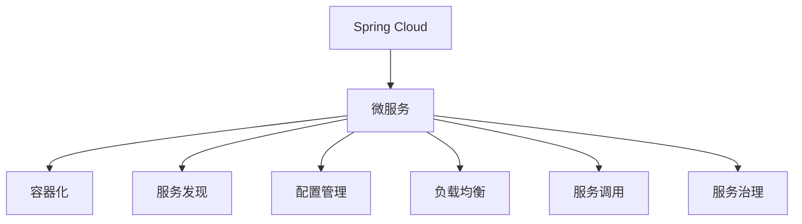

                 

# Spring Cloud微服务架构实战

> 关键词：Spring Cloud,微服务,分布式系统,架构设计,DevOps,容器化

## 1. 背景介绍

### 1.1 问题由来
随着互联网应用的日益复杂化和规模的不断扩大，传统单体应用难以应对大规模用户请求和高并发需求。为了提高系统的可扩展性、可靠性和灵活性，微服务架构应运而生。微服务架构将复杂系统拆分成多个小型、独立的、可以独立部署和扩展的服务，每个服务围绕业务能力进行构建，能够更好地应对复杂的业务场景和变化。

### 1.2 问题核心关键点
微服务架构的核心思想是将一个应用拆分成多个独立的服务单元，每个服务单元可以独立部署、扩展、更新和维护。这种架构模式具有以下几个优点：
1. 提高系统的可扩展性和灵活性，每个服务可以根据需要进行单独扩展。
2. 提升系统的可靠性，单个服务故障不会影响整个系统。
3. 加快系统更新和迭代速度，能够独立升级某个服务而不需要影响整个系统。
4. 降低系统复杂度，通过服务拆分和组合，简化系统开发和维护。

微服务架构的实现主要依赖于容器化、服务发现、配置管理、负载均衡、服务调用、服务治理等技术。Spring Cloud是一个基于Spring Boot的微服务框架，提供了丰富的微服务工具和组件，极大地简化了微服务架构的开发和运维。

### 1.3 问题研究意义
研究Spring Cloud微服务架构，对于提高企业的应用开发效率、降低运维成本、提升系统的稳定性和可扩展性具有重要意义：

1. 提高开发效率。Spring Cloud提供了丰富的工具和组件，可以快速搭建和部署微服务架构。
2. 降低运维成本。微服务架构将系统拆分成多个小型服务，每个服务独立运维，降低了运维的复杂度和成本。
3. 提升系统稳定性。微服务架构的松耦合性使得系统更加健壮，单个服务的故障不会影响整个系统。
4. 提升系统可扩展性。微服务架构可以根据业务需求，快速扩展和升级服务。
5. 简化系统开发和维护。微服务架构通过服务拆分和组合，降低了系统的复杂度，简化开发和维护。

## 2. 核心概念与联系

### 2.1 核心概念概述

为了更好地理解Spring Cloud微服务架构，本节将介绍几个密切相关的核心概念：

- Spring Cloud：基于Spring Boot的微服务框架，提供了丰富的工具和组件，用于构建和部署微服务架构。
- 微服务：将复杂系统拆分成多个小型、独立的、可以独立部署和扩展的服务，每个服务围绕业务能力进行构建。
- 容器化：将服务打包成容器，通过容器编排工具进行管理和部署，提高系统的可移植性和部署效率。
- 服务发现：管理微服务间的通信，通过服务发现组件实现服务注册和发现。
- 配置管理：管理微服务的配置信息，通过配置管理组件实现配置的集中管理和下发。
- 负载均衡：管理微服务的流量，通过负载均衡组件实现服务间请求的均衡分配。
- 服务调用：实现微服务之间的调用，通过服务调用组件实现服务间的异步通信和同步通信。
- 服务治理：管理微服务的生命周期，通过服务治理组件实现服务的健康检查、限流、熔断等。

这些核心概念之间的逻辑关系可以通过以下Mermaid流程图来展示：



这个流程图展示Spring Cloud微服务架构的核心概念及其之间的关系：

1. Spring Cloud作为微服务框架的基础，提供了构建和部署微服务所需的各种组件。
2. 微服务是Spring Cloud框架的核心应用场景，通过服务拆分和组合，实现系统的松耦合性和高可扩展性。
3. 容器化和服务发现、配置管理、负载均衡、服务调用、服务治理等技术是微服务架构的关键支撑技术，用于构建和管理微服务系统。

这些核心概念共同构成了Spring Cloud微服务架构的基础，使得微服务系统能够高效、可靠、灵活地运行。

## 3. 核心算法原理 & 具体操作步骤
### 3.1 算法原理概述

Spring Cloud微服务架构的核心思想是将一个复杂的应用拆分成多个小型、独立的、可以独立部署和扩展的服务，每个服务围绕业务能力进行构建。这种架构模式具有以下几个优点：
1. 提高系统的可扩展性和灵活性，每个服务可以根据需要进行单独扩展。
2. 提升系统的可靠性，单个服务故障不会影响整个系统。
3. 加快系统更新和迭代速度，能够独立升级某个服务而不需要影响整个系统。
4. 降低系统复杂度，通过服务拆分和组合，简化系统开发和维护。

### 3.2 算法步骤详解

Spring Cloud微服务架构的实现主要包括以下几个关键步骤：

**Step 1: 准备微服务架构**
- 定义系统的业务能力，将系统拆分成多个小型服务。
- 选择合适的微服务框架，如Spring Cloud，作为服务开发的支撑。

**Step 2: 设计服务通信协议**
- 定义服务之间的通信协议，如HTTP、RMI、gRPC等。
- 设计服务间的数据交换格式，如JSON、Protocol Buffers等。

**Step 3: 实现服务注册和发现**
- 实现服务的注册和发现机制，使服务能够动态注册和发现。
- 使用Spring Cloud的服务发现组件Eureka或Consul，实现服务的动态注册和发现。

**Step 4: 实现服务配置管理**
- 设计服务的配置信息，使用Spring Cloud的配置管理组件Config Server，集中管理配置信息。
- 在应用中引入Configuration Properties，动态加载配置信息。

**Step 5: 实现服务负载均衡**
- 设计服务的负载均衡机制，使用Spring Cloud的Ribbon或Netflix Ribbon，实现服务间请求的均衡分配。
- 配置负载均衡策略，如轮询、随机、权重等。

**Step 6: 实现服务间调用**
- 设计服务的调用机制，使用Spring Cloud的RestTemplate或Feign，实现服务间的异步通信和同步通信。
- 设计服务的接口，定义服务调用的参数和返回值。

**Step 7: 实现服务治理**
- 设计服务的治理机制，使用Spring Cloud的Zuul或Netflix Zuul，实现服务的健康检查、限流、熔断等。
- 配置健康检查规则，监控服务状态。

**Step 8: 实现系统监控和日志**
- 设计系统的监控和日志机制，使用Spring Cloud的Actuator和ELK Stack，实时监控和日志收集。
- 配置监控和日志的输出方式，如Prometheus、Grafana、Kibana等。

**Step 9: 实现容器化和部署**
- 将服务打包成容器，使用Docker等容器化工具，实现服务的可移植性和部署效率。
- 使用Spring Cloud的Spring Boot Starter Actuator，配置容器化服务的监控和日志。

以上是Spring Cloud微服务架构的一般流程。在实际应用中，还需要针对具体业务场景，对各个环节进行优化设计，如改进服务的调用方式、提升负载均衡策略、优化配置管理等，以进一步提升系统性能。

### 3.3 算法优缺点

Spring Cloud微服务架构具有以下优点：
1. 提高系统的可扩展性和灵活性，每个服务可以根据需要进行单独扩展。
2. 提升系统的可靠性，单个服务故障不会影响整个系统。
3. 加快系统更新和迭代速度，能够独立升级某个服务而不需要影响整个系统。
4. 降低系统复杂度，通过服务拆分和组合，简化系统开发和维护。

同时，该架构也存在一定的局限性：
1. 增加了系统复杂度，需要额外的管理和维护工作。
2. 服务间通信的延迟和网络开销可能增加。
3. 分布式系统的监控和日志管理较为复杂。
4. 需要额外配置和开发服务治理工具，增加了开发成本。

尽管存在这些局限性，但就目前而言，Spring Cloud微服务架构仍是最主流和广泛应用的微服务架构范式。未来相关研究的重点在于如何进一步优化微服务架构的设计和运维，提高系统的效率和可维护性，同时兼顾成本和性能。

### 3.4 算法应用领域

Spring Cloud微服务架构已经在诸多领域得到了广泛的应用，例如：

- 金融系统：金融机构需要构建高可用、高可扩展的系统，微服务架构能够满足其需求。
- 电商平台：电商平台需要处理海量订单和高并发请求，微服务架构能够提升其系统性能。
- 互联网应用：互联网应用需要快速迭代和升级，微服务架构能够提高其开发效率。
- 政府服务：政府服务需要高可靠性和高可用性，微服务架构能够保证其系统稳定。
- 医疗系统：医疗系统需要处理复杂的数据和逻辑，微服务架构能够提升其系统复杂度。

除了上述这些经典应用外，Spring Cloud微服务架构也被创新性地应用于更多场景中，如智能制造、智慧城市、智能交通等，为各行各业带来了新的技术变革。随着微服务架构的不断演进，相信其在更多领域的落地将更加广泛。

## 4. 数学模型和公式 & 详细讲解
### 4.1 数学模型构建

为了更好地理解Spring Cloud微服务架构的原理，本节将使用数学语言对微服务架构的构建进行更加严格的刻画。

记一个微服务系统包含 $n$ 个服务 $S_1, S_2, ..., S_n$，每个服务包含 $m$ 个任务 $T_{i_1}, T_{i_2}, ..., T_{i_m}$。定义服务间通信的延迟为 $D_{ij}$，任务间通信的延迟为 $D_{ik}$。

### 4.2 公式推导过程

以单服务系统为例，推导服务的响应时间和任务执行时间的计算公式。

假设服务 $S_i$ 的响应时间为 $R_i$，任务 $T_{ik}$ 的执行时间为 $E_{ik}$。则服务 $S_i$ 的总响应时间为：

$$
R_i = \sum_{k=1}^{m} \frac{D_{ik} + E_{ik}}{1 - D_{ik}E_{ik}}
$$

其中，$D_{ik}$ 和 $E_{ik}$ 分别表示服务 $S_i$ 和任务 $T_{ik}$ 的延迟时间。

将 $R_i$ 代入系统总响应时间的计算公式，得：

$$
R_{total} = \sum_{i=1}^{n} R_i
$$

这是计算Spring Cloud微服务架构系统总响应时间的数学模型。可以看到，系统总响应时间不仅与单个服务的响应时间有关，还与任务间通信的延迟和服务间通信的延迟有关。

## 5. 项目实践：代码实例和详细解释说明
### 5.1 开发环境搭建

在进行Spring Cloud微服务架构实践前，我们需要准备好开发环境。以下是使用Java进行Spring Boot开发的环境配置流程：

1. 安装Java JDK：从官网下载并安装最新版本的Java JDK。
2. 安装Maven：从官网下载并安装Maven，用于项目管理。
3. 创建Spring Boot项目：
```bash
mvn archetype:generate -DarchetypeArtifactId=maven-archetype-quickstart -DarchetypeVersion=1.0.4 -DgroupId=com.example -DartifactId=my-spring-boot -Dpackage=com.example
```

4. 添加Spring Cloud依赖：
```bash
mvn dependency:tree
```

5. 编写应用程序：
```java
@SpringBootApplication
public class MySpringBootApplication {
    public static void main(String[] args) {
        SpringApplication.run(MySpringBootApplication.class, args);
    }
}
```

完成上述步骤后，即可在项目中开始微服务架构的实践。

### 5.2 源代码详细实现

下面我们以微服务架构中的服务注册和发现为例，给出使用Spring Cloud实现服务的代码实现。

首先，定义服务注册类：

```java
@Component
@EnableDiscoveryClient
public class ServiceRegistry {
    @Value("${Eureka.instance.id}")
    private String instanceId;

    @Value("${Eureka.instance.ipAddress}")
    private String serverIdc;

    @Value("${Eureka.instance.port}")
    private int port;

    @Value("${Eureka.instance.decay}")
    private int refreshInterval;

    @Autowired
    private RestTemplate restTemplate;

    public String getServiceUrl(String serviceId) {
        String url = String.format("http://%s:%d/Eureka/v2/apps/%s", serverIdc, port, serviceId);
        return restTemplate.getForObject(url, String.class);
    }
}
```

然后，定义服务启动类：

```java
@SpringBootApplication
@EnableDiscoveryClient
public class MySpringBootApplication {
    public static void main(String[] args) {
        SpringApplication.run(MySpringBootApplication.class, args);
    }
}
```

接着，编写服务注册和发现的配置类：

```java
@Configuration
@EnableDiscoveryClient
public class ServiceDiscoveryConfig {
    @Autowired
    private ServiceRegistry serviceRegistry;

    @Bean
    public ConfigurableLoadBalancerClient loadBalancerClient() {
        LoadBalancerClient lbClient = new SimpleLoadBalancerClient();
        lbClient.setLoadBalancerServiceRegistry(serviceRegistry);
        return lbClient;
    }
}
```

最后，启动服务并访问注册中心：

```java
@SpringBootApplication
@EnableDiscoveryClient
public class MySpringBootApplication {
    public static void main(String[] args) {
        SpringApplication.run(MySpringBootApplication.class, args);
    }
}
```

以上就是使用Spring Cloud实现服务注册和发现的完整代码实现。可以看到，通过注解和配置文件，Spring Cloud极大地简化了微服务架构的开发和配置。

### 5.3 代码解读与分析

让我们再详细解读一下关键代码的实现细节：

**ServiceRegistry类**：
- `instanceId`、`serverIdc`、`port`、`refreshInterval` 字段：定义服务的实例ID、数据中心、端口、注册刷新间隔。
- `getServiceUrl` 方法：获取指定服务的注册信息。
- `RestTemplate` 注入：用于发送HTTP请求，获取注册中心的API接口信息。

**MySpringBootApplication类**：
- `@SpringBootApplication` 注解：启用Spring Boot自动配置和组件扫描。
- `@EnableDiscoveryClient` 注解：注册到Eureka注册中心。

**ServiceDiscoveryConfig类**：
- `loadBalancerClient` 方法：定义负载均衡客户端，将服务注册信息注入负载均衡器。
- `ConfigurableLoadBalancerClient` 类：Spring Cloud提供的负载均衡客户端，用于处理服务的负载均衡。

**MySpringBootApplication类**：
- `@SpringBootApplication` 注解：启用Spring Boot自动配置和组件扫描。
- `@EnableDiscoveryClient` 注解：注册到Eureka注册中心。

可以看到，Spring Cloud通过注解和配置文件，极大地简化了微服务架构的开发和配置，使得开发者能够快速搭建和部署微服务系统。

当然，工业级的系统实现还需考虑更多因素，如服务治理、监控、日志、容器化等。但核心的微服务架构构建和开发方法基本与此类似。

## 6. 实际应用场景
### 6.1 智能客服系统

基于Spring Cloud微服务架构的智能客服系统，能够实现7x24小时不间断服务，快速响应客户咨询，自然流畅地与客户交互。系统通过微服务拆分和组合，能够灵活应对不同客户的需求，提供个性化的服务。

在技术实现上，可以使用Spring Cloud构建微服务架构，将客户咨询、对话管理、意图识别、实体抽取、回复生成等服务拆分和组合，通过RESTful API进行服务间调用。同时，可以使用Spring Cloud的Eureka注册中心和Ribbon负载均衡器，实现服务的动态注册和负载均衡，确保系统的稳定性和可靠性。

### 6.2 金融舆情监测

金融舆情监测系统需要实时监测市场舆论动向，规避金融风险。通过Spring Cloud微服务架构，可以实现实时抓取的网络文本数据，通过多服务协同处理，自动监测不同主题下的情感变化趋势，一旦发现负面信息激增等异常情况，系统便会自动预警，帮助金融机构快速应对潜在风险。

在技术实现上，可以使用Spring Cloud构建微服务架构，将舆情监测、情感分析、风险预警等服务拆分和组合，通过RESTful API进行服务间调用。同时，可以使用Spring Cloud的Eureka注册中心和Zuul服务治理，实现服务的动态注册和治理，确保系统的稳定性和可靠性。

### 6.3 个性化推荐系统

个性化推荐系统需要快速迭代和升级，使用Spring Cloud微服务架构，可以满足其需求。通过微服务拆分和组合，系统可以灵活地处理用户行为数据，提取和用户交互的物品标题、描述、标签等文本内容，通过服务间调用和负载均衡，高效地生成个性化推荐列表。

在技术实现上，可以使用Spring Cloud构建微服务架构，将用户行为数据、物品推荐、个性化推荐等服务拆分和组合，通过RESTful API进行服务间调用。同时，可以使用Spring Cloud的Eureka注册中心和Ribbon负载均衡器，实现服务的动态注册和负载均衡，确保系统的稳定性和可靠性。

### 6.4 未来应用展望

随着Spring Cloud微服务架构的不断演进，其在更多领域的应用前景广阔。

在智慧医疗领域，基于微服务的医疗问答、病历分析、药物研发等应用，将提升医疗服务的智能化水平，辅助医生诊疗，加速新药开发进程。

在智能教育领域，微服务架构可用于作业批改、学情分析、知识推荐等方面，因材施教，促进教育公平，提高教学质量。

在智慧城市治理中，微服务架构可用于城市事件监测、舆情分析、应急指挥等环节，提高城市管理的自动化和智能化水平，构建更安全、高效的未来城市。

此外，在企业生产、社会治理、文娱传媒等众多领域，基于Spring Cloud的微服务架构的应用也将不断涌现，为经济社会发展注入新的动力。相信随着技术的日益成熟，微服务架构必将在构建人机协同的智能时代中扮演越来越重要的角色。

## 7. 工具和资源推荐
### 7.1 学习资源推荐

为了帮助开发者系统掌握Spring Cloud微服务架构的理论基础和实践技巧，这里推荐一些优质的学习资源：

1. Spring Cloud官方文档：Spring Cloud官方提供的文档，详细介绍了Spring Cloud各个组件的使用方法和最佳实践。
2. Spring Cloud实战指南：《Spring Cloud实战指南》一书，系统讲解了Spring Cloud微服务架构的构建和运维方法。
3. Spring Boot官方文档：Spring Boot官方提供的文档，详细介绍了Spring Boot框架的使用方法和最佳实践。
4. Spring Boot实战指南：《Spring Boot实战指南》一书，系统讲解了Spring Boot框架的构建和运维方法。
5. Spring Boot和Spring Cloud最佳实践：《Spring Boot和Spring Cloud最佳实践》一书，系统讲解了Spring Boot和Spring Cloud框架的最佳实践和设计模式。
6. Spring Cloud微服务架构教程：《Spring Cloud微服务架构教程》视频课程，系统讲解了Spring Cloud微服务架构的构建和运维方法。

通过对这些资源的学习实践，相信你一定能够快速掌握Spring Cloud微服务架构的精髓，并用于解决实际的业务问题。

### 7.2 开发工具推荐

高效的开发离不开优秀的工具支持。以下是几款用于Spring Cloud微服务架构开发的常用工具：

1. Spring Boot：基于Java的微服务框架，提供了强大的构建微服务架构的能力。
2. Spring Cloud：基于Spring Boot的微服务框架，提供了丰富的微服务组件和工具。
3. Spring Data：提供数据访问和持久化支持，简化微服务中的数据访问。
4. Spring Security：提供安全的身份验证和授权机制，保护微服务的安全。
5. Spring Boot Starter：提供丰富的Spring Boot模块，方便微服务的开发和部署。
6. Spring Cloud Gateway：提供API网关和路由功能，简化微服务间的服务调用。
7. Spring Cloud Config：提供配置管理功能，简化微服务的配置管理。

合理利用这些工具，可以显著提升Spring Cloud微服务架构的开发效率，加快创新迭代的步伐。

### 7.3 相关论文推荐

Spring Cloud微服务架构的发展源于学界的持续研究。以下是几篇奠基性的相关论文，推荐阅读：

1. Spring Cloud微服务架构的体系结构设计：介绍了Spring Cloud微服务架构的体系结构和设计原则。
2. Spring Cloud微服务架构的分布式系统设计：讨论了Spring Cloud微服务架构的分布式系统设计方法和技术。
3. Spring Cloud微服务架构的DevOps实践：探讨了Spring Cloud微服务架构的DevOps实践和工具。
4. Spring Cloud微服务架构的容器化部署：介绍了Spring Cloud微服务架构的容器化部署方法和工具。
5. Spring Cloud微服务架构的安全性设计：讨论了Spring Cloud微服务架构的安全性设计和实现方法。

这些论文代表了大语言模型微调技术的发展脉络。通过学习这些前沿成果，可以帮助研究者把握学科前进方向，激发更多的创新灵感。

## 8. 总结：未来发展趋势与挑战
### 8.1 总结

本文对Spring Cloud微服务架构进行了全面系统的介绍。首先阐述了微服务架构的研究背景和意义，明确了微服务在提升系统可扩展性、可靠性、灵活性等方面的独特价值。其次，从原理到实践，详细讲解了Spring Cloud微服务架构的数学原理和关键步骤，给出了微服务架构开发的完整代码实例。同时，本文还广泛探讨了微服务架构在智能客服、金融舆情、个性化推荐等多个行业领域的应用前景，展示了微服务架构的巨大潜力。此外，本文精选了微服务架构的各种学习资源，力求为读者提供全方位的技术指引。

通过本文的系统梳理，可以看到，Spring Cloud微服务架构已经在大规模系统中得到广泛应用，极大地提升了系统的可扩展性、可靠性和灵活性。得益于Spring Cloud框架的强大功能和丰富的组件支持，微服务架构的开发和运维变得更加便捷高效。未来，随着微服务架构的不断演进和优化，相信其在更多领域的应用将更加广泛，为各行各业带来更多变革性的技术支持。

### 8.2 未来发展趋势

展望未来，Spring Cloud微服务架构将呈现以下几个发展趋势：

1. 微服务规模持续增大。随着业务需求的不断变化，微服务架构的规模将持续增长，系统将更加复杂和庞大。
2. 微服务管理工具更加丰富。微服务架构需要更多的管理工具，如服务发现、配置管理、负载均衡、服务治理等，用于提升系统的可管理性和可维护性。
3. 微服务架构与DevOps深度融合。微服务架构需要更多的DevOps工具，如自动化测试、持续集成、持续部署、容器化等，提升系统的自动化和效率。
4. 微服务架构的安全性进一步提升。微服务架构需要更多的安全机制，如身份验证、授权、数据加密等，保护系统的安全性和隐私性。
5. 微服务架构的持续学习。微服务架构需要更多的学习机制，如实时监控、日志分析、智能告警等，提升系统的自适应能力和故障自愈能力。

以上趋势凸显了Spring Cloud微服务架构的发展方向，这些方向的探索发展，必将进一步提升微服务架构的性能和可维护性，为构建高效、可靠、灵活的微服务系统提供新的动力。

### 8.3 面临的挑战

尽管Spring Cloud微服务架构已经取得了显著成就，但在迈向更加智能化、普适化应用的过程中，仍面临诸多挑战：

1. 系统复杂度增加。微服务架构的拆分和组合，使得系统复杂度增加，增加了开发和运维的难度。
2. 性能开销增加。微服务架构的服务间通信和负载均衡，增加了系统的性能开销。
3. 监控和日志管理复杂。微服务架构需要更多的监控和日志管理工具，增加了运维的复杂度。
4. 安全性问题突出。微服务架构需要更多的安全机制，增加了安全管理的复杂度。
5. 部署和维护成本增加。微服务架构需要更多的运维工具和资源，增加了系统的部署和维护成本。

尽管存在这些挑战，但就目前而言，Spring Cloud微服务架构仍是最主流和广泛应用的微服务架构范式。未来相关研究的重点在于如何进一步优化微服务架构的设计和运维，提高系统的效率和可维护性，同时兼顾成本和性能。

### 8.4 研究展望

面对Spring Cloud微服务架构所面临的种种挑战，未来的研究需要在以下几个方面寻求新的突破：

1. 探索更高效的服务调用机制。开发更加高效的服务调用机制，如gRPC、Thrift等，减少服务间通信的开销，提高系统的性能。
2. 研究更灵活的配置管理机制。开发更加灵活的配置管理机制，如动态配置、分布式配置等，提升系统的可配置性和可维护性。
3. 融合更多新兴技术。将新兴技术如区块链、边缘计算、IoT等与微服务架构进行深度融合，提升系统的智能化和灵活性。
4. 优化微服务架构的监控和日志管理。开发更加高效的监控和日志管理工具，如Prometheus、Grafana、Kibana等，提升系统的监控和故障排除能力。
5. 加强微服务架构的安全性设计。开发更多的安全机制，如OAuth2、JWT、SSL等，提升系统的安全性。

这些研究方向的探索，必将引领Spring Cloud微服务架构向更高的台阶，为构建高效、可靠、灵活的微服务系统提供新的技术支持。面向未来，Spring Cloud微服务架构还需要与其他新兴技术进行更深入的融合，共同推动微服务架构的进步。只有勇于创新、敢于突破，才能不断拓展微服务架构的边界，让系统更加智能、可靠和高效。

## 9. 附录：常见问题与解答

**Q1：微服务架构和单体架构有什么区别？**

A: 微服务架构将一个复杂的应用拆分成多个小型、独立的、可以独立部署和扩展的服务，每个服务围绕业务能力进行构建。单体架构则是将整个应用作为一个整体进行开发和部署，服务的依赖关系较为紧密。

**Q2：微服务架构的缺点有哪些？**

A: 微服务架构的缺点包括：
1. 系统复杂度增加，增加了开发和运维的难度。
2. 性能开销增加，服务间通信和负载均衡增加了系统的性能开销。
3. 监控和日志管理复杂，需要更多的监控和日志管理工具。
4. 安全性问题突出，需要更多的安全机制。
5. 部署和维护成本增加，需要更多的运维工具和资源。

尽管存在这些缺点，但就目前而言，微服务架构仍是最主流和广泛应用的架构范式。未来相关研究的重点在于如何进一步优化微服务架构的设计和运维，提高系统的效率和可维护性，同时兼顾成本和性能。

**Q3：如何使用Spring Cloud实现服务调用？**

A: 使用Spring Cloud，可以通过RestTemplate和Feign两种方式实现服务调用。RestTemplate是基于RESTful API的同步调用方式，Feign是基于HTTP的异步调用方式。

RestTemplate调用方式：
```java
RestTemplate restTemplate = new RestTemplate();
String result = restTemplate.getForObject("http://service-name/url", String.class);
```

Feign调用方式：
```java
@FeignClient("service-name")
public interface ServiceClient {
    @GetMapping("/url")
    String get();
}

@Service
public class ServiceService {
    @Autowired
    private ServiceClient serviceClient;

    public String callService() {
        return serviceClient.get();
    }
}
```

以上是使用Spring Cloud实现服务调用的两种方式，开发人员可以根据需求选择适合的调用方式。

---

作者：禅与计算机程序设计艺术 / Zen and the Art of Computer Programming

