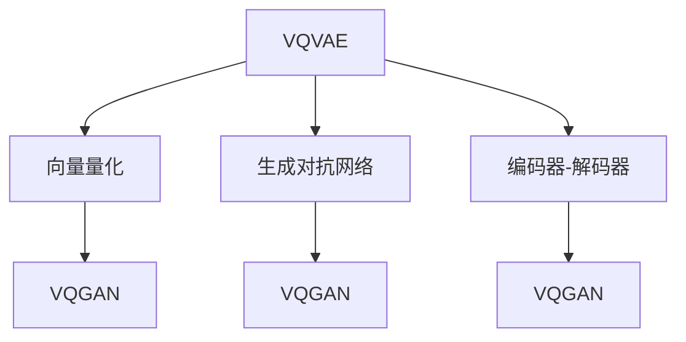

                 

# VQVAE 和 VQGAN 的差异

## 1. 背景介绍

### 1.1 问题由来
自从2013年 Kingma 和 Welling 提出 Variational Autoencoder (VAE) 以来，VAE 在图像生成、压缩、变分推理等领域展现了强大的能力，并在图像生成领域引发了一系列的研究热潮。然而，标准 VAE 存在编码器与解码器依赖的问题，以及需要详细设计学习率等难点，使得 VAE 在应用上存在一定限制。

为了进一步推动 VAE 的研究，Gifflert 等人提出了 Vector Quantized Variational Autoencoder (VQ-VAE)，并在此基础上推出了 Vector Quantized Generative Adversarial Networks (VQGAN)，显著改善了 VAE 的性能和可解释性。

### 1.2 问题核心关键点
VQVAE 和 VQGAN 是两个有影响力的框架，核心在于将连续空间的编码向量映射到离散向量上，并以此重构原输入空间。其中，VQVAE 更加关注压缩效率，VQGAN 则通过对抗训练提高生成质量。本文将详细对比这两个框架的核心算法、实施细节、优缺点以及应用领域，帮助读者更好地理解这两个框架的异同。

## 2. 核心概念与联系

### 2.1 核心概念概述

为了更好地理解 VQVAE 和 VQGAN 之间的差异，本节将详细介绍以下几个关键概念：

- **VQVAE**：一种通过向量量化提高 VAE 压缩效率的变分自编码器框架。
- **VQGAN**：一种通过对抗训练优化生成分布的变分生成自编码器框架。
- **向量量化**：将连续向量映射到离散向量上的技术，可用于高效压缩和编码。
- **生成对抗网络**：一种通过对抗训练提升生成模型性能的框架。
- **编码器-解码器**：VAE 的核心组件，负责将输入映射到潜在表示，再通过解码器生成输出。

这些核心概念之间的逻辑关系可以通过以下 Mermaid 流程图来展示：



这个流程图展示了大语言模型微调的各个核心概念及其之间的关系：

1. VQVAE 通过向量量化提高了 VAE 的压缩效率。
2. VQGAN 利用生成对抗网络优化生成分布。
3. VQVAE 和 VQGAN 都使用编码器-解码器结构。
4. VQGAN 结合了向量量化和生成对抗网络的思想。

这些概念共同构成了 VQVAE 和 VQGAN 的研究基础，使其在图像生成等领域发挥重要作用。

## 3. 核心算法原理 & 具体操作步骤

### 3.1 算法原理概述

#### 3.1.1 VQVAE 原理

VQVAE 是一种将 VAE 与向量量化技术相结合的生成模型。其主要原理是通过将编码器输出的连续向量投影到离散空间，降低数据的维度并提高生成效率。

#### 3.1.2 VQGAN 原理

VQGAN 是一种结合生成对抗网络和向量量化技术的生成模型。其主要原理是通过生成器和判别器的对抗训练，优化生成分布，同时利用向量量化技术提高生成效率。

#### 3.1.3 算法步骤详解

##### 3.1.3.1 VQVAE 操作步骤
1. 编码器输入图像 $x$，输出编码向量 $z$。
2. 使用量化函数将 $z$ 映射到离散向量 $z_q$。
3. 解码器从 $z_q$ 重构 $x$。
4. 计算重构误差 $r$。
5. 定义 VAE 的损失函数 $\mathcal{L}_{VQVAE}$。

   $$
   \mathcal{L}_{VQVAE} = \mathbb{E}_{x \sim p(x)} [r(x)] + D_{KL}(q(z|x)||p(z))
   $$

6. 使用 VAE 的训练过程更新编码器和解码器参数。

##### 3.1.3.2 VQGAN 操作步骤
1. 生成器从随机噪声 $z$ 生成图像 $G(z)$。
2. 判别器输入 $G(z)$ 和真实图像 $x$，输出概率 $D(x)$ 和 $D(G(z))$。
3. 量化函数将 $z$ 映射到离散向量 $z_q$。
4. 解码器从 $z_q$ 重构 $x$。
5. 计算重构误差 $r$。
6. 定义 VQGAN 的损失函数 $\mathcal{L}_{VQGAN}$。

   $$
   \mathcal{L}_{VQGAN} = \mathbb{E}_{z \sim p(z)} [\log D(G(z))] + \mathbb{E}_{x \sim p(x)} [\log (1 - D(x))]
   $$

7. 使用 GAN 的对抗训练过程更新生成器和判别器参数。

### 3.2 算法优缺点

#### 3.2.1 VQVAE 的优缺点
**优点**：
1. 通过向量量化技术显著提高了 VAE 的压缩效率。
2. 结构简单，易于实现。
3. 在数据压缩和重构方面表现优异。

**缺点**：
1. 生成质量较差，生成图像常常出现模糊和不清晰现象。
2. 对超参数的调整要求较高，需要仔细设计学习率和量化步长。

#### 3.2.2 VQGAN 的优缺点
**优点**：
1. 通过对抗训练显著提升了生成质量，生成图像清晰，细节丰富。
2. 能够生成高质量的多样化图像。
3. 结合向量量化技术，提高了生成效率。

**缺点**：
1. 结构复杂，实现难度较大。
2. 训练过程不稳定，容易陷入局部最优。
3. 生成过程需要大量的计算资源。

### 3.3 算法应用领域

#### 3.3.1 VQVAE 应用领域
VQVAE 在图像压缩、图像生成等领域有广泛的应用。例如，可以将 VQVAE 应用于医学图像压缩，显著降低图像存储成本，同时保持图像质量。

#### 3.3.2 VQGAN 应用领域
VQGAN 在图像生成、图像风格转换等领域有重要应用。例如，可以将 VQGAN 应用于生成逼真的面部图像，推动面部识别技术的发展。

## 4. 数学模型和公式 & 详细讲解

### 4.1 数学模型构建

#### 4.1.1 VQVAE 数学模型
VQVAE 主要由编码器、量化函数和解码器组成。设编码器为 $E(x) : \mathcal{X} \rightarrow \mathcal{Z}$，解码器为 $D(z_q) : \mathcal{Z}_q \rightarrow \mathcal{X}$，其中 $\mathcal{Z}$ 为编码器的连续向量空间，$\mathcal{Z}_q$ 为离散向量空间。设 $\varepsilon$ 为噪声，$z \sim \mathcal{N}(0, I)$。则 VQVAE 的生成过程可以表示为：

1. 编码器输入图像 $x$，输出连续向量 $z$。
2. 量化函数将 $z$ 映射到离散向量 $z_q$。
3. 解码器从 $z_q$ 重构 $x$。

设 $r(x) = ||x - D(z_q)||_2^2$ 为重构误差。VQVAE 的损失函数定义为：

$$
\mathcal{L}_{VQVAE} = \mathbb{E}_{x \sim p(x)} [r(x)] + D_{KL}(q(z|x)||p(z))
$$

其中 $D_{KL}$ 为 KL 散度，$q(z|x)$ 为编码器输出的向量分布，$p(z)$ 为原始向量 $z$ 的先验分布。

#### 4.1.2 VQGAN 数学模型
VQGAN 主要由生成器、判别器和量化函数组成。设生成器为 $G(z) : \mathcal{Z} \rightarrow \mathcal{X}$，判别器为 $D(x) : \mathcal{X} \rightarrow [0, 1]$。设 $\varepsilon$ 为噪声，$z \sim \mathcal{N}(0, I)$。则 VQGAN 的生成过程可以表示为：

1. 生成器从噪声 $z$ 生成图像 $G(z)$。
2. 判别器输入 $G(z)$ 和真实图像 $x$，输出概率 $D(x)$ 和 $D(G(z))$。
3. 量化函数将 $z$ 映射到离散向量 $z_q$。
4. 解码器从 $z_q$ 重构 $x$。

设 $r(x) = ||x - D(z_q)||_2^2$ 为重构误差。VQGAN 的损失函数定义为：

$$
\mathcal{L}_{VQGAN} = \mathbb{E}_{z \sim p(z)} [\log D(G(z))] + \mathbb{E}_{x \sim p(x)} [\log (1 - D(x))]
$$

### 4.2 公式推导过程

#### 4.2.1 VQVAE 公式推导
设编码器为 $E(x)$，解码器为 $D(z_q)$，量化函数为 $Q(z)$。则 VQVAE 的编码器输出为：

$$
z = E(x)
$$

设离散向量空间为 $\mathcal{Z}_q = \{z_q^1, z_q^2, \cdots, z_q^K\}$，其中 $z_q^k$ 表示第 $k$ 个离散向量。设 $z_q = Q(z)$ 为 $z$ 的量化结果。则 VQVAE 的解码器输出为：

$$
\hat{x} = D(z_q)
$$

设重构误差为 $r(x) = ||x - \hat{x}||_2^2$，则 VQVAE 的损失函数为：

$$
\mathcal{L}_{VQVAE} = \mathbb{E}_{x \sim p(x)} [r(x)] + D_{KL}(q(z|x)||p(z))
$$

其中 $q(z|x)$ 为编码器输出的向量分布，$p(z)$ 为原始向量 $z$ 的先验分布。

#### 4.2.2 VQGAN 公式推导
设生成器为 $G(z)$，判别器为 $D(x)$，量化函数为 $Q(z)$。则 VQGAN 的生成器输出为：

$$
\hat{x} = G(z)
$$

设判别器输出为 $D(x)$ 和 $D(\hat{x})$，则 VQGAN 的损失函数为：

$$
\mathcal{L}_{VQGAN} = \mathbb{E}_{z \sim p(z)} [\log D(G(z))] + \mathbb{E}_{x \sim p(x)} [\log (1 - D(x))]
$$

### 4.3 案例分析与讲解

#### 4.3.1 VQVAE 案例分析
假设有一张 $32 \times 32$ 的图像 $x$，将其输入编码器 $E(x)$，输出连续向量 $z$。设离散向量空间为 $\mathcal{Z}_q = \{z_q^1, z_q^2, \cdots, z_q^K\}$，其中 $z_q^k$ 表示第 $k$ 个离散向量。设量化函数为 $Q(z) = \operatorname{arg\_min}_k ||z - z_q^k||_2^2$，则将 $z$ 映射到最接近的离散向量 $z_q$。设解码器为 $D(z_q)$，则从 $z_q$ 重构图像 $\hat{x}$。

设重构误差为 $r(x) = ||x - \hat{x}||_2^2$，则 VQVAE 的损失函数为：

$$
\mathcal{L}_{VQVAE} = \mathbb{E}_{x \sim p(x)} [r(x)] + D_{KL}(q(z|x)||p(z))
$$

#### 4.3.2 VQGAN 案例分析
假设有一张 $32 \times 32$ 的图像 $x$，生成器从噪声 $z$ 生成图像 $G(z)$。设判别器为 $D(x)$ 和 $D(G(z))$，则判别器的输出为 $D(x)$ 和 $D(G(z))$。设量化函数为 $Q(z) = \operatorname{arg\_min}_k ||z - z_q^k||_2^2$，则将 $z$ 映射到最接近的离散向量 $z_q$。设解码器为 $D(z_q)$，则从 $z_q$ 重构图像 $\hat{x}$。

设重构误差为 $r(x) = ||x - \hat{x}||_2^2$，则 VQGAN 的损失函数为：

$$
\mathcal{L}_{VQGAN} = \mathbb{E}_{z \sim p(z)} [\log D(G(z))] + \mathbb{E}_{x \sim p(x)} [\log (1 - D(x))]
$$

## 5. 项目实践：代码实例和详细解释说明

### 5.1 开发环境搭建

在使用 TensorFlow 或 PyTorch 实现 VQVAE 和 VQGAN 时，需要搭建相应的开发环境。以下是使用 PyTorch 的详细配置步骤：

1. 安装 PyTorch：
```bash
pip install torch torchvision torchaudio
```

2. 安装 TensorBoard：
```bash
pip install tensorboard
```

3. 安装 Transformers 库：
```bash
pip install transformers
```

完成上述步骤后，即可在 Jupyter Notebook 中启动 PyTorch 和 TensorBoard。

### 5.2 源代码详细实现

#### 5.2.1 VQVAE 实现
首先，定义 VQVAE 的编码器和解码器：

```python
import torch
import torch.nn as nn
import torch.nn.functional as F

class Encoder(nn.Module):
    def __init__(self, latent_dim):
        super(Encoder, self).__init__()
        self.latent_dim = latent_dim
        self.conv1 = nn.Conv2d(3, 16, kernel_size=3, stride=1, padding=1)
        self.conv2 = nn.Conv2d(16, 8, kernel_size=3, stride=1, padding=1)
        self.conv3 = nn.Conv2d(8, latent_dim, kernel_size=3, stride=1, padding=1)
        
    def forward(self, x):
        x = F.relu(self.conv1(x))
        x = F.relu(self.conv2(x))
        x = F.relu(self.conv3(x))
        return x

class Decoder(nn.Module):
    def __init__(self, latent_dim):
        super(Decoder, self).__init__()
        self.conv1 = nn.ConvTranspose2d(latent_dim, 8, kernel_size=3, stride=1, padding=1)
        self.conv2 = nn.ConvTranspose2d(8, 16, kernel_size=3, stride=1, padding=1)
        self.conv3 = nn.ConvTranspose2d(16, 3, kernel_size=3, stride=1, padding=1)
        
    def forward(self, x):
        x = F.relu(self.conv1(x))
        x = F.relu(self.conv2(x))
        x = torch.sigmoid(self.conv3(x))
        return x
```

然后，定义 VQVAE 的编码器和解码器的模型：

```python
class VQVAE(nn.Module):
    def __init__(self, latent_dim, embed_dim, num_clusters):
        super(VQVAE, self).__init__()
        self.latent_dim = latent_dim
        self.embed_dim = embed_dim
        self.num_clusters = num_clusters
        
        self.encoder = Encoder(latent_dim)
        self.decoder = Decoder(latent_dim)
        
        self.embedding = nn.Embedding(num_clusters, embed_dim)
        self.gaussian = nn.GaussianNLLLoss(reduction='sum')
        
    def forward(self, x):
        z = self.encoder(x)
        z_q = self.embedding.weight[torch.round(z / self.latent_dim * self.num_clusters).long()]
        x_hat = self.decoder(z_q)
        
        r = F.mse_loss(x_hat, x)
        
        z_q = torch.mean(z_q, 1, True)
        z_q = z_q + self.latent_dim * (z - z_q).detach()
        z_q = F.gumbel_softmax(z_q, hard=True)
        z_q = torch.clamp(z_q, 0, 1)
        
        loss = r + self.gaussian(z, self.encoder.weight)
        return x_hat, z_q, loss
```

最后，定义 VQVAE 的训练函数：

```python
def train_vqvae(model, train_loader, device):
    optimizer = torch.optim.Adam(model.parameters(), lr=1e-4)
    criterion = nn.MSELoss()
    
    for epoch in range(epochs):
        for batch in train_loader:
            x, _ = batch
            x = x.to(device)
            x_hat, z_q, loss = model(x)
            optimizer.zero_grad()
            loss.backward()
            optimizer.step()
```

#### 5.2.2 VQGAN 实现
首先，定义 VQGAN 的生成器和判别器：

```python
class Generator(nn.Module):
    def __init__(self, latent_dim, image_size):
        super(Generator, self).__init__()
        self.latent_dim = latent_dim
        self.image_size = image_size
        
        self.linear1 = nn.Linear(latent_dim, 256)
        self.linear2 = nn.Linear(256, 512)
        self.linear3 = nn.Linear(512, image_size * image_size)
        self.decoder = nn.Sequential(
            nn.ConvTranspose2d(256, 128, kernel_size=4, stride=2, padding=1),
            nn.ReLU(),
            nn.ConvTranspose2d(128, 64, kernel_size=4, stride=2, padding=1),
            nn.ReLU(),
            nn.ConvTranspose2d(64, 3, kernel_size=4, stride=2, padding=1),
            nn.Tanh()
        )
        
    def forward(self, z):
        z = self.linear1(z)
        z = self.linear2(z)
        z = self.linear3(z).view(z.size(0), z.size(1), 1, 1)
        return self.decoder(z)
        
class Discriminator(nn.Module):
    def __init__(self, image_size):
        super(Discriminator, self).__init__()
        self.image_size = image_size
        
        self.conv1 = nn.Conv2d(3, 64, kernel_size=4, stride=2, padding=1)
        self.conv2 = nn.Conv2d(64, 128, kernel_size=4, stride=2, padding=1)
        self.conv3 = nn.Conv2d(128, 256, kernel_size=4, stride=2, padding=1)
        self.fc = nn.Linear(256, 1)
        
    def forward(self, x):
        x = F.leaky_relu(self.conv1(x))
        x = F.leaky_relu(self.conv2(x))
        x = F.leaky_relu(self.conv3(x))
        x = self.fc(x)
        return x
```

然后，定义 VQGAN 的生成器和判别器的模型：

```python
class VQGAN(nn.Module):
    def __init__(self, latent_dim, image_size, num_clusters):
        super(VQGAN, self).__init__()
        self.latent_dim = latent_dim
        self.image_size = image_size
        self.num_clusters = num_clusters
        
        self.encoder = Encoder(latent_dim)
        self.decoder = Decoder(latent_dim)
        
        self.embedding = nn.Embedding(num_clusters, latent_dim)
        self.generator = Generator(latent_dim, image_size)
        self.discriminator = Discriminator(image_size)
        
        self.gaussian = nn.GaussianNLLLoss(reduction='sum')
        
    def forward(self, x):
        z = self.encoder(x)
        z_q = self.embedding.weight[torch.round(z / self.latent_dim * self.num_clusters).long()]
        x_hat = self.decoder(z_q)
        
        x_hat = self.generator(z)
        D_G = self.discriminator(x_hat)
        D_X = self.discriminator(x)
        
        loss = -torch.log(1 - D_G) + torch.log(D_X)
        return x_hat, z_q, loss
```

最后，定义 VQGAN 的训练函数：

```python
def train_vqgan(model, train_loader, device):
    generator_optimizer = torch.optim.Adam(model.generator.parameters(), lr=1e-4)
    discriminator_optimizer = torch.optim.Adam(model.discriminator.parameters(), lr=1e-4)
    criterion = nn.BCELoss()
    
    for epoch in range(epochs):
        for batch in train_loader:
            x, _ = batch
            x = x.to(device)
            x_hat, z_q, loss = model(x)
            generator_optimizer.zero_grad()
            loss.backward()
            generator_optimizer.step()
            
            D_G = model.discriminator(x_hat)
            D_X = model.discriminator(x)
            generator_optimizer.zero_grad()
            loss = -torch.log(1 - D_G) + torch.log(D_X)
            loss.backward()
            discriminator_optimizer.step()
```

### 5.3 代码解读与分析

#### 5.3.1 VQVAE 代码解读
1. **Encoder** 定义了编码器的结构，包括三个卷积层，将输入图像 $x$ 压缩为连续向量 $z$。
2. **Decoder** 定义了解码器的结构，包括三个反卷积层，将连续向量 $z_q$ 重构为原始图像 $x$。
3. **VQVAE** 定义了整个 VQVAE 的模型结构，包括编码器、解码器、量化函数和损失函数。
4. **train_vqvae** 定义了 VQVAE 的训练函数，使用 Adam 优化器最小化损失函数。

#### 5.3.2 VQGAN 代码解读
1. **Generator** 定义了生成器的结构，包括三个线性层和四个反卷积层，将噪声 $z$ 生成图像 $x$。
2. **Discriminator** 定义了判别器的结构，包括三个卷积层和一个线性层，输出 $G(z)$ 和 $x$ 的真实性概率。
3. **VQGAN** 定义了整个 VQGAN 的模型结构，包括生成器、判别器、量化函数和损失函数。
4. **train_vqgan** 定义了 VQGAN 的训练函数，使用 Adam 优化器最小化损失函数。

## 6. 实际应用场景

### 6.1 智能生成
#### 6.1.1 VQVAE 应用
VQVAE 可用于生成具有较高压缩效率的图像，广泛应用于图像压缩、图像生成等领域。例如，可以将 VQVAE 应用于医学图像压缩，显著降低图像存储成本，同时保持图像质量。

#### 6.1.2 VQGAN 应用
VQGAN 可用于生成高质量、多样化的图像，广泛应用于图像生成、图像风格转换等领域。例如，可以将 VQGAN 应用于生成逼真的面部图像，推动面部识别技术的发展。

### 6.2 数据增强
VQVAE 和 VQGAN 都可以用于生成与训练数据相似但不同的图像，作为数据增强的一部分，帮助提升模型的泛化能力。例如，可以将 VQVAE 或 VQGAN 应用于医学影像，生成多样化的训练数据，提高模型的诊断准确率。

### 6.3 视频生成
VQGAN 可以用于生成高质量的视频序列，广泛应用于视频生成、视频编码等领域。例如，可以将 VQGAN 应用于生成流畅的视频动画，提高视频内容的创作效率。

## 7. 工具和资源推荐

### 7.1 学习资源推荐

为了帮助开发者系统掌握 VQVAE 和 VQGAN 的理论基础和实践技巧，这里推荐一些优质的学习资源：

1. **《Variational Autoencoders for Data Compression and Denoising》**：这篇论文介绍了 VAE 的压缩与去噪能力，是学习 VAE 的基础。
2. **《Efficient Vector Quantization and Hierarchical Clustering with Cotangent Bundles》**：这篇论文介绍了向量量化与层次聚类，是理解 VQVAE 和 VQGAN 的理论基础。
3. **《A Style-Based Generator Architecture for Generative Adversarial Networks》**：这篇论文介绍了 StyleGAN 的生成模型结构，是学习 VQGAN 的良好资源。

### 7.2 开发工具推荐

高效的开发离不开优秀的工具支持。以下是几款用于 VQVAE 和 VQGAN 开发的常用工具：

1. **PyTorch**：基于 Python 的开源深度学习框架，灵活动态的计算图，适合快速迭代研究。
2. **TensorFlow**：由 Google 主导开发的开源深度学习框架，生产部署方便，适合大规模工程应用。
3. **Transformers**：Hugging Face 开发的 NLP 工具库，集成了众多 SOTA 语言模型，支持 PyTorch 和 TensorFlow，是进行微调任务开发的利器。
4. **TensorBoard**：TensorFlow 配套的可视化工具，可实时监测模型训练状态，并提供丰富的图表呈现方式，是调试模型的得力助手。

### 7.3 相关论文推荐

VQVAE 和 VQGAN 的研究源于学界的持续研究。以下是几篇奠基性的相关论文，推荐阅读：

1. **《Image Compression with Discrete Latent Variable Modeling》**：这篇论文介绍了使用 VQVAE 进行图像压缩的方法，是理解 VQVAE 的重要资源。
2. **《A Generative Model for Model-based Image Compression》**：这篇论文介绍了使用 VQGAN 进行图像生成的方法，是理解 VQGAN 的重要资源。
3. **《VECTORMAT: A Vector Quantization-Based Machine Learning Framework for Multimedia Datasets》**：这篇论文介绍了 VQ 技术的广泛应用，是理解向量量化技术的经典之作。

## 8. 总结：未来发展趋势与挑战

### 8.1 研究成果总结

本文对 VQVAE 和 VQGAN 的核心算法、实施细节、优缺点以及应用领域进行了详细介绍。通过对比分析，可以看出 VQVAE 和 VQGAN 在压缩效率和生成质量上各有优劣。VQVAE 适用于图像压缩等压缩效率要求较高的场景，而 VQGAN 适用于图像生成等生成质量要求较高的场景。

### 8.2 未来发展趋势

展望未来，VQVAE 和 VQGAN 的研究将呈现以下几个发展趋势：

1. **参数量不断增大**：未来的预训练语言模型将越来越大，能够处理更加复杂的数据结构。这将推动 VQVAE 和 VQGAN 的参数量增大，提高生成质量和压缩效率。
2. **对抗训练的进一步优化**：未来的对抗训练方法将更加高效，能够生成更加逼真的图像和视频。
3. **多模态融合**：未来的 VQVAE 和 VQGAN 将支持多模态数据融合，能够处理图像、视频、音频等多种类型的数据。
4. **生成对抗网络的改进**：未来的生成对抗网络将更加稳定，能够生成更加多样化的图像和视频。

### 8.3 面临的挑战

尽管 VQVAE 和 VQGAN 在图像生成、图像压缩等领域取得了显著成就，但在迈向更加智能化、普适化应用的过程中，仍面临以下挑战：

1. **生成质量的提升**：虽然 VQGAN 在生成质量上已有显著提升，但仍有优化空间，需要进一步提高生成图像的清晰度和细节。
2. **训练过程的稳定性**：VQGAN 的训练过程不稳定，容易陷入局部最优，需要进一步优化训练过程。
3. **参数量的增大**：随着模型规模的增大，VQVAE 和 VQGAN 的训练和推理速度需要进一步提升。
4. **对抗攻击的防御**：生成对抗网络容易受到对抗攻击，需要进一步提高对抗攻击的防御能力。

### 8.4 研究展望

未来的研究需要在以下几个方面寻求新的突破：

1. **生成对抗网络的改进**：开发更加稳定、高效的生成对抗网络，进一步提高生成质量和多样性。
2. **多模态融合的实现**：支持多模态数据融合，提升模型处理多种类型数据的能力。
3. **生成对抗网络的优化**：引入更多的优化方法，如 GAN Prior 等，提高对抗攻击的防御能力。
4. **生成对抗网络的可视化**：引入生成对抗网络的可视化技术，帮助更好地理解和调试模型。

通过这些研究方向的探索，相信 VQVAE 和 VQGAN 的研究将取得新的突破，推动自然语言理解和智能交互系统的进步。

## 9. 附录：常见问题与解答

**Q1: VQVAE 和 VQGAN 的区别是什么？**

A: VQVAE 和 VQGAN 的主要区别在于生成过程和训练方法。VQVAE 通过向量量化技术对编码器输出的连续向量进行离散化，将编码向量映射到离散空间中，从而提高生成效率。而 VQGAN 通过对抗训练优化生成分布，利用生成器和判别器的对抗过程生成高质量的图像。

**Q2: VQVAE 和 VQGAN 在训练过程中需要注意什么？**

A: VQVAE 和 VQGAN 在训练过程中需要注意以下几点：
1. 学习率的设置：学习率需要根据模型规模和数据分布进行合理设置，一般建议使用学习率衰减和温暖策略。
2. 批量大小的设置：批量大小的设置需要根据数据集大小和计算资源进行合理选择，一般建议使用动态批量大小。
3. 生成器和判别器的平衡：在 VQGAN 训练过程中，需要平衡生成器和判别器的训练，避免过度训练生成器或判别器。

**Q3: VQVAE 和 VQGAN 在实际应用中有哪些案例？**

A: VQVAE 和 VQGAN 在实际应用中有以下几个案例：
1. 医学影像压缩：使用 VQVAE 对医学影像进行压缩，显著降低存储成本。
2. 逼真面部图像生成：使用 VQGAN 生成逼真的面部图像，推动面部识别技术的发展。
3. 多模态数据融合：将 VQGAN 与其他多模态数据融合技术结合，提升模型处理多种类型数据的能力。

通过这些实际案例，可以看出 VQVAE 和 VQGAN 在图像生成、图像压缩等领域具有广泛的应用前景。

---

作者：禅与计算机程序设计艺术 / Zen and the Art of Computer Programming

