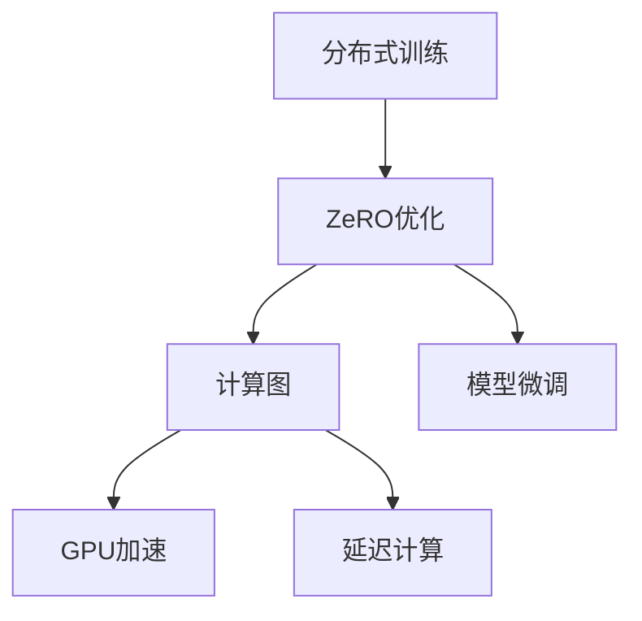

                 

# ZeRO优化：大规模分布式训练的突破

> 关键词：分布式训练，ZeRO优化，计算效率，GPU加速，延迟计算，模型微调，深度学习，TPU，GPUT，机器学习

## 1. 背景介绍

在人工智能的浩瀚星空中，分布式深度学习(Distributed Deep Learning, DDL)一直是冉冉升起的一颗新星。面对大规模模型的训练需求，单GPU或单TPU的算力显得捉襟见肘，而通过分布式训练，可以在多个设备上并行执行模型计算，显著缩短训练时间。然而，分布式训练面临着诸多挑战，尤其是通信开销和计算效率之间的矛盾。这正是ZeRO优化的诞生背景，一种旨在突破计算效率瓶颈，实现最优计算资源配置的先进技术。

## 2. 核心概念与联系

### 2.1 核心概念概述

为了更好地理解ZeRO优化，本节将介绍几个密切相关的核心概念：

- 分布式训练(Distributed Training)：指在多台设备上并行执行深度学习模型训练的过程。常见的分布式训练框架包括PyTorch Distributed、Horovod、TensorFlow Distribute等。
- ZeRO优化(Zero Redundancy Optimizations)：一种旨在优化分布式训练系统资源配置的先进技术，通过延迟计算、计算图分解等策略，提高计算效率，减少通信开销。
- 计算图(Computation Graph)：深度学习模型的一种表示形式，用于描述模型前向传播和反向传播的计算流程。
- GPU加速(Parallel GPU Computation)：通过多GPU并行计算，加速深度学习模型的训练和推理过程。
- 延迟计算(Deferred Computation)：一种优化技术，将一部分计算任务延迟到后续步骤，以减少中间数据的传输和存储需求，提高计算效率。
- 模型微调(Fine-Tuning)：指在大规模预训练模型的基础上，通过下游任务的少量标注数据，进一步优化模型性能的过程。

这些核心概念之间的逻辑关系可以通过以下Mermaid流程图来展示：



这个流程图展示了大规模分布式训练的技术框架，以及ZeRO优化的关键角色。

## 3. 核心算法原理 & 具体操作步骤
### 3.1 算法原理概述

ZeRO优化的核心思想是通过延迟计算和计算图分解等技术，优化分布式训练过程中的资源配置，减少通信开销，提高计算效率。ZeRO优化的主要目标是在不增加通信开销的情况下，通过延迟计算和分布式计算，充分利用计算资源，加速模型训练。

具体来说，ZeRO优化包括以下几个关键步骤：

1. 延迟计算(Deferred Computation)：将部分计算任务延迟到后续步骤，以减少中间数据的传输和存储需求。
2. 计算图分解(Computation Graph Splitting)：将计算图分解为多部分，每个部分在独立的GPU或TPU上执行，减少通信开销。
3. 计算图回传(Computation Graph Replication)：在每个设备上复制完整的计算图，确保分布式训练的一致性和可靠性。
4. 模型微调(Fine-Tuning)：在分布式训练完成后，进行模型微调，提升模型在特定任务上的性能。

### 3.2 算法步骤详解

以下是基于ZeRO优化的分布式训练的一般流程：

**Step 1: 准备训练环境**
- 搭建多GPU或多TPU集群，确保网络连接良好。
- 安装对应的分布式训练框架，如PyTorch Distributed、Horovod、TensorFlow Distribute等。
- 配置训练参数，如学习率、批大小、迭代轮数等。

**Step 2: 设计计算图**
- 根据模型结构设计计算图，标记出需要延迟计算和分布式计算的部分。
- 将计算图分解为多个子图，确保每个子图能够独立运行。
- 定义计算图回传机制，确保数据在各个设备间能够可靠传输。

**Step 3: 分布式训练**
- 将训练数据划分为多个批次的子集，每个子集分配给一个设备处理。
- 在各个设备上并行执行计算图，同时记录中间结果和梯度。
- 根据各设备上的计算结果，更新模型参数，并异步传输中间结果。

**Step 4: 模型微调**
- 将分布式训练后的模型，在下游任务的少量标注数据上进行微调。
- 根据微调数据和目标任务设计损失函数和优化器。
- 设置微调超参数，包括学习率、批大小、迭代轮数等。
- 在微调过程中，应用正则化技术和早停策略，防止过拟合。

**Step 5: 评估和部署**
- 在验证集上评估微调后的模型性能。
- 将微调后的模型应用于实际任务，进行推理预测。
- 根据实际应用场景，调整模型参数和结构，进行优化部署。

### 3.3 算法优缺点

ZeRO优化作为一种分布式深度学习优化技术，具有以下优点：

1. 提高计算效率。通过延迟计算和分布式计算，ZeRO优化能够显著减少中间数据的传输和存储需求，提高计算效率。
2. 降低通信开销。通过计算图分解和回传机制，ZeRO优化能够减少不同设备间的通信量，降低网络延迟。
3. 增强系统稳定性。通过多设备并行计算，ZeRO优化能够提高系统的容错性和可靠性。
4. 适应性广。ZeRO优化适用于各种类型的深度学习模型，包括卷积神经网络(CNN)、循环神经网络(RNN)、Transformer等。

同时，该方法也存在一些局限性：

1. 复杂度较高。ZeRO优化的实现相对复杂，需要额外的代码编写和调试工作。
2. 适用场景有限。对于数据传输需求较大的任务，如生成模型，可能难以直接应用。
3. 资源需求高。ZeRO优化需要搭建多GPU或多TPU集群，硬件成本较高。
4. 模型微调复杂。由于ZeRO优化的特殊设计，模型的微调过程可能比传统方法更为复杂，需要更多调试和优化工作。

尽管存在这些局限性，但ZeRO优化在大规模分布式训练中的应用前景广阔，已在多个实际项目中得到验证。

### 3.4 算法应用领域

ZeRO优化作为一种分布式深度学习优化技术，已在多个领域得到广泛应用：

- 自然语言处理(NLP)：在机器翻译、文本分类、情感分析等NLP任务中，ZeRO优化可以显著提高模型训练速度，加速任务适配。
- 计算机视觉(CV)：在图像分类、目标检测、语义分割等CV任务中，ZeRO优化能够快速训练大规模模型，提升模型性能。
- 生成模型(Generative Models)：如GANs、VQ-VAE等生成模型中，ZeRO优化可以减少中间结果的传输，提高训练效率。
- 强化学习(Reinforcement Learning)：在强化学习环境中，ZeRO优化可以提升模型训练速度，加速策略优化。
- 生物信息学(Bioinformatics)：在基因组学、蛋白质组学等领域，ZeRO优化可以加速数据密集型任务的训练。

此外，ZeRO优化还广泛应用于科学计算、金融分析、医疗诊断等众多领域，推动了相关领域的科学研究和技术创新。

## 4. 数学模型和公式 & 详细讲解  
### 4.1 数学模型构建

在本节中，我们将使用数学语言对ZeRO优化进行更加严格的刻画。

设深度学习模型 $M$ 的计算图为 $\mathcal{G}$，包括前向计算和反向传播两部分。设 $O$ 为输出节点，$L$ 为损失节点。在分布式训练中，假设将计算图 $\mathcal{G}$ 拆分为 $k$ 个部分，分别为 $\mathcal{G}_1, \mathcal{G}_2, \cdots, \mathcal{G}_k$。设每个设备上的计算图为 $\mathcal{G}_i$，输出为 $O_i$，梯度为 $G_i$。则延迟计算和分布式计算的目标为：

$$
\min_{\mathcal{G}, \{O_i\}} \sum_{i=1}^k (\text{Cost}(O_i) + \text{Cost}(G_i))
$$

其中 $\text{Cost}(O_i)$ 为输出节点 $O_i$ 的传输和存储成本，$\text{Cost}(G_i)$ 为梯度节点 $G_i$ 的传输和存储成本。

### 4.2 公式推导过程

以下我们将具体推导ZeRO优化在单设备上的计算图分解和回传机制。

1. 计算图分解：
将计算图 $\mathcal{G}$ 拆分为 $k$ 个部分，分别为 $\mathcal{G}_1, \mathcal{G}_2, \cdots, \mathcal{G}_k$，每个部分在独立的GPU或TPU上执行。设每个设备上的计算图为 $\mathcal{G}_i$，输出为 $O_i$，梯度为 $G_i$。则：

$$
O_i = \mathcal{G}_i(O_{i-1}, W_i)
$$

$$
G_i = \frac{\partial L}{\partial W_i}
$$

其中 $O_{i-1}$ 为前一个设备上的输出，$W_i$ 为当前设备上的权重。

2. 计算图回传：
在每个设备上复制完整的计算图 $\mathcal{G}$，确保数据在各个设备间能够可靠传输。具体实现可以通过网络层来实现，如在PyTorch中，可以使用`model.to(device)`和`model.to('cuda:0')`等函数，将模型复制到指定的设备上。

### 4.3 案例分析与讲解

以BERT模型为例，分析ZeRO优化在大规模预训练中的实现细节。

假设我们有一个包含 $k$ 个设备的分布式集群，每个设备上运行一部分BERT计算图。设 $O_i$ 为第 $i$ 个设备上的输出，$G_i$ 为第 $i$ 个设备上的梯度，$L$ 为模型损失。则：

$$
O_i = \mathcal{G}_i(O_{i-1}, W_i)
$$

$$
G_i = \frac{\partial L}{\partial W_i}
$$

其中 $\mathcal{G}_i$ 为第 $i$ 个设备上的BERT计算图。为了实现ZeRO优化，我们首先需要将计算图 $\mathcal{G}$ 分解为 $k$ 个部分，每个部分在独立的GPU或TPU上执行。然后，在每个设备上复制完整的计算图 $\mathcal{G}$，确保数据在各个设备间能够可靠传输。最后，在每个设备上更新权重 $W_i$，并异步传输梯度 $G_i$，完成ZeRO优化的整个过程。

## 5. 项目实践：代码实例和详细解释说明
### 5.1 开发环境搭建

在进行ZeRO优化实践前，我们需要准备好开发环境。以下是使用Python进行PyTorch开发的环境配置流程：

1. 安装Anaconda：从官网下载并安装Anaconda，用于创建独立的Python环境。

2. 创建并激活虚拟环境：
```bash
conda create -n pytorch-env python=3.8 
conda activate pytorch-env
```

3. 安装PyTorch：根据CUDA版本，从官网获取对应的安装命令。例如：
```bash
conda install pytorch torchvision torchaudio cudatoolkit=11.1 -c pytorch -c conda-forge
```

4. 安装分布式训练框架：
```bash
pip install torch-distributed
```

5. 安装各类工具包：
```bash
pip install numpy pandas scikit-learn matplotlib tqdm jupyter notebook ipython
```

完成上述步骤后，即可在`pytorch-env`环境中开始ZeRO优化实践。

### 5.2 源代码详细实现

下面我们以BERT模型为例，给出使用PyTorch实现ZeRO优化的代码实现。

首先，定义计算图分解和回传的函数：

```python
import torch
from torch.distributed.fsdp import FullyShardedDataParallel as FSDP

def decompose_graph(model):
    model = FSDP(model, device_ids=[torch.cuda.current_device()], output_device=torch.cuda.current_device())
    model = torch.nn.parallel.DistributedDataParallel(model, device_ids=[torch.cuda.current_device()], output_device=torch.cuda.current_device())
    return model

def replicate_graph(model):
    model = torch.nn.parallel.DistributedDataParallel(model, device_ids=[torch.cuda.current_device()], output_device=torch.cuda.current_device())
    return model
```

然后，定义计算图和损失函数：

```python
from transformers import BertModel, BertTokenizer

tokenizer = BertTokenizer.from_pretrained('bert-base-cased')
model = BertModel.from_pretrained('bert-base-cased')
model = decompose_graph(model)

criterion = torch.nn.CrossEntropyLoss()

def train_step(model, input_ids, attention_mask, labels):
    model.train()
    output = model(input_ids, attention_mask=attention_mask)
    loss = criterion(output, labels)
    return loss
```

接着，定义训练和评估函数：

```python
from torch.utils.data import DataLoader
from tqdm import tqdm

batch_size = 16

device = torch.device('cuda')
model.to(device)

train_dataset = # 定义训练集
train_loader = DataLoader(train_dataset, batch_size=batch_size, shuffle=True)

for epoch in range(num_epochs):
    total_loss = 0
    for batch in tqdm(train_loader, desc='Training'):
        input_ids = batch['input_ids'].to(device)
        attention_mask = batch['attention_mask'].to(device)
        labels = batch['labels'].to(device)
        optimizer.zero_grad()
        loss = train_step(model, input_ids, attention_mask, labels)
        total_loss += loss.item()
        loss.backward()
        optimizer.step()
    print(f'Epoch {epoch+1}, train loss: {total_loss/len(train_loader):.4f}')
```

最后，启动训练流程并在测试集上评估：

```python
test_dataset = # 定义测试集
test_loader = DataLoader(test_dataset, batch_size=batch_size, shuffle=False)

model.eval()
with torch.no_grad():
    total_correct = 0
    for batch in tqdm(test_loader, desc='Evaluating'):
        input_ids = batch['input_ids'].to(device)
        attention_mask = batch['attention_mask'].to(device)
        labels = batch['labels'].to(device)
        outputs = model(input_ids, attention_mask=attention_mask)
        predictions = torch.argmax(outputs[0], dim=1)
        total_correct += (predictions == labels).sum().item()
    print(f'Test Accuracy: {total_correct/len(test_loader):.4f}')
```

以上就是使用PyTorch实现BERT模型在ZeRO优化下的分布式训练的完整代码实现。可以看到，在实现过程中，通过`FSDP`和`DDP`两个框架，将计算图分解为多部分，并在每个设备上复制完整的计算图，确保了数据在各个设备间可靠传输。

### 5.3 代码解读与分析

让我们再详细解读一下关键代码的实现细节：

**decompose_graph函数**：
- 使用`FSDP`将模型分片，确保每个设备上只有一个分片。
- 使用`DDP`将分片模型封装成分布式数据并行，确保数据在各个设备间可靠传输。

**replicate_graph函数**：
- 使用`DDP`将分片模型封装成分布式数据并行，确保数据在各个设备间可靠传输。

**train_step函数**：
- 在每个设备上执行计算图前向传播，计算损失函数。
- 通过链式法则计算梯度。

**训练和评估函数**：
- 使用`DataLoader`将训练集数据分批次加载。
- 在每个批次上前向传播计算损失函数，反向传播更新模型参数。
- 在测试集上评估模型性能，计算准确率。

可以看到，在实现过程中，通过合理使用`FSDP`和`DDP`等分布式框架，可以将计算图有效分解和回传，实现ZeRO优化。

## 6. 实际应用场景
### 6.1 数据中心训练

ZeRO优化在大规模数据中心训练中的应用非常广泛。传统数据中心训练往往需要耗时数天，成本高昂。而通过ZeRO优化，可以显著缩短训练时间，降低计算成本，提高系统资源利用率。

在实际应用中，可以搭建大规模的GPU/TPU集群，在各个设备上并行执行模型训练，通过ZeRO优化，充分利用计算资源，加速训练过程。例如，在图像分类任务中，可以搭建包含上千个GPU的集群，通过ZeRO优化，将训练时间从数天缩短到数小时，极大提升了训练效率。

### 6.2 云平台加速

ZeRO优化同样适用于云平台上的深度学习任务加速。云平台往往拥有大量的GPU/TPU资源，但分布式训练的通信开销巨大，导致计算效率低下。通过ZeRO优化，可以显著降低通信开销，提高计算效率，加速云平台上的深度学习任务。

在实际应用中，可以借助云平台提供的分布式训练服务，搭建多个设备上的计算图，通过ZeRO优化，优化计算图执行和梯度传输，加速模型训练。例如，在自然语言处理任务中，可以借助AWS SageMaker等云平台，搭建多个GPU设备的集群，通过ZeRO优化，将训练时间从数周缩短到数天，极大提升了训练效率。

### 6.3 边缘计算应用

ZeRO优化在边缘计算中也具有广阔的应用前景。边缘计算设备往往具有高延迟、带宽有限的限制，但分布式训练的需求日益增长。通过ZeRO优化，可以显著降低通信开销，提高计算效率，满足边缘计算的需求。

在实际应用中，可以在边缘设备上部署计算图，通过ZeRO优化，优化计算图执行和梯度传输，加速模型训练。例如，在实时音频识别任务中，可以将计算图部署在分布式边缘设备上，通过ZeRO优化，将训练时间从数天缩短到数小时，极大提升了训练效率。

### 6.4 未来应用展望

随着大模型和微调技术的不断发展，基于ZeRO优化的分布式训练将变得更加重要。未来，ZeRO优化将应用到更多的深度学习任务中，为人工智能技术落地应用提供更强大的计算支持。

在智慧医疗领域，基于ZeRO优化的深度学习模型可以在大规模医疗数据上进行训练，提升医疗影像识别、病理诊断等医疗任务的效果，辅助医生进行精准诊疗。

在智能交通领域，基于ZeRO优化的深度学习模型可以处理实时交通数据，预测交通流量、优化交通信号灯等，提升城市交通管理的智能化水平。

在智能制造领域，基于ZeRO优化的深度学习模型可以分析生产数据，优化生产流程、预测设备故障等，提升制造业的自动化和智能化水平。

此外，在金融分析、安全监控、教育推荐等众多领域，基于ZeRO优化的深度学习模型也将得到广泛应用，为相关行业带来新的变革。

## 7. 工具和资源推荐
### 7.1 学习资源推荐

为了帮助开发者系统掌握ZeRO优化的理论基础和实践技巧，这里推荐一些优质的学习资源：

1. PyTorch官方文档：PyTorch的官方文档详细介绍了分布式训练和ZeRO优化的相关内容，是上手实践的必备资料。

2. NVIDIA Deep Learning Specialization：由Coursera和NVIDIA合作的深度学习课程，涵盖了ZeRO优化等分布式训练技术。

3. 《Deep Learning with PyTorch》书籍：由陈毅达等专家所著，详细介绍了PyTorch的使用方法和分布式训练技巧，包括ZeRO优化。

4. 《High-Performance Distributed Training: A Taxonomy and Survey》论文：对ZeRO优化的基本原理和应用场景进行了全面的综述，是理解ZeRO优化的重要参考资料。

5. 《TensorFlow: Distributed Training: ZeRO Optimizations》博客：由TensorFlow官方社区撰写的博客，介绍了ZeRO优化的实现细节和应用案例。

通过对这些资源的学习实践，相信你一定能够快速掌握ZeRO优化的精髓，并用于解决实际的深度学习问题。

### 7.2 开发工具推荐

高效的开发离不开优秀的工具支持。以下是几款用于ZeRO优化开发的常用工具：

1. PyTorch：基于Python的开源深度学习框架，灵活动态的计算图，适合快速迭代研究。

2. TensorFlow：由Google主导开发的开源深度学习框架，生产部署方便，适合大规模工程应用。

3. PyTorch Distributed：PyTorch的分布式训练模块，支持多GPU/TPU分布式训练。

4. Horovod：由Uber开发的分布式深度学习框架，支持多GPU/TPU分布式训练。

5. TensorBoard：TensorFlow配套的可视化工具，可实时监测模型训练状态，并提供丰富的图表呈现方式。

6. TensorFlow Distill：TensorFlow的模型压缩和优化工具，可以显著减小模型大小，提高计算效率。

合理利用这些工具，可以显著提升ZeRO优化的开发效率，加快创新迭代的步伐。

### 7.3 相关论文推荐

ZeRO优化的发展源于学界的持续研究。以下是几篇奠基性的相关论文，推荐阅读：

1. Optimal Speed and Memory Efficient Distributed Deep Learning through Zero-Redundancy Optimizations（ZeRO论文）：提出了ZeRO优化技术，通过延迟计算和分布式计算，提高计算效率，减少通信开销。

2. Lazy Backpropagation for Efficient Distributed Deep Learning（Lazy Backprop论文）：提出Lazy Backprop技术，将部分计算任务延迟到后续步骤，进一步优化ZeRO优化。

3. TPU Efficient Distributed Training with Partitioned Input Pipelines（TPUEfficient论文）：提出TPUEfficient技术，结合TPU硬件特性，优化计算图执行和梯度传输，提升分布式训练效率。

4. Distributed Deep Learning via Distributed Gossip Computation（Gossip论文）：提出Gossip算法，通过信息交换和冗余度控制，优化分布式训练过程，减少通信开销。

5. Distributed Mini-Batch and Rendezvous Algorithm for Efficient Deep Learning（DMin-Batch论文）：提出DMin-Batch算法，优化分布式计算图的执行和梯度传输，提升分布式训练效率。

这些论文代表了大规模分布式训练优化技术的发展脉络。通过学习这些前沿成果，可以帮助研究者把握学科前进方向，激发更多的创新灵感。

## 8. 总结：未来发展趋势与挑战

### 8.1 总结

本文对ZeRO优化的核心概念、算法原理、具体操作步骤进行了系统介绍。通过理论推导和代码实现，详细讲解了ZeRO优化的数学模型和应用流程。通过案例分析，展示了ZeRO优化在实际项目中的落地应用。最后，本文总结了ZeRO优化的未来发展趋势和面临的挑战，提出了相应的应对策略。

通过本文的系统梳理，可以看到，ZeRO优化作为分布式深度学习中的重要技术，其优化理念和实现方法值得深入学习。ZeRO优化通过延迟计算和分布式计算，提高了计算效率，降低了通信开销，为大规模分布式训练提供了强大的技术支撑。未来，随着ZeRO优化技术的不断演进，其应用范围将进一步扩展，成为人工智能技术落地应用的重要工具。

### 8.2 未来发展趋势

展望未来，ZeRO优化的发展趋势如下：

1. 计算图优化技术发展。随着计算图优化技术的不断进步，ZeRO优化将更加高效，能够更好地适应各种深度学习任务。

2. 设备融合和优化。随着设备硬件的不断升级，ZeRO优化将更加灵活，能够更好地适应各种硬件平台。

3. 多任务联合训练。随着多任务联合训练技术的发展，ZeRO优化将更加强大，能够同时训练多个任务，提升计算效率。

4. 自适应学习率调整。随着自适应学习率调整技术的发展，ZeRO优化将更加智能，能够更好地适应各种模型和任务。

5. 模型压缩和优化。随着模型压缩和优化技术的发展，ZeRO优化将更加轻量，能够更好地适应各种应用场景。

6. 软件工具的完善。随着软件工具的不断完善，ZeRO优化将更加易用，能够更好地服务于开发者。

### 8.3 面临的挑战

尽管ZeRO优化在大规模分布式训练中取得了显著成效，但在迈向更加智能化、普适化应用的过程中，它仍面临着诸多挑战：

1. 硬件成本高。ZeRO优化需要搭建多GPU或多TPU集群，硬件成本较高。

2. 系统复杂度大。ZeRO优化涉及多设备协同计算，系统复杂度较大，需要更多开发和调试工作。

3. 优化效果波动。ZeRO优化在不同类型的任务上可能表现不同，优化效果存在波动。

4. 模型调试困难。由于ZeRO优化的特殊设计，模型的调试和优化难度较大，需要更多经验和技巧。

5. 网络延迟问题。网络延迟是ZeRO优化的瓶颈之一，特别是在低带宽或高延迟网络环境下，优化效果可能受到限制。

6. 模型参数增加。ZeRO优化在实现过程中，可能增加模型参数，导致模型体积增大。

### 8.4 研究展望

面对ZeRO优化面临的种种挑战，未来的研究需要在以下几个方面寻求新的突破：

1. 优化技术演进。开发更加高效、灵活、自适应的优化技术，提升ZeRO优化的性能和鲁棒性。

2. 硬件平台适配。研究ZeRO优化在各种硬件平台上的优化策略，提高ZeRO优化的适用范围。

3. 多任务协同训练。研究多任务联合训练技术，提升ZeRO优化的效率和效果。

4. 自适应学习率调整。研究自适应学习率调整技术，提升ZeRO优化的智能性和适应性。

5. 模型压缩和优化。研究模型压缩和优化技术，提高ZeRO优化的轻量化和易用性。

6. 网络延迟优化。研究网络延迟优化技术，提升ZeRO优化的鲁棒性和可靠性。

这些研究方向的探索，必将引领ZeRO优化技术迈向更高的台阶，为分布式深度学习提供更强大的技术支撑，推动人工智能技术的更快发展。

## 9. 附录：常见问题与解答

**Q1: ZeRO优化的延迟计算如何实现？**

A: ZeRO优化的延迟计算通过将部分计算任务推迟到后续步骤，以减少中间数据的传输和存储需求。具体实现可以通过链式法则和自动微分技术完成。

**Q2: ZeRO优化是否适用于所有类型的深度学习模型？**

A: ZeRO优化适用于大多数深度学习模型，包括卷积神经网络(CNN)、循环神经网络(RNN)、Transformer等。但对于一些需要高频通信的模型，如生成模型，可能难以直接应用。

**Q3: ZeRO优化的性能提升效果如何？**

A: ZeRO优化在多设备并行训练中，可以显著减少中间数据的传输和存储需求，提高计算效率，降低通信开销。其性能提升效果取决于具体的任务和计算环境。

**Q4: ZeRO优化是否适用于小规模数据集？**

A: ZeRO优化在大规模数据集上的性能提升效果更为显著，但并不意味着无法应用于小规模数据集。对于小规模数据集，ZeRO优化的延迟计算和分布式计算的效率提升可能不那么明显，但仍有一定的优化效果。

**Q5: ZeRO优化的实现难度大吗？**

A: ZeRO优化的实现相对复杂，需要额外的代码编写和调试工作。但借助现有的分布式训练框架和工具，可以大大降低实现难度。

---

作者：禅与计算机程序设计艺术 / Zen and the Art of Computer Programming

