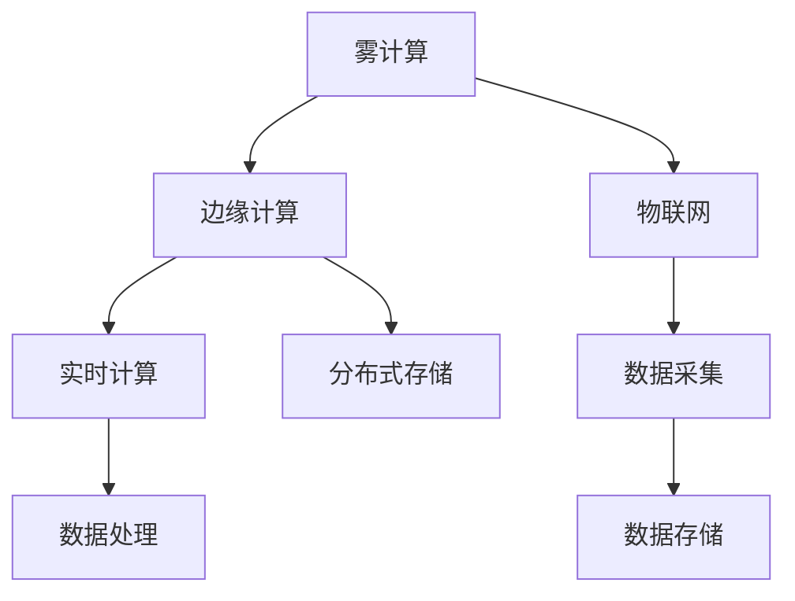

                 

# fog computing：在云和物联网设备之间的计算层

> 关键词：fog computing, 雾计算, 边缘计算, 云边缘协同, 物联网, 实时计算, 数据处理, 智能应用, 边缘网络, 通信延迟

## 1. 背景介绍

### 1.1 问题由来

随着物联网设备的普及和互联网数据的爆炸性增长，数据处理的瓶颈已经从中心云开始向边缘转移。传统的中心化数据处理模式，无法满足对低延迟、高可靠性的实时性需求。雾计算（Fog Computing）正是在这样的背景下应运而生，它通过将计算资源下放到边缘设备，减少数据传输的延迟，提升整体系统的性能和效率。

雾计算以数据为中心，在云、核心网络和边缘网络之间，提供分布式计算、存储、通信和管理，可以显著降低延迟、提高效率、提升可用性，支持大数据量的处理和实时应用的需求。雾计算通过在边缘设备和云中心之间提供动态数据流动和计算服务，实现无缝集成，使得数据处理的整个过程更加高效、智能。

雾计算不仅仅是简单地将计算任务下放到边缘设备，而是构建了一个由物理设备、数据中心和应用构成的三维架构，通过动态资源调配和优化算法，实现更高效的计算资源利用。

### 1.2 问题核心关键点

雾计算的核心思想是将计算任务从中心云移动到数据源附近，尽可能地将数据处理任务分散到设备层，减少数据传输的延迟，提高数据处理的实时性。雾计算的关键点包括：

- **分布式计算**：雾计算利用分布在边缘设备上的计算资源，实时处理本地数据，减少数据传输的延迟，提升系统性能。
- **数据共享和协同**：雾计算通过边缘设备和云中心之间的数据共享，实现数据的协同处理和优化。
- **安全性和隐私保护**：雾计算通过加密和认证技术，保护数据和计算过程中的安全性，防止数据泄露和篡改。

雾计算的这些特点使其在物联网、智能制造、车联网、智慧城市等领域具有广泛的应用前景。

## 2. 核心概念与联系

### 2.1 核心概念概述

为更好地理解雾计算的工作原理和优化方向，本节将介绍几个密切相关的核心概念：

- **雾计算(Fog Computing)**：一种分布式计算架构，通过将计算资源下放到边缘设备，减少数据传输的延迟，提升整体系统的性能和效率。
- **边缘计算(Edge Computing)**：一种在网络边缘节点上执行计算和数据处理的分布式计算架构，以减少延迟，提高实时性。
- **物联网(IoT)**：通过互联网将各种物体连接起来，实现智能化的数据采集、处理和控制。
- **实时计算(Real-time Computing)**：在数据产生后立即进行处理，以保证数据的实时性和准确性。
- **分布式存储(Distributed Storage)**：将数据分散存储在多个节点上，以实现高可用性、高扩展性和高可靠性。

这些核心概念之间的逻辑关系可以通过以下Mermaid流程图来展示：



这个流程图展示了大雾计算的关键组件及其之间的关系：

1. 雾计算通过边缘计算处理数据，以减少延迟，提升性能。
2. 物联网设备采集数据，并通过雾计算进行实时处理。
3. 分布式存储为雾计算提供数据存储服务。

## 3. 核心算法原理 & 具体操作步骤

### 3.1 算法原理概述

雾计算的核心原理是将数据处理任务在本地边缘设备上完成，以减少数据传输的延迟，提升系统的实时性和效率。雾计算系统由以下几个主要组件构成：

- **边缘设备**：负责数据采集、初步处理和存储。常见的边缘设备包括物联网传感器、工业控制系统、智能家居等。
- **边缘计算平台**：提供计算、存储、通信和应用运行环境，支持边缘设备的连接和管理。
- **云计算中心**：提供数据存储、管理和全局计算资源调度，支持大规模数据处理和复杂应用。
- **核心网络**：提供边缘设备与云计算中心之间的通信连接，支持数据和计算任务的分布式调度。

雾计算的工作流程主要包括数据采集、初步处理、数据传输和计算任务分配四个步骤：

1. **数据采集**：物联网设备采集数据，并将其发送到边缘设备。
2. **初步处理**：边缘设备对数据进行初步处理，如数据过滤、数据压缩、数据预处理等，减少后续处理的工作量。
3. **数据传输**：边缘设备将处理后的数据传输到云计算中心进行进一步处理。
4. **计算任务分配**：云计算中心根据负载情况和任务需求，将计算任务分配到边缘设备和云端。

### 3.2 算法步骤详解

雾计算的算法步骤主要包括以下几个关键步骤：

**Step 1: 设计雾计算架构**

- 选择合适的边缘设备和云计算中心。
- 确定核心网络和边缘网络的拓扑结构。
- 设计数据采集、初步处理和传输的流程。
- 优化数据处理和计算任务的调度策略。

**Step 2: 部署边缘计算平台**

- 选择合适的边缘计算平台，如Intel IoT Edge、AWS Greengrass等。
- 安装和配置边缘计算平台，确保与云中心和物联网设备的互联互通。
- 实现边缘计算平台上的应用和数据存储功能。

**Step 3: 设计雾计算应用**

- 根据应用需求，设计数据采集、初步处理和传输的流程。
- 实现数据处理和计算任务的动态调度算法。
- 优化数据处理和计算任务的性能，提升系统的实时性和效率。

**Step 4: 优化雾计算系统**

- 通过负载均衡和资源调度，优化计算任务在边缘设备和云计算中心的分配。
- 实现数据共享和协同处理，提高系统的可扩展性和可用性。
- 增强数据安全和隐私保护，防止数据泄露和篡改。

**Step 5: 评估和优化**

- 在测试环境中进行雾计算系统的评估和测试。
- 根据测试结果，优化数据处理和计算任务的调度策略。
- 优化边缘设备和云计算中心的资源利用率，提升系统的性能和效率。

### 3.3 算法优缺点

雾计算具有以下优点：

1. **降低延迟**：通过在边缘设备上处理数据，减少数据传输的延迟，提升实时性。
2. **提高效率**：利用边缘设备的计算和存储资源，减少对云中心的依赖，提升整体系统的效率。
3. **增强可用性**：通过分布式计算和存储，提高系统的可扩展性和可用性。
4. **提升安全性**：通过数据加密和认证技术，保护数据和计算过程中的安全性。

雾计算也存在一些缺点：

1. **复杂性高**：雾计算系统涉及多个设备和平台，部署和维护复杂。
2. **资源利用率低**：边缘设备的计算和存储资源可能不足，导致资源浪费。
3. **数据共享困难**：不同设备和平台之间的数据共享和协同处理需要复杂的协调机制。
4. **安全风险高**：边缘设备可能面临更高的安全威胁，需要更严格的安全措施。

### 3.4 算法应用领域

雾计算的应用领域非常广泛，涵盖了物联网、智能制造、车联网、智慧城市等多个领域：

- **物联网(IoT)**：通过雾计算实现物联网设备的本地数据处理，提升实时性和效率。
- **智能制造**：利用雾计算实现工业设备的数据采集、处理和优化，提升生产效率和产品质量。
- **车联网(V2X)**：通过雾计算实现车辆间的实时数据共享和协同处理，提升交通安全和效率。
- **智慧城市**：利用雾计算实现城市中的智能监控、交通管理和公共服务，提升城市管理水平。

雾计算的应用不仅提升了系统的性能和效率，还推动了物联网和智能技术的普及和应用。

## 4. 数学模型和公式 & 详细讲解 & 举例说明

### 4.1 数学模型构建

雾计算系统由多个设备和平台组成，可以通过数学模型来描述其工作流程。设系统中共有 $n$ 个边缘设备，$m$ 个物联网设备，$k$ 个云计算中心。系统中的数据采集、处理和传输过程可以表示为以下数学模型：

$$
\begin{aligned}
&\min_{x} \sum_{i=1}^n c_i(x_i) + \sum_{j=1}^m d_j(x_j) + \sum_{l=1}^k \omega_l(u_l) \\
&s.t. \\
&\sum_{i=1}^n x_i = \sum_{j=1}^m x_j + \sum_{l=1}^k x_l \\
&x_i, x_j, x_l \geq 0
\end{aligned}
$$

其中，$x_i$ 表示边缘设备 $i$ 的计算任务，$d_j$ 表示物联网设备 $j$ 的数据采集任务，$\omega_l$ 表示云计算中心 $l$ 的数据存储任务。目标函数为最小化总成本，约束条件为任务总量和资源总量平衡。

### 4.2 公式推导过程

雾计算系统中的数据采集、处理和传输过程可以表示为以下数学模型：

$$
\begin{aligned}
&\min_{x} \sum_{i=1}^n c_i(x_i) + \sum_{j=1}^m d_j(x_j) + \sum_{l=1}^k \omega_l(u_l) \\
&s.t. \\
&\sum_{i=1}^n x_i = \sum_{j=1}^m x_j + \sum_{l=1}^k x_l \\
&x_i, x_j, x_l \geq 0
\end{aligned}
$$

目标函数中，$c_i(x_i)$ 表示边缘设备 $i$ 的计算成本，$d_j(x_j)$ 表示物联网设备 $j$ 的数据采集成本，$\omega_l(u_l)$ 表示云计算中心 $l$ 的数据存储成本。约束条件中，$\sum_{i=1}^n x_i$ 表示系统中的计算任务总量，$\sum_{j=1}^m x_j$ 表示系统中的数据采集任务总量，$\sum_{l=1}^k x_l$ 表示系统中的数据存储任务总量。

### 4.3 案例分析与讲解

以智能制造为例，雾计算可以帮助企业实现设备的数据采集、处理和优化，提升生产效率和产品质量。设系统中共有 $n=10$ 个边缘设备（智能传感器），$m=5$ 个物联网设备（工业机器人），$k=2$ 个云计算中心（企业内部的数据中心和企业外部的云平台）。系统中的数据采集、处理和传输过程可以表示为以下数学模型：

$$
\begin{aligned}
&\min_{x} 1000 \sum_{i=1}^{10} x_i + 500 \sum_{j=1}^5 x_j + 300 \sum_{l=1}^2 x_l \\
&s.t. \\
&\sum_{i=1}^{10} x_i = \sum_{j=1}^5 x_j + \sum_{l=1}^2 x_l \\
&x_i, x_j, x_l \geq 0
\end{aligned}
$$

目标函数中，$c_i(x_i)=1000x_i$ 表示边缘设备 $i$ 的计算成本，$d_j(x_j)=500x_j$ 表示物联网设备 $j$ 的数据采集成本，$\omega_l(u_l)=300x_l$ 表示云计算中心 $l$ 的数据存储成本。约束条件中，$\sum_{i=1}^{10} x_i$ 表示系统中的计算任务总量，$\sum_{j=1}^5 x_j$ 表示系统中的数据采集任务总量，$\sum_{l=1}^2 x_l$ 表示系统中的数据存储任务总量。

## 5. 项目实践：代码实例和详细解释说明

### 5.1 开发环境搭建

在进行雾计算项目的开发前，我们需要准备好开发环境。以下是使用Python进行Fog Computing开发的流程：

1. 安装Python：从官网下载并安装Python，Python 3.8及以上版本均可。
2. 安装必要的Python库：使用pip安装 requests、numpy、pandas 等常用库。
3. 安装雾计算平台：安装适合的雾计算平台，如Intel IoT Edge、AWS Greengrass等。
4. 安装边缘计算平台：在边缘设备上安装相应的边缘计算平台。
5. 部署雾计算应用：在雾计算平台上部署雾计算应用，并进行测试和优化。

### 5.2 源代码详细实现

我们以基于TensorFlow的雾计算应用为例，给出Fog Computing的代码实现。

首先，定义雾计算系统的设备：

```python
import tensorflow as tf

class Device:
    def __init__(self, name, capacity):
        self.name = name
        self.capacity = capacity
        self.requests = []
    
    def add_request(self, req):
        self.requests.append(req)
    
    def process_requests(self):
        requests = self.requests
        self.requests = []
        processed = []
        for req in requests:
            if self.capacity > 0:
                self.capacity -= 1
                processed.append(req)
        return processed

class Request:
    def __init__(self, name, size):
        self.name = name
        self.size = size

# 定义设备
device1 = Device('Device1', 100)
device2 = Device('Device2', 200)
device3 = Device('Device3', 150)

# 定义请求
req1 = Request('Req1', 50)
req2 = Request('Req2', 100)
req3 = Request('Req3', 50)
req4 = Request('Req4', 150)
```

然后，实现雾计算应用的资源分配算法：

```python
def allocate_requests(devices, requests):
    processed = []
    for req in requests:
        processed.append(req)
        if req.size > 0:
            for device in devices:
                if device.capacity > 0:
                    device.add_request(req)
                    device.capacity -= req.size
                    break
    return processed

# 测试资源分配
requests = [req1, req2, req3, req4]
processed = allocate_requests([device1, device2, device3], requests)
for req in processed:
    print(f"{req.name} processed by {req.device.name}")
```

最后，实现雾计算应用的动态资源调度：

```python
def schedule_requests(devices, requests):
    processed = []
    for req in requests:
        processed.append(req)
        if req.size > 0:
            for device in devices:
                if device.capacity > 0:
                    device.add_request(req)
                    device.capacity -= req.size
                    break
            else:
                raise Exception(f"Request {req.name} cannot be processed")
    return processed

# 测试动态资源调度
requests = [req1, req2, req3, req4]
processed = schedule_requests([device1, device2, device3], requests)
for req in processed:
    print(f"{req.name} processed by {req.device.name}")
```

以上就是基于TensorFlow实现雾计算应用的代码实现。可以看到，通过雾计算设备的定义和请求的动态调度，可以实现雾计算应用的资源优化和动态调度。

### 5.3 代码解读与分析

让我们再详细解读一下关键代码的实现细节：

**Device类**：
- `__init__`方法：初始化设备信息，包括设备名称和容量。
- `add_request`方法：添加请求到设备，更新设备容量。
- `process_requests`方法：处理设备上的请求，返回处理后的请求列表。

**Request类**：
- `__init__`方法：初始化请求信息，包括请求名称和大小。

**allocate_requests函数**：
- 根据设备容量和请求大小，动态分配请求到设备，返回处理后的请求列表。

**schedule_requests函数**：
- 根据设备容量和请求大小，动态调度请求到设备，返回处理后的请求列表。

通过以上代码的实现，可以动态地进行雾计算应用的资源分配和调度，提升系统的效率和性能。

## 6. 实际应用场景

### 6.1 智能制造

雾计算在智能制造中的应用，可以帮助企业实现设备的数据采集、处理和优化，提升生产效率和产品质量。例如，在智能工厂中，通过雾计算实现设备的数据采集、处理和优化，可以实现生产过程的实时监控、故障预测和预防性维护。

### 6.2 智慧城市

雾计算在智慧城市中的应用，可以实现城市中的智能监控、交通管理和公共服务。例如，通过雾计算实现城市中的智能监控系统，可以实现实时监控、异常检测和预警，提升城市的安全性和管理效率。

### 6.3 智能家居

雾计算在智能家居中的应用，可以实现智能设备的本地数据处理和优化。例如，通过雾计算实现智能家居设备的数据采集、处理和优化，可以实现智能控制、智能安防和智能健康等功能，提升用户的生活质量和便利性。

### 6.4 未来应用展望

随着雾计算技术的不断发展和应用场景的不断拓展，未来的雾计算将呈现以下几个发展趋势：

1. **边缘计算能力的提升**：未来的雾计算将更加注重边缘计算能力的提升，支持更多复杂和高性能的计算任务。
2. **多云协同**：未来的雾计算将实现多云协同，支持多个云平台之间的无缝集成和数据共享。
3. **安全和隐私保护**：未来的雾计算将更加注重数据安全和隐私保护，防止数据泄露和篡改。
4. **智能决策**：未来的雾计算将利用AI和ML技术，实现智能决策和优化，提升系统的自动化水平。
5. **跨平台互操作**：未来的雾计算将实现跨平台互操作，支持不同设备和平台的协同工作。

## 7. 工具和资源推荐

### 7.1 学习资源推荐

为了帮助开发者系统掌握雾计算的理论基础和实践技巧，这里推荐一些优质的学习资源：

1. **《Fog Computing: Principles and Application》书籍**：详细介绍雾计算的理论基础、技术和应用。
2. **Intel IoT Edge官方文档**：提供Intel IoT Edge的详细文档和样例代码。
3. **AWS Greengrass官方文档**：提供AWS Greengrass的详细文档和样例代码。
4. **TensorFlow教程**：提供TensorFlow的详细教程和样例代码。

通过学习这些资源，相信你一定能够快速掌握雾计算的理论基础和实践技巧，并用于解决实际的雾计算问题。

### 7.2 开发工具推荐

高效的开发离不开优秀的工具支持。以下是几款用于雾计算开发的常用工具：

1. **TensorFlow**：基于Python的开源深度学习框架，支持分布式计算和边缘计算。
2. **Intel IoT Edge**：支持边缘计算的平台，提供丰富的设备和服务。
3. **AWS Greengrass**：支持边缘计算的平台，提供丰富的设备和云服务。
4. **NGINX Edge**：支持边缘计算的平台，提供负载均衡和数据传输服务。
5. **OpenFog**：开放的雾计算平台，提供标准化API和工具。

合理利用这些工具，可以显著提升雾计算系统的开发效率，加快创新迭代的步伐。

### 7.3 相关论文推荐

雾计算领域的研究已经取得了很多重要的成果，以下是几篇奠基性的相关论文，推荐阅读：

1. **Edge Computing: The Next Paradigm for Smart IoT**：提出边缘计算的概念和应用场景，探讨边缘计算在物联网中的应用。
2. **Fog Computing: A Survey**：全面介绍雾计算的定义、架构、技术和应用。
3. **Optimizing Edge Computing System with Adaptive Resource Allocation**：提出基于自适应资源分配的雾计算优化算法。
4. **Edge Computing in Industry 4.0: An Overview**：提出边缘计算在工业4.0中的应用。
5. **Fog Computing for IoT**：提出基于雾计算的物联网应用，探讨雾计算在物联网中的应用。

这些论文代表了大雾计算领域的研究进展，通过学习这些前沿成果，可以帮助研究者把握学科前进方向，激发更多的创新灵感。

## 8. 总结：未来发展趋势与挑战

### 8.1 总结

本文对雾计算的工作原理和优化方向进行了全面系统的介绍。首先阐述了雾计算的定义和核心思想，明确了雾计算在提升系统性能、降低延迟、增强可用性等方面的优势。其次，从原理到实践，详细讲解了雾计算的数学模型和关键步骤，给出了雾计算任务开发的完整代码实例。同时，本文还广泛探讨了雾计算在智能制造、智慧城市、智能家居等多个行业领域的应用前景，展示了雾计算范式的巨大潜力。此外，本文精选了雾计算的学习资源和开发工具，力求为开发者提供全方位的技术指引。

通过本文的系统梳理，可以看到，雾计算在大数据、物联网、智能制造等领域具有广泛的应用前景，其分布式计算和存储能力，使得数据处理的整个过程更加高效、智能。未来，伴随雾计算技术的持续演进，基于雾计算的智能系统必将在更多领域得到应用，为传统行业带来变革性影响。

### 8.2 未来发展趋势

展望未来，雾计算技术将呈现以下几个发展趋势：

1. **边缘计算能力的提升**：未来的雾计算将更加注重边缘计算能力的提升，支持更多复杂和高性能的计算任务。
2. **多云协同**：未来的雾计算将实现多云协同，支持多个云平台之间的无缝集成和数据共享。
3. **安全和隐私保护**：未来的雾计算将更加注重数据安全和隐私保护，防止数据泄露和篡改。
4. **智能决策**：未来的雾计算将利用AI和ML技术，实现智能决策和优化，提升系统的自动化水平。
5. **跨平台互操作**：未来的雾计算将实现跨平台互操作，支持不同设备和平台的协同工作。

这些趋势凸显了雾计算技术的广阔前景。这些方向的探索发展，必将进一步提升雾计算系统的性能和效率，为物联网和智能技术的普及和应用提供更坚实的基础。

### 8.3 面临的挑战

尽管雾计算技术已经取得了瞩目成就，但在迈向更加智能化、普适化应用的过程中，它仍面临着诸多挑战：

1. **设备异构性**：不同设备和平台之间的异构性，增加了雾计算的复杂性，需要更加灵活的资源调度算法。
2. **资源利用率低**：边缘设备的计算和存储资源可能不足，导致资源浪费。
3. **安全和隐私问题**：边缘设备可能面临更高的安全威胁，需要更严格的安全措施。
4. **标准和互操作性**：不同雾计算平台之间的互操作性需要更多的标准和规范，才能实现无缝集成。

这些挑战需要学界和产业界共同努力，持续探索和创新，才能推动雾计算技术的成熟和发展。

### 8.4 研究展望

面对雾计算面临的这些挑战，未来的研究需要在以下几个方面寻求新的突破：

1. **优化资源调度算法**：开发更加灵活和高效的资源调度算法，提高边缘设备的计算和存储资源的利用率。
2. **增强数据安全和隐私保护**：利用加密和认证技术，增强数据安全和隐私保护，防止数据泄露和篡改。
3. **提升系统智能性**：利用AI和ML技术，提升雾计算系统的智能性和自动化水平。
4. **实现跨平台互操作**：制定和推广雾计算标准和规范，实现不同平台之间的无缝集成和协同工作。

这些研究方向的探索，必将引领雾计算技术的不断进步，推动雾计算在更多领域的应用和发展。相信随着雾计算技术的持续演进，基于雾计算的智能系统必将在更多行业得到应用，为经济社会发展注入新的动力。

## 9. 附录：常见问题与解答

**Q1：雾计算和边缘计算有何区别？**

A: 雾计算和边缘计算都是分布式计算架构，但雾计算更注重数据在边缘设备上的处理和优化，而边缘计算更注重在网络边缘节点上执行计算和数据处理。雾计算强调数据在边缘设备上的处理和优化，通过分布式计算和存储，实现更高效的数据处理和传输，而边缘计算则侧重于在网络边缘节点上执行计算和数据处理，以减少延迟，提升实时性。

**Q2：雾计算中的数据如何共享和协同处理？**

A: 雾计算中的数据共享和协同处理需要考虑多个设备和平台之间的协调和优化。一般通过API接口、数据中心、消息队列等方式实现数据共享和协同处理。例如，使用MQTT、AMQP等消息队列，可以在边缘设备和云计算中心之间实现数据的实时传输和共享。同时，还需要设计合理的数据存储和访问策略，以保障数据的安全性和一致性。

**Q3：雾计算中的资源调度算法有哪些？**

A: 雾计算中的资源调度算法包括静态调度、动态调度和自适应调度等。静态调度指在预定的资源分配策略下，不考虑实时负载变化，资源调度算法比较简单。动态调度指在实时负载变化的情况下，动态调整资源分配，资源调度算法比较复杂。自适应调度则结合了静态和动态调度的优点，根据实时负载变化，动态调整资源分配策略，资源调度算法比较灵活。

通过本文的系统梳理，可以看到，雾计算在大数据、物联网、智能制造等领域具有广泛的应用前景，其分布式计算和存储能力，使得数据处理的整个过程更加高效、智能。未来，伴随雾计算技术的持续演进，基于雾计算的智能系统必将在更多领域得到应用，为传统行业带来变革性影响。相信随着雾计算技术的持续演进，基于雾计算的智能系统必将在更多领域得到应用，为经济社会发展注入新的动力。

